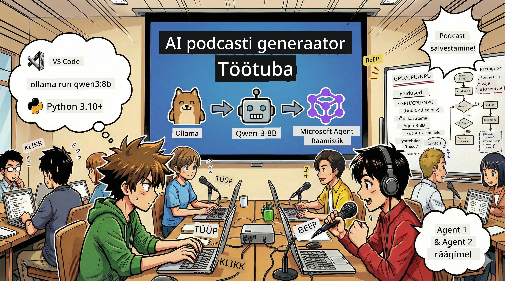

<!--
CO_OP_TRANSLATOR_METADATA:
{
  "original_hash": "aa775a734bda4590ecbe3a94a3b62197",
  "translation_date": "2026-01-05T18:05:26+00:00",
  "source_file": "WorkshopForAgentic/translation/zh-cn/README.md",
  "language_code": "et"
}
-->
# 🎙️ AI Podcast Stuudio Töötuba



## Sinu ülesanne

Tere tulemast **AI Podcast Stuudiosse**! Sa oled kohe alustamas oma tehnoloogiapodcasti „Tuleviku bait“ – aga siin on pöörang: sa ehitad üles AI-toega tootmismeeskonna, mis aitab sul seda luua. Pole enam vaja lõputut uurimistööd, käsikirjade kirjutamist ja heli redigeerimist. Selle asemel saad programmeerides saada AI üliosavaks podcasti tootjaks.

## Loo taust

Kujuta ette: sina ja su sõbrad tahate alustada podcasti kõige vingematest tehnoloogilistest trendidest, aga kõik on hõivatud õppimise, töö või elu korraldamisega. Mis oleks, kui saaksid ehitada AI-agentide tiimi, kes kogu rasket tööd sinu eest ära teeks? Üks agent teeks uurimistööd, teine kirjutaks kaasahaarava käsikirja ja kolmas teisendaks teksti loomulikuks ja sujuvaks dialoogiks. Kõlab nagu ulme? Teeme selle reaalsuseks.

## Mida sa õpid

Selle töötuba lõppedes tead, kuidas:
- 🤖 Käivitada oma kohalik AI mudel (ilma API tasudeta, ilma pilvesõltuvuseta!)
- 🔧 Koostada päriselt koostööd tegev professionaalne AI agentide meeskond
- 🎬 Luua kogu podcasti tootmisvoog ideest helini

## Sinu teekond: Kolm vaatuset

Nagu kõigi heade lugude puhul, on meil kolm vaatuset. Iga vaatus ehitab samm-sammult üles sinu AI podcastistuudio:

| Peatükk | Sinu ülesanne | Mis juhtub | Avanevad oskused |
|---------|-----------|--------------|----------------|
| **Esimene vaatus** | [Tutvu oma AI assistendiga](01.BuildAIAgentWithSLM.md) | Sa õpid, kuidas luua AI agente, kes suudavad vestelda, veebist otsida ja isegi probleemidele lahendusi pakkuda. Mõtle neile kui magamata uurimispraktikantidele. | 🎯 Koosta oma esimene agent<br>🛠️ Anna talle supervõimed (tööriistad!)<br>🧠 Õpeta teda mõtlema<br>🌐 Ühenda internetiga |
| **Teine vaatus** | [Koosta tootmismeeskond](02.AIAgentOrchestrationAndWorkflows.md) | Nüüd muutub asi huvitavaks! Sa koordineerid mitut AI agenti, kes töötavad nagu tõeline podcastimeeskond. Üks uurib, teine kirjutab, sina heaks kiidad – meeskonnatöö viib unistused teostuseni. | 🎭 Koordineeri mitut agenti<br>🔄 Koosta heakskiidustsükkel<br>🖥️ Testi DevUI liideses<br>✋ Hoia inimkontrolli |
| **Kolmas vaatus** | [Anna oma podcastile elu](03.Multi-SpeakerPodcastGenerationWithVibeVoice.md) | Grand finale! Muuda oma tekstipõhine käsikiri tõeliseks podcastiheliks elutruu hääle ja loomuliku dialoogiga. Su „Tuleviku bait“ podcast on valmis avaldamiseks! | 🎤 Tekst kõneks maagia<br>👥 Mitme rääkija hääled<br>⏱️ Pikk formaat heli<br>🚀 Täielik automatiseerimine |

Iga vaatus avab uusi võimeid. Kui oled julge, võid vaadates hüpata, kuid soovitame õppida järjest!

## Keskkonnanõuded

See töötuba toetab erinevaid riistvarakeskkondi:
- **CPU**: sobib testimiseks ja väikeseks kasutamiseks
- **GPU**: soovitatav tootmiskeskkonnas, kiirendab märkimisväärselt järeldamist
- **NPU**: toetab uue põlvkonna närvivõrgu töötlemiskiirendust

## Mida vajad

### Tarkvara nimekiri ✅
- **Python 3.10+** (sinu programmeerimiskeel)
- **Ollama** (AI mudelite käitamiseks sinu masinas)
- **VS Code** (sinu koodiredaktor)
- **Python laiendus** (muudab VS Code targemaks)
- **Git** (koodi hankimiseks)

### Riistvara kontroll 💻
- **Kas saan seda jooksutada?**: 8GB mälu, 10GB vaba ruumi (kasutatav, aga võib veidi aeglane olla)
- **Ideaalne konfiguratsioon**: 16GB+ mälu, hea GPU (sujuv töö!)
- **On NPU?**: Suurepärane! Avab järgmise generatsiooni jõudluse 🚀

## Ehita oma stuudio 🎬

### Samm 1: Python uuendus

Veendu, et sul on Python 3.10 või uuem:

```bash
python --version
# Tuleb kuvada Python 3.10.x või uuem versioon
```

Pole Pythonit? Hangi see aadressilt [python.org](https://python.org) – tasuta!

### Samm 2: Hangi Ollama (sinu AI mudelite käitaja)

Minge lehele [ollama.ai](https://ollama.ai) ja laadi alla oma operatsioonisüsteemile sobiv Ollama. Mõtle sellele kui mootorile, mis käitab AI mudeleid lokaalselt.

Kontrolli, kas oled valmis:

```bash
ollama --version
```

### Samm 3: Laadi alla oma AI aju 🧠

On aeg hankida Qwen-3-8B mudel (nagu palgata oma esimene AI assistent):

```bash
ollama pull qwen3:8b
```

*See võib võtta paar minutit. Täiuslik aeg kohviks!☕*

### Samm 4: Määra VS Code valmis

Kui sul seda veel pole, get [Visual Studio Code](https://code.visualstudio.com/). See on parim koodiredaktor (ja kui ei usu, võid vaielda 😄).

### Samm 5: Python laiendus

VS Code’is:
1. Vajuta `Ctrl+Shift+X` (`Cmd+Shift+X` Macil)
2. Otsi "Python"
3. Paigalda ametlik Microsofti Python laiendus

### Samm 6: Valmis! 🎉

Tõsiselt, sa oled valmis. Teeme sinna mõned AI imed!

### Samm 7: Paigalda Microsoft Agent Framework ja vajalikud paketid 📦

Paigalda kõik töökoda jaoks vajalikud sõltuvused:

```bash
pip install -r ./Installations/requirements.txt -U
```

*See paigaldab Microsoft Agent Frameworki ja kõik vajalikud paketid. Võta kohv – esimene install võib võtta paar minutit!☕*

## Töötuba juhised

Töötuba jooksul saad põhjaliku ülevaate projekti struktuurist, seadistamisest ja käivitamisest.

## Tõrkeotsing (kui midagi läheb valesti) 🔧

### "Issand, mudeli allalaadimine on liiga aeglane!"
**Lahendus**: Kasuta VPN-i või seadista Ollama peegli allikas. Mõnikord on võrk lihtsalt aeglane.

### "Minu arvuti laguneb! Mälu napib!"
**Lahendus**: Vaheta väiksema mudeli vastu või muuda `num_ctx` seadeid, et vähem mälu kasutada. Mõtle sellele kui AI dieedile.

### "Kas ma saan GPU-ga kiirendada?"
**Lahendus**: Ollama tuvastab GPU automaatselt! Veendu, et sinu GPU draiverid on ajakohased. Tasuta kiirendus!🏎️

## Lisaressursid (uudishimulikele) 📚

- [Ollama dokumentatsioon](https://github.com/ollama/ollama) – süvitsi kohalik AI mudel
- [Microsoft Agent Framework](https://microsoft.github.io/autogen/) – rohkem infot agentide meeskonna loomise kohta
- [Qwen mudeli info](https://qwenlm.github.io/) – tunne oma AI assistendi aju

## Litsents

MIT litsents – loo lahedaid asju, jaga neid, tee maailm paremaks! 🌍

## Tahad panustada?

Leidsid vea? On mõte? Esita Issue või PR! Me armastame kogukonna energiat. ✨

---

<!-- CO-OP TRANSLATOR DISCLAIMER START -->
**Vastutusest loobumine**:
See dokument on tõlgitud tehisintellekti tõlketeenuse [Co-op Translator](https://github.com/Azure/co-op-translator) abil. Kuigi püüame tagada täpsust, palun arvestage, et automatiseeritud tõlgetes võib esineda vigu või ebatäpsusi. Algne dokument selle emakeeles tuleks pidada autoriteetseks allikaks. Olulise teabe puhul soovitatakse kasutada professionaalset inimtõlget. Me ei vastuta selle tõlkega seotud võimalike arusaamatuste või valesti tõlgendamise eest.
<!-- CO-OP TRANSLATOR DISCLAIMER END -->