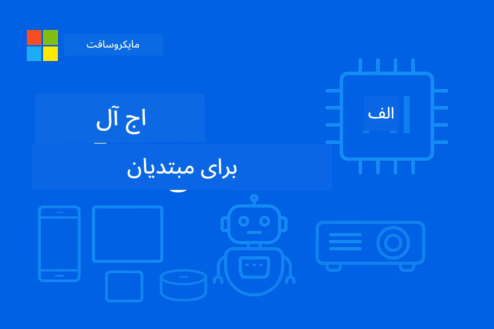

# EdgeAI برای مبتدی‌ها




[](https://GitHub.com/microsoft/edgeai-for-beginners/graphs/contributors)
[](https://GitHub.com/microsoft/edgeai-for-beginners/issues)
[](https://GitHub.com/microsoft/edgeai-for-beginners/pulls)
[](http://makeapullrequest.com)

[](https://GitHub.com/microsoft/edgeai-for-beginners/watchers)
[](https://GitHub.com/microsoft/edgeai-for-beginners/fork)
[](https://GitHub.com/microsoft/edgeai-for-beginners/stargazers)


[](https://discord.gg/nTYy5BXMWG)

برای شروع استفاده از این منابع مراحل زیر را دنبال کنید:

1. **فورک مخزن**: روی [](https://GitHub.com/microsoft/edgeai-for-beginners/fork) کلیک کنید
2. **کلون مخزن**:   `git clone https://github.com/microsoft/edgeai-for-beginners.git`
3. [**عضو Discord Azure AI Foundry شوید و با کارشناسان و توسعه‌دهندگان هم‌رشته ملاقات کنید**](https://discord.com/invite/ByRwuEEgH4)


### 🌐 پشتیبانی چندزبانه

#### پشتیبانی شده از طریق GitHub Action (خودکار و همیشه به‌روز)

<!-- CO-OP TRANSLATOR LANGUAGES TABLE START -->
[Arabic](../ar/README.md) | [Bengali](../bn/README.md) | [Bulgarian](../bg/README.md) | [Burmese (Myanmar)](../my/README.md) | [Chinese (Simplified)](../zh-CN/README.md) | [Chinese (Traditional, Hong Kong)](../zh-HK/README.md) | [Chinese (Traditional, Macau)](../zh-MO/README.md) | [Chinese (Traditional, Taiwan)](../zh-TW/README.md) | [Croatian](../hr/README.md) | [Czech](../cs/README.md) | [Danish](../da/README.md) | [Dutch](../nl/README.md) | [Estonian](../et/README.md) | [Finnish](../fi/README.md) | [French](../fr/README.md) | [German](../de/README.md) | [Greek](../el/README.md) | [Hebrew](../he/README.md) | [Hindi](../hi/README.md) | [Hungarian](../hu/README.md) | [Indonesian](../id/README.md) | [Italian](../it/README.md) | [Japanese](../ja/README.md) | [Kannada](../kn/README.md) | [Korean](../ko/README.md) | [Lithuanian](../lt/README.md) | [Malay](../ms/README.md) | [Malayalam](../ml/README.md) | [Marathi](../mr/README.md) | [Nepali](../ne/README.md) | [Nigerian Pidgin](../pcm/README.md) | [Norwegian](../no/README.md) | [Persian (Farsi)](./README.md) | [Polish](../pl/README.md) | [Portuguese (Brazil)](../pt-BR/README.md) | [Portuguese (Portugal)](../pt-PT/README.md) | [Punjabi (Gurmukhi)](../pa/README.md) | [Romanian](../ro/README.md) | [Russian](../ru/README.md) | [Serbian (Cyrillic)](../sr/README.md) | [Slovak](../sk/README.md) | [Slovenian](../sl/README.md) | [Spanish](../es/README.md) | [Swahili](../sw/README.md) | [Swedish](../sv/README.md) | [Tagalog (Filipino)](../tl/README.md) | [Tamil](../ta/README.md) | [Telugu](../te/README.md) | [Thai](../th/README.md) | [Turkish](../tr/README.md) | [Ukrainian](../uk/README.md) | [Urdu](../ur/README.md) | [Vietnamese](../vi/README.md)

> **ترجیح می‌دهید به‌صورت محلی کلون کنید؟**

> این مخزن شامل بیش از ۵۰ ترجمه زبان است که حجم دانلود را به‌طور قابل توجهی افزایش می‌دهد. برای کلون کردن بدون ترجمه‌ها، از sparse checkout استفاده کنید:
> ```bash
> git clone --filter=blob:none --sparse https://github.com/microsoft/edgeai-for-beginners.git
> cd edgeai-for-beginners
> git sparse-checkout set --no-cone '/*' '!translations' '!translated_images'
> ```
> این به شما همه چیز لازم برای تکمیل دوره را با دانلودی بسیار سریع‌تر می‌دهد.
<!-- CO-OP TRANSLATOR LANGUAGES TABLE END -->

**اگر می‌خواهید زبان‌های ترجمه بیشتری پشتیبانی شوند، در [اینجا](https://github.com/Azure/co-op-translator/blob/main/getting_started/supported-languages.md) فهرست شده‌اند**
## معرفی

به **EdgeAI برای مبتدی‌ها** خوش آمدید – سفر جامع شما به دنیای تحول‌آفرین هوش مصنوعی در لبه. این دوره فاصله بین قابلیت‌های قدرتمند هوش مصنوعی و پیاده‌سازی عملی و واقعی روی دستگاه‌های لبه را پر می‌کند و به شما امکان می‌دهد پتانسیل هوش مصنوعی را دقیقاً جایی که داده‌ها تولید می‌شوند و تصمیم‌گیری‌ها باید انجام شود، به کار بگیرید.

### چه چیزهایی را یاد خواهید گرفت

این دوره شما را از مفاهیم بنیادی تا پیاده‌سازی‌های آماده تولید می‌برد، که شامل:
- **مدل‌های زبانی کوچک (SLMs)** بهینه‌شده برای استقرار در لبه
- **بهینه‌سازی سخت‌افزاری** در پلتفرم‌های متنوع
- **استنتاج بلادرنگ** با امکانات حفظ حریم خصوصی
- **استراتژی‌های استقرار در تولید** برای برنامه‌های سازمانی

### چرا EdgeAI اهمیت دارد

Edge AI نمایانگر تغییر پارادایمی است که به چالش‌های حیاتی مدرن می‌پردازد:
- **حریم خصوصی و امنیت**: پردازش داده‌های حساس به صورت محلی بدون افشای آن در فضای ابری
- **عملکرد بلادرنگ**: حذف تأخیر شبکه برای برنامه‌های حساس به زمان
- **صرفه‌جویی در هزینه**: کاهش هزینه‌های پهنای باند و محاسبات ابری
- **عملیات مقاوم**: حفظ عملکرد در هنگام قطعی شبکه
- **مطابقت با مقررات**: رعایت الزامات حاکمیت داده‌ها

### Edge AI

Edge AI به اجرای الگوریتم‌ها و مدل‌های زبان مصنوعی به‌طور محلی روی سخت‌افزار، نزدیک به منبع تولید داده گفته می‌شود بدون وابستگی به منابع ابری برای استنتاج. این روش تأخیر را کاهش می‌دهد، حریم خصوصی را افزایش می‌دهد و تصمیم‌گیری بلادرنگ را ممکن می‌سازد.

### اصول بنیادی:
- **استنتاج روی دستگاه**: مدل‌های AI روی دستگاه‌های لبه (تلفن، روتر، میکروکنترلر، کامپیوتر صنعتی) اجرا می‌شوند
- **قابلیت آفلاین**: عملکرد بدون اتصال مداوم به اینترنت
- **تاخیر کم**: پاسخ‌های فوری مناسب سیستم‌های بلادرنگ
- **حاکمیت داده‌ها**: نگهداری داده‌های حساس به صورت محلی، افزایش امنیت و رعایت مقررات

### مدل‌های زبانی کوچک (SLMs)

مدل‌هایی مانند Phi-4، Mistral-7B، و Gemma نسخه‌های بهینه‌شده مدل‌های بزرگ‌تر LLM هستند—که برای:
- **کاهش حجم حافظه**: استفاده بهینه از حافظه محدود دستگاه‌های لبه
- **کاهش نیاز محاسباتی**: بهینه‌شده برای عملکرد CPU و GPU در لبه
- **سرعت راه‌اندازی سریع‌تر**: راه‌اندازی سریع برای برنامه‌های پاسخگو

آن‌ها قابلیت‌های قدرتمند NLP را فراهم می‌کنند در حالی که محدودیت‌های زیر را رعایت می‌کنند:
- **سیستم‌های جاسازی شده**: دستگاه‌های IoT و کنترلرهای صنعتی
- **دستگاه‌های موبایل**: تلفن‌های هوشمند و تبلت‌ها با قابلیت‌های آفلاین
- **دستگاه‌های IoT**: حسگرها و دستگاه‌های هوشمند با منابع محدود
- **سرورهای لبه**: واحدهای پردازش محلی با منابع GPU محدود
- **رایانه‌های شخصی**: سناریوهای استقرار دسکتاپ و لپ‌تاپ

## ماژول‌ها و ناوبری دوره

| ماژول | موضوع | حوزه تمرکز | محتوای کلیدی | سطح | مدت زمان |
|--------|-------|------------|--------------|------|----------|
| [📖 00 ](./introduction.md) | [معرفی EdgeAI](./introduction.md) | بنیان و زمینه | مروری بر EdgeAI • کاربردهای صنعتی • معرفی SLM • اهداف یادگیری | مبتدی | ۱-۲ ساعت |
| [📚 01](../../Module01) | [مبانی EdgeAI](./Module01/README.md) | مقایسه ابر با هوش مصنوعی لبه | مبانی EdgeAI • مطالعات موردی دنیای واقعی • راهنمای پیاده‌سازی • استقرار در لبه | مبتدی | ۳-۴ ساعت |
| [🧠 02](../../Module02) | [مبانی مدل SLM](./Module02/README.md) | خانواده‌های مدل و معماری | خانواده Phi • خانواده Qwen • خانواده Gemma • BitNET • μModel • Phi-Silica | مبتدی | ۴-۵ ساعت |
| [🚀 03](../../Module03) | [تمرین استقرار SLM](./Module03/README.md) | استقرار محلی و ابری | یادگیری پیشرفته • محیط محلی • استقرار ابری | متوسط | ۴-۵ ساعت |
| [⚙️ 04](../../Module04) | [جعبه ابزار بهینه‌سازی مدل](./Module04/README.md) | بهینه‌سازی چند پلتفرمی | معرفی • Llama.cpp • Microsoft Olive • OpenVINO • Apple MLX • ترکیب گردش کار | متوسط | ۵-۶ ساعت |
| [🔧 05](../../Module05) | [عملیات SLM در تولید](./Module05/README.md) | عملیات تولید | معرفی SLMOps • تقطیر مدل • تنظیم دقیق • استقرار تولید | پیشرفته | ۵-۶ ساعت |
| [🤖 06](../../Module06) | [عامل‌های هوش مصنوعی و فراخوانی عملکرد](./Module06/README.md) | چارچوب‌های عامل و MCP | معرفی عامل • فراخوانی عملکرد • پروتکل زمینه مدل | پیشرفته | ۴-۵ ساعت |
| [💻 07](../../Module07) | [پیاده‌سازی پلتفرم](./Module07/README.md) | نمونه‌های چند پلتفرمی | جعبه ابزار AI • Foundry Local • توسعه ویندوز | پیشرفته | ۳-۴ ساعت |
| [🏭 08](../../Module08) | [جعبه ابزار Foundry Local](./Module08/README.md) | نمونه‌های آماده تولید | برنامه‌های نمونه (جزئیات در زیر) | خبره | ۸-۱۰ ساعت |

### 🏭 **ماژول ۰۸: برنامه‌های نمونه**

- [۰۱: شروع سریع چت REST](./Module08/samples/01/README.md)
- [۰۲: ادغام OpenAI SDK](./Module08/samples/02/README.md)
- [۰۳: کشف مدل و بنچمارکینگ](./Module08/samples/03/README.md)
- [۰۴: برنامه Chainlit RAG](./Module08/samples/04/README.md)
- [۰۵: ارکستراسیون چندعامله](./Module08/samples/05/README.md)
- [۰۶: مسیریاب مدل‌ها به عنوان ابزار](./Module08/samples/06/README.md)
- [۰۷: کلاینت مستقیم API](./Module08/samples/07/README.md)
- [۰۸: برنامه چت ویندوز ۱۱](./Module08/samples/08/README.md)
- [۰۹: سیستم پیشرفته چندعامله](./Module08/samples/09/README.md)
- [۱۰: چارچوب ابزارهای Foundry](./Module08/samples/10/README.md)

### 🎓 **کارگاه آموزشی: مسیر یادگیری عملی**

مواد جامع کارگاهی با پیاده‌سازی‌های آماده تولید:

- **[راهنمای کارگاه](./Workshop/Readme.md)** - اهداف یادگیری کامل، نتایج و ناوبری منابع
- **نمونه‌های پایتون** (۶ جلسه) – به‌روزرسانی شده با بهترین شیوه‌ها، مدیریت خطا، و مستندسازی کامل
- **دفترچه‌های Jupyter** (۸ مورد تعاملی) – آموزش گام‌به‌گام با بنچمارک‌ها و نظارت بر عملکرد
- **راهنماهای جلسه** - راهنماهای دقیق مارک‌داون برای هر جلسه کارگاه
- **ابزارهای اعتبارسنجی** - اسکریپت‌هایی برای بررسی کیفیت کد و اجرای تست‌های دود

**آنچه خواهید ساخت:**
- برنامه‌های چت AI محلی با پشتیبانی از پخش
- خطوط لوله RAG با ارزیابی کیفیت (RAGAS)
- ابزارهای بنچمارکینگ و مقایسه چندمدلی
- سیستم‌های ارکستراسیون چندعامله
- مسیریابی هوشمند مدل با انتخاب مبتنی بر وظیفه

### 🎙️ **کارگاه برای Agentic: عملی - استودیو پادکست AI**

یک خط لوله تولید پادکست با هوش مصنوعی از صفر بسازید! این کارگاه تعاملی به شما آموزش می‌دهد چگونه یک سیستم چندعامله کامل ایجاد کنید که ایده‌ها را به قسمت‌های پادکست حرفه‌ای تبدیل می‌کند.
**[🎬 شروع کارگاه استودیو پادکست هوش مصنوعی](./WorkshopForAgentic/README.md)**

**ماموریت شما**: راه‌اندازی «Future Bytes» — یک پادکست فناوری که کاملاً توسط عامل‌های هوش مصنوعی ساخته شده که خودتان خواهید ساخت. بدون وابستگی به فضای ابری، بدون هزینه‌های API — همه چیز به صورت محلی روی دستگاه شما اجرا می‌شود.

**ویژگی‌های منحصربه‌فرد این پروژه:**
- **🤖 ارکستراسیون واقعی چندعاملی** - ساخت عامل‌های تخصصی هوش مصنوعی که تحقیق، نوشتن و تولید صدا انجام می‌دهند
- **🎯 خط تولید کامل تولید** - از انتخاب موضوع تا خروجی نهایی صدای پادکست
- **💻 استقرار ۱۰۰٪ محلی** - استفاده از Ollama و مدل‌های محلی (Qwen-3-8B) برای حفظ حریم خصوصی و کنترل کامل
- **🎤 یکپارچه‌سازی تبدیل متن به گفتار** - تبدیل اسکریپت‌ها به مکالمات چندسخنران با صدای طبیعی
- **✋ جریان‌های کاری با دخالت انسان** - مراحل تأیید برای تضمین کیفیت همراه با حفظ اتوماسیون

**سفر یادگیری سه‌مرحله‌ای:**

| مرحله | تمرکز | مهارت‌های کلیدی | مدت زمان |
|-----|-------|------------|----------|
| **[مرحله ۱: ملاقات با دستیاران هوش مصنوعی خود](./WorkshopForAgentic/md/01.BuildAIAgentWithSLM.md)** | ساخت اولین عامل هوش مصنوعی خود | یکپارچه‌سازی ابزارها • جستجوی وب • حل مسئله • استدلال عاملی | ۲-۳ ساعت |
| **[مرحله ۲: گردآوری تیم تولید](./WorkshopForAgentic/md/02.AIAgentOrchestrationAndWorkflows.md)** | ارکستراسیون چند عامل | هماهنگی تیم • جریان‌های کاری تأیید • رابط DevUI • نظارت انسانی | ۳-۴ ساعت |
| **[مرحله ۳: زنده کردن پادکست خود](./WorkshopForAgentic/md/03.Multi-SpeakerPodcastGenerationWithVibeVoice.md)** | تولید صدای پادکست | تبدیل متن به گفتار • سنتز چندسخنران • صدای طولانی • اتوماسیون کامل | ۲-۳ ساعت |

**فناوری‌های استفاده‌شده:**
- **Microsoft Agent Framework** - ارکستراسیون و هماهنگی چندعاملی
- **Ollama** - زمان اجرای مدل هوش مصنوعی محلی (بدون نیاز به فضای ابری)
- **Qwen-3-8B** - مدل زبان متن‌باز بهینه‌شده برای وظایف عاملی
- **رابط‌های تبدیل متن به گفتار** - سنتز صدای طبیعی برای تولید پادکست

**پشتیبانی سخت‌افزاری:**
- ✅ **حالت CPU** - کارکرد روی هر کامپیوتر مدرن (حداقل ۸ گیگابایت رم توصیه می‌شود)
- 🚀 **شتاب‌دهی GPU** - تفسیر بسیار سریع‌تر با کارت‌های NVIDIA/AMD
- ⚡ **پشتیبانی NPU** - شتاب‌دهی واحد پردازش عصبی نسل بعد

**مناسب برای:**
- توسعه‌دهندگانی که در حال یادگیری سیستم‌های هوش مصنوعی چندعاملی هستند
- افرادی که به اتوماسیون هوش مصنوعی و جریان‌های کاری علاقه‌مندند
- سازندگان محتوا که تولید با کمک هوش مصنوعی را بررسی می‌کنند
- دانشجویانی که الگوهای عملی ارکستراسیون هوش مصنوعی را مطالعه می‌کنند

**شروع به ساخت کنید**: [🎙️ کارگاه استودیو پادکست هوش مصنوعی →](./WorkshopForAgentic/README.md)

### 📊 **خلاصه مسیر یادگیری**
- **مدت کل**: ۳۶-۴۵ ساعت
- **مسیر مبتدی**: ماژول‌های ۰۱-۰۲ (۷-۹ ساعت)  
- **مسیر متوسط**: ماژول‌های ۰۳-۰۴ (۹-۱۱ ساعت)
- **مسیر پیشرفته**: ماژول‌های ۰۵-۰۷ (۱۲-۱۵ ساعت)
- **مسیر تخصصی**: ماژول ۰۸ (۸-۱۰ ساعت)

## آنچه خواهید ساخت

### 🎯 مهارت‌های اصلی
- **معماری هوش مصنوعی لبه‌ای**: طراحی سیستم‌های هوش مصنوعی با اولویت محلی و یکپارچه‌سازی ابری
- **بهینه‌سازی مدل‌ها**: کمیت‌بندی و فشرده‌سازی مدل‌ها برای استقرار لبه‌ای (افزایش سرعت ۸۵٪، کاهش اندازه ۷۵٪)
- **استقرار چند سکویی**: ویندوز، موبایل، تعبیه‌شده و سیستم‌های ترکیبی ابری-لبه‌ای
- **عملیات تولید**: نظارت، مقیاس‌بندی و نگهداری هوش مصنوعی لبه‌ای در محیط تولید

### 🏗️ پروژه‌های عملی
- **برنامه‌های چت محلی Foundry**: برنامه بومی ویندوز ۱۱ با قابلیت تعویض مدل
- **سیستم‌های چندعاملی**: هماهنگ‌کننده با عامل‌های تخصصی برای جریان‌های کاری پیچیده  
- **برنامه‌های RAG**: پردازش سند محلی با جستجوی برداری
- **روترهای مدل**: انتخاب هوشمند بین مدل‌ها بر اساس تحلیل وظیفه
- **چارچوب‌های API**: کلاینت‌های آماده تولید با پشتیبانی از استریمینگ و مانیتورینگ سلامت
- **ابزارهای چند سکویی**: الگوهای یکپارچه‌سازی LangChain/Semantic Kernel

### 🏢 کاربردهای صنعتی
**تولید** • **بهداشت و درمان** • **خودران‌ها** • **شهرهای هوشمند** • **برنامه‌های موبایل**

## شروع سریع

**مسیر یادگیری پیشنهادی** (۲۰-۳۰ ساعت کل):

0. **📖 معرفی** ([Introduction.md](./introduction.md)): پایه‌های EdgeAI + بستر صنعتی + چارچوب یادگیری
1. **📚 پایه** (ماژول‌های ۰۱-۰۲): مفاهیم EdgeAI + خانواده مدل‌های SLM
2. **⚙️ بهینه‌سازی** (ماژول‌های ۰۳-۰۴): استقرار + چارچوب‌های کمیت‌بندی  
3. **🚀 تولید** (ماژول‌های ۰۵-۰۶): SLMOps + عامل‌های هوش مصنوعی + فراخوانی تابع
4. **💻 پیاده‌سازی** (ماژول‌های ۰۷-۰۸): نمونه‌های سکویی + مجموعه ابزار Foundry Local

هر ماژول شامل نظریه، تمرین‌های عملی و نمونه‌های کد آماده تولید است.

## تاثیر شغلی

**نقش‌های فنی**: معمار راه‌حل‌های EdgeAI • مهندس یادگیری ماشین (لبه) • توسعه‌دهنده هوش مصنوعی اینترنت اشیاء • توسعه‌دهنده هوش مصنوعی موبایل

**بخش‌های صنعتی**: تولید ۴.۰ • فناوری بهداشت و درمان • سیستم‌های خودران • فن‌تک • الکترونیک مصرفی

**پروژه‌های پرتفولیو**: سیستم‌های چندعاملی • برنامه‌های RAG تولیدی • استقرار چند سکویی • بهینه‌سازی عملکرد

## ساختار مخزن

```
edgeai-for-beginners/
├── 📖 introduction.md  # Foundation: EdgeAI Overview & Learning Framework
├── 📚 Module01-04/     # Fundamentals → SLMs → Deployment → Optimization  
├── 🔧 Module05-06/     # SLMOps → AI Agents → Function Calling
├── 💻 Module07/        # Platform Samples (VS Code, Windows, Jetson, Mobile)
├── 🏭 Module08/        # Foundry Local Toolkit + 10 Comprehensive Samples
│   ├── samples/01-06/  # Foundation: REST, SDK, RAG, Agents, Routing
│   └── samples/07-10/  # Advanced: API Client, Windows App, Enterprise Agents, Tools
├── 🌐 translations/    # Multi-language support (8+ languages)
└── 📋 STUDY_GUIDE.md   # Structured learning paths & time allocation
```

## نکات برجسته دوره

✅ **یادگیری تدریجی**: نظریه → عمل → استقرار تولید  
✅ **مطالعات موردی واقعی**: مایکروسافت، خطوط هوایی ژاپن، پیاده‌سازی‌های سازمانی  
✅ **نمونه‌های عملی**: بیش از ۵۰ مثال، ۱۰ نمایش کامل Foundry Local  
✅ **تمرکز بر عملکرد**: بهبود سرعت ۸۵٪، کاهش اندازه ۷۵٪  
✅ **چند سکویی**: ویندوز، موبایل، تعبیه‌شده، ترکیبی ابری-لبه‌ای  
✅ **آماده تولید**: چارچوب‌های نظارت، مقیاس‌بندی، امنیت و انطباق

📖 **[راهنمای مطالعه در دسترس است](STUDY_GUIDE.md)**: مسیر یادگیری ساختار یافته ۲۰ ساعته با راهنمای تخصیص زمان و ابزارهای خودارزیابی.

---

**EdgeAI نمایانگر آینده استقرار هوش مصنوعی است**: ابتدا محلی، حفظ حریم خصوصی، و کارآمد. این مهارت‌ها را بیاموزید تا نسل بعدی برنامه‌های هوشمند را بسازید.

## دوره‌های دیگر

تیم ما دوره‌های دیگری نیز تولید می‌کند! بررسی کنید:

<!-- CO-OP TRANSLATOR OTHER COURSES START -->
### LangChain
[](https://aka.ms/langchain4j-for-beginners)
[](https://aka.ms/langchainjs-for-beginners?WT.mc_id=m365-94501-dwahlin)

---

### Azure / Edge / MCP / عامل‌ها
[](https://github.com/microsoft/AZD-for-beginners?WT.mc_id=academic-105485-koreyst)
[](https://github.com/microsoft/edgeai-for-beginners?WT.mc_id=academic-105485-koreyst)
[](https://github.com/microsoft/mcp-for-beginners?WT.mc_id=academic-105485-koreyst)
[](https://github.com/microsoft/ai-agents-for-beginners?WT.mc_id=academic-105485-koreyst)

---
 
### سری هوش مصنوعی مولد
[](https://github.com/microsoft/generative-ai-for-beginners?WT.mc_id=academic-105485-koreyst)
[-9333EA?style=for-the-badge&labelColor=E5E7EB&color=9333EA)](https://github.com/microsoft/Generative-AI-for-beginners-dotnet?WT.mc_id=academic-105485-koreyst)
[-C084FC?style=for-the-badge&labelColor=E5E7EB&color=C084FC)](https://github.com/microsoft/generative-ai-for-beginners-java?WT.mc_id=academic-105485-koreyst)
[-E879F9?style=for-the-badge&labelColor=E5E7EB&color=E879F9)](https://github.com/microsoft/generative-ai-with-javascript?WT.mc_id=academic-105485-koreyst)

---
 
### یادگیری پایه
[](https://aka.ms/ml-beginners?WT.mc_id=academic-105485-koreyst)
[](https://aka.ms/datascience-beginners?WT.mc_id=academic-105485-koreyst)
[](https://aka.ms/ai-beginners?WT.mc_id=academic-105485-koreyst)
[](https://github.com/microsoft/Security-101?WT.mc_id=academic-96948-sayoung)
[](https://aka.ms/webdev-beginners?WT.mc_id=academic-105485-koreyst)
[](https://aka.ms/iot-beginners?WT.mc_id=academic-105485-koreyst)
[](https://github.com/microsoft/xr-development-for-beginners?WT.mc_id=academic-105485-koreyst)

---
 
### سری Copilot
[](https://aka.ms/GitHubCopilotAI?WT.mc_id=academic-105485-koreyst)
[](https://github.com/microsoft/mastering-github-copilot-for-dotnet-csharp-developers?WT.mc_id=academic-105485-koreyst)
[](https://github.com/microsoft/CopilotAdventures?WT.mc_id=academic-105485-koreyst)
<!-- CO-OP TRANSLATOR OTHER COURSES END -->

## دریافت کمک

اگر گیر کردید یا سوالی درباره ساخت برنامه‌های هوش مصنوعی داشتید، بپیوندید:

[](https://discord.gg/nTYy5BXMWG)

اگر بازخورد محصول یا خطایی هنگام ساخت داشتید، مراجعه کنید به:

[](https://aka.ms/foundry/forum)

---

<!-- CO-OP TRANSLATOR DISCLAIMER START -->
**سلب مسئولیت**:  
این سند با استفاده از سرویس ترجمه هوش مصنوعی [Co-op Translator](https://github.com/Azure/co-op-translator) ترجمه شده است. هرچند ما در جهت دقت تلاش می‌کنیم، لطفاً توجه داشته باشید که ترجمه‌های خودکار ممکن است حاوی خطاها یا نواقصی باشند. سند اصلی به زبان بومی خود باید منبع معتبر محسوب گردد. برای اطلاعات حیاتی، ترجمه حرفه‌ای انسانی توصیه می‌شود. ما نسبت به هرگونه سوء تفاهم یا برداشت نادرست ناشی از استفاده این ترجمه مسئولیتی نداریم.
<!-- CO-OP TRANSLATOR DISCLAIMER END -->