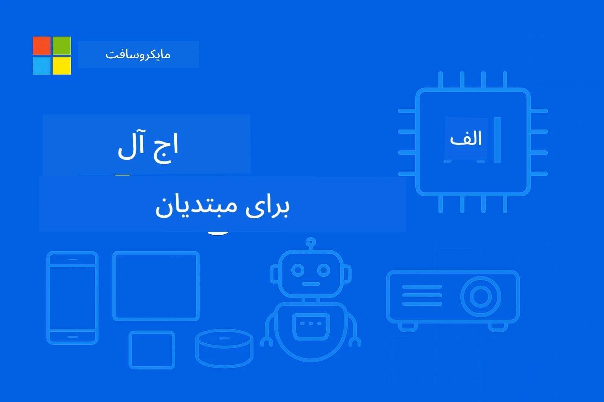

# EdgeAI برای مبتدی‌ها




[](https://GitHub.com/microsoft/edgeai-for-beginners/graphs/contributors)
[](https://GitHub.com/microsoft/edgeai-for-beginners/issues)
[](https://GitHub.com/microsoft/edgeai-for-beginners/pulls)
[](http://makeapullrequest.com)

[](https://GitHub.com/microsoft/edgeai-for-beginners/watchers)
[](https://GitHub.com/microsoft/edgeai-for-beginners/fork)
[](https://GitHub.com/microsoft/edgeai-for-beginners/stargazers)


[](https://discord.gg/nTYy5BXMWG)

برای شروع استفاده از این منابع، مراحل زیر را دنبال کنید:

1. **انشعاب مخزن (Fork):** کلیک کنید بر [](https://GitHub.com/microsoft/edgeai-for-beginners/fork)
2. **کلون کردن مخزن:**   `git clone https://github.com/microsoft/edgeai-for-beginners.git`
3. [**به Discord Azure AI Foundry ملحق شوید و با کارشناسان و توسعه‌دهندگان دیگر آشنا شوید**](https://discord.com/invite/ByRwuEEgH4)


### 🌐 پشتیبانی چندزبانه

#### پشتیبانی شده از طریق GitHub Action (خودکار و همیشه به‌روز)

<!-- CO-OP TRANSLATOR LANGUAGES TABLE START -->
[عربی](../ar/README.md) | [بنگالی](../bn/README.md) | [بلغاری](../bg/README.md) | [برمه‌ای (میانمار)](../my/README.md) | [چینی (ساده‌شده)](../zh-CN/README.md) | [چینی (سنتی، هنگ‌کنگ)](../zh-HK/README.md) | [چینی (سنتی، ماکائو)](../zh-MO/README.md) | [چینی (سنتی، تایوان)](../zh-TW/README.md) | [کرواتی](../hr/README.md) | [چکی](../cs/README.md) | [دانمارکی](../da/README.md) | [هلندی](../nl/README.md) | [استونیایی](../et/README.md) | [فنلاندی](../fi/README.md) | [فرانسوی](../fr/README.md) | [آلمانی](../de/README.md) | [یونانی](../el/README.md) | [عبری](../he/README.md) | [هندی](../hi/README.md) | [مجارستانی](../hu/README.md) | [اندونزیایی](../id/README.md) | [ایتالیایی](../it/README.md) | [ژاپنی](../ja/README.md) | [کانادا](../kn/README.md) | [خمر](../km/README.md) | [کره‌ای](../ko/README.md) | [لتونیایی](../lt/README.md) | [مالایی](../ms/README.md) | [مالایالم](../ml/README.md) | [مراتی](../mr/README.md) | [نپالی](../ne/README.md) | [پیدگین نیجریایی](../pcm/README.md) | [نروژی](../no/README.md) | [فارسی](./README.md) | [لهستانی](../pl/README.md) | [پرتغالی (برزیل)](../pt-BR/README.md) | [پرتغالی (پرتغال)](../pt-PT/README.md) | [پنجابی (گورموخی)](../pa/README.md) | [رومانیایی](../ro/README.md) | [روسی](../ru/README.md) | [صربی (سیریلیک)](../sr/README.md) | [اسلواکی](../sk/README.md) | [اسلونیایی](../sl/README.md) | [اسپانیایی](../es/README.md) | [سواحیلی](../sw/README.md) | [سوئدی](../sv/README.md) | [تاگالوگ (فیلیپینی)](../tl/README.md) | [تامیلی](../ta/README.md) | [تلوگو](../te/README.md) | [تایلندی](../th/README.md) | [ترکی](../tr/README.md) | [اوکراینی](../uk/README.md) | [اردو](../ur/README.md) | [ویتنامی](../vi/README.md)

> **ترجیح می‌دهید به صورت محلی کلون کنید؟**
>
> این مخزن بیش از ۵۰ زبان ترجمه دارد که حجم دانلود را به طور قابل توجهی افزایش می‌دهد. برای کلون بدون ترجمه‌ها، از sparse checkout استفاده کنید:
>
> **Bash / macOS / لینوکس:**
> ```bash
> git clone --filter=blob:none --sparse https://github.com/microsoft/edgeai-for-beginners.git
> cd edgeai-for-beginners
> git sparse-checkout set --no-cone '/*' '!translations' '!translated_images'
> ```
>
> **CMD (ویندوز):**
> ```cmd
> git clone --filter=blob:none --sparse https://github.com/microsoft/edgeai-for-beginners.git
> cd edgeai-for-beginners
> git sparse-checkout set --no-cone "/*" "!translations" "!translated_images"
> ```
>
> این همه چیز لازم برای اتمام دوره را با سرعت دانلود بسیار بالاتر به شما می‌دهد.
<!-- CO-OP TRANSLATOR LANGUAGES TABLE END -->

**اگر مایل هستید زبان‌های بیشتری اضافه شوند، زبان‌های پشتیبانی شده در این [جا](https://github.com/Azure/co-op-translator/blob/main/getting_started/supported-languages.md) لیست شده‌اند**
## معرفی

خوش آمدید به **EdgeAI برای مبتدی‌ها** – سفر جامع شما به دنیای تحول‌آفرین هوش مصنوعی لبه. این دوره شکاف بین توانایی‌های قدرتمند هوش مصنوعی و به‌کارگیری عملی و واقعی روی دستگاه‌های لبه را پل می‌زند و به شما قدرت می‌دهد تا پتانسیل هوش مصنوعی را مستقیماً در جایی که داده تولید می‌شود و تصمیم‌گیری باید انجام شود، به کار گیرید.

### چه مهارت‌هایی کسب می‌کنید

این دوره شما را از مفاهیم پایه تا پیاده‌سازی‌های آماده تولید پیش می‌برد، شامل:
- **مدل‌های زبانی کوچک (SLMs)** بهینه‌شده برای به‌کارگیری در لبه
- **بهینه‌سازی آگاه از سخت‌افزار** روی پلتفرم‌های متنوع
- **استنتاج در زمان واقعی** با قابلیت حفظ حریم خصوصی
- **استراتژی‌های استقرار تولید** برای برنامه‌های سازمانی

### اهمیت EdgeAI

هوش مصنوعی لبه یک تغییر پارادایم است که به چالش‌های حیاتی مدرن می‌پردازد:
- **حریم خصوصی و امنیت**: پردازش داده‌های حساس محلی بدون افشای ابری
- **عملکرد در زمان واقعی**: حذف تأخیر شبکه برای برنامه‌های حساس به زمان
- **صرفه‌جویی در هزینه**: کاهش پهنای باند و هزینه‌های رایانش ابری
- **عملکرد مقاوم**: حفظ عملکرد در هنگام قطعی شبکه
- **رعایت مقررات**: تطابق با الزامات حاکمیت داده

### هوش مصنوعی لبه (Edge AI)

هوش مصنوعی لبه به معنای اجرای الگوریتم‌ها و مدل‌های زبان هوش مصنوعی به صورت محلی روی سخت‌افزار، نزدیک به جایی که داده‌ها تولید می‌شوند، بدون اتکا به منابع ابری برای استنتاج است. این کار تأخیر را کاهش داده، حریم خصوصی را افزایش داده و تصمیم‌گیری در زمان واقعی را ممکن می‌سازد.

### اصول اساسی:
- **استنتاج روی دستگاه**: مدل‌های هوش مصنوعی روی دستگاه‌های لبه (گوشی‌ها، روترها، میکروکنترلرها، رایانه‌های صنعتی) اجرا می‌شوند.
- **قابلیت آفلاین**: عملکرد بدون اتصال مداوم به اینترنت
- **کمترین تأخیر**: پاسخ‌های سریع مناسب سیستم‌های زمان واقعی
- **حاکمیت داده**: نگهداری داده‌های حساس به صورت محلی، افزایش امنیت و انطباق

### مدل‌های زبانی کوچک (SLMs)

مدل‌های زبانی کوچک مانند Phi-4، Mistral-7B و Gemma نسخه‌های بهینه‌شده‌ای از مدل‌های بزرگ‌تر LLM هستند – آموزش دیده یا تقطیر شده برای:
- **کاهش حافظه مصرفی**: استفاده بهینه از حافظه محدود دستگاه‌های لبه
- **تقاضای محاسباتی کمتر**: بهینه‌سازی شده برای عملکرد CPU و GPU لبه
- **زمان راه‌اندازی سریع‌تر**: راه‌اندازی سریع برای برنامه‌های پاسخگو

آنها قابلیت‌های قدرتمند NLP را باز می‌کنند و در عین حال پاسخگوی محدودیت‌های:
- **سیستم‌های تعبیه‌شده**: دستگاه‌های IoT و کنترلرهای صنعتی
- **دستگاه‌های همراه**: گوشی‌های هوشمند و تبلت‌ها با قابلیت آفلاین
- **دستگاه‌های IoT**: حسگرها و دستگاه‌های هوشمند با منابع محدود
- **سرورهای لبه**: واحدهای پردازش محلی با منابع GPU محدود
- **رایانه‌های شخصی**: سناریوهای استقرار دسکتاپ و لپ‌تاپ

## ماژول‌های دوره و ناوبری

| ماژول | موضوع | حوزه تمرکز | محتوای کلیدی | سطح | مدت زمان |
|--------|-------|------------|-------------|--------|----------|
| [📖 00 ](./introduction.md) | [معرفی EdgeAI](./introduction.md) | پایه و زمینه | مرور کلی EdgeAI • کاربردهای صنعتی • معرفی SLM • اهداف آموزشی | مبتدی | ۱-۲ ساعت |
| [📚 01](../../Module01) | [مبانی EdgeAI](./Module01/README.md) | مقایسه ابری و هوش مصنوعی لبه | مبانی EdgeAI • مطالعات موردی دنیای واقعی • راهنمای پیاده‌سازی • استقرار در لبه | مبتدی | ۳-۴ ساعت |
| [🧠 02](../../Module02) | [مبانی مدل SLM](./Module02/README.md) | خانواده‌های مدل و معماری | خانواده Phi • خانواده Qwen • خانواده Gemma • BitNET • μModel • Phi-Silica | مبتدی | ۴-۵ ساعت |
| [🚀 03](../../Module03) | [تمرین استقرار SLM](./Module03/README.md) | استقرار محلی و ابری | یادگیری پیشرفته • محیط محلی • استقرار ابری | متوسط | ۴-۵ ساعت |
| [⚙️ 04](../../Module04) | [جعبه‌ابزار بهینه‌سازی مدل](./Module04/README.md) | بهینه‌سازی چندسکویی | مقدمه • Llama.cpp • Microsoft Olive • OpenVINO • Apple MLX • سنتز جریان کاری | متوسط | ۵-۶ ساعت |
| [🔧 05](../../Module05) | [تولید SLMOps](./Module05/README.md) | عملیات تولید | معرفی SLMOps • تقطیر مدل • تنظیم دقیق • استقرار تولید | پیشرفته | ۵-۶ ساعت |
| [🤖 06](../../Module06) | [عامل‌های هوش مصنوعی و فراخوانی توابع](./Module06/README.md) | چارچوب‌های عامل و MCP | معرفی عامل • فراخوانی توابع • پروتکل زمینه مدل | پیشرفته | ۴-۵ ساعت |
| [💻 07](../../Module07) | [اجرای پلتفرم](./Module07/README.md) | نمونه‌های چندسکویی | جعبه ابزار AI • Foundry محلی • توسعه در ویندوز | پیشرفته | ۳-۴ ساعت |
| [🏭 08](../../Module08) | [جعبه‌ابزار Foundry محلی](./Module08/README.md) | نمونه‌های آماده تولید | برنامه‌های نمونه (جزئیات در ادامه) | خبره | ۸-۱۰ ساعت |

### 🏭 **ماژول ۰۸: برنامه‌های نمونه**

- [۰۱: شروع سریع REST Chat](./Module08/samples/01/README.md)
- [۰۲: ادغام SDK OpenAI](./Module08/samples/02/README.md)
- [۰۳: کشف مدل و بنچمارک](./Module08/samples/03/README.md)
- [۰۴: برنامه Chainlit RAG](./Module08/samples/04/README.md)
- [۰۵: ارکستراسیون چندعاملی](./Module08/samples/05/README.md)
- [۰۶: مسیر‌دهنده مدل به عنوان ابزار](./Module08/samples/06/README.md)
- [۰۷: کلاینت API مستقیم](./Module08/samples/07/README.md)
- [۰۸: برنامه چت ویندوز ۱۱](./Module08/samples/08/README.md)
- [۰۹: سیستم چندعاملی پیشرفته](./Module08/samples/09/README.md)
- [۱۰: چارچوب ابزارهای Foundry](./Module08/samples/10/README.md)

### 🎓 **کارگاه آموزشی: مسیر یادگیری عملی**

مواد جامع کارگاه آموزشی همراه با پیاده‌سازی‌های آماده تولید:

- **[راهنمای کارگاه](./Workshop/Readme.md)** - اهداف یادگیری کامل، نتایج و ناوبری منابع
- **نمونه‌های پیتون** (۶ جلسه) - به‌روزرسانی شده با بهترین شیوه‌ها، مدیریت خطا و مستندات جامع
- **دفترچه یادداشت‌های Jupyter** (۸ تعاملی) - آموزش گام‌به‌گام با بنچمارک‌ها و نظارت بر عملکرد
- **راهنمای جلسات** - راهنماهای دقیق مارک‌داون برای هر جلسه کارگاه
- **ابزارهای اعتبارسنجی** - اسکریپت‌هایی برای بررسی کیفیت کد و اجرای تست‌های دود

**چه چیزی خواهید ساخت:**
- برنامه‌های چت هوش مصنوعی محلی با پشتیبانی از جریان داده
- خطوط لوله RAG با ارزیابی کیفیت (RAGAS)
- ابزارهای بنچمارک و مقایسه چندمدلی
- سیستم‌های ارکستراسیون چندعاملی
- مسیردهی هوشمند مدل با انتخاب مبتنی بر وظیفه

### 🎙️ **کارگاه برای Agentic: عملی - استودیو پادکست هوش مصنوعی**
یک خط لوله تولید پادکست مجهز به هوش مصنوعی از صفر بسازید! این کارگاه فراگیر به شما آموزش می‌دهد چگونه یک سیستم چندعاملی کامل ایجاد کنید که ایده‌ها را به قسمت‌های پادکست حرفه‌ای تبدیل می‌کند.

**[🎬 شروع کارگاه استودیوی پادکست هوش مصنوعی](./WorkshopForAgentic/README.md)**

**ماموریت شما**: راه‌اندازی «Future Bytes» — یک پادکست تکنولوژی که کاملاً توسط عامل‌های هوش مصنوعی که خودتان می‌سازید هدایت می‌شود. بدون وابستگی ابری، بدون هزینه API — همه چیز به صورت محلی روی دستگاه شما اجرا می‌شود.

**ویژگی‌های منحصربه‌فرد این کار:**
- **🤖 هماهنگی واقعی چندعامل** - ایجاد عامل‌های هوش مصنوعی تخصصی برای تحقیق، نگارش و تولید صوت
- **🎯 خط لوله کامل تولید** - از انتخاب موضوع تا خروجی نهایی صوت پادکست
- **💻 استقرار صد در صد محلی** - استفاده از Ollama و مدل‌های محلی (Qwen-3-8B) برای حفظ کامل حریم خصوصی و کنترل
- **🎤 یکپارچه‌سازی متن‌به‌صوت** - تبدیل متن‌ها به مکالمات طبیعی با چند گوینده
- **✋ جریان‌های کاری با دخالت انسان** - دروازه‌های تایید برای تضمین کیفیت در عین حفظ اتوماسیون

**سفر آموزش سه‌بخشی:**

| بخش | تمرکز | مهارت‌های کلیدی | مدت زمان |
|-----|-------|------------------|----------|
| **[بخش ۱: آشنایی با دستیاران هوش مصنوعی](./WorkshopForAgentic/md/01.BuildAIAgentWithSLM.md)** | ساخت اولین عامل هوش مصنوعی | یکپارچه‌سازی ابزار • جستجوی وب • حل مسئله • استدلال عامل‌محور | ۲-۳ ساعت |
| **[بخش ۲: تشکیل تیم تولید](./WorkshopForAgentic/md/02.AIAgentOrchestrationAndWorkflows.md)** | هماهنگی چند عامل | هماهنگی تیم • جریان‌های کاری تایید • رابط DevUI • نظارت انسان | ۳-۴ ساعت |
| **[بخش ۳: جان بخشیدن به پادکست شما](./WorkshopForAgentic/md/03.Multi-SpeakerPodcastGenerationWithVibeVoice.md)** | تولید صوت پادکست | متن‌به‌صوت • سنتز چند گوینده • صوت بلند مدت • اتوماسیون کامل | ۲-۳ ساعت |

**فناوری‌های استفاده شده:**
- **چارچوب عامل مایکروسافت** - هماهنگی و سازماندهی چندعاملی
- **Ollama** - اجرای مدل هوش مصنوعی محلی (بدون نیاز به ابر)
- **Qwen-3-8B** - مدل زبان متن‌باز بهینه‌سازی شده برای کارهای عاملی
- **APIهای متن‌به‌صوت** - سنتز صدای طبیعی برای تولید پادکست

**پشتیبانی سخت‌افزاری:**
- ✅ **حالت CPU** - کار روی هر کامپیوتر مدرن (حداقل ۸ گیگابایت رم توصیه می‌شود)
- 🚀 **شتاب‌دهنده GPU** - سرعت پردازش قابل توجه با NVIDIA/AMD GPUها
- ⚡ **پشتیبانی NPU** - شتاب‌دهی با واحد پردازش عصبی نسل بعد

**مناسب برای:**
- توسعه‌دهندگانی که می‌خواهند سیستم‌های هوش مصنوعی چندعاملی یاد بگیرند
- هر کسی که به اتوماسیون هوش مصنوعی و جریان‌های کاری علاقه دارد
- تولیدکنندگان محتوا که به تولید با کمک هوش مصنوعی علاقه‌مندند
- دانشجویانی که الگوهای عملی سازماندهی هوش مصنوعی را مطالعه می‌کنند

**شروع ساخت**: [🎙️ کارگاه استودیوی پادکست هوش مصنوعی →](./WorkshopForAgentic/README.md)

### 📊 **خلاصه مسیر آموزش**
- **مدت زمان کل**: ۳۶-۴۵ ساعت
- **مسیر مبتدی**: ماژول‌های ۰۱-۰۲ (۷-۹ ساعت)  
- **مسیر متوسط**: ماژول‌های ۰۳-۰۴ (۹-۱۱ ساعت)
- **مسیر پیشرفته**: ماژول‌های ۰۵-۰۷ (۱۲-۱۵ ساعت)
- **مسیر تخصصی**: ماژول ۰۸ (۸-۱۰ ساعت)

## آنچه می‌سازید

### 🎯 مهارت‌های اصلی
- **معماری هوش مصنوعی لبه**: طراحی سیستم‌های هوش مصنوعی با رویکرد محلی اول با ادغام ابری
- **بهینه‌سازی مدل**: کمّی‌سازی و فشرده‌سازی مدل‌ها برای استقرار در لبه (افزایش سرعت ۸۵٪، کاهش حجم ۷۵٪)
- **استقرار چندسکویی**: ویندوز، موبایل، تعبیه‌شده، و سیستم‌های ترکیبی ابر-لبه
- **عملیات تولید**: پایش، مقیاس‌پذیری و نگهداری هوش مصنوعی لبه در محیط تولید

### 🏗️ پروژه‌های عملی
- **اپلیکیشن‌های چت محلی Foundry**: نرم‌افزار بومی ویندوز ۱۱ با سوئیچ کردن مدل
- **سیستم‌های چندعاملی**: هماهنگ‌کننده با عامل‌های متخصص برای جریان‌های کاری پیچیده  
- **اپلیکیشن‌های RAG**: پردازش اسناد محلی با جستجوی برداری
- **روترهای مدل**: انتخاب هوشمند بین مدل‌ها بر اساس تحلیل وظیفه
- **چارچوب‌های API**: کلاینت‌های آماده تولید با پخش زنده و پایش سلامت
- **ابزارهای چندسکویی**: الگوهای یکپارچه‌سازی LangChain/Semantic Kernel

### 🏢 کاربردهای صنعتی
**تولید** • **بهداشت و درمان** • **وسایل نقلیه خودران** • **شهرهای هوشمند** • **اپلیکیشن‌های موبایل**

## شروع سریع

**مسیر آموزشی پیشنهادی** (۲۰-۳۰ ساعت کل):

۰. **📖 مقدمه** ([Introduction.md](./introduction.md)): مبانی EdgeAI + زمینه صنعتی + چارچوب یادگیری  
۱. **📚 بنیاد** (ماژول‌های ۰۱-۰۲): مفاهیم EdgeAI + خانواده مدل‌های SLM  
۲. **⚙️ بهینه‌سازی** (ماژول‌های ۰۳-۰۴): استقرار + چارچوب‌های کمّی‌سازی  
۳. **🚀 تولید** (ماژول‌های ۰۵-۰۶): SLMOps + عامل‌های هوش مصنوعی + فراخوانی تابع  
۴. **💻 پیاده‌سازی** (ماژول‌های ۰۷-۰۸): نمونه‌های پلتفرم + جعبه‌ابزار Foundry Local

هر ماژول شامل تئوری، تمرین‌های عملی و نمونه‌های کد آماده تولید است.

## تأثیر شغلی

**نقش‌های فنی**: معمار راه‌حل‌های EdgeAI • مهندس یادگیری ماشینی (لبه) • توسعه‌دهنده IoT AI • توسعه‌دهنده هوش مصنوعی موبایل

**بخش‌های صنعتی**: تولید ۴.۰ • فناوری بهداشت و درمان • سیستم‌های خودران • فین‌تک • الکترونیک مصرفی

**پروژه‌های نمونه‌کار**: سیستم‌های چندعاملی • اپلیکیشن‌های RAG تولیدی • استقرار چندسکویی • بهینه‌سازی عملکرد

## ساختار مخزن

```
edgeai-for-beginners/
├── 📖 introduction.md  # Foundation: EdgeAI Overview & Learning Framework
├── 📚 Module01-04/     # Fundamentals → SLMs → Deployment → Optimization  
├── 🔧 Module05-06/     # SLMOps → AI Agents → Function Calling
├── 💻 Module07/        # Platform Samples (VS Code, Windows, Jetson, Mobile)
├── 🏭 Module08/        # Foundry Local Toolkit + 10 Comprehensive Samples
│   ├── samples/01-06/  # Foundation: REST, SDK, RAG, Agents, Routing
│   └── samples/07-10/  # Advanced: API Client, Windows App, Enterprise Agents, Tools
├── 🌐 translations/    # Multi-language support (8+ languages)
└── 📋 STUDY_GUIDE.md   # Structured learning paths & time allocation
```

## نکات برجسته دوره

✅ **یادگیری تدریجی**: تئوری → عمل → استقرار تولید  
✅ **مطالعات موردی واقعی**: مایکروسافت، خطوط هوایی ژاپن، پیاده‌سازی‌های سازمانی  
✅ **نمونه‌های عملی**: بیش از ۵۰ مثال، ۱۰ دموی جامع Foundry Local  
✅ **تمرکز بر عملکرد**: افزایش سرعت ۸۵٪، کاهش اندازه ۷۵٪  
✅ **چندسکویی**: ویندوز، موبایل، تعبیه‌شده، ترکیبی ابر-لبه  
✅ **آماده تولید**: پایش، مقیاس‌پذیری، امنیت، چارچوب‌های انطباق

📖 **[راهنمای مطالعه در دسترس است](STUDY_GUIDE.md)**: مسیر یادگیری ۲۰ ساعته ساختاریافته همراه با راهنمای تخصیص زمان و ابزارهای خودارزیابی.

---

**EdgeAI نمایانگر آینده استقرار هوش مصنوعی است**: محلی-اول، حفظ‌کننده حریم خصوصی، و کارآمد. این مهارت‌ها را مسلط شوید تا نسل بعدی برنامه‌های هوشمند را بسازید.

## دوره‌های دیگر

تیم ما دوره‌های دیگری نیز تولید می‌کند! مشاهده کنید:

<!-- CO-OP TRANSLATOR OTHER COURSES START -->
### LangChain
[](https://aka.ms/langchain4j-for-beginners)
[](https://aka.ms/langchainjs-for-beginners?WT.mc_id=m365-94501-dwahlin)
[](https://github.com/microsoft/langchain-for-beginners?WT.mc_id=m365-94501-dwahlin)
---

### Azure / Edge / MCP / Agents
[](https://github.com/microsoft/AZD-for-beginners?WT.mc_id=academic-105485-koreyst)
[](https://github.com/microsoft/edgeai-for-beginners?WT.mc_id=academic-105485-koreyst)
[](https://github.com/microsoft/mcp-for-beginners?WT.mc_id=academic-105485-koreyst)
[](https://github.com/microsoft/ai-agents-for-beginners?WT.mc_id=academic-105485-koreyst)

---
 
### سری آموزش هوش مصنوعی مولد
[](https://github.com/microsoft/generative-ai-for-beginners?WT.mc_id=academic-105485-koreyst)
[-9333EA?style=for-the-badge&labelColor=E5E7EB&color=9333EA)](https://github.com/microsoft/Generative-AI-for-beginners-dotnet?WT.mc_id=academic-105485-koreyst)
[-C084FC?style=for-the-badge&labelColor=E5E7EB&color=C084FC)](https://github.com/microsoft/generative-ai-for-beginners-java?WT.mc_id=academic-105485-koreyst)
[-E879F9?style=for-the-badge&labelColor=E5E7EB&color=E879F9)](https://github.com/microsoft/generative-ai-with-javascript?WT.mc_id=academic-105485-koreyst)

---
 
### آموزش‌های اصلی
[](https://aka.ms/ml-beginners?WT.mc_id=academic-105485-koreyst)
[](https://aka.ms/datascience-beginners?WT.mc_id=academic-105485-koreyst)
[](https://aka.ms/ai-beginners?WT.mc_id=academic-105485-koreyst)
[](https://github.com/microsoft/Security-101?WT.mc_id=academic-96948-sayoung)
[](https://aka.ms/webdev-beginners?WT.mc_id=academic-105485-koreyst)
[](https://aka.ms/iot-beginners?WT.mc_id=academic-105485-koreyst)
[](https://github.com/microsoft/xr-development-for-beginners?WT.mc_id=academic-105485-koreyst)

---
 
### سری کاپیلوت
[](https://aka.ms/GitHubCopilotAI?WT.mc_id=academic-105485-koreyst)
[](https://github.com/microsoft/mastering-github-copilot-for-dotnet-csharp-developers?WT.mc_id=academic-105485-koreyst)
[](https://github.com/microsoft/CopilotAdventures?WT.mc_id=academic-105485-koreyst)
<!-- CO-OP TRANSLATOR OTHER COURSES END -->

## دریافت کمک

اگر گیر کردید یا سوالی درباره ساخت برنامه‌های هوش مصنوعی داشتید، بپیوندید به:

[](https://discord.gg/nTYy5BXMWG)

اگر بازخورد محصول دارید یا هنگام ساخت خطایی دیدید به اینجا مراجعه کنید:

[](https://aka.ms/foundry/forum)

---

<!-- CO-OP TRANSLATOR DISCLAIMER START -->
**سلب مسئولیت**:  
این سند با استفاده از سرویس ترجمه هوش مصنوعی [Co-op Translator](https://github.com/Azure/co-op-translator) ترجمه شده است. در حالی که ما در دقت تلاش می‌کنیم، لطفاً توجه داشته باشید که ترجمه‌های خودکار ممکن است حاوی خطا یا نادرستی باشند. سند اصلی به زبان مادری خود باید به عنوان منبع معتبر در نظر گرفته شود. برای اطلاعات حیاتی، توصیه می‌شود از ترجمه حرفه‌ای انسانی استفاده شود. ما مسئول هیچ گونه سوءتفاهم یا تفسیر نادرستی که از استفاده این ترجمه ایجاد شود، نیستیم.
<!-- CO-OP TRANSLATOR DISCLAIMER END -->