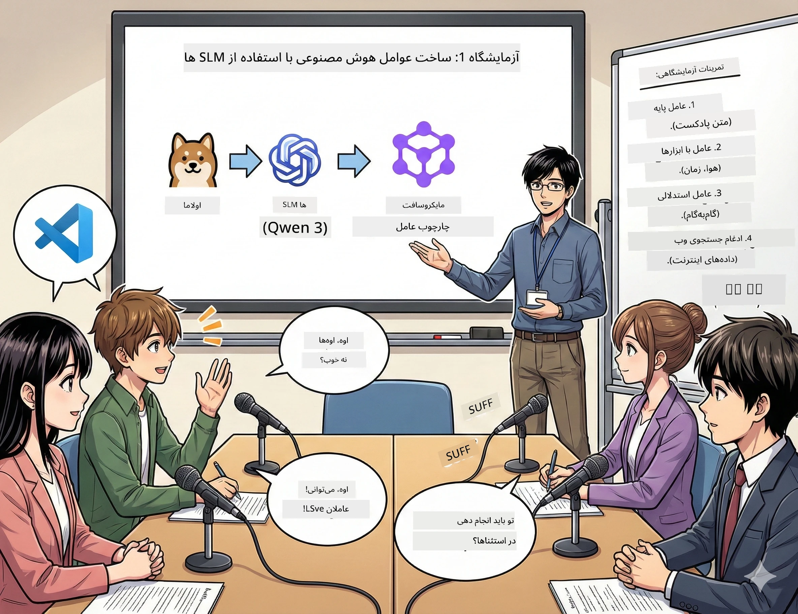

# پرده اول: دستیار پژوهشی هوش مصنوعی خود را ملاقات کنید 🤖

## چالش

شما در حال راه‌اندازی "Future Bytes" هستید، پادکست جدید تکنولوژی خودتان. قسمت اول درباره آخرین پیشرفت‌های هوش مصنوعی است، اما ۲۴ ساعت فرصت دارید تا:
1. موضوع را تحقیق کنید
2. منابع معتبر پیدا کنید
3. یک متن جذاب بنویسید
4. طوری بنویسید که طبیعی به نظر برسد

**پیچش داستان**: شما مجبور نیستید این کار را به تنهایی انجام دهید. در شرف ساخت اولین دستیار هوش مصنوعی خود هستید که می‌تواند در همه این موارد کمک کند. اسمش را الکس بگذاریم — شریک پژوهشی خستگی‌ناپذیر شما که هرگز به خواب نیاز ندارد.

## چرا مدل‌های زبان کوچک؟ (رازی: عالی هستند)

مدل‌های زبان کوچک (SLMs) را به عنوان هوش مصنوعی شخصی خودتان در نظر بگیرید که روی *کامپیوتر خودتان* زندگی می‌کند. بدون ابر، بدون هزینه‌های ماهانه، بدون اشتراک‌گذاری داده‌های مشکوک.

**چرا مدل‌های زبان کوچک 🔥 هستند:**
- **🏠 روی دستگاه شما اجرا می‌شود**: لپ‌تاپ، دسکتاپ، حتی یک Raspberry Pi قوی
- **💸 بدون هزینه‌های مداوم**: هیچ هزینه API که پول ناهارتان را بخورد وجود ندارد
- **🔒 اولویت حریم خصوصی**: داده‌های شما هرگز دستگاه را ترک نمی‌کند
- **⚡ بسیار سریع**: بدون تأخیر اینترنت، پاسخ‌های فوری
- **🪦 کم‌حجم**: ۱ میلیارد تا ۱۰ میلیارد پارامتر در مقابل ۱۰۰ میلیارد+ مدل‌های بزرگ

**مدل‌های زبان کوچک محبوب**: Qwen 3، Phi-4، Gemma 3 (ما برای این کارگاه از Qwen استفاده می‌کنیم)

## جعبه‌ابزار شما

### Ollama: مدیر مدل هوش مصنوعی شما

[Ollama](https://ollama.com/) مثل استیم برای مدل‌های هوش مصنوعی است. مدل‌ها را به سادگی دانلود، اجرا و مدیریت کنید.

**چیزی که آن را جذاب می‌کند:**
- با یک دستور مدل را دانلود و اجرا کنید
- روی مک، ویندوز، لینوکس کار می‌کند
- به صورت خودکار از GPU شما اگر داشته باشید استفاده می‌کند
- بسیار بهینه از نظر حافظه

### چارچوب Agent مایکروسافت: جایی که جادو رخ می‌دهد

[Microsoft Agent Framework](https://github.com/microsoft/agent-framework) زمین بازی شما برای ساخت عامل‌های هوش مصنوعی است که می‌توانند:

- 💬 چت کنند و حرف‌هایی که زده‌اید را به خاطر بسپارند
- 🛠️ از ابزارهای سفارشی استفاده کنند (مثل جستجوی وب یا بررسی هوا)
- 🧠 مسائل پیچیده را گام به گام بررسی کنند
- 🤝 با دیگر عوامل به صورت تیمی کار کنند
- 🔌 به ارائه‌دهندگان هوش مصنوعی مختلف وصل شوند (OpenAI، Ollama، Azure)

**بلوک‌های ساخت:**
- **عوامل**: دستیاران هوش مصنوعی شما با وظایف مشخص
- **ابزارها**: توانایی‌های ویژه‌ای که به آنها می‌دهید
- **حافظه**: تا گفتگو را فراموش نکنند
- **استدلال**: آموزش تفکر، نه فقط پاسخ دادن

## تمرین‌های شما: ۴ ماموریت

### ماموریت ۱: اولین عامل خود را بسازید

📓 [دفترچه باز کنید](../code/01.BasicAgent/00.BasicAgent-agent.ipynb)

**ماموریت**: الکس را بسازید، هوش مصنوعی نویسنده متن پادکست شما. الکس باید دیالوگ بین دو میزبان درباره موضوعات تکنولوژی تولید کند.

**آنچه یاد می‌گیرید**:
- چطور عامل هوش مصنوعی را بیدار کنید (سخت‌تر از بیدار شدن در دوشنبه نیست)
- به آن شخصیت و دستورالعمل بدهید
- متن واقعی پادکست تولید کنید
- فهمیدن پاسخ‌های آن

**شرط پیروزی**: الکس متنی برای قسمت آزمایشی "Future Bytes" درباره هوش مصنوعی می‌سازد! 🎯

### ماموریت ۲: به الکس ابرقدرت بدهید (ابزارها!)

📓 [دفترچه باز کنید](../code/01.BasicAgent/01.BasicAgent-tools.ipynb)

**ماموریت**: الکس باهوش است اما نمی‌داند امروز هوا چطور است یا ساعت چند است. بیایید این را با دادن ابزارها اصلاح کنیم!

**آنچه یاد می‌گیرید**:
- ساخت توابع پایتون سفارشی به عنوان "ابزار"
- به الکس اجازه دهید خودش تصمیم بگیرد *چه زمانی* از چه ابزاری استفاده کند
- ببینید چگونه به‌طور خودکار مشکل‌ها را حل می‌کند
- ترکیب چند ابزار برای کارهای پیچیده

**شرط پیروزی**: بپرسید «هوای توکیو امروز چطور است؟» و الکس خودش بفهمد! ☁️

### ماموریت ۳: به الکس یاد بدهید فکر کند

📓 [دفترچه باز کنید](../code/01.BasicAgent/02.BasicAgent-reasoning.ipynb)

**ماموریت**: الکس را وادار کنید کارش را نشان دهد. وقتی مسئله‌ای را حل می‌کند، شما می‌خواهید ببینید *چطور* فکر می‌کند نه فقط جواب نهایی.

**آنچه یاد می‌گیرید**:
- حالت "استدلال" را فعال کنید (مثل نشان دادن حل تمرین در کلاس ریاضی)
- روند فکری گام به گام الکس را ببینید
- مفهوم chain-of-thought prompting را درک کنید
- زمانی که الکس اشتباه می‌کند، اشکال‌زدایی کنید

**شرط پیروزی**: یک مسئله ریاضی سخت بپرسید و ببینید الکس چطور فکر می‌کند! 🧠

### ماموریت ۴: الکس را به اینترنت وصل کنید

📓 [دفترچه باز کنید](../code/01.BasicAgent/03.BasicAgent-websearch.ipynb)

**ماموریت**: دانش الکس یک تاریخ قطع دارد. بیایید آن را برای اطلاعات زمان واقعی به وب وصل کنیم!

**آنچه یاد می‌گیرید**:
- یک ابزار جستجوی وب سفارشی بسازید
- APIهای خارجی را یکپارچه کنید
- خطاهای شبکه را به خوبی مدیریت کنید
- اطلاعات فراتر از داده‌های آموزشی الکس بگیرید

**شرط پیروزی**: درباره خبرهای فناوری امروز بپرسید و نتایج تازه دریافت کنید! 📰

## قبل از شروع 🚀

**وسایل مورد نیاز**:
- نصب شده بودن پایتون ۳.۱۰+
- اجرای Ollama (با دستور `ollama --version` بررسی کنید)
- VS Code با افزونه پایتون
- حداقل ۸ گیگابایت رم (۱۶ گیگابایت برای کار روان‌تر)

## ترتیب ماموریت‌ها

دفترچه‌ها را به ترتیب برای داستان کامل دنبال کنید:

1. [00.BasicAgent-agent.ipynb](../code/01.BasicAgent/00.BasicAgent-agent.ipynb) — با الکس آشنا شوید (اولین عامل شما)
2. [01.BasicAgent-tools.ipynb](../code/01.BasicAgent/01.BasicAgent-tools.ipynb) — وقت قدرت‌بخشی!
3. [02.BasicAgent-reasoning.ipynb](../code/01.BasicAgent/02.BasicAgent-reasoning.ipynb) — به الکس یاد بدهید فکر کند
4. [03.BasicAgent-websearch.ipynb](../code/01.BasicAgent/03.BasicAgent-websearch.ipynb) — دسترسی به اینترنت باز شد!

## مهارت‌هایی که کسب می‌کنید

بعد از پرده اول، قادر خواهید بود:

- ✅ مدل‌های هوش مصنوعی را روی سخت‌افزار خودتان اجرا کنید (بدون نیاز به ابر)
- ✅ عامل‌هایی با شخصیت‌ها و مهارت‌های سفارشی بسازید
- ✅ به عوامل ابزار بدهید تا مشکلات واقعی را حل کنند
- ✅ عوامل را وادار به نشان دادن فرآیند استدلال کنید
- ✅ عوامل را به منابع داده خارجی وصل کنید
- ✅ وقتی مشکلی پیش آمد، اشکال‌زدایی کنید

## وقتی مشکلات پیش می‌آید (و چطور حلشان کنید) 🔧

### «الکس بارگذاری نمی‌شود! حافظه کم است!»
**راه حل**: کامپیوتر شما دارد به سختی کار می‌کند. سعی کنید برنامه‌های دیگر را ببندید، یا از مدل کوچکتر استفاده کنید. ۸ گیگابایت رم حداقل لازم است.

### «الکس خیلی کند است»
**راه حل**: شتاب‌دهی GPU را در تنظیمات Ollama فعال کنید. یا اندازه پنجره متن زمینه را کاهش دهید. حالت سرعت بالا فعال شد! 🏎️

### «ابزارها کار نمی‌کنند!»
**راه حل**: امضای توابع خود را دوباره بررسی کنید. الکس نیاز به راهنمایی‌های درست نوع داده دارد تا بداند ابزار چه کاری انجام می‌دهد. مثل دادن دستورالعمل‌های واضح فکر کنید.

## لینک‌های مفید 🔗

- [مستندات Agent Framework](https://github.com/microsoft/agent-framework) — راهنماها و مثال‌های رسمی
- [کتابخانه مدل Ollama](https://ollama.com/library) — مرور همه مدل‌های موجود
- [مدل Qwen](https://ollama.com/library/qwen3) — مغز هوش مصنوعی شما
- [نمونه کدها](https://github.com/microsoft/agent-framework/tree/main/python/samples) — ایده گرفتن از اینجا

## ادامه: پرده دوم 🎬

شما یک عامل دارید. اما اگر یک *تیم* از عامل‌ها داشتید که با هم کار کنند چطور؟ در پرده دوم، تیم کامل تولید پادکست خود را خواهید ساخت:
- **عامل پژوهشگر**: بهترین منابع را پیدا می‌کند
- **عامل نویسنده**: متن بی‌نظیری آماده می‌کند  
- **ویرایشگر (شما!)**: تأیید یا درخواست تغییرات می‌کند

بیایید جادوی هوش مصنوعی را به هم برسانیم! → [پرده دوم: تشکیل تیم تولید خود](02.AIAgentOrchestrationAndWorkflows.md)

---

**گرفتید؟** در طول کارگاه سؤال بپرسید. همه با هم در حال یادگیری هستیم! 🙌

---

<!-- CO-OP TRANSLATOR DISCLAIMER START -->
**سلب مسئولیت**:
این سند با استفاده از سرویس ترجمه ماشینی [Co-op Translator](https://github.com/Azure/co-op-translator) ترجمه شده است. در حالی که ما در دقت ترجمه تلاش می‌کنیم، لطفاً توجه داشته باشید که ترجمه‌های خودکار ممکن است حاوی خطاها یا نادرستی‌هایی باشند. سند اصلی به زبان بومی آن باید به عنوان منبع معتبر در نظر گرفته شود. برای اطلاعات حیاتی، ترجمه حرفه‌ای انسانی توصیه می‌شود. ما مسئول هیچ گونه سوءتفاهم یا برداشت نادرست ناشی از استفاده از این ترجمه نیستیم.
<!-- CO-OP TRANSLATOR DISCLAIMER END -->