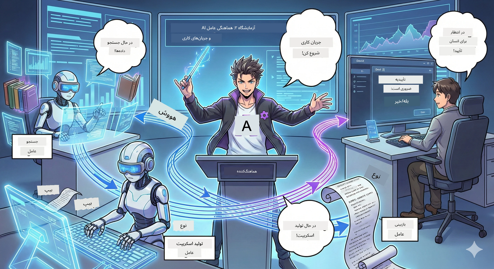

# پرده ۲: تیم تولید پادکست خود را جمع کنید 🎬



## داستان پیچیده‌تر می‌شود

الکس (دستیار هوش مصنوعی شما از پرده ۱) عالی است، اما یک عامل نمی‌تواند تمام یک استودیو پادکست را اداره کند. شما به یک *تیم* نیاز دارید:
- 🔍 **عامل تحقیق**: در اینترنت جستجو می‌کند تا اطلاعات تازه پیدا کند
- ✍️ **عامل نویسنده متن**: تحقیقات را به دیالوگ جذاب تبدیل می‌کند
- 👤 **شما (ویرایشگر)**: متن‌ها را تایید می‌کنید یا برای بازنویسی می‌فرستید

به **هماهنگی عوامل هوش مصنوعی** خوش آمدید — جایی که شما کارگردان تیم هوش مصنوعی خود می‌شوید. مثل اونجرز، ولی برای تولید پادکست.

## هماهنگی عوامل چیست؟ (نسخه ساده)

فرض کنید شما یک رستوران را اداره می‌کنید. همه کارها را خودتان انجام نمی‌دهید، درست است؟ شما:
- 🍳 سرآشپزی دارید که آشپزی می‌کند
- 👨‍🍳 کمک سرآشپز که آماده‌سازی انجام می‌دهد
- 👩‍🍳 پیشخدمتی که غذا را سرو می‌کند

هماهنگی عوامل هم همین است، اما با هوش مصنوعی. هر عامل تخصصی دارد و شما آن‌ها را برای رسیدن به اهداف بزرگ‌تر هماهنگ می‌کنید. هیچ عامل واحدی خسته نمی‌شود و کارها سریع‌تر انجام می‌شود.

### تشبیه گروه موسیقی 🎸

عامل‌های هوش مصنوعی شما مثل یک گروه موسیقی‌اند:
- **خواننده اصلی**: عامل اصلی که با مشتری تعامل دارد
- **نوازنده درامز**: ریتم را حفظ می‌کند و پردازش‌های پس‌زمینه را انجام می‌دهد  
- **نوازنده باس**: از همه حمایت می‌کند و داده‌ها را می‌آورد
- **شما (مدیر گروه)**: همه چیز را هماهنگ می‌کنید!

بدون هماهنگی؟ فقط صدای نامنظم. با هماهنگی؟ موسیقی زیبا.

### چرا این مهم است

یک عامل هوش مصنوعی که می‌خواهد همه کارها را انجام دهد = خسته شدن و فرسودگی. عوامل تخصصی که با هم کار می‌کنند = باز شدن قفل کارایی! 🚀

**واقعیت**: یادتان هست که می‌خواستید تحقیق کنید، بنویسید، و ویرایش کنید و همه را تنها انجام دهید؟ بله، خیلی سخت است. با هماهنگی، هر عامل کاری را که در آن خبره است انجام می‌دهد. شما فقط تصمیم نهایی را می‌گیرید.

**مثال واقعی**: ربات‌های پشتیبانی مشتری که می‌دانند چه زمانی مسئولیت صورتحساب و چه زمانی مشکلات فنی بر عهده آن‌هاست و چه زمانی باید انسان وارد شود. این هماهنگی است!

## عامل در برابر جریان کار: تفاوت چیست؟

این‌طور فکر کنید:

### 🤖 عامل هوش مصنوعی = نوازنده جاز
- **تصمیم‌گیری لحظه‌ای بر اساس چیزی که می‌شنود**
- **بداهه‌پردازی** راه‌حل با استفاده از ابزارهایش
- **فکر کردن با مغز LLM**
- **سازگاری** با هر چیزی که به آن داده‌اید

### 🎵 جریان کار = ارکستری که موسیقی کلاسیک اجرا می‌کند  
- **دنبال کردن نت نوشته شده** (مراحل از پیش تعیین‌شده)
- **اجرای قابل پیش‌بینی**
- **هماهنگی** بین چند عامل، انسان، و سیستم‌ها
- **ساختاریافته** مثل یک دستور پخت

**جادو**: جریان‌های کار، عامل‌ها را *هماهنگ* می‌کنند! شما یک جریان کار می‌سازید که به عوامل می‌گوید کی نقش خود را اجرا کنند. بهترین ترکیب هر دو دنیا. 🎭

## سه روش برای هماهنگی تیم هوش مصنوعی خود

### ۱. 🎯 متمرکز (شما رئیس هستید)

یک عامل اصلی همه تصمیمات را می‌گیرد. مثل مدیریت یک تیم که شما تعیین می‌کنید چه کسی چه کاری انجام دهد و چه زمانی.

**مزایا**:
- ✅ رهبری واضح (بدون ابهام)
- ✅ تصمیم‌های یکنواخت
- ✅ عیب‌یابی آسان

**برای چه مواردی استفاده کنید**:
- مسیر‌یابی خدمات مشتری ("این پرسش مربوط به صورتحساب است یا پشتیبانی فنی؟")
- جریان‌های تصویب محتوا ("آیا این متن تایید می‌شود؟")
- تولید پادکست (دقیقا همان چیزی که می‌سازیم!)

### ۲. 🤝 غیرمتمرکز (عوامل خودسازماندهی دارند)

عوامل مستقیماً با هم گفتگو می‌کنند و به عنوان یک گروه مسائل را حل می‌کنند. مثل یک چت گروهی که همه هماهنگ‌اند.

**مزایا**:
- ✅ مقیاس‌پذیری آسان (هر زمان که بخواهید عامل اضافه کنید)
- ✅ عدم وجود نقطه شکست واحد
- ✅ همکاری طبیعی عوامل

**برای چه مواردی استفاده کنید**:
- تیم‌های تحقیقاتی (هر عامل منابع مختلف را کاوش می‌کند)
- جلسات همفکری
- حل مسائل توزیع‌شده

### ۳. 🔀 ترکیبی (بهترین‌های هر دو)

شما جهت کلی را تعیین می‌کنید، اما عوامل آزادی خودسازماندهی در کارها دارند. مثل مدیرعاملی که به تیم خود اعتماد دارد.

**مناسب برای**: پروژه‌های پیچیده که هم نیاز به کنترل و هم نیاز به انعطاف دارند.

## چارچوب Agent Framework مایکروسافت: جعبه ابزار هماهنگی شما 🧰

وقت ساختن است! این‌ها چیزی است که استفاده خواهید کرد:

### بلوک‌های اصلی

#### ۱. 🧱 اجراکننده‌ها (کارگرهای شما)
- **چی هستند**: واحدهای پردازشی مستقل — می‌توانند عامل یا منطق سفارشی باشند
- **چه کاری انجام می‌دهند**: ورودی می‌گیرند، کار می‌کنند، خروجی می‌دهند
- **مثل ایستگاه‌های یک خط تولید**

#### ۲. ➡️ یال‌ها (اتصالات)
- **چی هستند**: مسیرهای بین اجراکننده‌ها
- **چه کاری انجام می‌دهند**: جریان پیام را کنترل می‌کنند ("بعد از A برو به B")
- **مثل فلش‌های یک نمودار جریان**

#### ۳. 🗺️ جریان‌های کار (طرح کلی)
- **چی هستند**: گراف کامل اجراکننده‌ها و یال‌ها
- **چه کاری انجام می‌دهند**: کل فرایند را از ابتدا تا پایان تعریف می‌کنند
- **مثل نقشه خط تولید شما**

### ویژگی‌های فوق‌العاده‌ای که دوست خواهید داشت

**🛡️ ایمنی نوع داده‌ها**: پیام‌ها بین عوامل از نظر نوع داده چک می‌شوند. هیچ‌وقت "اوپس، نوع داده اشتباه است" نخواهید دید.

**🔀 مسیر‌یابی انعطاف‌پذیر**: 
- شرط‌های اگر-آنگاه ("اگر تایید شد، منتشر کن؛ در غیر این صورت بازنویسی کن")
- پردازش موازی (چندین عامل هم‌زمان کار می‌کنند)
- مسیرهای پویا (جریان کار بر اساس نتایج سازگار می‌شود)

**🔌 یکپارچه‌سازی خارجی**:
- اتصال به APIها
- اضافه کردن نقاط بررسی انسان در حلقه (شما قبل از انتشار تایید می‌کنید)
- ساخت جریان‌های درخواست/پاسخ

**💾 نقطه‌چک‌گذاری**: پیشرفت را ذخیره کنید! اگر چیزی خراب شد، از همان‌جا ادامه دهید.

**🤝 هماهنگی چندعامل**:
- اجرای عامل‌ها به ترتیب (A → B → C)
- اجرای موازی (A + B + C هم‌زمان)
- تحویل از یک عامل به عامل دیگر
- پردازش مشارکتی

## بهترین شیوه‌ها (نکات حرفه‌ای) 🎯

### ۱. آن را ماژولار نگه دارید
هر عامل باید فقط یک کار را خیلی خوب انجام دهد. یک "ابرعامل" که همه کارها را انجام دهد نسازید — در عیب‌یابی متاسف می‌شوید.

### ۲. برای خطاها برنامه‌ریزی کنید
عامل‌ها اشتباه می‌کنند. شبکه‌ها خراب می‌شوند. مدیریت خطا و طرح‌های پشتیبان بسازید. نسخه آینده خودتان از شما تشکر خواهد کرد.

### ۳. همه چیز را پایش کنید
پیگیری کنید عامل‌ها چه می‌کنند. از DevUI (که توضیح می‌دهیم!) برای دیدن جریان‌های کار استفاده کنید.

### ۴. اندازه پیام‌ها را بهینه کنید
پیام‌های حجیم بین عامل‌ها رد و بدل نکنید. پیام‌ها را سبک و کوچک نگه دارید تا سرعت بالا باشد.

### ۵. الگوی مناسب را انتخاب کنید
نیاز به کنترل دارید؟ متمرکز بروید. نیاز به مقیاس دارید؟ غیرمتمرکز بروید. نمی‌توانید تصمیم بگیرید؟ ترکیبی باشید!

## DevUI: اشکال‌زدای جریان کار شما 🔍

### DevUI چیست؟

DevUI مثل یک زمین بازی برای آزمایش عامل‌ها و جریان‌های کار است. این یک رابط وب است که می‌توانید:
- 👀 اجرای جریان کار خود را در عمل ببینید
- 💬 مستقیماً با عامل‌ها چت کنید
- 🔍 وقتی مشکلی پیش آمد اشکال‌زدایی کنید
- 📊 ردیابی و معیارهای عملکرد را مشاهده کنید

> **مهم**: DevUI فقط برای توسعه است! در محیط تولید استفاده نکنید. آن را به عنوان محیط آزمایش محلی خود در نظر بگیرید.

### چیزی که آن را عالی می‌کند

- **🖥️ رابط وب تعاملی**: کلیک، تایپ، تست — نیازی به خط فرمان نیست
- **📁 کشیدن و رها کردن آماده**: فایل‌ها را آپلود کنید، با ورودی‌های مختلف تست کنید
- **📂 کشف خودکار**: آن را روی یک پوشه بگذارید، تمام عوامل شما را به طور خودکار می‌یابد
- **📋 حالت بدون راه‌اندازی**: عوامل را در کد ثبت کنید، نیازی به ساختار پوشه نیست
- **🔌 سازگار با OpenAI**: با SDK OpenAI کار می‌کند (سازگاری برای برتری!)
- **👁️ ردیابی داخلی**: دقیقاً ببینید عوامل چه می‌کنند

### نحوه کار ورودی‌ها

DevUI در مدیریت ورودی‌ها هوشمند است:

- **در حال آزمایش عامل‌ها هستید؟** جعبه متن و دکمه آپلود فایل دریافت می‌کنید
- **در حال آزمایش جریان‌های کار هستید؟** UI به طور خودکار فیلدهای ورودی متناسب با انتظار جریان کار ایجاد می‌کند

این جادو نیست، فقط کد خوب است. ✨

## ماموریت‌های شما: ساخت یک استودیوی پادکست 🎬

### ماموریت ۱: ساخت یک عامل تکی با DevUI

📂 [01.AgentDevUI](../../../../WorkshopForAgentic/code/02.Workflow/01.AgentDevUI)

**چالش**: قبل از ساخت تیم کامل، بیایید DevUI را با یک عامل آزمایش کنیم: متخصص جستجوی وب.

**آنچه می‌سازید**:
عاملی برای تحقیق که موضوعات پادکست را در اینترنت جستجو می‌کند. با استفاده از رابط وب DevUI در `http://localhost:8090` آن را تست خواهید کرد.

**مهارت‌هایی که می‌آموزید**:
- 🚀 راه‌اندازی عامل‌ها در DevUI
- 🔍 تست پاسخ عامل در زمان واقعی
- 🛠️ ساخت ابزارهای سفارشی (جستجوی وب)
- 📊 فعال‌سازی ردیابی برای اشکال‌زدایی
- 🖥️ استفاده از رابط وب تعاملی

**کد**:
- `agent.py`: عامل جستجوی وب شما با قابلیت‌های ویژه جستجو
- استفاده از OllamaChatClient برای اتصال به Qwen
- پیاده‌سازی تابع ابزار `web_search()`
- راه‌اندازی با `serve()` که به طور خودکار DevUI را باز می‌کند

**شرط پیروزی**: از عامل بپرسید "چه چیزی در هوش مصنوعی ترند است؟" و ببینید که وب را جستجو می‌کند! 🎉

### ماموریت ۲: ساخت یک جریان کار چندعامله

📂 [02.WorkflowDevUI](../../../../WorkshopForAgentic/code/02.Workflow/02.WorkflowDevUI)

**چالش**: حالا بخش واقعی شروع می‌شود! یک جریان کامل تولید پادکست بسازید با:
1. 🔍 **عامل جستجو** → موضوع شما را تحقیق می‌کند
2. ✍️ **عامل نویسنده** → میان دو میزبان (به چینی!) دیالوگ می‌نویسد
3. 👤 **اجرای بازبینی** → از شما می‌خواهد تایید یا رد کنید
4. 🔄 **حلقه بازگشتی** → اگر رد شد، بر اساس بازخوردتان بازنویسی می‌کند

**مهارت‌هایی که می‌آموزید**:
- 🧱 ساخت عوامل تخصصی برای کارهای مختلف
- 🔗 وصل کردن عامل‌ها با WorkflowBuilder
- 🔀 پیاده‌سازی حلقه‌های تایید (انسان در حلقه!)
- 🚦 مسیر‌یابی شرطی (اگر تایید شد یا رد شد)
- 🔧 ساخت اجراکننده‌های سفارشی برای منطق کسب‌وکار

**جریان کار**:
```
SearchAgent → ScriptAgent → ReviewExecutor
                             ↑          ↓ (if rejected)
                             ←─────────
```

**کد**:
- `search_agent/agent.py`: متخصص تحقیق شما
- `generate_script_agent/agent.py`: نویسنده متن شما (به چینی می‌نویسد!)
- `workflow/workflow.py`: جایی که هماهنگی جادویی اتفاق می‌افتد
- `main.py`: همه چیز را در DevUI اجرا می‌کند

**شرط پیروزی**: موضوعی بدهید، متن را بازبینی کنید، یک بار رد کنید تا حلقه را تست کنید، سپس تایید کنید! 🎉

### ماموریت ۳: ساخت برنامه کنسول

📂 [03.Application](../../../../WorkshopForAgentic/code/02.Workflow/03.Application)

**چالش**: جریان کاری خود را از DevUI بگیرید و آن را به یک برنامه ترمینال شیک با خروجی رنگی، چرخنده‌های بارگذاری و ذخیره فایل تبدیل کنید. این برای تولید آماده است!

**مهارت‌هایی که می‌آموزید**:
- ⚡ اجرای جریان‌های کار به صورت برنامه‌نویسی (بدون DevUI)
- 📡 معماری رویدادمحور با جریان داده
- 🎨 ساخت UI زیبا برای ترمینال (رنگ‌ها، چرخنده‌ها، نوارهای پیشرفت)
- 💾 ذخیره متن نهایی در فایل
- 🔄 مدیریت جریان‌های کار ناهمزمان با asyncio پایتون

**کارهایی که انجام می‌دهد**:
1. از شما موضوع پادکست می‌پرسد
2. پیشرفت لحظه‌ای را نشان می‌دهد ("عامل جستجو در حال کار است...")
3. متن تولیدشده را با رنگ نمایش می‌دهد
4. از شما تایید می‌گیرد
5. متن تایید شده را در `podcast.txt` ذخیره می‌کند

**کد**:
- `podcast_app.py`: برنامه اصلی شما با مدیریت رویدادها
- `workflow.py`: استفاده مجدد از جریان کار ماموریت ۲
- مدیریت رویدادها: `AgentRunUpdateEvent`، `RequestInfoEvent`، `WorkflowOutputEvent`
- استفاده از رنگ‌های ANSI برای استایل ترمینال

**شرط پیروزی**: برنامه را اجرا کنید، یک متن پادکست بسازید، و ببینید ذخیره شده است! شما یک ابزار واقعی ساخته‌اید. 🚀

## آنچه یاد گرفته‌اید 🏆

پس از پرده ۲، می‌توانید:

- ✅ مثل یک مدیر، چندین عامل هوش مصنوعی را هماهنگ کنید
- ✅ جریان‌های کار با منطق توالی و شرطی بسازید
- ✅ نقاط تایید انسانی اضافه کنید
- ✅ از DevUI برای تست و اشکال‌زدایی جریان‌های کار استفاده کنید
- ✅ برنامه‌های کنسول آماده تولید بسازید
- ✅ خطاها را در سیستم‌های پیچیده به خوبی مدیریت کنید
- ✅ الگوی هماهنگی مناسب برای هر پروژه را انتخاب کنید

## وقتی مشکلات پیش می‌آید 🔧

### "جریان کار من خیلی پیچیده است!"
**راه حل**: آن را به جریان‌های فرعی کوچک‌تر تقسیم کنید. هر جریان یک کار را خوب انجام دهد. اگر لازم است آن‌ها را زنجیره کنید.

### "نمی‌توانم پیگیری کنم چه اتفاقی می‌افتد!"
**راه حل**: از نقطه‌چک‌گذاری جریان کار برای ذخیره وضعیت استفاده کنید. در DevUI ردیابی را فعال کنید تا هر مرحله را ببینید.

### "خطای یک عامل کل سیستم را خراب می‌کند!"
**راه حل**: مرزهای خطا اضافه کنید. هر عامل باید خطاهای خود را مدیریت کند و رفتار جایگزین داشته باشد.

### "خیلی کند است"
**راه حل**: آیا می‌شود عامل‌ها را موازی اجرا کرد؟ جریان‌های توالی ساده ولی کند هستند. به دنبال فرصت‌های اجرای موازی باشید!

## منابع مفید 🔗

- [مستندات جریان کار](https://learn.microsoft.com/en-us/agent-framework/user-guide/workflows/overview) — راهنمای رسمی مایکروسافت  
- [الگوهای هماهنگی](https://www.ibm.com/think/topics/ai-agent-orchestration) — دیدگاه IBM درباره آن  
- [چارچوب Agent Framework در گیت‌هاب](https://github.com/microsoft/agent-framework) — مرور کد منبع
- [نمونه‌های کد](https://github.com/microsoft/agent-framework/tree/main/python/samples) — الگوها را از اینجا بردارید

---

**آماده‌ی پایان کار هستید؟** اسکریپت خود را دارید. حالا بیایید آن را به صدای واقعی تبدیل کنیم! → [بخش ۳: پادکست خود را زنده کنید](03.Multi-SpeakerPodcastGenerationWithVibeVoice.md) 🎤

---

**گیر کرده‌اید؟ گیج شده‌اید؟ هیجان‌زده‌اید؟** در چت کارگاه به اشتراک بگذارید! همه‌ی ما در حال یادگیری با هم هستیم. 🚀

---

<!-- CO-OP TRANSLATOR DISCLAIMER START -->
**توضیحات مهم**:
این سند با استفاده از سرویس ترجمه هوش مصنوعی [Co-op Translator](https://github.com/Azure/co-op-translator) ترجمه شده است. در حالی که ما در تلاش برای دقت هستیم، لطفاً توجه داشته باشید که ترجمه‌های خودکار ممکن است حاوی اشتباهات یا نواقصی باشند. سند اصلی به زبان بومی آن باید به عنوان منبع معتبر در نظر گرفته شود. برای اطلاعات حیاتی، ترجمه حرفه‌ای انسانی توصیه می‌شود. ما مسئول هیچ گونه سوتفاهم یا برداشت نادرست ناشی از استفاده از این ترجمه نیستیم.
<!-- CO-OP TRANSLATOR DISCLAIMER END -->