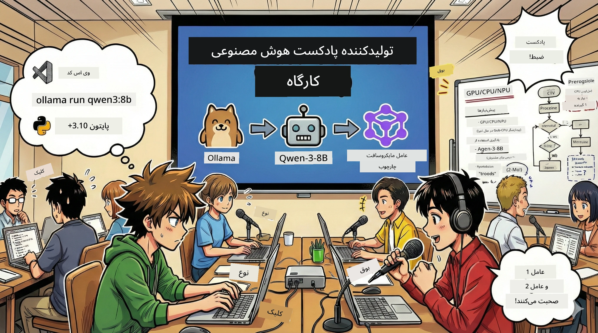

# 🎙️ کارگاه استودیو پادکست هوش مصنوعی



## وظیفه شما

به **استودیو پادکست هوش مصنوعی** خوش آمدید! شما در شرف راه‌اندازی پادکست فناوری خود با نام «بایت‌های آینده» هستید — اما یک پیچش وجود دارد: شما تیم تولیدی مبتنی بر هوش مصنوعی را برای کمک به خلق آن خواهید ساخت. دیگر نیازی به پژوهش بی‌پایان، نوشتن متن و ویرایش صوتی نیست. در عوض، شما با برنامه‌نویسی به یک تولیدکننده پادکست با قدرت فوق بشری هوش مصنوعی تبدیل خواهید شد.

## داستان پس‌زمینه

تصور کنید: شما و دوستانتان می‌خواهید پادکستی درباره هیجان‌انگیزترین روندهای تکنولوژیک بسازید، ولی همه مشغول یادگیری، کار یا زندگی هستند. اگر بتوانید تیمی از عامل‌های هوشمند AI بسازید تا کارهای سنگین را انجام دهند چه؟ یک عامل برای تحقیق روی موضوع، دیگری برای نوشتن متن جذاب، و سومی برای تبدیل متن به گفتگوی طبیعی و روان. چه شبیه داستان علمی-تخیلی است؟ بیایید آن را واقعی کنیم.

## چیزی که یاد خواهید گرفت

در پایان این کارگاه، شما خواهید دانست چگونه:
- 🤖 مدل هوش مصنوعی محلی خود را مستقر کنید (بدون هزینه API، بدون وابستگی به ابر!)
- 🔧 عوامل هوشمند هوش مصنوعی حرفه‌ای بسازید که با هم به صورت تعاملی کار کنند
- 🎬 کل فرایند تولید پادکست از ایده تا صوت را ایجاد کنید

## مسیر شما: نمایش سه پرده‌ای

مانند هر داستان خوب، ما سه پرده داریم. هر پرده استودیو پادکست هوش مصنوعی شما را گام به گام می‌سازد:

| فصل | وظیفه شما | چه اتفاقی می‌افتد | مهارت‌های باز شده |
|---------|-----------|--------------|----------------|
| **پرده اول** | [آشنایی با دستیار هوش مصنوعی خود](01.BuildAIAgentWithSLM.md) | می‌آموزید چگونه عوامل هوش مصنوعی بسازید که توانایی چت کردن، جستجوی وب و حتی حل مسئله را دارند. آن‌ها را به عنوان دانشجویان پژوهشی که هرگز نمی‌خوابند تصور کنید. | 🎯 ساخت اولین عامل<br>🛠️ تجهیز با قدرت‌های فوق (ابزارها!)<br>🧠 آموزش تفکر به آن‌ها<br>🌐 اتصال به اینترنت |
| **پرده دوم** | [ساخت تیم تولید خود](02.AIAgentOrchestrationAndWorkflows.md) | اکنون کارها جالب می‌شود! چند عامل هوش مصنوعی را به گونه‌ای هماهنگ خواهید کرد که مثل یک تیم واقعی پادکست با هم کار کنند. یکی تحقیق می‌کند، یکی می‌نویسد، شما تأیید می‌کنید — همکاری تیمی رویاها را محقق می‌کند. | 🎭 هماهنگی چندین عامل<br>🔄 ساخت جریان‌های کاری تأیید<br>🖥️ آزمون با رابط DevUI<br>✋ حفظ کنترل انسانی |
| **پرده سوم** | [پادکست خود را زنده کنید](03.Multi-SpeakerPodcastGenerationWithVibeVoice.md) | صحنه پایانی! متن خود را به فایل صوتی واقعی با صدای طبیعی و گفتگوهای روان تبدیل کنید. پادکست «بایت‌های آینده» شما آماده انتشار است! | 🎤 جادوی تبدیل متن به گفتار<br>👥 صدای چندگوینده<br>⏱️ صوت طولانی<br>🚀 کاملاً خودکار |

هر پرده مهارت جدیدی به شما می‌آموزد. اگر شجاعت دارید می‌توانید از هر جایی شروع کنید، اما توصیه می‌کنیم به ترتیب پیش روید!

## نیازهای محیطی

این کارگاه از انواع سخت‌افزار پشتیبانی می‌کند:
- **CPU**: مناسب برای تست و استفاده در مقیاس کوچک
- **GPU**: توصیه شده برای محیط تولید، افزایش چشمگیر سرعت استنتاج
- **NPU**: پشتیبانی از نسل بعدی شتاب‌دهنده‌های واحد پردازش عصبی

## آنچه نیاز دارید

### فهرست نرم‌افزار ✅
- **Python 3.10+** (زبان برنامه‌نویسی شما)
- **Ollama** (اجرای مدل هوش مصنوعی روی ماشین شما)
- **VS Code** (ویرایشگر کد شما)
- **افزونه Python** (که VS Code را هوشمندتر می‌کند)
- **Git** (برای دریافت کد)

### بررسی سخت‌افزار 💻
- **آیا می‌توانم اجرا کنم؟**: 8GB رم، 10GB فضای آزاد (قابل استفاده اما ممکن است کمی کند باشد)
- **پیکربندی ایده‌آل**: 16GB+ رم، یک GPU خوب (اجرای روان!)
- **NPU دارید؟**: چه بهتر! عملکرد نسل بعدی را آزاد کنید 🚀

## استودیو خود را راه‌اندازی کنید 🎬

### گام 1: بروزرسانی Python

اطمینان حاصل کنید که Python 3.10 یا بالاتر دارید:

```bash
python --version
# باید نسخه Python 3.10.x یا بالاتر نمایش داده شود
```

Python ندارید؟ آن را از [python.org](https://python.org) دریافت کنید — رایگان است!

### گام 2: دریافت Ollama (موتور اجرای مدل هوش مصنوعی شما)

به [ollama.ai](https://ollama.ai) بروید و Ollama مناسب سیستم خود را دانلود کنید. آن را موتور اجرای مدل هوش مصنوعی محلی تصور کنید.

آمادگی را بررسی کنید:

```bash
ollama --version
```

### گام 3: دانلود مغز AI خود 🧠

وقت آن است مدل Qwen-3-8B را دریافت کنید (مثل استخدام اولین دستیار هوش مصنوعی شما):

```bash
ollama pull qwen3:8b
```

*ممکن است چند دقیقه طول بکشد. زمان ایده‌آل برای یک قهوه!☕*

### گام 4: تنظیم VS Code

اگر هنوز ندارید، [Visual Studio Code](https://code.visualstudio.com/) را دریافت کنید. این بهترین ویرایشگر کد است (اگر مخالفید، بیایید بحث کنیم 😄).

### گام 5: افزونه Python

در VS Code:
1. کلیدهای `Ctrl+Shift+X` را فشار دهید (در مک `Cmd+Shift+X`)
2. "Python" را جستجو کنید
3. افزونه رسمی Microsoft Python را نصب کنید

### گام 6: تبریک! 🎉

واقعا، شما آماده‌اید. بیایید کمی جادوی هوش مصنوعی بسازیم!

### گام 7: نصب Microsoft Agent Framework و بسته‌های مرتبط 📦

تمام وابستگی‌های مورد نیاز کارگاه را نصب کنید:

```bash
pip install -r ./Installations/requirements.txt -U
```

*این Microsoft Agent Framework و همه بسته‌های لازم را نصب می‌کند. یک قهوه بنوشید — نصب اولیه ممکن است چند دقیقه طول بکشد!☕*

## دستورالعمل‌های کارگاه

ساختار پروژه، مراحل پیکربندی و نحوه اجرا به تفصیل در طول کارگاه آموزش داده خواهد شد.

## عیب‌یابی (زمانی که مشکلات پیش می‌آیند) 🔧

### "وای، دانلود مدل خیلی کند است!"
**راه‌حل**: از VPN استفاده کنید یا منابع Ollama را پیکربندی کنید. گاهی اوقات اینترنت مشکلاتی دارد.

### "کامپیوترم نزدیک است هنگ کند! رم کافی نیست!"
**راه‌حل**: به مدل کوچکتر سوئیچ کنید یا مقدار `num_ctx` را تنظیم کنید تا حافظه کمتری مصرف شود. مثل رژیم دادن به هوش مصنوعی خود فکر کنید.

### "می‌توانم از GPU برای سرعت بیشتر استفاده کنم؟"
**راه‌حل**: Ollama به طور خودکار GPU را تشخیص می‌دهد! فقط مطمئن شوید درایور GPU شما به‌روز است. افزایش سرعت رایگان!🏎️

## منابع اضافی (برای کنجکاوان) 📚

- [مستندات Ollama](https://github.com/ollama/ollama) — یادگیری بیشتر درباره مدل AI محلی  
- [Microsoft Agent Framework](https://microsoft.github.io/autogen/) — بیشتر درباره ساخت تیم‌های عامل هوشمند  
- [اطلاعات مدل Qwen](https://qwenlm.github.io/) — شناخت مغز دستیار AI خود  

## مجوز

مجوز MIT — چیزهای شگفت‌انگیز بسازید، آن‌ها را به اشتراک بگذارید، جهان را بهتر کنید!🌍

## می‌خواهید مشارکت کنید؟

باگی پیدا کردید؟ ایده‌ای دارید؟ Issue یا PR ارسال کنید! ما جوامع را دوست داریم.✨

---

<!-- CO-OP TRANSLATOR DISCLAIMER START -->
**سلب مسئولیت**:  
این سند با استفاده از سرویس ترجمه هوش مصنوعی [Co-op Translator](https://github.com/Azure/co-op-translator) ترجمه شده است. با اینکه ما در تلاش برای دقت هستیم، لطفاً توجه داشته باشید که ترجمه‌های خودکار ممکن است حاوی خطاها یا نواقصی باشند. سند اصلی به زبان بومی خود باید به عنوان منبع معتبر در نظر گرفته شود. برای اطلاعات حیاتی، توصیه می‌شود از ترجمه حرفه‌ای انسانی استفاده شود. ما در قبال هرگونه سوء تفاهم یا تفسیر نادرست ناشی از استفاده از این ترجمه مسئولیتی نداریم.
<!-- CO-OP TRANSLATOR DISCLAIMER END -->