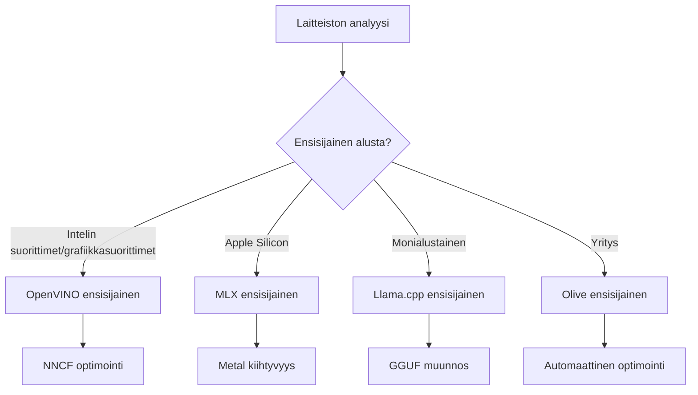
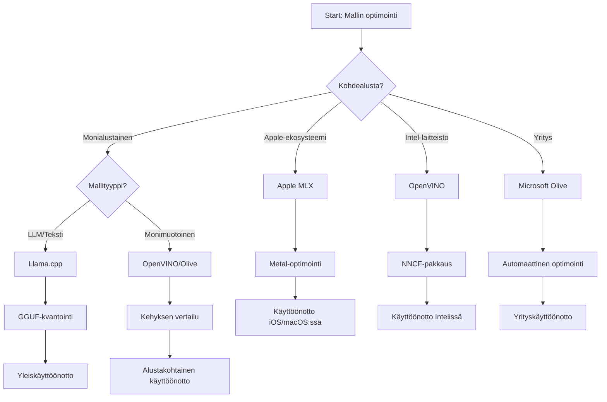
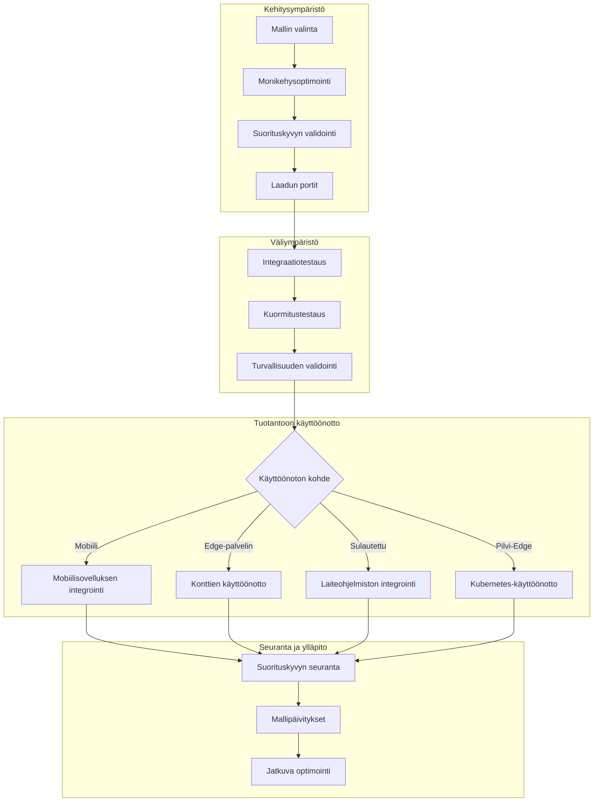

# Osa 6: Edge AI -kehityssyklin yhdistäminen

## Sisällysluettelo
1. [Johdanto](#johdanto)
2. [Oppimistavoitteet](#oppimistavoitteet)
3. [Yhtenäinen työnkulun yleiskatsaus](#yhtenäinen-työnkulun-yleiskatsaus)
4. [Kehyksen valintamatriisi](#kehyksen-valintamatriisi)
5. [Parhaiden käytäntöjen yhteenveto](#parhaiden-käytäntöjen-yhteenveto)
6. [Jalkautusstrategian opas](#jalkautusstrategian-opas)
7. [Suorituskyvyn optimointityönkulku](#suorituskyvyn-optimointityönkulku)
8. [Tuotantovalmistautumisen tarkistuslista](#tuotantovalmistautumisen-tarkistuslista)
9. [Vianetsintä ja seuranta](#vianetsintä-ja-seuranta)
10. [Edge AI -putkesi tulevaisuuden varmistaminen](#edge-ai-putkesi-tulevaisuuden-varmistaminen)

## Johdanto

Edge AI -kehitys vaatii syvällistä ymmärrystä useista optimointikehyksistä, jalkautusstrategioista ja laitteistotekijöistä. Tämä kattava yhteenveto yhdistää tiedot Llama.cpp:stä, Microsoft Olivesta, OpenVINO:sta ja Apple MLX:stä luodakseen yhtenäisen työnkulun, joka maksimoi tehokkuuden, ylläpitää laatua ja varmistaa onnistuneen tuotantojalkautuksen.

Kurssin aikana olemme tutkineet yksittäisiä optimointikehyksiä, joilla kaikilla on omat vahvuutensa ja erityiset käyttötarkoituksensa. Kuitenkin todelliset Edge AI -projektit vaativat usein useiden kehyksien yhdistämistä tai strategisia päätöksiä siitä, mikä lähestymistapa tuo parhaat tulokset tiettyjen rajoitusten ja vaatimusten puitteissa.

Tämä osio kokoaa kaikkien kehysten kollektiivisen viisauden käyttökelpoisiksi työnkuluiksi, päätöspuiksi ja parhaiksi käytännöiksi, jotka mahdollistavat tuotantovalmiiden Edge AI -ratkaisujen tehokkaan ja vaikuttavan rakentamisen. Olitpa optimoimassa mobiililaitteille, upotetuille järjestelmille tai reunapalvelimille, tämä opas tarjoaa strategisen kehyksen, jolla teet perusteltuja päätöksiä kehityskiertosi aikana.

## Oppimistavoitteet

Tämän osion lopussa osaat:

### Strateginen päätöksenteko
- **Arvioida ja valita** paras optimointikehys projektivaatimusten, laitteistorajoitusten ja jalkautustilanteiden mukaan
- **Suunnitella kattavat työnkulut**, jotka yhdistävät useita optimointitekniikoita maksimaaliseen tehokkuuteen
- **Arvioida kompromisseja** mallin tarkkuuden, päättelynopeuden, muistinkäytön ja jalkautuksen monimutkaisuuden välillä eri kehyksissä

### Työnkulun integrointi
- **Toteuttaa yhtenäiset kehityspäät**, jotka hyödyntävät useiden optimointikehysten vahvuuksia
- **Luoda toistettavia työnkulkuja** tasaisen mallin optimoinnin ja jalkautuksen varmistamiseksi eri ympäristöissä
- **Perustaa laatukriteerejä** ja validointiprosesseja, jotka varmistavat optimoitujen mallien täyttävän tuotantovaatimukset

### Suorituskyvyn optimointi
- **Soveltaa systemaattisia optimointistrategioita** kuten kvantisointi, leikkaus ja laitteistokohtaiset kiihdytykset
- **Seurata ja mitata** mallin suorituskykyä eri optimointitasoilla ja jalkautuskohteissa
- **Optimoida erityisiä laitteistoalustoja** kuten CPU, GPU, NPU ja erikoistuneet reunakiihdyttimet

### Tuotantojalkautus
- **Suunnitella skaalautuvat jalkautusarkkitehtuurit**, jotka tukevat useita malliformaatteja ja päättelymoottoreita
- **Toteuttaa seuranta ja havainnointijärjestelmät** Edge AI -sovelluksille tuotantoympäristöissä
- **Perustaa ylläpitotyönkulut** mallipäivityksille, suorituskyvyn seurannalle ja järjestelmän optimoinnille

### Monialustainen erinomaisuus
- **Jalkauttaa optimoidut mallit** monille laitteistoalustoille pitäen suorituskyky yhdenmukaisena
- **Käsitellä alustoittain erikoistuneita optimointeja** Windowsille, macOS:lle, Linuxille, mobiilille ja upotetuille järjestelmille
- **Luoda abstraktiokerrokset**, jotka mahdollistavat saumattoman jalkautuksen eri reunaympäristöissä

## Yhtenäinen työnkulun yleiskatsaus

### Vaihe 1: Vaatimusten analyysi ja kehyksen valinta

Menestyksekkään Edge AI -jalkautuksen perusta alkaa perusteellisella vaatimusanalyy­silla, joka ohjaa kehyksen valintaa ja optimointistrategiaa.

#### 1.1 Laitteistoarviointi


**Keskeiset huomioitavat tekijät:**
- **CPU-arkkitehtuuri**: x86, ARM, Apple Silicon -ominaisuudet
- **Kiihdyttimien saatavuus**: GPU, NPU, VPU, erikoistuneet AI-sirut
- **Muistirajoitukset**: RAM-rajoitukset, tallennuskapasiteetti
- **Virran kulutus**: Akun kesto, lämpörajoitukset
- **Yhteydet**: Offline-vaatimukset, kaistanleveyden rajoitukset

#### 1.2 Sovellusvaatimusten matriisi

| Vaatimus | Llama.cpp | Microsoft Olive | OpenVINO | Apple MLX |
|-------------|-----------|-----------------|----------|-----------|
| Monialustainen | ✅ Erinomainen | ⚡ Hyvä | ⚡ Hyvä | ❌ Vain Apple |
| Yritysin­tegraatio | ⚡ Perus | ✅ Erinomainen | ✅ Erinomainen | ⚡ Rajoitettu |
| Mobiilijalkautus | ✅ Erinomainen | ⚡ Hyvä | ⚡ Hyvä | ✅ iOS Erinomainen |
| Reaaliaikainen päättely | ✅ Erinomainen | ✅ Erinomainen | ✅ Erinomainen | ✅ Erinomainen |
| Mallien monipuolisuus | ✅ LLM-keskittymä | ✅ Kaikki mallit | ✅ Kaikki mallit | ✅ LLM-keskittymä |
| Helppokäyttöisyys | ✅ Yksinkertainen | ✅ Automaattinen | ⚡ Kohtalainen | ✅ Yksinkertainen |

### Vaihe 2: Mallin valmistelu ja optimointi

#### 2.1 Yleinen mallin arviointiputki

```python
# Universaali mallin arviointikehys
class EdgeAIModelAssessment:
    def __init__(self, model_path, target_hardware):
        self.model_path = model_path
        self.target_hardware = target_hardware
        self.optimization_frameworks = []
        
    def assess_model_characteristics(self):
        """Analyze model size, architecture, and complexity"""
        return {
            'model_size': self.get_model_size(),
            'parameter_count': self.get_parameter_count(),
            'architecture_type': self.detect_architecture(),
            'quantization_compatibility': self.check_quantization_support()
        }
    
    def recommend_optimization_strategy(self):
        """Recommend optimal frameworks and techniques"""
        characteristics = self.assess_model_characteristics()
        
        if self.target_hardware.startswith('apple'):
            return self.mlx_optimization_strategy(characteristics)
        elif self.target_hardware.startswith('intel'):
            return self.openvino_optimization_strategy(characteristics)
        elif characteristics['model_size'] > 7_000_000_000:  # 7 miljardin+ parametria
            return self.enterprise_optimization_strategy(characteristics)
        else:
            return self.lightweight_optimization_strategy(characteristics)
```

#### 2.2 Monikehyksinen optimointiputki

**Peräkkäinen optimointimenetelmä:**
1. **Alkuperäinen muunnos**: Muunna välimuotoon (ONNX, kun mahdollista)
2. **Kehyskohtainen optimointi**: Käytä erityistekniikoita
3. **Ristiinvalidointi**: Tarkista suorituskyky kohdealustoilla
4. **Lopullinen pakkaus**: Valmistele jalkautusta varten

```bash
# Monikehysoptimointiskripti
#!/bin/bash

MODEL_NAME="phi-3-mini"
BASE_MODEL="microsoft/Phi-3-mini-4k-instruct"

# Vaihe 1: ONNX-muunnos (Universaali)
python convert_to_onnx.py --model $BASE_MODEL --output models/onnx/

# Vaihe 2: Alustakohtainen optimointi
if [[ "$TARGET_PLATFORM" == "intel" ]]; then
    # OpenVINO-optimointi
    python optimize_openvino.py --input models/onnx/ --output models/openvino/
elif [[ "$TARGET_PLATFORM" == "apple" ]]; then
    # MLX-optimointi
    python optimize_mlx.py --input $BASE_MODEL --output models/mlx/
elif [[ "$TARGET_PLATFORM" == "cross" ]]; then
    # Llama.cpp-optimointi
    python convert_to_gguf.py --input models/onnx/ --output models/gguf/
fi

# Vaihe 3: Vahvistus
python validate_optimization.py --original $BASE_MODEL --optimized models/$TARGET_PLATFORM/
```

### Vaihe 3: Suorituskyvyn validointi ja vertailu

#### 3.1 Kattava vertailukehys

```python
class EdgeAIBenchmark:
    def __init__(self, optimized_models):
        self.models = optimized_models
        self.metrics = {
            'inference_time': [],
            'memory_usage': [],
            'accuracy_score': [],
            'throughput': [],
            'energy_consumption': []
        }
    
    def run_comprehensive_benchmark(self):
        """Execute standardized benchmarks across all optimized models"""
        test_inputs = self.generate_test_inputs()
        
        for model_framework, model_path in self.models.items():
            print(f"Benchmarking {model_framework}...")
            
            # Viiveen testaus
            latency = self.measure_inference_latency(model_path, test_inputs)
            
            # Muistin profilointi
            memory = self.profile_memory_usage(model_path)
            
            # Tarkkuuden validointi
            accuracy = self.validate_model_accuracy(model_path, test_inputs)
            
            # Läpäisykyvyn analyysi
            throughput = self.measure_throughput(model_path)
            
            self.record_metrics(model_framework, latency, memory, accuracy, throughput)
    
    def generate_optimization_report(self):
        """Create comprehensive comparison report"""
        report = {
            'recommendations': self.analyze_performance_trade_offs(),
            'deployment_guidance': self.generate_deployment_recommendations(),
            'monitoring_requirements': self.define_monitoring_metrics()
        }
        return report
```

## Kehyksen valintamatriisi

### Päätöspuu kehyksen valintaan



### Kattavat valintakriteerit

#### 1. Ensisijainen käyttötapa

**Suuret kielimallit (LLM):**
- **Llama.cpp**: Paras CPU-keskeiseen, monialustaiseen jalkautukseen
- **Apple MLX**: Optimaalinen Apple Siliconille yhdenmukaisella muistilla
- **OpenVINO**: Erinomainen Intel-laitteistolle NNCF-optimoinnilla
- **Microsoft Olive**: Ihanteellinen yritystyönkulkuihin automaation kanssa

**Monimodaaliset mallit:**
- **OpenVINO**: Kattava tuki näkymä-, ääni- ja tekstidatalle
- **Microsoft Olive**: Yritystason optimointi monimutkaisille putkille
- **Llama.cpp**: Rajoittuu tekstipohjaisiin malleihin
- **Apple MLX**: Kasvava tuki monimodaalisille sovelluksille

#### 2. Laitteistoalustan matriisi

| Alusta | Ensisijainen kehys | Toissijainen vaihtoehto | Erikoisominaisuudet |
|----------|------------------|------------------|---------------------|
| Intel CPU/GPU | OpenVINO | Microsoft Olive | NNCF-pakkaus, Intel-optimointi |
| NVIDIA GPU | Microsoft Olive | OpenVINO | CUDA-kiihdytys, yritysominaisuudet |
| Apple Silicon | Apple MLX | Llama.cpp | Metal-varjostimet, yhdenmukainen muisti |
| ARM Mobile | Llama.cpp | OpenVINO | Monialustainen, vähäiset riippuvuudet |
| Edge TPU | OpenVINO | Microsoft Olive | Erikoistunut kiihdytink tuki |
| Upotettu ARM | Llama.cpp | OpenVINO | Pieni jalanjälki, tehokas päättely |

#### 3. Kehitystyönkulun mieltymykset

**Nopea prototypointi:**
1. **Llama.cpp**: Nopein käyttöönotto, välittömät tulokset
2. **Apple MLX**: Yksinkertainen Python-API, nopea iterointi
3. **Microsoft Olive**: Automaattinen optimointi, minimaalinen konfiguraatio
4. **OpenVINO**: Monimutkaisempi asennus, laajat ominaisuudet

**Yritystuotanto:**
1. **Microsoft Olive**: Yritysominaisuudet, Azure-integraatio
2. **OpenVINO**: Intel-ekosysteemi, kattavat työkalut
3. **Apple MLX**: Apple-spesifit yrityssovellukset
4. **Llama.cpp**: Yksinkertainen jalkautus, rajoitetut yritysominaisuudet

## Parhaiden käytäntöjen yhteenveto

### Yleiset optimointiperiaatteet

#### 1. Jatkuva optimointistrategia

```python
class ProgressiveOptimization:
    def __init__(self, base_model):
        self.base_model = base_model
        self.optimization_stages = [
            'baseline_measurement',
            'format_conversion',
            'quantization_optimization',
            'hardware_acceleration',
            'production_validation'
        ]
    
    def execute_progressive_optimization(self):
        """Apply optimization techniques incrementally"""
        
        # Vaihe 1: Perusmittaus
        baseline_metrics = self.measure_baseline_performance()
        
        # Vaihe 2: Formaattimuunnos
        converted_model = self.convert_to_optimal_format()
        conversion_metrics = self.measure_performance(converted_model)
        
        # Vaihe 3: Kvantisointi
        quantized_model = self.apply_quantization(converted_model)
        quantization_metrics = self.measure_performance(quantized_model)
        
        # Vaihe 4: Laitteistokiihdytys
        accelerated_model = self.enable_hardware_acceleration(quantized_model)
        acceleration_metrics = self.measure_performance(accelerated_model)
        
        # Vaihe 5: Varmistus
        production_ready = self.validate_for_production(accelerated_model)
        
        return self.compile_optimization_report(
            baseline_metrics, conversion_metrics, 
            quantization_metrics, acceleration_metrics
        )
```

#### 2. Laatukynnyksen toteutus

**Tarkkuuden säilytyskynnykset:**
- Säilytä >95 % alkuperäisen mallin tarkkuudesta
- Validointi edustavilla testiaineistoilla
- Toteuta A/B-testaus tuotantovarmennukseen

**Suorituskyvyn parannuskynnykset:**
- Saavuta vähintään 2x nopeusparannus
- Vähennä muistijalanjälkeä vähintään 50 %
- Validointi päättelyajan yhdenmukaisuudesta

**Tuotantovalmiuden kynnykset:**
- Läpäise kuormitustestaus
- Näytä tasainen suorituskyky ajan myötä
- Validointi turvallisuus- ja yksityisyysvaatimuksista

### Kehyskohtainen parhaiden käytäntöjen integrointi

#### 1. Kvantisointistrategian yhteenveto

```python
# Yhdistetty kvantisointimenetelmä
class UnifiedQuantizationStrategy:
    def __init__(self, model, target_platform):
        self.model = model
        self.platform = target_platform
        
    def select_optimal_quantization(self):
        """Choose best quantization based on platform and requirements"""
        
        if self.platform == 'apple_silicon':
            return self.mlx_quantization_strategy()
        elif self.platform == 'intel_hardware':
            return self.openvino_quantization_strategy()
        elif self.platform == 'cross_platform':
            return self.llamacpp_quantization_strategy()
        else:
            return self.olive_quantization_strategy()
    
    def mlx_quantization_strategy(self):
        """Apple MLX-specific quantization"""
        return {
            'method': 'mlx_quantize',
            'precision': 'int4',
            'group_size': 64,
            'optimization_target': 'unified_memory'
        }
    
    def openvino_quantization_strategy(self):
        """OpenVINO NNCF quantization"""
        return {
            'method': 'nncf_quantize',
            'precision': 'int8',
            'calibration_method': 'post_training',
            'optimization_target': 'intel_hardware'
        }
```

#### 2. Laitteisto-kiihtyvyyden optimointi

**CPU-optimoinnin yhteenveto:**
- **SIMD-käskyt**: Hyödynnä optimoituja ytimiä kehysten välillä
- **Muistiväylä**: Optimoi datan järjestely välimuistin tehokkuuteen
- **Säiehallinta**: Tasapainota rinnakkaisuus resurssirajoitusten kanssa

**GPU:n kiihdytyksen parhaat käytännöt:**
- **Eräprosessi**: Maksimoi läpimenonopeus sopivilla eräkokoilla
- **Muistinhallinta**: Optimoi GPU-muistin varaus ja siirrot
- **Tarkkuus**: Käytä FP16:tta, kun tuettu, parempaan suorituskykyyn

**NPU/erikoistuneiden kiihdyttimien optimointi:**
- **Mallin arkkitehtuuri**: Varmista yhteensopivuus kiihdyttimen ominaisuuksien kanssa
- **Datavirta**: Optimoi syöttö-/lähtöputket kiihdyttimen tehokkuuteen
- **Varajärjestelmät**: Toteuta CPU-varajärjestelmä tukemattomille operaatioille

## Jalkautusstrategian opas

### Yleinen jalkautusarkkitehtuuri



### Alustakohtaiset jalkautusmallit

#### 1. Mobiilijalkautusstrategia

```yaml
# Mobile Deployment Configuration
mobile_deployment:
  ios:
    framework: apple_mlx
    optimization:
      quantization: int4
      memory_mapping: true
      background_execution: limited
    packaging:
      format: mlx
      bundle_size: <50MB
      
  android:
    framework: llama_cpp
    optimization:
      quantization: q4_k_m
      threading: android_optimized
      memory_management: conservative
    packaging:
      format: gguf
      apk_size: <100MB
      
  cross_platform:
    framework: onnx_runtime
    optimization:
      quantization: int8
      execution_provider: cpu
    packaging:
      format: onnx
      shared_libraries: minimal
```

#### 2. Reunapalvelinjalkautus

```yaml
# Edge Server Deployment Configuration
edge_server:
  intel_based:
    framework: openvino
    optimization:
      quantization: int8
      acceleration: cpu_gpu_auto
      batch_processing: dynamic
    deployment:
      container: openvino_runtime
      orchestration: kubernetes
      scaling: horizontal
      
  nvidia_based:
    framework: microsoft_olive
    optimization:
      quantization: int4
      acceleration: cuda
      tensor_parallelism: true
    deployment:
      container: nvidia_triton
      orchestration: kubernetes
      scaling: gpu_aware
```

### Konttiteknologian parhaat käytännöt

```dockerfile
# Multi-Framework Edge AI Container
FROM ubuntu:22.04 as base

# Install common dependencies
RUN apt-get update && apt-get install -y \
    python3 \
    python3-pip \
    build-essential \
    cmake \
    && rm -rf /var/lib/apt/lists/*

# Framework-specific stages
FROM base as openvino
RUN pip install openvino nncf optimum[intel]

FROM base as llamacpp
RUN git clone https://github.com/ggerganov/llama.cpp.git \
    && cd llama.cpp && make LLAMA_OPENBLAS=1

FROM base as olive
RUN pip install olive-ai[auto-opt] onnxruntime-genai

# Production stage with selected framework
FROM openvino as production
COPY models/ /app/models/
COPY src/ /app/src/
WORKDIR /app

EXPOSE 8080
CMD ["python3", "src/inference_server.py"]
```

## Suorituskyvyn optimointityönkulku

### Systemaattinen suorituskyvyn viritys

#### 1. Suorituskyvyn profilointiputki

```python
class EdgeAIPerformanceProfiler:
    def __init__(self, model_path, framework):
        self.model_path = model_path
        self.framework = framework
        self.profiling_results = {}
    
    def comprehensive_profiling(self):
        """Execute comprehensive performance analysis"""
        
        # Suorittimen profilointi
        cpu_profile = self.profile_cpu_usage()
        
        # Muistin profilointi
        memory_profile = self.profile_memory_usage()
        
        # Täsmennyksen viive
        latency_profile = self.profile_inference_latency()
        
        # Läpivirtauksen analyysi
        throughput_profile = self.profile_throughput()
        
        # Energiankulutus (jos saatavilla)
        energy_profile = self.profile_energy_consumption()
        
        return self.compile_performance_report(
            cpu_profile, memory_profile, latency_profile,
            throughput_profile, energy_profile
        )
    
    def identify_bottlenecks(self):
        """Automatically identify performance bottlenecks"""
        bottlenecks = []
        
        if self.profiling_results['cpu_utilization'] > 80:
            bottlenecks.append('cpu_bound')
        
        if self.profiling_results['memory_usage'] > 90:
            bottlenecks.append('memory_bound')
        
        if self.profiling_results['inference_variance'] > 20:
            bottlenecks.append('inconsistent_performance')
        
        return self.generate_optimization_recommendations(bottlenecks)
```

#### 2. Automaattinen optimointiputki

```python
class AutomatedOptimizationPipeline:
    def __init__(self, base_model, target_constraints):
        self.base_model = base_model
        self.constraints = target_constraints
        self.optimization_history = []
    
    def execute_optimization_search(self):
        """Systematically search optimization space"""
        
        optimization_candidates = [
            {'quantization': 'int8', 'pruning': 0.1},
            {'quantization': 'int4', 'pruning': 0.2},
            {'quantization': 'int8', 'acceleration': 'gpu'},
            {'quantization': 'int4', 'acceleration': 'npu'}
        ]
        
        best_configuration = None
        best_score = 0
        
        for config in optimization_candidates:
            optimized_model = self.apply_optimization(config)
            score = self.evaluate_optimization(optimized_model)
            
            if score > best_score and self.meets_constraints(optimized_model):
                best_score = score
                best_configuration = config
            
            self.optimization_history.append({
                'config': config,
                'score': score,
                'model': optimized_model
            })
        
        return best_configuration, self.optimization_history
```

### Monitavoitteinen optimointi

#### 1. Pareto-optimointi Edge AI:lle

```python
class ParetoOptimization:
    def __init__(self, objectives=['speed', 'accuracy', 'memory']):
        self.objectives = objectives
        self.pareto_frontier = []
    
    def find_pareto_optimal_solutions(self, optimization_results):
        """Identify Pareto-optimal configurations"""
        
        for result in optimization_results:
            is_dominated = False
            
            for frontier_point in self.pareto_frontier:
                if self.dominates(frontier_point, result):
                    is_dominated = True
                    break
            
            if not is_dominated:
                # Poista dominoidut pisteet rajapinnasta
                self.pareto_frontier = [
                    point for point in self.pareto_frontier 
                    if not self.dominates(result, point)
                ]
                
                self.pareto_frontier.append(result)
        
        return self.pareto_frontier
    
    def recommend_configuration(self, user_preferences):
        """Recommend configuration based on user preferences"""
        
        weighted_scores = []
        for config in self.pareto_frontier:
            score = sum(
                user_preferences[obj] * config['metrics'][obj] 
                for obj in self.objectives
            )
            weighted_scores.append((score, config))
        
        return max(weighted_scores, key=lambda x: x[0])[1]
```

## Tuotantovalmistautumisen tarkistuslista

### Kattava tuotantovalidointi

#### 1. Mallin laadunvarmistus

```python
class ProductionReadinessValidator:
    def __init__(self, optimized_model, production_requirements):
        self.model = optimized_model
        self.requirements = production_requirements
        self.validation_results = {}
    
    def validate_model_quality(self):
        """Comprehensive model quality validation"""
        
        # Tarkkuuden vahvistus
        accuracy_result = self.validate_accuracy()
        
        # Suorituskyvyn vahvistus
        performance_result = self.validate_performance()
        
        # Varmuus testaus
        robustness_result = self.validate_robustness()
        
        # Turvallisuusarviointi
        security_result = self.validate_security()
        
        # Säädösten noudattamisen varmistus
        compliance_result = self.validate_compliance()
        
        return self.compile_validation_report(
            accuracy_result, performance_result, robustness_result,
            security_result, compliance_result
        )
    
    def generate_certification_report(self):
        """Generate production certification report"""
        return {
            'model_signature': self.generate_model_signature(),
            'validation_timestamp': datetime.now(),
            'validation_results': self.validation_results,
            'deployment_approval': self.check_deployment_approval(),
            'monitoring_requirements': self.define_monitoring_requirements()
        }
```

#### 2. Tuotantojalkautuksen tarkistuslista

**Ennen jalkautusta:**
- [ ] Mallin tarkkuus täyttää minimivaatimukset (>95 % lähtötasosta)
- [ ] Suorituskykytavoitteet saavutettu (viive, läpimenonopeus, muisti)
- [ ] Turvahaavoittuvuudet arvioitu ja korjattu
- [ ] Kuormitustestaus suoritettu odotetun kuorman alla
- [ ] Vikatilanteet testattu ja palautusmenettelyt varmistettu
- [ ] Valvonta- ja hälytysjärjestelmät konfiguroitu
- [ ] Palautusmenettelyt testattu ja dokumentoitu

**Jalkautusprosessi:**
- [ ] Sinivihreä jalkautusstrategia toteutettu
- [ ] Liikenteen asteittainen lisääminen konfiguroitu
- [ ] Reaaliaikaiset valvontatyöpöydät aktiivisia
- [ ] Suorituskyvyn perusarvot määritelty
- [ ] Virheiden kynnysarvot määritelty
- [ ] Automaattiset palautuskäynnistimet määritelty

**Jälkijalkautuksen seuranta:**
- [ ] Mallin kallistumisen havaitseminen aktiivinen
- [ ] Suorituskyvyn heikkenemishälytykset konfiguroitu
- [ ] Resurssien käytön seuranta käytössä
- [ ] Käyttäjäkokemuksen mittarit seurattuna
- [ ] Mallin versiointi ja jäljitettävyys ylläpidetty
- [ ] Säännölliset suorituskyvyn katselmukset aikataulutettu

### Jatkuva integrointi ja jalkautus (CI/CD)

```yaml
# Edge AI CI/CD Pipeline Configuration
edge_ai_pipeline:
  stages:
    - model_validation
    - optimization
    - testing
    - staging_deployment
    - production_deployment
    - monitoring
  
  model_validation:
    accuracy_threshold: 0.95
    performance_baseline: required
    security_scan: enabled
    
  optimization:
    frameworks:
      - llama_cpp
      - openvino
      - microsoft_olive
    validation:
      cross_validation: enabled
      performance_comparison: required
      
  testing:
    unit_tests: comprehensive
    integration_tests: full_pipeline
    load_tests: production_scale
    security_tests: comprehensive
    
  deployment:
    strategy: blue_green
    traffic_ramping: gradual
    rollback: automatic
    monitoring: real_time
```

## Vianetsintä ja seuranta

### Yleinen vianetsintäkehys

#### 1. Yleiset ongelmat ja ratkaisut

**Suorituskykyongelmat:**
```python
class PerformanceTroubleshooter:
    def __init__(self, model_metrics):
        self.metrics = model_metrics
        
    def diagnose_performance_issues(self):
        """Systematic performance issue diagnosis"""
        
        issues = []
        
        # Korkean viiveen diagnoosi
        if self.metrics['avg_latency'] > self.metrics['target_latency']:
            issues.append(self.diagnose_latency_issues())
        
        # Muistin käytön diagnoosi
        if self.metrics['memory_usage'] > self.metrics['memory_limit']:
            issues.append(self.diagnose_memory_issues())
        
        # Läpäisykyvyn diagnoosi
        if self.metrics['throughput'] < self.metrics['target_throughput']:
            issues.append(self.diagnose_throughput_issues())
        
        return self.generate_resolution_plan(issues)
    
    def diagnose_latency_issues(self):
        """Specific latency troubleshooting"""
        potential_causes = []
        
        if self.metrics['cpu_utilization'] > 80:
            potential_causes.append('cpu_bottleneck')
        
        if self.metrics['memory_bandwidth'] > 90:
            potential_causes.append('memory_bandwidth_limit')
        
        if self.metrics['model_size'] > self.metrics['optimal_size']:
            potential_causes.append('model_too_large')
        
        return {
            'issue': 'high_latency',
            'causes': potential_causes,
            'solutions': self.generate_latency_solutions(potential_causes)
        }
```

**Kehyskohtainen vianetsintä:**

| Ongelma | Llama.cpp | Microsoft Olive | OpenVINO | Apple MLX |
|-------|-----------|-----------------|----------|-----------|
| Muistiongelmat | Vähennä kontekstin pituutta | Pienennä eräkokoa | Ota välimuisti käyttöön | Käytä muistijakoa |
| Hidas päättely | Ota SIMD käyttöön | Tarkista kvantisointi | Optimoi säikeitä | Ota Metal käyttöön |
| Tarkkuuden menetys | Korkeampi kvantisointi | Uudelleenkoulutus QAT:lla | Lisää kalibrointia | Jatka hienosäätöä kvantisoinnin jälkeen |
| Yhteensopivuus | Tarkista malliformaatti | Varmista kehysversio | Päivitä ajurit | Tarkista macOS-versio |

#### 2. Tuotannon valvontastrategia

```python
class EdgeAIMonitoring:
    def __init__(self, deployment_config):
        self.config = deployment_config
        self.metrics_collectors = []
        self.alerting_rules = []
    
    def setup_comprehensive_monitoring(self):
        """Configure comprehensive monitoring for Edge AI deployment"""
        
        # Mallin suorituskyvyn seuranta
        self.setup_model_performance_monitoring()
        
        # Infrastruktuurin seuranta
        self.setup_infrastructure_monitoring()
        
        # Liiketoiminnan mittareiden seuranta
        self.setup_business_metrics_monitoring()
        
        # Turvallisuuden seuranta
        self.setup_security_monitoring()
    
    def setup_model_performance_monitoring(self):
        """Model-specific performance monitoring"""
        metrics = [
            'inference_latency_p50',
            'inference_latency_p95',
            'inference_latency_p99',
            'model_accuracy_drift',
            'prediction_confidence_distribution',
            'error_rate',
            'throughput_requests_per_second'
        ]
        
        for metric in metrics:
            self.add_metric_collector(metric)
            self.add_alerting_rule(metric)
    
    def detect_model_drift(self):
        """Automated model drift detection"""
        drift_indicators = [
            self.statistical_drift_detection(),
            self.performance_drift_detection(),
            self.data_distribution_shift_detection()
        ]
        
        return self.aggregate_drift_signals(drift_indicators)
```

### Automaattinen ongelmanratkaisu

```python
class AutomatedIssueResolution:
    def __init__(self, monitoring_system):
        self.monitoring = monitoring_system
        self.resolution_strategies = {}
    
    def handle_performance_degradation(self, alert):
        """Automated performance issue resolution"""
        
        if alert['type'] == 'high_latency':
            return self.resolve_latency_issue(alert)
        elif alert['type'] == 'high_memory_usage':
            return self.resolve_memory_issue(alert)
        elif alert['type'] == 'accuracy_drift':
            return self.resolve_accuracy_issue(alert)
        
    def resolve_latency_issue(self, alert):
        """Automated latency issue resolution"""
        resolution_steps = [
            'increase_cpu_allocation',
            'enable_model_caching',
            'reduce_batch_size',
            'switch_to_quantized_model'
        ]
        
        for step in resolution_steps:
            if self.apply_resolution_step(step):
                return f"Resolved latency issue with: {step}"
        
        return "Escalating to human operator"
```

## Edge AI -putkesi tulevaisuuden varmistaminen

### Nousevien teknologioiden integrointi

#### 1. Seuraavan sukupolven laitetuki

```python
class FutureHardwareIntegration:
    def __init__(self):
        self.supported_accelerators = [
            'npu_next_gen',
            'quantum_processors',
            'neuromorphic_chips',
            'optical_processors'
        ]
    
    def design_adaptive_pipeline(self):
        """Create hardware-agnostic optimization pipeline"""
        
        pipeline = {
            'model_preparation': self.universal_model_preparation(),
            'hardware_detection': self.dynamic_hardware_detection(),
            'optimization_selection': self.adaptive_optimization_selection(),
            'performance_validation': self.hardware_agnostic_validation()
        }
        
        return pipeline
    
    def adaptive_optimization_selection(self):
        """Dynamically select optimization based on available hardware"""
        
        def optimize_for_hardware(model, available_hardware):
            if 'npu' in available_hardware:
                return self.npu_optimization(model)
            elif 'quantum' in available_hardware:
                return self.quantum_optimization(model)
            elif 'neuromorphic' in available_hardware:
                return self.neuromorphic_optimization(model)
            else:
                return self.fallback_optimization(model)
        
        return optimize_for_hardware
```

#### 2. Malliarkkitehtuurin kehitys

**Tuki uusille arkkitehtuureille:**
- **Asiantuntijoiden yhdistelmä (MoE)**: Harvat mallirakenteet tehokkuuteen
- **Hakuun perustuva generointi**: Hybridimalli + tietopohjat
- **Monimodaaliset mallit**: Näkö + Kieli + Ääni -integraatio
- **Liittoutunut oppiminen**: Hajautettu koulutus ja optimointi

```python
class NextGenModelSupport:
    def __init__(self):
        self.architecture_handlers = {
            'moe': self.handle_mixture_of_experts,
            'rag': self.handle_retrieval_augmented,
            'multimodal': self.handle_multimodal,
            'federated': self.handle_federated_learning
        }
    
    def handle_mixture_of_experts(self, model):
        """Optimize Mixture of Experts models for edge deployment"""
        optimization_strategy = {
            'expert_pruning': True,
            'routing_optimization': True,
            'expert_quantization': 'per_expert',
            'load_balancing': 'dynamic'
        }
        return self.apply_moe_optimization(model, optimization_strategy)
```

### Jatkuva oppiminen ja sopeutuminen

#### 1. Online-oppimisen integrointi

```python
class EdgeOnlineLearning:
    def __init__(self, base_model, learning_rate=0.001):
        self.base_model = base_model
        self.learning_rate = learning_rate
        self.adaptation_buffer = []
    
    def continuous_adaptation(self, new_data, feedback):
        """Continuously adapt model based on edge data"""
        
        # Yksityisyyttä säilyttävä paikallinen sopeutus
        local_updates = self.compute_local_gradients(new_data, feedback)
        
        # Käytä päivityksiä rajoituksilla
        adapted_model = self.apply_constrained_updates(
            self.base_model, local_updates
        )
        
        # Varmista sopeutuksen laatu
        if self.validate_adaptation(adapted_model):
            self.base_model = adapted_model
            return True
        
        return False
    
    def federated_learning_participation(self):
        """Participate in federated learning while preserving privacy"""
        
        # Laske paikalliset mallipäivitykset
        local_updates = self.compute_private_updates()
        
        # Differentiiaalinen yksityisyydensuoja
        private_updates = self.apply_differential_privacy(local_updates)
        
        # Jaa liitetyllä oppimisen koordinaattorille
        return self.share_updates(private_updates)
```

#### 2. Kestävyys ja vihreä AI

```python
class GreenEdgeAI:
    def __init__(self, sustainability_targets):
        self.targets = sustainability_targets
        self.energy_monitor = EnergyMonitor()
    
    def optimize_for_sustainability(self, model):
        """Optimize model for minimal environmental impact"""
        
        optimization_objectives = [
            'minimize_energy_consumption',
            'maximize_hardware_utilization',
            'reduce_model_training_cost',
            'extend_device_lifetime'
        ]
        
        return self.multi_objective_green_optimization(
            model, optimization_objectives
        )
    
    def carbon_aware_deployment(self):
        """Deploy models considering carbon footprint"""
        
        deployment_strategy = {
            'prefer_renewable_energy_regions': True,
            'optimize_for_energy_efficiency': True,
            'minimize_data_transfer': True,
            'lifecycle_carbon_accounting': True
        }
        
        return deployment_strategy
```

## Yhteenveto

Tämä kattava työnkulun yhteenveto edustaa EdgeAI-optimoinnin tiedon huipentumaa, joka kokoaa parhaat käytännöt kaikista merkittävistä optimointikehyksistä yhtenäiseksi, tuotantovalmiiksi lähestymistavaksi. Noudattamalla näitä ohjeita pystyt:

**Saavuttamaan optimaalisen suorituskyvyn**: Systemaattisen kehyksen valinnan, asteittaisen optimoinnin ja kattavan validoinnin avulla, varmistaen Edge AI -sovellustesi maksimaalisen tehokkuuden.

**Varmistamaan tuotantovalmiuden**: Perusteellisella testauksella, seurannalla ja laatukynnyksillä, jotka takaavat luotettavan jalkautuksen ja toiminnan tosielämän ympäristöissä.

**Ylläpitämään pitkäaikaista menestystä**: Jatkuvalla seurannalla, automaattisella ongelmanratkaisulla ja sopeutumisstrategioilla, jotka pitävät Edge AI -ratkaisusi suorituskykyisinä ja ajantasaisina.

**Varmistamaan tulevaisuuden investointisi**: Suunnittelemalla joustavia, laitteistoriippumattomia putkia, jotka voivat kehittyä nousevien teknologioiden ja vaatimusten myötä.

Reunatietojenkäsittelyn AI-maisema kehittyy nopeasti uusien laitealustojen, optimointitekniikoiden ja jalkautusstrategioiden jatkuvasti noustessa. Tämä yhteenveto tarjoaa perustan navigoida tässä monimutkaisuudessa rakentaen samalla kestäviä, tehokkaita ja ylläpidettäviä Edge AI -ratkaisuja, jotka tuottavat todellista arvoa tuotantoympäristöissä.

Muista, että paras optimointistrategia on se, joka täyttää erityiset vaatimuksesi säilyttäen samalla joustavuuden sopeutua vaatimusten muuttuessa. Käytä tätä opasta viitekehyksenä perusteltujen päätösten tekemiseen, mutta vahvista aina valinnat kokeellisella testauksella ja todellisella jalkautuskokemuksella.

## ➡️ Mitä seuraavaksi


- [07: Qualcomm QNN Framework Syvä Sukellus](./07.QualcommQNN.md)

---

<!-- CO-OP TRANSLATOR DISCLAIMER START -->
**Vastuuvapauslauseke**:
Tämä asiakirja on käännetty käyttämällä tekoälypohjaista käännöspalvelua [Co-op Translator](https://github.com/Azure/co-op-translator). Vaikka pyrimme tarkkuuteen, otathan huomioon, että automaattiset käännökset saattavat sisältää virheitä tai epätarkkuuksia. Alkuperäinen asiakirja sen alkuperäiskielellä on virallinen lähde. Tärkeissä asioissa suositellaan ammattimaista ihmiskäännöstä. Emme ole vastuussa tämän käännöksen käytöstä aiheutuvista väärinymmärryksistä tai tulkinnoista.
<!-- CO-OP TRANSLATOR DISCLAIMER END -->