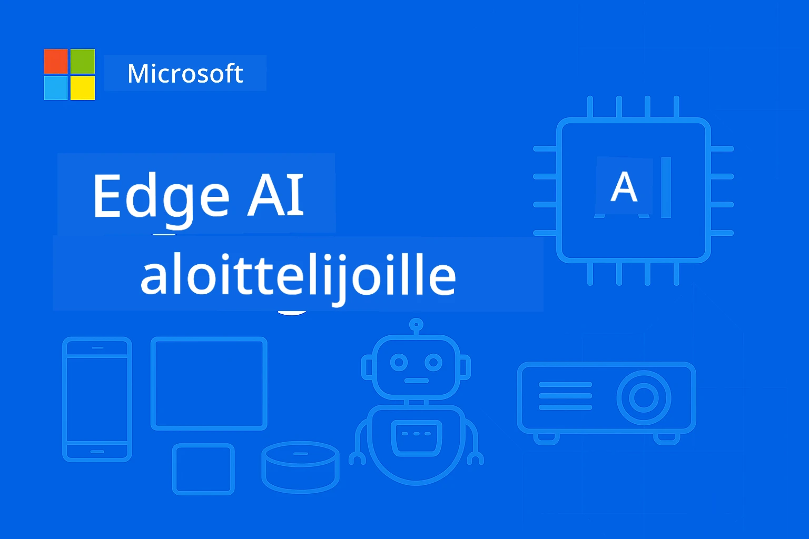

<!--
CO_OP_TRANSLATOR_METADATA:
{
  "original_hash": "ac31463ae3ed21a0ce83b0a351c23dd4",
  "translation_date": "2026-01-05T09:35:45+00:00",
  "source_file": "README.md",
  "language_code": "fi"
}
-->
# EdgeAI aloittelijoille




[](https://GitHub.com/microsoft/edgeai-for-beginners/graphs/contributors)
[](https://GitHub.com/microsoft/edgeai-for-beginners/issues)
[](https://GitHub.com/microsoft/edgeai-for-beginners/pulls)
[](http://makeapullrequest.com)

[](https://GitHub.com/microsoft/edgeai-for-beginners/watchers)
[](https://GitHub.com/microsoft/edgeai-for-beginners/fork)
[](https://GitHub.com/microsoft/edgeai-for-beginners/stargazers)


[](https://discord.gg/nTYy5BXMWG)

Seuraa näitä ohjeita päästäksesi alkuun näiden resurssien käytössä:

1. **Forkkaa repositorio**: Klikkaa [](https://GitHub.com/microsoft/edgeai-for-beginners/fork)
2. **Kloonaa repositorio**:   `git clone https://github.com/microsoft/edgeai-for-beginners.git`
3. [**Liity Azure AI Foundryn Discordiin ja tapaa asiantuntijat sekä kehittäjätoverit**](https://discord.com/invite/ByRwuEEgH4)


### 🌐 Monikielinen tuki

#### Tuettu GitHub-toiminnolla (automaattinen ja aina ajantasainen)

<!-- CO-OP TRANSLATOR LANGUAGES TABLE START -->
[Arabic](../ar/README.md) | [Bengali](../bn/README.md) | [Bulgarian](../bg/README.md) | [Burmese (Myanmar)](../my/README.md) | [Chinese (Simplified)](../zh/README.md) | [Chinese (Traditional, Hong Kong)](../hk/README.md) | [Chinese (Traditional, Macau)](../mo/README.md) | [Chinese (Traditional, Taiwan)](../tw/README.md) | [Croatian](../hr/README.md) | [Czech](../cs/README.md) | [Danish](../da/README.md) | [Dutch](../nl/README.md) | [Estonian](../et/README.md) | [Finnish](./README.md) | [French](../fr/README.md) | [German](../de/README.md) | [Greek](../el/README.md) | [Hebrew](../he/README.md) | [Hindi](../hi/README.md) | [Hungarian](../hu/README.md) | [Indonesian](../id/README.md) | [Italian](../it/README.md) | [Japanese](../ja/README.md) | [Kannada](../kn/README.md) | [Korean](../ko/README.md) | [Lithuanian](../lt/README.md) | [Malay](../ms/README.md) | [Malayalam](../ml/README.md) | [Marathi](../mr/README.md) | [Nepali](../ne/README.md) | [Nigerian Pidgin](../pcm/README.md) | [Norwegian](../no/README.md) | [Persian (Farsi)](../fa/README.md) | [Polish](../pl/README.md) | [Portuguese (Brazil)](../br/README.md) | [Portuguese (Portugal)](../pt/README.md) | [Punjabi (Gurmukhi)](../pa/README.md) | [Romanian](../ro/README.md) | [Russian](../ru/README.md) | [Serbian (Cyrillic)](../sr/README.md) | [Slovak](../sk/README.md) | [Slovenian](../sl/README.md) | [Spanish](../es/README.md) | [Swahili](../sw/README.md) | [Swedish](../sv/README.md) | [Tagalog (Filipino)](../tl/README.md) | [Tamil](../ta/README.md) | [Telugu](../te/README.md) | [Thai](../th/README.md) | [Turkish](../tr/README.md) | [Ukrainian](../uk/README.md) | [Urdu](../ur/README.md) | [Vietnamese](../vi/README.md)

> **Haluatko kloonata paikallisesti?**

> Tämä repositorio sisältää yli 50 kielen käännökset, jotka lisäävät huomattavasti latauskoon. Jos haluat kloonata ilman käännöksiä, käytä sparse checkoutia:
> ```bash
> git clone --filter=blob:none --sparse https://github.com/microsoft/edgeai-for-beginners.git
> cd edgeai-for-beginners
> git sparse-checkout set --no-cone '/*' '!translations' '!translated_images'
> ```
> Tämä antaa sinulle kaiken kurssin suorittamiseen tarvittavan nopeammalla latauksella.
<!-- CO-OP TRANSLATOR LANGUAGES TABLE END -->

**Jos haluat tukea lisäkielille, tuetut kielet on listattu [tässä](https://github.com/Azure/co-op-translator/blob/main/getting_started/supported-languages.md)**
## Johdanto

Tervetuloa **EdgeAI aloittelijoille** – kattavaan matkaasi Edge-tekoälyn mullistavaan maailmaan. Tämä kurssi yhdistää voimakkaat tekoälyominaisuudet ja käytännönläheisen toteutuksen reunalaitteilla, mahdollistaen tekoälyn potentiaalin hyödyntämisen suoraan siellä, missä data syntyy ja päätökset täytyy tehdä.

### Mitä hallitset

Tämä kurssi vie sinut peruskäsitteistä tuotantovalmiisiin toteutuksiin kattaen:
- **Pienet kielimallit (SLM:t)**, jotka on optimoitu reunalaitteille
- **Laitteistotietoinen optimointi** eri alustoilla
- **Reaaliaikainen inferenssi** yksityisyyttä suojaavin ominaisuuksin
- **Tuotantoon vientistrategiat** yrityssovelluksiin

### Miksi EdgeAI on tärkeää

Edge AI edustaa paradigman muutosta, joka vastaa kriittisiin nykypäivän haasteisiin:
- **Yksityisyys & turvallisuus**: Käsittele arkaluonteista dataa paikallisesti ilman pilvivälitystä
- **Reaaliaikainen suorituskyky**: Poista verkkoviive aika-kriittisistä sovelluksista
- **Kustannustehokkuus**: Vähennä kaistanleveyden ja pilvilaskennan kustannuksia
- **Toiminnan kestävyys**: Säilytä toiminnallisuus verkkokatkosten aikana
- **Säädösten noudattaminen**: Tukea datan kotipaikkavaatimuksia

### Edge AI

Edge AI tarkoittaa tekoälyalgoritmien ja kielimallien suorittamista paikallisesti laitteella, lähellä datan syntypaikkaa ilman pilvipalveluihin tukeutumista inferenssissä. Se vähentää viiveitä, parantaa yksityisyyttä ja mahdollistaa reaaliaikaisen päätöksenteon.

### Keskeiset periaatteet:
- **Laitteella tapahtuva inferenssi**: tekoälymallit toimivat reunalaitteilla (puhelimet, reitittimet, mikrokontrollerit, teolliset PC:t)
- **Offline-toiminnallisuus**: toimii ilman pysyvää verkkoyhteyttä
- **Alhainen viive**: välittömät vastaukset reaaliaikaisiin järjestelmiin
- **Datakontrolli**: säilyttää arkaluonteisen datan paikallisena, parantaen turvallisuutta ja noudattamista

### Pienet kielimallit (SLM:t)

SLM:t kuten Phi-4, Mistral-7B ja Gemma ovat suurempien LLM-mallien optimoituja versioita — koulutettuja tai tiivistettyjä seuraaviin tarkoituksiin:
- **Pienempi muistinkulutus**: tehokas käyttö rajatulla reunalaitteen muistilla
- **Matalampi laskentatarve**: optimoitu CPU:lle ja reunalaitteiden GPU:lle
- **Nopeammat käynnistysajat**: nopea aloitus vastuullisiin sovelluksiin

Niiden avulla avautuu tehokkaita NLP-ominaisuuksia, jotka sopivat seuraaviin rajoitteisiin:
- **Sulautetut järjestelmät**: IoT-laitteet ja teolliset ohjaimet
- **Mobiililaitteet**: älypuhelimet ja tabletit offline-ominaisuuksilla
- **IoT-laitteet**: sensorit ja älylaitteet rajoitetuin resurssein
- **Reunalaskentapalvelimet**: paikalliset yksiköt rajatuilla GPU-resursseilla
- **Henkilökohtaiset tietokoneet**: pöytätietokone- ja kannettavat käyttötapaukset

## Kurssimoduulit & navigointi

| Moduuli | Aihe | Painopistealue | Keskeinen sisältö | Taso | Kesto |
|--------|-------|------------|-------------|--------|----------|
| [📖 00 ](./introduction.md) | [Johdanto EdgeAI:hin](./introduction.md) | Perusta & konteksti | Yleiskatsaus EdgeAI:hin • Teollisuuden sovellukset • SLM-esittely • Oppimistavoitteet | Aloittelija | 1-2 h |
| [📚 01](../../Module01) | [EdgeAI perusasiat](./Module01/README.md) | Pilvi vs Edge AI vertailu | EdgeAI perusteet • Käytännön esimerkit • Toteutusopas • Reunalle vienti | Aloittelija | 3-4 h |
| [🧠 02](../../Module02) | [SLM malliperheet](./Module02/README.md) | Malliperheet & arkkitehtuuri | Phi-perhe • Qwen-perhe • Gemma-perhe • BitNET • μModel • Phi-Silica | Aloittelija | 4-5 h |
| [🚀 03](../../Module03) | [SLM käyttöönotto käytännössä](./Module03/README.md) | Paikallinen & pilvikäyttöönotto | Edistynyt oppiminen • Paikallinen ympäristö • Pilvikäyttöönotto | Keskitaso | 4-5 h |
| [⚙️ 04](../../Module04) | [Mallin optimointityökalut](./Module04/README.md) | Monialustainen optimointi | Johdanto • Llama.cpp • Microsoft Olive • OpenVINO • Apple MLX • Työnkulun synteesi | Keskitaso | 5-6 h |
| [🔧 05](../../Module05) | [SLMOps tuotanto](./Module05/README.md) | Tuotantotoiminnot | SLMOps esittely • Mallin tiivistys • Hienosäätö • Tuotantoon vienti | Edistynyt | 5-6 h |
| [🤖 06](../../Module06) | [AI-agentit & funktiokutsut](./Module06/README.md) | Agenttikehykset & MCP | Agenttien perusteet • Funktiokutsut • Mallin kontekstiprotokolla | Edistynyt | 4-5 h |
| [💻 07](../../Module07) | [Alustan toteutus](./Module07/README.md) | Monialustaiset esimerkit | AI-työkalut • Foundry Local • Windows-kehitys | Edistynyt | 3-4 h |
| [🏭 08](../../Module08) | [Foundry Local Toolkit](./Module08/README.md) | Tuotantovalmiit esimerkit | Esimerkkisovellukset (katso alla tarkemmin) | Asiakas | 8-10 h |

### 🏭 **Moduuli 08: Esimerkkisovellukset**

- [01: REST Chat aloittaminen](./Module08/samples/01/README.md)
- [02: OpenAI SDK -integraatio](./Module08/samples/02/README.md)
- [03: Mallin löytö & vertailu](./Module08/samples/03/README.md)
- [04: Chainlit RAG -sovellus](./Module08/samples/04/README.md)
- [05: Moni-agenttien orkestrointi](./Module08/samples/05/README.md)
- [06: Mallit työkaluna reititin](./Module08/samples/06/README.md)
- [07: Suora API-asiakas](./Module08/samples/07/README.md)
- [08: Windows 11 Chat -sovellus](./Module08/samples/08/README.md)
- [09: Edistynyt moni-agenttijärjestelmä](./Module08/samples/09/README.md)
- [10: Foundry Tools -kehys](./Module08/samples/10/README.md)

### 🎓 **Työpaja: Käytännön oppimispolku**

Kattavat käytännön työpajamateriaalit tuotantovalmiilla toteutuksilla:

- **[Työpajan opas](./Workshop/Readme.md)** - Oppimistavoitteet, tulokset ja resurssien navigointi
- **Python-esimerkit** (6 sessiota) - Päivitetty parhailla käytännöillä, virheenkäsittelyllä ja täydellisellä dokumentaatiolla
- **Jupyter-muistikirjat** (8 vuorovaikutteista) - Askel askeleelta -oppaat vertailuineen ja suorituskyvyn seurannalla
- **Sessio-oppaat** - Yksityiskohtaiset markdown-ohjeet jokaiseen työpajasessioon
- **Validointityökalut** - Skriptit koodin laadun tarkastukseen ja smoke-testaamiseen

**Mitä rakennat:**
- Paikalliset AI-chat-sovellukset striimaustuen kanssa
- RAG-putket laadun arvioinnilla (RAGAS)
- Monimallin vertailu- ja benchmarking-työkalut
- Moni-agenttien orkestrointijärjestelmät
- Älykäs mallin reititys tehtäväperusteisella valinnalla

### 🎙️ **Agentic-työpaja: Käytännön tekoälypodcast-studio**

Rakenna AI-vetoisen podcast-tuotantoputken alusta asti! Tämä mukaansatempaava työpaja opettaa sinulle monialaisen moni-agenttijärjestelmän luomisen, joka muuttaa ideat ammattilaispodcast-jaksoiksi.
**[🎬 Aloita AI Podcast Studio -työpaja](./WorkshopForAgentic/README.md)**

**Tehtäväsi**: Käynnistä "Future Bytes" — teknologiapodcast, jonka kaikki sisältö tuotetaan täysin itse rakentamillasi AI- agenteilla. Ei pilvipalveluja, ei API-kustannuksia — kaikki toimii paikallisesti tietokoneellasi.

**Mikä tekee tästä ainutlaatuisen:**
- **🤖 Todellinen monen agentin orkestrointi** – Rakenna erikoistuneita AI-agentteja, jotka tutkivat, kirjoittavat ja tuottavat ääntä
- **🎯 Täydellinen tuotantoputki** – Aiheen valinnasta lopulliseen podcast-audioon
- **💻 100 % paikallinen käyttöönotto** – Käyttää Ollamaa ja paikallisia malleja (Qwen-3-8B) täyden yksityisyyden ja hallinnan takaamiseksi
- **🎤 Tekstistä puheeksi -integraatio** – Muunna käsikirjoitukset luonnollisen kuuloisiksi monipuheisiksi keskusteluiksi
- **✋ Ihminen keskiössä -työnkulut** – Hyväksymisportit varmistavat laadun säilyttäen automaation

**Kolme näytöstä sisältävä oppimismatka:**

| Näytös | Keskittyminen | Keskeiset taidot | Kesto |
|-----|-------|------------|----------|
| **[Näytös 1: Tapaa AI-avustajasi](./WorkshopForAgentic/md/01.BuildAIAgentWithSLM.md)** | Rakenna ensimmäinen AI-agenttisi | Työkalujen integrointi • Verkkohaku • Ongelmanratkaisu • Agenttimaailma | 2-3 h |
| **[Näytös 2: Koosta tuotantotiimisi](./WorkshopForAgentic/md/02.AIAgentOrchestrationAndWorkflows.md)** | Ohjaa monia agenteja | Tiimin koordinointi • Hyväksymisprosessit • DevUI-käyttöliittymä • Ihmisen valvonta | 3-4 h |
| **[Näytös 3: Herätä podcast eloon](./WorkshopForAgentic/md/03.Multi-SpeakerPodcastGenerationWithVibeVoice.md)** | Tuota podcast-ääntä | Tekstistä puheeksi • Monipuheinen synteesi • Pitkäkestoiset äänitteet • Täysi automaatio | 2-3 h |

**Käytetyt teknologiat:**
- **Microsoft Agent Framework** – Moni-agenttien orkestrointi ja koordinointi
- **Ollama** – Paikallinen AI-mallien ajonaika (ei pilveä)
- **Qwen-3-8B** – Avoimen lähdekoodin kielimalli, optimoitu agenttitehtäviin
- **Tekstistä puheeksi API:t** – Luonnollisen kuuloisen äänen synteesi podcastin tuotantoon

**Laitteistotuki:**
- ✅ **CPU-tila** – Toimii missä tahansa nykyaikaisessa tietokoneessa (suositus 8GB+ RAM)
- 🚀 **GPU-kiihdytys** – Paljon nopeampi päätelmä NVIDIA-/AMD-GPU:illa
- ⚡ **NPU-tuki** – Seuraavan sukupolven hermoverkojen kiihdytys

**Täydellinen:**
- Kehittäjille, jotka opettelevat moni-agenttisia AI-järjestelmiä
- Kaikille, jotka ovat kiinnostuneita AI-automaatioista ja työnkuluista
- Sisällöntuottajille, jotka tutkivat AI-avusteista tuotantoa
- Opiskelijoille, jotka opiskelevat käytännön AI-orkestroinnin malleja

**Aloita rakentaminen**: [🎙️ AI Podcast Studio -työpaja →](./WorkshopForAgentic/README.md)

### 📊 **Oppimispolun yhteenveto**
- **Kokonaiskesto**: 36-45 tuntia
- **Aloittelijan polku**: Modulut 01-02 (7-9 tuntia)  
- **Keskitaso**: Modulut 03-04 (9-11 tuntia)
- **Edistynyt**: Modulut 05-07 (12-15 tuntia)
- **Asiantuntija**: Moduuli 08 (8-10 tuntia)

## Mitä rakennat

### 🎯 Keskeiset osaamisalueet
- **Edge AI -arkkitehtuuri**: Suunnittele paikallisesti priorisoivat AI-järjestelmät pilviyhteydellä
- **Mallien optimointi**: Kvantitointi ja mallien pakkaus reunalaskentaan (85 % nopeutus, 75 % koon pienennys)
- **Monialustainen käyttöönotto**: Windows, mobiili, sulautetut ja pilvi-reuna -hybridijärjestelmät
- **Tuotantotoiminnot**: Reunatason AI:n valvonta, skaalaus ja ylläpito tuotannossa

### 🏗️ Käytännön projektit
- **Foundry Local Chat -sovellukset**: Windows 11 -natiivi sovellus mallin vaihdolla
- **Moni-agenttiset järjestelmät**: Koordinaattori ja erikoisagentit monimutkaisiin työnkulkuihin  
- **RAG-sovellukset**: Paikallinen asiakirjojen käsittely vektorihakutoiminnolla
- **Mallireitittimet**: Älykäs mallivalinta tehtävän analyysin perusteella
- **API-kehykset**: Tuotantovalmiit asiakkaat suoratoistolla ja tilanvalvonnalla
- **Monialustatyökalut**: LangChain/Semantic Kernel -integrointimallit

### 🏢 Teollisuuden sovellukset
**Valmistus** • **Terveydenhuolto** • **Autonomiset ajoneuvot** • **Älykaupungit** • **Mobiilisovellukset**

## Nopea aloitus

**Suositeltu oppimispolku** (20-30 tuntia yhteensä):

0. **📖 Johdanto** ([Introduction.md](./introduction.md)): EdgeAI:n perusteet + toimiala + oppimiskehys
1. **📚 Perusteet** (Moduulit 01-02): EdgeAI-konseptit + SLM-malliperheet
2. **⚙️ Optimointi** (Moduulit 03-04): Käyttöönotto + kvantointikehykset  
3. **🚀 Tuotanto** (Moduulit 05-06): SLMOps + AI-agentit + funktiokutsut
4. **💻 Toteutus** (Moduulit 07-08): Alustademot + Foundry Local -työkalut

Jokainen moduuli sisältää teoriaa, käytännön harjoituksia ja tuotantovalmiita koodiesimerkkejä.

## Uravaikutus

**Tekniset roolit**: EdgeAI-ratkaisuarkkitehti • ML-insinööri (Edge) • IoT AI-kehittäjä • Mobiili AI-kehittäjä

**Toimialat**: Valmistus 4.0 • Terveydenhuoltoteknologia • Autonomiset järjestelmät • FinTech • Kulutuselektroniikka

**Portfolioprojektit**: Moni-agenttiset järjestelmät • Tuotannon RAG-sovellukset • Monialustainen käyttöönotto • Suorituskyvyn optimointi

## Arkiston rakenne

```
edgeai-for-beginners/
├── 📖 introduction.md  # Foundation: EdgeAI Overview & Learning Framework
├── 📚 Module01-04/     # Fundamentals → SLMs → Deployment → Optimization  
├── 🔧 Module05-06/     # SLMOps → AI Agents → Function Calling
├── 💻 Module07/        # Platform Samples (VS Code, Windows, Jetson, Mobile)
├── 🏭 Module08/        # Foundry Local Toolkit + 10 Comprehensive Samples
│   ├── samples/01-06/  # Foundation: REST, SDK, RAG, Agents, Routing
│   └── samples/07-10/  # Advanced: API Client, Windows App, Enterprise Agents, Tools
├── 🌐 translations/    # Multi-language support (8+ languages)
└── 📋 STUDY_GUIDE.md   # Structured learning paths & time allocation
```

## Kurssin kohokohdat

✅ **Jatkava oppiminen**: Teoria → Käytäntö → Tuotantokäyttö  
✅ **Todelliset tapaustutkimukset**: Microsoft, Japan Airlines, yritysten käyttöönotot  
✅ **Käytännön esimerkit**: 50+ esimerkkiä, 10 kattavaa Foundry Local -esittelyä  
✅ **Suorituskyvyn parantaminen**: 85 % nopeuden parannukset, 75 % koon pienennykset  
✅ **Monialustainen**: Windows, mobiili, sulautetut, pilvi-reuna -hybridit  
✅ **Tuotantovalmiit**: Valvonta, skaalaus, turvallisuus ja vaatimustenmukaisuus

📖 **[Opas Saatavilla](STUDY_GUIDE.md)**: Rakenteellinen 20 tunnin oppimispolku aikatauluohjeistuksella ja itsearviointityökaluilla.

---

**EdgeAI edustaa tekoälyn käyttöönoton tulevaisuutta**: paikallisesti ensisijainen, yksityisyyttä kunnioittava ja tehokas. Hallitse nämä taidot rakentaaksesi seuraavan sukupolven älykkäitä sovelluksia.

## Muut kurssit

Tiimimme tuottaa myös muita kursseja! Tutustu:

<!-- CO-OP TRANSLATOR OTHER COURSES START -->
### LangChain
[](https://aka.ms/langchain4j-for-beginners)
[](https://aka.ms/langchainjs-for-beginners?WT.mc_id=m365-94501-dwahlin)

---

### Azure / Edge / MCP / Agentit
[](https://github.com/microsoft/AZD-for-beginners?WT.mc_id=academic-105485-koreyst)
[](https://github.com/microsoft/edgeai-for-beginners?WT.mc_id=academic-105485-koreyst)
[](https://github.com/microsoft/mcp-for-beginners?WT.mc_id=academic-105485-koreyst)
[](https://github.com/microsoft/ai-agents-for-beginners?WT.mc_id=academic-105485-koreyst)

---
 
### Generatiiviset AI-sarjat
[](https://github.com/microsoft/generative-ai-for-beginners?WT.mc_id=academic-105485-koreyst)
[-9333EA?style=for-the-badge&labelColor=E5E7EB&color=9333EA)](https://github.com/microsoft/Generative-AI-for-beginners-dotnet?WT.mc_id=academic-105485-koreyst)
[-C084FC?style=for-the-badge&labelColor=E5E7EB&color=C084FC)](https://github.com/microsoft/generative-ai-for-beginners-java?WT.mc_id=academic-105485-koreyst)
[-E879F9?style=for-the-badge&labelColor=E5E7EB&color=E879F9)](https://github.com/microsoft/generative-ai-with-javascript?WT.mc_id=academic-105485-koreyst)

---
 
### Perusoppiminen
[](https://aka.ms/ml-beginners?WT.mc_id=academic-105485-koreyst)
[](https://aka.ms/datascience-beginners?WT.mc_id=academic-105485-koreyst)
[](https://aka.ms/ai-beginners?WT.mc_id=academic-105485-koreyst)
[](https://github.com/microsoft/Security-101?WT.mc_id=academic-96948-sayoung)
[](https://aka.ms/webdev-beginners?WT.mc_id=academic-105485-koreyst)
[](https://aka.ms/iot-beginners?WT.mc_id=academic-105485-koreyst)
[](https://github.com/microsoft/xr-development-for-beginners?WT.mc_id=academic-105485-koreyst)

---
 
### Copilot-sarja
[](https://aka.ms/GitHubCopilotAI?WT.mc_id=academic-105485-koreyst)
[](https://github.com/microsoft/mastering-github-copilot-for-dotnet-csharp-developers?WT.mc_id=academic-105485-koreyst)
[](https://github.com/microsoft/CopilotAdventures?WT.mc_id=academic-105485-koreyst)
<!-- CO-OP TRANSLATOR OTHER COURSES END -->

## Apua saaminen

Jos juutut tai sinulla on kysyttävää tekoälysovellusten rakentamisesta, liity:

[](https://discord.gg/nTYy5BXMWG)

Jos sinulla on tuotepalaute tai kohtaat virheitä rakennusvaiheessa, vieraile:

[](https://aka.ms/foundry/forum)

---

<!-- CO-OP TRANSLATOR DISCLAIMER START -->
**Vastuuvapauslauseke**:  
Tämä asiakirja on käännetty käyttämällä tekoälypohjaista käännöspalvelua [Co-op Translator](https://github.com/Azure/co-op-translator). Pyrimme tarkkuuteen, mutta ole hyvä ja huomioi, että automaattikäännöksissä saattaa esiintyä virheitä tai epätarkkuuksia. Alkuperäinen asiakirja omalla kielellään on ensisijainen ja virallinen lähde. Tärkeissä asioissa suositellaan ammattimaista ihmiskäännöstä. Emme ole vastuussa tämän käännöksen käytöstä aiheutuvista väärinymmärryksistä tai tulkinnoista.
<!-- CO-OP TRANSLATOR DISCLAIMER END -->