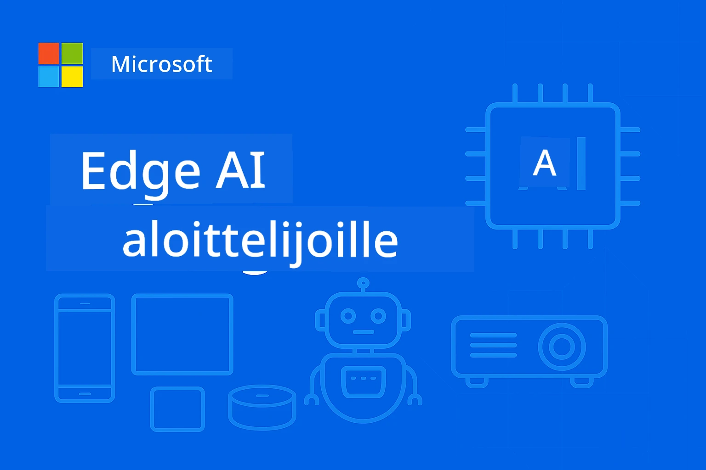

# EdgeAI aloittelijoille




[](https://GitHub.com/microsoft/edgeai-for-beginners/graphs/contributors)
[](https://GitHub.com/microsoft/edgeai-for-beginners/issues)
[](https://GitHub.com/microsoft/edgeai-for-beginners/pulls)
[](http://makeapullrequest.com)

[](https://GitHub.com/microsoft/edgeai-for-beginners/watchers)
[](https://GitHub.com/microsoft/edgeai-for-beginners/fork)
[](https://GitHub.com/microsoft/edgeai-for-beginners/stargazers)


[](https://discord.gg/nTYy5BXMWG)

Seuraa näitä vaiheita ottaaksesi nämä resurssit käyttöön:

1. **Haarauta repositorio**: Klikkaa [](https://GitHub.com/microsoft/edgeai-for-beginners/fork)
2. **Kloonaa repositorio**: `git clone https://github.com/microsoft/edgeai-for-beginners.git`
3. [**Liity Azure AI Foundry Discordiin ja tapaa asiantuntijoita sekä muita kehittäjiä**](https://discord.com/invite/ByRwuEEgH4)


### 🌐 Monikielinen tuki

#### Tuettu GitHub Actionin kautta (Automaattinen & Aina ajan tasalla)

<!-- CO-OP TRANSLATOR LANGUAGES TABLE START -->
[Arabic](../ar/README.md) | [Bengali](../bn/README.md) | [Bulgarian](../bg/README.md) | [Burmese (Myanmar)](../my/README.md) | [Chinese (Simplified)](../zh-CN/README.md) | [Chinese (Traditional, Hong Kong)](../zh-HK/README.md) | [Chinese (Traditional, Macau)](../zh-MO/README.md) | [Chinese (Traditional, Taiwan)](../zh-TW/README.md) | [Croatian](../hr/README.md) | [Czech](../cs/README.md) | [Danish](../da/README.md) | [Dutch](../nl/README.md) | [Estonian](../et/README.md) | [Finnish](./README.md) | [French](../fr/README.md) | [German](../de/README.md) | [Greek](../el/README.md) | [Hebrew](../he/README.md) | [Hindi](../hi/README.md) | [Hungarian](../hu/README.md) | [Indonesian](../id/README.md) | [Italian](../it/README.md) | [Japanese](../ja/README.md) | [Kannada](../kn/README.md) | [Khmer](../km/README.md) | [Korean](../ko/README.md) | [Lithuanian](../lt/README.md) | [Malay](../ms/README.md) | [Malayalam](../ml/README.md) | [Marathi](../mr/README.md) | [Nepali](../ne/README.md) | [Nigerian Pidgin](../pcm/README.md) | [Norwegian](../no/README.md) | [Persian (Farsi)](../fa/README.md) | [Polish](../pl/README.md) | [Portuguese (Brazil)](../pt-BR/README.md) | [Portuguese (Portugal)](../pt-PT/README.md) | [Punjabi (Gurmukhi)](../pa/README.md) | [Romanian](../ro/README.md) | [Russian](../ru/README.md) | [Serbian (Cyrillic)](../sr/README.md) | [Slovak](../sk/README.md) | [Slovenian](../sl/README.md) | [Spanish](../es/README.md) | [Swahili](../sw/README.md) | [Swedish](../sv/README.md) | [Tagalog (Filipino)](../tl/README.md) | [Tamil](../ta/README.md) | [Telugu](../te/README.md) | [Thai](../th/README.md) | [Turkish](../tr/README.md) | [Ukrainian](../uk/README.md) | [Urdu](../ur/README.md) | [Vietnamese](../vi/README.md)

> **Haluatko mieluummin kloonata paikallisesti?**
>
> Tämä repositorio sisältää yli 50 kielikäännöstä, jotka merkittävästi kasvattavat latauskokoa. Jos haluat kloonata ilman käännöksiä, käytä sparse checkoutia:
>
> **Bash / macOS / Linux:**
> ```bash
> git clone --filter=blob:none --sparse https://github.com/microsoft/edgeai-for-beginners.git
> cd edgeai-for-beginners
> git sparse-checkout set --no-cone '/*' '!translations' '!translated_images'
> ```
>
> **CMD (Windows):**
> ```cmd
> git clone --filter=blob:none --sparse https://github.com/microsoft/edgeai-for-beginners.git
> cd edgeai-for-beginners
> git sparse-checkout set --no-cone "/*" "!translations" "!translated_images"
> ```
>
> Tämä antaa sinulle kaiken tarvittavan kurssin suorittamiseen paljon nopeammalla latauksella.
<!-- CO-OP TRANSLATOR LANGUAGES TABLE END -->

**Jos haluat tukea lisää käännöskieliä, ne löytyvät luettelosta [täältä](https://github.com/Azure/co-op-translator/blob/main/getting_started/supported-languages.md)**
## Johdanto

Tervetuloa **EdgeAI aloittelijoille** – kattavalle matkallesi reunalaskennan tekoälyn mullistavaan maailmaan. Tämä kurssi yhdistää tehokkaan tekoälykapasiteetin ja käytännön soveltamisen reunalaitteissa, mahdollistaen tekoälyn potentiaalin hyödyntämisen suoraan siellä, missä data syntyy ja päätöksiä on tehtävä.

### Mitä opit hallitsemaan

Kurssi vie sinut peruskäsitteistä tuotantovalmiisiin toteutuksiin, mm.:
- **Pienet kielimallit (SLM:t)**, jotka on optimoitu reunalaitteisiin
- **Laitteistotietoinen optimointi** monilla alustoilla
- **Reaaliaikainen päättely** yksityisyyttä suojaavilla ominaisuuksilla
- **Tuotantoon vienti** yrityssovelluksiin

### Miksi EdgeAI on tärkeää

Edge AI edustaa paradigman muutosta, joka vastaa keskeisiin tämän päivän haasteisiin:
- **Yksityisyys & Turvallisuus**: Käsittele arkaluonteista dataa paikallisesti ilman pilvi-altistusta
- **Reaaliaikainen suorituskyky**: Poista verkon viive kriittisissä sovelluksissa
- **Kustannustehokkuus**: Vähennä kaistanleveyden ja pilvilaskennan kuluja
- **Kestävä toiminta**: Säilytä toiminnallisuus verkon katkoissa
- **Sääntelyn noudattaminen**: Täytä datan kotipaikkavaatimus

### Edge AI

Edge AI tarkoittaa tekoälyalgoritmien ja kielimallien suorittamista paikallisesti laitteella lähellä datan syntypaikkaa ilman pilvipalveluihin luottamista päättelyssä. Se vähentää latenssia, parantaa yksityisyyttä ja mahdollistaa reaaliaikaisen päätöksenteon.

### Periaatteet:
- **Laitteella tapahtuva päättely**: AI-mallit toimivat reunalaitteissa (puhelimet, reitittimet, mikrokontrollerit, teolliset PC:t)
- **Offline-toiminta**: Toimii ilman jatkuvaa internet-yhteyttä
- **Matala latenssi**: Välittömät vasteet reaaliaikaisiin järjestelmiin
- **Datan kotimaa**: Pidä arkaluonteinen data paikallisena parantaen turvallisuutta ja säädösten noudattamista

### Pienet kielimallit (SLM:t)

SLM:t kuten Phi-4, Mistral-7B ja Gemma ovat kevennettyjä versioita suuremmista LLM-malleista — koulutettuja tai tiivistettyjä:
- **Pienentynyt muistijälki**: Tehokas rajallisen reunalaitemmuistin käyttö
- **Alhaisempi laskentatarve**: Optimoitu CPU:n ja reunassa toimivan GPU:n suorituskykyyn
- **Nopeampi käynnistysaika**: Nopeaa aloitusta reagoivissa sovelluksissa

Ne avaavat tehokkaan NLP:n mahdollisuudet täyttäen rajoitukset:
- **Sulautetut järjestelmät**: IoT-laitteet ja teolliset ohjaimet
- **Mobiililaitteet**: Älypuhelimet ja tabletit offline-ominaisuuksin
- **IoT-laitteet**: Anturit ja älylaitteet rajatuilla resursseilla
- **Reunalaitteet**: Paikalliset prosessointiyksiköt rajatuilla GPU-resursseilla
- **Henkilökohtaiset tietokoneet**: Työpöydät ja kannettavat

## Kurssin moduulit & navigointi

| Moduuli | Aihe | Painopistealue | Keskeinen sisältö | Taso | Kesto |
|--------|-------|------------|-------------|--------|----------|
| [📖 00 ](./introduction.md) | [EdgeAI:n johdanto](./introduction.md) | Perusteet & konteksti | EdgeAI-yhteenveto • Toimialasovellukset • SLM-johdanto • Oppimistavoitteet | Aloittelija | 1-2 h |
| [📚 01](../../Module01) | [EdgeAI perusteet](./Module01/README.md) | Pilvi vs reunalaskenta | EdgeAI perusteet • Käytännön tapaustutkimukset • Toteutusopas • Reunalaskenta | Aloittelija | 3-4 h |
| [🧠 02](../../Module02) | [SLM-mallien perusteet](./Module02/README.md) | Malliperheet & arkkitehtuuri | Phi-perhe • Qwen-perhe • Gemma-perhe • BitNET • μModel • Phi-Silica | Aloittelija | 4-5 h |
| [🚀 03](../../Module03) | [SLM:n käyttöönotto](./Module03/README.md) | Paikallinen & pilvitoteutus | Edistynyt oppiminen • Paikallinen ympäristö • Pilvikäyttöönotto | Keskitaso | 4-5 h |
| [⚙️ 04](../../Module04) | [Mallien optimointityökalut](./Module04/README.md) | Ristiinalustainen optimointi | Johdanto • Llama.cpp • Microsoft Olive • OpenVINO • Apple MLX • Työnkulun synteesi | Keskitaso | 5-6 h |
| [🔧 05](../../Module05) | [SLMOps tuotannossa](./Module05/README.md) | Tuotanto-operaatiot | SLMOps johdanto • Mallin tiivistys • Hienosäätö • Tuotantoon vienti | Edistynyt | 5-6 h |
| [🤖 06](../../Module06) | [AI-agentit & funktiokutsut](./Module06/README.md) | Agenttikehykset & MCP | Agenttijohdanto • Funktiokutsut • Mallikontextiprotokolla | Edistynyt | 4-5 h |
| [💻 07](../../Module07) | [Alustan toteutus](./Module07/README.md) | Ristiinalustaiset esimerkit | AI-työkalut • Foundry Local • Windows-kehitys | Edistynyt | 3-4 h |
| [🏭 08](../../Module08) | [Foundry Local -työkalupakki](./Module08/README.md) | Tuotantovalmiit esimerkit | Esimerkkisovellukset (katso alla tarkemmin) | Asiantuntija | 8-10 h |

### 🏭 **Moduuli 08: Esimerkkisovellukset**

- [01: REST Chat pikakäynnistys](./Module08/samples/01/README.md)
- [02: OpenAI SDK -integraatio](./Module08/samples/02/README.md)
- [03: Mallin löytäminen & vertailu](./Module08/samples/03/README.md)
- [04: Chainlit RAG -sovellus](./Module08/samples/04/README.md)
- [05: Moniagenttien orkestrointi](./Module08/samples/05/README.md)
- [06: Mallit työkaluna -reititin](./Module08/samples/06/README.md)
- [07: Suora API-asiakas](./Module08/samples/07/README.md)
- [08: Windows 11 Chat-sovellus](./Module08/samples/08/README.md)
- [09: Edistynyt moniagenttijärjestelmä](./Module08/samples/09/README.md)
- [10: Foundry Tools -kehys](./Module08/samples/10/README.md)

### 🎓 **Työpaja: Käytännön oppimispolku**

Kattavat käytännön työpajamateriaalit tuotantovalmiilla toteutuksilla:

- **[Työpajaopas](./Workshop/Readme.md)** - Täydelliset oppimistavoitteet, tulokset ja resurssien navigointi
- **Python-esimerkit** (6 osaa) - Päivitetty parhailla käytännöillä, virheenkäsittelyllä ja kattavalla dokumentaatiolla
- **Jupyter-muistikirjat** (8 interaktiivista) - Askellusaskelelta opastuksia, vertailuja ja suorituskyvyn seurantaa
- **Istuntoprotokollat** - Yksityiskohtaiset markdown-oppaat jokaiselle työpajaistunnolle
- **Varmennustyökalut** - Skriptit koodin laadun tarkistukseen ja pintatestaukseen

**Mitä rakennat:**
- Paikalliset AI-chat-sovellukset suoratoistotuen kanssa
- RAG-putket laadun arvioinnilla (RAGAS)
- Monimalli vertailu- ja benchmark-työkalut
- Moniagenttien orkestrointijärjestelmät
- Älykäs mallireititys tehtävävalinnan mukaan

### 🎙️ **Agentic-työpaja: Käytännön oppia - AI-podcast-studio**
Perusta tekoälyllä toimiva podcast-tuotantoprosessi alusta alkaen! Tämä immersiivinen työpaja opettaa sinua luomaan kokonainen monialustajärjestelmä, joka muuntaa ideat ammattimaisiksi podcast-jaksoiksi.

**[🎬 Aloita AI Podcast Studio -työpaja](./WorkshopForAgentic/README.md)**

**Tehtäväsi**: Käynnistä "Future Bytes" — teknologiapodcast, jota ohjaavat täysin tekoälyagentit, jotka rakennat itse. Ei pilvipalveliriippuvuuksia, ei API-kustannuksia — kaikki toimii paikallisesti tietokoneellasi.

**Mikä tekee tästä ainutlaatuisen:**
- **🤖 Todellinen monialustajärjestelmän orkestrointi** - Rakenna erikoistuneita tekoälyagentteja, jotka tutkivat, kirjoittavat ja tuottavat ääntä
- **🎯 Täydellinen tuotantoputki** - Aiheen valinnasta valmiiseen podcast-äänitiedostoon
- **💻 100 % paikallinen käyttöönotto** - Käyttää Ollamaa ja paikallisia malleja (Qwen-3-8B) täyden yksityisyyden ja hallinnan takaamiseksi
- **🎤 Tekstistä puheeksi -integraatio** - Muunna käsikirjoitukset luonnollisen kuuloisiksi monipuheluiksi
- **✋ Ihmisen mukana -työnkulut** - Hyväksymisportit takaavat laadun säilyttäen automaation

**Kolmivaiheinen oppimiskokemus:**

| Näytös | Keskittyminen | Keskeiset taidot | Kesto |
|--------|---------------|------------------|-------|
| **[Näytös 1: Tapaa tekoälyavustajasi](./WorkshopForAgentic/md/01.BuildAIAgentWithSLM.md)** | Rakenna ensimmäinen tekoälyagenttisi | Työkalujen yhdistäminen • Verkkohaku • Ongelmanratkaisu • Agenttinen päättely | 2-3 h |
| **[Näytös 2: Koosta tuotantotiimisi](./WorkshopForAgentic/md/02.AIAgentOrchestrationAndWorkflows.md)** | Monet agentit samaan orkestrointiin | Tiimikoordinointi • Hyväksymistyönkulut • DevUI-käyttöliittymä • Ihmisen valvonta | 3-4 h |
| **[Näytös 3: Herätä podcast eloon](./WorkshopForAgentic/md/03.Multi-SpeakerPodcastGenerationWithVibeVoice.md)** | Tuota podcast-ääntä | Tekstistä puheeksi • Monipuhelu • Pitkä muoto • Täysi automaatio | 2-3 h |

**Käytetyt teknologiat:**
- **Microsoft Agent Framework** - Monialustajärjestelmän ohjaus ja koordinointi  
- **Ollama** - Paikallinen tekoälymallin suoritusympäristö (ei pilveä)  
- **Qwen-3-8B** - Avoimen lähdekoodin kielimalli agenttikäyttöön optimoitu  
- **Tekstistä puheeksi -API:t** - Luonnollisen äänen syntetisointi podcast-tuotantoon

**Laitetuki:**
- ✅ **CPU-tila** - Toimii missä tahansa nykyaikaisessa tietokoneessa (vähintään 8 Gt RAM suositeltu)
- 🚀 **GPU-kiihdytys** - Merkittävästi nopeampi päättely NVIDIA/AMD-GPU:illa
- ⚡ **NPU-tuki** - Uuden sukupolven neuroprosessorin kiihdytys

**Täydellinen valinta:**
- Kehittäjille, jotka opettelevat monialustaisia tekoälyjärjestelmiä
- Kaikille tekoälyautomaation ja työnkulkujen kiinnostuneille
- Sisällöntuottajille, jotka haluavat tutkia tekoälyavusteista tuotantoa
- Opiskelijoille, jotka opiskelevat käytännön tekoälyorkestrointimalleja

**Aloita rakentaminen**: [🎙️ AI Podcast Studio -työpaja →](./WorkshopForAgentic/README.md)

### 📊 **Oppimispolun yhteenveto**
- **Kokonaisaika**: 36-45 tuntia  
- **Aloittelijan polku**: Modulut 01-02 (7-9 tuntia)  
- **Keskitaso**: Modulut 03-04 (9-11 tuntia)  
- **Edistynyt**: Modulut 05-07 (12-15 tuntia)  
- **Asiantuntija**: Moduuli 08 (8-10 tuntia)

## Mitä rakennat

### 🎯 Keskeiset taidot
- **Edge AI -arkkitehtuuri**: Suunnittele paikallisesti priorisoidut tekoälyjärjestelmät pilvikytkennällä  
- **Mallin optimointi**: Kvantisoi ja pakkaa malleja reunalaitteisiin (85 % nopeutusta, 75 % tilansäästöä)  
- **Monialustainen käyttöönotto**: Windows, mobiili, sulautetut ja pilvi-reuna-hybridijärjestelmät  
- **Tuotantokäytännöt**: Seuranta, skaalaus ja reunalaitteiden ylläpito tuotannossa

### 🏗️ Käytännön projektit
- **Foundry Local Chat Apps**: Windows 11 -natiivi sovellus mallin vaihtamisella  
- **Monialustajärjestelmät**: Koordinaattori ja erikoisagentit monimutkaisiin työnkulkuihin  
- **RAG-sovellukset**: Paikallinen dokumentinkäsittely vektorihakujen avulla  
- **Mallien reitittimet**: Älykäs mallivalinta tehtäväanalyysin perusteella  
- **API-kehykset**: Tuotantovalmiit asiakkaat suoratoistolla ja terveystarkkailulla  
- **Monialustaiset työkalut**: LangChain/Semantic Kernel -integraatiomallit

### 🏢 Teollisuuden sovellukset
**Valmistus** • **Terveydenhuolto** • **Autonomiset ajoneuvot** • **Älykkäät kaupungit** • **Mobiilisovellukset**

## Nopea aloitus

**Suositeltu oppimispolku** (yhteensä 20-30 tuntia):

0. **📖 Johdanto** ([Introduction.md](./introduction.md)): EdgeAI:n perusteet + teollisuuden konteksti + oppimiskehys  
1. **📚 Perusteet** (Moduulit 01-02): EdgeAI-käsitteet + SLM-malliperheet  
2. **⚙️ Optimointi** (Moduulit 03-04): Käyttöönotto + kvantisointikehykset  
3. **🚀 Tuotanto** (Moduulit 05-06): SLMOps + AI-agentit + funktiokutsut  
4. **💻 Toteutus** (Moduulit 07-08): Alustanäytteet + Foundry Local -työkalut

Jokainen moduuli sisältää teoriaa, käytännön harjoituksia ja tuotantovalmiita koodiesimerkkejä.

## Uravaikutus

**Tekniset roolit**: EdgeAI-ratkaisuarkkitehti • ML-insinööri (Edge) • IoT AI -kehittäjä • Mobiili AI -kehittäjä

**Toimialat**: Manufacturing 4.0 • Terveysteknologia • Autonomiset järjestelmät • FinTech • Kulutuselektroniikka

**Portfolioprojektit**: Monialustajärjestelmät • Tuotannon RAG-sovellukset • Monialustainen käyttöönotto • Suorituskyvyn optimointi

## Repositorion rakenne

```
edgeai-for-beginners/
├── 📖 introduction.md  # Foundation: EdgeAI Overview & Learning Framework
├── 📚 Module01-04/     # Fundamentals → SLMs → Deployment → Optimization  
├── 🔧 Module05-06/     # SLMOps → AI Agents → Function Calling
├── 💻 Module07/        # Platform Samples (VS Code, Windows, Jetson, Mobile)
├── 🏭 Module08/        # Foundry Local Toolkit + 10 Comprehensive Samples
│   ├── samples/01-06/  # Foundation: REST, SDK, RAG, Agents, Routing
│   └── samples/07-10/  # Advanced: API Client, Windows App, Enterprise Agents, Tools
├── 🌐 translations/    # Multi-language support (8+ languages)
└── 📋 STUDY_GUIDE.md   # Structured learning paths & time allocation
```

## Kurssin kohokohdat

✅ **Jatkuva oppiminen**: Teoria → Käytäntö → Tuotantokäyttöönotto  
✅ **Aitoja tapaustutkimuksia**: Microsoft, Japan Airlines, yritysprojektit  
✅ **Käytännön esimerkkejä**: 50+ esimerkkiä, 10 kattavaa Foundry Local -demoa  
✅ **Suorituskyvyn parannus**: 85 % nopeutusta, 75 % tilansäästöä  
✅ **Monialustainen**: Windows, mobiili, sulautettu, pilvi-reuna-hybridit  
✅ **Valmiina tuotantoon**: Seuranta, skaalaus, turvallisuus, vaatimustenmukaisuus

📖 **[Opas saatavilla](STUDY_GUIDE.md)**: Rakenteellinen 20 tunnin oppimispolku ajankäytön ohjeistuksella ja itsearviointityökaluilla.

---

**EdgeAI edustaa tekoälyn tulevaisuutta**: paikallinen etusijalla, yksityisyyttä kunnioittaen ja tehokkaasti. Hallitse nämä taidot rakentaaksesi seuraavan sukupolven älykkäitä sovelluksia.

## Muut kurssimme

Tiimimme tuottaa muitakin kursseja! Tutustu:

<!-- CO-OP TRANSLATOR OTHER COURSES START -->
### LangChain
[](https://aka.ms/langchain4j-for-beginners)
[](https://aka.ms/langchainjs-for-beginners?WT.mc_id=m365-94501-dwahlin)
[](https://github.com/microsoft/langchain-for-beginners?WT.mc_id=m365-94501-dwahlin)
---

### Azure / Edge / MCP / Agentit
[](https://github.com/microsoft/AZD-for-beginners?WT.mc_id=academic-105485-koreyst)
[](https://github.com/microsoft/edgeai-for-beginners?WT.mc_id=academic-105485-koreyst)
[](https://github.com/microsoft/mcp-for-beginners?WT.mc_id=academic-105485-koreyst)
[](https://github.com/microsoft/ai-agents-for-beginners?WT.mc_id=academic-105485-koreyst)

---
 
### Generatiivinen tekoäly -sarja
[](https://github.com/microsoft/generative-ai-for-beginners?WT.mc_id=academic-105485-koreyst)
[-9333EA?style=for-the-badge&labelColor=E5E7EB&color=9333EA)](https://github.com/microsoft/Generative-AI-for-beginners-dotnet?WT.mc_id=academic-105485-koreyst)
[-C084FC?style=for-the-badge&labelColor=E5E7EB&color=C084FC)](https://github.com/microsoft/generative-ai-for-beginners-java?WT.mc_id=academic-105485-koreyst)
[-E879F9?style=for-the-badge&labelColor=E5E7EB&color=E879F9)](https://github.com/microsoft/generative-ai-with-javascript?WT.mc_id=academic-105485-koreyst)

---
 
### Keskeinen oppiminen
[](https://aka.ms/ml-beginners?WT.mc_id=academic-105485-koreyst)
[](https://aka.ms/datascience-beginners?WT.mc_id=academic-105485-koreyst)
[](https://aka.ms/ai-beginners?WT.mc_id=academic-105485-koreyst)
[](https://github.com/microsoft/Security-101?WT.mc_id=academic-96948-sayoung)
[](https://aka.ms/webdev-beginners?WT.mc_id=academic-105485-koreyst)
[](https://aka.ms/iot-beginners?WT.mc_id=academic-105485-koreyst)
[](https://github.com/microsoft/xr-development-for-beginners?WT.mc_id=academic-105485-koreyst)

---
 
### Copilot-sarja
[](https://aka.ms/GitHubCopilotAI?WT.mc_id=academic-105485-koreyst)
[](https://github.com/microsoft/mastering-github-copilot-for-dotnet-csharp-developers?WT.mc_id=academic-105485-koreyst)
[](https://github.com/microsoft/CopilotAdventures?WT.mc_id=academic-105485-koreyst)
<!-- CO-OP TRANSLATOR OTHER COURSES END -->

## Apua saamaan

Jos juutut tai sinulla on kysyttävää tekoälysovellusten rakentamisesta, liity:

[](https://discord.gg/nTYy5BXMWG)

Jos sinulla on palautetta tuotteesta tai kohtaat virheitä rakentamisen aikana, käy:

[](https://aka.ms/foundry/forum)

---

<!-- CO-OP TRANSLATOR DISCLAIMER START -->
**Vastuuvapauslauseke**:  
Tämä asiakirja on käännetty käyttäen tekoälypohjaista käännöspalvelua [Co-op Translator](https://github.com/Azure/co-op-translator). Vaikka pyrimme tarkkuuteen, ole hyvä ja huomioi, että automaattikäännöksissä saattaa esiintyä virheitä tai epätarkkuuksia. Alkuperäinen asiakirja omalla kielellään on virallinen lähde. Tärkeissä tiedoissa suosittelemme ammattimaista ihmiskäännöstä. Emme ota vastuuta tämän käännöksen käytöstä johtuvista väärinymmärryksistä tai virhetulkinnoista.
<!-- CO-OP TRANSLATOR DISCLAIMER END -->