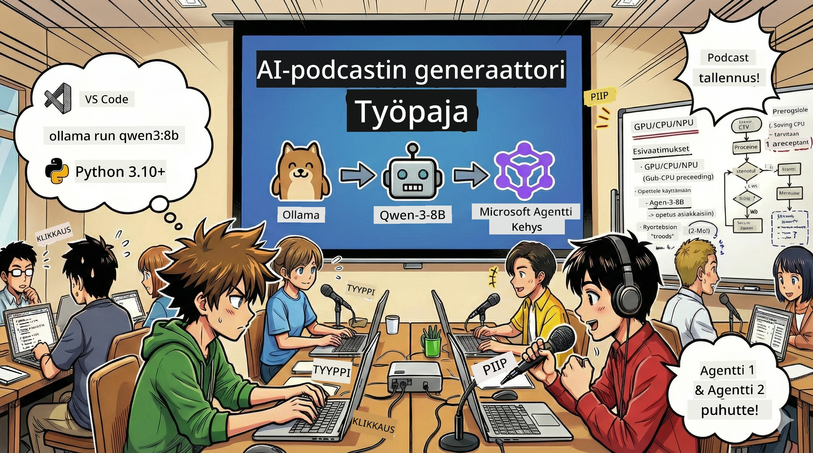
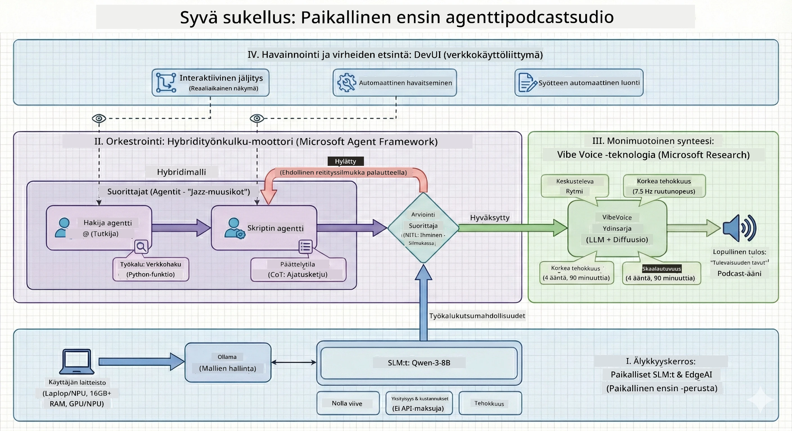

<!--
CO_OP_TRANSLATOR_METADATA:
{
  "original_hash": "f94e745264597bc5d8df967ead2eff97",
  "translation_date": "2026-01-05T10:42:36+00:00",
  "source_file": "WorkshopForAgentic/README.md",
  "language_code": "fi"
}
-->
# 🎙️ AI Podcast Studiotyöpaja

> 🌏 [中文版 (Chinese Version)](translation/zh-cn/README.md)



## Tehtäväsi

Tervetuloa **The AI Podcast Studioon**! Olet perustamassa omaa teknologiapodcastia nimeltä "Future Bytes" — mutta tässä on koukku: rakennat tekoälyllä toimivan tuotantotiimin auttamaan sinua sen tekemisessä. Ei enää loputtomia tunteja tutkimusta, käsikirjoittamista ja äänieditointia. Sen sijaan koodaat itsesi podcast-tuottajaksi tekoälyn supervoimin.

## Tarina

Kuvittele tämä: Sinä ja ystäväsi haluatte aloittaa podcastin kuumimmista teknologiatrendeistä, mutta kaikilla on kiire koulun, työn tai elämän kanssa. Entä jos voisit rakentaa joukkueen tekoälyagentteja tekemään raskaan työn puolestasi? Yksi agentti tutkii aiheita, toinen kirjoittaa mukaansatempaavia käsikirjoituksia ja kolmas muuttaa tekstin luonnollisen kuuloisiksi keskusteluiksi. Kuulostaa tieteiselokuvalta? Tehdään siitä todellisuutta.

## Mitä opit

Tämän työpajan lopussa osaat:
- 🤖 Käyttää omaa paikallista tekoälymallia (ei API-kustannuksia, ei pilvipalveluriippuvuutta!)
- 🔧 Rakentaa erikoistuneita tekoälyagentteja, jotka oikeasti toimivat yhdessä
- 🎬 Luo täydellinen podcast-tuotantoputki ideasta ääneen

## Matkasi: Kolme näytöstä



Kuin hyvässä tarinassa, meillä on kolme näytöstä. Jokainen rakentaa AI-podcast-studiotasi pala palalta:

| Jakso | Tehtäväsi | Mitä tapahtuu | Avatut taidot |
|---------|-----------|--------------|----------------|
| **Näytös 1** | [Tutustu tekoälyavustajiisi](md/01.BuildAIAgentWithSLM.md) | Opit luomaan tekoälyagentteja, jotka pystyvät keskustelemaan, hakemaan netistä ja ratkaisemaan ongelmia. Ajattele niitä tutkimusapulaisina, jotka eivät koskaan nuku. | 🎯 Rakenna ensimmäinen agenttisi<br>🛠️ Anna sille supervoimat (työkalut!)<br>🧠 Opeta se miettimään<br>🌐 Yhdistä se internettiin |
| **Näytös 2** | [Kokoa tuotantotiimisi](md/02.AIAgentOrchestrationAndWorkflows.md) | Nyt hommat muuttuvat kiinnostaviksi! Ohjaat useita tekoälyagentteja työskentelemään yhdessä kuin oikea podcast-tiimi. Yksi tutkii, toinen kirjoittaa, sinä hyväksyt — tiimityö voittaa. | 🎭 Koordinoi useita agentteja<br>🔄 Rakenna hyväksyntätyönkulkuja<br>🖥️ Testaa DevUI-käyttöliittymällä<br>✋ Pidä ihmiset ohjaksissa |
| **Näytös 3** | [Herätä podcastisi henkiin](md/03.Multi-SpeakerPodcastGenerationWithVibeVoice.md) | Finaali! Muunna käsikirjoituksesi oikeaksi podcast-äänitteeksi realistisilla äänillä ja luonnollisilla keskusteluilla. Sinun "Future Bytes" podcastisi on valmis julkaistavaksi! | 🎤 Tekstistä puheeksi -taikuus<br>👥 Useiden puhujien äänet<br>⏱️ Pitkäkestoinen ääni<br>🚀 Täysi automaatio |

Jokainen näytös avaa uusia kykyjä. Hypi eteenpäin, jos uskallat, mutta suosittelemme tarinan seuraamista!

## Ympäristövaatimukset

Tämä työpaja tukee erilaisia laitteisto ympäristöjä:
- **CPU**: Sopii testaukseen ja pienimuotoiseen käyttöön
- **GPU**: Suositellaan tuotantoympäristöihin, parantaa merkittävästi arviointinopeutta
- **NPU**: Tukee seuraavan sukupolven hermoverkon prosessointinopeutusta

## Tarvitset

### Ohjelmistolistat ✅
- **Python 3.10+** (koodauskielesi)
- **Ollama** (ajaa tekoälymalleja koneellasi)
- **VS Code** (editorisi)
- **Python-laajennus** (tekee VS Codesta älykkäämmän)
- **Git** (koodin hakemiseen)

### Laitteistotarkastus 💻
- **Voin ajaa tämän?**: 8GB RAM, 10GB vapaata tilaa (toimii, mutta voi olla hidasta)
- **Ihanteellinen kokoonpano**: 16GB+ RAM, hyvä GPU (sujuvampi käyttökokemus!)
- **Onko NPU?**: Vielä parempi! Seuraavan sukupolven suorituskyky käyttöön 🚀

## Studiopakkauksen asennus 🎬

### Vaihe 1: Python tehostus

Varmista että sinulla on Python 3.10 tai uudempi:

```bash
python --version
# Näyttää Python 3.10.x tai uudemman version
```

Ei Pythonia? Lataa se osoitteesta [python.org](https://python.org) — se on ilmainen!

### Vaihe 2: Hanki Ollama (tekoälymallien ajuri)

Siirry osoitteeseen [ollama.ai](https://ollama.ai) ja lataa Ollama käyttöjärjestelmääsi varten. Ajattele sitä moottorina, joka ajaa tekoälymallisi paikallisesti.

Tarkista onko se valmis:

```bash
ollama --version
```

### Vaihe 3: Lataa tekoälymielesi 🧠

On aika ladata Qwen-3-8B -malli (kuin palkkaisit ensimmäisen tekoälyavustajasi):

```bash
ollama pull qwen3:8b
```

*Tämä saattaa kestää muutaman minuutin. Täydellinen hetki kahvitauolle! ☕*

### Vaihe 4: Asenna VS Code

Lataa [Visual Studio Code](https://code.visualstudio.com/) jos sinulta puuttuu se. Se on paras koodieditori (kyseenalaista 😄).

### Vaihe 5: Python-laajennus

VS Codessa:
1. Paina `Ctrl+Shift+X` (tai `Cmd+Shift+X` Macillä)
2. Etsi "Python"
3. Asenna virallinen Microsoftin Python-laajennus

### Vaihe 6: Olet valmis! 🎉

Olet oikeasti valmis aloittamaan. Rakennetaan tekoälytaikuutta!

### Vaihe 7: Asenna Microsoft Agent Framework ja tarvittavat paketit 📦

Asenna kaikki työpajan vaatimat riippuvuudet:

```bash
pip install -r ./Installations/requirements.txt -U
```

*Tämä asentaa Microsoft Agent Frameworkin ja kaikki tarvittavat paketit. Ota kahvia — ensimmäinen asennus voi kestää muutaman minuutin! ☕*

## Työpajan ohjeet

Yksityiskohtainen projektirakenne, konfigurointivaiheet ja suoritusmenetelmät käydään läpi vaihe vaiheelta työpajan aikana.

## Vianetsintä (Kun hommat menevät vikaan) 🔧

### "Voi ei, mallin lataaminen kestää ikuisuuden!"
**Ratkaisu**: Käytä VPN:ää tai konfiguroi Ollama peilisivustoon. Joskus internet vain ei ole meidän puolellamme.

### "Tietokoneeni on kuollut! Muisti loppu!"
**Ratkaisu**: Vaihda pienempään malliin tai säädä `num_ctx`-asetusta käyttämään vähemmän muistia. Ajattele tätä AI:n dieetinä.

### "Voinko nopeuttaa tätä GPU:lla?"
**Ratkaisu**: Ollama tunnistaa GPU:t automaattisesti! Varmista vain, että GPU-ajurit ovat ajan tasalla. Ilmainen nopeutus! 🏎️

## Lisäresurssit (Uteliaille) 📚

- [Ollama Docs](https://github.com/ollama/ollama) — Syvä sukellus paikallisiin tekoälymalleihin
- [Microsoft Agent Framework](https://microsoft.github.io/autogen/) — Lisätietoa agenttitiimien rakentamisesta
- [Qwen-mallin tiedot](https://qwenlm.github.io/) — Tutustu tekoälyavustajasi aivoihin

## Lisenssi

MIT-lisenssi — Rakenna siistejä juttuja, jaa niitä, tee maailmasta parempi! 🌍

## Haluatko osallistua?

Löysitkö bugin? Onko idea? Jätä Issue tai PR! Rakastamme yhteisön energiaa. ✨

---

<!-- CO-OP TRANSLATOR DISCLAIMER START -->
**Vastuuvapauslauseke**:
Tämä asiakirja on käännetty käyttämällä tekoälypohjaista käännöspalvelua [Co-op Translator](https://github.com/Azure/co-op-translator). Vaikka pyrimme tarkkuuteen, tulee ottaa huomioon, että automaattikäännöksissä saattaa esiintyä virheitä tai epätarkkuuksia. Alkuperäistä asiakirjaa sen omalla kielellä tulee pitää virallisena lähteenä. Tärkeissä tiedoissa suositellaan ammattilaisen tekemää ihmislingvististä käännöstä. Emme ole vastuussa tämän käännöksen käytöstä aiheutuvista väärinymmärryksistä tai virhetulkinnoista.
<!-- CO-OP TRANSLATOR DISCLAIMER END -->