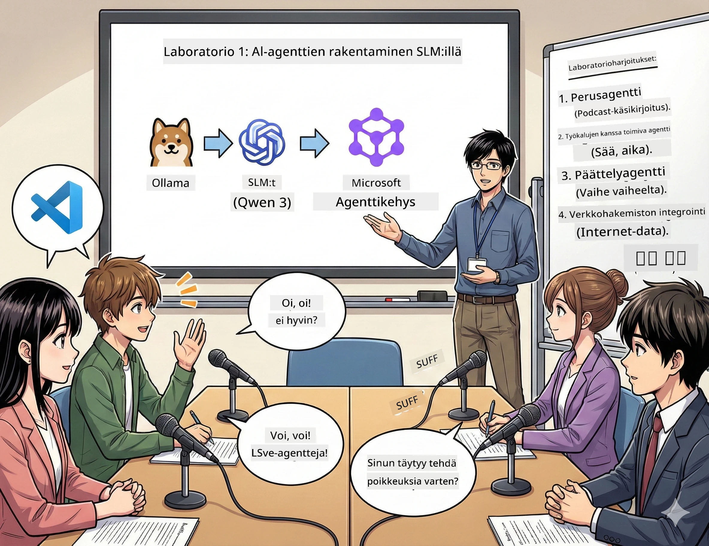

# Näytös 1: Tutustu AI-tutkimusavustajaasi 🤖

## Haaste

Olet lanseeraamassa "Future Bytes" -uutuusteknologiapodcastiasi. Ensimmäinen jakso käsittelee uusimpia AI-läpimurtoja, mutta sinulla on vain 24 tuntia:
1. Tutkia aihetta
2. Löytää luotettavia lähteitä
3. Kirjoittaa mukaansatempaava käsikirjoitus
4. Saada se kuulostamaan luonnolliselta

**Juonenkäänne**: Sinun ei tarvitse tehdä kaikkea yksin. Olet rakentamassa ensimmäistä AI-avustajaasi, joka auttaa kaikissa näissä tehtävissä. Kutsutaan sitä Alexiksi — väsyttämättömäksi tutkimuskumppaniksesi, joka ei koskaan tarvitse nukkua.

## Miksi valita pienet kielimallit? (Spoileri: ne ovat mahtavia)

Ajattele pieniä kielimalleja (SLM) henkilökohtaisena AI:na, joka toimii *omalla* tietokoneellasi. Ei pilveä, ei kuukausimaksuja, ei epäilyttäviä datanjakoja.

**Miksi SLM on niin 🔥:**
- **🏠 Toimii koneellasi**: kannettava, pöytäkone, jopa tehokas Raspberry Pi
- **💸 Ei jatkuvia kustannuksia**: ei API-kuluja, jotka syövät rahojasi
- **🔒 Yksityisyys ensin**: datasi ei koskaan poistu laitteeltasi
- **⚡ Salamannopea**: ei verkkoviiveitä, välitön reagointi
- **🪦 Kevyt**: miljardi–kymmenen miljardia parametria verrattuna suuriin malleihin, joissa satoja miljardeja

**Suosittuja SLM-malleja**: Qwen 3, Phi-4, Gemma 3 (tätä työpajaa varten käytämme Qweniä)

## Työkalupakkisi

### Ollama: AI-mallien hallintatyökalusi

[Ollama](https://ollama.com/) on kuin Steam AI-malleille. Lataa, aja ja hallitse malleja yksinkertaisilla komennoilla.

**Miksi se on siisti:**
- Mallin lataus ja ajaminen yhdellä komennolla
- Toimii Macilla, Windowsilla ja Linuxilla
- Käyttää automaattisesti GPU:ta, jos sellainen on
- Erittäin muistitehokas

### Microsoft Agent Framework: taika tapahtuu täällä

[Microsoft Agent Framework](https://github.com/microsoft/agent-framework) on leikkikenttäsi AI-agenttien rakentamiseen, jotka voivat:

- 💬 Keskustella ja muistaa mitä olette puhuneet
- 🛠️ Käyttää mukautettuja työkaluja (kuten verkkohaku tai sääennuste)
- 🧠 Ratkaista monimutkaisia ongelmia askel askeleelta
- 🤝 Tehdä yhteistyötä muiden agenttien kanssa tiiminä
- 🔌 Yhdistää eri AI-palveluntarjoajiin (OpenAI, Ollama, Azure)

**Rakennuspalikat:**
- **Agentit (Agents)**: AI-avustajat, joilla on erityistarkoitus
- **Työkalut (Tools)**: erityiskyvyt, jotka annat heille
- **Muisti (Memory)**: jotta he eivät unohda keskustelua
- **Päättely (Reasoning)**: opeta heille ajattelua, ei pelkkää vastaamista

## Koulutusmontaasisi: 4 tehtävää

### Tehtävä 1: Luo ensimmäinen agenttisi

📓 [Avaa Notebook](../../code/01.BasicAgent/00.BasicAgent-agent.ipynb)

**Tehtävä**: Rakenna Alex, podcast-käsikirjoitustasi kirjoittava AI. Alexin tulee luoda keskustelu kahden juontajan välillä, joka käsittelee teknologiaiheita.

**Opit:**
- Kuinka herättää AI-agentti eloon (helpompaa kuin herätä maanantaina)
- Antaa sille persoona ja ohjeet
- Luoda aidolta kuulostava podcast-käsikirjoitus
- Ymmärtää sen vastauksia

**Voittotavoite**: Alex laatii käsikirjoituksen "Future Bytes" AI-jaksoa varten! 🎯

### Tehtävä 2: Anna Alexille yliluonnollisia voimia (työkalut!)

📓 [Avaa Notebook](../../code/01.BasicAgent/01.BasicAgent-tools.ipynb)

**Tehtävä**: Alex on fiksu, mutta se ei tiedä tämän päivän säätä tai kellonaikaa. Ratkaistaan tämä antamalla sille työkaluja!

**Opit:**
- Luoda räätälöity Python-toiminto "työkaluna"
- Antaa Alexin päättää *milloin* käyttää mitäkin työkalua
- Katsoa, kuinka se ratkaisee ongelmia itsenäisesti
- Yhdistää useita työkaluja monimutkaisiin tehtäviin

**Voittotavoite**: Kysy "Millainen sää on Tokiossa?" ja Alex löytää vastauksen itse! ☁️

### Tehtävä 3: Opeta Alex ajattelemaan

📓 [Avaa Notebook](../../code/01.BasicAgent/02.BasicAgent-reasoning.ipynb)

**Tehtävä**: Näytä, kuinka Alex työskentelee. Haluat nähdä, *miten* se ajattelee ongelman ratkaisun aikana, ei pelkkää vastausta.

**Opit:**
- Aktivoida "päättelytila" (kuin matikan tunnilla näyttäisit ratkaisusi)
- Katsoa Alexin askel askeleelta etenevää ajattelua
- Ymmärtää päättelyketjujen vihjeitä
- Debugata, kun Alex hämmentyy

**Voittotavoite**: Kysy haastava matemaattinen kysymys ja katso Alexin pohdintaa! 🧠

### Tehtävä 4: Yhdistä Alex internetiin

📓 [Avaa Notebook](../../code/01.BasicAgent/03.BasicAgent-websearch.ipynb)

**Tehtävä**: Alexin tiedot vanhenevat. Yhdistetään se verkkoon reaalitiedon saamiseksi!

**Opit:**
- Rakentaa räätälöity verkkohakutyökalu
- Integrointi ulkoisiin API:hin
- Käsitellä verkkovirheitä tyylikkäästi
- Saada tietoa, jota ei ole Alexin koulutusdatassa

**Voittotavoite**: Kysy tämän päivän teknologiauutisia ja saa tuoreimmat tulokset! 📰

## Ennen aloitusta 🚀

**Välttämättömät varusteet**:
- Asennettu Python 3.10+ 
- Ollama käynnissä (tarkista `ollama --version` komennolla)
- VS Code Python-laajennuksella
- Vähintään 8 Gt muistia (sujuvaan kokemukseen 16 Gt)

## Tehtävien järjestys

Suorita notebookit järjestyksessä täydellisen kokemuksen saamiseksi:

1. [00.BasicAgent-agent.ipynb](../../code/01.BasicAgent/00.BasicAgent-agent.ipynb) — Tapaa Alex (ensimmäinen agenttisi)
2. [01.BasicAgent-tools.ipynb](../../code/01.BasicAgent/01.BasicAgent-tools.ipynb) — Päivitys!
3. [02.BasicAgent-reasoning.ipynb](../../code/01.BasicAgent/02.BasicAgent-reasoning.ipynb) — Opeta Alex ajattelemaan
4. [03.BasicAgent-websearch.ipynb](../../code/01.BasicAgent/03.BasicAgent-websearch.ipynb) — Avaa internet-yhteys!

## Mitä hallitset

Ensimmäisen näytöksen jälkeen osaat:

- ✅ Käyttää AI-malleja omalla laitteistollasi (ilman pilveä!)
- ✅ Rakentaa agentteja, joilla on räätälöity persoona ja taidot
- ✅ Antaa agentille työkaluja todellisten ongelmien ratkaisuun
- ✅ Näyttää agenttien päättelyprosessin
- ✅ Yhdistää agentin ulkoisiin tietolähteisiin
- ✅ Debugata, kun asiat menevät pieleen

## Kun asiat menevät vikaan (ja miten korjata) 🔧

### "Alex ei lataudu! Muisti ei riitä!"
**Ratkaisu**: Tietokoneesi kamppailee. Yritä sulkea muita sovelluksia tai vaihda pienempään malliin. 8 Gt on minimi.

### "Alex on liian hidas"
**Ratkaisu**: Ota Ollaman asetuksista GPU-kiihdytys käyttöön. Tai pienennä kontekstin ikkunan kokoa. Nopeustila päälle! 🏎️

### "Työkalut eivät toimi!"
**Ratkaisu**: Tarkista funktiosi allekirjoitus tarkasti. Alex tarvitsee oikeat tyyppi-vihjeet ymmärtääkseen työkalun toimintaa. Kuvittele antavasi selkeät ohjeet.

## hyödyllisiä linkkejä 🔗

- [Agent Framework dokumentaatio](https://github.com/microsoft/agent-framework) — viralliset ohjeet ja esimerkit
- [Ollama mallikirjasto](https://ollama.com/library) — selaa kaikkia saatavilla olevia malleja
- [Qwen-malli](https://ollama.com/library/qwen3) — tutustu AI-avustajasi aivoihin
- [Koodiesimerkit](https://github.com/microsoft/agent-framework/tree/main/python/samples) — varasta ideoita täältä

## Seuraava askel: Näytös 2 🎬

Sinulla on agentti. Mutta entä jos sinulla olisi *joukkue* agentteja työskentelemässä yhdessä? Näytös 2:ssa rakennat täydellisen podcast-tuotantotiimin:
- **Tutkimusagentti**: Löytää parhaat lähteet
- **Kirjoitusagentti**: Laatii täydellisen käsikirjoituksen
- **Editointi (sinä!)**: Hyväksyy tai pyytää muutoksia

Tehdään yhdessä AI-taikoja! → [Näytös 2: Rakenna tuotantotiimisi](02.AIAgentOrchestrationAndWorkflows.md)

---

**Jumiuduitko?** Kysy työpajan aikana. Opimme yhdessä! 🙌

---

<!-- CO-OP TRANSLATOR DISCLAIMER START -->
**Vastuuvapauslauseke**:
Tämä asiakirja on käännetty tekoälypohjaisella käännöspalvelulla [Co-op Translator](https://github.com/Azure/co-op-translator). Vaikka pyrimme tarkkuuteen, automaattikäännökset saattavat sisältää virheitä tai epätarkkuuksia. Alkuperäistä asiakirjaa omalla kielialueellaan tulee pitää virallisena lähteenä. Tärkeissä asioissa suositellaan ammattimaista ihmiskäännöstä. Emme ole vastuussa tämän käännöksen käytöstä johtuvista väärinymmärryksistä tai tulkinnoista.
<!-- CO-OP TRANSLATOR DISCLAIMER END -->