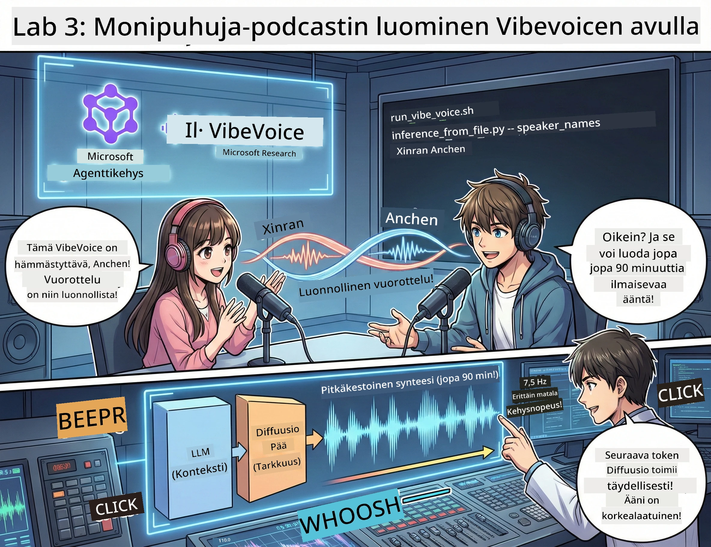

# Näytös 3: Herätä podcastisi henkiin 🎤



## Suuri finaali

Olet tutkinut aihetta. Olet kirjoittanut käsikirjoituksen. Nyt lisätään viimeistely: muunna tekstisi aidoksi podcast-audioksi aidolla äänellä!

Tässä tulee **VibeVoice** — Microsoft Researchin avoimen lähdekoodin TTS (tekstistä puheeksi) taika, joka luo:
- 🎭 Luonnollisen sujuvaa dialogia
- 👥 Useita puhujia (enintään 4!)
- ⏱️ Pitkiä äänitallenteita (jopa 90 minuuttia!)
- 🎵 Ilmeikästä tulkintaa (ei robottimaista ääntä!)

Tässä on tekniikka podcastien syntetisoinnin takana. Tehdään sinun podcastisi!

## Mikä on VibeVoice? (hienoa kamaa)

VibeVoice on Microsoft Researchin lahja maailmalle. Se on suunniteltu erityisesti podcast-tyyliseen keskusteluaudioon.

### Miksi se on mahtava 🔥

* **⏱️ Maratonkeskustelut**: Luo jatkuvaa puhetta jopa 90 minuutin ajan (täysi podcast-jakso!)
* **👥 Useita puhujia**: Enintään 4 erilaista ääntä, joilla on yhtenäinen persoona
* **⚡ Erittäin tehokas**: Käyttää erittäin matalaa 7,5 Hz ruutunopeutta säästääkseen laskentatehoa
* **🧠 Älykäs ääni**: Yhdistää LLM:n (kontekstin ymmärtäminen) ja diffuusiomallin (aidon puheen luominen)
* **🎭 Luonnollinen ja sujuva**: Käsittelee automaattisesti puhujien vuorottelun, tauot ja dialogin rytmin

**Toisin sanoen**: VibeVoice ei vain lue käsikirjoitustasi — se *näyttelee* sitä kuin oikea ihminen.

---

## Ennen aloitusta 🚀

**Tarvitset**:

* 🐍 **Python 3.10+** (sinulla on tämä jo näytös 1 ja 2 perusteella)
* 🚀 **uv** (nopea Python-pakettien hallinta — asennamme sen)
* 📝 **käsikirjoituksesi**: Näytös 2:n `podcast.txt` tiedosto (`../03.Application/` kansiossa)

**Ammattivinkki**: Tämä vaihe vaatii hyvän nettiyhteyden esikoulutettujen mallien lataamiseen. Ota kahvikuppi! ☕

---

## Aloitetaan! Helppo tapa 🎬

Olemme tehneet tämän todella yksinkertaiseksi. Yksi shell-skripti hoitaa kaiken.

### Prosessi

1. **Tee se suoritettavaksi**:
```bash
chmod +x run_vibe_voice.sh
```

2. **Suorita se**:
```bash
./run_vibe_voice.sh
```

3. **Odota taikaa** (ensimmäinen suoritus voi kestää muutaman minuutin)

### Mitä taustalla tapahtuu 🎭

Skripti on pohjimmiltaan automaattinen äänisuunnittelijasi:

1. **📥 Lataa VibeVoice**: kloonaa virallinen GitHub-repositorio
2. **📦 Asenna riippuvuudet**: käytä `uv pip` salamannopeaan pakettien asennukseen
3. **🎬 Luo ääni**: suorita inferenssiskripti käyttäen:
   * `--model_path`: esikoulutettu VibeVoice-7B malli
   * `--txt_path`: sinun `podcast.txt` käsikirjoituksesi
   * `--speaker_names`: määritä äänet (oletuksena Xinran ja Anchen)

**Tuloksena**: käsikirjoituksestasi tulee oikea podcast-jakso! 🎉

---

## Tehtäväsi 🎯

Tehdään tästä hauskaa:

### Tehtävä 1: Luo sisältöä
Muokkaa `../03.Application/podcast.txt` kahden ihmisen väliseksi dialogiksi. Aihe voi olla teknologia, harrastukset tai mitä tahansa! Tee siitä vuoropuhelua.

**Muotoesimerkki**:
```
说话人 1：嘿！你听说新的 AI 模型了吗？
说话人 2：不会吧！告诉我更多！
说话人 1：它叫...
```

### Tehtävä 2: Luo ääni
Suorita skripti ja katso, kun taika tapahtuu. Ensimmäinen kerta kestää kauemmin (mallien latauksen takia).

### Tehtävä 3: Kuuntele ja analysoi
- Kuuluuko luonnolliselta?
- Onko puhujilla erilaiset äänet?
- Onko puhujien vuorottelu sujuvaa?
- Onko mukana robotin kaltaisia hetkiä?

### Tehtävä 4: Kokeile (rohkeille)
Muokkaa `run_vibe_voice.sh` ja vaihda `--speaker_names` kokeillaksesi eri ääniyhdistelmiä. VibeVoice tarjoaa useita esikoulutettuja ääniä!

**Bonushaaste**: kokeile kolmen puhujan dialogia! 🎆

---

## Lisätietoja 📚

* **🏠 Projektin kotisivu**: [VibeVoice virallinen sivusto](https://microsoft.github.io/VibeVoice/)
* **🤗 Esikoulutetut mallit**: [Hugging Face - VibeVoice-7B](https://huggingface.co/vibevoice/VibeVoice-7B)
* **📖 Tutkimusartikkeli**: Syvällisempää teknologiaa (jos kiinnostaa)

> **⚠️ Vastuullisen tekoälyn muistutus**: VibeVoice on voimakas työkalu. Käytä sitä eettisesti! Älä luo deepfake- tai harhaanjohtavaa sisältöä. Tee ihmisiä auttavia hienoja asioita. 🙏

---

## 🏆 Onneksi olkoon! Teit sen!

Olet juuri suorittanut koko prosessin:
1. ✅ **Näytös 1**: Rakenna räätälöity AI-agentti
2. ✅ **Näytös 2**: Orkestroi monen agentin työnkulku
3. ✅ **Näytös 3**: Luo aito podcast-audio

**Sinulla on nyt**:
- Toimiva AI-tutkimusassistentti
- Täysin toimiva podcast-tuotantoprosessi
- Aito äänitiedosto, jota voit jakaa

### Mitä seuraavaksi? 🚀

**Julkaise podcastisi!**
- Lataa podcast-alustoille
- Jaa sosiaalisessa mediassa
- Iteroi ja kehitä

**Jatka rakentamista!**
- Kokeile erilaisia aiheita
- Kokeile lisää puhujia
- Lisää taustamusiikkia
- Rakenna web-käyttöliittymä
- Automatisoi koko prosessi

**Jaa tuotoksesi!**
Merkitse meidät! Näytä maailmalle, mitä olet rakentanut. AI-podcast-vallankumous alkaa sinusta. 🎙️

---

**Kysymyksiä? Ideoita? Menestystarinoita?** Esitä ne työpajan chatissa!

**Tervetuloa sisällöntuotannon tulevaisuuteen.** 🌟

---

<!-- CO-OP TRANSLATOR DISCLAIMER START -->
**Vastuuvapauslauseke**:
Tämä asiakirja on käännetty tekoälykäännöspalvelulla [Co-op Translator](https://github.com/Azure/co-op-translator). Pyrimme tarkkuuteen, mutta huomioithan, että automaattiset käännökset saattavat sisältää virheitä tai epätarkkuuksia. Alkuperäinen asiakirja sen alkuperäiskielellä on virallinen lähde. Tärkeissä asioissa suosittelemme ammattimaista ihmiskäännöstä. Emme ole vastuussa tämän käännöksen käytöstä aiheutuvista väärinkäsityksistä tai virhetulkinnoista.
<!-- CO-OP TRANSLATOR DISCLAIMER END -->