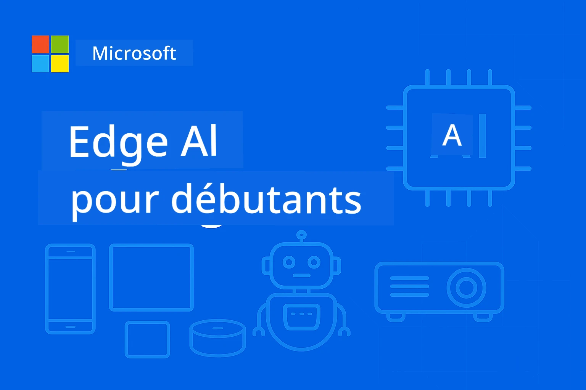

# EdgeAI pour débutants 




[](https://GitHub.com/microsoft/edgeai-for-beginners/graphs/contributors)
[](https://GitHub.com/microsoft/edgeai-for-beginners/issues)
[](https://GitHub.com/microsoft/edgeai-for-beginners/pulls)
[](http://makeapullrequest.com)

[](https://GitHub.com/microsoft/edgeai-for-beginners/watchers)
[](https://GitHub.com/microsoft/edgeai-for-beginners/fork)
[](https://GitHub.com/microsoft/edgeai-for-beginners/stargazers)


[](https://discord.gg/nTYy5BXMWG)

Suivez ces étapes pour commencer à utiliser ces ressources :

1. **Forkez le dépôt** : Cliquez sur [](https://GitHub.com/microsoft/edgeai-for-beginners/fork)
2. **Clonez le dépôt** :   `git clone https://github.com/microsoft/edgeai-for-beginners.git`
3. [**Rejoignez le Discord Azure AI Foundry et rencontrez des experts et d’autres développeurs**](https://discord.com/invite/ByRwuEEgH4)


### 🌐 Support multilingue

#### Pris en charge via GitHub Action (Automatisé & Toujours à jour)

<!-- CO-OP TRANSLATOR LANGUAGES TABLE START -->
[Arabe](../ar/README.md) | [Bengali](../bn/README.md) | [Bulgare](../bg/README.md) | [Burmese (Myanmar)](../my/README.md) | [Chinois (simplifié)](../zh-CN/README.md) | [Chinois (traditionnel, Hong Kong)](../zh-HK/README.md) | [Chinois (traditionnel, Macao)](../zh-MO/README.md) | [Chinois (traditionnel, Taïwan)](../zh-TW/README.md) | [Croate](../hr/README.md) | [Tchèque](../cs/README.md) | [Danois](../da/README.md) | [Néerlandais](../nl/README.md) | [Estonien](../et/README.md) | [Finnois](../fi/README.md) | [Français](./README.md) | [Allemand](../de/README.md) | [Grec](../el/README.md) | [Hébreu](../he/README.md) | [Hindi](../hi/README.md) | [Hongrois](../hu/README.md) | [Indonésien](../id/README.md) | [Italien](../it/README.md) | [Japonais](../ja/README.md) | [Kannada](../kn/README.md) | [Coréen](../ko/README.md) | [Lituanien](../lt/README.md) | [Malais](../ms/README.md) | [Malayalam](../ml/README.md) | [Marathi](../mr/README.md) | [Népalais](../ne/README.md) | [Pidgin nigérian](../pcm/README.md) | [Norvégien](../no/README.md) | [Persan (Farsi)](../fa/README.md) | [Polonais](../pl/README.md) | [Portugais (Brésil)](../pt-BR/README.md) | [Portugais (Portugal)](../pt-PT/README.md) | [Pendjabi (Gurmukhi)](../pa/README.md) | [Roumain](../ro/README.md) | [Russe](../ru/README.md) | [Serbe (cyrillique)](../sr/README.md) | [Slovaque](../sk/README.md) | [Slovène](../sl/README.md) | [Espagnol](../es/README.md) | [Swahili](../sw/README.md) | [Suédois](../sv/README.md) | [Tagalog (Philippin)](../tl/README.md) | [Tamoul](../ta/README.md) | [Télougou](../te/README.md) | [Thaï](../th/README.md) | [Turc](../tr/README.md) | [Ukrainien](../uk/README.md) | [Ourdou](../ur/README.md) | [Vietnamien](../vi/README.md)

> **Préférez-vous cloner localement ?**

> Ce dépôt comprend plus de 50 traductions de langues, ce qui augmente considérablement la taille du téléchargement. Pour cloner sans les traductions, utilisez le sparse checkout :
> ```bash
> git clone --filter=blob:none --sparse https://github.com/microsoft/edgeai-for-beginners.git
> cd edgeai-for-beginners
> git sparse-checkout set --no-cone '/*' '!translations' '!translated_images'
> ```
> Cela vous donne tout ce dont vous avez besoin pour compléter le cours avec un téléchargement beaucoup plus rapide.
<!-- CO-OP TRANSLATOR LANGUAGES TABLE END -->

**Si vous souhaitez que des langues supplémentaires soient prises en charge, elles sont listées [ici](https://github.com/Azure/co-op-translator/blob/main/getting_started/supported-languages.md)**
## Introduction

Bienvenue dans **EdgeAI pour débutants** – votre parcours complet dans le monde transformateur de l'intelligence artificielle sur le Edge. Ce cours comble le fossé entre des capacités IA puissantes et le déploiement pratique, réel, sur des dispositifs en périphérie, vous permettant d'exploiter le potentiel de l’IA directement là où les données sont générées et où les décisions doivent être prises.

### Ce que vous maîtriserez

Ce cours vous conduit des concepts fondamentaux aux implémentations prêtes pour la production, couvrant :
- **Petits modèles de langage (SLM)** optimisés pour le déploiement en périphérie
- **Optimisation consciente du matériel** sur diverses plateformes
- **Inférence en temps réel** avec des capacités préservant la vie privée
- **Stratégies de déploiement en production** pour les applications d'entreprise

### Pourquoi EdgeAI est important

Edge AI représente un changement de paradigme qui répond à des défis modernes critiques :
- **Confidentialité & Sécurité** : Traitez les données sensibles localement sans exposition au cloud
- **Performance en temps réel** : Éliminez la latence réseau pour des applications sensibles au temps
- **Efficacité des coûts** : Réduisez la bande passante et les coûts cloud
- **Opérations résilientes** : Maintenez la fonctionnalité lors des pannes réseau
- **Conformité réglementaire** : Respectez les exigences de souveraineté des données

### Edge AI

Edge AI désigne l’exécution d’algorithmes d’IA et de modèles de langage localement sur le matériel, proche du lieu de génération des données, sans dépendance aux ressources cloud pour l’inférence. Cela réduit la latence, améliore la confidentialité et permet une prise de décision en temps réel.

### Principes fondamentaux :
- **Inférence sur l’appareil** : Les modèles d’IA fonctionnent sur les appareils Edge (téléphones, routeurs, microcontrôleurs, PC industriels)
- **Capacité hors ligne** : Fonctionne sans connexion permanente à Internet
- **Faible latence** : Réponses immédiates adaptées aux systèmes en temps réel
- **Souveraineté des données** : Conserve les données sensibles localement, améliorant sécurité et conformité

### Petits modèles de langage (SLM)

Les SLM comme Phi-4, Mistral-7B et Gemma sont des versions optimisées de grands LLM — entraînées ou distillées pour :
- **Réduction de l’empreinte mémoire** : Utilisation efficace de la mémoire limitée des appareils Edge
- **Demande de calcul plus faible** : Optimisé pour les performances CPU et GPU en périphérie
- **Temps de démarrage plus rapides** : Initialisation rapide pour des applications réactives

Ils débloquent des capacités NLP puissantes tout en respectant les contraintes des :
- **Systèmes embarqués** : Appareils IoT et contrôleurs industriels
- **Appareils mobiles** : Smartphones et tablettes avec capacités hors ligne
- **Appareils IoT** : Capteurs et dispositifs intelligents aux ressources limitées
- **Serveurs Edge** : Unités de traitement locales avec ressources GPU limitées
- **Ordinateurs personnels** : Scénarios de déploiement sur desktop et laptop

## Modules du cours & Navigation

| Module | Sujet | Domaine de focus | Contenu clé | Niveau | Durée |
|--------|-------|------------------|-------------|--------|--------|
| [📖 00 ](./introduction.md) | [Introduction à EdgeAI](./introduction.md) | Fondations & contexte | Vue d’ensemble d’EdgeAI • Applications industrielles • Introduction aux SLM • Objectifs d’apprentissage | Débutant | 1-2 h |
| [📚 01](../../Module01) | [Fondamentaux EdgeAI](./Module01/README.md) | Comparaison Cloud vs Edge AI | Fondamentaux EdgeAI • Études de cas réels • Guide d’implémentation • Déploiement edge | Débutant | 3-4 h |
| [🧠 02](../../Module02) | [Bases du modèle SLM](./Module02/README.md) | Familles de modèles & architecture | Famille Phi • Famille Qwen • Famille Gemma • BitNET • μModel • Phi-Silica | Débutant | 4-5 h |
| [🚀 03](../../Module03) | [Pratique de déploiement SLM](./Module03/README.md) | Déploiement local & cloud | Apprentissage avancé • Environnement local • Déploiement cloud | Intermédiaire | 4-5 h |
| [⚙️ 04](../../Module04) | [Boîte à outils d’optimisation](./Module04/README.md) | Optimisation multiplateforme | Introduction • Llama.cpp • Microsoft Olive • OpenVINO • Apple MLX • Synthèse de workflow | Intermédiaire | 5-6 h |
| [🔧 05](../../Module05) | [Production SLMOps](./Module05/README.md) | Opérations en production | Introduction à SLMOps • Distillation de modèle • Affinage • Déploiement en production | Avancé | 5-6 h |
| [🤖 06](../../Module06) | [Agents IA & Appel de fonctions](./Module06/README.md) | Frameworks agents & MCP | Introduction agent • Appel de fonctions • Protocole contexte modèle | Avancé | 4-5 h |
| [💻 07](../../Module07) | [Implémentation plateforme](./Module07/README.md) | Exemples multiplateformes | Boîte à outils IA • Foundry Local • Développement Windows | Avancé | 3-4 h |
| [🏭 08](../../Module08) | [Boîte à outils Foundry Local](./Module08/README.md) | Exemples prêts production | Applications exemples (voir détails ci-dessous) | Expert | 8-10 h |

### 🏭 **Module 08 : Applications exemple**

- [01 : Démarrage rapide REST Chat](./Module08/samples/01/README.md)
- [02 : Intégration SDK OpenAI](./Module08/samples/02/README.md)
- [03 : Découverte & benchmarking de modèles](./Module08/samples/03/README.md)
- [04 : Application Chainlit RAG](./Module08/samples/04/README.md)
- [05 : Orchestration multi-agent](./Module08/samples/05/README.md)
- [06 : Routeur Modèles-comme-Outils](./Module08/samples/06/README.md)
- [07 : Client API direct](./Module08/samples/07/README.md)
- [08 : Application chat Windows 11](./Module08/samples/08/README.md)
- [09 : Système multi-agent avancé](./Module08/samples/09/README.md)
- [10 : Framework outils Foundry](./Module08/samples/10/README.md)

### 🎓 **Atelier : Parcours d’apprentissage pratique**

Matériel complet d’atelier pratique avec implémentations prêtes pour la production :

- **[Guide de l’atelier](./Workshop/Readme.md)** – Objectifs d’apprentissage complets, résultats et navigation des ressources
- **Exemples Python** (6 sessions) – Mis à jour avec meilleures pratiques, gestion des erreurs, documentation complète
- **Notebooks Jupyter** (8 interactifs) – Tutoriels pas-à-pas avec benchmarks et suivi des performances
- **Guides sessions** – Guides markdown détaillés pour chaque session d’atelier
- **Outils de validation** – Scripts pour vérifier la qualité du code et réaliser des tests de fumée

**Ce que vous construirez :**
- Applications de chat IA locales avec support du streaming
- Pipelines RAG avec évaluation de la qualité (RAGAS)
- Outils de benchmarking et comparaison multi-modèles
- Systèmes d’orchestration multi-agent
- Routage intelligent des modèles avec sélection basée sur la tâche

### 🎙️ **Atelier Agentic : Pratique – Le studio de podcast IA**

Construisez une chaîne de production de podcast alimentée par IA depuis zéro ! Cet atelier immersif vous enseigne comment créer un système multi-agent complet qui transforme des idées en épisodes professionnels de podcast.
**[🎬 Démarrer l'atelier AI Podcast Studio](./WorkshopForAgentic/README.md)**

**Votre mission** : Lancez "Future Bytes" — un podcast technologique entièrement alimenté par des agents d'IA que vous créerez vous-même. Pas de dépendances cloud, pas de coûts d'API — tout fonctionne localement sur votre machine.

**Ce qui rend cela unique :**
- **🤖 Orchestration multi-agent réelle** - Construisez des agents d'IA spécialisés qui recherchent, écrivent et produisent de l'audio
- **🎯 Pipeline de production complet** - De la sélection du sujet à la production finale de l'audio du podcast
- **💻 Déploiement 100% local** - Utilise Ollama et des modèles locaux (Qwen-3-8B) pour une confidentialité et un contrôle total
- **🎤 Intégration de synthèse vocale** - Transformez les scripts en conversations naturelles multi-intervenants
- **✋ Flux de travail avec intervention humaine** - Des étapes d'approbation garantissent la qualité tout en maintenant l'automatisation

**Parcours d'apprentissage en trois actes :**

| Acte | Focus | Compétences clés | Durée |
|-----|-------|------------------|-------|
| **[Acte 1 : Rencontrez vos assistants IA](./WorkshopForAgentic/md/01.BuildAIAgentWithSLM.md)** | Construire votre premier agent IA | Intégration d'outils • Recherche web • Résolution de problèmes • Raisonnement agentique | 2-3 h |
| **[Acte 2 : Assemblez votre équipe de production](./WorkshopForAgentic/md/02.AIAgentOrchestrationAndWorkflows.md)** | Orchestrer plusieurs agents | Coordination d'équipe • Flux d'approbation • Interface DevUI • Supervision humaine | 3-4 h |
| **[Acte 3 : Donnez vie à votre podcast](./WorkshopForAgentic/md/03.Multi-SpeakerPodcastGenerationWithVibeVoice.md)** | Générer l'audio du podcast | Synthèse vocale • Synthèse multi-intervenants • Audio long format • Automatisation complète | 2-3 h |

**Technologies utilisées :**
- **Microsoft Agent Framework** - Orchestration et coordination multi-agent
- **Ollama** - Runtime modèle IA local (sans cloud requis)
- **Qwen-3-8B** - Modèle de langage open-source optimisé pour les tâches agentiques
- **API de synthèse vocale** - Synthèse vocale naturelle pour la génération de podcasts

**Support matériel :**
- ✅ **Mode CPU** - Fonctionne sur tout ordinateur moderne (8GB+ RAM recommandé)
- 🚀 **Accélération GPU** - Inférence nettement plus rapide avec GPU NVIDIA/AMD
- ⚡ **Support NPU** - Accélération par unité de traitement neuronal nouvelle génération

**Parfait pour :**
- Les développeurs apprenant les systèmes IA multi-agents
- Tous ceux qui s'intéressent à l'automatisation IA et aux workflows
- Les créateurs de contenu explorant la production assistée par IA
- Les étudiants étudiant les modèles pratiques d'orchestration IA

**Commencez à construire** : [🎙️ L'atelier AI Podcast Studio →](./WorkshopForAgentic/README.md)

### 📊 **Résumé du parcours d'apprentissage**
- **Durée totale** : 36-45 heures
- **Parcours débutant** : Modules 01-02 (7-9 heures)  
- **Parcours intermédiaire** : Modules 03-04 (9-11 heures)
- **Parcours avancé** : Modules 05-07 (12-15 heures)
- **Parcours expert** : Module 08 (8-10 heures)

## Ce que vous allez construire

### 🎯 Compétences clés
- **Architecture Edge AI** : Concevoir des systèmes IA locaux-first avec intégration cloud
- **Optimisation de modèle** : Quantification et compression des modèles pour un déploiement edge (amélioration de 85% de la vitesse, réduction de 75% de la taille)
- **Déploiement multi-plateforme** : Windows, mobile, embarqué, et systèmes hybrides cloud-edge
- **Opérations de production** : Monitoring, montée en charge et maintenance des IA edge en production

### 🏗️ Projets pratiques
- **Apps de chat locales Foundry** : Application native Windows 11 avec changement de modèles
- **Systèmes multi-agents** : Coordinateur avec agents spécialisés pour workflows complexes  
- **Applications RAG** : Traitement local de documents avec recherche vectorielle
- **Routeurs de modèles** : Sélection intelligente entre modèles basée sur l'analyse des tâches
- **Frameworks API** : Clients prêts pour la production avec streaming et monitoring santé
- **Outils multi-plateformes** : Modèles d'intégration LangChain/Semantic Kernel

### 🏢 Applications industrielles
**Manufacturier** • **Soins de santé** • **Véhicules autonomes** • **Villes intelligentes** • **Applications mobiles**

## Démarrage rapide

**Parcours d'apprentissage recommandé** (20-30 heures au total) :

0. **📖 Introduction** ([Introduction.md](./introduction.md)) : Fondations EdgeAI + contexte industriel + cadre d'apprentissage
1. **📚 Fondations** (Modules 01-02) : Concepts EdgeAI + familles de modèles SLM
2. **⚙️ Optimisation** (Modules 03-04) : Déploiement + frameworks de quantification  
3. **🚀 Production** (Modules 05-06) : SLMOps + agents IA + appels de fonctions
4. **💻 Implémentation** (Modules 07-08) : Exemples platformes + toolkit Foundry Local

Chaque module comprend théorie, exercices pratiques et exemples de code prêts pour la production.

## Impact professionnel

**Rôles techniques** : Architecte solutions EdgeAI • Ingénieur ML (Edge) • Développeur AI IoT • Développeur AI mobile

**Secteurs industriels** : Industrie 4.0 • Technologies santé • Systèmes autonomes • FinTech • Électronique grand public

**Projets portfolio** : Systèmes multi-agents • Applications RAG en production • Déploiement cross-plateforme • Optimisation des performances

## Structure du dépôt

```
edgeai-for-beginners/
├── 📖 introduction.md  # Foundation: EdgeAI Overview & Learning Framework
├── 📚 Module01-04/     # Fundamentals → SLMs → Deployment → Optimization  
├── 🔧 Module05-06/     # SLMOps → AI Agents → Function Calling
├── 💻 Module07/        # Platform Samples (VS Code, Windows, Jetson, Mobile)
├── 🏭 Module08/        # Foundry Local Toolkit + 10 Comprehensive Samples
│   ├── samples/01-06/  # Foundation: REST, SDK, RAG, Agents, Routing
│   └── samples/07-10/  # Advanced: API Client, Windows App, Enterprise Agents, Tools
├── 🌐 translations/    # Multi-language support (8+ languages)
└── 📋 STUDY_GUIDE.md   # Structured learning paths & time allocation
```

## Points forts du cours

✅ **Apprentissage progressif** : Théorie → Pratique → Déploiement en production  
✅ **Études de cas réelles** : Microsoft, Japan Airlines, déploiements en entreprise  
✅ **Exemples pratiques** : 50+ exemples, 10 démos complètes Foundry Local  
✅ **Focus performances** : Amélioration de 85% de la vitesse, réduction de 75% de la taille  
✅ **Multi-plateforme** : Windows, mobile, embarqué, hybride cloud-edge  
✅ **Prêt pour la production** : Monitoring, montée en charge, sécurité, cadres de conformité

📖 **[Guide d'étude disponible](STUDY_GUIDE.md)** : Parcours d'apprentissage structuré de 20 heures avec conseils de répartition du temps et outils d'auto-évaluation.

---

**EdgeAI représente l'avenir du déploiement IA** : local-first, respectueux de la vie privée et efficace. Maîtrisez ces compétences pour construire la prochaine génération d'applications intelligentes.

## Autres cours

Notre équipe produit d'autres cours ! Découvrez :

<!-- CO-OP TRANSLATOR OTHER COURSES START -->
### LangChain
[](https://aka.ms/langchain4j-for-beginners)
[](https://aka.ms/langchainjs-for-beginners?WT.mc_id=m365-94501-dwahlin)
[](https://github.com/microsoft/langchain-for-beginners?WT.mc_id=m365-94501-dwahlin)
---

### Azure / Edge / MCP / Agents
[](https://github.com/microsoft/AZD-for-beginners?WT.mc_id=academic-105485-koreyst)
[](https://github.com/microsoft/edgeai-for-beginners?WT.mc_id=academic-105485-koreyst)
[](https://github.com/microsoft/mcp-for-beginners?WT.mc_id=academic-105485-koreyst)
[](https://github.com/microsoft/ai-agents-for-beginners?WT.mc_id=academic-105485-koreyst)

---
 
### Série IA générative
[](https://github.com/microsoft/generative-ai-for-beginners?WT.mc_id=academic-105485-koreyst)
[-9333EA?style=for-the-badge&labelColor=E5E7EB&color=9333EA)](https://github.com/microsoft/Generative-AI-for-beginners-dotnet?WT.mc_id=academic-105485-koreyst)
[-C084FC?style=for-the-badge&labelColor=E5E7EB&color=C084FC)](https://github.com/microsoft/generative-ai-for-beginners-java?WT.mc_id=academic-105485-koreyst)
[-E879F9?style=for-the-badge&labelColor=E5E7EB&color=E879F9)](https://github.com/microsoft/generative-ai-with-javascript?WT.mc_id=academic-105485-koreyst)

---
 
### Apprentissage fondamental
[](https://aka.ms/ml-beginners?WT.mc_id=academic-105485-koreyst)
[](https://aka.ms/datascience-beginners?WT.mc_id=academic-105485-koreyst)
[](https://aka.ms/ai-beginners?WT.mc_id=academic-105485-koreyst)
[](https://github.com/microsoft/Security-101?WT.mc_id=academic-96948-sayoung)
[](https://aka.ms/webdev-beginners?WT.mc_id=academic-105485-koreyst)
[](https://aka.ms/iot-beginners?WT.mc_id=academic-105485-koreyst)
[](https://github.com/microsoft/xr-development-for-beginners?WT.mc_id=academic-105485-koreyst)

---
 
### Série Copilot
[](https://aka.ms/GitHubCopilotAI?WT.mc_id=academic-105485-koreyst)
[](https://github.com/microsoft/mastering-github-copilot-for-dotnet-csharp-developers?WT.mc_id=academic-105485-koreyst)
[](https://github.com/microsoft/CopilotAdventures?WT.mc_id=academic-105485-koreyst)
<!-- CO-OP TRANSLATOR OTHER COURSES END -->

## Obtenir de l'aide

Si vous êtes bloqué ou si vous avez des questions sur la création d'applications IA, rejoignez :

[](https://discord.gg/nTYy5BXMWG)

Si vous avez des retours produit ou des erreurs lors de la création, visitez :

[](https://aka.ms/foundry/forum)

---

<!-- CO-OP TRANSLATOR DISCLAIMER START -->
**Avertissement** :  
Ce document a été traduit à l’aide du service de traduction automatique [Co-op Translator](https://github.com/Azure/co-op-translator). Bien que nous nous efforçons d’assurer la précision, veuillez noter que les traductions automatiques peuvent contenir des erreurs ou des imprécisions. Le document original dans sa langue d’origine doit être considéré comme la source faisant foi. Pour les informations critiques, il est recommandé de recourir à une traduction professionnelle réalisée par un humain. Nous déclinons toute responsabilité en cas de malentendus ou de mauvaises interprétations résultant de l’utilisation de cette traduction.
<!-- CO-OP TRANSLATOR DISCLAIMER END -->