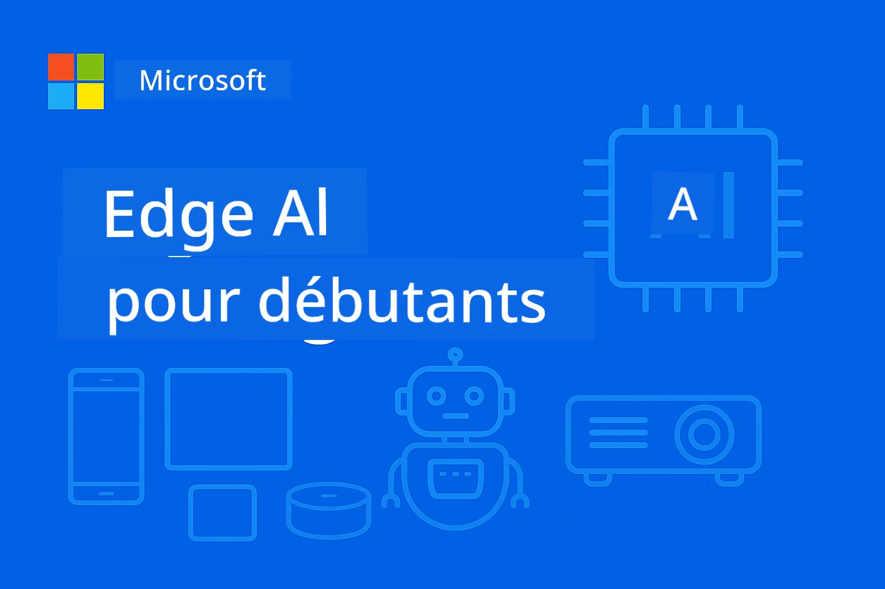

# EdgeAI pour Débutants 




[](https://GitHub.com/microsoft/edgeai-for-beginners/graphs/contributors)
[](https://GitHub.com/microsoft/edgeai-for-beginners/issues)
[](https://GitHub.com/microsoft/edgeai-for-beginners/pulls)
[](http://makeapullrequest.com)

[](https://GitHub.com/microsoft/edgeai-for-beginners/watchers)
[](https://GitHub.com/microsoft/edgeai-for-beginners/fork)
[](https://GitHub.com/microsoft/edgeai-for-beginners/stargazers)


[](https://discord.gg/nTYy5BXMWG)

Suivez ces étapes pour commencer à utiliser ces ressources :

1. **Forkez le dépôt** : Cliquez sur [](https://GitHub.com/microsoft/edgeai-for-beginners/fork)
2. **Clonez le dépôt** :   `git clone https://github.com/microsoft/edgeai-for-beginners.git`
3. [**Rejoignez le Discord Azure AI Foundry et rencontrez des experts ainsi que d’autres développeurs**](https://discord.com/invite/ByRwuEEgH4)


### 🌐 Support Multilingue

#### Pris en charge via GitHub Action (Automatisé & Toujours à Jour)

<!-- CO-OP TRANSLATOR LANGUAGES TABLE START -->
[Arabic](../ar/README.md) | [Bengali](../bn/README.md) | [Bulgarian](../bg/README.md) | [Burmese (Myanmar)](../my/README.md) | [Chinese (Simplified)](../zh-CN/README.md) | [Chinese (Traditional, Hong Kong)](../zh-HK/README.md) | [Chinese (Traditional, Macau)](../zh-MO/README.md) | [Chinese (Traditional, Taiwan)](../zh-TW/README.md) | [Croatian](../hr/README.md) | [Czech](../cs/README.md) | [Danish](../da/README.md) | [Dutch](../nl/README.md) | [Estonian](../et/README.md) | [Finnish](../fi/README.md) | [French](./README.md) | [German](../de/README.md) | [Greek](../el/README.md) | [Hebrew](../he/README.md) | [Hindi](../hi/README.md) | [Hungarian](../hu/README.md) | [Indonesian](../id/README.md) | [Italian](../it/README.md) | [Japanese](../ja/README.md) | [Kannada](../kn/README.md) | [Khmer](../km/README.md) | [Korean](../ko/README.md) | [Lithuanian](../lt/README.md) | [Malay](../ms/README.md) | [Malayalam](../ml/README.md) | [Marathi](../mr/README.md) | [Nepali](../ne/README.md) | [Nigerian Pidgin](../pcm/README.md) | [Norwegian](../no/README.md) | [Persian (Farsi)](../fa/README.md) | [Polish](../pl/README.md) | [Portuguese (Brazil)](../pt-BR/README.md) | [Portuguese (Portugal)](../pt-PT/README.md) | [Punjabi (Gurmukhi)](../pa/README.md) | [Romanian](../ro/README.md) | [Russian](../ru/README.md) | [Serbian (Cyrillic)](../sr/README.md) | [Slovak](../sk/README.md) | [Slovenian](../sl/README.md) | [Spanish](../es/README.md) | [Swahili](../sw/README.md) | [Swedish](../sv/README.md) | [Tagalog (Filipino)](../tl/README.md) | [Tamil](../ta/README.md) | [Telugu](../te/README.md) | [Thai](../th/README.md) | [Turkish](../tr/README.md) | [Ukrainian](../uk/README.md) | [Urdu](../ur/README.md) | [Vietnamese](../vi/README.md)

> **Vous préférez cloner localement ?**
>
> Ce dépôt comprend plus de 50 traductions linguistiques, ce qui augmente significativement la taille du téléchargement. Pour cloner sans les traductions, utilisez le sparse checkout :
>
> **Bash / macOS / Linux :**
> ```bash
> git clone --filter=blob:none --sparse https://github.com/microsoft/edgeai-for-beginners.git
> cd edgeai-for-beginners
> git sparse-checkout set --no-cone '/*' '!translations' '!translated_images'
> ```
>
> **CMD (Windows) :**
> ```cmd
> git clone --filter=blob:none --sparse https://github.com/microsoft/edgeai-for-beginners.git
> cd edgeai-for-beginners
> git sparse-checkout set --no-cone "/*" "!translations" "!translated_images"
> ```
>
> Cela vous fournit tout ce dont vous avez besoin pour compléter le cours avec un téléchargement beaucoup plus rapide.
<!-- CO-OP TRANSLATOR LANGUAGES TABLE END -->

**Si vous souhaitez que des langues supplémentaires soient prises en charge, elles sont listées [ici](https://github.com/Azure/co-op-translator/blob/main/getting_started/supported-languages.md)**
## Introduction

Bienvenue dans **EdgeAI pour Débutants** – votre parcours complet dans le monde transformateur de l'Intelligence Artificielle en périphérie (Edge). Ce cours comble le fossé entre des capacités d’IA puissantes et le déploiement pratique et réel sur des dispositifs Edge, vous permettant d'exploiter le potentiel de l’IA directement là où les données sont générées et où les décisions doivent être prises.

### Ce que vous maîtriserez

Ce cours vous conduit des concepts fondamentaux jusqu’aux implémentations prêtes pour la production, couvrant :
- **Petits Modèles de Langage (SLM)** optimisés pour le déploiement en périphérie
- **Optimisation consciente du matériel** sur diverses plateformes
- **Inférence en temps réel** avec capacités de préservation de la vie privée
- **Stratégies de déploiement en production** pour applications d’entreprise

### Pourquoi EdgeAI est important

Edge AI représente un changement de paradigme qui répond aux défis modernes cruciaux :
- **Confidentialité & Sécurité** : Traitez les données sensibles localement sans exposition au cloud
- **Performance en temps réel** : Éliminez la latence réseau pour les applications critiques en temps
- **Efficacité des coûts** : Réduisez la bande passante et les dépenses informatiques cloud
- **Fonctionnement résilient** : Maintenez la fonctionnalité en cas de coupures réseau
- **Conformité réglementaire** : Répondez aux exigences de souveraineté des données

### Edge AI

Edge AI désigne l’exécution d’algorithmes IA et de modèles de langage localement sur le matériel, proche du lieu où les données sont générées, sans recourir aux ressources cloud pour l’inférence. Cela réduit la latence, améliore la confidentialité et permet la prise de décisions en temps réel.

### Principes clés :
- **Inférence sur appareil** : Les modèles IA fonctionnent sur des dispositifs Edge (téléphones, routeurs, microcontrôleurs, PC industriels)
- **Capacité hors ligne** : Fonctionne sans connexion Internet persistante
- **Faible latence** : Réponses immédiates adaptées aux systèmes en temps réel
- **Souveraineté des données** : Conserve les données sensibles localement, améliorant sécurité et conformité

### Petits Modèles de Langage (SLM)

Les SLM tels que Phi-4, Mistral-7B, et Gemma sont des versions optimisées de grands LLM — entraînés ou distillés pour :
- **Empreinte mémoire réduite** : Usage efficace de la mémoire limitée des appareils Edge
- **Demandes de calcul réduites** : Optimisés pour la performance CPU et GPU périphériques
- **Temps de démarrage plus rapides** : Initialisation rapide pour des applications réactives

Ils débloquent des capacités NLP puissantes tout en respectant les contraintes de :
- **Systèmes embarqués** : Appareils IoT et contrôleurs industriels
- **Appareils mobiles** : Smartphones et tablettes avec capacités hors ligne
- **Appareils IoT** : Capteurs et dispositifs intelligents aux ressources limitées
- **Serveurs Edge** : Unités de traitement locales avec ressources GPU limitées
- **Ordinateurs personnels** : Scénarios de déploiement sur bureau et portable

## Modules du Cours & Navigation

| Module | Sujet | Domaine d’Intérêt | Contenu Clé | Niveau | Durée |
|--------|-------|-------------------|-------------|--------|-------|
| [📖 00 ](./introduction.md) | [Introduction à EdgeAI](./introduction.md) | Fondations & Contexte | Vue d’ensemble d’EdgeAI • Applications industrielles • Introduction aux SLM • Objectifs d’apprentissage | Débutant | 1-2 hrs |
| [📚 01](../../Module01) | [Fondamentaux EdgeAI](./Module01/README.md) | Comparaison Cloud vs Edge AI | Fondamentaux EdgeAI • Études de cas réelles • Guide d’implémentation • Déploiement Edge | Débutant | 3-4 hrs |
| [🧠 02](../../Module02) | [Fondements des Modèles SLM](./Module02/README.md) | Familles & architecture de modèles | Famille Phi • Famille Qwen • Famille Gemma • BitNET • μModel • Phi-Silica | Débutant | 4-5 hrs |
| [🚀 03](../../Module03) | [Pratique de Déploiement SLM](./Module03/README.md) | Déploiement local & cloud | Apprentissage avancé • Environnement local • Déploiement cloud | Intermédiaire | 4-5 hrs |
| [⚙️ 04](../../Module04) | [Boîte à outils d’Optimisation de Modèle](./Module04/README.md) | Optimisation multiplateforme | Introduction • Llama.cpp • Microsoft Olive • OpenVINO • Apple MLX • Synthèse du workflow | Intermédiaire | 5-6 hrs |
| [🔧 05](../../Module05) | [Production SLMOps](./Module05/README.md) | Opérations en production | Introduction SLMOps • Distillation de modèles • Affinage • Déploiement en production | Avancé | 5-6 hrs |
| [🤖 06](../../Module06) | [Agents IA & Appel de Fonction](./Module06/README.md) | Cadres d’agents & MCP | Introduction aux agents • Appel de fonction • Protocole de contexte de modèle | Avancé | 4-5 hrs |
| [💻 07](../../Module07) | [Implémentation de Plateforme](./Module07/README.md) | Échantillons multiplateformes | Outils IA • Foundry Local • Développement Windows | Avancé | 3-4 hrs |
| [🏭 08](../../Module08) | [Boîte à outils Foundry Local](./Module08/README.md) | Échantillons prêts pour production | Applications exemples (voir détails ci-dessous) | Expert | 8-10 hrs |

### 🏭 **Module 08 : Applications exemples**

- [01 : Démarrage rapide REST Chat](./Module08/samples/01/README.md)
- [02 : Intégration SDK OpenAI](./Module08/samples/02/README.md)
- [03 : Découverte & Benchmarking de modèle](./Module08/samples/03/README.md)
- [04 : Application Chainlit RAG](./Module08/samples/04/README.md)
- [05 : Orchestration Multi-agent](./Module08/samples/05/README.md)
- [06 : Routeur Models-as-Tools](./Module08/samples/06/README.md)
- [07 : Client API direct](./Module08/samples/07/README.md)
- [08 : Application Chat Windows 11](./Module08/samples/08/README.md)
- [09 : Système Multi-agent Avancé](./Module08/samples/09/README.md)
- [10 : Framework Foundry Tools](./Module08/samples/10/README.md)

### 🎓 **Atelier : Parcours d’apprentissage pratique**

Matériel d’atelier complet avec implémentations prêtes pour la production :

- **[Guide de l’atelier](./Workshop/Readme.md)** - Objectifs d’apprentissage complets, résultats et navigation des ressources
- **Exemples Python** (6 sessions) - Mis à jour avec meilleures pratiques, gestion des erreurs, et documentation complète
- **Notebooks Jupyter** (8 interactifs) - Tutoriels pas à pas avec benchmarks et suivi des performances
- **Guides de session** - Guides markdown détaillés pour chaque session d’atelier
- **Outils de validation** - Scripts pour vérifier la qualité du code et exécuter des tests de validation

**Ce que vous construirez :**
- Applications de chat IA locales avec support de streaming
- Pipelines RAG avec évaluation de qualité (RAGAS)
- Outils de benchmark et comparaison multi-modèle
- Systèmes d’orchestration multi-agent
- Routage intelligent de modèles avec sélection basée sur les tâches

### 🎙️ **Atelier pour Agentic : Pratique - Le Studio Podcast IA**
Construisez une chaîne de production de podcasts alimentée par l’IA de A à Z ! Cet atelier immersif vous apprend à créer un système multi-agents complet qui transforme des idées en épisodes de podcast professionnels.

**[🎬 Démarrez l’atelier AI Podcast Studio](./WorkshopForAgentic/README.md)**

**Votre mission** : Lancez "Future Bytes" — un podcast tech entièrement animé par des agents IA que vous construirez vous-même. Pas de dépendance au cloud, pas de coûts d’API — tout fonctionne localement sur votre machine.

**Ce qui rend cet atelier unique :**
- **🤖 Orchestration multi-agents réelle** — Construisez des agents IA spécialisés qui recherchent, écrivent et produisent de l’audio
- **🎯 Chaîne de production complète** — De la sélection du sujet à la sortie finale audio du podcast
- **💻 Déploiement 100% local** — Utilise Ollama et des modèles locaux (Qwen-3-8B) pour une confidentialité et un contrôle complets
- **🎤 Intégration Text-to-Speech** — Transformez des scripts en conversations multi-intervenants au son naturel
- **✋ Flux de travail avec validation humaine** — Des étapes d’approbation garantissent la qualité tout en maintenant l’automatisation

**Parcours d’apprentissage en trois actes :**

| Acte | Focus | Compétences principales | Durée |
|-----|-------|------------|----------|
| **[Acte 1 : Rencontrez vos assistants IA](./WorkshopForAgentic/md/01.BuildAIAgentWithSLM.md)** | Construisez votre premier agent IA | Intégration d’outils • Recherche web • Résolution de problèmes • Raisonnement agentique | 2-3 h |
| **[Acte 2 : Assemblez votre équipe de production](./WorkshopForAgentic/md/02.AIAgentOrchestrationAndWorkflows.md)** | Orchestration de plusieurs agents | Coordination d’équipe • Flux de validation • Interface DevUI • Supervision humaine | 3-4 h |
| **[Acte 3 : Donnez vie à votre podcast](./WorkshopForAgentic/md/03.Multi-SpeakerPodcastGenerationWithVibeVoice.md)** | Génération audio du podcast | Synthèse vocale • Synthèse multi-intervenants • Audio longue durée • Automatisation complète | 2-3 h |

**Technologies utilisées :**
- **Microsoft Agent Framework** — Orchestration et coordination multi-agents
- **Ollama** — Exécution locale de modèles IA (sans cloud)
- **Qwen-3-8B** — Modèle de langage open source optimisé pour les tâches agentiques
- **API Text-to-Speech** — Synthèse vocale naturelle pour la génération de podcasts

**Prise en charge matérielle :**
- ✅ **Mode CPU** — Fonctionne sur tout ordinateur moderne (8 Go+ RAM recommandé)
- 🚀 **Accélération GPU** — Inférence beaucoup plus rapide avec GPU NVIDIA/AMD
- ⚡ **Support NPU** — Accélération par unité de traitement neuronal nouvelle génération

**Idéal pour :**
- Développeurs apprenant les systèmes IA multi-agents
- Toute personne intéressée par l’automatisation IA et les flux de travail
- Créateurs de contenu explorant la production assistée par IA
- Étudiants étudiant les modèles pratiques d’orchestration IA

**Commencez à construire** : [🎙️ Atelier AI Podcast Studio →](./WorkshopForAgentic/README.md)

### 📊 **Résumé du parcours d’apprentissage**
- **Durée totale** : 36-45 heures
- **Parcours débutant** : Modules 01-02 (7-9 heures)  
- **Parcours intermédiaire** : Modules 03-04 (9-11 heures)
- **Parcours avancé** : Modules 05-07 (12-15 heures)
- **Parcours expert** : Module 08 (8-10 heures)

## Ce que vous allez construire

### 🎯 Compétences clés
- **Architecture Edge AI** : Concevoir des systèmes IA locaux privilégiés avec intégration cloud
- **Optimisation des modèles** : Quantifiez et compressez les modèles pour le déploiement en périphérie (gain de vitesse de 85 %, réduction de taille de 75 %)
- **Déploiement multi-plateforme** : Windows, mobile, embarqué et systèmes hybrides cloud-edge
- **Opérations de production** : Surveillance, montée en charge et maintenance de l’IA en périphérie en production

### 🏗️ Projets pratiques
- **Applications Foundry Local Chat** : Application native Windows 11 avec commutation de modèles
- **Systèmes multi-agents** : Coordinateur avec agents spécialisés pour des flux complexes  
- **Applications RAG** : Traitement local de documents avec recherche vectorielle
- **Routeurs de modèles** : Sélection intelligente entre modèles selon l’analyse des tâches
- **Frameworks API** : Clients prêts pour la production avec streaming et surveillance de santé
- **Outils multi-plateformes** : Modèles d’intégration LangChain/Semantic Kernel

### 🏢 Applications industrielles
**Fabrication** • **Santé** • **Véhicules autonomes** • **Villes intelligentes** • **Applications mobiles**

## Démarrage rapide

**Parcours d’apprentissage recommandé** (20-30 heures au total) :

0. **📖 Introduction** ([Introduction.md](./introduction.md)) : Fondations EdgeAI + contexte industriel + cadre d’apprentissage  
1. **📚 Fondations** (Modules 01-02) : Concepts EdgeAI + familles de modèles SLM  
2. **⚙️ Optimisation** (Modules 03-04) : Déploiement + cadres de quantification  
3. **🚀 Production** (Modules 05-06) : SLMOps + agents IA + appel de fonctions  
4. **💻 Implémentation** (Modules 07-08) : Exemples de plateformes + boîte à outils Foundry Local

Chaque module inclut théorie, exercices pratiques et exemples de code prêts pour la production.

## Impact sur la carrière

**Rôles techniques** : Architecte solutions EdgeAI • Ingénieur ML (Edge) • Développeur AI IoT • Développeur IA mobile

**Secteurs industriels** : Fabrication 4.0 • Technologies de santé • Systèmes autonomes • FinTech • Électronique grand public

**Projets portfolio** : Systèmes multi-agents • Applications RAG en production • Déploiement multi-plateformes • Optimisation des performances

## Structure du dépôt

```
edgeai-for-beginners/
├── 📖 introduction.md  # Foundation: EdgeAI Overview & Learning Framework
├── 📚 Module01-04/     # Fundamentals → SLMs → Deployment → Optimization  
├── 🔧 Module05-06/     # SLMOps → AI Agents → Function Calling
├── 💻 Module07/        # Platform Samples (VS Code, Windows, Jetson, Mobile)
├── 🏭 Module08/        # Foundry Local Toolkit + 10 Comprehensive Samples
│   ├── samples/01-06/  # Foundation: REST, SDK, RAG, Agents, Routing
│   └── samples/07-10/  # Advanced: API Client, Windows App, Enterprise Agents, Tools
├── 🌐 translations/    # Multi-language support (8+ languages)
└── 📋 STUDY_GUIDE.md   # Structured learning paths & time allocation
```

## Points forts du cours

✅ **Apprentissage progressif** : Théorie → Pratique → Déploiement en production  
✅ **Études de cas réelles** : Microsoft, Japan Airlines, mises en œuvre d’entreprise  
✅ **Exemples pratiques** : Plus de 50 exemples, 10 démonstrations complètes Foundry Local  
✅ **Focus performance** : Amélioration de vitesse de 85 %, réduction de taille de 75 %  
✅ **Multi-plateforme** : Windows, mobile, embarqué, hybride cloud-edge  
✅ **Prêt pour la production** : Surveillance, montée en charge, sécurité, cadres de conformité

📖 **[Guide d’étude disponible](STUDY_GUIDE.md)** : Parcours d’apprentissage structuré de 20 heures avec conseils de gestion du temps et outils d’auto-évaluation.

---

**EdgeAI représente l’avenir du déploiement IA** : local-first, respectant la vie privée et efficace. Maîtrisez ces compétences pour construire la prochaine génération d’applications intelligentes.

## Autres cours

Notre équipe produit d’autres cours ! Découvrez :

<!-- CO-OP TRANSLATOR OTHER COURSES START -->
### LangChain
[](https://aka.ms/langchain4j-for-beginners)
[](https://aka.ms/langchainjs-for-beginners?WT.mc_id=m365-94501-dwahlin)
[](https://github.com/microsoft/langchain-for-beginners?WT.mc_id=m365-94501-dwahlin)
---

### Azure / Edge / MCP / Agents
[](https://github.com/microsoft/AZD-for-beginners?WT.mc_id=academic-105485-koreyst)
[](https://github.com/microsoft/edgeai-for-beginners?WT.mc_id=academic-105485-koreyst)
[](https://github.com/microsoft/mcp-for-beginners?WT.mc_id=academic-105485-koreyst)
[](https://github.com/microsoft/ai-agents-for-beginners?WT.mc_id=academic-105485-koreyst)

---
 
### Série IA générative
[](https://github.com/microsoft/generative-ai-for-beginners?WT.mc_id=academic-105485-koreyst)
[-9333EA?style=for-the-badge&labelColor=E5E7EB&color=9333EA)](https://github.com/microsoft/Generative-AI-for-beginners-dotnet?WT.mc_id=academic-105485-koreyst)
[-C084FC?style=for-the-badge&labelColor=E5E7EB&color=C084FC)](https://github.com/microsoft/generative-ai-for-beginners-java?WT.mc_id=academic-105485-koreyst)
[-E879F9?style=for-the-badge&labelColor=E5E7EB&color=E879F9)](https://github.com/microsoft/generative-ai-with-javascript?WT.mc_id=academic-105485-koreyst)

---
 
### Apprentissage fondamental
[](https://aka.ms/ml-beginners?WT.mc_id=academic-105485-koreyst)
[](https://aka.ms/datascience-beginners?WT.mc_id=academic-105485-koreyst)
[](https://aka.ms/ai-beginners?WT.mc_id=academic-105485-koreyst)
[](https://github.com/microsoft/Security-101?WT.mc_id=academic-96948-sayoung)
[](https://aka.ms/webdev-beginners?WT.mc_id=academic-105485-koreyst)
[](https://aka.ms/iot-beginners?WT.mc_id=academic-105485-koreyst)
[](https://github.com/microsoft/xr-development-for-beginners?WT.mc_id=academic-105485-koreyst)

---
 
### Série Copilot

[](https://aka.ms/GitHubCopilotAI?WT.mc_id=academic-105485-koreyst)
[](https://github.com/microsoft/mastering-github-copilot-for-dotnet-csharp-developers?WT.mc_id=academic-105485-koreyst)
[](https://github.com/microsoft/CopilotAdventures?WT.mc_id=academic-105485-koreyst)
<!-- CO-OP TRANSLATOR OTHER COURSES END -->

## Obtenir de l’aide

Si vous êtes bloqué ou si vous avez des questions sur la création d’applications IA, rejoignez :

[](https://discord.gg/nTYy5BXMWG)

Si vous avez des retours sur le produit ou des erreurs lors du développement, visitez :

[](https://aka.ms/foundry/forum)

---

<!-- CO-OP TRANSLATOR DISCLAIMER START -->
**Clause de non-responsabilité** :  
Ce document a été traduit à l’aide du service de traduction IA [Co-op Translator](https://github.com/Azure/co-op-translator). Bien que nous nous efforcions d’assurer l’exactitude, veuillez noter que les traductions automatiques peuvent contenir des erreurs ou des inexactitudes. Le document original dans sa langue native doit être considéré comme la source faisant foi. Pour les informations critiques, une traduction professionnelle humaine est recommandée. Nous déclinons toute responsabilité en cas de malentendus ou de mauvaises interprétations découlant de l’utilisation de cette traduction.
<!-- CO-OP TRANSLATOR DISCLAIMER END -->