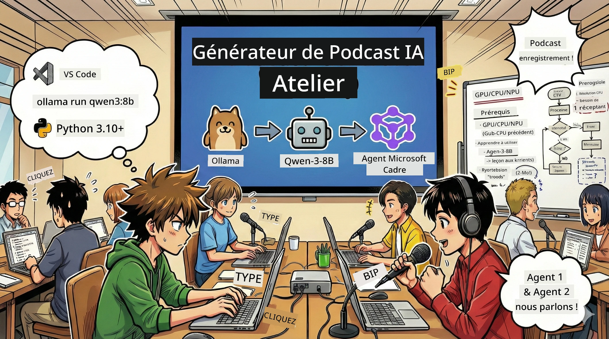
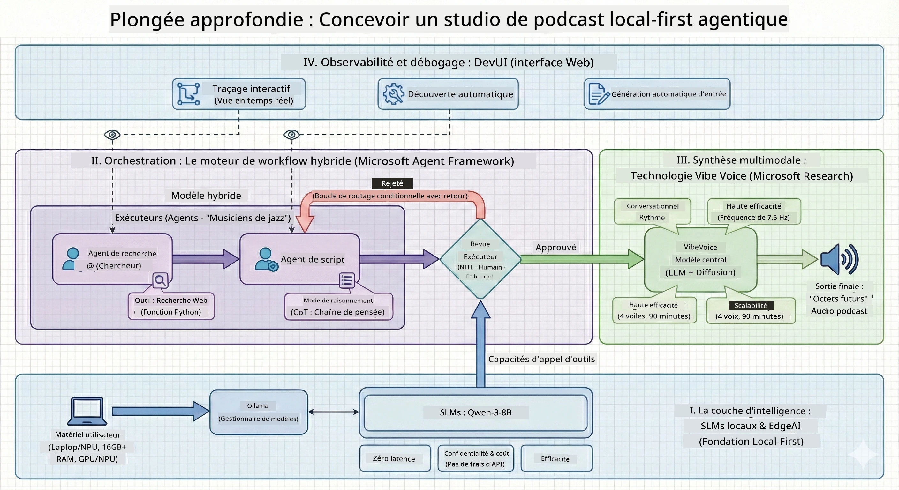

<!--
CO_OP_TRANSLATOR_METADATA:
{
  "original_hash": "f94e745264597bc5d8df967ead2eff97",
  "translation_date": "2026-01-05T10:18:50+00:00",
  "source_file": "WorkshopForAgentic/README.md",
  "language_code": "fr"
}
-->
# 🎙️ L’Atelier The AI Podcast Studio

> 🌏 [中文版 (Version chinoise)](translation/zh-cn/README.md)



## Votre Mission

Bienvenue dans **The AI Podcast Studio** ! Vous êtes sur le point de lancer votre propre podcast tech appelé « Future Bytes » — mais voici le twist : vous allez construire une équipe de production alimentée par l’IA pour vous aider à le créer. Fini les heures interminables de recherche, d’écriture de scripts et de montage audio. À la place, vous programmerez votre chemin pour devenir un producteur de podcast avec des superpouvoirs IA.

## L’Histoire

Imaginez ceci : Vous et vos amis voulez lancer un podcast sur les tendances tech les plus cool, mais tout le monde est occupé avec l’école, le travail ou juste la vie. Et si vous pouviez construire une équipe d’agents IA pour faire le gros du travail ? Un agent fait des recherches sur les sujets, un autre écrit des scripts captivants, et un troisième transforme le texte en conversations naturelles. Ça ressemble à de la science-fiction ? Rendons cela réel.

## Ce Que Vous Apprendrez

À la fin de cet atelier, vous saurez comment :
- 🤖 Déployer votre propre modèle IA local (pas de coût API, pas de dépendance au cloud !)
- 🔧 Construire des agents IA spécialisés qui fonctionnent réellement ensemble
- 🎬 Créer une chaîne complète de production de podcast de l’idée à l’audio

## Votre Parcours : Trois Actes



Comme toute bonne histoire, nous avons trois actes. Chacun construit votre studio de podcast IA pièce par pièce :

| Épisode | Votre Quête | Ce Qui Se Passe | Compétences Débloquées |
|---------|-------------|-----------------|------------------------|
| **Acte 1** | [Rencontrez Vos Assistants IA](md/01.BuildAIAgentWithSLM.md) | Vous découvrez comment créer des agents IA capables de discuter, de chercher sur le web et même de résoudre des problèmes. Pensez à eux comme vos stagiaires en recherche qui ne dorment jamais. | 🎯 Construire votre premier agent<br>🛠️ Lui donner des superpouvoirs (outils!)<br>🧠 Lui apprendre à penser<br>🌐 Le connecter à Internet |
| **Acte 2** | [Assemblez Votre Équipe de Production](md/02.AIAgentOrchestrationAndWorkflows.md) | Là, ça devient intéressant ! Vous allez orchestrer plusieurs agents IA pour travailler ensemble comme une vraie équipe de podcast. L’un fait des recherches, un écrit, vous approuvez — le travail d’équipe fait marcher le rêve. | 🎭 Coordonner plusieurs agents<br>🔄 Construire des flux d’approbation<br>🖥️ Tester avec l’interface DevUI<br>✋ Garder les humains aux commandes |
| **Acte 3** | [Donnez Vie à Votre Podcast](md/03.Multi-SpeakerPodcastGenerationWithVibeVoice.md) | Le final ! Transformez vos scripts textes en audio de podcast réel avec des voix réalistes et des conversations naturelles. Votre podcast « Future Bytes » est prêt à être diffusé ! | 🎤 Magie du texte-vers-la-voix<br>👥 Voix multiples de locuteurs<br>⏱️ Audio longue durée<br>🚀 Automatisation complète |

Chaque acte débloque de nouvelles capacités. Avancez si vous êtes courageux, mais nous recommandons de suivre l’histoire !

## Exigences Environnementales

Cet atelier supporte plusieurs environnements matériels :
- **CPU** : Convient pour tester et usage à petite échelle
- **GPU** : Recommandé pour la production, améliore significativement la vitesse d’inférence
- **NPU** : Supporte l’accélération des unités de traitement neuronal de nouvelle génération

## Ce Dont Vous Aurez Besoin

### Checklist Logiciels ✅
- **Python 3.10+** (votre langage de programmation)
- **Ollama** (exécute les modèles IA sur votre machine)
- **VS Code** (votre éditeur de code)
- **Extension Python** (rend VS Code plus intelligent)
- **Git** (pour récupérer le code)

### Vérification Matérielle 💻
- **Puis-je lancer ça ?** : 8 Go de RAM, 10 Go d’espace libre (fonctionne, mais peut être lent)
- **Configuration idéale** : 16 Go+ de RAM, un GPU correct (fluide !)
- **Vous avez un NPU ?** : Encore mieux ! Performances de nouvelle génération déverrouillées 🚀

## Configurez Votre Studio 🎬

### Étape 1 : Boost Python

Assurez-vous d’avoir Python 3.10 ou plus récent :

```bash
python --version
# Doit afficher Python 3.10.x ou une version supérieure
```

Pas de Python ? Téléchargez-le depuis [python.org](https://python.org) — c’est gratuit !

### Étape 2 : Obtenez Ollama (Votre moteur de modèles IA)

Rendez-vous sur [ollama.ai](https://ollama.ai) et téléchargez Ollama pour votre OS. Pensez-y comme au moteur qui fait tourner vos modèles IA localement.

Vérifiez qu’il est prêt :

```bash
ollama --version
```

### Étape 3 : Téléchargez Votre Cerveau IA 🧠

Il est temps de récupérer le modèle Qwen-3-8B (c’est comme recruter votre premier assistant IA) :

```bash
ollama pull qwen3:8b
```

*Cela peut prendre quelques minutes. Parfait pour une pause café ! ☕*

### Étape 4 : Configurez VS Code

Téléchargez [Visual Studio Code](https://code.visualstudio.com/) si vous ne l’avez pas. C’est le meilleur éditeur de code (venez me dire le contraire 😄).

### Étape 5 : Extension Python

Dans VS Code :
1. Appuyez sur `Ctrl+Shift+X` (ou `Cmd+Shift+X` sur Mac)
2. Recherchez « Python »
3. Installez l’extension officielle Microsoft Python

### Étape 6 : Vous Êtes Prêt ! 🎉

Sérieusement, vous êtes prêt à démarrer. Construisons un peu de magie IA !

### Étape 7 : Installez Microsoft Agent Framework et les Packages Associés 📦

Installez toutes les dépendances nécessaires à l’atelier :

```bash
pip install -r ./Installations/requirements.txt -U
```

*Cela installera Microsoft Agent Framework et tous les packages requis. Prenez un café — la première installation peut prendre quelques minutes ! ☕*

## Instructions de l’Atelier

La structure détaillée du projet, les étapes de configuration et les méthodes d’exécution vous seront expliquées pas à pas pendant l’atelier.

## Dépannage (Quand ça Ne Marche Pas) 🔧

### « Argh, le téléchargement du modèle prend une éternité ! »
**Solution** : Utilisez un VPN ou configurez Ollama avec une source miroir. Parfois Internet nous fait des misères.

### « Mon ordinateur rame ! Plus de mémoire ! »
**Solution** : Passez à un modèle plus petit ou ajustez le paramètre `num_ctx` pour utiliser moins de mémoire. Pensez-y comme un régime pour votre IA.

### « Puis-je accélérer ça avec mon GPU ? »
**Solution** : Ollama détecte automatiquement les GPU ! Assurez-vous juste que vos pilotes GPU sont à jour. Turbo gratuit ! 🏎️

## Ressources Supplémentaires (Pour les Curieux) 📚

- [Docs Ollama](https://github.com/ollama/ollama) — Plongée profonde dans les modèles IA locaux
- [Microsoft Agent Framework](https://microsoft.github.io/autogen/) — En savoir plus sur la création d’équipes d’agents
- [Info Modèle Qwen](https://qwenlm.github.io/) — Faites connaissance avec le cerveau de votre assistant IA

## Licence

Licence MIT — Créez des trucs cools, partagez-les, rendez le monde meilleur ! 🌍

## Envie de Contribuer ?

Vous avez trouvé un bug ? Une idée ? Ouvrez une Issue ou un PR ! On adore la communauté. ✨

---

<!-- CO-OP TRANSLATOR DISCLAIMER START -->
**Avertissement** :  
Ce document a été traduit à l’aide du service de traduction automatique [Co-op Translator](https://github.com/Azure/co-op-translator). Bien que nous fassions de notre mieux pour garantir l’exactitude, veuillez noter que les traductions automatiques peuvent contenir des erreurs ou des inexactitudes. Le document original dans sa langue d’origine doit être considéré comme la source faisant foi. Pour des informations critiques, une traduction humaine professionnelle est recommandée. Nous déclinons toute responsabilité pour tout malentendu ou mauvaise interprétation résultant de l’utilisation de cette traduction.
<!-- CO-OP TRANSLATOR DISCLAIMER END -->