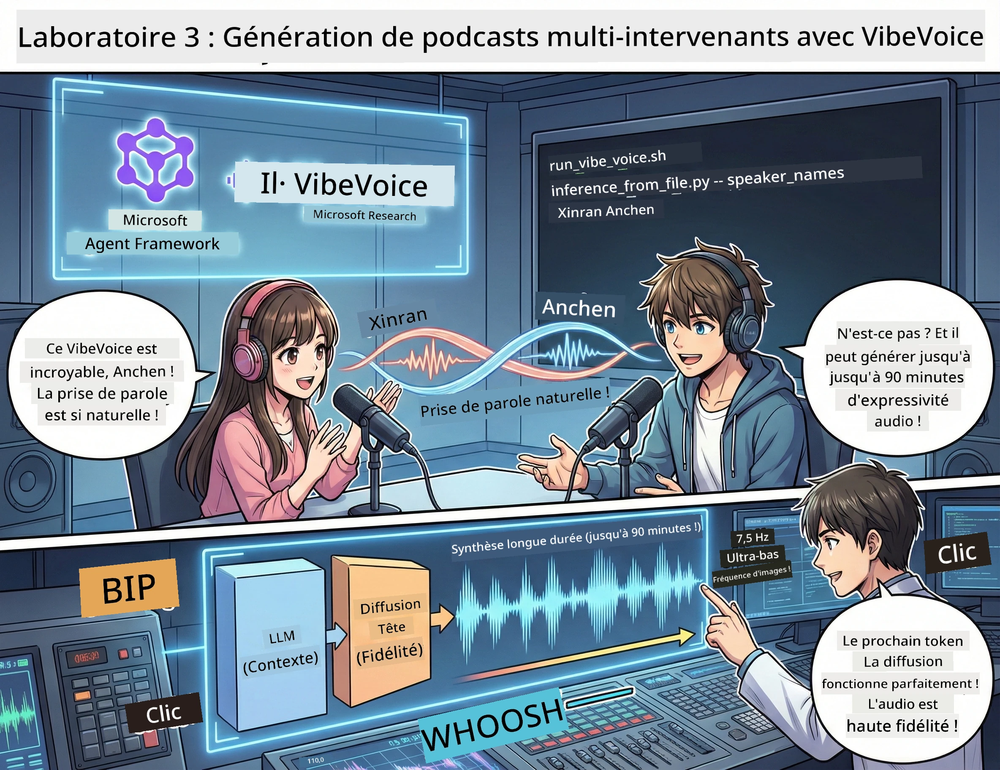

# Acte 3 : Donnez vie à votre podcast 🎤



## Le grand final

Vous avez recherché des sujets. Vous avez écrit des scripts. Maintenant, la cerise sur le gâteau : transformer votre texte en audio de podcast réel avec des voix réalistes !

Voici **VibeVoice** — la magie TTS (text-to-speech) open source de Microsoft Research qui crée :
- 🎭 Des conversations au son naturel
- 👥 Plusieurs intervenants (jusqu’à 4 !)
- ⏱️ De l’audio longue durée (jusqu’à 90 minutes !)
- 🎵 Une interprétation expressive (pas des voix robotiques !)

C’est la technologie derrière les podcasts synthétiques. Créons le vôtre !

## Qu’est-ce que VibeVoice ? (La partie cool)

VibeVoice est le cadeau de Microsoft Research au monde. Il est spécialement conçu pour l’audio conversationnel de style podcast.

### Pourquoi c’est génial 🔥

* **⏱️ Sessions marathon** : Génère jusqu’à 90 minutes de parole continue (c’est un épisode complet de podcast !)
* **👥 Magie multi-intervenants** : Jusqu’à 4 voix différentes avec des personnalités cohérentes
* **⚡ Ultra efficace** : Utilise un taux d’images ultra-bas de 7,5 Hz pour économiser la puissance de calcul
* **🧠 Audio intelligent** : Combine un LLM (comprend le contexte) avec un modèle de diffusion (crée un audio réaliste)
* **🎭 Flux naturel** : Gère automatiquement les prises de parole, pauses et rythmes conversationnels

**En résumé** : VibeVoice ne fait pas que lire votre script — il *l’interprète* comme de vraies personnes qui parlent.

---

## Avant de commencer 🚀

**Ce dont vous avez besoin** :

* 🐍 **Python 3.10+** (vous l’avez déjà depuis les Actes 1 & 2)
* 🚀 **uv** (un gestionnaire de paquets Python rapide — on va l’installer)
* 📝 **Votre script** : Le fichier `podcast.txt` de l’Acte 2 (dans `../03.Application/`)

**Astuce pro** : Cette étape nécessite une bonne connexion internet pour télécharger le modèle pré-entraîné. Prenez un café ! ☕

---

## C’est parti ! La méthode facile 🎬

Nous avons rendu cela très simple. Un script shell fait tout.

### Le processus

1. **Rendez-le exécutable** :
```bash
chmod +x run_vibe_voice.sh
```

2. **Lancez-le** :
```bash
./run_vibe_voice.sh
```

3. **Attendez la magie** (cela peut prendre quelques minutes lors du premier lancement)

### Ce qui se passe en coulisses 🎭

Le script est en fait votre ingénieur du son automatisé :

1. **📥 Télécharge VibeVoice** : Clone le dépôt officiel sur GitHub
2. **📦 Installe les dépendances** : Utilise `uv pip` pour une installation ultra-rapide des paquets
3. **🎬 Génère l’audio** : Exécute le script d’inférence avec :
   * `--model_path` : Le modèle pré-entraîné VibeVoice-7B
   * `--txt_path` : Votre script `podcast.txt`
   * `--speaker_names` : Attribue les voix (par défaut Xinran & Anchen)

**Résultat** : Votre script devient un vrai épisode de podcast ! 🎉

---

## Votre mission 🎯

Rendons ça intéressant :

### Tâche 1 : Créez du contenu
Modifiez `../03.Application/podcast.txt` avec une conversation entre deux personnes. Que ce soit sur la tech, les loisirs, peu importe ! Faites-le simplement conversationnel.

**Exemple de format** :
```
Speaker 1: Hey! Did you hear about the new AI model?
Speaker 2: No way! Tell me more!
Speaker 1: It's called...
```

### Tâche 2 : Générez l’audio
Lancez le script et regardez la magie opérer. La première fois prendra plus de temps (téléchargement du modèle).

### Tâche 3 : Écoutez & analysez
- Est-ce que ça sonne naturel ?
- Les intervenants ont-ils des voix distinctes ?
- La prise de parole est-elle fluide ?
- Y a-t-il des moments robotiques ?

### Tâche 4 : Expérimentez (pour les courageux)
Modifiez `run_vibe_voice.sh` et changez `--speaker_names` pour essayer différentes combinaisons de voix. VibeVoice dispose de plusieurs voix pré-entraînées !

**Défi bonus** : Essayez une conversation à 3 intervenants ! 🎆

---

## En savoir plus 📚

* **🏠 Page d’accueil du projet** : [Site officiel de VibeVoice](https://microsoft.github.io/VibeVoice/)
* **🤗 Modèle pré-entraîné** : [Hugging Face - VibeVoice-7B](https://huggingface.co/vibevoice/VibeVoice-7B)
* **📖 Article de recherche** : Plongez dans la technologie (si ça vous intéresse)

> **⚠️ Rappel IA responsable** : VibeVoice est puissant. Utilisez-le éthiquement ! Ne créez pas de deepfakes ou de contenus trompeurs. Créez des choses cool qui aident les gens. 🙏

---

## 🏆 Félicitations ! Vous l’avez fait !

Vous venez de compléter toute la chaîne :
1. ✅ **Acte 1** : Construire des agents IA avec des outils personnalisés
2. ✅ **Acte 2** : Orchestrer un workflow multi-agents
3. ✅ **Acte 3** : Générer un véritable audio de podcast

**Vous avez maintenant** :
- Un assistant de recherche IA fonctionnel
- Un workflow complet de production de podcast
- Un fichier audio que vous pouvez partager

### Et ensuite ? 🚀

**Lancez votre podcast !**
- Publiez-le sur les plateformes de podcast
- Partagez-le sur les réseaux sociaux
- Itérez et améliorez

**Continuez à créer !**
- Essayez différents sujets
- Expérimentez avec plus d’intervenants
- Ajoutez de la musique de fond
- Créez une interface web
- Automatisez tout le processus

**Partagez votre travail !**
Identifiez-nous ! Montrez au monde ce que vous avez créé. La révolution du podcast IA commence avec vous. 🎙️

---

**Questions ? Idées ? Histoires à succès ?** Partagez-les dans le chat de l’atelier !

**Bienvenue dans le futur de la création de contenu.** 🌟

---

<!-- CO-OP TRANSLATOR DISCLAIMER START -->
**Avertissement** :  
Ce document a été traduit à l'aide du service de traduction automatique [Co-op Translator](https://github.com/Azure/co-op-translator). Bien que nous nous efforçons d'assurer l'exactitude, veuillez noter que les traductions automatisées peuvent contenir des erreurs ou des imprécisions. Le document original dans sa langue native doit être considéré comme la source faisant foi. Pour les informations critiques, une traduction professionnelle réalisée par un humain est recommandée. Nous déclinons toute responsabilité en cas de malentendus ou de mauvaises interprétations résultant de l'utilisation de cette traduction.
<!-- CO-OP TRANSLATOR DISCLAIMER END -->