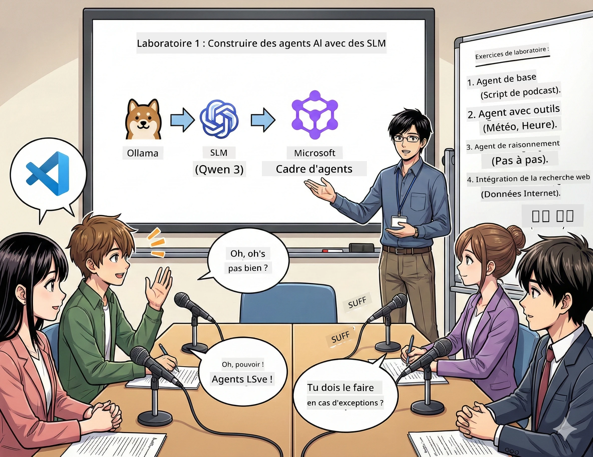

# Acte 1 : Rencontrez votre assistant de recherche IA 🤖

## Défi

Vous lancez « Future Bytes », votre nouveau podcast technologique. Le premier épisode porte sur les dernières avancées en IA, mais vous n’avez que 24 heures pour :
1. Rechercher le sujet
2. Trouver des sources fiables
3. Écrire un script captivant
4. Le faire paraître naturel

**Plot twist** : vous n’êtes pas seul. Vous allez construire votre premier assistant IA, qui peut vous aider à accomplir tout cela. Appelons-le Alex — votre partenaire de recherche infatigable, qui n’a jamais besoin de dormir.

## Pourquoi choisir des modèles linguistiques de petite taille ? (Spoiler : ils déchirent)

Pensez aux modèles linguistiques de petite taille (SLM) comme à une IA personnelle qui tourne *sur votre* ordinateur. Pas de cloud, pas de frais mensuels, pas de partage de données douteux.

**Pourquoi les SLM sont si 🔥 :**
- **🏠 Fonctionne sur votre machine** : portable, PC de bureau, même un Raspberry Pi puissant
- **💸 Aucun coût récurrent** : pas de frais API qui grignotent votre budget
- **🔒 Respect de la vie privée** : vos données ne quittent jamais votre appareil
- **⚡ Ultra rapides** : pas de latence réseau, réponses instantanées
- **🪦 Légers** : 1 à 10 milliards de paramètres contre 100+ milliards pour les grands modèles

**SLM populaires** : Qwen 3, Phi-4, Gemma 3 (ce workshop utilise Qwen)

## Votre boîte à outils

### Ollama : votre gestionnaire de modèles IA

[Ollama](https://ollama.com/) est comme le Steam des modèles IA. Téléchargez, lancez et gérez des modèles avec des commandes simples.

**Ce qui est cool :**
- Une commande pour télécharger et lancer n’importe quel modèle
- Fonctionne sur Mac, Windows, Linux
- Utilise automatiquement le GPU si disponible
- Très économe en mémoire

### Microsoft Agent Framework : là où la magie opère

[Microsoft Agent Framework](https://github.com/microsoft/agent-framework) est votre terrain de jeu pour construire des agents IA intelligents, capables de :

- 💬 Discuter et se souvenir de vos conversations
- 🛠️ Utiliser des outils personnalisés (comme rechercher sur le web ou consulter la météo)
- 🧠 Penser par étapes sur des problèmes complexes
- 🤝 Collaborer en équipe avec d’autres agents
- 🔌 Se connecter à différents fournisseurs IA (OpenAI, Ollama, Azure)

**Modules de construction :**
- **Agents** : assistants IA avec des tâches spécifiques
- **Outils** : capacités spéciales que vous leur donnez
- **Mémoire** : pour ne pas oublier vos conversations
- **Raisonnement** : leur apprendre à réfléchir et pas seulement à répondre

## Votre montage d’entraînement : 4 missions

### Mission 1 : Créez votre premier agent intelligent

📓 [Ouvrir le Notebook](../../code/01.BasicAgent/00.BasicAgent-agent.ipynb)

**Mission** : construire Alex, votre IA scénariste de podcast. Alex doit générer un dialogue entre deux animateurs discutant de sujets technologiques.

**Vous apprendrez à :**
- Réveiller un agent IA (plus facile que se lever un lundi)
- Lui donner une personnalité et des instructions
- Faire générer de vrais scripts de podcast
- Comprendre ce qu’il vous répond

**Condition de victoire** : Alex crée le script de votre pilote « Future Bytes » sur l’IA ! 🎯

### Mission 2 : Donnez des super-pouvoirs à Alex (des outils !)

📓 [Ouvrir le Notebook](../../code/01.BasicAgent/01.BasicAgent-tools.ipynb)

**Mission** : Alex est intelligent, mais il ne connaît pas la météo ni l’heure actuelle. Résolvons ça en lui donnant des outils !

**Vous apprendrez à :**
- Créer des fonctions Python personnalisées comme « outils »
- Permettre à Alex de décider *quand* et *quel* outil utiliser
- Observer comment il résout les problèmes de façon autonome
- Combiner plusieurs outils pour accomplir des tâches complexes

**Condition de victoire** : demandez « Quel temps fait-il à Tokyo ? » et Alex trouvera lui-même la réponse ! ☁️

### Mission 3 : Apprenez à Alex à réfléchir

📓 [Ouvrir le Notebook](../../code/01.BasicAgent/02.BasicAgent-reasoning.ipynb)

**Mission** : montrez le raisonnement d’Alex pendant son travail. En résolvant un problème, vous voulez voir *comment* il pense, pas juste la réponse.

**Vous apprendrez à :**
- Activer le « mode raisonnement » (comme montrer votre démarche en maths)
- Voir le processus de pensée étape par étape d’Alex
- Comprendre les chaînes de pensée
- Déboguer quand Alex est perdu

**Condition de victoire** : posez-lui un problème mathématique corsé et regardez-le réfléchir ! 🧠

### Mission 4 : Connectez Alex à Internet

📓 [Ouvrir le Notebook](../../code/01.BasicAgent/03.BasicAgent-websearch.ipynb)

**Mission** : les connaissances d’Alex ont une date limite. Connectons-le au Web pour obtenir des infos en temps réel !

**Vous apprendrez à :**
- Construire un outil personnalisé de recherche Web
- Intégrer des API externes
- Gérer élégamment les erreurs réseau
- Accéder à des informations au-delà des données d’entraînement d’Alex

**Condition de victoire** : demandez les dernières infos tech du jour et obtenez des résultats à jour ! 📰

## Avant de commencer 🚀

**Équipement nécessaire** :
- Python 3.10+ installé
- Ollama fonctionnel (vérifiez avec `ollama --version`)
- VS Code avec extension Python
- Minimum 8 Go de RAM (16 Go recommandés pour une expérience fluide)

## Ordre des missions

Terminez les notebooks dans l’ordre pour une expérience complète :

1. [00.BasicAgent-agent.ipynb](../../code/01.BasicAgent/00.BasicAgent-agent.ipynb) — Faites connaissance avec Alex (votre premier agent)
2. [01.BasicAgent-tools.ipynb](../../code/01.BasicAgent/01.BasicAgent-tools.ipynb) — Il est temps d’upgrader !
3. [02.BasicAgent-reasoning.ipynb](../../code/01.BasicAgent/02.BasicAgent-reasoning.ipynb) — Apprenez à Alex à réfléchir
4. [03.BasicAgent-websearch.ipynb](../../code/01.BasicAgent/03.BasicAgent-websearch.ipynb) — Débloquez l’accès à Internet !

## Ce que vous maîtriserez

Après l’acte 1, vous serez capable de :

- ✅ Faire tourner des modèles IA sur votre propre matériel (sans cloud !)
- ✅ Construire des agents personnalisés avec personnalité et compétences
- ✅ Donner aux agents des outils pour résoudre des problèmes réels
- ✅ Faire montrer aux agents leur raisonnement
- ✅ Connecter les agents à des sources de données externes
- ✅ Déboguer quand ça ne marche pas

## Quand ça coince (et comment réparer) 🔧

### « Alex ne charge pas ! Pas assez de mémoire ! »
**Solution** : votre ordinateur lutte. Fermez d’autres applis ou passez à un modèle plus petit. 8 Go est le minimum.

### « Alex est trop lent »
**Solution** : activez l’accélération GPU dans les réglages Ollama. Ou réduisez la taille de la fenêtre contextuelle. Mode bolide activé ! 🏎️

### « Les outils ne fonctionnent pas ! »
**Solution** : vérifiez bien la signature de vos fonctions. Alex a besoin d’indications typées correctes pour comprendre les outils. Pensez-y comme à donner des instructions claires.

## Liens utiles 🔗

- [Documentation Agent Framework](https://github.com/microsoft/agent-framework) — guide officiel et exemples
- [Bibliothèque de modèles Ollama](https://ollama.com/library) — parcourez tous les modèles disponibles
- [Modèle Qwen](https://ollama.com/library/qwen3) — découvrez le cerveau de votre assistant IA
- [Exemples de code](https://github.com/microsoft/agent-framework/tree/main/python/samples) — puisez des idées ici

## Prochaine étape : Acte 2 🎬

Vous avez un agent. Mais si vous aviez une *équipe* d’agents travaillant ensemble ? Dans l’acte 2, vous construirez une équipe complète de production podcast :
- **Agent recherche** : trouver les meilleures sources
- **Agent écriture** : créer le script parfait
- **Éditeur (vous !)** : approuver ou demander des modifications

Orchestrons un peu de magie IA ! → [Acte 2 : Constituez votre équipe de production](02.AIAgentOrchestrationAndWorkflows.md)

---

**Bloqué ?** Posez vos questions pendant le workshop. Apprenons ensemble ! 🙌

---

<!-- CO-OP TRANSLATOR DISCLAIMER START -->
**Avertissement** :
Ce document a été traduit à l’aide du service de traduction automatique [Co-op Translator](https://github.com/Azure/co-op-translator). Bien que nous nous efforçons d’assurer l’exactitude, veuillez noter que les traductions automatiques peuvent contenir des erreurs ou des inexactitudes. Le document original dans sa langue d’origine doit être considéré comme la source faisant foi. Pour les informations critiques, une traduction professionnelle réalisée par un humain est recommandée. Nous déclinons toute responsabilité en cas de malentendus ou de mauvaises interprétations résultant de l’utilisation de cette traduction.
<!-- CO-OP TRANSLATOR DISCLAIMER END -->