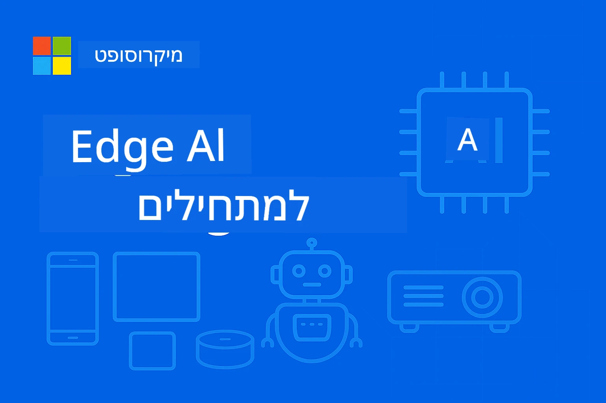

# EdgeAI למתחילים




[](https://GitHub.com/microsoft/edgeai-for-beginners/graphs/contributors)
[](https://GitHub.com/microsoft/edgeai-for-beginners/issues)
[](https://GitHub.com/microsoft/edgeai-for-beginners/pulls)
[](http://makeapullrequest.com)

[](https://GitHub.com/microsoft/edgeai-for-beginners/watchers)
[](https://GitHub.com/microsoft/edgeai-for-beginners/fork)
[](https://GitHub.com/microsoft/edgeai-for-beginners/stargazers)


[](https://discord.gg/nTYy5BXMWG)

עקבו אחר השלבים הבאים כדי להתחיל להשתמש במשאבים אלה:

1. **פוצלו את המאגר**: לחצו על [](https://GitHub.com/microsoft/edgeai-for-beginners/fork)
2. **שכפלו את המאגר**:   `git clone https://github.com/microsoft/edgeai-for-beginners.git`
3. [**הצטרפו ל-Discord של Azure AI Foundry והכירו מומחים ומפתחים עמיתים**](https://discord.com/invite/ByRwuEEgH4)


### 🌐 תמיכה בריבוי שפות

#### נתמך דרך GitHub Action (אוטומטי ותמיד מעודכן)

<!-- CO-OP TRANSLATOR LANGUAGES TABLE START -->
[ערבית](../ar/README.md) | [בנגלית](../bn/README.md) | [בולגרית](../bg/README.md) | [בורמזית (מיאנמר)](../my/README.md) | [סינית (מפושטת)](../zh-CN/README.md) | [סינית (מסורתית, הונג קונג)](../zh-HK/README.md) | [סינית (מסורתית, מקאו)](../zh-MO/README.md) | [סינית (מסורתית, טייוואן)](../zh-TW/README.md) | [קרואטית](../hr/README.md) | [צ’כית](../cs/README.md) | [דנית](../da/README.md) | [הולנדית](../nl/README.md) | [אסטונית](../et/README.md) | [פינית](../fi/README.md) | [צרפתית](../fr/README.md) | [גרמנית](../de/README.md) | [יוונית](../el/README.md) | [עברית](./README.md) | [הינדי](../hi/README.md) | [הונגרית](../hu/README.md) | [אינדונזית](../id/README.md) | [איטלקית](../it/README.md) | [יפנית](../ja/README.md) | [קאנדה](../kn/README.md) | [קוריאנית](../ko/README.md) | [ליטאית](../lt/README.md) | [מאלאית](../ms/README.md) | [מאליאלאם](../ml/README.md) | [מראתי](../mr/README.md) | [נפאלית](../ne/README.md) | [ניגרית פידג’ין](../pcm/README.md) | [נורווגית](../no/README.md) | [פרסית (פארסי)](../fa/README.md) | [פולנית](../pl/README.md) | [פורטוגזית (ברזיל)](../pt-BR/README.md) | [פורטוגזית (פורטוגל)](../pt-PT/README.md) | [פנג’אבית (גורמוכי)](../pa/README.md) | [רומנית](../ro/README.md) | [רוסית](../ru/README.md) | [סרבית (קירילית)](../sr/README.md) | [סלובקית](../sk/README.md) | [סלובנית](../sl/README.md) | [ספרדית](../es/README.md) | [סווהילית](../sw/README.md) | [שוודית](../sv/README.md) | [טגלוג (פיליפינית)](../tl/README.md) | [טמילית](../ta/README.md) | [טלווגו](../te/README.md) | [תאית](../th/README.md) | [טורקית](../tr/README.md) | [אוקראינית](../uk/README.md) | [אורדו](../ur/README.md) | [וייטנאמית](../vi/README.md)

> **מעדיפים לשכפל מקומית?**

> מאגר זה כולל תרגומים ל-50+ שפות מה שמגדיל משמעותית את גודל ההורדה. כדי לשכפל בלי תרגומים, השתמשו ב-sparse checkout:
> ```bash
> git clone --filter=blob:none --sparse https://github.com/microsoft/edgeai-for-beginners.git
> cd edgeai-for-beginners
> git sparse-checkout set --no-cone '/*' '!translations' '!translated_images'
> ```
> זה נותן לכם את כל מה שצריך כדי להשלים את הקורס במהירות הורדה גבוהה יותר.
<!-- CO-OP TRANSLATOR LANGUAGES TABLE END -->

**אם תרצו לתמוך בשפות תרגום נוספות, הן רשומות [כאן](https://github.com/Azure/co-op-translator/blob/main/getting_started/supported-languages.md)**
## מבוא

ברוכים הבאים ל-**EdgeAI למתחילים** – המסע המקיף שלכם לעולם המשתנה של בינה מלאכותית בקצה. קורס זה מגשר על הפער בין יכולות בינה מלאכותית עוצמתיות לפריסה מעשית בעולם האמיתי במכשירי קצה, ומאפשר לכם למנף את הפוטנציאל של AI ישירות במקום בו הנתונים נוצרים וההחלטות צריכות להתקבל.

### מה תלמדו לשלוט בו

קורס זה ייקח אתכם ממושגי יסוד ועד ליישומים מוכנים לייצור, כולל:
- **מודלים קטנים לשפה (SLMs)** מותאמים לפריסה בקצה
- **אופטימיזציה מודעת חומרה** בפלטפורמות שונות
- **הסקה בזמן אמת** עם יכולות שמירה על פרטיות
- **אסטרטגיות פריסה בייצור** ליישומי ארגונים

### למה EdgeAI חשוב

Edge AI מייצג שינוי פרדיגמה שעונה על אתגרים מודרניים קריטיים:
- **פרטיות ואבטחה**: עיבוד נתונים רגישים מקומית בלי חשיפה לענן
- **ביצועים בזמן אמת**: מבטל את אחורי הרשת עבור אפליקציות קריטיות לזמן
- **יעילות עלות**: מצמצם רוחב פס ועלויות מחשוב בענן
- **תפעול עמיד**: שומר על פונקציונליות במהלך הפסקות רשת
- **עמידה בדרישות רגולטוריות**: מתאים לדרישות ריבונות נתונים

### Edge AI

Edge AI מתייחס להרצת אלגוריתמים ובמודלים לשפה באופן מקומי על החומרה, קרוב למקום בו הנתונים נוצרו ללא צורך במשאבי ענן עבור הסקה. הוא מקטין השהייה, משפר פרטיות, ומאפשר קבלת החלטות בזמן אמת.

### עקרונות מרכזיים:
- **הסקה על המכשיר**: מודלים פועלים במכשירי קצה (טלפונים, נתבים, מיקרו-בקרים, מחשבים תעשייתיים)
- **יכולת אופליין**: פונקציונליות ללא חיבור אינטרנט מתמיד
- **השיה נמוכה**: תגובות מיידיות למערכות בזמן אמת
- **ריבונות נתונים**: שומר נתונים רגישים מקומית, משפר אבטחה ועמידה

### מודלים קטנים לשפה (SLMs)

SLMs כמו Phi-4, Mistral-7B ו-Gemma הם גרסאות מותאמות של LLMs גדולים יותר – מאומנים או מזוקקים עבור:
- **רוחב זיכרון מצומצם**: שימוש יעיל בזיכרון מוגבל של מכשירי קצה
- **ביקוש חישובי נמוך**: מותאם לביצועי CPU ו-GPU בקצה
- **זמנים מהירים לאתחול**: אתחול מהיר ליישומים תגובתיים

הם משחררים יכולות NLP חזקות תוך עמידה במגבלות של:
- **מערכות משובצות**: מכשירי IoT ובקרים תעשייתיים
- **מכשירים ניידים**: סמארטפונים וטאבלטים עם יכולות אופליין
- **מכשירי IoT**: חיישנים ומכשירים חכמים עם משאבים מוגבלים
- **שרתים בקצה**: יחידות עיבוד מקומיות עם משאבי GPU מוגבלים
- **מחשבים אישיים**: תרחישי פריסה במחשבים שולחניים וניידים

## מודולי הקורס וניווט

| מודול | נושא | תחום התמקדות | תוכן מפתח | רמה | משך |
|--------|-------|------------|-------------|--------|----------|
| [📖 00 ](./introduction.md) | [היכרות עם EdgeAI](./introduction.md) | יסודות והקשר | סקירת EdgeAI • יישומי תעשייה • מבוא ל-SLM • מטרות למידה | מתחילים | 1-2 שעות |
| [📚 01](../../Module01) | [יסודות EdgeAI](./Module01/README.md) | השוואת ענן מול Edge AI | יסודות EdgeAI • מקרים מעולם האמיתי • מדריך יישום • פריסת קצה | מתחילים | 3-4 שעות |
| [🧠 02](../../Module02) | [יסודות מודלי SLM](./Module02/README.md) | משפחות מודלים וארכיטקטורה | משפחת Phi • משפחת Qwen • משפחת Gemma • BitNET • μModel • Phi-Silica | מתחילים | 4-5 שעות |
| [🚀 03](../../Module03) | [פרקטיקות פריסת SLM](./Module03/README.md) | פריסה מקומית ועננית | למידה מתקדמת • סביבה מקומית • פריסת ענן | בינוניים | 4-5 שעות |
| [⚙️ 04](../../Module04) | [ערכת כלים לאופטימיזציה של מודלים](./Module04/README.md) | אופטימיזציה חוצת פלטפורמות | מבוא • Llama.cpp • Microsoft Olive • OpenVINO • Apple MLX • סינתזת זרימת עבודה | בינוניים | 5-6 שעות |
| [🔧 05](../../Module05) | [פירודקציית SLMOps](./Module05/README.md) | תפעול בפרודקשן | מבוא ל-SLMOps • זיקוק מודל • כיוונון • פריסת ייצור | מתקדמים | 5-6 שעות |
| [🤖 06](../../Module06) | [סוכני AI וקריאת פונקציות](./Module06/README.md) | מסגרות סוכן ו-MCP | מבוא לסוכן • קריאת פונקציות • פרוטוקול הקשר מודל | מתקדמים | 4-5 שעות |
| [💻 07](../../Module07) | [יישום פלטפורמה](./Module07/README.md) | דוגמאות חוצות פלטפורמות | ערכת כלים AI • Foundry Local • פיתוח ב-Windows | מתקדמים | 3-4 שעות |
| [🏭 08](../../Module08) | [Foundry Local Toolkit](./Module08/README.md) | דוגמאות מוכנות לייצור | יישומי דוגמא (ראה פרטים למטה) | מומחה | 8-10 שעות |

### 🏭 **מודול 08: יישומי דוגמא**

- [01: REST Chat התחלה מהירה](./Module08/samples/01/README.md)
- [02: אינטגרציית OpenAI SDK](./Module08/samples/02/README.md)
- [03: גילוי מודלים וביצוע הערכות](./Module08/samples/03/README.md)
- [04: יישום Chainlit RAG](./Module08/samples/04/README.md)
- [05: תזמור סוכנים מרובים](./Module08/samples/05/README.md)
- [06: ניתוב מודלים כככלים](./Module08/samples/06/README.md)
- [07: לקוח API ישיר](./Module08/samples/07/README.md)
- [08: אפליקציית שיחה Windows 11](./Module08/samples/08/README.md)
- [09: מערכת סוכנים מרובת מתקדמת](./Module08/samples/09/README.md)
- [10: מסגרת כלים Foundry](./Module08/samples/10/README.md)

### 🎓 **סדנה: מסלול למידה מעשי**

חומרי סדנה מעשית מקיפים עם יישומים מוכנים לייצור:

- **[מדריך הסדנה](./Workshop/Readme.md)** - מטרות למידה, תוצאות וניווט משאבים מלאים
- **דוגמאות Python** (6 מפגשים) - מעודכנות בהתנסות, טיפול בשגיאות, ותיעוד מלא
- **מחברות Jupyter** (8 אינטראקטיביות) - הדרכות שלב-אחר-שלב עם מדדי ביצועים ומעקב
- **מדריכי מפגשים** - מדריכים מפורטים במרק-דאון לכל מפגש בסדנה
- **כלי אימות** - סקריפטים לבדיקת איכות קוד והרצת בדיקות בסיס

**מה תבנו:**
- אפליקציות שיחה מבוססות AI מקומיות עם תמיכה בזרימה
- צינורות RAG עם הערכת איכות (RAGAS)
- כלי ביצועים והשוואת מודלים מרובים
- מערכות תזמור סוכנים מרובים
- ניתוב מודלים חכם עם בחירה מבוססת משימות

### 🎙️ **סדנת Hands-On ל-Agentic: סטודיו הפודקאסט של AI**

בנו צינור הפקה לפודקאסט מבוסס AI מאפס! סדנה חווייתית זו תלמד אתכם כיצד ליצור מערכת סוכנים מרובת שלבים שמשנה רעיונות לפרקים מקצועיים בפודקאסט.
**[🎬 התחל את סדנת אולפן פודקאסט AI](./WorkshopForAgentic/README.md)**

**המשימה שלך**: השק את "Future Bytes" — פודקאסט טכנולוגיה שמופעל כולו על ידי סוכני AI שתבנה בעצמך. ללא תלות בענן, ללא עלויות API — הכול פועל באופן מקומי במחשב שלך.

**מה שמייחד את זה:**
- **🤖 תזמור מולטיאג'נט אמיתי** - בנה סוכני AI מיוחדים שמבצעים מחקר, כותבים ומייצרים אודיו
- **🎯 צינור הפקה מלא** - מבחירת נושא ועד פלט אודיו סופי לפודקאסט
- **💻 פריסה מקומית 100%** - משתמש ב-Ollama ובמודלים מקומיים (Qwen-3-8B) לפרטיות ושליטה מלאה
- **🎤 אינטגרציית טקסט לדיבור** - המרת תסריטים לשיחות מרובות דוברים בקול טבעי
- **✋ תהליכי עבודה עם מעורבות אנושית** - שערי אישור לשמירת איכות תוך שמירה על אוטומציה

**מסע למידה בשלוש מערכות:**

| מערכה | מיקוד | מיומנויות עיקריות | משך זמן |
|-------|-------|-------------------|----------|
| **[מערכה 1: הכירו את סוכני ה-AI שלכם](./WorkshopForAgentic/md/01.BuildAIAgentWithSLM.md)** | בנה את סוכן ה-AI הראשון שלך | אינטגרציית כלים • חיפוש באינטרנט • פתרון בעיות • חשיבה סוכנית | 2-3 שעות |
| **[מערכה 2: עצב את צוות ההפקה שלך](./WorkshopForAgentic/md/02.AIAgentOrchestrationAndWorkflows.md)** | תזמור סוכנים רבים | תיאום צוות • תהליכי אישור • ממשק DevUI • פיקוח אנושי | 3-4 שעות |
| **[מערכה 3: הביא את הפודקאסט לחיים](./WorkshopForAgentic/md/03.Multi-SpeakerPodcastGenerationWithVibeVoice.md)** | הפק אודיו לפודקאסט | טקסט לדיבור • סינתזת ריבוי דוברים • אודיו לטווח ארוך • אוטומציה מלאה | 2-3 שעות |

**הטכנולוגיות שבהן משתמשים:**
- **Microsoft Agent Framework** - תזמור ותיאום סוכנים מרובים
- **Ollama** - זמן ריצה למודלים מלאכותיים מקומיים (ללא ענן)
- **Qwen-3-8B** - מודל שפה בקוד פתוח מותאם למשימות סוכניות
- **API טקסט לדיבור** - סינתזת קולם טבעי ליצירת פודקאסט

**תמיכה בחומרה:**
- ✅ **מצב CPU** - עובד על כל מחשב מודרני (מומלץ 8GB זיכרון RAM ומעלה)
- 🚀 **האצה GPU** - הפעלה מהירה משמעותית עם GPUs של NVIDIA/AMD
- ⚡ **תמיכת NPU** - האצה עם מעבד עצבי מדור הבא

**מתאים במיוחד ל:**
- מפתחים הלומדים מערכות AI מרובות סוכנים
- כל מי שמתעניין באוטומציה מבוססת AI וזרמי עבודה
- יוצרים התExploring AI-assisted Production תוכן  
- סטודנטים הלומדים דפוסי תזמור AI מעשיים

**התחל לבנות**: [🎙️ סדנת אולפן הפודקאסט AI →](./WorkshopForAgentic/README.md)

### 📊 **סיכום נתיב הלמידה**
- **משך כולל**: 36-45 שעות
- **נתיב למתחילים**: מודולים 01-02 (7-9 שעות)  
- **נתיב ביניים**: מודולים 03-04 (9-11 שעות)
- **נתיב מתקדם**: מודולים 05-07 (12-15 שעות)
- **נתיב מומחה**: מודול 08 (8-10 שעות)

## מה תבנה

### 🎯 יכולות מרכזיות
- **ארכיטקטורת Edge AI**: עיצוב מערכות AI מקומיות עם אינטגרציה לענן
- **אופטימיזציית מודלים**: כימות ודחיסת מודלים לפריסה מקומית (שיפור ביצועים של 85%, הקטנת גודל ב-75%)
- **פריסה מולטיפלטפורמית**: Windows, מובייל, משובץ ומערכות היברידיות ענן-קצה
- **תפעול הפקה**: ניטור, קנה מידה ותחזוקה של Edge AI בהפקה

### 🏗️ פרויקטים מעשיים
- **Foundry Local Chat Apps**: אפליקציה מקומית ל-Windows 11 עם החלפת מודלים
- **מערכות מולטיאג'נט**: מתאם עם סוכנים מומחים לזרמי עבודה מורכבים  
- **יישומי RAG**: עיבוד מסמכים מקומי עם חיפוש וקטורי
- **מודל רואוטרים**: בחירה חכמה בין מודלים על בסיס ניתוח משימות
- **מסגרות API**: לקוחות מוכנים להפקה עם סטרימינג וניטור בריאות
- **כלים בין פלטפורמות**: תבניות אינטגרציה LangChain/Semantic Kernel

### 🏢 יישומים בתעשייה
**ייצור** • **בריאות** • **רכבים אוטונומיים** • **ערים חכמות** • **אפליקציות מובייל**

## התחלה מהירה

**נתיב למידה מומלץ** (20-30 שעות סך הכל):

0. **📖 מבוא** ([Introduction.md](./introduction.md)): יסודות EdgeAI + הקשר תעשייתי + מסגרת למידה  
1. **📚 יסודות** (מודולים 01-02): מושגי EdgeAI + משפחות מודלי SLM  
2. **⚙️ אופטימיזציה** (מודולים 03-04): פריסה + מסגרות כימות  
3. **🚀 הפקה** (מודולים 05-06): SLMOps + סוכני AI + קריאה לפונקציות  
4. **💻 יישום** (מודולים 07-08): דוגמאות פלטפורמה + ערכת Foundry Local

כל מודול כולל תיאוריה, תרגילים מעשיים ודוגמאות קוד מוכנות להפקה.

## השפעה מקצועית

**תפקידים טכניים**: ארכיטקט פתרונות EdgeAI • מהנדס ML (Edge) • מפתח AI ל-IoT • מפתח AI למובייל

**מגזרי תעשייה**: תעשיית ייצור 4.0 • טכנולוגיות בריאות • מערכות אוטונומיות • FinTech • אלקטרוניקה לצרכן

**פרויקטים בתיק עבודות**: מערכות מולטיאג'נט • יישומי RAG להפקה • פריסה בין פלטפורמות • אופטימיזציית ביצועים

## מבנה מאגר

```
edgeai-for-beginners/
├── 📖 introduction.md  # Foundation: EdgeAI Overview & Learning Framework
├── 📚 Module01-04/     # Fundamentals → SLMs → Deployment → Optimization  
├── 🔧 Module05-06/     # SLMOps → AI Agents → Function Calling
├── 💻 Module07/        # Platform Samples (VS Code, Windows, Jetson, Mobile)
├── 🏭 Module08/        # Foundry Local Toolkit + 10 Comprehensive Samples
│   ├── samples/01-06/  # Foundation: REST, SDK, RAG, Agents, Routing
│   └── samples/07-10/  # Advanced: API Client, Windows App, Enterprise Agents, Tools
├── 🌐 translations/    # Multi-language support (8+ languages)
└── 📋 STUDY_GUIDE.md   # Structured learning paths & time allocation
```

## נקודות שיא בקורס

✅ **למידה הדרגתית**: תיאוריה → פרקטיקה → פריסה להפקה  
✅ **מקרי בוחן אמיתיים**: Microsoft, Japan Airlines, יישומי ארגונים  
✅ **דוגמאות מעשיות**: מעל 50 דוגמאות, 10 הדגמות Foundry Local מקיפות  
✅ **מיקוד בביצועים**: שיפור מהירות ב-85%, הקטנת גודל ב-75%  
✅ **רב-פלטפורמי**: Windows, מובייל, משובץ, היברידי ענן-קצה  
✅ **מוכן להפקה**: ניטור, קנה מידה, אבטחה, מסגרות תאימות

📖 **[מדריך לימוד זמין](STUDY_GUIDE.md)**: נתיב למידה מובנה של 20 שעות עם הנחיות לתזמון וכלי הערכה עצמית.

---

**EdgeAI מייצג את עתיד פריסת ה-AI**: מקומי ראשון, שומר פרטיות ויעיל. שלוט בכישורים אלה כדי לבנות את הדור הבא של יישומים אינטיליגנטיים.

## קורסים אחרים

הצוות שלנו מייצר קורסים נוספים! עיין ב:

<!-- CO-OP TRANSLATOR OTHER COURSES START -->
### LangChain
[](https://aka.ms/langchain4j-for-beginners)
[](https://aka.ms/langchainjs-for-beginners?WT.mc_id=m365-94501-dwahlin)

---

### Azure / Edge / MCP / סוכנים
[](https://github.com/microsoft/AZD-for-beginners?WT.mc_id=academic-105485-koreyst)
[](https://github.com/microsoft/edgeai-for-beginners?WT.mc_id=academic-105485-koreyst)
[](https://github.com/microsoft/mcp-for-beginners?WT.mc_id=academic-105485-koreyst)
[](https://github.com/microsoft/ai-agents-for-beginners?WT.mc_id=academic-105485-koreyst)

---
 
### סדרת AI גנרטיבית
[](https://github.com/microsoft/generative-ai-for-beginners?WT.mc_id=academic-105485-koreyst)
[-9333EA?style=for-the-badge&labelColor=E5E7EB&color=9333EA)](https://github.com/microsoft/Generative-AI-for-beginners-dotnet?WT.mc_id=academic-105485-koreyst)
[-C084FC?style=for-the-badge&labelColor=E5E7EB&color=C084FC)](https://github.com/microsoft/generative-ai-for-beginners-java?WT.mc_id=academic-105485-koreyst)
[-E879F9?style=for-the-badge&labelColor=E5E7EB&color=E879F9)](https://github.com/microsoft/generative-ai-with-javascript?WT.mc_id=academic-105485-koreyst)

---
 
### בסיסי לימוד
[](https://aka.ms/ml-beginners?WT.mc_id=academic-105485-koreyst)
[](https://aka.ms/datascience-beginners?WT.mc_id=academic-105485-koreyst)
[](https://aka.ms/ai-beginners?WT.mc_id=academic-105485-koreyst)
[](https://github.com/microsoft/Security-101?WT.mc_id=academic-96948-sayoung)
[](https://aka.ms/webdev-beginners?WT.mc_id=academic-105485-koreyst)
[](https://aka.ms/iot-beginners?WT.mc_id=academic-105485-koreyst)
[](https://github.com/microsoft/xr-development-for-beginners?WT.mc_id=academic-105485-koreyst)

---
 
### סדרת Copilot
[](https://aka.ms/GitHubCopilotAI?WT.mc_id=academic-105485-koreyst)
[](https://github.com/microsoft/mastering-github-copilot-for-dotnet-csharp-developers?WT.mc_id=academic-105485-koreyst)
[](https://github.com/microsoft/CopilotAdventures?WT.mc_id=academic-105485-koreyst)
<!-- CO-OP TRANSLATOR OTHER COURSES END -->

## קבלת עזרה

אם נתקעת או יש לך שאלות בנוגע לבניית אפליקציות בינה מלאכותית, הצטרף ל:

[](https://discord.gg/nTYy5BXMWG)

אם יש לך משוב על המוצר או שגיאות במהלך הבנייה, עבור אל:

[](https://aka.ms/foundry/forum)

---

<!-- CO-OP TRANSLATOR DISCLAIMER START -->
**כתב ויתור**:  
מסמך זה תורגם באמצעות שירות התרגום האוטומטי [Co-op Translator](https://github.com/Azure/co-op-translator). למרות שאנו שואפים לדיוק, יש לקחת בחשבון כי תרגומים אוטומטיים עלולים להכיל שגיאות או אי-דיוקים. המסמך המקורי בשפה המקורית שלו הוא המקור הסמכותי. למידע קריטי מומלץ להיעזר בתרגום מקצועי ובידי אדם. איננו אחראים לכל אי-הבנה או פרשנות שגויה הנובעת משימוש בתרגום זה.
<!-- CO-OP TRANSLATOR DISCLAIMER END -->