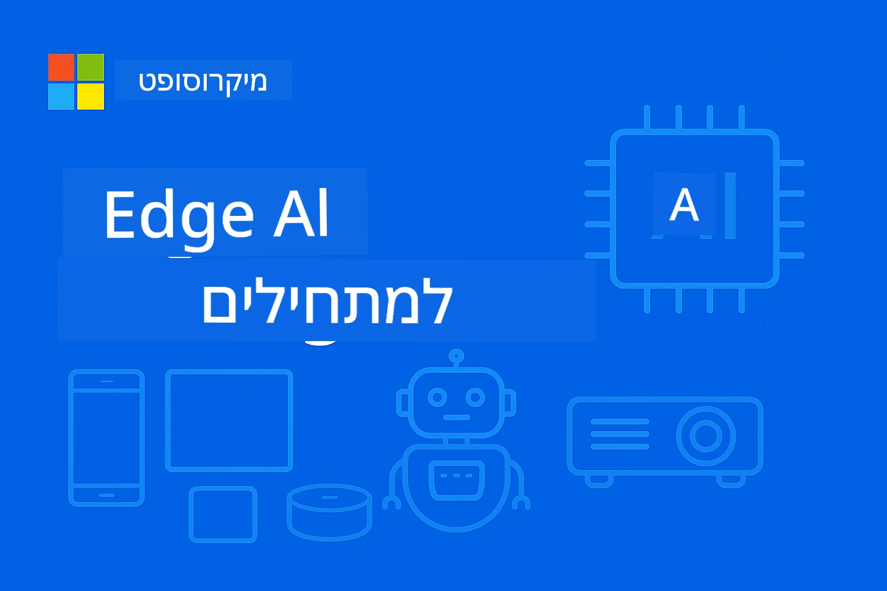

# EdgeAI למתחילים




[](https://GitHub.com/microsoft/edgeai-for-beginners/graphs/contributors)
[](https://GitHub.com/microsoft/edgeai-for-beginners/issues)
[](https://GitHub.com/microsoft/edgeai-for-beginners/pulls)
[](http://makeapullrequest.com)

[](https://GitHub.com/microsoft/edgeai-for-beginners/watchers)
[](https://GitHub.com/microsoft/edgeai-for-beginners/fork)
[](https://GitHub.com/microsoft/edgeai-for-beginners/stargazers)


[](https://discord.gg/nTYy5BXMWG)

עקבו אחר הצעדים הבאים כדי להתחיל להשתמש במשאבים האלה:

1. **יצירת עותק (Fork) של הרפוזיטורי**: לחצו [](https://GitHub.com/microsoft/edgeai-for-beginners/fork)
2. **שכפול הרפוזיטורי**:   `git clone https://github.com/microsoft/edgeai-for-beginners.git`
3. [**הצטרפו ל-Azure AI Foundry ב-Discord ופגשו מומחים ומפתחים אחרים**](https://discord.com/invite/ByRwuEEgH4)


### 🌐 תמיכה בריבוי שפות

#### נתמך דרך פעולה ב-GitHub (ממוכן ותמיד מעודכן)

<!-- CO-OP TRANSLATOR LANGUAGES TABLE START -->
[Arabic](../ar/README.md) | [Bengali](../bn/README.md) | [Bulgarian](../bg/README.md) | [Burmese (Myanmar)](../my/README.md) | [Chinese (Simplified)](../zh-CN/README.md) | [Chinese (Traditional, Hong Kong)](../zh-HK/README.md) | [Chinese (Traditional, Macau)](../zh-MO/README.md) | [Chinese (Traditional, Taiwan)](../zh-TW/README.md) | [Croatian](../hr/README.md) | [Czech](../cs/README.md) | [Danish](../da/README.md) | [Dutch](../nl/README.md) | [Estonian](../et/README.md) | [Finnish](../fi/README.md) | [French](../fr/README.md) | [German](../de/README.md) | [Greek](../el/README.md) | [Hebrew](./README.md) | [Hindi](../hi/README.md) | [Hungarian](../hu/README.md) | [Indonesian](../id/README.md) | [Italian](../it/README.md) | [Japanese](../ja/README.md) | [Kannada](../kn/README.md) | [Khmer](../km/README.md) | [Korean](../ko/README.md) | [Lithuanian](../lt/README.md) | [Malay](../ms/README.md) | [Malayalam](../ml/README.md) | [Marathi](../mr/README.md) | [Nepali](../ne/README.md) | [Nigerian Pidgin](../pcm/README.md) | [Norwegian](../no/README.md) | [Persian (Farsi)](../fa/README.md) | [Polish](../pl/README.md) | [Portuguese (Brazil)](../pt-BR/README.md) | [Portuguese (Portugal)](../pt-PT/README.md) | [Punjabi (Gurmukhi)](../pa/README.md) | [Romanian](../ro/README.md) | [Russian](../ru/README.md) | [Serbian (Cyrillic)](../sr/README.md) | [Slovak](../sk/README.md) | [Slovenian](../sl/README.md) | [Spanish](../es/README.md) | [Swahili](../sw/README.md) | [Swedish](../sv/README.md) | [Tagalog (Filipino)](../tl/README.md) | [Tamil](../ta/README.md) | [Telugu](../te/README.md) | [Thai](../th/README.md) | [Turkish](../tr/README.md) | [Ukrainian](../uk/README.md) | [Urdu](../ur/README.md) | [Vietnamese](../vi/README.md)

> **מעדיפים לשכפל במחשב מקומי?**
>
> רפוזיטורי זה כולל תרגומים ל-50+ שפות, מה שמגדיל משמעותית את גודל ההורדה. כדי לשכפל ללא תרגומים, השתמשו ב-sparse checkout:
>
> **Bash / macOS / Linux:**
> ```bash
> git clone --filter=blob:none --sparse https://github.com/microsoft/edgeai-for-beginners.git
> cd edgeai-for-beginners
> git sparse-checkout set --no-cone '/*' '!translations' '!translated_images'
> ```
>
> **CMD (Windows):**
> ```cmd
> git clone --filter=blob:none --sparse https://github.com/microsoft/edgeai-for-beginners.git
> cd edgeai-for-beginners
> git sparse-checkout set --no-cone "/*" "!translations" "!translated_images"
> ```
>
> זה נותן לכם את כל מה שצריך כדי להשלים את הקורס עם הורדה הרבה יותר מהירה.
<!-- CO-OP TRANSLATOR LANGUAGES TABLE END -->

**אם ברצונכם לתמוך בשפות תרגום נוספות הרשומות [כאן](https://github.com/Azure/co-op-translator/blob/main/getting_started/supported-languages.md)**
## מבוא

ברוכים הבאים ל-**EdgeAI למתחילים** – המסע המקיף שלכם לעולם המהפכני של אינטליגנציה מלאכותית בקצה. הקורס הזה מגשר על הפער בין יכולות AI עוצמתיות לפריסה מעשית במכשירים בקצה, ומאפשר לכם לממש את הפוטנציאל של AI ישירות במקום בו הנתונים נוצרים וההחלטות חייבות להתקבל.

### מה תלמדו לשלוט בו

הקורס הזה ייקח אתכם מהקונספטים הבסיסיים ועד ליישומים מוכנים לייצור, כולל:
- **מודלים קטנים של שפה (SLMs)** מותאמים לפריסת קצה
- **אופטימיזציה מודעת חומרה** בפלטפורמות מגוונות
- **הסקת מסקנות בזמן אמת** עם שמירה על פרטיות
- **אסטרטגיות פריסה לייצור** עבור יישומי ארגונים

### מדוע EdgeAI חשוב

אינטליגנציה מלאכותית בקצה מציגה תפנית משמעותית המתמודדת עם אתגרים מודרניים קריטיים:
- **פרטיות ואבטחה**: עיבוד נתונים רגישים באופן מקומי ללא חשיפת ענן
- **ביצועים בזמן אמת**: ביטול השהיית רשת עבור יישומים חיוניים בזמן
- **יעילות עלות**: צמצום צריכת רוחב פס ועלויות מחשוב ענן
- **תפעול חסין**: המשכיות עבודה בעת הפסקות רשת
- **עמידה בדרישות רגולטוריות**: תאימות לדרישות ריבונות מידע

### Edge AI

Edge AI מתייחס להפעלת אלגוריתמים של AI ומודלים לשפה באופן מקומי על החומרה, קרוב לנקודת יצירת הנתונים, מבלי להיעזר במשאבי ענן להסקת מסקנות. הוא מפחית השהיה, משפר פרטיות ומאפשר קבלת החלטות בזמן אמת.

### עקרונות מרכזיים:
- **הסקה במכשיר**: מודלים רצים במכשירי קצה (טלפונים, נתבים, מיקרו-בקרים, מחשבים תעשייתיים)
- **יכולת אופליין**: עובד ללא חיבור אינטרנט מתמיד
- **שהיה נמוכה**: תגובות מיידיות המתאימות למערכות בזמן אמת
- **ריבונות נתונים**: שומרים נתונים רגישים מקומית, משפרים אבטחה ועמידה בדרישות

### מודלים קטנים של שפה (SLMs)

מודלים קטנים כמו Phi-4, Mistral-7B, ו-Gemma הם גרסאות מותאמות של LLMs גדולים—מאומנים או מזוקקים עבור:
- **הרגל זיכרון מופחת**: ניצול יעיל של זיכרון מוגבל במכשירי קצה
- **ביקוש חישובי נמוך יותר**: מותאם לביצועי CPU ו-GPU בקצה
- **זמני הפעלה מהירים יותר**: איתחול מהיר ליישומים רגישים

הם מאפשרים יכולות עיבוד שפה טבעית עוצמתיות תוך עמידה במגבלות:
- **מערכות משובצות**: מכשירי IoT ובקרים תעשייתיים
- **מכשירים ניידים**: סמארטפונים וטאבלטים עם יכולת אופליין
- **מכשירי IoT**: חיישנים ומכשירים חכמים עם משאבים מוגבלים
- **שרתים בקצה**: יחידות עיבוד מקומיות עם משאבי GPU מוגבלים
- **מחשבים אישיים**: תרחישי פריסה במחשבים ניידים ונייחים

## מודולי הקורס וניווט

| מודול | נושא | תחום מיקוד | תוכן מרכזי | רמה | משך |
|--------|-------|------------|-------------|--------|----------|
| [📖 00 ](./introduction.md) | [הקדמה ל-EdgeAI](./introduction.md) | יסודות והקשר | סקירת EdgeAI • יישומים בתעשייה • מבוא ל-SLM • מטרות למידה | מתחילים | 1-2 שעות |
| [📚 01](../../Module01) | [יסודות EdgeAI](./Module01/README.md) | השוואת ענן מול Edge AI | יסודות EdgeAI • תרחישים מהעולם האמיתי • מדריך יישום • פריסת קצה | מתחילים | 3-4 שעות |
| [🧠 02](../../Module02) | [יסודות מודלי SLM](./Module02/README.md) | משפחות מודלים וארכיטקטורה | משפחת Phi • משפחת Qwen • משפחת Gemma • BitNET • μModel • Phi-Silica | מתחילים | 4-5 שעות |
| [🚀 03](../../Module03) | [פרקטיקת פריסת SLM](./Module03/README.md) | פריסה מקומית ועננית | למידה מתקדמת • סביבה מקומית • פריסת ענן | בינוניים | 4-5 שעות |
| [⚙️ 04](../../Module04) | [כלי אופטימיזציה למודל](./Module04/README.md) | אופטימיזציה חוצה פלטפורמות | מבוא • Llama.cpp • Microsoft Olive • OpenVINO • Apple MLX • סינתזת תהליך עבודה | בינוניים | 5-6 שעות |
| [🔧 05](../../Module05) | [ייצור SLMOps](./Module05/README.md) | תפעול לייצור | מבוא ל-SLMOps • דיסטילציה של מודלים • כוונון עדין • פריסת ייצור | מתקדמים | 5-6 שעות |
| [🤖 06](../../Module06) | [סוכנים וקריאת פונקציות AI](./Module06/README.md) | מסגרות סוכנים & MCP | מבוא לסוכן • קריאת פונקציות • פרוטוקול הקשר מודל | מתקדמים | 4-5 שעות |
| [💻 07](../../Module07) | [יישום פלטפורמות](./Module07/README.md) | דוגמאות חוצה פלטפורמות | ערכת כלים ל-AI • Foundry Local • פיתוח ל-Windows | מתקדמים | 3-4 שעות |
| [🏭 08](../../Module08) | [ערכת Foundry Local](./Module08/README.md) | דוגמאות מוכנות לייצור | יישומים לדוגמה (ראו פרטים מטה) | מומחה | 8-10 שעות |

### 🏭 **מודול 08: יישומים לדוגמה**

- [01: התחלת שיחה REST מהירה](./Module08/samples/01/README.md)
- [02: אינטגרציית SDK OpenAI](./Module08/samples/02/README.md)
- [03: גילוי מודלים ובחני ביצועים](./Module08/samples/03/README.md)
- [04: יישום Chainlit RAG](./Module08/samples/04/README.md)
- [05: תזמור רב-סוכנים](./Module08/samples/05/README.md)
- [06: ניתוב מודלים ככלים](./Module08/samples/06/README.md)
- [07: לקוח API ישיר](./Module08/samples/07/README.md)
- [08: אפליקציית שיחה ל-Windows 11](./Module08/samples/08/README.md)
- [09: מערכת רב-סוכנים מתקדמת](./Module08/samples/09/README.md)
- [10: מסגרת כלים Foundry](./Module08/samples/10/README.md)

### 🎓 **סדנה: מסלול למידה מעשי**

חומרים מקיפים לסדנה מעשית עם יישומים מוכנים לייצור:

- **[מדריך לסדנה](./Workshop/Readme.md)** - מטרות למידה, תוצאות וניווט במשאבים
- **דוגמאות Python** (6 מפגשים) - מעודכן עם שיטות עבודה טובות, טיפול בשגיאות ותיעוד מלא
- **מחברות Jupyter** (8 אינטראקטיביות) - הדרכות שלב-אחרי-שלב עם מכוני ביצועים ומעקב
- **מדריכי מפגשים** - מדריכים מפורטים ב-Mardown לכל מפגש בסדנה
- **כלי אימות** - סקריפטים לבדיקת איכות קוד והרצת מבחני עשן

**מה תבנו:**
- אפליקציות צ׳אט AI מקומיות עם תמיכה בזרימה
- צינורות RAG עם הערכת איכות (RAGAS)
- כלי השוואה ומבחני ביצועים של מודלים מרובים
- מערכות תזמור רב-סוכנים
- ניתוב מודלים חכם עם בחירה מבוססת משימות

### 🎙️ **סדנה ל-Agentic: מעשי - אולפן הפודקאסט AI**
בנה מערכת הפקת פודקאסט המונעת על ידי בינה מלאכותית מאפס! סדנה חווייתית זו מלמדת אותך ליצור מערכת רב-סוכנים שלמה שהופכת רעיונות לפרקים מקצועיים בפודקאסט.

**[🎬 התחל את סדנת סטודיו הפודקאסטים מבוססי ה-AI](./WorkshopForAgentic/README.md)**

**המשימה שלך**: השק את "Future Bytes" — פודקאסט טכנולוגי המופעל כולו על ידי סוכני AI שתבנה בעצמך. ללא תלות בענן, ללא עלויות API — הכל פועל מקומית על המחשב שלך.

**מה מיוחד כאן:**
- **🤖 תזמור רב-סוכני אמיתי** - בנה סוכני AI מתמחים שמבצעים מחקר, כתיבה והפקת אודיו
- **🎯 תהליך הפקה שלם** - מבחירת נושא ועד הפקת פודקאסט אודיו סופי
- **💻 פריסה 100% מקומית** - משתמש ב-Ollama ודגמים מקומיים (Qwen-3-8B) לפרטיות ושליטה מלאה
- **🎤 שילוב טקסט לדיבור** - הפוך תסריטים לשיחות טבעיות עם דוברים מרובים
- **✋ זרימות עבודה עם אדם בתהליך** - שערי אישור מבטיחים איכות תוך שמירה על אוטומציה

**מסע למידה בשלושה שלבים:**

| שלב | מיקוד | מיומנויות מרכזיות | משך זמן |
|-----|-------|-------------------|----------|
| **[שלב 1: פגוש את סוכני ה-AI שלך](./WorkshopForAgentic/md/01.BuildAIAgentWithSLM.md)** | בניית הסוכן AI הראשון שלך | שילוב כלים • חיפוש באינטרנט • פתרון בעיות • ניתוח סוכני | 2-3 שעות |
| **[שלב 2: הרכב את צוות ההפקה](./WorkshopForAgentic/md/02.AIAgentOrchestrationAndWorkflows.md)** | תזמור מספר סוכנים | תיאום צוות • זרימות אישור • ממשק DevUI • פיקוח אדם | 3-4 שעות |
| **[שלב 3: תן חיים לפודקאסט שלך](./WorkshopForAgentic/md/03.Multi-SpeakerPodcastGenerationWithVibeVoice.md)** | יצירת אודיו לפודקאסט | טקסט לדיבור • סינתזת דוברים מרובים • אודיו ארוך • אוטומציה מלאה | 2-3 שעות |

**טכנולוגיות בשימוש:**
- **מסגרת סוכני מיקרוסופט** - תזמור ותיאום רב-סוכני
- **Ollama** - סביבת זמן ריצה לדגמי בינה מלאכותית מקומיים (ללא צורך בענן)
- **Qwen-3-8B** - דגם שפה קוד פתוח מותאם למשימות סוכניות
- **ממשקי API לטקסט לדיבור** - סינתזת קול טבעית להפקת פודקאסט

**תמיכה בחומרה:**
- ✅ **מצב CPU** - עובד על כל מחשב מודרני (מומלץ 8GB+ RAM)
- 🚀 **תאוצה ב-GPU** - אינפרנס מהיר יותר משמעותית עם כרטיסי NVIDIA/AMD
- ⚡ **תמיכה ב-NPU** - תאוצה עם יחידת עיבוד עצבית דור הבא

**מתאים במיוחד ל:**
- מפתחים הלומדים מערכות בינה מלאכותית רב-סוכניות
- כל מי שמתעניין באוטומציה וזרימות עבודה עם AI
- יוצרים בתוכן החוקר הפקה נתמכת AI
- סטודנטים בלימוד דפוסי תזמור AI מעשיים

**התחל לבנות**: [🎙️ סדנת סטודיו הפודקאסט מבוסס AI →](./WorkshopForAgentic/README.md)

### 📊 **סיכום מסלול למידה**
- **משך כולל**: 36-45 שעות
- **מסלול למתחילים**: מודולים 01-02 (7-9 שעות)  
- **מסלול ביניים**: מודולים 03-04 (9-11 שעות)
- **מסלול מתקדם**: מודולים 05-07 (12-15 שעות)
- **מסלול מומחה**: מודול 08 (8-10 שעות)

## מה תבנה

### 🎯 מיומנויות ליבה
- **ארכיטקטורת Edge AI**: עיצוב מערכות AI מקומיות עם אינטגרציה לענן
- **אופטימיזציה של מודלים**: כימות ודחיסת דגמים לפריסה קצה (שיפור מהירות 85%, הקטנת גודל ב-75%)
- **פריסה רב-פלטפורמית**: ווינדוס, מובייל, מוטמע ו-היבריד ענן-קצה
- **תפעול הפקה**: ניטור, סקיילינג, ותחזוקה של AI בפרודקשן קצה

### 🏗️ פרויקטים מעשיים
- **Foundry אפליקציות צ'אט מקומיות**: אפליקציה מקומית ווינדוס 11 עם החלפת מודל
- **מערכות רב-סוכניות**: מתאם עם סוכנים מומחים לזרימות עבודה מורכבות  
- **אפליקציות RAG**: עיבוד מסמכים מקומי עם חיפוש וקטורי
- **נתבי מודלים**: בחירה חכמה בין דגמים בהתבסס על ניתוח משימות
- **מסגרות API**: לקוחות מוכנים לפרודקשן עם סטרימינג וניטור בריאות
- **כלים חוצי פלטפורמות**: דפוסי אינטגרציה של LangChain/Semantic Kernel

### 🏢 יישומים בתעשייה
**ייצור** • **בריאות** • **רכבים אוטונומיים** • **ערים חכמות** • **אפליקציות מובייל**

## התחלה מהירה

**מסלול למידה מומלץ** (20-30 שעות בסך הכל):

0. **📖 מבוא** ([Introduction.md](./introduction.md)) : יסודות EdgeAI + הקשר תעשייתי + מסגרת למידה
1. **📚 יסודות** (מודולים 01-02): מושגי EdgeAI + משפחות מודלי SLM
2. **⚙️ אופטימיזציה** (מודולים 03-04): פריסה + מסגרות כימות  
3. **🚀 הפקה** (מודולים 05-06): SLMOps + סוכני AI + קריאות פונקציה
4. **💻 מימוש** (מודולים 07-08): דוגמאות פלטפורמה + ערכת Foundry Local

כל מודול כולל תיאוריה, תרגולים מעשיים, ודוגמאות קוד מוכנות לפרודקשן.

## השפעה קריירתית

**תפקידים טכניים**: ארכיטקט פתרונות EdgeAI • מהנדס למידת מכונה (קצה) • מפתח IoT AI • מפתח AI למובייל

**סקטורים תעשייתיים**: ייצור 4.0 • טכנולוגיות בריאות • מערכות אוטונומיות • פינטק • אלקטרוניקה לצרכן

**פרויקטים לפורטפוליו**: מערכות רב-סוכניות • אפליקציות RAG לפרודקשן • פריסה חוצת פלטפורמות • אופטימיזציה ביצועים

## מבנה מאגר הקוד

```
edgeai-for-beginners/
├── 📖 introduction.md  # Foundation: EdgeAI Overview & Learning Framework
├── 📚 Module01-04/     # Fundamentals → SLMs → Deployment → Optimization  
├── 🔧 Module05-06/     # SLMOps → AI Agents → Function Calling
├── 💻 Module07/        # Platform Samples (VS Code, Windows, Jetson, Mobile)
├── 🏭 Module08/        # Foundry Local Toolkit + 10 Comprehensive Samples
│   ├── samples/01-06/  # Foundation: REST, SDK, RAG, Agents, Routing
│   └── samples/07-10/  # Advanced: API Client, Windows App, Enterprise Agents, Tools
├── 🌐 translations/    # Multi-language support (8+ languages)
└── 📋 STUDY_GUIDE.md   # Structured learning paths & time allocation
```

## דגשים בקורס

✅ **למידה מתקדמת**: תיאוריה → פרקטיקה → פריסה לפרודקשן  
✅ **מקרי בוחן אמיתיים**: מיקרוסופט, Japan Airlines, יישומי ארגונים  
✅ **דוגמאות מעשיות**: מעל 50 דוגמאות, 10 הדגמות מקיפות Foundry Local  
✅ **מיקוד בביצועים**: שיפור מהירות 85%, הקטנת גודל 75%  
✅ **רב-פלטפורמי**: ווינדוס, מובייל, מוטמע, היבריד ענן-קצה  
✅ **מוכן לפרודקשן**: ניטור, סקיילינג, אבטחה, מסגרות ציות

📖 **[מדריך לימוד זמין](STUDY_GUIDE.md)**: מסלול למידה מובנה ל-20 שעות עם הנחיות חלוקת זמן וכלי הערכה עצמית.

---

**EdgeAI מייצג את עתיד פריסת ה-AI**: קודם מקומי, שומר פרטיות ויעיל. שלוט במיומנויות אלה כדי לבנות את הדור הבא של אפליקציות חכמות.

## קורסים נוספים

הצוות שלנו מייצר קורסים נוספים! בדוק:

<!-- CO-OP TRANSLATOR OTHER COURSES START -->
### LangChain
[](https://aka.ms/langchain4j-for-beginners)
[](https://aka.ms/langchainjs-for-beginners?WT.mc_id=m365-94501-dwahlin)
[](https://github.com/microsoft/langchain-for-beginners?WT.mc_id=m365-94501-dwahlin)
---

### Azure / Edge / MCP / סוכנים
[](https://github.com/microsoft/AZD-for-beginners?WT.mc_id=academic-105485-koreyst)
[](https://github.com/microsoft/edgeai-for-beginners?WT.mc_id=academic-105485-koreyst)
[](https://github.com/microsoft/mcp-for-beginners?WT.mc_id=academic-105485-koreyst)
[](https://github.com/microsoft/ai-agents-for-beginners?WT.mc_id=academic-105485-koreyst)

---
 
### סדרת AI גנרטיבי
[](https://github.com/microsoft/generative-ai-for-beginners?WT.mc_id=academic-105485-koreyst)
[-9333EA?style=for-the-badge&labelColor=E5E7EB&color=9333EA)](https://github.com/microsoft/Generative-AI-for-beginners-dotnet?WT.mc_id=academic-105485-koreyst)
[-C084FC?style=for-the-badge&labelColor=E5E7EB&color=C084FC)](https://github.com/microsoft/generative-ai-for-beginners-java?WT.mc_id=academic-105485-koreyst)
[-E879F9?style=for-the-badge&labelColor=E5E7EB&color=E879F9)](https://github.com/microsoft/generative-ai-with-javascript?WT.mc_id=academic-105485-koreyst)

---
 
### למידה בסיסית
[](https://aka.ms/ml-beginners?WT.mc_id=academic-105485-koreyst)
[](https://aka.ms/datascience-beginners?WT.mc_id=academic-105485-koreyst)
[](https://aka.ms/ai-beginners?WT.mc_id=academic-105485-koreyst)
[](https://github.com/microsoft/Security-101?WT.mc_id=academic-96948-sayoung)
[](https://aka.ms/webdev-beginners?WT.mc_id=academic-105485-koreyst)
[](https://aka.ms/iot-beginners?WT.mc_id=academic-105485-koreyst)
[](https://github.com/microsoft/xr-development-for-beginners?WT.mc_id=academic-105485-koreyst)

---
 
### סדרת Copilot

[](https://aka.ms/GitHubCopilotAI?WT.mc_id=academic-105485-koreyst)
[](https://github.com/microsoft/mastering-github-copilot-for-dotnet-csharp-developers?WT.mc_id=academic-105485-koreyst)
[](https://github.com/microsoft/CopilotAdventures?WT.mc_id=academic-105485-koreyst)
<!-- CO-OP TRANSLATOR OTHER COURSES END -->

## קבלת עזרה

אם נתקעת או יש לך שאלות לגבי בניית אפליקציות בינה מלאכותית, הצטרף ל:

[](https://discord.gg/nTYy5BXMWG)

אם יש לך משוב על המוצר או תלונות במהלך הבנייה בקר באתר:

[](https://aka.ms/foundry/forum)

---

<!-- CO-OP TRANSLATOR DISCLAIMER START -->
**כתב ויתור**:  
מסמך זה תורגם באמצעות שירות תרגום מבוסס בינה מלאכותית [Co-op Translator](https://github.com/Azure/co-op-translator). למרות שאנו שואפים לדיוק, יש לקחת בחשבון כי תרגומים אוטומטיים עלולים להכיל שגיאות או אי-דיוקים. המסמך המקורי בשפה המקורית שלו יהווה את המקור המוסמך. למידע קריטי מומלץ להיעזר בתרגום מקצועי של אדם. אנו לא נושאים באחריות לכל אי-הבנה או פירוש שגוי הנובע משימוש בתרגום זה.
<!-- CO-OP TRANSLATOR DISCLAIMER END -->