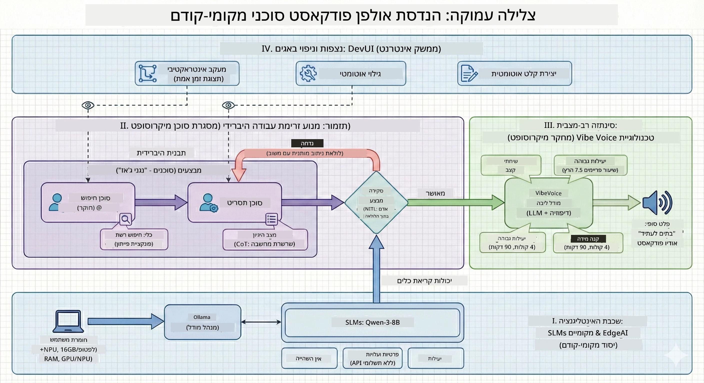

<!--
CO_OP_TRANSLATOR_METADATA:
{
  "original_hash": "f94e745264597bc5d8df967ead2eff97",
  "translation_date": "2026-01-05T10:44:14+00:00",
  "source_file": "WorkshopForAgentic/README.md",
  "language_code": "he"
}
-->
# 🎙️ סדנת The AI Podcast Studio

> 🌏 [中文版 (גרסה סינית)](translation/zh-cn/README.md)


## המשימה שלך

ברוכים הבאים ל-**The AI Podcast Studio**! אתה עומד להשיק פודקאסט טכנולוגי משלך בשם "Future Bytes" — אבל הנה הפיתול: תבנה צוות הפקה המופעל על ידי בינה מלאכותית שיעזור לך ליצור אותו. לא עוד שעות אינסופיות של מחקר, כתיבת תסריטים ועריכת קול. במקום זאת, תתכנת בדרך להפוך למפיק פודקאסטים עם כוחות-על של בינה מלאכותית.

## הסיפור

תאר לעצמך: אתה והחברים שלך רוצים להתחיל פודקאסט על מגמות טכנולוגיות שוות, אבל כולם עסוקים בבית ספר, עבודה או פשוט החיים. מה אם תוכל לבנות צוות של סוכני בינה מלאכותית שיעשו את העבודה הקשה? סוכן אחד חוקר נושאים, אחר כותב תסריטים מרתקים, ושלישי הופך טקסט לשיחות טבעיות. נשמע כמו מדע בדיוני? בואו נעשה את זה למציאות.

## מה תלמד

בסיום הסדנה הזו, תדע איך:
- 🤖 לפרוס מודל AI מקומי משלך (בלי עלויות API, בלי תלות בענן!)
- 🔧 לבנות סוכני AI מתמחים שעובדים ביחד באמת
- 🎬 ליצור צינור הפקה שלם לפודקאסט מהרעיונות ועד לאודיו

## המסע שלך: שלושה מעשים



כמו בכל סיפור טוב, יש לנו שלושה מעשים. כל אחד בונה את סטודיו הפודקאסט שלך חלק אחר חלק:

| פרק | המשימה שלך | מה קורה | כישורים שנלמדו |
|---------|-----------|--------------|----------------|
| **מעשה 1** | [פגוש את סוכני הבינה המלאכותית שלך](md/01.BuildAIAgentWithSLM.md) | תגלה איך ליצור סוכני AI שיכולים לצ'אט, לחפש באינטרנט ואפילו לפתור בעיות. תחשוב עליהם כמתמחים במחקר שלעולם לא ישנים. | 🎯 לבנות את הסוכן הראשון שלך<br>🛠️ לתת לו כוח-על (כלים!)<br>🧠 ללמד אותו לחשוב<br>🌐 לחבר אותו לאינטרנט |
| **מעשה 2** | [הרכב את צוות ההפקה שלך](md/02.AIAgentOrchestrationAndWorkflows.md) | עכשיו הדברים נעשים מעניינים! תתאם בין סוכני AI מרובים שיעבדו יחד כמו צוות פודקאסט אמיתי. אחד מחקר, אחד כותב, ואתה מאשר — עבודת צוות מביאה להצלחה. | 🎭 לתאם בין סוכנים רבים<br>🔄 לבנות תהליכי אישור<br>🖥️ לבדוק עם ממשק DevUI<br>✋ לשמור על שליטת האדם |
| **מעשה 3** | [החיה את הפודקאסט שלך](md/03.Multi-SpeakerPodcastGenerationWithVibeVoice.md) | הגמר! המרה של תסריטי טקסט לפודקאסט אודיו אמיתי עם קולות ריאליסטיים ושיחות טבעיות. הפודקאסט "Future Bytes" שלך מוכן לצאת לדרך! | 🎤 קסם טקסט-לדיבור<br>👥 קולות של מספר דוברים<br>⏱️ אודיו ארוך טווח<br>🚀 אוטומציה מלאה |

כל מעשה פותח יכולות חדשות. אפשר לדלג אם אתה אמיץ, אבל אנחנו ממליצים לעקוב אחר הסיפור!

## דרישות סביבה

הסדנה תומכת בסביבות חומרה שונות:
- **CPU**: מתאים לבדיקות ושימוש בקנה מידה קטן
- **GPU**: מומלץ לסביבות ייצור, משפר משמעותית את מהירות החישוב
- **NPU**: תומך באצת יחידת עיבוד עצבית מדור הבא

## מה תצטרך

### רשימת תוכנה ✅
- **Python 3.10+** (שפת התכנות שלך)
- **Ollama** (מריץ מודלים של AI במחשב שלך)
- **VS Code** (עורך הקוד שלך)
- **הרחבת Python** (עושה את VS Code לחכם יותר)
- **Git** (לקחת את הקוד)

### בדיקת חומרה 💻
- **האם המערכת שלי מתאימה?**: 8GB RAM, 10GB שטח פנוי (עובד, אבל עשוי להיות איטי)
- **הגדרה אידיאלית**: 16GB+ RAM, GPU טוב (שיטפון חלק!)
- **יש NPU?**: אפילו יותר טוב! ביצועים של הדור הבא זמינים 🚀

## הקמת הסטודיו שלך 🎬

### שלב 1: הטעינת פייתון

ודא שיש לך Python 3.10 או חדש יותר:

```bash
python --version
# אמור להראות Python 3.10.x או גרסה גבוהה יותר
```

אין פייתון? הורד מ-[python.org](https://python.org) — חינם!

### שלב 2: התקן את Ollama (מריץ המודל שלך)

גש ל-[ollama.ai](https://ollama.ai) והורד את Ollama למערכת ההפעלה שלך. תחשוב עליו כמנוע שמריץ את מודלי ה-AI שלך מקומית.

בדוק אם הוא מוכן:

```bash
ollama --version
```

### שלב 3: הורד את המודל AI שלך 🧠

הגיע הזמן לקחת את מודל Qwen-3-8B (זה כמו לשכור את עוזר ה-AI הראשון שלך):

```bash
ollama pull qwen3:8b
```

*זה עשוי לקחת כמה דקות. זמן מצוין להפסקת קפה! ☕*

### שלב 4: התקן את VS Code

הורד [Visual Studio Code](https://code.visualstudio.com/) אם עדיין אין לך. זה העורך הכי טוב (תתמודד איתי 😄).

### שלב 5: הרחבת Python

ב-VS Code:
1. לחץ `Ctrl+Shift+X` (או `Cmd+Shift+X` ב-Mac)
2. חפש "Python"
3. התקן את ההרחבה הרשמית של מייקרוסופט ל-Python

### שלב 6: אתה מוכן! 🎉

באמת, אתה מוכן להתקדם. בוא נבנה קצת קסמי AI!

### שלב 7: התקן את Microsoft Agent Framework והחבילות הנלוות 📦

התקן את כל התלויות הדרושות לסדנה:

```bash
pip install -r ./Installations/requirements.txt -U
```

*זה יתקין את Microsoft Agent Framework ואת כל החבילות הדרושות. קח קפה — ההתקנה הראשונה עשויה לקחת כמה דקות! ☕*

## הוראות הסדנה

המבנה המפורט של הפרויקט, שלבי הקונפיגורציה ושיטות ההרצה יסופקו צעד אחר צעד במהלך הסדנה.

## פתרון בעיות (כשדברים משתבשים) 🔧

### "אוי לא, ההורדה של המודל לוקחת לנצח!"
**תיקון**: השתמש ב-VPN או הגדר במערכת Ollama מקור מראה. לפעמים האינטרנט פשוט לא מת cooperation.

### "המחשב שלי גוסס! אין זיכרון!"
**תיקון**: החלף למודל קטן יותר או שנה את הגדרת `num_ctx` כדי להשתמש בפחות זיכרון. תחשוב על זה כמו דיאטה ל-AI שלך.

### "אפשר להאיץ עם GPU שלי?"
**תיקון**: Ollama מזהה GPUs באופן אוטומטי! רק ודא שדרייברי ה-GPU מעודכנים. שדרוג חינם למהירות! 🏎️

## משאבים נוספים (לסקרנים) 📚

- [Ollama Docs](https://github.com/ollama/ollama) — למידה מעמיקה על מודלי AI מקומיים
- [Microsoft Agent Framework](https://microsoft.github.io/autogen/) — למדו עוד על בניית צוותי סוכנים
- [מידע על מודל Qwen](https://qwenlm.github.io/) — הכירו את המוח של עוזר ה-AI שלכם

## רישיון

רישיון MIT — בנה דברים מגניבים, שתף, ושפר את העולם! 🌍

## רוצה לתרום?

מצא באג? יש רעיון? שלח Issue או PR! אנחנו אוהבים אווירת קהילה. ✨

---

<!-- CO-OP TRANSLATOR DISCLAIMER START -->
**כתב ויתור**:  
מסמך זה תורגם באמצעות שירות תרגום מבוסס בינה מלאכותית [Co-op Translator](https://github.com/Azure/co-op-translator). למרות שאנו שואפים לדיוק, יש לקחת בחשבון כי תרגומים אוטומטיים עשויים להכיל שגיאות או אי-דיוקים. יש להתייחס למסמך המקורי בשפתו המקורית כמקור הסמכות. למידע קריטי מומלץ להיעזר בתרגום מקצועי אנושי. אנו לא אחראים לכל אי הבנה או פרשנות שגויה הנובעת משימוש בתרגום זה.
<!-- CO-OP TRANSLATOR DISCLAIMER END -->