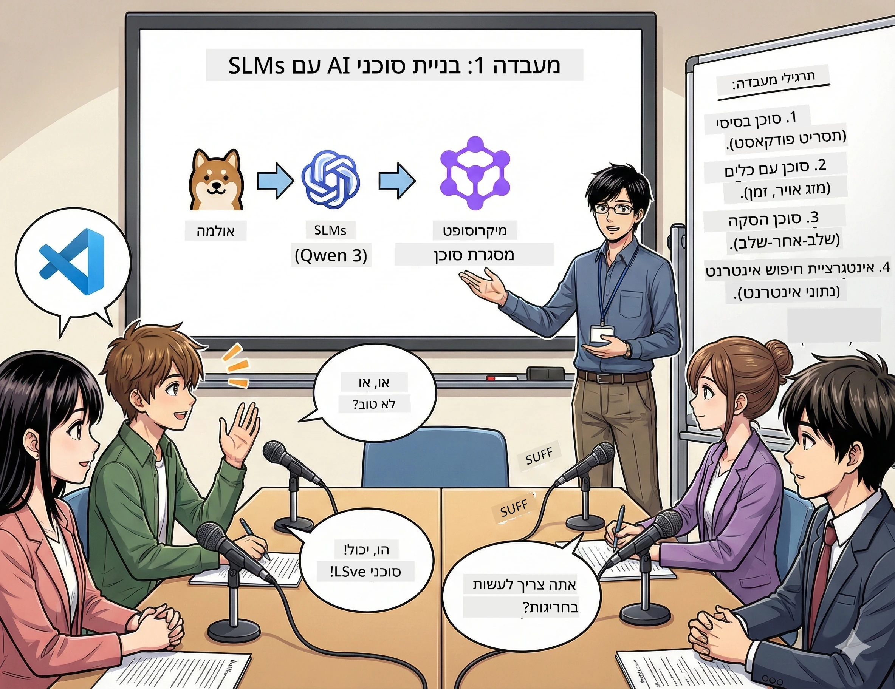

<!--
CO_OP_TRANSLATOR_METADATA:
{
  "original_hash": "7868fa418386aa7167bea3ff5ba8390b",
  "translation_date": "2026-01-05T13:08:53+00:00",
  "source_file": "WorkshopForAgentic/md/01.BuildAIAgentWithSLM.md",
  "language_code": "he"
}
-->
# מערכה 1: פגוש את העוזר המחקרי המבוסס AI שלך 🤖

## האתגר

אתה משיק את "Future Bytes," הפודקאסט הטכני החדש שלך. פרק 1 עוסק בפריצות הדרך האחרונות ב-AI, אבל יש לך 24 שעות כדי:
1. לחקור את הנושא
2. למצוא מקורות אמינים
3. לכתוב תסריט מרתק
4. לגרום לזה להישמע טבעי

**פיתול בעלילה**: אתה לא צריך לעשות את זה לבד. אתה עומד לבנות את העוזר המבוסס AI הראשון שלך שיכול לעזור בכל זה. נקרא לו אלכס — שותף המחקר הבלתי נלאה שלך שמעולם לא צריך לישון.

## למה מודלים קטנים של שפה? (רמז: הם מדהימים)

חשוב על מודלים קטנים של שפה (SLMs) כעל ה-AI האישי שלך שגר *במחשב שלך*. ללא ענן, ללא תשלומים חודשיים, ללא שיתוף נתונים חשוד.

**למה SLMs זה 🔥:**
- **🏠 רץ על המחשב שלך**: לפטופ, מחשב שולחני, אפילו Raspberry Pi חזק
- **💸 ללא עלויות שוטפות**: ללא תשלומי API שיאכלו את הכסף שלך
- **🔒 פרטיות קודם כל**: הנתונים שלך אף פעם לא עוזבים את המכשיר
- **⚡ מהירות ברק**: ללא השהיות אינטרנט, תגובות מיידיות
- **🪦 קל משקל**: 1B-10B פרמטרים לעומת 100B+ אצל הגדולים

**SLMs פופולריים**: Qwen 3, Phi-4, Gemma 3 (אנחנו משתמשים ב-Qwen בסדנה הזו)

## כלי העבודה שלך

### Ollama: מנהל דגמי ה-AI שלך

[Ollama](https://ollama.com/) הוא כמו Steam לדגמי AI. הורד, הרץ וניהל דגמים בפקודות פשוטות.

**מה עושה את זה מגניב:**
- פקודה אחת להורדה והרצה של כל דגם
- עובד על Mac, Windows, Linux
- משתמש באופן אוטומטי ב-GPU אם יש לך כזה
- יעיל בזיכרון ביותר

### Microsoft Agent Framework: איפה שהקסם קורה

[Microsoft Agent Framework](https://github.com/microsoft/agent-framework) הוא מגרש המשחקים שלך לבניית סוכני AI שיכולים:

- 💬 לדבר ולזכור על מה דיברתם
- 🛠️ להשתמש בכלים מותאמים אישית (כמו חיפוש באינטרנט או בדיקת מזג אוויר)
- 🧠 לחשוב דרך בעיות מורכבות שלב אחרי שלב
- 🤝 לעבוד עם סוכנים אחרים כצוות
- 🔌 להתחבר לספקי AI שונים (OpenAI, Ollama, Azure)

**אבני הבניין:**
- **סוכנים**: העוזרים שלך עם משימות ספציפיות
- **כלים**: יכולות מיוחדות שאתה נותן להם
- **זיכרון**: כדי שלא ישכחו את השיחה שלכם
- **הגיון**: ללמד אותם לחשוב, לא רק להגיב

## תמונת האימון שלך: 4 משימות

### משימה 1: צור את הסוכן הראשון שלך

📓 [פתח מחברת](../code/01.BasicAgent/00.BasicAgent-agent.ipynb)

**האתגר**: לבנות את אלכס, עוזר ה-AI שיכתוב את תסריט הפודקאסט שלך. אלכס צריך ליצור דו-שיח בין שני מגישים שמדברים על נושאים טכנולוגיים.

**מה תלמד:**
- איך להעיר סוכן AI (זה קל יותר מלקום ביום שני)
- לתת לו אישיות והוראות
- לגרום לו ליצור תסריטי פודקאסט ממשיים
- להבין מה הוא אומר בחזרה אליך

**תנאי ניצחון**: אלכס יוצר תסריט לפרק הפיילוט של "Future Bytes" על AI! 🎯

### משימה 2: תן לאלכס כוחות על (כלים!)

📓 [פתח מחברת](../code/01.BasicAgent/01.BasicAgent-tools.ipynb)

**האתגר**: אלכס חכם, אבל הוא לא יודע מה מזג האוויר היום או מה השעה. בוא נתקן את זה עם כלים!

**מה תלמד:**
- ליצור פונקציות Python מותאמות כ"כלים"
- לתת לאלכס להחליט *מתי* להשתמש באיזה כלי
- לראות אותו פותר בעיות באופן עצמאי
- לשלב כמה כלים למשימות מורכבות

**תנאי ניצחון**: שאל "מה מזג האוויר בטוקיו?" ואלכס מוצא את התשובה בעצמו! ☁️

### משימה 3: למד את אלכס לחשוב

📓 [פתח מחברת](../code/01.BasicAgent/02.BasicAgent-reasoning.ipynb)

**האתגר**: לגרום לאלכס להראות את תהליך העבודה שלו. כשפותרים בעיות, אתה רוצה לראות *איך* הוא חושב, לא רק את התשובה.

**מה תלמד:**
- להפעיל "מצב הגיון" (כמו להראות את העבודה במתמטיקה)
- לראות את תהליך המחשבה השלבי של אלכס
- להבין את שיטת "שרשרת החשיבה"
- לתקן כשאלכס מתבלבל

**תנאי ניצחון**: שאל שאלה מתמטית קשה וצפה באלכס חושב עליה! 🧠

### משימה 4: חבר את אלכס לאינטרנט

📓 [פתח מחברת](../code/01.BasicAgent/03.BasicAgent-websearch.ipynb)

**האתגר**: הידע של אלכס מוגבל לתאריך מסוים. בוא נחבר אותו לאינטרנט למידע בזמן אמת!

**מה תלמד:**
- לבנות כלי חיפוש אינטרנט מותאם
- לשלב APIs חיצוניים
- לטפל בטעויות רשת בצורה חלקה
- לקבל מידע מעבר לנתוני האימון של אלכס

**תנאי ניצחון**: שאל על החדשות הטכנולוגיות של היום וקבל תוצאות טריות! 📰

## לפני שמתחילים 🚀

**ציוד נדרש**:
- Python 3.10+ מותקן
- Ollama פועל (בדוק עם `ollama --version`)
- VS Code עם תוסף Python
- לפחות 8GB RAM (16GB אם רוצים חוויה חלקה)

## סדר המשימות

עקוב אחרי המחברות לפי הסדר לסיפור מלא:

1. [00.BasicAgent-agent.ipynb](../code/01.BasicAgent/00.BasicAgent-agent.ipynb) — פגוש את אלכס (הסוכן הראשון שלך)
2. [01.BasicAgent-tools.ipynb](../code/01.BasicAgent/01.BasicAgent-tools.ipynb) — הגיע זמן להטעין כוחות!
3. [02.BasicAgent-reasoning.ipynb](../code/01.BasicAgent/02.BasicAgent-reasoning.ipynb) — למד את אלכס לחשוב
4. [03.BasicAgent-websearch.ipynb](../code/01.BasicAgent/03.BasicAgent-websearch.ipynb) — גש לאינטרנט!

## מה תלמד לשלוט בו

אחרי מערכה 1, תוכל:

- ✅ להריץ דגמי AI על חומרה פרטית (בלי צורך בענן!)
- ✅ לבנות סוכנים עם אישיות ומיומנויות מותאמות
- ✅ לתת לסוכנים כלים לפתור בעיות אמיתיות
- ✅ לגרום לסוכנים להראות את תהליך ההגיון שלהם
- ✅ לחבר סוכנים למקורות מידע חיצוניים
- ✅ לתקן כשמשהו משתבש

## כשמשהו נשבר (ואיך לתקן) 🔧

### "אלכס לא טוען! חסר זיכרון!"
**התיקון**: המחשב שלך מתקשה. נסה לסגור תוכניות אחרות, או לעבור לדגם קטן יותר. 8GB זיכרון זה המינימום.

### "אלכס כל כך איטי"
**התיקון**: הפעל האצת GPU בהגדרות Ollama. או צמצם את גודל חלון ההקשר. מצב שד מהירות פעיל! 🏎️

### "הכלים לא עובדים!"
**התיקון**: בדוק כפול את חתימות הפונקציות שלך. אלכס צריך רמזים ברורים לסוגים כדי להבין מה עושה הכלי. תחשוב על זה כמו לתת הוראות חד משמעיות.

## קישורים מועילים 🔗

- [Agent Framework Docs](https://github.com/microsoft/agent-framework) — מדריכים רשמיים ודוגמאות
- [Ollama Model Library](https://ollama.com/library) — דפדף בכל הדגמים הזמינים
- [Qwen Model](https://ollama.com/library/qwen3) — פגוש את מוח ה-AI שלך
- [Code Examples](https://github.com/microsoft/agent-framework/tree/main/python/samples) — השאל רעיונות מכאן

## הבא בתור: מערכה 2 🎬

יש לך סוכן אחד. אבל מה אם היה לך *צוות* של סוכנים שעובדים יחד? במערכה 2 תבנה את צוות ההפקה המלא לפודקאסט:
- **סוכן מחקר**: מוצא את המקורות הטובים ביותר
- **סוכן כותב**: מנסח את התסריט המושלם
- **עורך (אתה!)**: מאשר או מבקש שינויים

בוא orchestrate קצת קסם AI! → [מערכה 2: הרכב את צוות ההפקה שלך](02.AIAgentOrchestrationAndWorkflows.md)

---

**תקוע?** שאל במהלך הסדנה. כולנו לומדים יחד! 🙌

---

<!-- CO-OP TRANSLATOR DISCLAIMER START -->
**כתב ויתור:**
מסמך זה תורגם באמצעות שירות תרגום מלאכותי [Co-op Translator](https://github.com/Azure/co-op-translator). למרות שאנו שואפים לדיוק, יש לקחת בחשבון כי תרגומים אוטומטיים עלולים להכיל שגיאות או אי-דיוקים. המסמך המקורי בשפת המקור שלו צריך להיחשב כמקור הסמכותי. למידע קריטי מומלץ להשתמש בתרגום מקצועי של בני אדם. איננו אחראים לכל אי-הבנות או פרשנויות שגויות הנובעות משימוש בתרגום זה.
<!-- CO-OP TRANSLATOR DISCLAIMER END -->