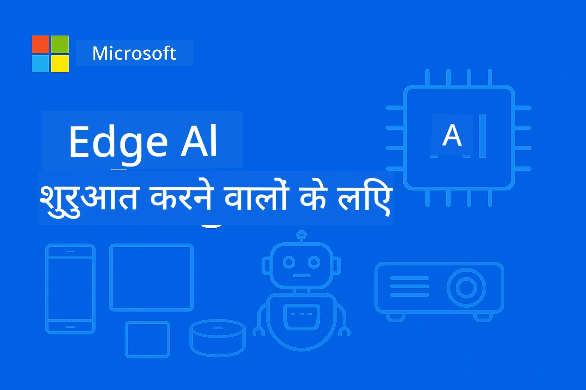

# शुरुआती लोगों के लिए EdgeAI




[](https://GitHub.com/microsoft/edgeai-for-beginners/graphs/contributors)
[](https://GitHub.com/microsoft/edgeai-for-beginners/issues)
[](https://GitHub.com/microsoft/edgeai-for-beginners/pulls)
[](http://makeapullrequest.com)

[](https://GitHub.com/microsoft/edgeai-for-beginners/watchers)
[](https://GitHub.com/microsoft/edgeai-for-beginners/fork)
[](https://GitHub.com/microsoft/edgeai-for-beginners/stargazers)


[](https://discord.gg/nTYy5BXMWG)

इन संसाधनों का उपयोग शुरू करने के लिए ये चरण फ़ॉलो करें:

1. **रिपोजिटरी को फोर्क करें**: क्लिक करें [](https://GitHub.com/microsoft/edgeai-for-beginners/fork)
2. **रिपोजिटरी को क्लोन करें**:   `git clone https://github.com/microsoft/edgeai-for-beginners.git`
3. [**Azure AI Foundry Discord में शामिल हों और विशेषज्ञों व अन्य डेवलपर्स से मिलें**](https://discord.com/invite/ByRwuEEgH4)


### 🌐 बहुभाषी समर्थन

#### GitHub Action के माध्यम से समर्थित (स्वचालित और हमेशा अपडेटेड)

<!-- CO-OP TRANSLATOR LANGUAGES TABLE START -->
[Arabic](../ar/README.md) | [Bengali](../bn/README.md) | [Bulgarian](../bg/README.md) | [Burmese (Myanmar)](../my/README.md) | [Chinese (Simplified)](../zh-CN/README.md) | [Chinese (Traditional, Hong Kong)](../zh-HK/README.md) | [Chinese (Traditional, Macau)](../zh-MO/README.md) | [Chinese (Traditional, Taiwan)](../zh-TW/README.md) | [Croatian](../hr/README.md) | [Czech](../cs/README.md) | [Danish](../da/README.md) | [Dutch](../nl/README.md) | [Estonian](../et/README.md) | [Finnish](../fi/README.md) | [French](../fr/README.md) | [German](../de/README.md) | [Greek](../el/README.md) | [Hebrew](../he/README.md) | [Hindi](./README.md) | [Hungarian](../hu/README.md) | [Indonesian](../id/README.md) | [Italian](../it/README.md) | [Japanese](../ja/README.md) | [Kannada](../kn/README.md) | [Khmer](../km/README.md) | [Korean](../ko/README.md) | [Lithuanian](../lt/README.md) | [Malay](../ms/README.md) | [Malayalam](../ml/README.md) | [Marathi](../mr/README.md) | [Nepali](../ne/README.md) | [Nigerian Pidgin](../pcm/README.md) | [Norwegian](../no/README.md) | [Persian (Farsi)](../fa/README.md) | [Polish](../pl/README.md) | [Portuguese (Brazil)](../pt-BR/README.md) | [Portuguese (Portugal)](../pt-PT/README.md) | [Punjabi (Gurmukhi)](../pa/README.md) | [Romanian](../ro/README.md) | [Russian](../ru/README.md) | [Serbian (Cyrillic)](../sr/README.md) | [Slovak](../sk/README.md) | [Slovenian](../sl/README.md) | [Spanish](../es/README.md) | [Swahili](../sw/README.md) | [Swedish](../sv/README.md) | [Tagalog (Filipino)](../tl/README.md) | [Tamil](../ta/README.md) | [Telugu](../te/README.md) | [Thai](../th/README.md) | [Turkish](../tr/README.md) | [Ukrainian](../uk/README.md) | [Urdu](../ur/README.md) | [Vietnamese](../vi/README.md)

> **स्थानीय रूप से क्लोन करना पसंद करते हैं?**
>
> इस रिपोजिटरी में 50+ भाषा अनुवाद शामिल हैं जो डाउनलोड आकार को काफी बढ़ाते हैं। अनुवाद के बिना क्लोन करने के लिए, sparse checkout का उपयोग करें:
>
> **Bash / macOS / Linux:**
> ```bash
> git clone --filter=blob:none --sparse https://github.com/microsoft/edgeai-for-beginners.git
> cd edgeai-for-beginners
> git sparse-checkout set --no-cone '/*' '!translations' '!translated_images'
> ```
>
> **CMD (Windows):**
> ```cmd
> git clone --filter=blob:none --sparse https://github.com/microsoft/edgeai-for-beginners.git
> cd edgeai-for-beginners
> git sparse-checkout set --no-cone "/*" "!translations" "!translated_images"
> ```
>
> इससे आपको तेज़ डाउनलोड के साथ पूरा कोर्स पूरा करने के लिए सब कुछ मिलेगा।
<!-- CO-OP TRANSLATOR LANGUAGES TABLE END -->

**यदि आप अतिरिक्त अनुवाद भाषाओं को समर्थित करवाना चाहते हैं, तो वो [यहाँ](https://github.com/Azure/co-op-translator/blob/main/getting_started/supported-languages.md) सूचीबद्ध हैं।**

## परिचय

**EdgeAI for Beginners** में आपका स्वागत है – Edge आर्टिफिशियल इंटेलिजेंस की परिवर्तनकारी दुनिया की आपकी व्यापक यात्रा। यह कोर्स शक्तिशाली AI क्षमताओं और एज डिवाइसेस पर व्यावहारिक, वास्तविक दुनिया की तैनाती के बीच की खाई को पाटता है, जिससे आप सीधे उन स्थानों पर AI की शक्ति का उपयोग कर सकते हैं जहाँ डेटा उत्पन्न होता है और निर्णय लेने की आवश्यकता होती है।

### आप जो सीखेंगे

यह कोर्स आपको बुनियादी अवधारणाओं से लेकर उत्पादन-योग्य कार्यान्वयन तक ले जाता है, जिनमें शामिल है:
- एज तैनाती के लिए अनुकूलित **छोटे भाषा मॉडल (SLMs)**
- विविध प्लेटफार्मों पर **हार्डवेयर-जानकारी वाले अनुकूलन**
- **गोपनीयता-संरक्षित वास्तविक समय पूर्वानुमान**
- उद्यम अनुप्रयोगों के लिए **प्रोडक्शन तैनाती** रणनीतियाँ

### EdgeAI क्यों महत्वपूर्ण है

Edge AI एक ऐसा दृष्टिकोण है जो आधुनिक चुनौतियों को संबोधित करता है:
- **गोपनीयता और सुरक्षा**: संवेदनशील डेटा को क्लाउड एक्सपोज़र के बिना स्थानीय रूप से संसाधित करें
- **रियल-टाइम प्रदर्शन**: समय-संवेदनशील अनुप्रयोगों के लिए नेटवर्क विलंबता समाप्त करें
- **लागत दक्षता**: बैंडविड्थ और क्लाउड कंप्यूटिंग खर्च कम करें
- **लचीला संचालन**: नेटवर्क आउटेज के दौरान कार्यक्षमता बनाए रखें
- **नियामक अनुपालन**: डेटा संप्रभुता आवश्यकताओं को पूरा करें

### Edge AI

Edge AI का मतलब है AI एल्गोरिदम और भाषा मॉडल को हार्डवेयर पर स्थानीय रूप से चलाना, जहाँ डेटा उत्पन्न होता है, बिना क्लाउड संसाधनों पर निर्भर रहकर पूर्वानुमान के लिए। यह विलंबता कम करता है, गोपनीयता बढ़ाता है, और वास्तविक समय निर्णय लेने को सक्षम बनाता है।

### मुख्य सिद्धांत:
- **डिवाइस पर पूर्वानुमान**: AI मॉडल एज डिवाइसेस (फोन, रूटर, माइक्रोकंट्रोलर, औद्योगिक पीसी) पर चलते हैं
- **ऑफ़लाइन क्षमता**: लगातार इंटरनेट कनेक्टिविटी के बिना कार्य करता है
- **कम विलंबता**: रियल-टाइम सिस्टम के लिए तुरंत प्रतिक्रियाएँ
- **डेटा संप्रभुता**: संवेदनशील डेटा को स्थानीय रखें, सुरक्षा और अनुपालन में सुधार करें

### छोटे भाषा मॉडल (SLMs)

Phi-4, Mistral-7B, और Gemma जैसे SLM बड़े LLMs के अनुकूलित संस्करण हैं — प्रशिक्षित या संक्षिप्त किए गए:
- **कम मेमोरी खपत**: सीमित एज डिवाइस मेमोरी का कुशल उपयोग
- **कम कंप्यूटिंग आवश्यकताएं**: CPU और एज GPU प्रदर्शन के लिए अनुकूलित
- **तेज़ स्टार्टअप समय**: प्रतिक्रियाशील अनुप्रयोगों के लिए शीघ्र प्रारंभ

वे शक्तिशाली NLP क्षमताओं को अनलॉक करते हैं जबकि निम्नलिखित प्रतिबंधों को पूरा करते हैं:
- **एम्बेडेड सिस्टम**: IoT उपकरण और औद्योगिक नियंत्रक
- **मोबाइल डिवाइसेस**: ऑफलाइन क्षमताओं वाले स्मार्टफोन और टैबलेट
- **IoT डिवाइसेस**: सीमित संसाधनों वाले सेंसर और स्मार्ट उपकरण
- **एज सर्वर**: सीमित GPU संसाधनों वाले स्थानीय प्रसंस्करण इकाइयां
- **पर्सनल कंप्यूटर**: डेस्कटॉप और लैपटॉप तैनाती परिदृश्य

## कोर्स मॉड्यूल और नेविगेशन

| मॉड्यूल | विषय | फोकस क्षेत्र | मुख्य सामग्री | स्तर | अवधि |
|--------|-------|------------|-------------|--------|----------|
| [📖 00 ](./introduction.md) | [EdgeAI का परिचय](./introduction.md) | बुनियाद और संदर्भ | EdgeAI अवलोकन • उद्योग अनुप्रयोग • SLM परिचय • शिक्षण उद्देश्यों | शुरुआती | 1-2 घंटे |
| [📚 01](../../Module01) | [EdgeAI मूल बातें](./Module01/README.md) | क्लाउड बनाम एज AI तुलना | EdgeAI मूल बातें • वास्तविक विश्व केस स्टडीज • कार्यान्वयन गाइड • एज तैनाती | शुरुआती | 3-4 घंटे |
| [🧠 02](../../Module02) | [SLM मॉडल आधार](./Module02/README.md) | मॉडल परिवार और वास्तुकला | Phi परिवार • Qwen परिवार • Gemma परिवार • BitNET • μमॉडल • Phi-Silica | शुरुआती | 4-5 घंटे |
| [🚀 03](../../Module03) | [SLM तैनाती प्रैक्टिस](./Module03/README.md) | स्थानीय और क्लाउड तैनाती | उन्नत सीखने • स्थानीय पर्यावरण • क्लाउड तैनाती | मध्यवर्ती | 4-5 घंटे |
| [⚙️ 04](../../Module04) | [मॉडल अनुकूलन टूलकिट](./Module04/README.md) | क्रॉस-प्लेटफ़ॉर्म अनुकूलन | परिचय • Llama.cpp • Microsoft Olive • OpenVINO • Apple MLX • वर्कफ़्लो संश्लेषण | मध्यवर्ती | 5-6 घंटे |
| [🔧 05](../../Module05) | [SLMOps उत्पादन](./Module05/README.md) | प्रोडक्शन संचालन | SLMOps परिचय • मॉडल डिस्टिलेशन • फाइन-ट्यूनिंग • प्रोडक्शन तैनाती | उन्नत | 5-6 घंटे |
| [🤖 06](../../Module06) | [AI एजेंट और फंक्शन कॉलिंग](./Module06/README.md) | एजेंट फ्रेमवर्क और MCP | एजेंट परिचय • फंक्शन कॉलिंग • मॉडल कॉन्टेक्स्ट प्रोटोकॉल | उन्नत | 4-5 घंटे |
| [💻 07](../../Module07) | [प्लेटफ़ॉर्म कार्यान्वयन](./Module07/README.md) | क्रॉस-प्लेटफ़ॉर्म नमूने | AI टूलकिट • Foundry Local • विंडोज डेवलपमेंट | उन्नत | 3-4 घंटे |
| [🏭 08](../../Module08) | [Foundry Local टूलकिट](./Module08/README.md) | प्रोडक्शन-तैयार नमूने | नमूना अनुप्रयोग (नीचे विवरण देखें) | विशेषज्ञ | 8-10 घंटे |

### 🏭 **मॉड्यूल 08: नमूना अनुप्रयोग**

- [01: REST चैट क्विकस्टार्ट](./Module08/samples/01/README.md)
- [02: OpenAI SDK इंटीग्रेशन](./Module08/samples/02/README.md)
- [03: मॉडल डिस्कवरी और बेंचमार्किंग](./Module08/samples/03/README.md)
- [04: Chainlit RAG एप्लिकेशन](./Module08/samples/04/README.md)
- [05: मल्टी-एजेंट ऑर्केस्ट्रेशन](./Module08/samples/05/README.md)
- [06: मॉडल-एज-टूल्स राउटर](./Module08/samples/06/README.md)
- [07: डायरेक्ट API क्लाइंट](./Module08/samples/07/README.md)
- [08: विंडोज 11 चैट ऐप](./Module08/samples/08/README.md)
- [09: उन्नत मल्टी-एजेंट सिस्टम](./Module08/samples/09/README.md)
- [10: Foundry टूल्स फ्रेमवर्क](./Module08/samples/10/README.md)

### 🎓 **वर्कशॉप: हैंड्स-ऑन सीखने का रास्ता**

पूरक हैंड्स-ऑन कार्यशाला सामग्री प्रोडक्शन-तैयार कार्यान्वयन के साथ:

- **[वर्कशॉप गाइड](./Workshop/Readme.md)** - पूर्ण सीखने के उद्देश्य, परिणाम, और संसाधन नेविगेशन
- **Python नमूने** (6 सत्र) - बेहतरीन प्रथाओं, त्रुटि हैंडलिंग, और व्यापक दस्तावेज़ों के साथ अपडेटेड
- **Jupyter नोटबुक्स** (8 इंटरैक्टिव) - चरण-दर-चरण ट्यूटोरियल्स के साथ बेंचमार्क और प्रदर्शन निगरानी
- **सत्र गाइड** - प्रत्येक कार्यशाला सत्र के लिए विस्तृत मार्कडाउन गाइड
- **मान्यता उपकरण** - कोड गुणवत्ता जांचने और स्मोक टेस्ट चलाने के लिए स्क्रिप्ट

**आप क्या बनाएंगे:**
- स्थानीय AI चैट एप्लिकेशन with स्ट्रीमिंग समर्थन
- गुणवत्ता मूल्यांकन (RAGAS) के साथ RAG पाइपलाइन्स
- मल्टी-मॉडल बेंचमार्किंग और तुलना उपकरण
- मल्टी-एजेंट ऑर्केस्ट्रेशन सिस्टम
- कार्य-आधारित चयन के साथ बुद्धिमान मॉडल राउटिंग

### 🎙️ **एजेंटिक के लिए वर्कशॉप: हैंड्स-ऑन – द AI पॉडकास्ट स्टूडियो**
शुरुआत से एक AI-पावर्ड पॉडकास्ट प्रोडक्शन पाइपलाइन बनाएं! यह इमर्सिव वर्कशॉप आपको एक पूर्ण मल्टी-एजेंट सिस्टम बनाने सिखाती है जो विचारों को पेशेवर पॉडकास्ट एपिसोड में बदलता है।

**[🎬 AI पॉडकास्ट स्टूडियो वर्कशॉप शुरू करें](./WorkshopForAgentic/README.md)**

**आपका मिशन**: "Future Bytes" लॉन्च करें — एक टेक पॉडकास्ट जो पूरी तरह से आपके द्वारा बनाए गए AI एजेंट्स द्वारा संचालित होगा। कोई क्लाउड निर्भरता नहीं, कोई API लागत नहीं — सब कुछ आपके मशीन पर स्थानीय रूप से चलता है।

**इसको खास क्या बनाता है:**
- **🤖 वास्तविक मल्टी-एजेंट ऑर्केस्ट्रेशन** - विशेषज्ञ AI एजेंट बनाएं जो शोध करें, लिखें, और ऑडियो बनाएं
- **🎯 पूर्ण प्रोडक्शन पाइपलाइन** - विषय चयन से लेकर अंतिम पॉडकास्ट ऑडियो आउटपुट तक
- **💻 100% स्थानीय तैनाती** - पूरे गोपनीयता और नियंत्रण के लिए Ollama और स्थानीय मॉडल (Qwen-3-8B) का उपयोग
- **🎤 टेक्स्ट-टू-स्पीच इंटीग्रेशन** - स्क्रिप्ट्स को प्राकृतिक सुनाई देने वाली मल्टी-स्पीकर बातचीत में बदलना
- **✋ मानव-इन-द-लूप वर्कफ्लोज़** - स्वीकृति गेट गुणवत्ता सुनिश्चित करते हैं जबकि स्वचालन जारी रहता है

**तीन-अधिनायक सीखने की यात्रा:**

| अधिनायक | फोकस | प्रमुख कौशल | अवधि |
|-----|-------|------------|----------|
| **[अधिनायक 1: अपने AI सहायक से मिलें](./WorkshopForAgentic/md/01.BuildAIAgentWithSLM.md)** | अपना पहला AI एजेंट बनाएं | टूल इंटीग्रेशन • वेब सर्च • समस्या समाधान • एजेंटिक तर्क | 2-3 घंटे |
| **[अधिनायक 2: अपनी प्रोडक्शन टीम बनाएं](./WorkshopForAgentic/md/02.AIAgentOrchestrationAndWorkflows.md)** | कई एजेंट्स का समन्वय करें | टीम समन्वय • स्वीकृति वर्कफ्लोज़ • DevUI इंटरफ़ेस • मानवीय निरीक्षण | 3-4 घंटे |
| **[अधिनायक 3: अपने पॉडकास्ट को जीवन दें](./WorkshopForAgentic/md/03.Multi-SpeakerPodcastGenerationWithVibeVoice.md)** | पॉडकास्ट ऑडियो जेनरेट करें | टेक्स्ट-टू-स्पीच • मल्टी-स्पीकर सिंथेसिस • लॉन्ग-फॉर्म ऑडियो • पूर्ण स्वचालन | 2-3 घंटे |

**प्रयुक्त प्रौद्योगिकियाँ:**
- **Microsoft Agent Framework** - मल्टी-एजेंट ऑर्केस्ट्रेशन और समन्वय
- **Ollama** - स्थानीय AI मॉडल रनटाइम (कोई क्लाउड आवश्यक नहीं)
- **Qwen-3-8B** - एजेंटिक कार्यों के लिए अनुकूलित ओपन-सोर्स भाषा मॉडल
- **텍्स्ट-टू-स्पीच एपीआई** - पॉडकास्ट उत्पादन के लिए प्राकृतिक आवाज सिंथेसिस

**हार्डवेयर समर्थन:**
- ✅ **CPU मोड** - किसी भी आधुनिक कंप्यूटर पर काम करता है (8GB+ RAM की सिफारिश)
- 🚀 **GPU एक्सेलेरेशन** - NVIDIA/AMD GPUs के साथ काफी तेज़ पूर्वानुमान
- ⚡ **NPU समर्थन** - अगली पीढ़ी के न्यूरल प्रोसेसिंग यूनिट एक्सेलेरेशन

**सभी के लिए उपयुक्त:**
- मल्टी-एजेंट AI सिस्टम सीखने वाले डेवलपर्स
- AI स्वचालन और वर्कफ्लोज़ में रुचि रखने वाले
- AI-सहायता प्राप्त उत्पादन खोजने वाले कंटेंट क्रिएटर्स
- व्यावहारिक AI ऑर्केस्ट्रेशन पैटर्न पढ़ने वाले छात्र

**शुरू करें**: [🎙️ AI पॉडकास्ट स्टूडियो वर्कशॉप →](./WorkshopForAgentic/README.md)

### 📊 **सीखने का पथ सारांश**
- **कुल अवधि**: 36-45 घंटे
- **शुरुआती पथ**: मॉड्यूल 01-02 (7-9 घंटे)  
- **मध्यम पथ**: मॉड्यूल 03-04 (9-11 घंटे)
- **उन्नत पथ**: मॉड्यूल 05-07 (12-15 घंटे)
- **विशेषज्ञ पथ**: मॉड्यूल 08 (8-10 घंटे)

## आप क्या बनाएंगे

### 🎯 मुख्य कौशल
- **एज AI आर्किटेक्चर**: क्लाउड इंटीग्रेशन के साथ स्थानीय-प्रथम AI सिस्टम डिज़ाइन करें
- **मॉडल ऑप्टिमाइज़ेशन**: एज डिप्लॉयमेंट के लिए मॉडल को क्वांटाइज़ और कंप्रेस करें (85% गति वृद्धि, 75% आकार कमी)
- **मल्टी-प्लेटफ़ॉर्म डिप्लॉयमेंट**: विंडोज़, मोबाइल, एम्बेडेड, और क्लाउड-एज हाइब्रिड सिस्टम
- **प्रोडक्शन संचालन**: एज AI की निगरानी, स्केलिंग, और रखरखाव

### 🏗️ व्यावहारिक प्रोजेक्ट्स
- **Foundry Local चैट ऐप्स**: मॉडल स्विचिंग के साथ विंडोज़ 11 नेटिव ऐप्लिकेशन
- **मल्टी-एजेंट सिस्टम्स**: जटिल वर्कफ्लोज़ के लिए समन्वयक के साथ विशेषज्ञ एजेंट  
- **RAG ऐप्लिकेशन**: वektor खोज के साथ स्थानीय दस्तावेज़ प्रसंस्करण
- **मॉडल राउटर्स**: कार्य विश्लेषण पर आधारित मॉडल के बीच बुद्धिमान चयन
- **एपीआई फ्रेमवर्क**: स्ट्रीमिंग और स्वास्थ्य निगरानी के साथ प्रोडक्शन-तैयार क्लाइंट
- **क्रॉस-प्लेटफ़ॉर्म टूल्स**: LangChain/Semantic Kernel इंटीग्रेशन पैटर्न

### 🏢 औद्योगिक अनुप्रयोग
**मैन्युफैक्चरिंग** • **हेल्थकेयर** • **स्वायत्त वाहन** • **स्मार्ट सिटीज़** • **मोबाइल ऐप्स**

## क्विक स्टार्ट

**अनुशंसित सीखने का पथ** (कुल 20-30 घंटे):

0. **📖 परिचय** ([Introduction.md](./introduction.md)): EdgeAI आधार + उद्योग संदर्भ + सीखने का फ्रेमवर्क  
1. **📚 आधार** (मॉड्यूल 01-02): EdgeAI अवधारणाएं + SLM मॉडल फैमिलीज़  
2. **⚙️ ऑप्टिमाइज़ेशन** (मॉड्यूल 03-04): डिप्लॉयमेंट + क्वांटाइज़ेशन फ्रेमवर्क  
3. **🚀 प्रोडक्शन** (मॉड्यूल 05-06): SLMOps + AI एजेंट्स + फंक्शन कॉलिंग  
4. **💻 कार्यान्वयन** (मॉड्यूल 07-08): प्लेटफॉर्म नमूने + Foundry Local टूलकिट

हर मॉड्यूल में थ्योरी, प्रायोगिक अभ्यास, और प्रोडक्शन-तैयार कोड उदाहरण शामिल हैं।

## कैरियर प्रभाव

**तकनीकी भूमिकाएं**: EdgeAI सॉल्यूशंस आर्किटेक्ट • ML इंजीनियर (एज) • IoT AI डेवलपर • मोबाइल AI डेवलपर

**औद्योगिक क्षेत्र**: मैन्युफैक्चरिंग 4.0 • हेल्थकेयर टेक • स्वायत्त सिस्टम्स • फिनटेक • कंज्यूमर इलेक्ट्रॉनिक्स

**पोर्टफोलियो प्रोजेक्ट्स**: मल्टी-एजेंट सिस्टम्स • प्रोडक्शन RAG ऐप्स • क्रॉस-प्लेटफ़ॉर्म डिप्लॉयमेंट • प्रदर्शन अनुकूलन

## रिपॉजिटरी संरचना

```
edgeai-for-beginners/
├── 📖 introduction.md  # Foundation: EdgeAI Overview & Learning Framework
├── 📚 Module01-04/     # Fundamentals → SLMs → Deployment → Optimization  
├── 🔧 Module05-06/     # SLMOps → AI Agents → Function Calling
├── 💻 Module07/        # Platform Samples (VS Code, Windows, Jetson, Mobile)
├── 🏭 Module08/        # Foundry Local Toolkit + 10 Comprehensive Samples
│   ├── samples/01-06/  # Foundation: REST, SDK, RAG, Agents, Routing
│   └── samples/07-10/  # Advanced: API Client, Windows App, Enterprise Agents, Tools
├── 🌐 translations/    # Multi-language support (8+ languages)
└── 📋 STUDY_GUIDE.md   # Structured learning paths & time allocation
```

## कोर्स हाइलाइट्स

✅ **प्रगतिशील सीखना**: सिद्धांत → अभ्यास → प्रोडक्शन डिप्लॉयमेंट  
✅ **वास्तविक केस स्टडीज़**: माइक्रोसॉफ्ट, जापान एयरलाइंस, उद्यम कार्यान्वयन  
✅ **हैंड्स-ऑन सैंपल्स**: 50+ उदाहरण, 10 व्यापक Foundry Local डेमो  
✅ **प्रदर्शन फोकस**: 85% गति सुधार, 75% आकार कमी  
✅ **मल्टी-प्लेटफ़ॉर्म**: विंडोज़, मोबाइल, एम्बेडेड, क्लाउड-एज हाइब्रिड  
✅ **प्रोडक्शन रेडी**: मॉनिटरिंग, स्केलिंग, सुरक्षा, अनुपालन फ्रेमवर्क

📖 **[अध्ययन मार्गदर्शिका उपलब्ध](STUDY_GUIDE.md)**: 20 घंटे के संरचित सीखने का पथ जिसमें समय आवंटन मार्गदर्शन और आत्म-मूल्यांकन उपकरण शामिल हैं।

---

**EdgeAI AI डिप्लॉयमेंट का भविष्य है**: स्थानीय-प्रथम, गोपनीयता-संरक्षित, और प्रभावी। इन कौशलों में महारत हासिल करें और बुद्धिमान अनुप्रयोगों की अगली पीढ़ी बनाएं।

## अन्य कोर्स

हमारी टीम अन्य कोर्स भी बनाती है! देखें:

<!-- CO-OP TRANSLATOR OTHER COURSES START -->
### LangChain
[](https://aka.ms/langchain4j-for-beginners)
[](https://aka.ms/langchainjs-for-beginners?WT.mc_id=m365-94501-dwahlin)
[](https://github.com/microsoft/langchain-for-beginners?WT.mc_id=m365-94501-dwahlin)
---

### Azure / Edge / MCP / Agents
[](https://github.com/microsoft/AZD-for-beginners?WT.mc_id=academic-105485-koreyst)
[](https://github.com/microsoft/edgeai-for-beginners?WT.mc_id=academic-105485-koreyst)
[](https://github.com/microsoft/mcp-for-beginners?WT.mc_id=academic-105485-koreyst)
[](https://github.com/microsoft/ai-agents-for-beginners?WT.mc_id=academic-105485-koreyst)

---

### जनरेटिव AI सीरीज
[](https://github.com/microsoft/generative-ai-for-beginners?WT.mc_id=academic-105485-koreyst)
[-9333EA?style=for-the-badge&labelColor=E5E7EB&color=9333EA)](https://github.com/microsoft/Generative-AI-for-beginners-dotnet?WT.mc_id=academic-105485-koreyst)
[-C084FC?style=for-the-badge&labelColor=E5E7EB&color=C084FC)](https://github.com/microsoft/generative-ai-for-beginners-java?WT.mc_id=academic-105485-koreyst)
[-E879F9?style=for-the-badge&labelColor=E5E7EB&color=E879F9)](https://github.com/microsoft/generative-ai-with-javascript?WT.mc_id=academic-105485-koreyst)

---

### मुख्य सीखना
[](https://aka.ms/ml-beginners?WT.mc_id=academic-105485-koreyst)
[](https://aka.ms/datascience-beginners?WT.mc_id=academic-105485-koreyst)
[](https://aka.ms/ai-beginners?WT.mc_id=academic-105485-koreyst)
[](https://github.com/microsoft/Security-101?WT.mc_id=academic-96948-sayoung)
[](https://aka.ms/webdev-beginners?WT.mc_id=academic-105485-koreyst)
[](https://aka.ms/iot-beginners?WT.mc_id=academic-105485-koreyst)
[](https://github.com/microsoft/xr-development-for-beginners?WT.mc_id=academic-105485-koreyst)

---

### कोपाइलट सीरीज
[](https://aka.ms/GitHubCopilotAI?WT.mc_id=academic-105485-koreyst)
[](https://github.com/microsoft/mastering-github-copilot-for-dotnet-csharp-developers?WT.mc_id=academic-105485-koreyst)
[](https://github.com/microsoft/CopilotAdventures?WT.mc_id=academic-105485-koreyst)
<!-- CO-OP TRANSLATOR OTHER COURSES END -->

## सहायता प्राप्त करना

यदि आप अटके हुए हैं या AI ऐप्स बनाने के बारे में कोई प्रश्न हैं, तो जुड़ें:

[](https://discord.gg/nTYy5BXMWG)

यदि आपके पास उत्पाद प्रतिक्रिया या निर्माण के दौरान त्रुटियाँ हैं, तो जाएं:

[](https://aka.ms/foundry/forum)

---

<!-- CO-OP TRANSLATOR DISCLAIMER START -->
**अस्वीकरण**:  
यह दस्तावेज़ AI अनुवाद सेवा [Co-op Translator](https://github.com/Azure/co-op-translator) का उपयोग करके अनूदित किया गया है। जबकि हम सटीकता के लिए प्रयासरत हैं, कृपया ध्यान दें कि स्वचालित अनुवाद में त्रुटियाँ या अशुद्धियाँ हो सकती हैं। मूल भाषा में मूल दस्तावेज़ को अधिकारिक स्रोत माना जाना चाहिए। महत्वपूर्ण जानकारी के लिए पेशेवर मानव अनुवाद की सिफारिश की जाती है। इस अनुवाद के उपयोग से उत्पन्न किसी भी गलतफहमी या गलत व्याख्या के लिए हम जिम्मेदार नहीं हैं।
<!-- CO-OP TRANSLATOR DISCLAIMER END -->