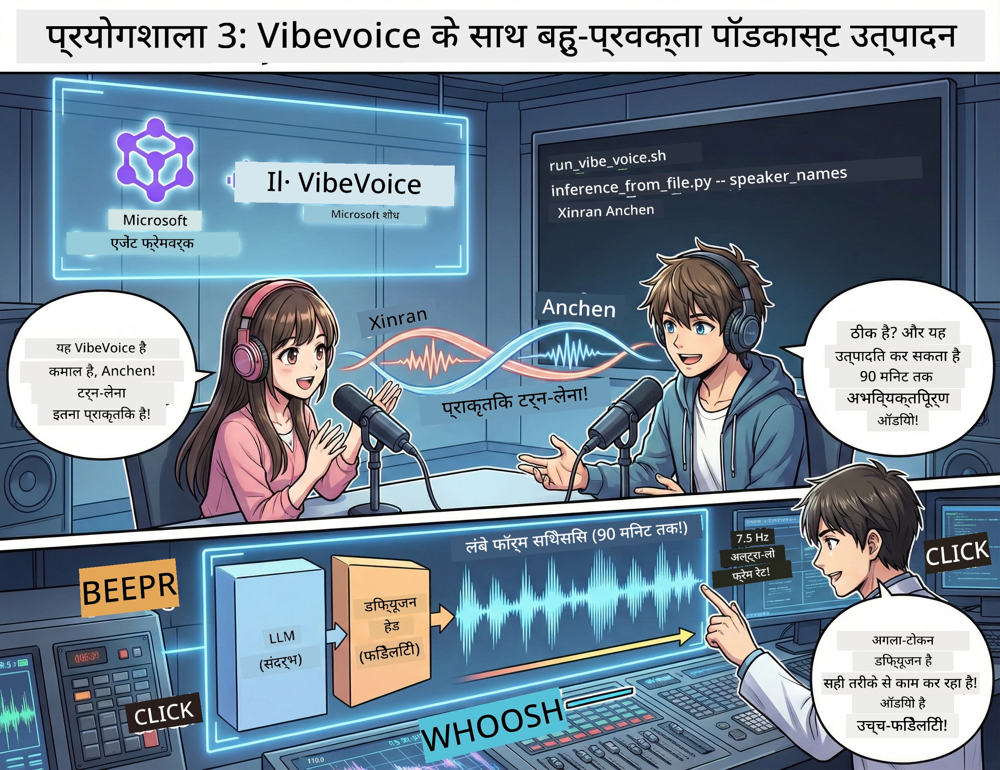

# एक्ट 3: अपने पॉडकास्ट को जीवंत बनाएं 🎤



## भव्य समापन

आपने विषयों पर शोध किया है। आपने स्क्रिप्ट लिखी है। अब सबसे मज़ेदार हिस्सा: अपने टेक्स्ट को असली पॉडकास्ट ऑडियो में बदलना, प्राकृतिक आवाज़ों के साथ!

मिलिए **VibeVoice** से — Microsoft Research की ओपन-सोर्स TTS (टेक्स्ट-टू-स्पीच) मैजिक जो बनाता है:
- 🎭 प्राकृतिक सुनने वाली बातचीत
- 👥 कई वॉयसर्स (4 तक!)
- ⏱️ लंबी अवधि का ऑडियो (90 मिनट तक!)
- 🎵 अभिव्यक्तिपूर्ण डिलीवरी (रोबोट जैसी आवाज़ नहीं!)

यह तकनीक है सिंथेटिक पॉडकास्ट के पीछे। चलिए आपका पॉडकास्ट बनाते हैं!

## VibeVoice क्या है? (काम की बातें)

VibeVoice Microsoft Research का दुनिया के लिए उपहार है। यह खासकर पॉडकास्ट-स्टाइल की बातचीत वाली ऑडियो के लिए डिज़ाइन किया गया है।

### यह शानदार क्यों है 🔥

* **⏱️ मैराथन सत्र**: 90 मिनट तक लगातार स्पीच जनरेट करता है (यानी पूरा पॉडकास्ट एपिसोड!)
* **👥 मल्टी-स्पीकर जादू**: 4 अलग-अलग आवाज़ें, जो अपनी खासियत बनाए रखती हैं
* **⚡ बेहद कुशल**: 7.5 Hz फ्रेम रेट इस्तेमाल करता है, जिससे कम्प्यूटेशन की बचत होती है
* **🧠 स्मार्ट ऑडियो**: एक LLM (संदर्भ समझने वाला) को एक डिफ्यूज़न मॉडल (हकीकत जैसा ऑडियो बनाने वाला) से जोडता है
* **🎭 प्राकृतिक प्रवाह**: टर्न-टेकिंग, पॉज़ और बातचीत की लय स्वचालित रूप से संभालता है

**अनुवाद**: VibeVoice सिर्फ आपकी स्क्रिप्ट पढ़ता नहीं है — यह वास्तविक लोगों की तरह इसे *अदाकारी* करता है।

---

## शुरू करने से पहले 🚀

**आपको क्या चाहिए**:

* 🐍 **Python 3.10+** (आपके पास पहले से Acts 1 & 2 से है)
* 🚀 **uv** (तेज़ Python पैकेज मैनेजर — हम इसे इंस्टॉल करेंगे)
* 📝 **आपकी स्क्रिप्ट**: Act 2 से `podcast.txt` फाइल (स्थान `../03.Application/` में)

**प्रो टिप**: इस कदम के लिए प्री-ट्रेंड मॉडल डाउनलोड करने हेतु अच्छी इंटरनेट कनेक्शन चाहिए। कॉफ़ी लें! ☕

---

## चलिए शुरू करें! आसान तरीका 🎬

यह बहुत आसान बनाया गया है। एक शेल स्क्रिप्ट सब करती है।

### प्रक्रिया

1. **इसे executable बनाएं**:
```bash
chmod +x run_vibe_voice.sh
```

2. **इसको चलाएं**:
```bash
./run_vibe_voice.sh
```

3. **मैजिक का इंतजार करें** (पहली बार चलाने में कुछ मिनट लग सकते हैं)

### पर्दे के पीछे क्या होता है 🎭

यह स्क्रिप्ट आपकी ऑटोमेटेड साउंड इंजीनियर की तरह काम करता है:

1. **📥 VibeVoice डाउनलोड करता है**: GitHub से आधिकारिक रिपोज़िटरी क्लोन करता है
2. **📦 डिपेंडेंसीज इंस्टॉल करता है**: `uv pip` से तेज़ी से पैकेज इंस्टाल करता है
3. **🎬 ऑडियो बनाता है**: इंडक्शन स्क्रिप्ट चलाता है:
   * `--model_path`: प्री-ट्रेंड VibeVoice-7B मॉडल
   * `--txt_path`: आपकी `podcast.txt` स्क्रिप्ट
   * `--speaker_names`: आवाज़ें असाइन करता है (डिफ़ॉल्ट Xinran & Anchen)

**परिणाम**: आपकी स्क्रिप्ट असली पॉडकास्ट एपिसोड बन जाती है! 🎉

---

## आपका मिशन 🎯

आइए इसे रोचक बनाएं:

### कार्य 1: कंटेंट बनाएं
`../03.Application/podcast.txt` को एडिट करें जिसमें दो लोगों के बीच बातचीत हो। विषय तकनीक, शौक या कुछ भी हो सकता है! इसे बातचीत जैसा बनाएं।

**फॉर्मैट उदाहरण**:
```
Speaker 1: Hey! Did you hear about the new AI model?
Speaker 2: No way! Tell me more!
Speaker 1: It's called...
```

### कार्य 2: ऑडियो बनाएं
स्क्रिप्ट चलाएं और मैजिक देखें। पहली बार में अधिक समय लगेगा (मॉडल डाउनलोडिंग के कारण)।

### कार्य 3: सुनें और विश्लेषण करें
- क्या यह प्राकृतिक लगता है?
- क्या वक्ताओं की आवाज़ें अलग-अलग लगती हैं?
- टर्न-टेकिंग सुचारू है?
- क्या कोई रोबोटिक पल हैं?

### कार्य 4: प्रयोग करें (साहसी लोगों के लिए)
`run_vibe_voice.sh` एडिट करें और `--speaker_names` बदलें ताकि विभिन्न आवाज़ संयोजन आजमाएं। VibeVoice में कई प्री-ट्रेंड आवाज़ें हैं!

**बोनस चैलेंज**: 3-स्पीकर बातचीत भी ट्राय करें! 🎆

---

## और जानें 📚

* **🏠 प्रोजेक्ट होमपेज**: [VibeVoice Official Site](https://microsoft.github.io/VibeVoice/)
* **🤗 प्री-ट्रेंड मॉडल**: [Hugging Face - VibeVoice-7B](https://huggingface.co/vibevoice/VibeVoice-7B)
* **📖 रिसर्च पेपर**: तकनीक में गहराई से जानने के लिए (अगर आपको पसंद हो)

> **⚠️ जिम्मेदार AI की याददाश्त**: VibeVoice शक्तिशाली है। इसका नैतिक उपयोग करें! डीपफेक्स या गुमराह करने वाली सामग्री न बनाएं। ऐसी चीज़ें बनाएं जो दूसरों की मदद करें। 🙏

---

## 🏆 बधाई हो! आपने कर दिखाया!

आपने पूरा पाइपलाइन पूरा कर लिया है:
1. ✅ **Act 1**: कस्टम टूल्स के साथ AI एजेंट बनाए
2. ✅ **Act 2**: मल्टी-एजेंट वर्कफ़्लो ऑर्केस्ट्रेट किया
3. ✅ **Act 3**: असली पॉडकास्ट ऑडियो जनरेट किया

**अब आपके पास है**:
- एक कार्यशील AI रिसर्च असिस्टेंट
- पूरा पॉडकास्ट प्रोडक्शन वर्कफ़्लो
- एक असली ऑडियो फाइल जिसे आप साझा कर सकते हैं

### आगे क्या? 🚀

**अपना पॉडकास्ट लॉन्च करें!**
- पॉडकास्ट प्लेटफ़ॉर्म्स पर अपलोड करें
- सोशल मीडिया पर शेयर करें
- सुधारते रहें और सुधार करें

**निर्माण जारी रखें!**
- अलग-अलग विषय ट्राय करें
- ज्यादा वक्ताओं के साथ प्रयोग करें
- बैकग्राउंड म्यूज़िक डालें
- वेब इंटरफ़ेस बनाएं
- पूरा प्रोसेस अपने आप चलाएं

**अपना काम शेयर करें!**
हमें टैग करें! दुनिया को दिखाएं कि आपने क्या बनाया। AI पॉडकास्ट क्रांति आपसे शुरू होती है। 🎙️

---

**सवाल? आइडिया? सफल कहानियां?** वर्कशॉप चैट में लिखें!

**सामग्री निर्माण के भविष्य में आपका स्वागत है।** 🌟

---

<!-- CO-OP TRANSLATOR DISCLAIMER START -->
**अस्वीकरण**:
यह दस्तावेज़ AI अनुवाद सेवा [Co-op Translator](https://github.com/Azure/co-op-translator) का उपयोग करके अनुवादित किया गया है। जबकि हम सटीकता के लिए प्रयास करते हैं, कृपया ध्यान दें कि स्वचालित अनुवाद में त्रुटियाँ या अशुद्धियाँ हो सकती हैं। मूल दस्तावेज़ अपनी मूल भाषा में प्रामाणिक स्रोत माना जाना चाहिए। महत्वपूर्ण जानकारी के लिए, पेशेवर मानव अनुवाद की सलाह दी जाती है। इस अनुवाद के उपयोग से उत्पन्न किसी भी गलतफहमी या गलत व्याख्या के लिए हम उत्तरदायी नहीं हैं।
<!-- CO-OP TRANSLATOR DISCLAIMER END -->