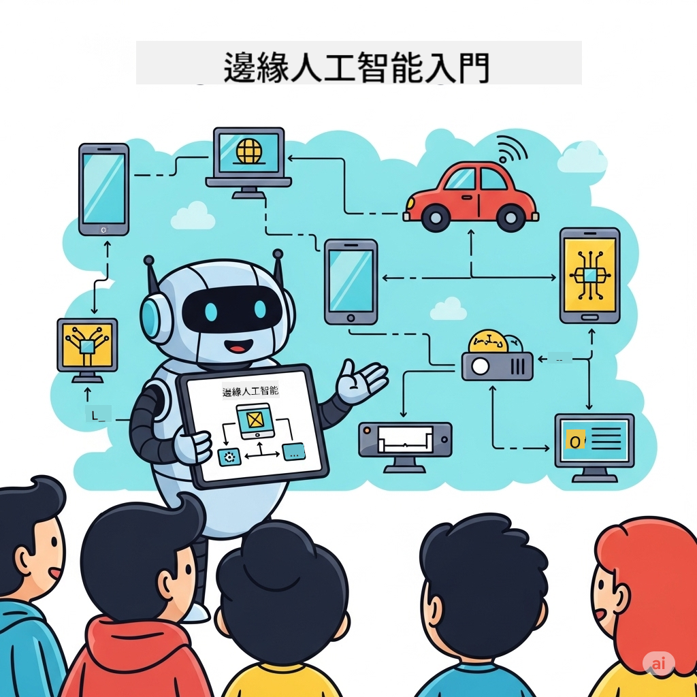

<!--
CO_OP_TRANSLATOR_METADATA:
{
  "original_hash": "c8de8ce76af1af156b1c2dee24ed23b0",
  "translation_date": "2025-12-24T23:13:08+00:00",
  "source_file": "README.md",
  "language_code": "hk"
}
-->
# EdgeAI 初學者




[](https://GitHub.com/microsoft/edgeai-for-beginners/graphs/contributors)
[](https://GitHub.com/microsoft/edgeai-for-beginners/issues)
[](https://GitHub.com/microsoft/edgeai-for-beginners/pulls)
[](http://makeapullrequest.com)

[](https://discord.gg/nTYy5BXMWG)

按照以下步驟開始使用這些資源：

1. **分叉儲存庫**: Click [](https://GitHub.com/microsoft/edgeai-for-beginners/fork)
2. **克隆儲存庫**:   `git clone https://github.com/microsoft/edgeai-for-beginners.git`
3. [**加入 Azure AI Foundry 的 Discord，與專家及其他開發者交流**](https://discord.com/invite/ByRwuEEgH4)


### 🌐 多語言支援

#### 透過 GitHub Action 支援（自動化且保持最新）

<!-- CO-OP TRANSLATOR LANGUAGES TABLE START -->
[阿拉伯語](../ar/README.md) | [孟加拉語](../bn/README.md) | [保加利亞語](../bg/README.md) | [緬甸語（緬甸）](../my/README.md) | [中文（簡體）](../zh/README.md) | [中文（繁體，香港）](./README.md) | [中文（繁體，澳門）](../mo/README.md) | [中文（繁體，台灣）](../tw/README.md) | [克羅地亞語](../hr/README.md) | [捷克語](../cs/README.md) | [丹麥語](../da/README.md) | [荷蘭語](../nl/README.md) | [愛沙尼亞語](../et/README.md) | [芬蘭語](../fi/README.md) | [法語](../fr/README.md) | [德語](../de/README.md) | [希臘語](../el/README.md) | [希伯來語](../he/README.md) | [印地語](../hi/README.md) | [匈牙利語](../hu/README.md) | [印尼語](../id/README.md) | [義大利語](../it/README.md) | [日語](../ja/README.md) | [卡納達語](../kn/README.md) | [韓語](../ko/README.md) | [立陶宛語](../lt/README.md) | [馬來語](../ms/README.md) | [馬拉雅拉姆語](../ml/README.md) | [馬拉地語](../mr/README.md) | [尼泊爾語](../ne/README.md) | [尼日利亞皮欽語](../pcm/README.md) | [挪威語](../no/README.md) | [波斯語（法爾西）](../fa/README.md) | [波蘭語](../pl/README.md) | [葡萄牙語（巴西）](../br/README.md) | [葡萄牙語（葡萄牙）](../pt/README.md) | [旁遮普語（Gurmukhi）](../pa/README.md) | [羅馬尼亞語](../ro/README.md) | [俄語](../ru/README.md) | [塞爾維亞語（西里爾字母）](../sr/README.md) | [斯洛伐克語](../sk/README.md) | [斯洛文尼亞語](../sl/README.md) | [西班牙語](../es/README.md) | [斯瓦希里語](../sw/README.md) | [瑞典語](../sv/README.md) | [他加祿語（菲律賓）](../tl/README.md) | [泰米爾語](../ta/README.md) | [泰盧固語](../te/README.md) | [泰語](../th/README.md) | [土耳其語](../tr/README.md) | [烏克蘭語](../uk/README.md) | [烏爾都語](../ur/README.md) | [越南語](../vi/README.md)
<!-- CO-OP TRANSLATOR LANGUAGES TABLE END -->

**如果你希望增加其他翻譯語言，支援的語言列表列於 [這裡](https://github.com/Azure/co-op-translator/blob/main/getting_started/supported-languages.md)**

## 介紹

歡迎來到 **EdgeAI for Beginners** — 帶你全面探索具有變革性的邊緣人工智能世界。本課程銜接強大的 AI 能力與在邊緣裝置上實際部署的真實需求，讓你能夠在資料產生與決策需要被做出之處直接利用 AI 的潛力。

### 你將掌握的內容

本課程帶你從基礎概念至可投入生產的實作，涵蓋：
- **為邊緣部署優化的小型語言模型（SLMs）**
- **跨多種平台的硬體感知優化**
- **具備隱私保護能力的即時推論**
- **企業級應用的生產部署策略**

### 為何 EdgeAI 重要

Edge AI 代表一種範式轉變，可解決現代的關鍵挑戰：
- **隱私與安全性**：在本地處理敏感資料，避免雲端曝露
- **即時效能**：消除網路延遲以滿足時間敏感的應用
- **成本效益**：減少頻寬與雲端運算開銷
- **韌性營運**：在網路中斷時仍能維持功能
- **法規遵循**：符合資料主權與合規要求

### 邊緣 AI

邊緣 AI 指的是在接近資料產生地的硬體上本地執行 AI 演算法與語言模型，而無需仰賴雲端資源進行推論。它可降低延遲、增強隱私，並促成即時決策。

### 核心原則：
- **裝置端推論**：AI 模型在邊緣裝置（手機、路由器、微控制器、工業電腦）上執行
- **離線能力**：在沒有持續網路連線的情況下運作
- **低延遲**：適合即時系統的立即回應
- **資料主權**：敏感資料保留在本地，提升安全與合規性

### 小型語言模型（SLMs）

如 Phi-4、Mistral-7B 與 Gemma 等 SLMs 是大型 LLM 的優化版本—透過訓練或蒸餾來達成：
- **降低記憶體需求**：有效利用邊緣裝置有限的記憶體
- **降低運算需求**：針對 CPU 與邊緣 GPU 的效能優化
- **更快的啟動時間**：快速初始化以提高回應性

它們在滿足下列限制情況下釋放強大的 NLP 能力：
- **嵌入式系統**：IoT 裝置與工業控制器
- **行動裝置**：具離線能力的智慧型手機與平板
- **IoT 裝置**：資源有限的感測器與智慧裝置
- **邊緣伺服器**：具有限 GPU 資源的本地處理單元
- **個人電腦**：桌面與筆電部署情境

## 課程模組與導覽

| 模組 | 主題 | 重點領域 | 主要內容 | 等級 | 時長 |
|--------|-------|------------|-------------|--------|----------|
| [📖 00 ](./introduction.md) | [EdgeAI 簡介](./introduction.md) | 基礎與背景 | EdgeAI 概覽 • 行業應用 • SLM 介紹 • 學習目標 | 初學者 | 1-2 小時 |
| [📚 01](../../Module01) | [EdgeAI 基礎](./Module01/README.md) | 雲端與邊緣 AI 比較 | EdgeAI 基礎 • 真實案例研究 • 實作指南 • 邊緣部署 | 初學者 | 3-4 小時 |
| [🧠 02](../../Module02) | [SLM 模型基礎](./Module02/README.md) | 模型家族與架構 | Phi 家族 • Qwen 家族 • Gemma 家族 • BitNET • μModel • Phi-Silica | 初學者 | 4-5 小時 |
| [🚀 03](../../Module03) | [SLM 部署實務](./Module03/README.md) | 本地與雲端部署 | 進階學習 • 本地環境 • 雲端部署 | 中級 | 4-5 小時 |
| [⚙️ 04](../../Module04) | [模型優化工具箱](./Module04/README.md) | 跨平台優化 | 介紹 • Llama.cpp • Microsoft Olive • OpenVINO • Apple MLX • 工作流程綜合 | 中級 | 5-6 小時 |
| [🔧 05](../../Module05) | [SLMOps 生產運營](./Module05/README.md) | 生產運營 | SLMOps 介紹 • 模型蒸餾 • 微調 • 生產部署 | 進階 | 5-6 小時 |
| [🤖 06](../../Module06) | [AI 代理與函數呼叫](./Module06/README.md) | 代理框架與 MCP | 代理介紹 • 函數呼叫 • 模型上下文協議 | 進階 | 4-5 小時 |
| [💻 07](../../Module07) | [平台實作](./Module07/README.md) | 跨平台範例 | AI 工具包 • Foundry Local • Windows 開發 | 進階 | 3-4 小時 |
| [🏭 08](../../Module08) | [Foundry Local 工具箱](./Module08/README.md) | 生產就緒範例 | 範例應用（詳情見下） | 專家級 | 8-10 小時 |

### 🏭 **模組 08：範例應用**

- [01: REST Chat 快速上手](./Module08/samples/01/README.md)
- [02: OpenAI SDK 整合](./Module08/samples/02/README.md)
- [03: 模型偵測與基準測試](./Module08/samples/03/README.md)
- [04: Chainlit RAG 應用](./Module08/samples/04/README.md)
- [05: 多代理協調](./Module08/samples/05/README.md)
- [06: 模型即工具 路由器](./Module08/samples/06/README.md)
- [07: 直接 API 客戶端](./Module08/samples/07/README.md)
- [08: Windows 11 聊天應用](./Module08/samples/08/README.md)
- [09: 進階多代理系統](./Module08/samples/09/README.md)
- [10: Foundry 工具框架](./Module08/samples/10/README.md)

### 🎓 **工作坊：實作學習路徑**

完整的實作工作坊教材，含可投入生產的實作範例：

- **[Workshop Guide](./Workshop/Readme.md)** - 完整的學習目標、成果與資源導覽
- Python 範例 (6 堂課) - 已更新之最佳實務、錯誤處理與完整文件
- Jupyter 筆記本 (8 個互動式) - 逐步教學，含基準測試與效能監控
- 課程指南 - 每堂工作坊課程的詳細 Markdown 指南
- 驗證工具 - 用於檢查程式碼品質與執行煙霧測試的腳本

**你將會建立：**
- 支援串流的本地 AI 聊天應用
- 具品質評估的 RAG 管線（RAGAS）
- 多模型基準測試與比較工具
- 多代理協調系統
- 以任務為基礎的智慧模型路由

### 📊 **學習路徑摘要**
- **總時長**: 36-45 小時
- **初學者路徑**: 模組 01-02 (7-9 小時)  
- **中級路徑**: 模組 03-04 (9-11 小時)
- **進階路徑**: 模組 05-07 (12-15 小時)
- **專家路徑**: 模組 08 (8-10 小時)

## 你將會建立

### 🎯 核心能力
- **Edge AI 架構**：設計以本地優先並結合雲端的 AI 系統
- **模型優化**：將模型量化及壓縮以用於邊緣部署（提升速度85%，減少大小75%）
- **多平台部署**：Windows、行動裝置、嵌入式及雲-邊緣混合系統
- **生產操作**：在生產環境中監控、擴展及維護邊緣 AI

### 🏗️ 實用專案
- **Foundry Local Chat Apps**：具有模型切換功能的 Windows 11 原生應用程式
- **多代理系統**：以協調者與專家代理人處理複雜工作流程  
- **RAG 應用程式**：本地文件處理與向量搜尋
- **模型路由器**：根據任務分析智慧選擇模型
- **API 框架**：具備串流與健康監控的生產就緒客戶端
- **跨平台工具**：LangChain/Semantic Kernel 整合範式

### 🏢 行業應用
**製造業** • **醫療保健** • **自駕車** • **智慧城市** • **行動應用程式**

## 快速開始

**建議學習路徑**（共 20–30 小時）:

0. **📖 簡介** ([Introduction.md](./introduction.md)): EdgeAI 基礎 + 行業脈絡 + 學習框架
1. **📚 基礎** (Modules 01-02): EdgeAI 概念 + SLM 模型系列
2. **⚙️ 優化** (Modules 03-04): 部署 + 量化框架  
3. **🚀 生產** (Modules 05-06): SLMOps + AI 代理 + 函數呼叫
4. **💻 實作** (Modules 07-08): 平台範例 + Foundry Local 工具包

每個模組包含理論、實作練習，以及生產就緒的程式碼範例。

## 職涯影響

**技術職務**：EdgeAI 解決方案架構師 • 邊緣機器學習工程師 • 物聯網 AI 開發人員 • 行動 AI 開發人員

**產業領域**：智慧製造 4.0 • 醫療科技 • 自動系統 • 金融科技 • 消費性電子

**作品集專案**：多代理系統 • 生產 RAG 應用程式 • 跨平台部署 • 效能優化

## 儲存庫結構

```
edgeai-for-beginners/
├── 📖 introduction.md  # Foundation: EdgeAI Overview & Learning Framework
├── 📚 Module01-04/     # Fundamentals → SLMs → Deployment → Optimization  
├── 🔧 Module05-06/     # SLMOps → AI Agents → Function Calling
├── 💻 Module07/        # Platform Samples (VS Code, Windows, Jetson, Mobile)
├── 🏭 Module08/        # Foundry Local Toolkit + 10 Comprehensive Samples
│   ├── samples/01-06/  # Foundation: REST, SDK, RAG, Agents, Routing
│   └── samples/07-10/  # Advanced: API Client, Windows App, Enterprise Agents, Tools
├── 🌐 translations/    # Multi-language support (8+ languages)
└── 📋 STUDY_GUIDE.md   # Structured learning paths & time allocation
```

## 課程亮點

✅ **循序漸進學習**：理論 → 實作 → 生產部署  
✅ **實際案例研究**：Microsoft、Japan Airlines、企業實作  
✅ **實作範例**：超過 50 個範例，10 個完整的 Foundry Local 示範  
✅ **效能重點**：速度提升 85%、大小縮減 75%  
✅ **多平台**：Windows、行動、嵌入式、雲-邊緣混合  
✅ **生產就緒**：監控、擴展、安全與合規框架

📖 **[學習指南（可用）](STUDY_GUIDE.md)**：結構化的 20 小時學習路徑，含時間分配建議與自我評估工具。

---

**EdgeAI 代表 AI 部署的未來**：以本地為先、保護隱私且高效。掌握這些技能以構建下一代智慧應用。

## 其他課程

我們的團隊還有其他課程！看看：

<!-- CO-OP TRANSLATOR OTHER COURSES START -->
### LangChain
[](https://aka.ms/langchain4j-for-beginners)
[](https://aka.ms/langchainjs-for-beginners?WT.mc_id=m365-94501-dwahlin)

---

### Azure / 邊緣 / MCP / 代理
[](https://github.com/microsoft/AZD-for-beginners?WT.mc_id=academic-105485-koreyst)
[](https://github.com/microsoft/edgeai-for-beginners?WT.mc_id=academic-105485-koreyst)
[](https://github.com/microsoft/mcp-for-beginners?WT.mc_id=academic-105485-koreyst)
[](https://github.com/microsoft/ai-agents-for-beginners?WT.mc_id=academic-105485-koreyst)

---
 
### 生成式 AI 系列
[](https://github.com/microsoft/generative-ai-for-beginners?WT.mc_id=academic-105485-koreyst)
[-9333EA?style=for-the-badge&labelColor=E5E7EB&color=9333EA)](https://github.com/microsoft/Generative-AI-for-beginners-dotnet?WT.mc_id=academic-105485-koreyst)
[-C084FC?style=for-the-badge&labelColor=E5E7EB&color=C084FC)](https://github.com/microsoft/generative-ai-for-beginners-java?WT.mc_id=academic-105485-koreyst)
[-E879F9?style=for-the-badge&labelColor=E5E7EB&color=E879F9)](https://github.com/microsoft/generative-ai-with-javascript?WT.mc_id=academic-105485-koreyst)

---
 
### 核心學習
[](https://aka.ms/ml-beginners?WT.mc_id=academic-105485-koreyst)
[](https://aka.ms/datascience-beginners?WT.mc_id=academic-105485-koreyst)
[](https://aka.ms/ai-beginners?WT.mc_id=academic-105485-koreyst)
[](https://github.com/microsoft/Security-101?WT.mc_id=academic-96948-sayoung)
[](https://aka.ms/webdev-beginners?WT.mc_id=academic-105485-koreyst)
[](https://aka.ms/iot-beginners?WT.mc_id=academic-105485-koreyst)
[](https://github.com/microsoft/xr-development-for-beginners?WT.mc_id=academic-105485-koreyst)

---
 
### Copilot 系列
[](https://aka.ms/GitHubCopilotAI?WT.mc_id=academic-105485-koreyst)
[](https://github.com/microsoft/mastering-github-copilot-for-dotnet-csharp-developers?WT.mc_id=academic-105485-koreyst)
[](https://github.com/microsoft/CopilotAdventures?WT.mc_id=academic-105485-koreyst)
<!-- CO-OP TRANSLATOR OTHER COURSES END -->

## 尋求協助

如果遇到困難或對構建 AI 應用有任何疑問，加入：

[](https://discord.gg/nTYy5BXMWG)

如果你在構建時有產品回饋或發現錯誤，請造訪：

[](https://aka.ms/foundry/forum)

---

<!-- CO-OP TRANSLATOR DISCLAIMER START -->
免責聲明：

本文件經由 AI 翻譯服務 [Co-op Translator](https://github.com/Azure/co-op-translator) 翻譯。儘管我們力求準確，請注意自動翻譯可能包含錯誤或不準確之處。原始語言版本應視為具權威性的來源。若涉及重要資訊，建議採用專業人工翻譯。對因使用本翻譯而引致的任何誤解或誤釋，我們概不負責。
<!-- CO-OP TRANSLATOR DISCLAIMER END -->