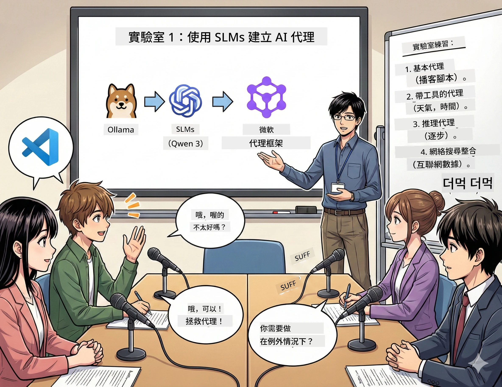

<!--
CO_OP_TRANSLATOR_METADATA:
{
  "original_hash": "7868fa418386aa7167bea3ff5ba8390b",
  "translation_date": "2026-01-05T12:46:24+00:00",
  "source_file": "WorkshopForAgentic/md/01.BuildAIAgentWithSLM.md",
  "language_code": "hk"
}
-->
# Act 1: 認識你的 AI 研究助理 🤖

## 挑戰任務

你正在推出「Future Bytes」這個新科技播客。第一集主題是最新的 AI 突破，但你只有 24 小時來：
1. 研究主題
2. 找到可靠來源
3. 撰寫引人入勝的腳本
4. 讓它聽起來自然流暢

**劇情反轉**：你不必獨自完成。你即將建立第一個 AI 助理，幫助你完成這一切。讓我們稱他為 Alex — 你那位永不需睡眠的勤奮研究夥伴。

## 為什麼選擇小型語言模型？（劇透：它們超讚）

把小型語言模型（SLMs）想成你的專屬 AI，就住在*你的*電腦裡。不需用雲端、不需月費，也不用擔心偷跑資料。

**小型語言模型的優點🔥：**
- **🏠 在你的機器上運行**：筆電、桌機，甚至超強的 Raspberry Pi
- **💸 零持續成本**：不需付 API 費，省錢又省心
- **🔒 隱私優先**：你的資料絕不離開裝置
- **⚡ 極速反應**：無需網絡延遲，即時回覆
- **🪦 輕巧高效**：參數規模 1B-10B，比起大模型的 100B+ 輕巧許多

**熱門 SLM**：Qwen 3、Phi-4、Gemma 3（本工作坊使用 Qwen）

## 你的工具箱

### Ollama：你的 AI 模型管理員

[Ollama](https://ollama.com/) 就像 AI 模型界的 Steam。透過簡單指令下載、運行和管理模型。

**厲害之處：**
- 一條指令下載並啟動任何模型
- 支援 Mac、Windows、Linux
- 有 GPU 自動加速功能
- 記憶體使用超高效

### Microsoft Agent Framework：魔法的搖籃

[Microsoft Agent Framework](https://github.com/microsoft/agent-framework) 是你打造 AI 代理的遊樂場，可以：

- 💬 聊天並記住你的對話
- 🛠️ 使用自訂工具（像是搜尋網頁或查天氣）
- 🧠 分步思考複雜問題
- 🤝 與其他代理協同作業
- 🔌 連接不同 AI 供應商（OpenAI、Ollama、Azure）

**基石組件：**
- **代理 (Agents)**：專門執行特定任務的 AI 助理
- **工具 (Tools)**：賦予它們的特殊技能
- **記憶 (Memory)**：不會忘記對話內容
- **推理 (Reasoning)**：教它們思考，而不只是回應

## 你的訓練篇章：4 個任務

### 任務 1：建立你的第一個代理

📓 [開啟筆記本](../code/01.BasicAgent/00.BasicAgent-agent.ipynb)

**任務目標**：打造 Alex，為你的播客撰寫腳本的 AI。Alex 需能生成兩位主持人討論科技話題的對話。

**你會學到：**
- 如何喚醒 AI 代理（比星期一早上起床還簡單）
- 給它賦予個性和指令
- 讓它產出真正的播客腳本
- 理解它回覆你說什麼

**勝利條件**：Alex 寫出「Future Bytes」首集關於 AI 的節目腳本！🎯

### 任務 2：賦予 Alex 超能力（工具！）

📓 [開啟筆記本](../code/01.BasicAgent/01.BasicAgent-tools.ipynb)

**任務目標**：Alex 很聰明，但它不知道今天天氣和時間。讓我們裝上專屬工具解決它！

**你會學到：**
- 創建自訂 Python 函數作為「工具」
- 讓 Alex 自行決定*何時*使用哪種工具
- 觀察它自主解題
- 結合多個工具完成複雜任務

**勝利條件**：問「東京今天天氣如何？」Alex 能自動查出答案！☁️

### 任務 3：教 Alex 思考

📓 [開啟筆記本](../code/01.BasicAgent/02.BasicAgent-reasoning.ipynb)

**任務目標**：讓 Alex 展示它的思考過程。解題時，你想知道它*怎麼*想到答案，而不只是答案本身。

**你會學到：**
- 啟用「推理模式」（就像數學課上寫出解題步驟）
- 看 Alex 一步步思考
- 了解連鎖思維提示（chain-of-thought prompting）
- 當 Alex 迷糊時怎麼除錯

**勝利條件**：問一個複雜數學題，並看它思路清晰地解題！🧠

### 任務 4：連上網絡

📓 [開啟筆記本](../code/01.BasicAgent/03.BasicAgent-websearch.ipynb)

**任務目標**：Alex 的知識有截止日期，讓它連上網路查詢即時資訊！

**你會學到：**
- 製作自訂網路搜尋工具
- 整合外部 API
- 優雅處理網絡錯誤
- 獲取 Alex 訓練資料之外的資訊

**勝利條件**：問今天的科技新聞，得到最新結果！📰

## 開始前須知 🚀

**必備配備：**
- 已安裝 Python 3.10 以上版本
- Ollama 運行中（用 `ollama --version` 檢查）
- VS Code 並安裝 Python 擴充套件
- 至少 8GB 記憶體（16GB 以上更順暢）

## 任務執行順序

依序閱讀筆記本，完成完整故事：

1. [00.BasicAgent-agent.ipynb](../code/01.BasicAgent/00.BasicAgent-agent.ipynb) — 認識 Alex（你的第一個代理）
2. [01.BasicAgent-tools.ipynb](../code/01.BasicAgent/01.BasicAgent-tools.ipynb) — 開啟強化模式！
3. [02.BasicAgent-reasoning.ipynb](../code/01.BasicAgent/02.BasicAgent-reasoning.ipynb) — 教 Alex 思考
4. [03.BasicAgent-websearch.ipynb](../code/01.BasicAgent/03.BasicAgent-websearch.ipynb) — 解鎖網路連接！

## 你將掌握的技能

經過 Act 1，你將能：

- ✅ 在本地硬體運行 AI 模型（無需雲端）
- ✅ 建立具特定個性與技能的代理
- ✅ 給代理加上可解決真實問題的工具
- ✅ 讓代理展示推理過程
- ✅ 連接代理到外部資料來源
- ✅ 出錯時能夠除錯

## 常見問題與解決方式 🔧

### 「Alex 載入不了！記憶體不足！」
**解決方法**：你的電腦負荷過重。試著關閉其他應用，或使用較小的模型。8GB 是最低門檻。

### 「Alex 反應超慢」
**解決方法**：在 Ollama 設定啟用 GPU 加速。或縮小上下文視窗大小。開啟速度狂熱模式！🏎️

### 「工具沒反應！」
**解決方法**：確認你的函式定義無誤。Alex 需要正確的型態提示，才能理解工具功能。就像給明確指令一樣。

## 便利連結 🔗

- [Agent Framework 文件](https://github.com/microsoft/agent-framework) — 官方指南與範例
- [Ollama 模型庫](https://ollama.com/library) — 瀏覽所有可用模型
- [Qwen 模型](https://ollama.com/library/qwen3) — 你 AI 的大腦
- [程式碼範例](https://github.com/microsoft/agent-framework/tree/main/python/samples) — 這邊找靈感

## 下一站：Act 2 🎬

你已經有一個代理，但如果有*一整隊*代理一起合作呢？在 Act 2，你將建立完整的播客製作團隊：
- **研究者代理**：尋找最佳資料來源
- **寫手代理**：打造完美腳本
- **編輯（你！）**：審核或請求修改

讓我們一起操控 AI 魔法！→ [Act 2: 組建你的製作團隊](02.AIAgentOrchestrationAndWorkflows.md)

---

**卡住了嗎？** 工作坊中隨時發問，我們同舟共濟！🙌

---

<!-- CO-OP TRANSLATOR DISCLAIMER START -->
**免責聲明**：  
本文件由 AI 翻譯服務 [Co-op Translator](https://github.com/Azure/co-op-translator) 進行翻譯。雖然我們力求準確，但請注意，自動翻譯可能包含錯誤或不準確之處。原始文件的母語版本應視為具權威性的資料來源。對於重要資訊，建議採用專業人工翻譯。我們不對因使用此翻譯而產生的任何誤解或誤釋承擔責任。
<!-- CO-OP TRANSLATOR DISCLAIMER END -->