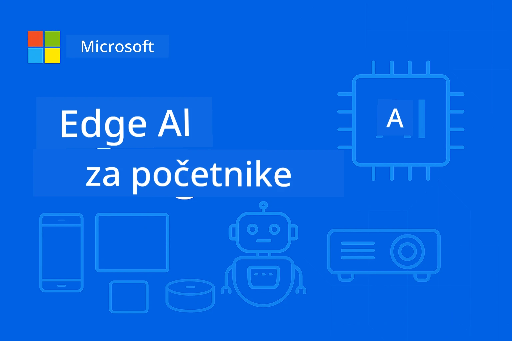

# EdgeAI za početnike




[](https://GitHub.com/microsoft/edgeai-for-beginners/graphs/contributors)
[](https://GitHub.com/microsoft/edgeai-for-beginners/issues)
[](https://GitHub.com/microsoft/edgeai-for-beginners/pulls)
[](http://makeapullrequest.com)

[](https://GitHub.com/microsoft/edgeai-for-beginners/watchers)
[](https://GitHub.com/microsoft/edgeai-for-beginners/fork)
[](https://GitHub.com/microsoft/edgeai-for-beginners/stargazers)


[](https://discord.gg/nTYy5BXMWG)

Slijedite ove korake da biste započeli korištenje ovih resursa:

1. **Napravite fork repozitorija**: Kliknite [](https://GitHub.com/microsoft/edgeai-for-beginners/fork)
2. **Klonirajte repozitorij**: `git clone https://github.com/microsoft/edgeai-for-beginners.git`
3. [**Pridružite se Azure AI Foundry Discord zajednici i upoznajte stručnjake i ostale programere**](https://discord.com/invite/ByRwuEEgH4)


### 🌐 Višejezična podrška

#### Podržano putem GitHub Action (Automatski i uvijek ažurirano)

<!-- CO-OP TRANSLATOR LANGUAGES TABLE START -->
[Arapski](../ar/README.md) | [Bengalski](../bn/README.md) | [Bugarski](../bg/README.md) | [Burmanski (Myanmar)](../my/README.md) | [Kineski (pojednostavljeni)](../zh-CN/README.md) | [Kineski (tradicionalni, Hong Kong)](../zh-HK/README.md) | [Kineski (tradicionalni, Makao)](../zh-MO/README.md) | [Kineski (tradicionalni, Tajvan)](../zh-TW/README.md) | [Hrvatski](./README.md) | [Češki](../cs/README.md) | [Danski](../da/README.md) | [Nizozemski](../nl/README.md) | [Estonski](../et/README.md) | [Finski](../fi/README.md) | [Francuski](../fr/README.md) | [Njemački](../de/README.md) | [Grčki](../el/README.md) | [Hebrejski](../he/README.md) | [Hindski](../hi/README.md) | [Mađarski](../hu/README.md) | [Indonezijski](../id/README.md) | [Talijanski](../it/README.md) | [Japanski](../ja/README.md) | [Kanadski](../kn/README.md) | [Korejski](../ko/README.md) | [Litvanski](../lt/README.md) | [Malezijski](../ms/README.md) | [Malajalamski](../ml/README.md) | [Marati](../mr/README.md) | [Nepalski](../ne/README.md) | [Nigerijski pidgin](../pcm/README.md) | [Norveški](../no/README.md) | [Perzijski (Farsi)](../fa/README.md) | [Poljski](../pl/README.md) | [Portugalski (Brazil)](../pt-BR/README.md) | [Portugalski (Portugal)](../pt-PT/README.md) | [Punjabi (Gurmuki)](../pa/README.md) | [Rumunjski](../ro/README.md) | [Ruski](../ru/README.md) | [Srpski (ćirilica)](../sr/README.md) | [Slovački](../sk/README.md) | [Slovenski](../sl/README.md) | [Španjolski](../es/README.md) | [Svahili](../sw/README.md) | [Švedski](../sv/README.md) | [Tagalog (Filipinski)](../tl/README.md) | [Tamil](../ta/README.md) | [Telugu](../te/README.md) | [Tajlandski](../th/README.md) | [Turski](../tr/README.md) | [Ukrajinski](../uk/README.md) | [Urdu](../ur/README.md) | [Vijetnamski](../vi/README.md)

> **Preferirate klonirati lokalno?**

> Ovaj repozitorij uključuje preko 50 prijevoda što značajno povećava veličinu preuzimanja. Da biste klonirali bez prijevoda, koristite sparse checkout:
> ```bash
> git clone --filter=blob:none --sparse https://github.com/microsoft/edgeai-for-beginners.git
> cd edgeai-for-beginners
> git sparse-checkout set --no-cone '/*' '!translations' '!translated_images'
> ```
> Ovo vam daje sve što trebate za završetak tečaja uz puno brže preuzimanje.
<!-- CO-OP TRANSLATOR LANGUAGES TABLE END -->

**Ako želite dodatno podržane jezike prijevoda, popis je naveden [ovdje](https://github.com/Azure/co-op-translator/blob/main/getting_started/supported-languages.md)**
## Uvod

Dobrodošli u **EdgeAI za početnike** – vaše sveobuhvatno putovanje u transformativni svijet Edge umjetne inteligencije. Ovaj tečaj premošćuje jaz između snažnih AI mogućnosti i praktične, stvarne primjene na edge uređajima, osnažujući vas da iskoristite potencijal AI-a izravno tamo gdje se podaci generiraju i gdje se trebaju donositi odluke.

### Što ćete savladati

Ovaj tečaj vodi vas od osnovnih pojmova do implementacija spremnih za produkciju, pokrivajući:
- **Mali jezični modeli (SLM-ovi)** optimizirani za edge implementaciju
- **Optimizaciju svjesnu hardvera** na različitim platformama
- **Inferencu u stvarnom vremenu** s mogućnostima zaštite privatnosti
- **Strategije produkcijskog implementiranja** za poduzeća

### Zašto je EdgeAI važan

Edge AI predstavlja paradigmatsku promjenu koja rješava ključne moderne izazove:
- **Privatnost i sigurnost**: Obrada osjetljivih podataka lokalno bez izlaganja oblaku
- **Performanse u stvarnom vremenu**: Eliminira kašnjenje mreže za aplikacije osjetljive na vrijeme
- **Troškovna učinkovitost**: Smanjuje korištenje propusnosti i troškove cloud računarstva
- **Otpornost operacija**: Održava funkcionalnost tijekom prekida mreže
- **Regulatorna usklađenost**: Ispunjava zahtjeve suvereniteta podataka

### Edge AI

Edge AI odnosi se na izvođenje AI algoritama i jezičnih modela lokalno na hardveru, blizu mjesta gdje se podaci generiraju, bez oslanjanja na cloud resurse za inferencu. Smanjuje kašnjenje, poboljšava privatnost i omogućuje donošenje odluka u stvarnom vremenu.

### Temeljna načela:
- **Inferenca na uređaju**: AI modeli se izvode na edge uređajima (telefoni, ruteri, mikrokontroleri, industrijski PC-i)
- **Mogućnost rada offline**: Funkcionira bez stalne internetske veze
- **Nisko kašnjenje**: Trenutačni odgovori prilagođeni sustavima u stvarnom vremenu
- **Suverenitet podataka**: Osjetljivi podaci ostaju lokalno, poboljšavajući sigurnost i usklađenost

### Mali jezični modeli (SLM)

SLM-ovi poput Phi-4, Mistral-7B i Gemma su optimizirane verzije većih LLM-ova — trenirani ili destilirani za:
- **Smanjeni memorijski otisak**: Učinkovito korištenje ograničene memorije edge uređaja
- **Niže zahtjeve za računanjem**: Optimizirani za CPU i edge GPU performanse
- **Brže vrijeme pokretanja**: Brza inicijalizacija za responzivne aplikacije

Oni otključavaju snažne NLP mogućnosti dok zadovoljavaju ograničenja:
- **Ugrađeni sustavi**: IoT uređaji i industrijski kontroleri
- **Mobilni uređaji**: Pametni telefoni i tableti s mogućnošću rada offline
- **IoT uređaji**: Senzori i pametni uređaji s ograničenim resursima
- **Edge serveri**: Lokalni procesorski uređaji s ograničenim GPU resursima
- **Osobna računala**: Scenariji primjene na desktop i laptop računalima

## Moduli tečaja i navigacija

| Modul | Tema | Fokus područje | Ključni sadržaj | Razina | Trajanje |
|--------|-------|------------|-------------|--------|----------|
| [📖 00 ](./introduction.md) | [Uvod u EdgeAI](./introduction.md) | Osnove i kontekst | Pregled EdgeAI • Primjene u industriji • Uvod u SLM • Ciljevi učenja | Početnik | 1-2 sata |
| [📚 01](../../Module01) | [Osnove EdgeAI](./Module01/README.md) | Usporedba cloud i edge AI | Osnove EdgeAI • Primjeri iz stvarnog svijeta • Vodič za implementaciju • Edge implementacija | Početnik | 3-4 sata |
| [🧠 02](../../Module02) | [Temelji SLM modela](./Module02/README.md) | Obitelji modela i arhitektura | Phi obitelj • Qwen obitelj • Gemma obitelj • BitNET • μModel • Phi-Silica | Početnik | 4-5 sati |
| [🚀 03](../../Module03) | [Praksa implementacije SLM-a](./Module03/README.md) | Lokalna i cloud implementacija | Napredno učenje • Lokalno okruženje • Cloud implementacija | Srednja | 4-5 sati |
| [⚙️ 04](../../Module04) | [Alati za optimizaciju modela](./Module04/README.md) | Optimizacija preko platformi | Uvod • Llama.cpp • Microsoft Olive • OpenVINO • Apple MLX • Sintetiziranje tijeka rada | Srednja | 5-6 sati |
| [🔧 05](../../Module05) | [SLMOps u produkciji](./Module05/README.md) | Produkcijski poslovi | Uvod u SLMOps • Destilacija modela • Fino podešavanje • Produkcijska implementacija | Napredna | 5-6 sati |
| [🤖 06](../../Module06) | [AI agenti i pozivanje funkcija](./Module06/README.md) | Okviri agenata i MCP | Uvod u agente • Pozivanje funkcija • Protokol konteksta modela | Napredna | 4-5 sati |
| [💻 07](../../Module07) | [Implementacija platforme](./Module07/README.md) | Primjeri za više platformi | AI alatni set • Foundry Local • Windows razvoj | Napredna | 3-4 sata |
| [🏭 08](../../Module08) | [Alati Foundry Local](./Module08/README.md) | Produkcijski spremni primjeri | Primjeri aplikacija (pogledajte detalje dolje) | Ekspert | 8-10 sati |

### 🏭 **Modul 08: Primjeri aplikacija**

- [01: REST Chat brzo pokretanje](./Module08/samples/01/README.md)
- [02: Integracija OpenAI SDK](./Module08/samples/02/README.md)
- [03: Otkriće i benchmarking modela](./Module08/samples/03/README.md)
- [04: Chainlit RAG aplikacija](./Module08/samples/04/README.md)
- [05: Orkestracija više agenata](./Module08/samples/05/README.md)
- [06: Usmjerivač modela-kao-alata](./Module08/samples/06/README.md)
- [07: Direktni API klijent](./Module08/samples/07/README.md)
- [08: Windows 11 chat aplikacija](./Module08/samples/08/README.md)
- [09: Napredni multi-agentni sustav](./Module08/samples/09/README.md)
- [10: Foundry alati okvir](./Module08/samples/10/README.md)

### 🎓 **Radionica: Put učenje kroz praksu**

Sveobuhvatni materijali za radionicu s implementacijama spremnim za produkciju:

- **[Vodič za radionicu](./Workshop/Readme.md)** - Potpuni ciljevi učenja, rezultati i navigacija resursima
- **Python primjeri** (6 sesija) - Ažurirani s najboljim praksama, rukovanjem grešaka i opsežnom dokumentacijom
- **Jupyter bilježnice** (8 interaktivnih) - Korak-po-korak tutorijali s benchmark-ovima i praćenjem performansi
- **Vodiči za sesije** - Detaljni markdown vodiči za svaku radionicu
- **Alati za validaciju** - Skripte za provjeru kvalitete koda i izvođenje smoke testova

**Što ćete izgraditi:**
- Lokalne AI chat aplikacije s podrškom za streaming
- RAG pipelines s evaluacijom kvalitete (RAGAS)
- Alate za benchmarking i usporedbu više modela
- Sustave orkestracije više agenata
- Inteligentno usmjeravanje modela s odabirom temeljenim na zadacima

### 🎙️ **Radionica za Agentic: Praktično - AI podcast studio**

Izgradite AI-pogonjen pipeline za proizvodnju podcasta od početka! Ova imerzivna radionica uči vas kako napraviti cjeloviti multi-agentni sustav koji prenosi ideje u profesionalne epizode podcasta.
**[🎬 Započnite radionicu AI Podcast Studija](./WorkshopForAgentic/README.md)**

**Vaša misija**: Pokrenite "Future Bytes" — tehnički podcast u potpunosti vođen AI agentima koje ćete sami izgraditi. Bez ovisnosti o oblaku, bez troškova API-ja — sve se izvodi lokalno na vašem računalu.

**Što ovo čini jedinstvenim:**
- **🤖 Prava višestruka orkestracija agenata** - Izgradite specijalizirane AI agente koji istražuju, pišu i produciraju audio
- **🎯 Potpuni proizvodni pipeline** - Od odabira teme do konačnog podcast audio izlaza
- **💻 100% lokalno pokretanje** - Koristi Ollama i lokalne modele (Qwen-3-8B) za potpunu privatnost i kontrolu
- **🎤 Integracija teksta u govor** - Pretvorite skripte u prirodne višeglasovne razgovore
- **✋ Radni tijekovi s ljudskim nadzorom** - Čekanja na odobrenje osiguravaju kvalitetu uz održavanje automatizacije

**Učenje u tri čina:**

| Čin | Fokus | Ključne vještine | Trajanje |
|-----|-------|------------------|----------|
| **[Čin 1: Upoznajte svoje AI Pomoćnike](./WorkshopForAgentic/md/01.BuildAIAgentWithSLM.md)** | Izgradite svog prvog AI agenta | Integracija alata • Pretraživanje weba • Rješavanje problema • Agentno rezoniranje | 2-3 sati |
| **[Čin 2: Okupite svoj producentski tim](./WorkshopForAgentic/md/02.AIAgentOrchestrationAndWorkflows.md)** | Orkestrirajte više agenata | Koordinacija tima • Radni tijekovi za odobrenje • DevUI sučelje • Ljudski nadzor | 3-4 sati |
| **[Čin 3: Oživite svoj podcast](./WorkshopForAgentic/md/03.Multi-SpeakerPodcastGenerationWithVibeVoice.md)** | Generirajte podcast audio | Tekst u govor • Višeglasovna sinteza • Dugi audio zapisi • Puna automatizacija | 2-3 sati |

**Korištene tehnologije:**
- **Microsoft Agent Framework** - Orkestracija i koordinacija višestrukih agenata
- **Ollama** - Lokalan runtime AI modela (bez potrebe za oblakom)
- **Qwen-3-8B** - Open-source jezični model optimiziran za agentne zadatke
- **Text-to-Speech API-ji** - Prirodna sinteza glasa za generiranje podcasta

**Podrška za hardver:**
- ✅ **CPU način rada** - Radi na bilo kojem modernom računalu (preporuča se 8GB+ RAM)
- 🚀 **GPU ubrzanje** - Značajno brža inferencija s NVIDIA/AMD GPU-ima
- ⚡ **NPU podrška** - Ubrzanje sljedeće generacije neuralnih procesorskih jedinica

**Savršeno za:**
- Programere koji uče o višestrukim AI agentnim sustavima
- Sve zainteresirane za AI automatizaciju i radne tijekove
- Kreatore sadržaja koji istražuju AI-podržanu produkciju
- Studente koji proučavaju praktične obrasce AI orkestracije

**Počnite graditi**: [🎙️ Radionica AI Podcast Studija →](./WorkshopForAgentic/README.md)

### 📊 **Sažetak puta učenja**
- **Ukupno trajanje**: 36-45 sati
- **Put za početnike**: Moduli 01-02 (7-9 sati)  
- **Srednji put**: Moduli 03-04 (9-11 sati)
- **Napredni put**: Moduli 05-07 (12-15 sati)
- **Put za stručnjake**: Modul 08 (8-10 sati)

## Što ćete izgraditi

### 🎯 Osnovne kompetencije
- **Edge AI arhitektura**: Dizajnirajte AI sustave usmjerene na lokalni pristup s integracijom oblaka
- **Optimizacija modela**: Kvantizacija i kompresija modela za implementaciju na rubu (povećanje brzine za 85%, smanjenje veličine za 75%)
- **Višestruka platforma implementacija**: Windows, mobilni uređaji, ugrađeni sustavi i hibridni cloud-edge sustavi
- **Operacije proizvodnje**: Praćenje, skaliranje i održavanje Edge AI u proizvodnji

### 🏗️ Praktični projekti
- **Foundry lokalne chat aplikacije**: Windows 11 nativna aplikacija s mogućnošću mijenjanja modela
- **Višestruki agentni sustavi**: Koordinator sa specijaliziranim agentima za složene radne tijekove  
- **RAG aplikacije**: Lokalna obrada dokumenata s vektorskim pretraživanjem
- **Ruter modeli**: Inteligentan izbor među modelima na temelju analize zadatka
- **API okviri**: Klijenti spremni za proizvodnju s streamingom i nadzorom zdravlja
- **Višestruki alati platforme**: Uzorci integracija LangChain/Semantic Kernel

### 🏢 Primjena u industriji
**Proizvodnja** • **Zdravstvo** • **Autonomna vozila** • **Pametni gradovi** • **Mobilne aplikacije**

## Brzi početak

**Preporučeni put učenja** (ukupno 20-30 sati):

0. **📖 Uvod** ([Introduction.md](./introduction.md)): Osnove EdgeAI + kontekst industrije + okvir učenja
1. **📚 Osnove** (Moduli 01-02): Koncepti EdgeAI + obitelji SLM modela
2. **⚙️ Optimizacija** (Moduli 03-04): Implementacija + kvantizacijski okviri  
3. **🚀 Proizvodnja** (Moduli 05-06): SLMOps + AI agenti + pozivanje funkcija
4. **💻 Implementacija** (Moduli 07-08): Primjeri za platformu + Foundry Local toolkit

Svaki modul uključuje teoriju, praktične zadatke i uzorke koda spremnog za proizvodnju.

## Utjecaj na karijeru

**Tehničke uloge**: EdgeAI rješenja arhitekt • ML inženjer (Edge) • IoT AI programer • Mobilni AI programer

**Industrijski sektori**: Proizvodnja 4.0 • Tehnologija zdravstva • Autonomni sustavi • FinTech • Potrošačka elektronika

**Portfolio projekti**: Višestruki agentni sustavi • RAG aplikacije za proizvodnju • Implementacija na više platformi • Optimizacija performansi

## Struktura repozitorija

```
edgeai-for-beginners/
├── 📖 introduction.md  # Foundation: EdgeAI Overview & Learning Framework
├── 📚 Module01-04/     # Fundamentals → SLMs → Deployment → Optimization  
├── 🔧 Module05-06/     # SLMOps → AI Agents → Function Calling
├── 💻 Module07/        # Platform Samples (VS Code, Windows, Jetson, Mobile)
├── 🏭 Module08/        # Foundry Local Toolkit + 10 Comprehensive Samples
│   ├── samples/01-06/  # Foundation: REST, SDK, RAG, Agents, Routing
│   └── samples/07-10/  # Advanced: API Client, Windows App, Enterprise Agents, Tools
├── 🌐 translations/    # Multi-language support (8+ languages)
└── 📋 STUDY_GUIDE.md   # Structured learning paths & time allocation
```

## Glavne značajke tečaja

✅ **Postepeno učenje**: Teorija → Praksa → Implementacija u proizvodnju  
✅ **Stvarni primjeri**: Microsoft, Japan Airlines, implementacije u poduzećima  
✅ **Praktični uzorci**: 50+ primjera, 10 cjelovitih Foundry Local demonstracija  
✅ **Fokus na performanse**: Poboljšanja brzine 85%, smanjenja veličine 75%  
✅ **Više platformi**: Windows, mobilno, ugrađeno, hibridno cloud-edge  
✅ **Spreman za proizvodnju**: Praćenje, skaliranje, sigurnost, okviri usklađenosti

📖 **[Dostupan vodič za učenje](STUDY_GUIDE.md)**: Strukturirani 20-satni put učenja s preporukama za raspored i alatima za samoprocjenu.

---

**EdgeAI predstavlja budućnost implementacije AI-a**: lokalno-prvo, s očuvanjem privatnosti i učinkovitošću. Usavršite ove vještine za izgradnju sljedeće generacije inteligentnih aplikacija.

## Ostali tečajevi

Naš tim nudi i druge tečajeve! Pogledajte:

<!-- CO-OP TRANSLATOR OTHER COURSES START -->
### LangChain
[](https://aka.ms/langchain4j-for-beginners)
[](https://aka.ms/langchainjs-for-beginners?WT.mc_id=m365-94501-dwahlin)

---

### Azure / Edge / MCP / Agenti
[](https://github.com/microsoft/AZD-for-beginners?WT.mc_id=academic-105485-koreyst)
[](https://github.com/microsoft/edgeai-for-beginners?WT.mc_id=academic-105485-koreyst)
[](https://github.com/microsoft/mcp-for-beginners?WT.mc_id=academic-105485-koreyst)
[](https://github.com/microsoft/ai-agents-for-beginners?WT.mc_id=academic-105485-koreyst)

---
 
### Serija generativnog AI-a
[](https://github.com/microsoft/generative-ai-for-beginners?WT.mc_id=academic-105485-koreyst)
[-9333EA?style=for-the-badge&labelColor=E5E7EB&color=9333EA)](https://github.com/microsoft/Generative-AI-for-beginners-dotnet?WT.mc_id=academic-105485-koreyst)
[-C084FC?style=for-the-badge&labelColor=E5E7EB&color=C084FC)](https://github.com/microsoft/generative-ai-for-beginners-java?WT.mc_id=academic-105485-koreyst)
[-E879F9?style=for-the-badge&labelColor=E5E7EB&color=E879F9)](https://github.com/microsoft/generative-ai-with-javascript?WT.mc_id=academic-105485-koreyst)

---
 
### Osnovno učenje
[](https://aka.ms/ml-beginners?WT.mc_id=academic-105485-koreyst)
[](https://aka.ms/datascience-beginners?WT.mc_id=academic-105485-koreyst)
[](https://aka.ms/ai-beginners?WT.mc_id=academic-105485-koreyst)
[](https://github.com/microsoft/Security-101?WT.mc_id=academic-96948-sayoung)
[](https://aka.ms/webdev-beginners?WT.mc_id=academic-105485-koreyst)
[](https://aka.ms/iot-beginners?WT.mc_id=academic-105485-koreyst)
[](https://github.com/microsoft/xr-development-for-beginners?WT.mc_id=academic-105485-koreyst)

---
 
### Serija Copilot
[](https://aka.ms/GitHubCopilotAI?WT.mc_id=academic-105485-koreyst)
[](https://github.com/microsoft/mastering-github-copilot-for-dotnet-csharp-developers?WT.mc_id=academic-105485-koreyst)
[](https://github.com/microsoft/CopilotAdventures?WT.mc_id=academic-105485-koreyst)
<!-- CO-OP TRANSLATOR OTHER COURSES END -->

## Dobivanje pomoći

Ako zapnete ili imate pitanja o izradi AI aplikacija, pridružite se:

[](https://discord.gg/nTYy5BXMWG)

Ako imate povratne informacije o proizvodu ili pogreške tijekom izrade, posjetite:

[](https://aka.ms/foundry/forum)

---

<!-- CO-OP TRANSLATOR DISCLAIMER START -->
**Izjava o odricanju odgovornosti**:
Ovaj dokument je preveden koristeći AI uslugu prevođenja [Co-op Translator](https://github.com/Azure/co-op-translator). Iako težimo točnosti, imajte na umu da automatski prijevodi mogu sadržavati pogreške ili netočnosti. Izvorni dokument na izvornom jeziku treba smatrati službenim i autoritativnim izvorom. Za važne informacije preporučuje se profesionalni ljudski prijevod. Nismo odgovorni za bilo kakva nesporazuma ili kriva tumačenja koja proizlaze iz korištenja ovog prijevoda.
<!-- CO-OP TRANSLATOR DISCLAIMER END -->