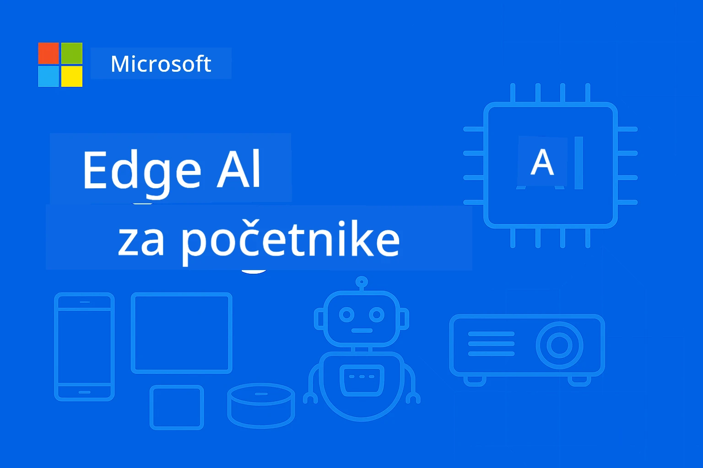

# EdgeAI za početnike 




[](https://GitHub.com/microsoft/edgeai-for-beginners/graphs/contributors)
[](https://GitHub.com/microsoft/edgeai-for-beginners/issues)
[](https://GitHub.com/microsoft/edgeai-for-beginners/pulls)
[](http://makeapullrequest.com)

[](https://GitHub.com/microsoft/edgeai-for-beginners/watchers)
[](https://GitHub.com/microsoft/edgeai-for-beginners/fork)
[](https://GitHub.com/microsoft/edgeai-for-beginners/stargazers)


[](https://discord.gg/nTYy5BXMWG)

Slijedite ove korake da biste započeli s korištenjem ovih resursa:

1. **Napravite fork repozitorija**: Click [](https://GitHub.com/microsoft/edgeai-for-beginners/fork)
2. **Klonirajte repozitorij**:   `git clone https://github.com/microsoft/edgeai-for-beginners.git`
3. [**Pridružite se Azure AI Foundry Discordu i upoznajte stručnjake i kolege developere**](https://discord.com/invite/ByRwuEEgH4)


### 🌐 Višejezična podrška

#### Podržano putem GitHub Actiona (Automatski & Uvijek ažurirano)

<!-- CO-OP TRANSLATOR LANGUAGES TABLE START -->
[Arapski](../ar/README.md) | [Bengalski](../bn/README.md) | [Bugarski](../bg/README.md) | [Burmanski (Myanmar)](../my/README.md) | [Kineski (pojednostavljeni)](../zh-CN/README.md) | [Kineski (tradicionalni, Hong Kong)](../zh-HK/README.md) | [Kineski (tradicionalni, Macau)](../zh-MO/README.md) | [Kineski (tradicionalni, Taiwan)](../zh-TW/README.md) | [Hrvatski](./README.md) | [Češki](../cs/README.md) | [Danski](../da/README.md) | [Nizozemski](../nl/README.md) | [Estonski](../et/README.md) | [Finski](../fi/README.md) | [Francuski](../fr/README.md) | [Njemački](../de/README.md) | [Grčki](../el/README.md) | [Hebrejski](../he/README.md) | [Hindi](../hi/README.md) | [Mađarski](../hu/README.md) | [Indonezijski](../id/README.md) | [Talijanski](../it/README.md) | [Japanski](../ja/README.md) | [Kannada](../kn/README.md) | [Kmerski](../km/README.md) | [Korejski](../ko/README.md) | [Litavski](../lt/README.md) | [Malezijski](../ms/README.md) | [Malayalam](../ml/README.md) | [Marathi](../mr/README.md) | [Nepalski](../ne/README.md) | [Nigerijski Pidgin](../pcm/README.md) | [Norveški](../no/README.md) | [Perzijski (Farsi)](../fa/README.md) | [Poljski](../pl/README.md) | [Portugalski (Brazil)](../pt-BR/README.md) | [Portugalski (Portugal)](../pt-PT/README.md) | [Punjabski (Gurmukhi)](../pa/README.md) | [Rumunjski](../ro/README.md) | [Ruski](../ru/README.md) | [Srpski (ćirilica)](../sr/README.md) | [Slovački](../sk/README.md) | [Slovenski](../sl/README.md) | [Španjolski](../es/README.md) | [Svahili](../sw/README.md) | [Švedski](../sv/README.md) | [Tagalog (filipinski)](../tl/README.md) | [Tamilski](../ta/README.md) | [Telugu](../te/README.md) | [Tajlandski](../th/README.md) | [Turski](../tr/README.md) | [Ukrajinski](../uk/README.md) | [Urdu](../ur/README.md) | [Vijetnamski](../vi/README.md)

> **Radije klonirati lokalno?**
>
> Ovo spremište uključuje više od 50 prijevoda jezika što značajno povećava veličinu preuzimanja. Za kloniranje bez prijevoda koristite sparse checkout:
>
> **Bash / macOS / Linux:**
> ```bash
> git clone --filter=blob:none --sparse https://github.com/microsoft/edgeai-for-beginners.git
> cd edgeai-for-beginners
> git sparse-checkout set --no-cone '/*' '!translations' '!translated_images'
> ```
>
> **CMD (Windows):**
> ```cmd
> git clone --filter=blob:none --sparse https://github.com/microsoft/edgeai-for-beginners.git
> cd edgeai-for-beginners
> git sparse-checkout set --no-cone "/*" "!translations" "!translated_images"
> ```
>
> Ovo vam daje sve što je potrebno za dovršetak tečaja s puno bržim preuzimanjem.
<!-- CO-OP TRANSLATOR LANGUAGES TABLE END -->

**Ako želite da budu podržani dodatni jezici prijevoda, oni su navedeni [ovdje](https://github.com/Azure/co-op-translator/blob/main/getting_started/supported-languages.md)**
## Uvod

Dobrodošli u **EdgeAI za početnike** – vaše sveobuhvatno putovanje u transformativni svijet rubne umjetne inteligencije. Ovaj tečaj premošćuje jaz između moćnih AI mogućnosti i praktičnog, stvarnog razmještaja na edge uređajima, omogućujući vam da iskoristite potencijal AI-a izravno ondje gdje se podaci generiraju i gdje je potrebno donositi odluke.

### Što ćete svladati

Ovaj tečaj vodi vas od temeljnih pojmova do implementacija spremnih za produkciju, pokrivajući:
- **Mali jezični modeli (SLM-ovi)** optimizirani za razmještaj na rubu
- **Optimizacija prilagođena hardveru** na različitim platformama
- **Zaključivanje u stvarnom vremenu** s mogućnostima očuvanja privatnosti
- **Strategije implementacije u produkciju** za enterprise aplikacije

### Zašto je EdgeAI važan

Edge AI predstavlja paradigmu koja rješava ključne suvremene izazove:
- **Privatnost i sigurnost**: Obradite osjetljive podatke lokalno bez izlaganja u oblaku
- **Performanse u stvarnom vremenu**: Uklonite latenciju mreže za aplikacije osjetljive na vrijeme
- **Učinkovitost troškova**: Smanjite propusnost i troškove računanja u oblaku
- **Otpornost u radu**: Održava funkcionalnost tijekom prekida mreže
- **Usklađenost s propisima**: Ispunite zahtjeve za suverenitet podataka

### Edge AI

Edge AI odnosi se na izvođenje AI algoritama i jezičnih modela lokalno na hardveru, blizu mjesta gdje se podaci generiraju, bez oslanjanja na oblačne resurse za zaključivanje. Smanjuje latenciju, poboljšava privatnost i omogućuje donošenje odluka u stvarnom vremenu.

### Temeljna načela:
- **Zaključivanje na uređaju**: AI modeli rade na uređajima na rubu (telefoni, ruteri, mikrokontroleri, industrijska računala)
- **Rad bez stalne internetske veze**: Funkcionira bez stalne internetske povezanosti
- **Niska latencija**: Trenutačni odgovori prikladni za sustave u stvarnom vremenu
- **Suverenitet podataka**: Drži osjetljive podatke lokalno, poboljšavajući sigurnost i usklađenost

### Mali jezični modeli (SLM-ovi)

SLM-ovi poput Phi-4, Mistral-7B i Gemma optimizirane su verzije većih LLM-ova—trenirane ili destilirane za:
- **Smanjeni memorijski otisak**: Učinkovito korištenje ograničene memorije edge uređaja
- **Niže zahtjeve za računanjem**: Optimizirano za CPU i performanse edge GPU-a
- **Brže vrijeme pokretanja**: Brzo inicijaliziranje za reaktivne aplikacije

Oni otključavaju moćne NLP sposobnosti dok zadovoljavaju ograničenja:
- **Ugrađeni sustavi**: IoT uređaji i industrijski kontroleri
- **Mobilni uređaji**: Pametni telefoni i tableti s mogućnostima rada offline
- **IoT uređaji**: Senzori i pametni uređaji s ograničenim resursima
- **Edge serveri**: Lokalne procesorske jedinice s ograničenim GPU resursima
- **Osobna računala**: Scenariji razmještaja na stolnim i prijenosnim računalima

## Moduli tečaja i navigacija

| Modul | Tema | Područje fokusa | Ključni sadržaj | Razina | Trajanje |
|--------|-------|------------|-------------|--------|----------|
| [📖 00 ](./introduction.md) | [Uvod u EdgeAI](./introduction.md) | Osnove i kontekst | Pregled EdgeAI • Primjene u industriji • Uvod u SLM • Ciljevi učenja | Početnik | 1-2 sata |
| [📚 01](../../Module01) | [Osnove EdgeAI](./Module01/README.md) | Usporedba oblaka i Edge AI | Osnove EdgeAI • Studije slučaja iz stvarnog svijeta • Vodič za implementaciju • Razmještaj na rubu | Početnik | 3-4 sata |
| [🧠 02](../../Module02) | [Osnove SLM modela](./Module02/README.md) | Obitelji modela i arhitektura | Phi Family • Qwen Family • Gemma Family • BitNET • μModel • Phi-Silica | Početnik | 4-5 sata |
| [🚀 03](../../Module03) | [Praksa razmještaja SLM-a](./Module03/README.md) | Lokalni i oblačni razmještaj | Napredno učenje • Lokalno okruženje • Razmještaj u oblaku | Srednja razina | 4-5 sata |
| [⚙️ 04](../../Module04) | [Alati za optimizaciju modela](./Module04/README.md) | Optimizacija za više platformi | Uvod • Llama.cpp • Microsoft Olive • OpenVINO • Apple MLX • Sinteza radnog tijeka | Srednja razina | 5-6 sati |
| [🔧 05](../../Module05) | [SLMOps u produkciji](./Module05/README.md) | Operacije u produkciji | Uvod u SLMOps • Destilacija modela • Fino podešavanje • Razmještaj u produkciji | Napredno | 5-6 sati |
| [🤖 06](../../Module06) | [AI agenti i pozivanje funkcija](./Module06/README.md) | Okviri agenata i MCP | Uvod u agente • Pozivanje funkcija • Protokol konteksta modela | Napredno | 4-5 sata |
| [💻 07](../../Module07) | [Implementacija platforme](./Module07/README.md) | Primjeri za više platformi | AI alatni paket • Foundry Local • Razvoj za Windows | Napredno | 3-4 sata |
| [🏭 08](../../Module08) | [Foundry Local alatni paket](./Module08/README.md) | Primjeri spremni za produkciju | Primjer aplikacija (vidi detalje dolje) | Ekspert | 8-10 sati |

### 🏭 **Modul 08: Primjeri aplikacija**

- [01: REST Chat Brzi početak](./Module08/samples/01/README.md)
- [02: Integracija OpenAI SDK-a](./Module08/samples/02/README.md)
- [03: Otkrivanje modela i benchmarkiranje](./Module08/samples/03/README.md)
- [04: Chainlit RAG aplikacija](./Module08/samples/04/README.md)
- [05: Orkestracija više agenata](./Module08/samples/05/README.md)
- [06: Usmjerivač modela kao alata](./Module08/samples/06/README.md)
- [07: Izravni API klijent](./Module08/samples/07/README.md)
- [08: Chat aplikacija za Windows 11](./Module08/samples/08/README.md)
- [09: Napredni sustav više agenata](./Module08/samples/09/README.md)
- [10: Okvir Foundry alata](./Module08/samples/10/README.md)

### 🎓 **Radionica: Praktični put učenja**

Sveobuhvatni materijali radionice s praktičnim primjerima spremnim za produkciju:

- **[Vodič radionice](./Workshop/Readme.md)** - Kompletni ciljevi učenja, ishodi i navigacija resursa
- **Python primjeri** (6 sesija) - Ažurirano s najboljim praksama, rukovanjem pogreškama i sveobuhvatnom dokumentacijom
- **Jupyter bilježnice** (8 interaktivnih) - Korak-po-korak tutorijali s benchmarkovima i praćenjem performansi
- **Vodiči za sesije** - Detaljni markdown vodiči za svaku radionicu
- **Alati za validaciju** - Skripte za provjeru kvalitete koda i pokretanje osnovnih testova

**Što ćete izgraditi:**
- Lokalni AI chat programi s podrškom za streamanje
- RAG pipelineovi s evaluacijom kvalitete (RAGAS)
- Alati za benchmarkiranje i usporedbu više modela
- Sustavi za orkestraciju više agenata
- Inteligentno usmjeravanje modela s odabirom temeljenim na zadacima

### 🎙️ **Radionica za Agentic: Praktično - AI Podcast Studio**
Build an AI-powered podcast production pipeline from scratch! This immersive workshop teaches you to create a complete multi-agent system that transforms ideas into professional podcast episodes.

**[🎬 Pokreni radionicu AI Podcast Studio](./WorkshopForAgentic/README.md)**

**Tvoja misija**: Pokreni "Future Bytes" — tehnološki podcast u potpunosti pokretan AI agentima koje ćeš sam izgraditi. Nema ovisnosti o oblaku, nema troškova API-ja — sve radi lokalno na tvom računalu.

**Što ovo čini jedinstvenim:**
- **🤖 Prava orkestracija više agenata** - Izgradi specijalizirane AI agente koji istražuju, pišu i proizvode audio
- **🎯 Potpun proizvodni pipeline** - Od odabira teme do završnog podcast audio izlaza
- **💻 100% lokalno raspoređivanje** - Koristi Ollama i lokalne modele (Qwen-3-8B) za potpunu privatnost i kontrolu
- **🎤 Integracija teksta u govor** - Pretvori scenarije u prirodno zvučeće razgovore s više govornika
- **✋ Radni tokovi s ljudskim nadzorom** - Kontrolne točke za odobrenje osiguravaju kvalitetu uz održavanje automatizacije

**Put učenja u tri čina:**

| Act | Focus | Key Skills | Duration |
|-----|-------|------------|----------|
| **[Čin 1: Upoznajte svoje AI asistente](./WorkshopForAgentic/md/01.BuildAIAgentWithSLM.md)** | Izgradi svog prvog AI agenta | Integracija alata • Web pretraživanje • Rješavanje problema • Agentno rezoniranje | 2-3 hrs |
| **[Čin 2: Sastavi svoj proizvodni tim](./WorkshopForAgentic/md/02.AIAgentOrchestrationAndWorkflows.md)** | Orkestriraj više agenata | Koordinacija tima • Radni tokovi odobrenja • DevUI sučelje • Ljudski nadzor | 3-4 hrs |
| **[Čin 3: Oživite svoj podcast](./WorkshopForAgentic/md/03.Multi-SpeakerPodcastGenerationWithVibeVoice.md)** | Generiraj podcast audio | Tekst-u-govor • Sintetiziranje s više govornika • Duži audio formati • Potpuna automatizacija | 2-3 hrs |

**Tehnologije koje se koriste:**
- **Microsoft Agent Framework** - Orkestracija i koordinacija više agenata
- **Ollama** - Lokalno runtime okruženje za AI model (nije potreban oblak)
- **Qwen-3-8B** - Open-source jezični model optimiziran za agentne zadatke
- **Text-to-Speech APIs** - Prirodna sinteza glasa za generiranje podcasta

**Podrška hardvera:**
- ✅ **CPU način rada** - Radi na bilo kojem modernom računalu (preporučeno 8GB+ RAM)
- 🚀 **GPU ubrzanje** - Značajno brže izvođenje s NVIDIA/AMD GPU-ima
- ⚡ **Podrška za NPU** - Ubrzanje s novim jedinicama za neuronsku obradu

**Idealan za:**
- Programere koji uče o sustavima s više agenata
- Sve zainteresirane za AI automatizaciju i radne tokove
- Kreatore sadržaja koji istražuju AI-podržanu produkciju
- Studente koji proučavaju praktične obrasce orkestracije AI-a

**Započni graditi**: [🎙️ Radionica AI Podcast Studija →](./WorkshopForAgentic/README.md)

### 📊 **Sažetak puta učenja**
- **Ukupno trajanje**: 36-45 sati
- **Put za početnike**: Moduli 01-02 (7-9 sati)  
- **Srednji stupanj**: Moduli 03-04 (9-11 sati)
- **Napredni stupanj**: Moduli 05-07 (12-15 sati)
- **Ekspertni stupanj**: Modul 08 (8-10 sati)

## Što ćete izgraditi

### 🎯 Ključne kompetencije
- **Edge AI arhitektura**: Dizajniraj sustave koji su lokalni-prvo s integracijom u oblak
- **Optimizacija modela**: Kvantiziraj i komprimiraj modele za edge raspoređivanje (85% ubrzanje, 75% smanjenje veličine)
- **Višeplatformsko raspoređivanje**: Windows, mobilno, ugrađeno i cloud-edge hibridni sustavi
- **Operacije u produkciji**: Praćenje, skaliranje i održavanje Edge AI u produkciji

### 🏗️ Praktični projekti
- **Foundry lokalne chat aplikacije**: Izvorna aplikacija za Windows 11 s prebacivanjem modela
- **Sustavi s više agenata**: Koordinator sa specijalističkim agentima za složene radne tokove  
- **RAG aplikacije**: Lokalna obrada dokumenata s vektorskim pretraživanjem
- **Model Routers**: Inteligentni odabir između modela na temelju analize zadatka
- **API okviri**: Klijenti spremni za produkciju s streamanjem i nadzorom zdravlja
- **Višeplatformski alati**: Obrasci integracije LangChain/Semantic Kernel

### 🏢 Primjene u industriji
**Proizvodnja** • **Zdravstvo** • **Autonomna vozila** • **Pametni gradovi** • **Mobilne aplikacije**

## Brzi početak

**Preporučeni put učenja** (20-30 sati ukupno):

0. **📖 Uvod** ([Introduction.md](./introduction.md)): Osnove EdgeAI + industrijski kontekst + okvir za učenje
1. **📚 Temelj** (Moduli 01-02): Koncepti EdgeAI + SLM obitelji modela
2. **⚙️ Optimizacija** (Moduli 03-04): Raspoređivanje + kvantizacijski okviri  
3. **🚀 Produkcija** (Moduli 05-06): SLMOps + AI agenti + pozivanje funkcija
4. **💻 Implementacija** (Moduli 07-08): Primjeri za platforme + Foundry Local alatni paket

Svaki modul uključuje teoriju, praktične vježbe i uzorke koda spremne za produkciju.

## Utjecaj na karijeru

**Tehničke uloge**: EdgeAI Solutions Architect • ML inženjer (Edge) • IoT AI developer • Mobilni AI developer

**Industrijski sektori**: Proizvodnja 4.0 • Zdravstvena tehnologija • Autonomni sustavi • FinTech • Potrošačka elektronika

**Projekti za portfelj**: Sustavi s više agenata • Produkcijske RAG aplikacije • Višeplatformsko raspoređivanje • Optimizacija performansi

## Struktura repozitorija

```
edgeai-for-beginners/
├── 📖 introduction.md  # Foundation: EdgeAI Overview & Learning Framework
├── 📚 Module01-04/     # Fundamentals → SLMs → Deployment → Optimization  
├── 🔧 Module05-06/     # SLMOps → AI Agents → Function Calling
├── 💻 Module07/        # Platform Samples (VS Code, Windows, Jetson, Mobile)
├── 🏭 Module08/        # Foundry Local Toolkit + 10 Comprehensive Samples
│   ├── samples/01-06/  # Foundation: REST, SDK, RAG, Agents, Routing
│   └── samples/07-10/  # Advanced: API Client, Windows App, Enterprise Agents, Tools
├── 🌐 translations/    # Multi-language support (8+ languages)
└── 📋 STUDY_GUIDE.md   # Structured learning paths & time allocation
```

## Istaknuto u tečaju

✅ **Postupno učenje**: Teorija → Praksa → Raspoređivanje u produkciju  
✅ **Stvarne studije slučaja**: Microsoft, Japan Airlines, implementacije u poduzećima  
✅ **Praktični primjeri**: 50+ primjera, 10 sveobuhvatnih Foundry Local demo projekata  
✅ **Fokus na performanse**: 85% poboljšanja brzine, 75% smanjenja veličine  
✅ **Višeplatformsko**: Windows, mobilno, ugrađeno, cloud-edge hibrid  
✅ **Spremno za produkciju**: Praćenje, skaliranje, sigurnost, okviri usklađenosti

📖 **[Dostupan vodič za učenje](STUDY_GUIDE.md)**: Strukturirani 20-satni plan učenja s raspodjelom vremena i alatima za samoocjenu.

---

**EdgeAI predstavlja budućnost implementacije AI-a**: lokalno-prvo, očuvanje privatnosti i učinkovito. Ovladajte ovim vještinama kako biste izgradili sljedeću generaciju inteligentnih aplikacija.

## Ostali tečajevi

Our team produces other courses! Check out:

<!-- CO-OP TRANSLATOR OTHER COURSES START -->
### LangChain
[](https://aka.ms/langchain4j-for-beginners)
[](https://aka.ms/langchainjs-for-beginners?WT.mc_id=m365-94501-dwahlin)
[](https://github.com/microsoft/langchain-for-beginners?WT.mc_id=m365-94501-dwahlin)
---

### Azure / Edge / MCP / Agents
[](https://github.com/microsoft/AZD-for-beginners?WT.mc_id=academic-105485-koreyst)
[](https://github.com/microsoft/edgeai-for-beginners?WT.mc_id=academic-105485-koreyst)
[](https://github.com/microsoft/mcp-for-beginners?WT.mc_id=academic-105485-koreyst)
[](https://github.com/microsoft/ai-agents-for-beginners?WT.mc_id=academic-105485-koreyst)

---
 
### Generativni AI serijal
[](https://github.com/microsoft/generative-ai-for-beginners?WT.mc_id=academic-105485-koreyst)
[-9333EA?style=for-the-badge&labelColor=E5E7EB&color=9333EA)](https://github.com/microsoft/Generative-AI-for-beginners-dotnet?WT.mc_id=academic-105485-koreyst)
[-C084FC?style=for-the-badge&labelColor=E5E7EB&color=C084FC)](https://github.com/microsoft/generative-ai-for-beginners-java?WT.mc_id=academic-105485-koreyst)
[-E879F9?style=for-the-badge&labelColor=E5E7EB&color=E879F9)](https://github.com/microsoft/generative-ai-with-javascript?WT.mc_id=academic-105485-koreyst)

---
 
### Temeljno učenje
[](https://aka.ms/ml-beginners?WT.mc_id=academic-105485-koreyst)
[](https://aka.ms/datascience-beginners?WT.mc_id=academic-105485-koreyst)
[](https://aka.ms/ai-beginners?WT.mc_id=academic-105485-koreyst)
[](https://github.com/microsoft/Security-101?WT.mc_id=academic-96948-sayoung)
[](https://aka.ms/webdev-beginners?WT.mc_id=academic-105485-koreyst)
[](https://aka.ms/iot-beginners?WT.mc_id=academic-105485-koreyst)
[](https://github.com/microsoft/xr-development-for-beginners?WT.mc_id=academic-105485-koreyst)

---
 
### Copilot serija
[](https://aka.ms/GitHubCopilotAI?WT.mc_id=academic-105485-koreyst)
[](https://github.com/microsoft/mastering-github-copilot-for-dotnet-csharp-developers?WT.mc_id=academic-105485-koreyst)
[](https://github.com/microsoft/CopilotAdventures?WT.mc_id=academic-105485-koreyst)
<!-- CO-OP TRANSLATOR OTHER COURSES END -->

## Dobivanje pomoći

Ako zapnete ili imate bilo kakvih pitanja o izradi AI aplikacija, pridružite se:

[](https://discord.gg/nTYy5BXMWG)

Ako imate povratne informacije o proizvodu ili naiđete na greške tijekom izrade, posjetite:

[](https://aka.ms/foundry/forum)

---

<!-- CO-OP TRANSLATOR DISCLAIMER START -->
**Odricanje odgovornosti**:
Ovaj dokument je preveden pomoću AI usluge prevođenja [Co-op Translator](https://github.com/Azure/co-op-translator). Iako težimo točnosti, imajte na umu da automatizirani prijevodi mogu sadržavati pogreške ili netočnosti. Izvorni dokument na izvornom jeziku treba smatrati mjerodavnim izvorom. Za kritične informacije preporučuje se profesionalni ljudski prijevod. Ne snosimo odgovornost za bilo kakve nesporazume ili pogrešne interpretacije proizašle iz korištenja ovog prijevoda.
<!-- CO-OP TRANSLATOR DISCLAIMER END -->