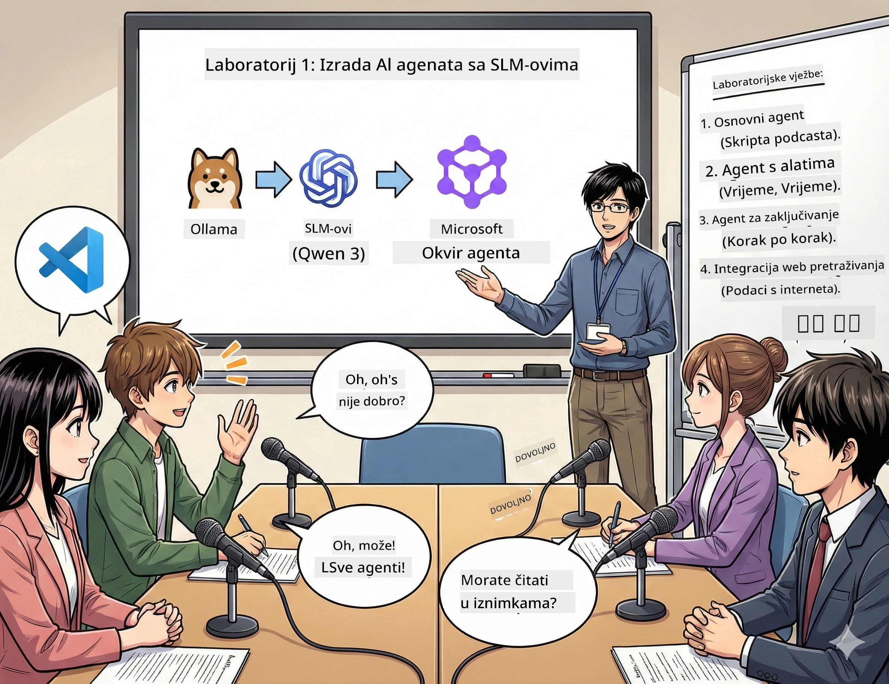

# Čin 1: Upoznajte svog AI pomoćnika za istraživanje 🤖

## Izazov

Pokrećete "Future Bytes," svoj novi tehnološki podcast. Epizoda 1 je o najnovijim AI dostignućima, ali imate 24 sata da:
1. Istražite temu
2. Pronađete vjerodostojne izvore
3. Napišete uvjerljiv scenarij
4. Neka zvuči prirodno

**Zaplet**: Ne morate to raditi sami. Upravo ćete izgraditi svog prvog AI pomoćnika koji može pomoći u svemu ovome. Nazovimo ga Alex — vaš neumorni istraživački partner kojem nikad ne treba san.

## Zašto mali jezični modeli? (Spoiler: Oni su super)

Zamislite Male jezične modele (SLM-ove) kao svoj osobni AI koji živi na *vašem* računalu. Nema oblaka, nema mjesečnih naknada, nema sumnjivih dijeljenja podataka.

**Zašto su SLM-ovi 🔥:**
- **🏠 Radi na vašem uređaju**: Laptop, desktop, čak i snažni Raspberry Pi
- **💸 Nema stalnih troškova**: Nema API naknada koje vam jedu novac za ručak
- **🔒 Privatnost na prvom mjestu**: Vaši podaci nikad ne napuštaju uređaj
- **⚡ Munjevito brzo**: Nema kašnjenja zbog interneta, odmah odgovara
- **🪦 Lagani**: 1B-10B parametara u odnosu na 100B+ za velike modele

**Popularni SLM-ovi**: Qwen 3, Phi-4, Gemma 3 (za radionicu koristimo Qwen)

## Vaš alatni set

### Ollama: Vaš upravitelj AI modelima

[Ollama](https://ollama.com/) je poput Steama za AI modele. Preuzmite, pokrenite i upravljajte modelima jednostavnim naredbama.

**Što ga čini sjajnim:**
- Jedna naredba za preuzimanje i pokretanje bilo kojeg modela
- Radi na Mac, Windows, Linux
- Automatski koristi vašu GPU ako je imate
- Izuzetno štedi memoriju

### Microsoft Agent Framework: Gdje se događa čarolija

[Microsoft Agent Framework](https://github.com/microsoft/agent-framework) je vaše igralište za izgradnju AI agenata koji mogu:

- 💬 Razgovarati i pamtiti o čemu ste pričali
- 🛠️ Koristiti prilagođene alate (poput pretraživanja weba ili provjere vremena)
- 🧠 Razmišljati o složenim problemima korak po korak
- 🤝 Raditi s drugim agentima kao tim
- 🔌 Povezati se s različitim AI pružateljima (OpenAI, Ollama, Azure)

**Građevni blokovi:**
- **Agenti**: Vaši AI pomoćnici sa specifičnim zadacima
- **Alati**: Posebne sposobnosti koje im dajete
- **Memorija**: Da ne zaborave vaš razgovor
- **Razumijevanje**: Poučiti ih da razmišljaju, a ne samo da odgovaraju

## Vaša montaža treninga: 4 misije

### Misija 1: Kreirajte svog prvog agenta

📓 [Otvori bilježnicu](../code/01.BasicAgent/00.BasicAgent-agent.ipynb)

**Misija**: Izgradite Alexa, vašeg AI scenarista za podcast. Alex treba generirati dijalog između dva domaćina koji raspravljaju o tehnološkim temama.

**Što ćete naučiti**:
- Kako probuditi AI agenta (lakše je nego se probuditi u ponedjeljak)
- Dati mu osobnost i upute
- Natjerati ga da generira stvarne podcast scenarije
- Razumjeti što vam vraća kao odgovor

**Uvjet za pobjedu**: Alex stvara scenarij za pilot epizodu "Future Bytes" o AI! 🎯

### Misija 2: Dajte Alexu supermoći (Alati!)

📓 [Otvori bilježnicu](../code/01.BasicAgent/01.BasicAgent-tools.ipynb)

**Misija**: Alex je pametan, ali ne zna kakvo je vrijeme danas niti koliko je sati. Popravimo to dajući mu alate!

**Što ćete naučiti**:
- Kreirati prilagođene Python funkcije kao "alate"
- Neka Alex odluči *kada* će koji alat koristiti
- Gledajte kako samostalno rješava probleme
- Kombinirati više alata za složenije zadatke

**Uvjet za pobjedu**: Pitajte "Kakvo je vrijeme u Tokiju?" i Alex to sam sazna! ☁️

### Misija 3: Naučite Alexa razmišljati

📓 [Otvori bilježnicu](../code/01.BasicAgent/02.BasicAgent-reasoning.ipynb)

**Misija**: Neka Alex pokaže svoj rad. Kad rješava probleme, želite vidjeti *kako* razmišlja, ne samo odgovor.

**Što ćete naučiti**:
- Uključiti "način razmišljanja" (kao pokazujući rad na satu matematike)
- Vidjeti Alexov proces razmišljanja korak po korak
- Razumjeti lanac poticaja za razmišljanje
- Otklanjati probleme kad se Alex zbuni

**Uvjet za pobjedu**: Postavite teško matematičko pitanje i gledajte Alexa kako razmišlja! 🧠

### Misija 4: Povežite Alexa na internet

📓 [Otvori bilježnicu](../code/01.BasicAgent/03.BasicAgent-websearch.ipynb)

**Misija**: Alexovo znanje ima datum prekida. Povežimo ga s webom za informacije u stvarnom vremenu!

**Što ćete naučiti**:
- Izgraditi prilagođeni alat za pretraživanje weba
- Integrirati vanjske API-je
- Rukovati mrežnim greškama elegantno
- Dobiti informacije izvan Alexovih podataka za učenje

**Uvjet za pobjedu**: Pitajte za današnje tehnološke vijesti i dobijte svježe rezultate! 📰

## Prije nego što započnete 🚀

**Potrebna oprema**:
- Instaliran Python 3.10+
- Ollama pokrenut (provjerite s `ollama --version`)
- VS Code s Python ekstenzijom
- Najmanje 8GB RAM-a (16GB za glatki rad)

## Redoslijed misija

Slijedite bilježnice redoslijedom za potpunu priču:

1. [00.BasicAgent-agent.ipynb](../code/01.BasicAgent/00.BasicAgent-agent.ipynb) — Upoznajte Alexa (vaš prvi agent)
2. [01.BasicAgent-tools.ipynb](../code/01.BasicAgent/01.BasicAgent-tools.ipynb) — Vrijeme za pojačanje!
3. [02.BasicAgent-reasoning.ipynb](../code/01.BasicAgent/02.BasicAgent-reasoning.ipynb) — Naučite Alexa razmišljati
4. [03.BasicAgent-websearch.ipynb](../code/01.BasicAgent/03.BasicAgent-websearch.ipynb) — Internet pristup otključan!

## Što ćete savladati

Nakon Čina 1 moći ćete:

- ✅ Pokretati AI modele na vlastitom hardveru (bez oblaka!)
- ✅ Izgraditi agente s prilagođenim osobnostima i vještinama
- ✅ Dati agentima alate za rješavanje stvarnih problema
- ✅ Natjerati agente da pokažu svoj proces razmišljanja
- ✅ Povezati agente s vanjskim izvorima podataka
- ✅ Otklanjati pogreške kad nešto krene po zlu

## Kad stvari puknu (i kako ih popraviti) 🔧

### "Alex se ne učitava! Nema memorije!"
**Rješenje**: Vaše računalo se muči. Pokušajte zatvoriti druge aplikacije ili prebacite se na manji model. 8GB RAM-a je baš minimum.

### "Alex je prespor"
**Rješenje**: Uključite GPU ubrzanje u Ollama postavkama. Ili smanjite veličinu kontekstnog prozora. Aktiviran režim brzine! 🏎️

### "Alati ne rade!"
**Rješenje**: Dvaput provjerite potpise funkcija. Alexu su potrebni jasni tipovi da razumije što alat radi. Kao da dajete jasne upute.

## Korisne poveznice 🔗

- [Agent Framework dokumentacija](https://github.com/microsoft/agent-framework) — Službeni vodiči i primjeri
- [Ollama Model Library](https://ollama.com/library) — Pregledajte sve dostupne modele
- [Qwen model](https://ollama.com/library/qwen3) — Upoznajte mozak svog AI-ja
- [Primjeri koda](https://github.com/microsoft/agent-framework/tree/main/python/samples) — Ukrasti ideje ovdje

## Sljedeće: Čin 2 🎬

Imate jednog agenta. Ali što ako imate *tim* agenata koji rade zajedno? U Činu 2 sastavit ćete svoju cijelu produkcijsku ekipu podcasta:
- **Istraživački agent**: Pronalazi najbolje izvore
- **Pisac agent**: Sastavlja savršen scenarij  
- **Urednik (vi!)**: Odobrava ili traži izmjene

Orkestrirajmo malo AI magije! → [Čin 2: Sastavite svoj produkcijski tim](02.AIAgentOrchestrationAndWorkflows.md)

---

**Zaglavili ste?** Postavite pitanja tijekom radionice. Svi učimo zajedno! 🙌

---

<!-- CO-OP TRANSLATOR DISCLAIMER START -->
**Odricanje od odgovornosti**:  
Ovaj je dokument preveden korištenjem AI usluge prijevoda [Co-op Translator](https://github.com/Azure/co-op-translator). Iako težimo točnosti, imajte na umu da automatizirani prijevodi mogu sadržavati pogreške ili netočnosti. Izvorni dokument na izvornom jeziku smatra se autoritativnim izvorom. Za kritične informacije preporučuje se profesionalni ljudski prijevod. Ne snosimo odgovornost za bilo kakve nesporazume ili pogrešna tumačenja koja proizlaze iz korištenja ovog prijevoda.
<!-- CO-OP TRANSLATOR DISCLAIMER END -->