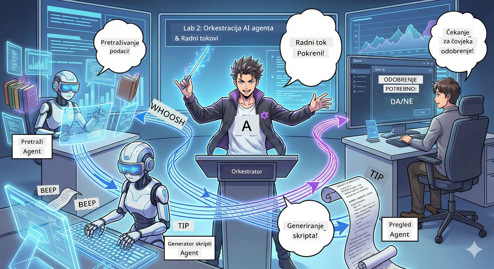

# Čin 2: Sastavite svoj tim za produkciju podcasta 🎬



## Zaplet se zaoštrava

Alex (vaš AI asistent iz Čina 1) je sjajan, ali jedan agent ne može voditi cijeli podcast studio. Trebate *tim*:
- 🔍 **Agent za istraživanje**: Pretražuje internet za svježe informacije
- ✍️ **Agent za scenarij**: Pretvara istraživanje u zanimljiv dijalog
- 👤 **Vi (Urednik)**: Odobrava scenarije ili ih šalje na prerade

Dobrodošli u **AI Agent Orkestraciju** — mjesto gdje postajete redatelj vlastite AI ekipe. Zamislite Osvetnike, ali za proizvodnju podcasta.

## Što je Agent Orkestracija? (Jednostavna verzija)

Zamislite da vodite restoran. Ne radite sve sami, zar ne? Imate:
- 🍳 Kuhara koji kuha
- 👨‍🍳 Pomoćnog kuhara koji priprema
- 👩‍🍳 Konobara koji dostavlja

Orkestracija agenata je ista ideja, ali s AI. Svaki agent ima specijalnost, a vi ih koordinirate da postignu veće ciljeve. Nijedan agent nije preopterećen, a posao ide brže.

### Analogiija benda 🎸

Vaši AI agenti su kao bend:
- **Glavni pjevač**: Glavni agent koji obavlja zadatke usmjerene prema korisnicima
- **Bubnjar**: Drži ritam, rukuje pozadinskim procesima  
- **Basist**: Podržava sve, dohvaća podatke
- **Vi (menadžer benda)**: Koordinirate sve!

Bez koordinacije? Samo buka. S orkestracijom? Prekrasna glazba.

### Zašto je ovo važno

Jedan AI agent koji pokušava sve = iscrpljenost. Specijalizirani agenti koji rade zajedno = otključana učinkovitost! 🚀

**Iskrena priča**: Sjećate se kad ste sami pokušavali istražiti, pisati i uređivati podcast? Da, to je loše. S orkestracijom, svaki agent radi ono u čemu je najbolji. Vi donosite konačne odluke.

**Primjer iz stvarnog svijeta**: Botovi za korisničku podršku koji znaju kada rješavati račune, kad tehničke probleme, a kad pozvati čovjeka. To je orkestracija!

## Agent vs. Workflow: Koja je razlika?

Razmislite ovako:

### 🤖 AI Agent = Jazz glazbenik
- **Donosi odluke u hodu** na temelju onoga što čuje
- **Improvizira** rješenja koristeći svoje alate
- **Misli** sa LLM mozgom
- **Prilagođava se** bilo čemu što mu zadajete

### 🎵 Workflow = Orkestar koji izvodi klasičnu glazbu  
- **Slijedi partituru** (preddefinirane korake)
- **Predvidljiv** put izvođenja
- **Koordinira** više agenata, ljudi, sustava
- **Strukturiran** kao recept

**Čarolija**: Workflowi *orkestriraju* agente! Gradite workflow koji govori agentima kada imaju odigrati svoju ulogu. Najbolje iz oba svijeta. 🎭

## Tri načina koordinacije vaše AI ekipe

### 1. 🎯 Centralizirano (Vi ste šef)

Jedan glavni agent donosi sve odluke. Zamislite da upravljate timom — vi odlučujete tko što i kada radi.

**Prednosti**:
- ✅ Jasno vođenje (bez zabune)
- ✅ Dosljedne odluke
- ✅ Jednostavno za ispravljati pogreške

**Koristite za**:
- Usmjeravanje korisničke podrške ("Je li ovo račun ili tehnička podrška?")
- Radni tokovi odobrenja sadržaja ("Prolazi li ovaj scenarij?")
- Produkciju podcasta (upravo ono što gradimo!)

### 2. 🤝 Decentralizirano (Agent se sam organizira)

Agenti komuniciraju izravno jedni s drugima i rješavaju stvari kao grupa. Kao grupa za razgovor gdje svi koordiniraju.

**Prednosti**:
- ✅ Lako skalira (možete dodavati agente u bilo kojem trenutku)
- ✅ Nema jedinstvene točke pada
- ✅ Agenti prirodno surađuju

**Koristite za**:
- Timove za istraživanje (svaki agent istražuje različite izvore)
- Sesije brainstorminga
- Raspodijeljeno rješavanje problema

### 3. 🔀 Hibridno (Najbolje iz oba svijeta)

Vi postavljate opći smjer, a agenti imaju slobodu samostalno organizirati zadatke. Kao CEO koji vjeruje svom timu.

**Savršeno za**: Kompleksne projekte kojima treba i kontrola i fleksibilnost.

## Microsoft Agent Framework: Vaš alat za orkestraciju 🧰

Vrijeme za gradnju! Ovo ćete koristiti:

### Građevni blokovi

#### 1. 🧱 Izvršitelji (vaši radnici)
- **Što su**: Pojedinačne jedinice za obradu — mogu biti agenti ili prilagođena logika
- **Što rade**: Primaju ulaz, rade posao, proizvode izlaz
- **Zamislite ih kao**: Postaje na proizvodnoj liniji

#### 2. ➡️ Veze (poveznice)
- **Što su**: Putovi između izvršitelja
- **Što rade**: Kontroliraju protok poruka ("Nakon A ide se na B")
- **Zamislite ih kao**: Strelice na dijagramu toka

#### 3. 🗺️ Workflowi (glavni plan)
- **Što su**: Potpuni graf izvršitelja + veza
- **Što rade**: Definiraju cijeli proces od početka do kraja
- **Zamislite ih kao**: Vaš nacrt proizvodne linije

### Kul značajke koje ćete voljeti

**🛡️ Sigurnost tipova**: Poruke među agentima su provjerene po tipu. Nema "Ups, pogrešan tip podataka" iznenađenja.

**🔀 Fleksibilna usmjeravanja**: 
- Ako-onda uvjeti ("Ako je odobreno, objavi; inače, prepiši")
- Paralelna obrada (više agenata radi istovremeno)
- Dinamični putovi (workflow se prilagođava na temelju rezultata)

**🔌 Vanjska integracija**:
- Spoj na API-je
- Dodavanje checkpoints s ljudskom kontrolom (vi odobravate prije objave)
- Gradnja request/response tijekova

**💾 Checkpointing**: Spremite napredak! Ako nešto pukne, nastavite od mjesta na kojem ste stali.

**🤝 Multi-Agent koordinacija**:
- Pokrenite agente u nizu (A → B → C)
- Pokrenite ih paralelno (A + B + C zajedno)
- Predaja između agenata
- Suradnička obrada

## Najbolje prakse (stručni savjeti) 🎯

### 1. Održavajte modularnost
Svaki agent treba raditi JEDNU stvar zaista dobro. Nemojte praviti "super agenta" koji radi sve — požalit ćete pri ispravljanju pogrešaka.

### 2. Planirajte za neuspjehe
Agenti pogriješe. Mreže zakažu. Ugradite rukovanje greškama i rezervne planove. Vaš budući ja će vam biti zahvalan.

### 3. Pratite sve
Pratite što vaši agenti rade. Koristite DevUI (pokrit ćemo to!) da vidite workflow u akciji.

### 4. Optimizirajte veličinu poruka
Nemojte slati ogromne datoteke između agenata. Držite poruke laganima i brzim.

### 5. Odaberite pravi obrazac
Trebate kontrolu? Idite na centralizirano. Trebate skalabilnost? Idite po decentralizirano. Ne možete odlučiti? Idite hibridno!

## DevUI: Vaš debugger workflowa 🔍

### Što je DevUI?

DevUI je kao igralište za testiranje vaših agenata i workflowa. To je web sučelje gdje možete:
- 👀 Gledati svoj workflow u izvođenju
- 💬 Razgovarati s agentima izravno
- 🔍 Otklanjati pogreške kad nešto ne radi
- 📊 Vidjeti tragove i metrike performansi

> **Važno**: DevUI je samo za razvoj! Nemojte ga koristiti u produkciji. Zamislite ga kao lokalno razvojno okruženje.

### Zašto je sjajan

- **🖥️ Interaktivno web sučelje**: Klikajte, tipkajte, testirajte — bez potrebe za komandnom linijom
- **📁 Spremno za povlačenje i ispuštanje**: Učitajte datoteke, testirajte s različitim unosima
- **📂 Automatsko otkrivanje**: Usmjerite ga na mapu, pronađe sve vaše agente automatski
- **📋 Režim bez postavki**: Registrirajte agente u kodu, nije potrebna struktura mapa
- **🔌 Kompatibilno s OpenAI**: Radi s OpenAI SDK (kompatibilnost FTW!)
- **👁️ Ugrađeno praćenje**: Vidite točno što vaši agenti rade

### Kako funkcionira unos

DevUI pametno upravlja unosom:

- **Testirate agente?** Imate tekstualna polja i gumbe za upload datoteka
- **Testirate workflowe?** UI automatski generira polja za unos prema onome što workflow očekuje

To je kao čarolija, ali zapravo je samo dobar kod. ✨

## Vaše misije: Izgradite podcast studio 🎬

### Misija 1: Kreirajte jednog agenta s DevUI

📂 [01.AgentDevUI](../../../../WorkshopForAgentic/code/02.Workflow/01.AgentDevUI)

**Izazov**: Prije nego što izgradite cijeli tim, testirajte DevUI s jednim agentom: stručnjakom za web pretraživanje.

**Što gradite**:
Agenta za istraživanje koji može pretražiti internet za teme podcasta. Testirat ćete ga preko DevUI web sučelja na `http://localhost:8090`.

**Vještine koje ćete naučiti**:
- 🚀 Pokretanje agenata u DevUI
- 🔍 Testiranje odgovora agenta u stvarnom vremenu
- 🛠️ Izgradnja prilagođenih alata (web pretraživanje)
- 📊 Omogućavanje praćenja za otklanjanje grešaka
- 🖥️ Korištenje interaktivnog web UI-ja

**Kod**:
- `agent.py`: Vaš SearchAgent sa supermoćima web pretraživanja
- Koristi OllamaChatClient za spajanje na Qwen
- Implementira funkciju `web_search()`
- Pokreće se s `serve()` — automatski otvara DevUI

**Uvjet za pobjedu**: Pitajte svog agenta "Što je trenutno popularno u AI?" i gledajte kako pretražuje web! 🎉

### Misija 2: Izgradite višestruki workflow agenta

📂 [02.WorkflowDevUI](../../../../WorkshopForAgentic/code/02.Workflow/02.WorkflowDevUI)

**Izazov**: Sad počinje prava zabava! Izgradite kompletan radni tok za produkciju podcasta s:
1. 🔍 **Agent za pretraživanje** → Istražuje vašu temu
2. ✍️ **Agent za scenarij** → Piše dijalog između dva voditelja (na kineskom!)
3. 👤 **Executor za pregled** → Traži od VAS da odobrite ili odbacite
4. 🔄 **Povratna petlja** → Ako je odbijeno, prepisuje se na temelju vaših povratnih informacija

**Vještine koje ćete naučiti**:
- 🧱 Kreiranje specijaliziranih agenata za različite zadatke
- 🔗 Povezivanje agenata s WorkflowBuilderom
- 🔀 Implementacija petlji za odobrenje (čovjek u petlji!)
- 🚦 Uvjetno usmjeravanje (ako je odobreno ili odbijeno)
- 🔧 Izrada prilagođenih izvršitelja za poslovnu logiku

**Workflow**:
```
SearchAgent → ScriptAgent → ReviewExecutor
                             ↑          ↓ (if rejected)
                             ←─────────
```

**Kod**:
- `search_agent/agent.py`: Vaš stručnjak za istraživanje
- `generate_script_agent/agent.py`: Vaš pisac scenarija (piše na kineskom!)
- `workflow/workflow.py`: Magija orkestracije se događa ovdje
- `main.py`: Pokreće sve u DevUI

**Uvjet za pobjedu**: Dajte temu, pregledajte scenarij, odbacite ga jednom da testirate petlju, zatim odobrite! 🎉

### Misija 3: Izgradite konzolnu aplikaciju

📂 [03.Application](../../../../WorkshopForAgentic/code/02.Workflow/03.Application)

**Izazov**: Uzmite svoj workflow iz DevUI i pretvorite ga u atraktivnu terminalsku aplikaciju s obojenim izlazom, spinnerima za učitavanje, i spremanjem datoteka. Ovo je spremno za produkciju!

**Vještine koje ćete naučiti**:
- ⚡ Pokretanje workflowa programatski (bez DevUI)
- 📡 Arhitektura vođena događajima sa streamingom
- 🎨 Izrada lijepih terminalskih UI-ja (boje, spinneri, trake napretka)
- 💾 Spremanje konačnih scenarija u datoteke
- 🔄 Rukovanje asinhronim workflowima s Python asyncio

**Što aplikacija radi**:
1. Pita vas za temu podcasta
2. Prikazuje napredak u stvarnom vremenu ("Agent za pretraživanje radi...")
3. Prikazuje generirani scenarij s bojama
4. Pita za vaše odobrenje
5. Spremi odobreni scenarij u `podcast.txt`

**Kod**:
- `podcast_app.py`: Vaša glavna aplikacija s rukovanjem događajima
- `workflow.py`: Koristi workflow iz Misije 2
- Rukuje događajima: `AgentRunUpdateEvent`, `RequestInfoEvent`, `WorkflowOutputEvent`
- Koristi ANSI boje za stiliziranje terminala

**Uvjet za pobjedu**: Pokrenite aplikaciju, napravite scenarij podcasta i vidite ga spremljenog! Izgradili ste pravi alat. 🚀

## Što ste svladali 🏆

Nakon Čina 2 znate:

- ✅ Orkestrirati više AI agenata kao pravi šef
- ✅ Graditi workflow s uzastopnom I UVJETNOM logikom
- ✅ Dodavati ljudske checkpoints za odobrenje
- ✅ Koristiti DevUI za testiranje i otklanjanje pogrešaka workflowa
- ✅ Kreirati produkcijski spremne konzolne aplikacije
- ✅ Lijepo rješavati greške u složenim sustavima
- ✅ Odabrati pravi obrazac orkestracije za bilo koji projekt

## Kad stvari zakažu 🔧

### "Moj workflow je prekompliciran!"
**Rješenje**: Podijelite ga u manje pod-workflowe. Svaki workflow treba raditi JEDNU stvar dobro. Po potrebi ih povežite u lanac.

### "Ne mogu pratiti što se događa!"
**Rješenje**: Koristite checkpointing workflowa za spremanje stanja. Uključite praćenje u DevUI da vidite svaki korak.

### "Greška jednog agenta ruši sve!"
**Rješenje**: Dodajte granice za rukovanje greškama. Svaki agent treba rješavati vlastite kvarove i imati rezervni plan.

### "Previše je usporeno"
**Rješenje**: Mogu li neki agenti raditi paralelno? Uzastopni workflowi su jednostavni, ali spori. Potražite prilike za paralelizaciju!

## Korisni resursi 🔗

- [Workflow Docs](https://learn.microsoft.com/en-us/agent-framework/user-guide/workflows/overview) — Službeni Microsoft vodiči
- [Orchestration Patterns](https://www.ibm.com/think/topics/ai-agent-orchestration) — IBM-ov pristup
- [Agent Framework GitHub](https://github.com/microsoft/agent-framework) — Pregledajte izvorni kod
- [Primjeri koda](https://github.com/microsoft/agent-framework/tree/main/python/samples) — Preuzmi obrasce odavde

---

**Spreman za finale?** Imaš svoj skript. Sad ga pretvorimo u stvarni zvuk! → [Akt 3: Oživite svoj podcast](03.Multi-SpeakerPodcastGenerationWithVibeVoice.md) 🎤

---

**Zapeo? Zbunjен? Uzbuđen?** Podijeli u chatu radionice! Svi zajedno učimo. 🚀

---

<!-- CO-OP TRANSLATOR DISCLAIMER START -->
**Odricanje od odgovornosti**:  
Ovaj dokument preveden je korištenjem AI servisa za prevođenje [Co-op Translator](https://github.com/Azure/co-op-translator). Iako nastojimo postići točnost, imajte na umu da automatski prijevodi mogu sadržavati pogreške ili netočnosti. Izvorni dokument na izvornom jeziku treba smatrati službenim i autoritativnim izvorom. Za važne informacije preporučuje se profesionalni ljudski prijevod. Ne snosimo odgovornost za bilo kakve nesporazume ili kriva tumačenja nastala uporabom ovog prijevoda.
<!-- CO-OP TRANSLATOR DISCLAIMER END -->