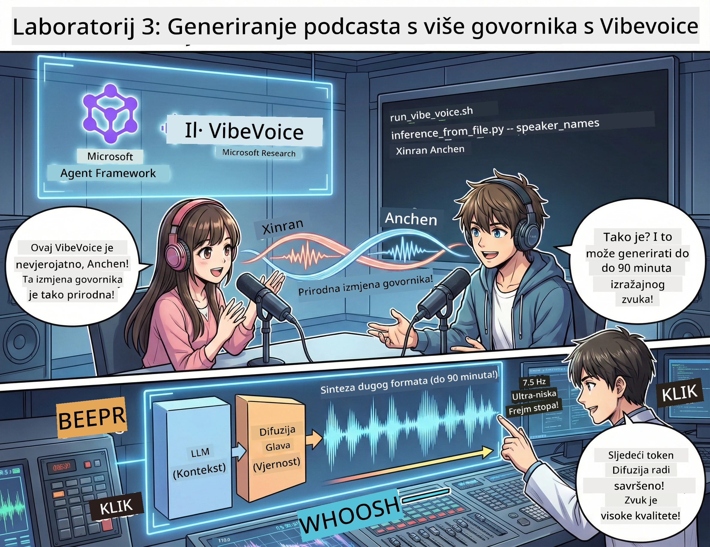

<!--
CO_OP_TRANSLATOR_METADATA:
{
  "original_hash": "d5c8bb53a007e77e7f8afe3067e64c55",
  "translation_date": "2026-01-05T16:14:49+00:00",
  "source_file": "WorkshopForAgentic/translation/zh-cn/03.Multi-SpeakerPodcastGenerationWithVibeVoice.md",
  "language_code": "hr"
}
-->
# Treća čin: Oživite svoj podcast 🎤



## Veliki završetak

Već ste istražili temu. Već ste napisali skriptu. Sada je vrijeme za završni dodir: pretvorite svoj tekst u pravi podcast audio sa stvarnim glasom!

Predstavljamo **VibeVoice** — open source TTS (pretvaranje teksta u govor) magiju iz Microsoft Researcha koja stvara:
- 🎭 Prirodan i tečan dijalog
- 👥 Više govornika (do 4!)
- ⏱️ Audio u dugom formatu (do 90 minuta!)
- 🎵 Izrazito emotivan govor (nije robotski glas!)

Ovo je tehnologija koja stoji iza sintetičkog podcasta. Idemo napraviti tvoj!

## Što je VibeVoice? (cool stvar)

VibeVoice je dar Microsoft Researcha svijetu. Osmišljen je posebno za podcast stil dijaloga.

### Zašto je sjajan 🔥

* **⏱️ Maratonske sesije**: generira do 90 minuta neprekidnog govora (to je cijela epizoda podcasta!)
* **👥 Magija više govornika**: do 4 različita glasa s dosljednim osobnostima
* **⚡ Super učinkovit**: koristi ultra nisku 7,5 Hz frekvenciju okvira za uštedu računalnih resursa
* **🧠 Pametni audio**: kombinira LLM (razumijevanje konteksta) i difuzijske modele (izrada realističnog zvuka)
* **🎭 Prirodan i tečan**: automatski tretira naizmjenično govor, pauze i ritam dijaloga

**Prijevod**: VibeVoice nije samo da čita tvoju skriptu — *izvodi* je kao prava osoba.

---

## Prije nego počneš 🚀

**Što trebaš**:

* 🐍 **Python 3.10+** (to već imaš iz prve i druge čine)
* 🚀 **uv** (brzi Python paket menadžer — instalirat ćemo ga)
* 📝 **tvoja skripta**: `podcast.txt` datoteka iz drugog čina (u `../03.Application/`)

**Pro savet**: za ovaj korak ti treba dobra internetska veza za preuzimanje predtreniranim modela. Uzmi kavu! ☕

---

## Krenimo! Jednostavan način 🎬

Napravili smo ga super jednostavnim. Jedan shell skripta radi sve.

### Postupak

1. **Učini je izvršnom**:
```bash
chmod +x run_vibe_voice.sh
```

2. **Pokreni je**:
```bash
./run_vibe_voice.sh
```

3. **Pričekaj magiju** (prvi put može potrajati nekoliko minuta)

### Što se događa iza scene 🎭

Skripta je u osnovi tvoj automatizirani audio inženjer:

1. **📥 Preuzmi VibeVoice**: klonira službeni repozitorij s GitHuba
2. **📦 Instaliraj ovisnosti**: brzo instalira pakete koristeći `uv pip`
3. **🎬 Generiraj audio**: pokreće inferencijski skript s:
   * `--model_path`: predtrenirani model VibeVoice-7B
   * `--txt_path`: tvoja skripta `podcast.txt`
   * `--speaker_names`: dodjeljuje glasove (zadano Xinran i Anchen)

**Ishod**: tvoja skripta postaje stvarna podcast epizoda! 🎉

---

## Tvoj zadatak 🎯

Ulovimo zabavu:

### Zadatak 1: Stvori sadržaj
Uredi `../03.Application/podcast.txt` u obliku dijaloga između dvije osobe. Neka bude o tehnologiji, hobijima, bilo čemu! Samo učini ga dijaloškim.

**Primjer formata**:
```
说话人 1：嘿！你听说新的 AI 模型了吗？
说话人 2：不会吧！告诉我更多！
说话人 1：它叫...
```

### Zadatak 2: Generiraj audio
Pokreni skriptu i gledaj kako se događa magija. Prvi put će potrajati više (preuzimanje modela).

### Zadatak 3: Slušaj i analizira
- Zvuči li prirodno?
- Imaju li govornici različite glasove?
- Je li izmjena govora tečna?
- Ima li trenutaka robotskog glasa?

### Zadatak 4: Eksperimentiraj (za hrabre)
Uredi `run_vibe_voice.sh` i promijeni `--speaker_names` da probaš različite kombinacije glasova. VibeVoice ima više predtrenirani glasova!

**Bonus izazov**: probaj dijalog s 3 govornika! 🎆

---

## Saznaj više 📚

* **🏠 Početna stranica projekta**: [VibeVoice službena stranica](https://microsoft.github.io/VibeVoice/)
* **🤗 Predtrenirani modeli**: [Hugging Face - VibeVoice-7B](https://huggingface.co/vibevoice/VibeVoice-7B)
* **📖 Istraživački rad**: dubinska tehnička analiza (ako si zainteresiran)

> **⚠️ Odgovorna AI napomena**: VibeVoice je vrlo moćan. Koristi ga etično! Nemoj stvarati deepfake ili obmanjujući sadržaj. Stvaraj kul stvari koje pomažu ljudima. 🙏

---

## 🏆 Čestitamo! Uspio si!

Upravo si završio cijeli tijek:
1. ✅ **Prva čin**: Izgradnja AI agenata putem prilagođenih alata
2. ✅ **Druga čin**: Orkestracija višestrukih agenata
3. ✅ **Treća čin**: Generiranje stvarnog podcast audiozapisa

**Sada imaš**:
- Efektivnog AI istraživačkog asistenta
- Cjelokupni podcast produkcijski tijek
- Pravi audio fajl koji možeš dijeliti

### Što dalje? 🚀

**Pokreni svoj podcast!**
- Postavi ga na podcast platforme
- Dijeli na društvenim mrežama
- Iteriraj i usavrši

**Nastavi graditi!**
- Isprobaj različite teme
- Eksperimentiraj s više govornika
- Dodaj pozadinsku glazbu
- Izradi web sučelje
- Automatiziraj cijeli proces

**Podijeli svoj rad!**
Označi nas! Pokaži svijetu što si napravio. Revolucija AI podcasta počinje s tobom. 🎙️

---

**Pitanja? Ideje? Priče o uspjehu?** Postavi ih u chat radionice!

**Dobrodošao u budućnost stvaranja sadržaja.** 🌟

---

<!-- CO-OP TRANSLATOR DISCLAIMER START -->
**Izjava o odricanju od odgovornosti**:
Ovaj je dokument preveden pomoću AI usluge za prevođenje [Co-op Translator](https://github.com/Azure/co-op-translator). Iako nastojimo postići točnost, imajte na umu da automatski prijevodi mogu sadržavati pogreške ili netočnosti. Izvorni dokument na izvornom jeziku treba smatrati autoritativnim izvorom. Za kritične informacije preporučuje se profesionalni ljudski prijevod. Nismo odgovorni za bilo kakva nesporazuma ili pogrešna tumačenja koja proizlaze iz korištenja ovog prijevoda.
<!-- CO-OP TRANSLATOR DISCLAIMER END -->