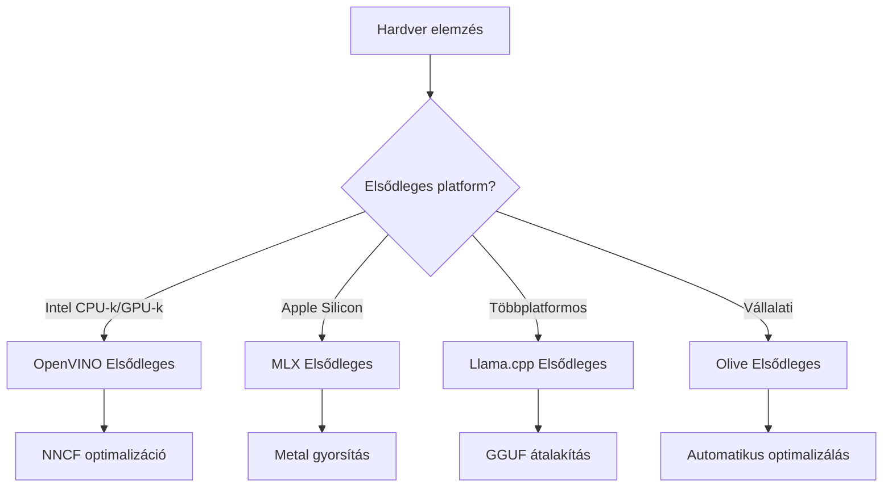
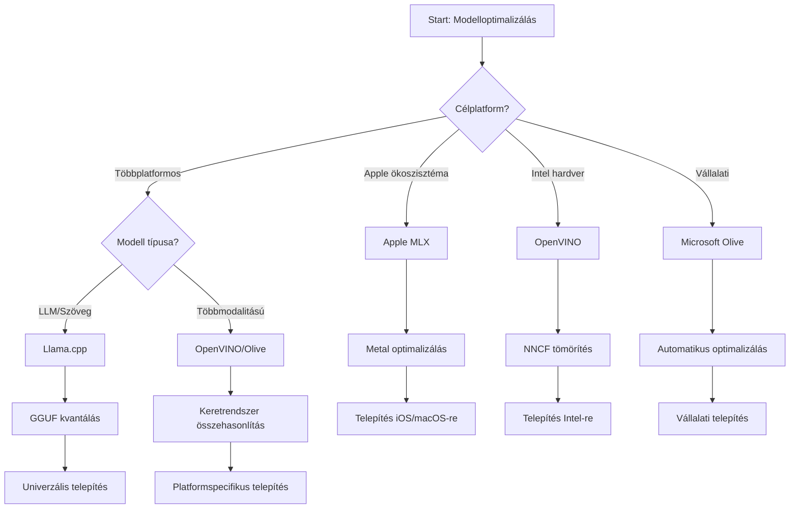
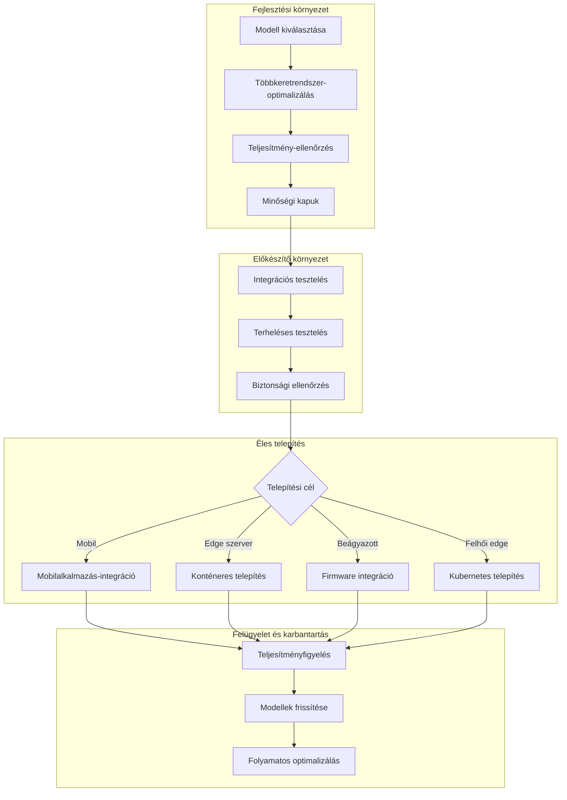

# 6. rész: Edge AI fejlesztési munkafolyamat szintézis

## Tartalomjegyzék
1. [Bevezetés](#bevezetés)
2. [Tanulási célok](#tanulási-célok)
3. [Egységes munkafolyamat áttekintés](#egységes-munkafolyamat-áttekintés)
4. [Keretrendszer kiválasztási mátrix](#keretrendszer-kiválasztási-mátrix)
5. [Legjobb gyakorlatok szintézise](#legjobb-gyakorlatok-szintézise)
6. [Telepítési stratégiakönyv](#telepítési-stratégiakönyv)
7. [Teljesítményoptimalizálási munkafolyamat](#teljesítményoptimalizálási-munkafolyamat)
8. [Termelésre kész állapot ellenőrzőlista](#termelésre-kész-állapot-ellenőrzőlista)
9. [Hibakeresés és monitorozás](#hibakeresés-és-monitorozás)
10. [Élvonalbeli Edge AI folyamathoz jövőbiztosítás](#élvonalbeli-edge-ai-folyamathoz-jövőbiztosítás)

## Bevezetés

Az Edge AI fejlesztés kifinomult megértést igényel több optimalizációs keretrendszerről, telepítési stratégiákról és hardveres megfontolásokról. Ez az átfogó szintézis egyesíti a Llama.cpp, Microsoft Olive, OpenVINO és Apple MLX tudását, hogy egységes munkafolyamatot hozzon létre, amely maximalizálja a hatékonyságot, fenntartja a minőséget, és biztosítja a sikeres éles telepítést.

A tanfolyam során megvizsgáltuk az egyes optimalizációs keretrendszereket, amelyek mindegyike egyedi erősségekkel és speciális felhasználási esetekkel rendelkezik. Azonban a valós Edge AI projektek gyakran megkövetelik több keretrendszer technikáinak kombinálását vagy stratégiai döntések meghozatalát arról, melyik megközelítés biztosítja a legjobb eredményt adott korlátozások és követelmények mellett.

Ez a szakasz összesíti mindegyik keretrendszer kollektív bölcsességét cselekvési munkafolyamatokba, döntési fákká és legjobb gyakorlatokká, amelyek lehetővé teszik hatékony és eredményes gyártásra kész Edge AI megoldások kiépítését. Akár mobileszközök, beágyazott rendszerek, vagy élvezeti szerverek optimalizálására törekszel, ez az útmutató stratégiai keretet biztosít a fejlesztési életciklusod alatt meghozandó megalapozott döntésekhez.

## Tanulási célok

E szakasz végére képes leszel:

### Stratégiai döntéshozatal
- **Értékelni és kiválasztani** az optimális optimalizációs keretrendszert projektkövetelmények, hardverkorlátozások és telepítési forgatókönyvek alapján
- **Átfogó munkafolyamatokat tervezni**, amelyek több optimalizációs technikát egyesítenek a maximális hatékonyság érdekében
- **Mérlegelni az ellentéteket** a modell pontossága, az inferencia sebessége, a memóriahasználat és a telepítési összetettség között különböző keretrendszerekben

### Munkafolyamat integráció
- **Egységes fejlesztési csatornákat alkalmazni**, amelyek kihasználják több keretrendszer erősségeit
- **Reprodukálható munkafolyamatokat létrehozni** a konzisztens modelloptimalizáláshoz és telepítéshez különböző környezetekben
- **Minőségi kapukat és validációs folyamatokat bevezetni**, hogy az optimalizált modellek megfeleljenek a gyártási követelményeknek

### Teljesítményoptimalizálás
- **Rendszeres optimalizálási stratégiákat alkalmazni**, kvantálás, prúnolás és hardverspecifikus gyorsítási technikák felhasználásával
- **Monitorozni és benchmarkokat végezni** a modell teljesítményén különböző optimalizációs szinteken és telepítési célok mentén
- **Optimalizálni speciális hardverplatformokra** beleértve CPU, GPU, NPU, és szakosodott edge gyorsítókat

### Éles telepítés
- **Skálázható telepítési architektúrákat tervezni**, amelyek több modellformátumot és inferencia motort támogathatnak
- **Monitorozást és megfigyelhetőséget implementálni** az éles Edge AI alkalmazások számára
- **Karbantartási munkafolyamatokat kialakítani** a modellfrissítésekhez, teljesítménykövetéshez és rendszeroptimalizáláshoz

### Platformközi kiválóság
- **Optimalizált modelleket telepíteni** változatos hardverplatformokon, miközben fenntartod a konzisztens teljesítményt
- **Platformspecifikus optimalizálásokat kezelni** Windows, macOS, Linux, mobil és beágyazott rendszerekre
- **Absztrakciós rétegeket létrehozni**, amelyek zökkenőmentes telepítést tesznek lehetővé különböző edge környezetekben

## Egységes munkafolyamat áttekintés

### 1. fázis: Követelmény elemzés és keretrendszer kiválasztás

A sikeres Edge AI telepítés alapját a alapos követelmény elemzés jelenti, amely tájékoztatja a keretrendszer kiválasztását és az optimalizációs stratégiát.

#### 1.1 Hardver értékelés


**Kulcsfontosságú szempontok:**
- **CPU architektúra**: x86, ARM, Apple Silicon képességek
- **Gyorsító elérhetőség**: GPU, NPU, VPU, speciális AI chipek
- **Memória korlátok**: RAM korlátozások, tárhely kapacitás
- **Energia keret**: Akkumulátor élettartam, hőkorlátok
- **Kapcsolódás**: Offline követelmények, sávszélesség korlátok

#### 1.2 Alkalmazási követelmények mátrixa

| Követelmény | Llama.cpp | Microsoft Olive | OpenVINO | Apple MLX |
|-------------|-----------|-----------------|----------|-----------|
| Platformfüggetlen | ✅ Kiváló | ⚡ Jó | ⚡ Jó | ❌ Csak Apple |
| Vállalati integráció | ⚡ Alap | ✅ Kiváló | ✅ Kiváló | ⚡ Korlátozott |
| Mobil telepítés | ✅ Kiváló | ⚡ Jó | ⚡ Jó | ✅ iOS Kiváló |
| Valós idejű inferencia | ✅ Kiváló | ✅ Kiváló | ✅ Kiváló | ✅ Kiváló |
| Modell sokszínűség | ✅ LLM fókusz | ✅ Minden modell | ✅ Minden modell | ✅ LLM fókusz |
| Használhatóság | ✅ Egyszerű | ✅ Automata | ⚡ Közepes | ✅ Egyszerű |

### 2. fázis: Modell előkészítés és optimalizáció

#### 2.1 Univerzális modellértékelő csatorna

```python
# Univerzális Modell Értékelési Keretrendszer
class EdgeAIModelAssessment:
    def __init__(self, model_path, target_hardware):
        self.model_path = model_path
        self.target_hardware = target_hardware
        self.optimization_frameworks = []
        
    def assess_model_characteristics(self):
        """Analyze model size, architecture, and complexity"""
        return {
            'model_size': self.get_model_size(),
            'parameter_count': self.get_parameter_count(),
            'architecture_type': self.detect_architecture(),
            'quantization_compatibility': self.check_quantization_support()
        }
    
    def recommend_optimization_strategy(self):
        """Recommend optimal frameworks and techniques"""
        characteristics = self.assess_model_characteristics()
        
        if self.target_hardware.startswith('apple'):
            return self.mlx_optimization_strategy(characteristics)
        elif self.target_hardware.startswith('intel'):
            return self.openvino_optimization_strategy(characteristics)
        elif characteristics['model_size'] > 7_000_000_000:  # 7 milliárd+ paraméter
            return self.enterprise_optimization_strategy(characteristics)
        else:
            return self.lightweight_optimization_strategy(characteristics)
```

#### 2.2 Többkeretrendszeres optimalizációs csatorna

**Szekvenciális optimalizációs megközelítés:**
1. **Kezdeti konverzió**: Átalakítás köztes formátumba (amennyiben lehet ONNX)
2. **Keretrendszerspecifikus optimalizáció**: Speciális technikák alkalmazása
3. **Keresztvalidáció**: Teljesítmény ellenőrzése a célplatformokon
4. **Végső csomagolás**: Előkészítés a telepítéshez

```bash
# Többkeretrendszeres optimalizációs szkript
#!/bin/bash

MODEL_NAME="phi-3-mini"
BASE_MODEL="microsoft/Phi-3-mini-4k-instruct"

# 1. fázis: ONNX átalakítás (univerzális)
python convert_to_onnx.py --model $BASE_MODEL --output models/onnx/

# 2. fázis: Platform-specifikus optimalizáció
if [[ "$TARGET_PLATFORM" == "intel" ]]; then
    # OpenVINO optimalizáció
    python optimize_openvino.py --input models/onnx/ --output models/openvino/
elif [[ "$TARGET_PLATFORM" == "apple" ]]; then
    # MLX optimalizáció
    python optimize_mlx.py --input $BASE_MODEL --output models/mlx/
elif [[ "$TARGET_PLATFORM" == "cross" ]]; then
    # Llama.cpp optimalizáció
    python convert_to_gguf.py --input models/onnx/ --output models/gguf/
fi

# 3. fázis: Érvényesítés
python validate_optimization.py --original $BASE_MODEL --optimized models/$TARGET_PLATFORM/
```

### 3. fázis: Teljesítményellenőrzés és benchmark

#### 3.1 Átfogó benchmarking keretrendszer

```python
class EdgeAIBenchmark:
    def __init__(self, optimized_models):
        self.models = optimized_models
        self.metrics = {
            'inference_time': [],
            'memory_usage': [],
            'accuracy_score': [],
            'throughput': [],
            'energy_consumption': []
        }
    
    def run_comprehensive_benchmark(self):
        """Execute standardized benchmarks across all optimized models"""
        test_inputs = self.generate_test_inputs()
        
        for model_framework, model_path in self.models.items():
            print(f"Benchmarking {model_framework}...")
            
            # Késleltetés tesztelése
            latency = self.measure_inference_latency(model_path, test_inputs)
            
            # Memória profilozás
            memory = self.profile_memory_usage(model_path)
            
            # Pontosság ellenőrzése
            accuracy = self.validate_model_accuracy(model_path, test_inputs)
            
            # Átbocsátóképesség elemzése
            throughput = self.measure_throughput(model_path)
            
            self.record_metrics(model_framework, latency, memory, accuracy, throughput)
    
    def generate_optimization_report(self):
        """Create comprehensive comparison report"""
        report = {
            'recommendations': self.analyze_performance_trade_offs(),
            'deployment_guidance': self.generate_deployment_recommendations(),
            'monitoring_requirements': self.define_monitoring_metrics()
        }
        return report
```

## Keretrendszer kiválasztási mátrix

### Döntési fa a keretrendszer kiválasztásához



### Átfogó kiválasztási szempontok

#### 1. Elsődleges felhasználási eset összehangolás

**Nagy nyelvi modellek (LLM-ek):**
- **Llama.cpp**: Legjobb CPU-fókuszú, platformfüggetlen telepítéshez
- **Apple MLX**: Optimális Apple Silicon számára egységes memóriakezeléssel
- **OpenVINO**: Kiváló Intel hardverhez NNCF optimalizációval
- **Microsoft Olive**: Ideális vállalati munkafolyamatokhoz automatizálással

**Multimodális modellek:**
- **OpenVINO**: Átfogó támogatás látás, hang és szöveg számára
- **Microsoft Olive**: Vállalati szintű optimalizáció összetett csatornákhoz
- **Llama.cpp**: Csak szöveges modellekhez korlátozott támogatás
- **Apple MLX**: Növekvő támogatás multimodális alkalmazásokhoz

#### 2. Hardver platform mátrix

| Platform | Elsődleges keretrendszer | Másodlagos opció | Speciális jellemzők |
|----------|------------------|------------------|---------------------|
| Intel CPU/GPU | OpenVINO | Microsoft Olive | NNCF tömörítés, Intel optimalizáció |
| NVIDIA GPU | Microsoft Olive | OpenVINO | CUDA gyorsítás, vállalati funkciók |
| Apple Silicon | Apple MLX | Llama.cpp | Metal shader-ek, egységes memória |
| ARM mobil | Llama.cpp | OpenVINO | Platformfüggetlen, minimális függőség |
| Edge TPU | OpenVINO | Microsoft Olive | Speciális gyorsító támogatás |
| Beágyazott ARM | Llama.cpp | OpenVINO | Minimális helyigény, hatékony inferencia |

#### 3. Fejlesztési munkafolyamat preferenciák

**Gyors prototípus készítés:**
1. **Llama.cpp**: Leggyorsabb beállítás, azonnali eredmények
2. **Apple MLX**: Egyszerű Python API, gyors iteráció
3. **Microsoft Olive**: Automatikus optimalizáció, minimális konfiguráció
4. **OpenVINO**: Bonyolultabb beállítás, átfogó funkciók

**Vállalati gyártás:**
1. **Microsoft Olive**: Vállalati funkciók, Azure integráció
2. **OpenVINO**: Intel ökoszisztéma, átfogó eszközök
3. **Apple MLX**: Apple-specifikus vállalati alkalmazások
4. **Llama.cpp**: Egyszerű telepítés, korlátozott vállalati funkciók

## Legjobb gyakorlatok szintézise

### Univerzális optimalizációs alapelvek

#### 1. Progresszív optimalizációs stratégia

```python
class ProgressiveOptimization:
    def __init__(self, base_model):
        self.base_model = base_model
        self.optimization_stages = [
            'baseline_measurement',
            'format_conversion',
            'quantization_optimization',
            'hardware_acceleration',
            'production_validation'
        ]
    
    def execute_progressive_optimization(self):
        """Apply optimization techniques incrementally"""
        
        # 1. szakasz: Alapmérés
        baseline_metrics = self.measure_baseline_performance()
        
        # 2. szakasz: Formátum átalakítása
        converted_model = self.convert_to_optimal_format()
        conversion_metrics = self.measure_performance(converted_model)
        
        # 3. szakasz: Kvantálás
        quantized_model = self.apply_quantization(converted_model)
        quantization_metrics = self.measure_performance(quantized_model)
        
        # 4. szakasz: Hardveres gyorsítás
        accelerated_model = self.enable_hardware_acceleration(quantized_model)
        acceleration_metrics = self.measure_performance(accelerated_model)
        
        # 5. szakasz: Érvényesítés
        production_ready = self.validate_for_production(accelerated_model)
        
        return self.compile_optimization_report(
            baseline_metrics, conversion_metrics, 
            quantization_metrics, acceleration_metrics
        )
```

#### 2. Minőségi kapuk megvalósítása

**Pontosság megőrző kapuk:**
- Tartsa meg az eredeti modell pontosságának >95%-át
- Validálja reprezentatív tesztadatokon
- Alkalmazzon A/B tesztelést a termelési validációhoz

**Teljesítmény javító kapuk:**
- Legalább kétszeres sebességnövekedést érjen el
- Csökkentse a memória lábnyomot legalább 50%-kal
- Validálja az inferencia idő konzisztenciáját

**Termelésre kész kapuk:**
- Tűrje ki a terheléses stressztesztet
- Bizonyítsa a stabil teljesítményt idővel
- Validálja a biztonsági és adatvédelmi követelményeket

### Keretrendszerspecifikus legjobb gyakorlatok integrációja

#### 1. Kvantálási stratégia szintézise

```python
# Egységes Kvantálási Megközelítés
class UnifiedQuantizationStrategy:
    def __init__(self, model, target_platform):
        self.model = model
        self.platform = target_platform
        
    def select_optimal_quantization(self):
        """Choose best quantization based on platform and requirements"""
        
        if self.platform == 'apple_silicon':
            return self.mlx_quantization_strategy()
        elif self.platform == 'intel_hardware':
            return self.openvino_quantization_strategy()
        elif self.platform == 'cross_platform':
            return self.llamacpp_quantization_strategy()
        else:
            return self.olive_quantization_strategy()
    
    def mlx_quantization_strategy(self):
        """Apple MLX-specific quantization"""
        return {
            'method': 'mlx_quantize',
            'precision': 'int4',
            'group_size': 64,
            'optimization_target': 'unified_memory'
        }
    
    def openvino_quantization_strategy(self):
        """OpenVINO NNCF quantization"""
        return {
            'method': 'nncf_quantize',
            'precision': 'int8',
            'calibration_method': 'post_training',
            'optimization_target': 'intel_hardware'
        }
```

#### 2. Hardver gyorsítás optimalizációja

**CPU optimalizáció szintézis:**
- **SIMD utasítások**: Használja ki a keretrendszerek optimalizált kerneljeit
- **Memória sávszélesség**: Optimalizálja az adat elrendezéseket a cache hatékonyságért
- **Szálkezelés**: Egyensúlyozza a párhuzamosságot erőforrás-korlátozásokkal

**GPU gyorsítási legjobb gyakorlatok:**
- **Batch feldolgozás**: Maximalizálja az áteresztőképességet megfelelő batch méretekkel
- **Memóriakezelés**: Optimalizálja a GPU memória foglalását és átviteleket
- **Precizitás**: Használjon támogatott helyeken FP16-ot a jobb teljesítményért

**NPU/Specializált gyorsító optimalizáció:**
- **Modellarchitektúra**: Biztosítsa a gyorsító képességekkel való kompatibilitást
- **Adatáramlás**: Optimalizálja a bemeneti/kimeneti csatornákat a gyorsítóhatékonyság érdekében
- **Fallback stratégiák**: Valósítson meg CPU fallback-et a nem támogatott műveletekhez

## Telepítési stratégiakönyv

### Univerzális telepítési architektúra



### Platformspecifikus telepítési minták

#### 1. Mobil telepítési stratégia

```yaml
# Mobile Deployment Configuration
mobile_deployment:
  ios:
    framework: apple_mlx
    optimization:
      quantization: int4
      memory_mapping: true
      background_execution: limited
    packaging:
      format: mlx
      bundle_size: <50MB
      
  android:
    framework: llama_cpp
    optimization:
      quantization: q4_k_m
      threading: android_optimized
      memory_management: conservative
    packaging:
      format: gguf
      apk_size: <100MB
      
  cross_platform:
    framework: onnx_runtime
    optimization:
      quantization: int8
      execution_provider: cpu
    packaging:
      format: onnx
      shared_libraries: minimal
```

#### 2. Edge szerver telepítés

```yaml
# Edge Server Deployment Configuration
edge_server:
  intel_based:
    framework: openvino
    optimization:
      quantization: int8
      acceleration: cpu_gpu_auto
      batch_processing: dynamic
    deployment:
      container: openvino_runtime
      orchestration: kubernetes
      scaling: horizontal
      
  nvidia_based:
    framework: microsoft_olive
    optimization:
      quantization: int4
      acceleration: cuda
      tensor_parallelism: true
    deployment:
      container: nvidia_triton
      orchestration: kubernetes
      scaling: gpu_aware
```

### Konténerizáció legjobb gyakorlatai

```dockerfile
# Multi-Framework Edge AI Container
FROM ubuntu:22.04 as base

# Install common dependencies
RUN apt-get update && apt-get install -y \
    python3 \
    python3-pip \
    build-essential \
    cmake \
    && rm -rf /var/lib/apt/lists/*

# Framework-specific stages
FROM base as openvino
RUN pip install openvino nncf optimum[intel]

FROM base as llamacpp
RUN git clone https://github.com/ggerganov/llama.cpp.git \
    && cd llama.cpp && make LLAMA_OPENBLAS=1

FROM base as olive
RUN pip install olive-ai[auto-opt] onnxruntime-genai

# Production stage with selected framework
FROM openvino as production
COPY models/ /app/models/
COPY src/ /app/src/
WORKDIR /app

EXPOSE 8080
CMD ["python3", "src/inference_server.py"]
```

## Teljesítményoptimalizálási munkafolyamat

### Rendszeres teljesítményhangolás

#### 1. Teljesítményprofilozó csatorna

```python
class EdgeAIPerformanceProfiler:
    def __init__(self, model_path, framework):
        self.model_path = model_path
        self.framework = framework
        self.profiling_results = {}
    
    def comprehensive_profiling(self):
        """Execute comprehensive performance analysis"""
        
        # CPU elemzés
        cpu_profile = self.profile_cpu_usage()
        
        # Memória elemzés
        memory_profile = self.profile_memory_usage()
        
        # Inferenz késleltetés
        latency_profile = self.profile_inference_latency()
        
        # Áteresztőképesség elemzés
        throughput_profile = self.profile_throughput()
        
        # Energiafogyasztás (ahol elérhető)
        energy_profile = self.profile_energy_consumption()
        
        return self.compile_performance_report(
            cpu_profile, memory_profile, latency_profile,
            throughput_profile, energy_profile
        )
    
    def identify_bottlenecks(self):
        """Automatically identify performance bottlenecks"""
        bottlenecks = []
        
        if self.profiling_results['cpu_utilization'] > 80:
            bottlenecks.append('cpu_bound')
        
        if self.profiling_results['memory_usage'] > 90:
            bottlenecks.append('memory_bound')
        
        if self.profiling_results['inference_variance'] > 20:
            bottlenecks.append('inconsistent_performance')
        
        return self.generate_optimization_recommendations(bottlenecks)
```

#### 2. Automatikus optimalizációs csatorna

```python
class AutomatedOptimizationPipeline:
    def __init__(self, base_model, target_constraints):
        self.base_model = base_model
        self.constraints = target_constraints
        self.optimization_history = []
    
    def execute_optimization_search(self):
        """Systematically search optimization space"""
        
        optimization_candidates = [
            {'quantization': 'int8', 'pruning': 0.1},
            {'quantization': 'int4', 'pruning': 0.2},
            {'quantization': 'int8', 'acceleration': 'gpu'},
            {'quantization': 'int4', 'acceleration': 'npu'}
        ]
        
        best_configuration = None
        best_score = 0
        
        for config in optimization_candidates:
            optimized_model = self.apply_optimization(config)
            score = self.evaluate_optimization(optimized_model)
            
            if score > best_score and self.meets_constraints(optimized_model):
                best_score = score
                best_configuration = config
            
            self.optimization_history.append({
                'config': config,
                'score': score,
                'model': optimized_model
            })
        
        return best_configuration, self.optimization_history
```

### Többcélú optimalizáció

#### 1. Pareto optimalizáció Edge AI számára

```python
class ParetoOptimization:
    def __init__(self, objectives=['speed', 'accuracy', 'memory']):
        self.objectives = objectives
        self.pareto_frontier = []
    
    def find_pareto_optimal_solutions(self, optimization_results):
        """Identify Pareto-optimal configurations"""
        
        for result in optimization_results:
            is_dominated = False
            
            for frontier_point in self.pareto_frontier:
                if self.dominates(frontier_point, result):
                    is_dominated = True
                    break
            
            if not is_dominated:
                # Távolítsa el a dominált pontokat a határvonalról
                self.pareto_frontier = [
                    point for point in self.pareto_frontier 
                    if not self.dominates(result, point)
                ]
                
                self.pareto_frontier.append(result)
        
        return self.pareto_frontier
    
    def recommend_configuration(self, user_preferences):
        """Recommend configuration based on user preferences"""
        
        weighted_scores = []
        for config in self.pareto_frontier:
            score = sum(
                user_preferences[obj] * config['metrics'][obj] 
                for obj in self.objectives
            )
            weighted_scores.append((score, config))
        
        return max(weighted_scores, key=lambda x: x[0])[1]
```

## Termelésre kész állapot ellenőrzőlista

### Átfogó prod. validáció

#### 1. Modell minőségbiztosítás

```python
class ProductionReadinessValidator:
    def __init__(self, optimized_model, production_requirements):
        self.model = optimized_model
        self.requirements = production_requirements
        self.validation_results = {}
    
    def validate_model_quality(self):
        """Comprehensive model quality validation"""
        
        # Pontosság érvényesítése
        accuracy_result = self.validate_accuracy()
        
        # Teljesítmény érvényesítése
        performance_result = self.validate_performance()
        
        # Robusztusság tesztelése
        robustness_result = self.validate_robustness()
        
        # Biztonsági értékelés
        security_result = self.validate_security()
        
        # Megfelelőség ellenőrzése
        compliance_result = self.validate_compliance()
        
        return self.compile_validation_report(
            accuracy_result, performance_result, robustness_result,
            security_result, compliance_result
        )
    
    def generate_certification_report(self):
        """Generate production certification report"""
        return {
            'model_signature': self.generate_model_signature(),
            'validation_timestamp': datetime.now(),
            'validation_results': self.validation_results,
            'deployment_approval': self.check_deployment_approval(),
            'monitoring_requirements': self.define_monitoring_requirements()
        }
```

#### 2. Termelési telepítési ellenőrzőlista

**Telepítés előtti validáció:**
- [ ] A modell pontossága megfelel a minimumkövetelményeknek (>95% alapon)
- [ ] Teljesítménycélok elérve (késleltetés, átviteli sebesség, memória)
- [ ] Biztonsági sebezhetőségek értékelve és kezelve
- [ ] Terheléses stresszteszt befejezve
- [ ] Hibaszcenáriók tesztelve és helyreállítási eljárások ellenőrizve
- [ ] Monitorozó és riasztó rendszerek konfigurálva
- [ ] Visszagörgetési eljárások tesztelve és dokumentálva

**Telepítési folyamat:**
- [ ] Kék-zöld telepítési stratégia megvalósítva
- [ ] Fokozatos forgalomnövelés beállítva
- [ ] Valós idejű monitorozó irányítópultok aktívak
- [ ] Teljesítmény alapvonalak megállapítva
- [ ] Hibaarány küszöbértékek definiálva
- [ ] Automatikus visszagörgetési kiváltók konfigurálva

**Utólagos monitorozás:**
- [ ] Modell elcsúszás érzékelés aktív
- [ ] Teljesítmény romlási riasztások beállítva
- [ ] Erőforrás kihasználtság monitorozás engedélyezve
- [ ] Felhasználói élmény metrikák követve
- [ ] Modell verziózás és leszármazás fenntartva
- [ ] Rendszeres modell teljesítmény áttekintések ütemezve

### Folyamatos integráció/Folyamatos telepítés (CI/CD)

```yaml
# Edge AI CI/CD Pipeline Configuration
edge_ai_pipeline:
  stages:
    - model_validation
    - optimization
    - testing
    - staging_deployment
    - production_deployment
    - monitoring
  
  model_validation:
    accuracy_threshold: 0.95
    performance_baseline: required
    security_scan: enabled
    
  optimization:
    frameworks:
      - llama_cpp
      - openvino
      - microsoft_olive
    validation:
      cross_validation: enabled
      performance_comparison: required
      
  testing:
    unit_tests: comprehensive
    integration_tests: full_pipeline
    load_tests: production_scale
    security_tests: comprehensive
    
  deployment:
    strategy: blue_green
    traffic_ramping: gradual
    rollback: automatic
    monitoring: real_time
```

## Hibakeresés és monitorozás

### Univerzális hibakeresési keretrendszer

#### 1. Gyakori problémák és megoldások

**Teljesítmény problémák:**
```python
class PerformanceTroubleshooter:
    def __init__(self, model_metrics):
        self.metrics = model_metrics
        
    def diagnose_performance_issues(self):
        """Systematic performance issue diagnosis"""
        
        issues = []
        
        # Magas késleltetés diagnosztika
        if self.metrics['avg_latency'] > self.metrics['target_latency']:
            issues.append(self.diagnose_latency_issues())
        
        # Memóriahasználat diagnosztika
        if self.metrics['memory_usage'] > self.metrics['memory_limit']:
            issues.append(self.diagnose_memory_issues())
        
        # Átviteli sebesség diagnosztika
        if self.metrics['throughput'] < self.metrics['target_throughput']:
            issues.append(self.diagnose_throughput_issues())
        
        return self.generate_resolution_plan(issues)
    
    def diagnose_latency_issues(self):
        """Specific latency troubleshooting"""
        potential_causes = []
        
        if self.metrics['cpu_utilization'] > 80:
            potential_causes.append('cpu_bottleneck')
        
        if self.metrics['memory_bandwidth'] > 90:
            potential_causes.append('memory_bandwidth_limit')
        
        if self.metrics['model_size'] > self.metrics['optimal_size']:
            potential_causes.append('model_too_large')
        
        return {
            'issue': 'high_latency',
            'causes': potential_causes,
            'solutions': self.generate_latency_solutions(potential_causes)
        }
```

**Keretrendszerspecifikus hibakeresés:**

| Probléma | Llama.cpp | Microsoft Olive | OpenVINO | Apple MLX |
|-------|-----------|-----------------|----------|-----------|
| Memória problémák | Csökkentett kontextus hossz | Kisebb batch méret | Gyorsítótár engedélyezése | Memória térképezés használata |
| Lassú inferencia | SIMD engedélyezése | Kvantálás ellenőrzése | Szálkezelés optimalizálása | Metal engedélyezése |
| Pontosságvesztés | Magasabb kvantálás | Átképzés QAT-tal | Kalibráció növelése | Utókvant finomhangolás |
| Kompatibilitás | Modellformátum ellenőrzése | Keretrendszer verzió ellenőrzése | Driver frissítés | macOS verzió ellenőrzése |

#### 2. Termelési monitorozási stratégia

```python
class EdgeAIMonitoring:
    def __init__(self, deployment_config):
        self.config = deployment_config
        self.metrics_collectors = []
        self.alerting_rules = []
    
    def setup_comprehensive_monitoring(self):
        """Configure comprehensive monitoring for Edge AI deployment"""
        
        # Modell Teljesítményének Figyelése
        self.setup_model_performance_monitoring()
        
        # Infrastruktúra Figyelése
        self.setup_infrastructure_monitoring()
        
        # Üzleti Mutatók Figyelése
        self.setup_business_metrics_monitoring()
        
        # Biztonsági Figyelés
        self.setup_security_monitoring()
    
    def setup_model_performance_monitoring(self):
        """Model-specific performance monitoring"""
        metrics = [
            'inference_latency_p50',
            'inference_latency_p95',
            'inference_latency_p99',
            'model_accuracy_drift',
            'prediction_confidence_distribution',
            'error_rate',
            'throughput_requests_per_second'
        ]
        
        for metric in metrics:
            self.add_metric_collector(metric)
            self.add_alerting_rule(metric)
    
    def detect_model_drift(self):
        """Automated model drift detection"""
        drift_indicators = [
            self.statistical_drift_detection(),
            self.performance_drift_detection(),
            self.data_distribution_shift_detection()
        ]
        
        return self.aggregate_drift_signals(drift_indicators)
```

### Automatikus hibamegoldás

```python
class AutomatedIssueResolution:
    def __init__(self, monitoring_system):
        self.monitoring = monitoring_system
        self.resolution_strategies = {}
    
    def handle_performance_degradation(self, alert):
        """Automated performance issue resolution"""
        
        if alert['type'] == 'high_latency':
            return self.resolve_latency_issue(alert)
        elif alert['type'] == 'high_memory_usage':
            return self.resolve_memory_issue(alert)
        elif alert['type'] == 'accuracy_drift':
            return self.resolve_accuracy_issue(alert)
        
    def resolve_latency_issue(self, alert):
        """Automated latency issue resolution"""
        resolution_steps = [
            'increase_cpu_allocation',
            'enable_model_caching',
            'reduce_batch_size',
            'switch_to_quantized_model'
        ]
        
        for step in resolution_steps:
            if self.apply_resolution_step(step):
                return f"Resolved latency issue with: {step}"
        
        return "Escalating to human operator"
```

## Élvonalbeli Edge AI folyamathoz jövőbiztosítás

### Felmerülő technológiák integrálása

#### 1. Következő generációs hardver támogatás

```python
class FutureHardwareIntegration:
    def __init__(self):
        self.supported_accelerators = [
            'npu_next_gen',
            'quantum_processors',
            'neuromorphic_chips',
            'optical_processors'
        ]
    
    def design_adaptive_pipeline(self):
        """Create hardware-agnostic optimization pipeline"""
        
        pipeline = {
            'model_preparation': self.universal_model_preparation(),
            'hardware_detection': self.dynamic_hardware_detection(),
            'optimization_selection': self.adaptive_optimization_selection(),
            'performance_validation': self.hardware_agnostic_validation()
        }
        
        return pipeline
    
    def adaptive_optimization_selection(self):
        """Dynamically select optimization based on available hardware"""
        
        def optimize_for_hardware(model, available_hardware):
            if 'npu' in available_hardware:
                return self.npu_optimization(model)
            elif 'quantum' in available_hardware:
                return self.quantum_optimization(model)
            elif 'neuromorphic' in available_hardware:
                return self.neuromorphic_optimization(model)
            else:
                return self.fallback_optimization(model)
        
        return optimize_for_hardware
```

#### 2. Modellarchitektúra fejlődés

**Támogatás a felmerülő architektúrák számára:**
- **Mixture of Experts (MoE)**: Ritka modellarchitektúrák a hatékonyságért
- **Retrieval-Augmented Generation**: Hibrid modell + tudásbázis rendszerek
- **Multimodális modellek**: Látás + Nyelv + Hang integráció
- **Federated Learning**: Elosztott tanítás és optimalizáció

```python
class NextGenModelSupport:
    def __init__(self):
        self.architecture_handlers = {
            'moe': self.handle_mixture_of_experts,
            'rag': self.handle_retrieval_augmented,
            'multimodal': self.handle_multimodal,
            'federated': self.handle_federated_learning
        }
    
    def handle_mixture_of_experts(self, model):
        """Optimize Mixture of Experts models for edge deployment"""
        optimization_strategy = {
            'expert_pruning': True,
            'routing_optimization': True,
            'expert_quantization': 'per_expert',
            'load_balancing': 'dynamic'
        }
        return self.apply_moe_optimization(model, optimization_strategy)
```

### Folyamatos tanulás és alkalmazkodás

#### 1. Online tanulás integráció

```python
class EdgeOnlineLearning:
    def __init__(self, base_model, learning_rate=0.001):
        self.base_model = base_model
        self.learning_rate = learning_rate
        self.adaptation_buffer = []
    
    def continuous_adaptation(self, new_data, feedback):
        """Continuously adapt model based on edge data"""
        
        # Adatvédelmet biztosító helyi alkalmazkodás
        local_updates = self.compute_local_gradients(new_data, feedback)
        
        # Frissítések alkalmazása korlátokkal
        adapted_model = self.apply_constrained_updates(
            self.base_model, local_updates
        )
        
        # Az adaptáció minőségének ellenőrzése
        if self.validate_adaptation(adapted_model):
            self.base_model = adapted_model
            return True
        
        return False
    
    def federated_learning_participation(self):
        """Participate in federated learning while preserving privacy"""
        
        # Helyi modellfrissítések kiszámítása
        local_updates = self.compute_private_updates()
        
        # Differenciális adatvédelmi védelem
        private_updates = self.apply_differential_privacy(local_updates)
        
        # Megosztás a federált tanulás koordinátorával
        return self.share_updates(private_updates)
```

#### 2. Fenntarthatóság és zöld AI

```python
class GreenEdgeAI:
    def __init__(self, sustainability_targets):
        self.targets = sustainability_targets
        self.energy_monitor = EnergyMonitor()
    
    def optimize_for_sustainability(self, model):
        """Optimize model for minimal environmental impact"""
        
        optimization_objectives = [
            'minimize_energy_consumption',
            'maximize_hardware_utilization',
            'reduce_model_training_cost',
            'extend_device_lifetime'
        ]
        
        return self.multi_objective_green_optimization(
            model, optimization_objectives
        )
    
    def carbon_aware_deployment(self):
        """Deploy models considering carbon footprint"""
        
        deployment_strategy = {
            'prefer_renewable_energy_regions': True,
            'optimize_for_energy_efficiency': True,
            'minimize_data_transfer': True,
            'lifecycle_carbon_accounting': True
        }
        
        return deployment_strategy
```

## Összefoglalás

Ez az átfogó munkafolyamat szintézis az Edge AI optimalizációs tudás tetőpontját képviseli, egyesítve minden fő optimalizációs keretrendszer legjobb gyakorlatait egységes, gyártásra kész megközelítésbe. Ezen irányelvek követésével képes leszel:

**Optimális teljesítmény elérése**: Rendszeres keretrendszer kiválasztás, progresszív optimalizáció és átfogó validáció segítségével, biztosítva, hogy Edge AI alkalmazásaid maximális hatékonysággal működjenek.

**Termelésre készség biztosítása**: Alapos tesztelés, monitorozás és minőségi kapuk által garantált megbízható telepítés és működés valós környezetben.

**Hosszú távú siker fenntartása**: Folyamatos monitorozással, automatikus hibamegoldással és alkalmazkodási stratégiákkal, amelyek Edge AI megoldásaidat teljesítményorientáltan és relevánsan tartják.

**Befektetésed jövőbiztosítása**: Rugalmas, hardverfüggetlen folyamatokat tervezve, amelyek képesek fejlődni a felmerülő technológiák és követelmények mentén.

Az edge AI terület gyorsan fejlődik, új hardverplatformokkal, optimalizálási technikákkal és telepítési stratégiákkal. Ez a szintézis alapot nyújt ennek a komplexitásnak a kezeléséhez miközben robusztus, hatékony és fenntartható Edge AI megoldásokat építesz, amelyek valódi értéket teremtenek termelési környezetben.

Ne feledd, a legjobb optimalizációs stratégia az, amely megfelel specifikus követelményeidnek miközben fenntartja az alkalmazkodóképességet az esetleges változásokra. Használd ezt az útmutatót keretrendszerként megalapozott döntésekhez, de mindig validáld választásaidat empirikus teszteléssel és valós telepítési tapasztalatokkal.

## ➡️ Mi következik


- [07: Qualcomm QNN Framework Mélyreható Bemutatása](./07.QualcommQNN.md)

---

<!-- CO-OP TRANSLATOR DISCLAIMER START -->
**Jogi nyilatkozat**:
Ez a dokumentum az AI fordítási szolgáltatás, a [Co-op Translator](https://github.com/Azure/co-op-translator) segítségével készült. Bár az pontosságra törekszünk, kérjük, vegye figyelembe, hogy az automatikus fordítások hibákat vagy pontatlanságokat tartalmazhatnak. Az eredeti dokumentum az anyanyelvén tekintendő hiteles forrásnak. Fontos információk esetén professzionális emberi fordítást javasolunk. Nem vállalunk felelősséget semmilyen félreértésért vagy téves értelmezésért, amely ebből a fordításból ered.
<!-- CO-OP TRANSLATOR DISCLAIMER END -->