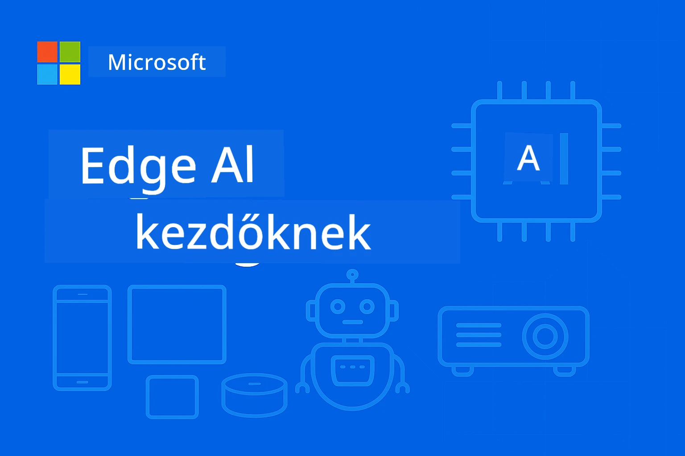

# EdgeAI kezdőknek




[](https://GitHub.com/microsoft/edgeai-for-beginners/graphs/contributors)
[](https://GitHub.com/microsoft/edgeai-for-beginners/issues)
[](https://GitHub.com/microsoft/edgeai-for-beginners/pulls)
[](http://makeapullrequest.com)

[](https://GitHub.com/microsoft/edgeai-for-beginners/watchers)
[](https://GitHub.com/microsoft/edgeai-for-beginners/fork)
[](https://GitHub.com/microsoft/edgeai-for-beginners/stargazers)


[](https://discord.gg/nTYy5BXMWG)

Kövesd ezeket a lépéseket, hogy elkezdd használni ezeket az erőforrásokat:

1. **Forkold a tárat**: Kattints ide [](https://GitHub.com/microsoft/edgeai-for-beginners/fork)
2. **Klónozd a tárat**:   `git clone https://github.com/microsoft/edgeai-for-beginners.git`
3. [**Csatlakozz az Azure AI Foundry Discordhoz, és ismerkedj meg szakértőkkel és fejlesztőtársakkal**](https://discord.com/invite/ByRwuEEgH4)


### 🌐 Többnyelvű támogatás

#### GitHub Action segítségével támogatott (automatikus és mindig naprakész)

<!-- CO-OP TRANSLATOR LANGUAGES TABLE START -->
[Arab](../ar/README.md) | [Bengáli](../bn/README.md) | [Bolgár](../bg/README.md) | [Burmese (Myanmar)](../my/README.md) | [Kínai (egyszerűsített)](../zh-CN/README.md) | [Kínai (hagyományos, Hongkong)](../zh-HK/README.md) | [Kínai (hagyományos, Makaó)](../zh-MO/README.md) | [Kínai (hagyományos, Tajvan)](../zh-TW/README.md) | [Horvát](../hr/README.md) | [Cseh](../cs/README.md) | [Dán](../da/README.md) | [Holland](../nl/README.md) | [Észt](../et/README.md) | [Finn](../fi/README.md) | [Francia](../fr/README.md) | [Német](../de/README.md) | [Görög](../el/README.md) | [Héber](../he/README.md) | [Hindi](../hi/README.md) | [Magyar](./README.md) | [Indonéz](../id/README.md) | [Olasz](../it/README.md) | [Japán](../ja/README.md) | [Kannada](../kn/README.md) | [Koreai](../ko/README.md) | [Litván](../lt/README.md) | [Maláj](../ms/README.md) | [Malayalam](../ml/README.md) | [Marathi](../mr/README.md) | [Nepáli](../ne/README.md) | [Nigériai Pidgin](../pcm/README.md) | [Norvég](../no/README.md) | [Perzsa (Farsi)](../fa/README.md) | [Lengyel](../pl/README.md) | [Portugál (Brazília)](../pt-BR/README.md) | [Portugál (Portugália)](../pt-PT/README.md) | [Pandzsábi (Gurmukhi)](../pa/README.md) | [Román](../ro/README.md) | [Orosz](../ru/README.md) | [Szerb (cirill)](../sr/README.md) | [Szlovák](../sk/README.md) | [Szlovén](../sl/README.md) | [Spanyol](../es/README.md) | [Szuahéli](../sw/README.md) | [Svéd](../sv/README.md) | [Tagalog (Filippínó)](../tl/README.md) | [Tamil](../ta/README.md) | [Telugu](../te/README.md) | [Thai](../th/README.md) | [Török](../tr/README.md) | [Ukrán](../uk/README.md) | [Urdu](../ur/README.md) | [Vietnamita](../vi/README.md)

> **Inkább helyben klónoznád?**

> Ez a tár több mint 50 nyelvi fordítást tartalmaz, ami jelentősen megnöveli a letöltési méretet. Ha nem szeretnéd a fordításokat, használj sparse checkout-ot:
> ```bash
> git clone --filter=blob:none --sparse https://github.com/microsoft/edgeai-for-beginners.git
> cd edgeai-for-beginners
> git sparse-checkout set --no-cone '/*' '!translations' '!translated_images'
> ```
> Így mindent megkap, amire a tanfolyam befejezéséhez szükséged van, sokkal gyorsabb letöltéssel.
<!-- CO-OP TRANSLATOR LANGUAGES TABLE END -->

**Ha további támogatott fordítási nyelveket szeretnél, ezek itt találhatók [itt](https://github.com/Azure/co-op-translator/blob/main/getting_started/supported-languages.md)**
## Bevezetés

Üdvözlünk az **EdgeAI kezdőknek** kurzuson – az átfogó utadon az Edge Mesterséges Intelligencia átalakító világába. Ez a tanfolyam hidat képez a hatékony MI képességek és a gyakorlati, valós körülmények között történő élő eszközökön való alkalmazás között, lehetővé téve, hogy közvetlenül ott használd az MI erejét, ahol az adatok keletkeznek és ahol döntések születnek.

### Amit elsajátítasz

A tanfolyam elvezet az alapfogalmaktól a termeléskész megvalósításokig, többek között:
- **Kis nyelvi modellek (SLM-ek)**, melyek az élő eszközökre optimalizáltak
- **Hardver-központú optimalizáció** különféle platformokon
- **Valós idejű következtetés** adatvédelmet biztosító képességekkel
- **Termelési bevezetési** stratégiák vállalati alkalmazásokhoz

### Miért fontos az EdgeAI

Az EdgeAI paradigmaváltást jelent, amely kritikus modern kihívásokra ad választ:
- **Adatvédelem és Biztonság**: Az érzékeny adatokat helyben dolgozza fel, felhő kitettség nélkül
- **Valós idejű teljesítmény**: Eltünteti a hálózati késleltetést az időérzékeny alkalmazásokban
- **Költséghatékonyság**: Csökkenti a sávszélesség és felhőszámítás költségeit
- **Rugalmas működés**: Működés hálózati kiesés esetén is biztosított
- **Szabályozói megfelelés**: Teljesíti az adat-szuverenitási követelményeket

### Edge AI

Az Edge AI azt jelenti, hogy MI algoritmusokat és nyelvi modelleket helyben, a hardveren futtatunk, közel az adatok keletkezési helyéhez, felhő erőforrások nélkül a következtetéshez. Csökkenti a késleltetést, javítja az adatvédelmet, és lehetővé teszi a valós idejű döntéshozatalt.

### Alapelvek:
- **Közvetlen eszközön futó következtetés**: MI modellek futnak élő eszközökön (telefonok, routerek, mikrokontrollerek, ipari PC-k)
- **Offline képesség**: Működik folyamatos internetkapcsolat nélkül
- **Alacsony késleltetés**: Azonnali válaszok valós idejű rendszerekhez
- **Adat-szuverenitás**: Érzékeny adatok helyben maradnak, javítva a biztonságot és megfelelést

### Kis nyelvi modellek (SLM-ek)

Az olyan SLM-ek, mint a Phi-4, Mistral-7B és Gemma optimalizált változatai a nagyobb LLM-eknek — betanított vagy desztillált formában, hogy:
- **Csökkentett memóriaigény**: Hatékony használat a korlátozott élő eszköz memóriából
- **Alacsonyabb számítási igény**: Optimalizált CPU és élő GPU teljesítményre
- **Gyorsabb indítás**: Gyors inicializáció az érzékeny alkalmazásokhoz

Erőteljes NLP képességeket nyitnak meg, miközben teljesítik a következő korlátokat:
- **Beágyazott rendszerek**: IoT eszközök és ipari vezérlők
- **Mobil eszközök**: Okostelefonok és tabletek offline képességekkel
- **IoT eszközök**: Érzékelők és okoseszközök korlátozott erőforrásokkal
- **Edge szerverek**: Helyi feldolgozó egységek korlátozott GPU erőforrásokkal
- **Személyi számítógépek**: Asztali és laptop telepítési forgatókönyvek

## Tanfolyam modulok & navigáció

| Modul | Téma | Fókuszterület | Fő Tartalom | Szint | Időtartam |
|--------|-------|------------|-------------|--------|----------|
| [📖 00 ](./introduction.md) | [Bevezetés az EdgeAI-be](./introduction.md) | Alapok és kontextus | EdgeAI áttekintés • Ipari alkalmazások • SLM bemutatás • Tanulási célok | Kezdő | 1-2 óra |
| [📚 01](../../Module01) | [EdgeAI alapok](./Module01/README.md) | Felhő vs Edge AI összehasonlítás | EdgeAI alapok • Valós esettanulmányok • Megvalósítási útmutató • Edge telepítés | Kezdő | 3-4 óra |
| [🧠 02](../../Module02) | [SLM modell alapok](./Module02/README.md) | Modellcsaládok & architektúra | Phi család • Qwen család • Gemma család • BitNET • μModel • Phi-Silica | Kezdő | 4-5 óra |
| [🚀 03](../../Module03) | [SLM telepítési gyakorlat](./Module03/README.md) | Helyi & felhő alapú telepítés | Fejlett tanulás • Helyi környezet • Felhő telepítés | Középhaladó | 4-5 óra |
| [⚙️ 04](../../Module04) | [Modell optimalizációs eszköztár](./Module04/README.md) | Keresztplatform optimalizáció | Bevezetés • Llama.cpp • Microsoft Olive • OpenVINO • Apple MLX • Munkafolyamat szintézis | Középhaladó | 5-6 óra |
| [🔧 05](../../Module05) | [SLMOps termelés](./Module05/README.md) | Termelési műveletek | SLMOps bevezetés • Modell desztilláció • Finomhangolás • Termelési bevezetés | Haladó | 5-6 óra |
| [🤖 06](../../Module06) | [MI ügynökök & Függvényhívás](./Module06/README.md) | Ügynök keretrendszerek & MCP | Ügynök bevezetés • Függvényhívás • Modell Kontextus Protokoll | Haladó | 4-5 óra |
| [💻 07](../../Module07) | [Platform megvalósítás](./Module07/README.md) | Keresztplatform minták | MI eszköztár • Foundry Local • Windows fejlesztés | Haladó | 3-4 óra |
| [🏭 08](../../Module08) | [Foundry Local eszköztár](./Module08/README.md) | Termelésre kész minták | Mintapéldák (lásd lent részletesen) | Szakértő | 8-10 óra |

### 🏭 **08. modul: mintapéldák**

- [01: REST Chat Gyorstalpaló](./Module08/samples/01/README.md)
- [02: OpenAI SDK integráció](./Module08/samples/02/README.md)
- [03: Modell felfedezés & benchmark](./Module08/samples/03/README.md)
- [04: Chainlit RAG alkalmazás](./Module08/samples/04/README.md)
- [05: Többügynökös összehangolás](./Module08/samples/05/README.md)
- [06: Modellek eszközként router](./Module08/samples/06/README.md)
- [07: Közvetlen API kliens](./Module08/samples/07/README.md)
- [08: Windows 11 csevegőalkalmazás](./Module08/samples/08/README.md)
- [09: Fejlett többügynökös rendszer](./Module08/samples/09/README.md)
- [10: Foundry Tools keretrendszer](./Module08/samples/10/README.md)

### 🎓 **Műhely: Gyakorlati tanulási út**

Átfogó gyakorlati műhelyanyagok termelésre kész megvalósításokkal:

- **[Műhely útmutató](./Workshop/Readme.md)** - Teljes tanulási célok, eredmények és erőforrás-navigáció
- **Python minták** (6 alkalom) - Frissítve legjobb gyakorlatokkal, hibakezeléssel, átfogó dokumentációval
- **Jupyter jegyzetfüzetek** (8 interaktív) - Lépésről-lépésre oktatóanyagok benchmarkokkal és teljesítményfigyeléssel
- **Ülésvezetők** - Részletes markdown útmutatók az egyes műhelyülésekhez
- **Érvényesítő eszközök** - Szkriptek a kódminőség ellenőrzésére és gyors tesztek futtatására

**Mit építesz majd:**
- Helyi MI csevegőalkalmazások streaming támogatással
- RAG csővezetékek minőségértékeléssel (RAGAS)
- Többmodell benchmarkolók és összehasonlító eszközök
- Többügynökös összehangoló rendszerek
- Intelligens modell routing feladatalapú kiválasztással

### 🎙️ **Műhely Agentic-nek: Gyakorlati - Az AI Podcast Stúdió**

Építsd meg az MI vezérelt podcast-produkciós csővezetéket az alapoktól! Ez az elmélyült műhely megtanít egy teljes többügynökös rendszer létrehozására, amely az ötleteket professzionális podcast epizódokká alakítja.
**[🎬 Indítsd el az AI Podcast Studio Műhelyt](./WorkshopForAgentic/README.md)**

**Küldetésed**: Indítsd el a "Future Bytes" nevű tech podcastot, amelyet teljes egészében te magad építesz AI ügynökökkel. Nincs felhőfüggőség, nincs API költség — minden a saját gépeden fut.

**Mi teszi egyedivé ezt:**
- **🤖 Valódi többszörös ügynök koordináció** - Építs speciális AI ügynököket, amelyek kutatnak, írnak és hanganyagot készítenek
- **🎯 Teljes gyártási folyamat** - A témaválasztástól a végső podcast hangfájlig
- **💻 100% helyi telepítés** - Ollama és helyi modellek (Qwen-3-8B) teljes adatvédelemért és irányításért
- **🎤 Szöveg-beszéd integráció** - Szkriptek természetes hangzású, többszólamú beszélgetésekké alakítása
- **✋ Emberi jóváhagyási pontokkal** - Minőségbiztosítás automatizálás mellett

**Háromfelvonásos tanulási út:**

| Felvonás | Fókusz | Kulcskészségek | Időtartam |
|-----|-------|------------|----------|
| **[1. Felvonás: Ismerd meg az AI asszisztenseidet](./WorkshopForAgentic/md/01.BuildAIAgentWithSLM.md)** | Építsd meg első AI ügynöködet | Eszköz integráció • Web keresés • Problémamegoldás • Ügynöki következtetés | 2-3 óra |
| **[2. Felvonás: Állítsd össze a gyártócsapatod](./WorkshopForAgentic/md/02.AIAgentOrchestrationAndWorkflows.md)** | Több ügynök összehangolása | Csapatkoordináció • Jóváhagyási folyamatok • DevUI felület • Emberi felügyelet | 3-4 óra |
| **[3. Felvonás: Keltsd életre a podcastod](./WorkshopForAgentic/md/03.Multi-SpeakerPodcastGenerationWithVibeVoice.md)** | Podcast hanganyag generálása | Szöveg-beszéd • Többszólamú szintézis • Hosszú hanganyag • Teljes automatizálás | 2-3 óra |

**Használt technológiák:**
- **Microsoft Agent Framework** - Többszörös ügynök koordináció és összehangolás
- **Ollama** - Helyi AI modell futtatási környezet (nincs szükség felhőre)
- **Qwen-3-8B** - Nyílt forráskódú nyelvi modell, optimalizálva ügynöki feladatokra
- **Szöveg-beszéd API-k** - Természetes hangú szintézis podcast generáláshoz

**Hardver támogatás:**
- ✅ **CPU mód** - Bármely modern számítógépen működik (ajánlott 8 GB+ RAM)
- 🚀 **GPU gyorsítás** - Jelentősen gyorsabb inferencia NVIDIA/AMD GPU-kkal
- ⚡ **NPU támogatás** - Következő generációs neurális feldolgozó egység gyorsítás

**Ideális:**
- Többszörös AI ügynökrendszereket tanuló fejlesztőknek
- Mindazoknak, akiket érdekel az AI automatizálás és munkafolyamatok
- Tartalomkészítőknek, akik AI-alapú gyártást szeretnének felfedezni
- Diákoknak, akik gyakorlati AI koordinációs mintákat tanulmányoznak

**Kezdj el építeni**: [🎙️ AI Podcast Studio Műhely →](./WorkshopForAgentic/README.md)

### 📊 **Tanulási út összefoglaló**
- **Teljes időtartam**: 36-45 óra
- **Kezdő út**: 01-02 modulok (7-9 óra)  
- **Középhaladó út**: 03-04 modulok (9-11 óra)
- **Haladó út**: 05-07 modulok (12-15 óra)
- **Szakértői út**: 08 modul (8-10 óra)

## Amit építeni fogsz

### 🎯 Alapképességek
- **Edge AI architektúra**: Helyi első AI rendszerek tervezése felhő integrációval
- **Modell optimalizálás**: Kvanztálás és tömörítés edge telepítéshez (85% sebességnövelés, 75% méretcsökkenés)
- **Többplatformos telepítés**: Windows, mobil, beágyazott és felhő-edge hibridek
- **Gyártási műveletek**: Figyelés, méretezés, karbantartás edge AI termelésben

### 🏗️ Gyakorlati projektek
- **Foundry Local Chat alkalmazások**: Windows 11 natív alkalmazás modellváltással
- **Többszörös ügynök rendszerek**: Koordinátor szakértő ügynökökkel összetett folyamatokhoz  
- **RAG alkalmazások**: Helyi dokumentumfeldolgozás vektorkereséssel
- **Modell választók**: Intelligens modellválasztás feladat elemzés alapján
- **API keretrendszerek**: Termelésre kész kliensek streameléssel és egészség ellenőrzéssel
- **Többplatformos eszközök**: LangChain/Semantic Kernel integrációs minták

### 🏢 Ipari alkalmazások
**Gyártás** • **Egészségügy** • **Autonóm járművek** • **Okos városok** • **Mobil alkalmazások**

## Gyors kezdés

**Ajánlott tanulási út** (összesen 20-30 óra):

0. **📖 Bevezetés** ([Introduction.md](./introduction.md)): EdgeAI alapok + ipari kontextus + tanulási keretrendszer
1. **📚 Alapozás** (01-02 modulok): EdgeAI fogalmak + SLM modell családok
2. **⚙️ Optimalizáció** (03-04 modulok): Telepítés + kvanztálási keretek  
3. **🚀 Termelés** (05-06 modulok): SLMOps + AI ügynökök + függvényhívás
4. **💻 Megvalósítás** (07-08 modulok): Platform minták + Foundry Local eszköztár

Minden modul tartalmaz elméletet, gyakorlati feladatokat és termelésre kész kódmintákat.

## Karrierhatás

**Műszaki szerepkörök**: EdgeAI megoldás architekt • ML mérnök (Edge) • IoT AI fejlesztő • Mobil AI fejlesztő

**Ipari szektorok**: Gyártás 4.0 • Egészségügyi technológia • Autonóm rendszerek • FinTech • Fogyasztói elektronika

**Portfólió projektek**: Többszörös ügynök rendszerek • Gyártásra kész RAG alkalmazások • Többplatformos telepítés • Teljesítmény optimalizáció

## Tárolószerkezet

```
edgeai-for-beginners/
├── 📖 introduction.md  # Foundation: EdgeAI Overview & Learning Framework
├── 📚 Module01-04/     # Fundamentals → SLMs → Deployment → Optimization  
├── 🔧 Module05-06/     # SLMOps → AI Agents → Function Calling
├── 💻 Module07/        # Platform Samples (VS Code, Windows, Jetson, Mobile)
├── 🏭 Module08/        # Foundry Local Toolkit + 10 Comprehensive Samples
│   ├── samples/01-06/  # Foundation: REST, SDK, RAG, Agents, Routing
│   └── samples/07-10/  # Advanced: API Client, Windows App, Enterprise Agents, Tools
├── 🌐 translations/    # Multi-language support (8+ languages)
└── 📋 STUDY_GUIDE.md   # Structured learning paths & time allocation
```

## Tanfolyam főbb pontjai

✅ **Fokozatos tanulás**: Elmélet → Gyakorlat → Termelésbe állítás  
✅ **Valós esettanulmányok**: Microsoft, Japan Airlines, vállalati megvalósítások  
✅ **Gyakorlati példák**: 50+ példa, 10 átfogó Foundry Local demó  
✅ **Teljesítmény fókusz**: 85% sebességnövelés, 75% méretcsökkentés  
✅ **Többplatformos**: Windows, mobil, beágyazott, felhő-edge hibrid  
✅ **Termelésre kész**: Figyelés, méretezés, biztonság, megfelelőségi keretek

📖 **[Tanulmányi útmutató elérhető](STUDY_GUIDE.md)**: Strukturált 20 órás tanulási út időbeosztással és önértékelési eszközökkel.

---

**Az EdgeAI az AI telepítés jövőjét jelenti**: helyi első, adatvédelmet biztosító és hatékony. Sajátítsd el ezeket a készségeket a következő generációs intelligens alkalmazások építéséhez.

## Egyéb kurzusok

Csapatunk más kurzusokat is készít! Nézd meg:

<!-- CO-OP TRANSLATOR OTHER COURSES START -->
### LangChain
[](https://aka.ms/langchain4j-for-beginners)
[](https://aka.ms/langchainjs-for-beginners?WT.mc_id=m365-94501-dwahlin)

---

### Azure / Edge / MCP / Ügynökök
[](https://github.com/microsoft/AZD-for-beginners?WT.mc_id=academic-105485-koreyst)
[](https://github.com/microsoft/edgeai-for-beginners?WT.mc_id=academic-105485-koreyst)
[](https://github.com/microsoft/mcp-for-beginners?WT.mc_id=academic-105485-koreyst)
[](https://github.com/microsoft/ai-agents-for-beginners?WT.mc_id=academic-105485-koreyst)

---
 
### Generatív AI sorozat
[](https://github.com/microsoft/generative-ai-for-beginners?WT.mc_id=academic-105485-koreyst)
[-9333EA?style=for-the-badge&labelColor=E5E7EB&color=9333EA)](https://github.com/microsoft/Generative-AI-for-beginners-dotnet?WT.mc_id=academic-105485-koreyst)
[-C084FC?style=for-the-badge&labelColor=E5E7EB&color=C084FC)](https://github.com/microsoft/generative-ai-for-beginners-java?WT.mc_id=academic-105485-koreyst)
[-E879F9?style=for-the-badge&labelColor=E5E7EB&color=E879F9)](https://github.com/microsoft/generative-ai-with-javascript?WT.mc_id=academic-105485-koreyst)

---
 
### Alapvető tanulás
[](https://aka.ms/ml-beginners?WT.mc_id=academic-105485-koreyst)
[](https://aka.ms/datascience-beginners?WT.mc_id=academic-105485-koreyst)
[](https://aka.ms/ai-beginners?WT.mc_id=academic-105485-koreyst)
[](https://github.com/microsoft/Security-101?WT.mc_id=academic-96948-sayoung)
[](https://aka.ms/webdev-beginners?WT.mc_id=academic-105485-koreyst)
[](https://aka.ms/iot-beginners?WT.mc_id=academic-105485-koreyst)
[](https://github.com/microsoft/xr-development-for-beginners?WT.mc_id=academic-105485-koreyst)

---
 
### Copilot sorozat
[](https://aka.ms/GitHubCopilotAI?WT.mc_id=academic-105485-koreyst)
[](https://github.com/microsoft/mastering-github-copilot-for-dotnet-csharp-developers?WT.mc_id=academic-105485-koreyst)
[](https://github.com/microsoft/CopilotAdventures?WT.mc_id=academic-105485-koreyst)
<!-- CO-OP TRANSLATOR OTHER COURSES END -->

## Segítségkérés

Ha elakadsz vagy bármi kérdésed van az AI-alkalmazások fejlesztésével kapcsolatban, csatlakozz:

[](https://discord.gg/nTYy5BXMWG)

Ha visszajelzésed vagy hibák fordulnak elő fejlesztés közben, látogass el ide:

[](https://aka.ms/foundry/forum)

---

<!-- CO-OP TRANSLATOR DISCLAIMER START -->
**Jogi nyilatkozat**:
Ezt a dokumentumot az AI fordító szolgáltatás [Co-op Translator](https://github.com/Azure/co-op-translator) segítségével fordítottuk le. Bár igyekszünk a pontosságra, kérjük, vegye figyelembe, hogy az automatikus fordítások hibákat vagy pontatlanságokat tartalmazhatnak. Az eredeti dokumentum az anyanyelvén tekintendő hivatalos forrásnak. Fontos információk esetén professzionális emberi fordítást javaslunk. Nem vállalunk felelősséget az ebből a fordításból eredő félreértésekért vagy téves értelmezésekért.
<!-- CO-OP TRANSLATOR DISCLAIMER END -->