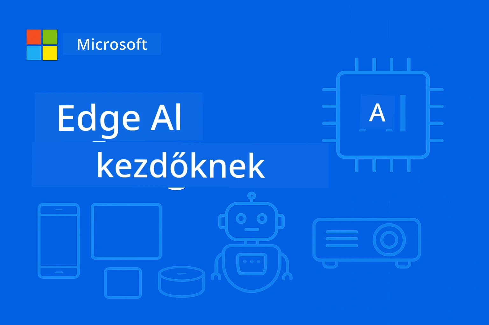

# EdgeAI kezdőknek




[](https://GitHub.com/microsoft/edgeai-for-beginners/graphs/contributors)
[](https://GitHub.com/microsoft/edgeai-for-beginners/issues)
[](https://GitHub.com/microsoft/edgeai-for-beginners/pulls)
[](http://makeapullrequest.com)

[](https://GitHub.com/microsoft/edgeai-for-beginners/watchers)
[](https://GitHub.com/microsoft/edgeai-for-beginners/fork)
[](https://GitHub.com/microsoft/edgeai-for-beginners/stargazers)


[](https://discord.gg/nTYy5BXMWG)

Kövesd ezeket a lépéseket, hogy elkezdhess dolgozni ezekkel az erőforrásokkal:

1. **Forkold a tárat**: Kattints ide [](https://GitHub.com/microsoft/edgeai-for-beginners/fork)
2. **Klónozd a tárat**:   `git clone https://github.com/microsoft/edgeai-for-beginners.git`
3. [**Csatlakozz az Azure AI Foundry Discordhoz, és találkozz szakértőkkel és más fejlesztőkkel**](https://discord.com/invite/ByRwuEEgH4)


### 🌐 Többnyelvű támogatás

#### GitHub Action által támogatott (Automatizált & Mindig naprakész)

<!-- CO-OP TRANSLATOR LANGUAGES TABLE START -->
[Arabic](../ar/README.md) | [Bengali](../bn/README.md) | [Bulgarian](../bg/README.md) | [Burmese (Myanmar)](../my/README.md) | [Chinese (Simplified)](../zh-CN/README.md) | [Chinese (Traditional, Hong Kong)](../zh-HK/README.md) | [Chinese (Traditional, Macau)](../zh-MO/README.md) | [Chinese (Traditional, Taiwan)](../zh-TW/README.md) | [Croatian](../hr/README.md) | [Czech](../cs/README.md) | [Danish](../da/README.md) | [Dutch](../nl/README.md) | [Estonian](../et/README.md) | [Finnish](../fi/README.md) | [French](../fr/README.md) | [German](../de/README.md) | [Greek](../el/README.md) | [Hebrew](../he/README.md) | [Hindi](../hi/README.md) | [Hungarian](./README.md) | [Indonesian](../id/README.md) | [Italian](../it/README.md) | [Japanese](../ja/README.md) | [Kannada](../kn/README.md) | [Khmer](../km/README.md) | [Korean](../ko/README.md) | [Lithuanian](../lt/README.md) | [Malay](../ms/README.md) | [Malayalam](../ml/README.md) | [Marathi](../mr/README.md) | [Nepali](../ne/README.md) | [Nigerian Pidgin](../pcm/README.md) | [Norwegian](../no/README.md) | [Persian (Farsi)](../fa/README.md) | [Polish](../pl/README.md) | [Portuguese (Brazil)](../pt-BR/README.md) | [Portuguese (Portugal)](../pt-PT/README.md) | [Punjabi (Gurmukhi)](../pa/README.md) | [Romanian](../ro/README.md) | [Russian](../ru/README.md) | [Serbian (Cyrillic)](../sr/README.md) | [Slovak](../sk/README.md) | [Slovenian](../sl/README.md) | [Spanish](../es/README.md) | [Swahili](../sw/README.md) | [Swedish](../sv/README.md) | [Tagalog (Filipino)](../tl/README.md) | [Tamil](../ta/README.md) | [Telugu](../te/README.md) | [Thai](../th/README.md) | [Turkish](../tr/README.md) | [Ukrainian](../uk/README.md) | [Urdu](../ur/README.md) | [Vietnamese](../vi/README.md)

> **Szeretnéd helyileg klónozni?**
>
> Ez a tár több mint 50 nyelvi fordítást tartalmaz, ami jelentősen megnöveli a letöltési méretet. Ha fordítások nélkül szeretnéd klónozni, használd a sparse checkoutot:
>
> **Bash / macOS / Linux:**
> ```bash
> git clone --filter=blob:none --sparse https://github.com/microsoft/edgeai-for-beginners.git
> cd edgeai-for-beginners
> git sparse-checkout set --no-cone '/*' '!translations' '!translated_images'
> ```
>
> **CMD (Windows):**
> ```cmd
> git clone --filter=blob:none --sparse https://github.com/microsoft/edgeai-for-beginners.git
> cd edgeai-for-beginners
> git sparse-checkout set --no-cone "/*" "!translations" "!translated_images"
> ```
>
> Így minden szükséges fájl meglesz a kurzus elvégzéséhez sokkal gyorsabb letöltéssel.
<!-- CO-OP TRANSLATOR LANGUAGES TABLE END -->

**Ha további fordítási nyelveket szeretnél támogatni, ezek megtalálhatók [itt](https://github.com/Azure/co-op-translator/blob/main/getting_started/supported-languages.md)**
## Bevezetés

Üdvözlünk a **EdgeAI kezdőknek** kurzuson – a teljes körű utazásodon a Edge Mesterséges Intelligencia átalakító világában. Ez a tanfolyam hidat képez a hatékony AI képességek és a gyakorlati, valós környezetben történő telepítés között az élő eszközökön, lehetővé téve, hogy a mesterséges intelligencia potenciálját közvetlenül ott használd ki, ahol az adatok keletkeznek és döntéseket kell hozni.

### Amit elsajátítasz

Ez a tanfolyam az alapvető fogalmaktól a gyártásra kész megvalósításokig vezet végig, lefedve:
- **Kis nyelvi modellek (SLM-ek)** élő környezetre optimalizálva
- **Hardver tudatos optimalizáció** különböző platformokon
- **Valós idejű inferencia** adatvédelemmel
- **Gyártásba telepítési stratégiák** vállalati alkalmazásokhoz

### Miért fontos az EdgeAI

Az Edge AI paradigmaváltást jelent, amely a modern kihívásokra ad választ:
- **Adatvédelem és biztonság**: Érzékeny adatok helyi feldolgozása felhő kiadása nélkül
- **Valós idejű teljesítmény**: Hálózati késleltetés kiküszöbölése időkritikus alkalmazásoknál
- **Költséghatékonyság**: Sávszélesség és felhő alapú számítási költségek csökkentése
- **Rugalmas működés**: Funkcionalitás fenntartása hálózati kiesés esetén
- **Szabályozási megfelelőség**: Adat-szuverenitási követelmények betartása

### Edge AI

Az Edge AI azt jelenti, hogy AI algoritmusok és nyelvi modellek helyileg futnak a hardveren, közel az adatok keletkezési helyéhez, anélkül, hogy a cloud erőforrásokra támaszkodnánk az inferencia során. Ez csökkenti a késleltetést, növeli az adatvédelmet és valós idejű döntéshozatalt tesz lehetővé.

### Alapelvek:
- **Interferencia az eszközön**: AI modellek helyi eszközökön futnak (telefonok, routerek, mikrovezérlők, ipari PC-k)
- **Offline funkció**: Internetkapcsolat nélkül is működik
- **Alacsony késleltetés**: Azonnali válaszok valós idejű rendszereknek
- **Adat-szuverenitás**: Az érzékeny adatok helyben maradnak, javítva a biztonságot és megfelelést

### Kis nyelvi modellek (SLM-ek)

Az SLM-ek, mint például a Phi-4, Mistral-7B és Gemma, nagyobb LLM-ek optimalizált változatai—kiképzett vagy „kondenzált” alakban:
- **Csökkentett memóriaigény**: Hatékony kihasználása a korlátozott élő eszköz memóriának
- **Alacsonyabb számítási igény**: CPU és élő GPU teljesítményre optimalizálva
- **Gyorsabb indulás**: Gyors inicializálás a gyors reakciókért

Ezek lehetővé teszik a hatékony NLP képességeket miközben megfelelnek az alábbi korlátoknak:
- **Beágyazott rendszerek**: IoT eszközök és ipari vezérlők
- **Mobil eszközök**: Okostelefonok és táblagépek offline képességekkel
- **IoT eszközök**: Szenzorok és okos eszközök korlátozott erőforrásokkal
- **Edge szerverek**: Helyi feldolgozó egységek korlátozott GPU erőforrásokkal
- **Személyi számítógépek**: Asztali és laptop telepítési forgatókönyvek

## Tanfolyam modulok és navigáció

| Modul | Téma | Fókuszterület | Fő tartalom | Szint | Időtartam |
|--------|-------|------------|-------------|--------|----------|
| [📖 00 ](./introduction.md) | [Bevezetés az EdgeAI-be](./introduction.md) | Alapok és kontextus | EdgeAI áttekintés • Iparági alkalmazások • SLM bemutatás • Tanulási célok | Kezdő | 1-2 óra |
| [📚 01](../../Module01) | [EdgeAI alapok](./Module01/README.md) | Felhő vs Edge AI összehasonlítás | EdgeAI alapok • Valós esettanulmányok • Megvalósítási útmutató • Edge telepítés | Kezdő | 3-4 óra |
| [🧠 02](../../Module02) | [SLM modell alapok](./Module02/README.md) | Modellcsaládok és architektúra | Phi család • Qwen család • Gemma család • BitNET • μModel • Phi-Silica | Kezdő | 4-5 óra |
| [🚀 03](../../Module03) | [SLM telepítési gyakorlat](./Module03/README.md) | Helyi és felhőbeli telepítés | Haladó tanulás • Helyi környezet • Felhő telepítés | Középhaladó | 4-5 óra |
| [⚙️ 04](../../Module04) | [Modell optimalizációs eszköztár](./Module04/README.md) | Platformok közötti optimalizáció | Bevezetés • Llama.cpp • Microsoft Olive • OpenVINO • Apple MLX • Munkafolyamat szintézis | Középhaladó | 5-6 óra |
| [🔧 05](../../Module05) | [SLMOps gyártásban](./Module05/README.md) | Gyártásbeli működés | SLMOps bevezetés • Modell desztilláció • Finomhangolás • Gyártásbeli telepítés | Haladó | 5-6 óra |
| [🤖 06](../../Module06) | [AI ügynökök & függvényhívás](./Module06/README.md) | Ügynök keretrendszerek & MCP | Ügynök bevezetés • Függvényhívás • Modell Kontextus Protokoll | Haladó | 4-5 óra |
| [💻 07](../../Module07) | [Platform megvalósítás](./Module07/README.md) | Többplatformos példák | AI eszköztár • Foundry Local • Windows fejlesztés | Haladó | 3-4 óra |
| [🏭 08](../../Module08) | [Foundry Local eszköztár](./Module08/README.md) | Gyártásra kész példák | Mintaalkalmazások (lásd alább részletezve) | Szakértő | 8-10 óra |

### 🏭 **08. modul: Mintaalkalmazások**

- [01: REST Chat Gyorsindítás](./Module08/samples/01/README.md)
- [02: OpenAI SDK Integráció](./Module08/samples/02/README.md)
- [03: Modell felfedezés & benchmark](./Module08/samples/03/README.md)
- [04: Chainlit RAG alkalmazás](./Module08/samples/04/README.md)
- [05: Többügynökös összehangolás](./Module08/samples/05/README.md)
- [06: Modellek mint Eszközök Router](./Module08/samples/06/README.md)
- [07: Közvetlen API kliens](./Module08/samples/07/README.md)
- [08: Windows 11 Chat alkalmazás](./Module08/samples/08/README.md)
- [09: Haladó többügynök rendszer](./Module08/samples/09/README.md)
- [10: Foundry Tools keretrendszer](./Module08/samples/10/README.md)

### 🎓 **Workshop: Gyakorlati tanulási út**

Teljes körű gyakorlati workshop anyagok gyártásra kész megvalósításokkal:

- **[Workshop Útmutató](./Workshop/Readme.md)** - Teljes tanulási célok, eredmények és erőforrás navigáció
- **Python példák** (6 alkalom) - Frissítve a legjobb gyakorlatokkal, hibakezeléssel és átfogó dokumentációval
- **Jupyter jegyzetfüzetek** (8 interaktív) - Lépésről lépésre oktatóanyagok benchmarkokkal és teljesítmény monitorozással
- **Ülés útmutatók** - Részletes markdown útmutatók az egyes workshop ülésekhez
- **Validációs eszközök** - Szkriptek a kódminőség ellenőrzésére és smoke tesztek futtatására

**Amit készíteni fogsz:**
- Helyi AI chat alkalmazások streaming támogatással
- RAG adatfolyamok minőségi értékeléssel (RAGAS)
- Többmodell benchmark és összehasonlító eszközök
- Többügynökös összehangoló rendszerek
- Intelligens modellirányítás feladat alapú kiválasztással

### 🎙️ **Workshop Agentic számára: Gyakorlati - Az AI Podcast Stúdió**
Építs egy mesterséges intelligencia által működtetett podcast gyártási folyamatot a semmiből! Ez az elmélyült workshop megtanít arra, hogyan hozz létre egy teljes többügynökös rendszert, amely az ötleteket professzionális podcast epizódokká alakítja.

**[🎬 Kezdd el az AI Podcast Studio Workshopot](./WorkshopForAgentic/README.md)**

**Feladatod**: Indítsd el a "Future Bytes" nevű technológiai podcastot — egy teljesen AI ügynökök által működtetett műsort, amelyet te magad építesz fel. Nincsenek felhőfüggőségek, nincsenek API-költségek — minden helyileg, a gépeden fut.

**Mi teszi egyedivé:**
- **🤖 Valódi többügynökös koordináció** – Specializált AI ügynökök építése, amelyek kutatnak, írnak és hanganyagot készítenek
- **🎯 Teljes gyártási folyamat** – Témaválasztástól a végső podcast hanganyagig
- **💻 100% helyi telepítés** – Ollama és helyi modellek (Qwen-3-8B) a teljes adatvédelem és irányítás érdekében
- **🎤 Szöveg-beszéd integráció** – Szkriptet alakít természetes hangzású, több beszélőből álló beszélgetéssé
- **✋ Ember a folyamatban** – Jóváhagyási pontok a minőség biztosítására miközben az automatizálás megmarad

**Háromrészes tanulási út:**

| Felvonás | Fókusz | Kulcskészségek | Időtartam |
|-----|-------|------------|----------|
| **[1. felvonás: Ismerd meg AI asszisztenseidet](./WorkshopForAgentic/md/01.BuildAIAgentWithSLM.md)** | Építsd meg első AI ügynöködet | Eszközintegráció • Webes keresés • Problémamegoldás • Ügynöki gondolkodás | 2-3 óra |
| **[2. felvonás: Állítsd össze a gyártó csapatodat](./WorkshopForAgentic/md/02.AIAgentOrchestrationAndWorkflows.md)** | Több ügynök koordinálása | Csapatkoordináció • Jóváhagyási munkafolyamatok • DevUI felület • Emberi felügyelet | 3-4 óra |
| **[3. felvonás: Keltsd életre podcastodat](./WorkshopForAgentic/md/03.Multi-SpeakerPodcastGenerationWithVibeVoice.md)** | Podcast hanganyag generálás | Szöveg-beszéd • Több beszélős szintézis • Hosszú hanganyag • Teljes automatizálás | 2-3 óra |

**Használt technológiák:**
- **Microsoft Agent Framework** – Többügynökös koordináció és együttműködés
- **Ollama** – Helyi AI modell futtatókörnyezet (nem igényel felhőt)
- **Qwen-3-8B** – Nyílt forráskódú nyelvi modell, ügynöki feladatokra optimalizálva
- **Szöveg-beszéd API-k** – Természetes hangú szintézis a podcast készítéshez

**Hardver támogatás:**
- ✅ **CPU mód** – Bármely modern számítógépen működik (ajánlott minimum 8GB RAM)
- 🚀 **GPU gyorsítás** – Jelentősen gyorsabb inferálás NVIDIA/AMD GPU-kon
- ⚡ **NPU támogatás** – Következő generációs neurális feldolgozó egység gyorsítás

**Kiknek ideális:**
- Fejlesztők, akik többügynökös AI rendszereket tanulnak
- Mindenki, akit érdekel az AI automatizálás és munkafolyamatok
- Tartalomkészítők, akik AI által segített gyártást szeretnének felfedezni
- Hallgatók, akik a gyakorlati AI koordinációs mintákat tanulmányozzák

**Kezdj el építeni**: [🎙️ The AI Podcast Studio Workshop →](./WorkshopForAgentic/README.md)

### 📊 **Tanulási Út Összegzés**
- **Teljes időtartam**: 36-45 óra
- **Kezdő szint**: 01-02 modulok (7-9 óra)  
- **Középhaladó szint**: 03-04 modulok (9-11 óra)
- **Haladó szint**: 05-07 modulok (12-15 óra)
- **Szakértői szint**: 08 modul (8-10 óra)

## Amit felépítesz

### 🎯 Alapkészségek
- **Edge AI architektúra**: Helyileg előtérbe helyezett AI rendszerek tervezése felhőintegrációval
- **Modell optimalizálás**: Modellek kvantálása és tömörítése élőhelyi telepítéshez (85% sebességnövekedés, 75% méretcsökkenés)
- **Többplatformos telepítés**: Windows, mobil, beágyazott és felhő-él hibrid rendszerek
- **Gyártási műveletek**: Élőhelyi AI monitorozása, skálázása és karbantartása termelésben

### 🏗️ Gyakorlati projektek
- **Foundry Local Chat alkalmazások**: Windows 11 natív alkalmazás modellváltással
- **Többügynökös rendszerek**: Koordinátor speciális ügynökökkel komplex munkafolyamatokhoz  
- **RAG alkalmazások**: Helyi dokumentumfeldolgozás vektoros kereséssel
- **Modellválasztók**: Intelligens válogatás modellek között feladatelemzés alapján
- **API keretrendszerek**: Termelésre kész kliens streaminggel és egészségügyi monitorozással
- **Cross-platform eszközök**: LangChain/Semantic Kernel integrációs minták

### 🏢 Ipari alkalmazások
**Gyártás** • **Egészségügy** • **Autonóm járművek** • **Okos városok** • **Mobilalkalmazások**

## Gyors kezdés

**Ajánlott tanulási út** (összesen 20-30 óra):

0. **📖 Bevezetés** ([Introduction.md](./introduction.md)): EdgeAI alapok + iparági kontextus + tanulási keretrendszer  
1. **📚 Alapozás** (01-02 modulok): EdgeAI fogalmak + SLM modell családok  
2. **⚙️ Optimalizálás** (03-04 modulok): Telepítés + kvantálási keretrendszerek  
3. **🚀 Termelés** (05-06 modulok): SLMOps + AI ügynökök + függvényhívás  
4. **💻 Implementáció** (07-08 modulok): Platformminták + Foundry Local eszköztár  

Minden modul magába foglal elméletet, gyakorlati feladatokat és termelésre kész kódmintákat.

## Karrierhatás

**Technikai szerepek**: EdgeAI megoldástervező • ML mérnök (Edge) • IoT AI fejlesztő • Mobil AI fejlesztő

**Iparági szektorok**: Gyártás 4.0 • Egészségügyi technológia • Autonóm rendszerek • FinTech • Fogyasztói elektronika

**Portfólió projektek**: Többügynökös rendszerek • Termelési RAG alkalmazások • Többplatformos telepítés • Teljesítmény-optimalizálás

## Könyvtár struktúra

```
edgeai-for-beginners/
├── 📖 introduction.md  # Foundation: EdgeAI Overview & Learning Framework
├── 📚 Module01-04/     # Fundamentals → SLMs → Deployment → Optimization  
├── 🔧 Module05-06/     # SLMOps → AI Agents → Function Calling
├── 💻 Module07/        # Platform Samples (VS Code, Windows, Jetson, Mobile)
├── 🏭 Module08/        # Foundry Local Toolkit + 10 Comprehensive Samples
│   ├── samples/01-06/  # Foundation: REST, SDK, RAG, Agents, Routing
│   └── samples/07-10/  # Advanced: API Client, Windows App, Enterprise Agents, Tools
├── 🌐 translations/    # Multi-language support (8+ languages)
└── 📋 STUDY_GUIDE.md   # Structured learning paths & time allocation
```

## Kurzus kiemelések

✅ **Fokozatos tanulás**: Elmélet → Gyakorlat → Termelési telepítés  
✅ **Valódi esettanulmányok**: Microsoft, Japan Airlines, vállalati implementációk  
✅ **Gyakorlati példák**: 50+ példa, 10 átfogó Foundry Local demó  
✅ **Teljesítmény fókusz**: 85%-os sebességnövekedés, 75%-os méretcsökkenés  
✅ **Többplatformos**: Windows, mobil, beágyazott, felhő-él hibrid  
✅ **Termelésre kész**: Monitorozás, skálázás, biztonság, megfelelőségi keretek

📖 **[Elérhető tanulmányi útmutató](STUDY_GUIDE.md)**: Strukturált 20 órás tanulási út időbeosztással és önértékelő eszközökkel.

---

**Az EdgeAI az AI telepítés jövője**: helyileg elsődleges, adatvédelmet szem előtt tartó és hatékony. Sajátítsd el ezeket a készségeket, hogy felépítsd a következő generációs intelligens alkalmazásokat.

## Egyéb kurzusok

Csapatunk más kurzusokat is készít! Nézd meg:

<!-- CO-OP TRANSLATOR OTHER COURSES START -->
### LangChain
[](https://aka.ms/langchain4j-for-beginners)
[](https://aka.ms/langchainjs-for-beginners?WT.mc_id=m365-94501-dwahlin)
[](https://github.com/microsoft/langchain-for-beginners?WT.mc_id=m365-94501-dwahlin)
---

### Azure / Edge / MCP / Ügynökök
[](https://github.com/microsoft/AZD-for-beginners?WT.mc_id=academic-105485-koreyst)
[](https://github.com/microsoft/edgeai-for-beginners?WT.mc_id=academic-105485-koreyst)
[](https://github.com/microsoft/mcp-for-beginners?WT.mc_id=academic-105485-koreyst)
[](https://github.com/microsoft/ai-agents-for-beginners?WT.mc_id=academic-105485-koreyst)

---
 
### Generatív AI sorozat
[](https://github.com/microsoft/generative-ai-for-beginners?WT.mc_id=academic-105485-koreyst)
[-9333EA?style=for-the-badge&labelColor=E5E7EB&color=9333EA)](https://github.com/microsoft/Generative-AI-for-beginners-dotnet?WT.mc_id=academic-105485-koreyst)
[-C084FC?style=for-the-badge&labelColor=E5E7EB&color=C084FC)](https://github.com/microsoft/generative-ai-for-beginners-java?WT.mc_id=academic-105485-koreyst)
[-E879F9?style=for-the-badge&labelColor=E5E7EB&color=E879F9)](https://github.com/microsoft/generative-ai-with-javascript?WT.mc_id=academic-105485-koreyst)

---
 
### Alap tanulás
[](https://aka.ms/ml-beginners?WT.mc_id=academic-105485-koreyst)
[](https://aka.ms/datascience-beginners?WT.mc_id=academic-105485-koreyst)
[](https://aka.ms/ai-beginners?WT.mc_id=academic-105485-koreyst)
[](https://github.com/microsoft/Security-101?WT.mc_id=academic-96948-sayoung)
[](https://aka.ms/webdev-beginners?WT.mc_id=academic-105485-koreyst)
[](https://aka.ms/iot-beginners?WT.mc_id=academic-105485-koreyst)
[](https://github.com/microsoft/xr-development-for-beginners?WT.mc_id=academic-105485-koreyst)

---
 
### Copilot sorozat
[](https://aka.ms/GitHubCopilotAI?WT.mc_id=academic-105485-koreyst)
[](https://github.com/microsoft/mastering-github-copilot-for-dotnet-csharp-developers?WT.mc_id=academic-105485-koreyst)
[](https://github.com/microsoft/CopilotAdventures?WT.mc_id=academic-105485-koreyst)
<!-- CO-OP TRANSLATOR OTHER COURSES END -->

## Segítségkérés

Ha elakad, vagy bármilyen kérdése van az AI alkalmazások fejlesztésével kapcsolatban, csatlakozzon:

[](https://discord.gg/nTYy5BXMWG)

Ha termék-visszajelzése vagy hibái vannak a fejlesztés során, látogasson el ide:

[](https://aka.ms/foundry/forum)

---

<!-- CO-OP TRANSLATOR DISCLAIMER START -->
**Jogi nyilatkozat**:  
Ez a dokumentum az [Co-op Translator](https://github.com/Azure/co-op-translator) mesterséges intelligencia fordító szolgáltatásával készült. Bár törekszünk a pontosságra, kérjük, vegye figyelembe, hogy az automatikus fordítások tartalmazhatnak hibákat vagy pontatlanságokat. Az eredeti dokumentum az anyanyelvén az irányadó forrás. Kritikus információk esetén professzionális emberi fordítást javaslunk. Nem vállalunk felelősséget az ebből a fordításból eredő félreértésekért vagy félremagyarázásokért.
<!-- CO-OP TRANSLATOR DISCLAIMER END -->