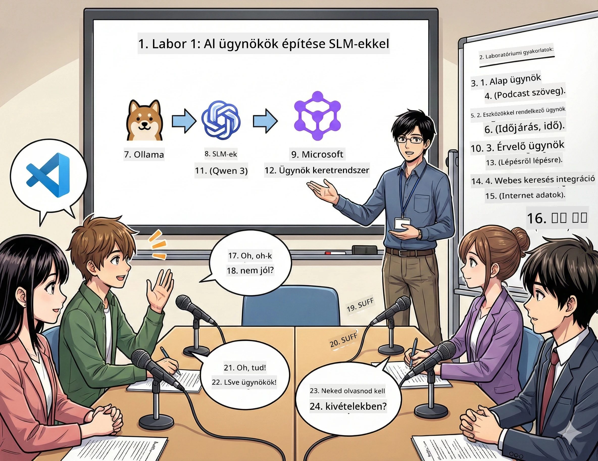

# 1. felvonás: Ismerd meg az AI kutatási asszisztensedet 🤖

## A kihívás

Elindítod a „Future Bytes” nevű új tech podcastodat. Az 1. epizód a legújabb AI áttörésekről szól, de 24 órád van rá, hogy:
1. Kutass utána
2. Találj megbízható forrásokat
3. Írj egy ütős forgatókönyvet
4. Tegyed természetessé a megszólalást

**Fordulat**: Nem kell egyedül csinálnod. Épp most építesz egy első AI asszisztenst, aki ebben mind segít. Legyen a neve Alex — a fáradhatatlan kutatópartnered, akinek soha nincs szüksége alvásra.

## Miért a kis nyelvi modellek? (Figyelem: menők)

Gondolj a Kis Nyelvi Modellekre (SLM-ek) úgy, mint a saját személyes AI-dra, ami *a te* számítógépeden él. Nincs felhő, nincs havi díj, nincs kétes adatmegosztás.

**Miért menők az SLM-ek:**
- **🏠 A gépeden futnak**: Laptopon, asztali gépen, vagy akár egy erős Raspberry Pi-n
- **💸 Nincs folytonos költség**: Nincs API díj, ami az uzsonnapénzedet megeszi
- **🔒 Adatvédelem az első**: Az adataid soha nem hagyják el az eszközöd
- **⚡ Villámgyorsak**: Nincs internetes késés, azonnali válaszokat adnak
- **🪦 Könnyű modellek**: 1M-10M paraméter vs. 100M+ a nagyoknál

**Népszerű SLM-ek**: Qwen 3, Phi-4, Gemma 3 (ezeket használjuk a workshopon Qwen-nel)

## A szerszámosládád

### Ollama: Az AI modell menedzsered

Az [Ollama](https://ollama.com/) olyan, mint a Steam az AI modelleknek. Letöltöd, futtatod és kezeled a modelleket egyszerű parancsokkal.

**Miért menő:**
- Egy parancs letölti és elindítja bármely modellt
- Macen, Windows-on, Linuxon is megy
- Ha van GPU-d, azt automatikusan használja
- Szuper memóriahatékony

### Microsoft Agent Framework: Itt történik a varázslat

A [Microsoft Agent Framework](https://github.com/microsoft/agent-framework) az a játszótér, ahol AI agenteket építhetsz, akik tudnak:

- 💬 Beszélgetni és emlékezni a diskurzusra
- 🛠️ Egyedi eszközöket használni (például webes keresés, időjárás lekérdezése)
- 🧠 Lépésenként átgondolni bonyolult problémákat
- 🤝 Együttműködni csapatban más agentekkel
- 🔌 Csatlakozni különböző AI szolgáltatókhoz (OpenAI, Ollama, Azure)

**Az építőelemek:**
- **Agentek**: A speciális feladatú AI asszisztenseid
- **Eszközök**: Különleges képességek, amiket adhatsz nekik
- **Memória**: Hogy ne felejtsék el a beszélgetést
- **Érvelés**: Megtanítani őket gondolkodni, nem csak válaszolni

## A tréninged: 4 küldetés

### 1. küldetés: Hozd létre az első agentedet

📓 [Nyisd meg a jegyzetfüzetet](../code/01.BasicAgent/00.BasicAgent-agent.ipynb)

**A küldetés**: Építsd meg Alexet, a podcast forgatókönyvíró AI-dat. Alex-nek dialógust kell generálnia két műsorvezető között, akik tech témákról beszélgetnek.

**Mit fogsz megtanulni**:
- Hogyan ébreszd fel az AI agentet (könnyebb, mint hétfőn felkelni)
- Adni neki személyiséget és utasításokat
- Valódi podcast forgatókönyveket írni
- Megérteni, amit visszamond neked

**Győzelmi feltétel**: Alex megalkotja a „Future Bytes” pilot epizód forgatókönyvét az AI témában! 🎯

### 2. küldetés: Adj Alexnek szuperképességeket (Eszközök!)

📓 [Nyisd meg a jegyzetfüzetet](../code/01.BasicAgent/01.BasicAgent-tools.ipynb)

**A küldetés**: Alex okos, de nem tudja az időjárást vagy az időt. Adj neki eszközöket, hogy ezt meg tudja oldani!

**Mit fogsz megtanulni**:
- Egyedi Python függvények készítése eszközökként
- Hagyd, hogy Alex döntsön, mikor melyik eszközt használja
- Nézd, ahogy önállóan old meg problémákat
- Kombinálj több eszközt bonyolult feladatokhoz

**Győzelmi feltétel**: Kérdezd meg, hogy "Milyen az idő Tokióban?" és Alex maga találja ki a választ! ☁️

### 3. küldetés: Tanítsd meg Alexnek a gondolkodást

📓 [Nyisd meg a jegyzetfüzetet](../code/01.BasicAgent/02.BasicAgent-reasoning.ipynb)

**A küldetés**: Tedd lehetővé, hogy Alex mutassa meg a gondolkodását. A problémamegoldásnál azt akarod látni, *hogyan* gondolkodik, nem csak a választ.

**Mit fogsz megtanulni**:
- Kapcsold be az „érvelési módot” (olyan, mint a matekos bizonyítások bemutatása)
- Lásd Alex lépésenkénti gondolatmenetét
- Értsd meg a gondolatlánc promptolást
- Hibakeresés, amikor Alex összezavarodik

**Győzelmi feltétel**: Tegyél fel egy bonyolult matekfeladatot, és nézd, hogyan gondolkodik végig Alex! 🧠

### 4. küldetés: Csatlakoztasd Alexet az internethez

📓 [Nyisd meg a jegyzetfüzetet](../code/01.BasicAgent/03.BasicAgent-websearch.ipynb)

**A küldetés**: Alex tudása egy adott dátumnál véget ér. Csatlakoztasd a webhez, hogy valós idejű infókat kapjon!

**Mit fogsz megtanulni**:
- Egyéni webes kereső eszköz készítése
- Külső API-k integrálása
- Hálózati hibák szelíd kezelése
- Plusz infók beszerzése Alex képzési adatain túl

**Győzelmi feltétel**: Kérdezz rá a mai tech hírekre és kapj friss eredményeket! 📰

## Mielőtt elkezdenéd 🚀

**Szükséges felszerelés**:
- Telepített Python 3.10+
- Ollama futtatva (ellenőrizd az `ollama --version` parancsal)
- VS Code Python kiterjesztéssel
- Legalább 8GB RAM (16GB, ha zökkenőmentes élményt szeretnél)

## Küldetés sorrend

Kövesd a jegyzetfüzeteket sorrendben a teljes történethez:

1. [00.BasicAgent-agent.ipynb](../code/01.BasicAgent/00.BasicAgent-agent.ipynb) — Ismerd meg Alexet (az első agented)
2. [01.BasicAgent-tools.ipynb](../code/01.BasicAgent/01.BasicAgent-tools.ipynb) — Szupererősítés!
3. [02.BasicAgent-reasoning.ipynb](../code/01.BasicAgent/02.BasicAgent-reasoning.ipynb) — Taníts meg gondolkodni Alexnek
4. [03.BasicAgent-websearch.ipynb](../code/01.BasicAgent/03.BasicAgent-websearch.ipynb) — Internetkapcsolat aktiválva!

## Amit elsajátítasz

Az 1. felvonás végére képes leszel:

- ✅ Saját hardveren futtatni AI modelleket (nem kell felhő!)
- ✅ Agenteket építeni egyedi személyiségekkel és képességekkel
- ✅ Agenteknek eszközöket adni, hogy valós problémákat oldjanak meg
- ✅ Agentektől látni az érvelési folyamatot
- ✅ Agenteket külső adatforrásokhoz kapcsolni
- ✅ Hibakeresni, ha valami félresiklik

## Ha valami elromlik (és hogyan javítsd) 🔧

### „Alex nem tölt be! Nincs elég memória!”
**A megoldás**: A géped küzd. Próbáld meg bezárni a többi alkalmazást vagy válts kisebb modellre. 8GB RAM a legkisebb ajánlott.

### „Alex nagyon lassú”
**A megoldás**: Kapcsold be az Ollama beállításaiban a GPU gyorsítást. Vagy csökkentsd a kontextusablak méretét. Sebesség ördög mód aktiválva! 🏎️

### „Az eszközök nem működnek!”
**A megoldás**: Ellenőrizd újra függvényhívásaidat. Alexnek pontos típusinformációkra van szüksége, hogy értse az eszköz működését. Olyan, mintha világos utasításokat adnál.

## Hasznos linkek 🔗

- [Agent Framework dokumentáció](https://github.com/microsoft/agent-framework) — Hivatalos útmutatók és példák
- [Ollama modell könyvtár](https://ollama.com/library) — Böngéssz az összes elérhető modell között
- [Qwen modell](https://ollama.com/library/qwen3) — Ismerd meg az AI agyát
- [Kód példák](https://github.com/microsoft/agent-framework/tree/main/python/samples) — Lopj ötleteket innen

## Következő lépés: 2. felvonás 🎬

Egy agented van. De mi lenne, ha *egy csapatnyi* agent dolgozna együtt? A 2. felvonásban megépíted a teljes podcast gyártó csapatod:
- **Kutató agent**: Megtalálja a legjobb forrásokat
- **Író agent**: Megalkotja a tökéletes forgatókönyvet  
- **Szerkesztő (te!)**: Jóváhagy vagy változtatásokat kér

Varázsoljunk egy kis AI mágiát! → [2. felvonás: Állítsd össze a gyártó csapatod](02.AIAgentOrchestrationAndWorkflows.md)

---

**Elakadtál?** Tedd fel kérdéseidet a workshop alatt. Mindannyian együtt tanulunk! 🙌

---

<!-- CO-OP TRANSLATOR DISCLAIMER START -->
**Jogi nyilatkozat**:  
Ez a dokumentum az AI fordító szolgáltatás, a [Co-op Translator](https://github.com/Azure/co-op-translator) használatával készült. Bár törekszünk a pontosságra, kérjük, vegye figyelembe, hogy az automatikus fordítások hibákat vagy pontatlanságokat tartalmazhatnak. Az eredeti dokumentum az anyanyelvén tekintendő hivatalos forrásnak. Fontos információk esetén profi, emberi fordítás igénylése javasolt. Nem vállalunk felelősséget a fordítás használatából eredő félreértésekért vagy félreértelmezésekért.
<!-- CO-OP TRANSLATOR DISCLAIMER END -->