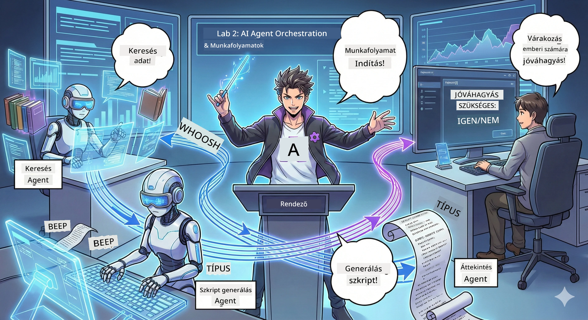

# 2. Felvonás: Állítsd össze a podcast gyártó csapatod 🎬



## A cselekmény bonyolódik

Alex (az AI asszisztensed az 1. felvonásból) kiváló, de egyetlen ügynök nem vezethet egy egész podcast stúdiót. Egy *csapatra* van szükséged:
- 🔍 **Kutató ügynök**: Friss infók után kutat az interneten
- ✍️ **Forgatókönyvíró ügynök**: A kutatásból lebilincselő párbeszédet készít
- 👤 **Te (a szerkesztő)**: Jóváhagyod a forgatókönyveket vagy visszaküldöd átdolgozásra

Üdv az **AI ügynök koordinációban** — ahol te leszel a saját AI legénységed rendezője. Gondolj rá úgy, mint az Bosszúállókra, de podcast készítéshez.

## Mi az az Agent Orchestration? (Egyszerűen)

Képzeld el, hogy egy éttermet vezetsz. Nem csinálsz mindent egyedül, ugye? Van:
- 🍳 egy szakács, aki főz
- 👨‍🍳 egy sous-chef, aki előkészít
- 👩‍🍳 egy felszolgáló, aki kiszolgál

Az agent orchestration ugyanaz az ötlet, csak AI ügynökökkel. Minden ügynöknek megvan a szakterülete, te pedig összehangolod őket a nagyobb célok eléréséhez. Egyetlen ügynök sem terhelődik túl, és a munka gyorsabban készül el.

### A zenekar hasonlat 🎸

Az AI ügynökeid olyanok, mint egy zenekar:
- **Énekes**: A fő ügynök, aki az ügyféllel kapcsolatos feladatokat kezeli
- **Dobos**: Tartja a ritmust, kezeli a háttérfolyamatokat  
- **Basszusgitáros**: Mindenkit támogat, adatokat gyűjt
- **Te (a menedzser)**: Összehangolod az egészet!

Koordináció nélkül? Csak zaj. Koordinációval? Gyönyörű zene.

### Miért fontos ez

Egyetlen AI ügynök megpróbál mindent megoldani = kiégés. Specializált ügynökök együttműködve = hatékonyság felszabadítva! 🚀

**Őszintén**: Emlékszel, amikor egyedül kellett kutatnod, írnod ÉS szerkesztened a podcastot? Igen, az borzalmas. Az orchestrationnel minden ügynök azt csinálja, amihez a legjobban ért. Te csak a végső döntéseket hozod meg.

**Valós példa**: Ügyfélszolgálati botok, amelyek tudják, mikor kezelik a számlázást, mikor a technikai problémákat, és mikor hívnak embert. Ez az orchestration!

## Ügynök vs. Munkafolyamat: Mi a különbség?

Így gondolj rájuk:

### 🤖 AI ügynök = jazz zenész
- **Döntéseket hoz menet közben** a hallottak alapján
- **Improvizál** megoldásokat az eszközeivel
- **Gondolkodik** egy LLM aggyal
- **Alkalmazkodik** mindenhez, amit kap

### 🎵 Munkafolyamat = klasszikus zenét játszó zenekar  
- **Követ egy kottát** (előre definiált lépések)
- **Megjósolható** végrehajtási út
- **Koordinál** több ügynököt, embereket, rendszereket
- **Strukturált**, mint egy recept

**A varázslat**: A munkafolyamatok *összehangolják* az ügynököket! Építesz egy munkafolyamatot, ami megmondja az ügynököknek, mikor lépjenek fel. A legjobb mindkét világban. 🎭

## Három módja az AI legénységed koordinálásának

### 1. 🎯 Központosított (Te vagy a főnök)

Egy fő ügynök irányít mindent. Olyan, mintha te vezetnél egy csapatot — te döntöd el, ki mit és mikor csinál.

**Előnyök**:
- ✅ Világos vezetés (nincs zavar)
- ✅ Következetes döntések
- ✅ Könnyű hibakeresés

**Használd ehhez**:
- Ügyfélszolgálati irányítás ("Ez számlázás vagy tech support?")
- Tartalom jóváhagyási munkafolyamatok ("Átmegy a forgatókönyv?")
- Podcast gyártás (pont, amit építünk!)

### 2. 🤝 Decentralizált (Az ügynökök önszerveződnek)

Az ügynökök közvetlenül beszélnek egymással és csoportként oldanak meg dolgokat. Olyan, mint egy csoportos cset, ahol mindenki összehangolt.

**Előnyök**:
- ✅ Könnyen bővíthető (bármikor adhatsz hozzá ügynököket)
- ✅ Nincs egyetlen hibapont
- ✅ Az ügynökök természetesen működnek együtt

**Használd ehhez**:
- Kutató csapatok (minden ügynök más forrásokat vizsgál)
- Ötletbörze ülések
- Elosztott problémamegoldás

### 3. 🔀 Hibrid (A két világ legjobbja)

Te állítod be az általános irányt, de az ügynökök szabadon szervezkednek a feladatokon. Olyan, mint egy vezérigazgató, aki bízik a csapatában.

**Ideális**: Bonyolult projektekhez, amelyek mind irányítást, mind rugalmasságot igényelnek.

## Microsoft Agent Framework: Az orchestration eszköztárad 🧰

Ideje építeni! Íme, amit használsz:

### Az építőelemek

#### 1. 🧱 Végrehajtók (a dolgozóid)
- **Mik ők**: Egyedi feldolgozó egységek — lehetnek ügynökök vagy egyéni logika
- **Mit csinálnak**: Bemenetet kapnak, dolgoznak, outputot adnak
- **Gondolj rájuk**: Egy gyártósor állomásaira

#### 2. ➡️ Élek (a kapcsolatok)
- **Mik ők**: Az állomások közti útvonalak
- **Mit csinálnak**: Üzenetáramlást irányítanak ("A után menj B-be")
- **Gondolj rájuk**: Nyilak egy folyamatábrán

#### 3. 🗺️ Munkafolyamatok (a fő terv)
- **Mik ők**: Az összes végrehajtó és kapcsolat teljes gráfja
- **Mit csinálnak**: Meghatározzák a teljes folyamatot kezdettől a végéig
- **Gondolj rájuk**: A gyártósorod tervrajza

### Szuper funkciók, amiket imádni fogsz

**🛡️ Típusbiztonság**: Az ügynökök közti üzenetek típusellenőrzöttek. Nincs „Hoppá, rossz adattípus” meglepetés.

**🔀 Rugalmas irányítás**: 
- Feltételes (ha jóváhagyva, publikál; ha nem, átdolgoz)
- Párhuzamos feldolgozás (több ügynök egyidejű munka)
- Dinamikus útvonalak (a workflow eredmény alapján alkalmazkodik)

**🔌 Külső integráció**:
- API-k csatlakoztatása
- Emberi jóváhagyási pontok hozzáadása (te hagyod jóvá, mielőtt publikál)
- Kérés/válasz folyamatok építése

**💾 Állapotmentés**: Mentheted az előrehaladást! Ha valami leáll, ott folytathatod, ahol abbahagytad.

**🤝 Több ügynök együttműködése**:
- Ügynökök egymás után (A → B → C)
- Egyidejű futtatás (A + B + C egyszerre)
- Átadás egyik ügynöktől a másiknak
- Együttműködő feldolgozás

## Legjobb gyakorlatok (Profik tippjei) 🎯

### 1. Tartsd modulárisan
Minden ügynök csak EGY dolgot csináljon nagyon jól. Ne készíts "szuperügynököt", aki mindent megold — később bánni fogod hibakereséskor.

### 2. Készülj a hibákra
Az ügynökök hibázhatnak. A hálózatok leállhatnak. Építs hibakezelést és tartalék terveket. A jövőbeli önmagad hálás lesz.

### 3. Figyelj mindent
Kövesd, mit csinálnak az ügynökök. Használd a DevUI-t (ezt hamarosan megnézzük!), hogy lásd a workflow működését.

### 4. Optimalizáld az üzenetek méretét
Ne küldj hatalmas fájlokat az ügynökök között. Tartsd az üzeneteket karcsúnak a gyorsaság érdekében.

### 5. Válaszd ki a megfelelő mintát
Irányítást akarsz? Központosított. Skálázódást? Decentralizált. Nem tudod? Hibrid!

## DevUI: A munkafolyamat hibakeresőd 🔍

### Mi az a DevUI?

A DevUI olyan, mint egy játszótér az ügynökök és munkafolyamatok tesztelésére. Egy webes felület, ahol:
- 👀 Látod a munkafolyamatot működés közben
- 💬 Közvetlenül csetelsz az ügynökökkel
- 🔍 Hibakereshetsz, ha valami nem úgy működik
- 📊 Megnézheted a trace-eket és teljesítményadatokat

> **Fontos**: A DevUI kizárólag fejlesztésre való! Ne használd éles környezetben. Gondolj rá úgy, mint a helyi tesztkörnyezetedre.

### Amitől zseniális

- **🖥️ Interaktív web UI**: Kattints, gépelj, tesztelj — parancssor nélkül
- **📁 Drag-and-Drop**: Fájlokat tölthetsz fel, különböző bemenetekkel tesztelhetsz
- **📂 Automatikus felismerés**: Mutass rá egy mappára, és megtalálja az összes ügynököt automatikusan
- **📋 Nincs beállítás mód**: Ügynököket a kódban regisztrálhatsz, nem kell mappastruktúra
- **🔌 OpenAI kompatibilis**: Működik az OpenAI SDK-val (kompatibilitás FTW!)
- **👁️ Beépített trace funkció**: Pontosan láthatod, mit csinálnak az ügynökök

### Hogyan működnek a bemenetek

A DevUI okosan kezeli a bemeneteket:

- **Ügynökök teszteléséhez?** Szövegmezők és fájlfeltöltő gombok vannak
- **Munkafolyamatok teszteléséhez?** Az UI automatikusan generálja a bemeneti mezőket a workflow elvárásai alapján

Ez olyan, mintha varázslat lenne, pedig csak jó kód. ✨

## Küldetéseid: Építs podcast stúdiót 🎬

### Küldetés 1: Készíts egyetlen ügynököt DevUI-val

📂 [01.AgentDevUI](../../../../WorkshopForAgentic/code/02.Workflow/01.AgentDevUI)

**A kihívás**: Mielőtt teljes csapatot építesz, próbáld ki a DevUI-t egy ügynökkel: egy webes kereső szakértővel.

**Amit építesz**:
Egy kutató ügynököt, amely podcast témák után keres a neten. Tesztelheted a DevUI webes felületén a `http://localhost:8090` címen.

**Miket tanulsz**:
- 🚀 Ügynökök indítása DevUI-ban
- 🔍 Az ügynök válaszainak valós idejű tesztelése
- 🛠️ Egyéni eszközök építése (web keresés)
- 📊 Trace engedélyezése hibakereséshez
- 🖥️ A webes interaktív felület használata

**A kód**:
- `agent.py`: A SearchAgent-ed webes kereső szuperképességekkel
- OllamaChatClient-t használ a Qwenhez való kapcsolódáshoz
- Megvalósítja a `web_search()` eszköz függvényt
- `serve()`-vel indul — automatikusan megnyitja a DevUI-t

**Győzelmi feltétel**: Kérdezd az ügynöködtől: "Mi a trend az AI-ban?" és nézd, ahogy weben keres! 🎉

### Küldetés 2: Építs több ügynökös munkafolyamatot

📂 [02.WorkflowDevUI](../../../../WorkshopForAgentic/code/02.Workflow/02.WorkflowDevUI)

**A kihívás**: Most kezdődik az igazi móka! Építsd meg a teljes podcast gyártási munkafolyamatot:
1. 🔍 **Kutató ügynök** → Keresi a témádat
2. ✍️ **Forgatókönyvíró ügynök** → Egy két házigazda közti párbeszédet ír (kínaiul!)
3. 👤 **Áttekintő végrehajtó** → Tőled kér jóváhagyást vagy elutasítást
4. 🔄 **Visszacsatolás** → Ha elutasítod, az ügynök az észrevételeid alapján újraírásra kerül

**Miket tanulsz**:
- 🧱 Speciális ügynökök készítése különböző feladatokra
- 🔗 Ügynökök összekapcsolása WorkflowBuilder-rel
- 🔀 Jóváhagyási körök megvalósítása (ember a folyamatban!)
- 🚦 Feltételes útirányítás (jóváhagyott vs. elutasított)
- 🔧 Egyéni végrehajtók építése üzleti logikához

**A munkafolyamat**:
```
SearchAgent → ScriptAgent → ReviewExecutor
                             ↑          ↓ (if rejected)
                             ←─────────
```
  
**A kód**:
- `search_agent/agent.py`: A te kutatószakértőd
- `generate_script_agent/agent.py`: A forgatókönyvíród (kínaiul ír!)
- `workflow/workflow.py`: Itt történik az orchestration varázslat  
- `main.py`: Mindent elindít DevUI-ban

**Győzelmi feltétel**: Add meg a témát, nézd át a forgatókönyvet, egyszer utasítsd el a kört tesztelve, majd hagyd jóvá! 🎉

### Küldetés 3: Készíts konzolos alkalmazást

📂 [03.Application](../../../../WorkshopForAgentic/code/02.Workflow/03.Application)

**A kihívás**: Vidd át a DevUI-ban készült munkafolyamatot egy menő terminálos appba, színes megjelenítéssel, töltő spinnerrel és fájlmentéssel. Ez már éles használatra kész!

**Miket tanulsz**:
- ⚡ Munkafolyamatok programozott futtatása (DevUI nélkül)
- 📡 Eseményvezérelt architektúra streaminggel
- 🎨 Szép terminál UI készítése (színek, spinner, előrehaladási sávok)
- 💾 Végleges forgatókönyv fájlba mentése
- 🔄 Async munkafolyamat kezelés Python asyncio-val

**Mit csinál**:
1. Bekéri a podcast témát
2. Valós idejű előrehaladást mutat ("A kutató ügynök dolgozik…")
3. Megjeleníti a generált forgatókönyvet színekkel
4. Kéri a jóváhagyásodat
5. Mentett jóváhagyott forgatókönyvet a `podcast.txt` fájlba

**A kód**:
- `podcast_app.py`: Fő app eseménykezeléssel
- `workflow.py`: Újrahasználja a 2-es küldetés munkafolyamatát
- Kezeli az eseményeket: `AgentRunUpdateEvent`, `RequestInfoEvent`, `WorkflowOutputEvent`
- ANSI színeket használ a terminál stílusához

**Győzelmi feltétel**: Futtasd az appot, készíts egy podcast forgatókönyvet és nézd, hogy mentődik! Valódi eszközt építettél. 🚀

## Amit elsajátítottál 🏆

2. felvonás után képes vagy:

- ✅ Több AI ügynök koordinálására, mint egy főnök
- ✅ Munkafolyamatokat építeni szekvenciális ÉS feltételes logikával
- ✅ Emberi jóváhagyási pontokat hozzáadni
- ✅ DevUI-val tesztelni és hibakeresni a munkafolyamatokat
- ✅ Éles konzolos alkalmazásokat létrehozni
- ✅ Hibakezelést szépen megoldani bonyolult rendszerekben
- ✅ Megfelelő orchestration mintát választani bármilyen projekthez

## Amikor gondok adódnak 🔧

### „Túl bonyolult a munkafolyamatom!”
**Megoldás**: Bonts kisebb al-folyamatokra. Minden munkafolyamat csináljon EGY dolgot jól. Szükség szerint láncold össze őket.

### „Nem tudom követni, mi történik!”
**Megoldás**: Használj munkafolyamat állapotmentést. Kapcsold be a trace-et DevUI-ban, hogy minden lépést lásd.

### „Egy ügynök hibája mindent összeomlaszt!”
**Megoldás**: Adj hibahatárokat. Minden ügynök kezelje a saját hibáit és legyen tartalék viselkedése.

### „Ez annyira lassú...”
**Megoldás**: Futhatnak-e ügynökök párhuzamosan? A szekvenciális munkafolyamatok egyszerűek, de lassúak. Keresd a párhuzamosítás lehetőségeit!

## Hasznos források 🔗

- [Workflow Dokumentáció](https://learn.microsoft.com/en-us/agent-framework/user-guide/workflows/overview) — Microsoft hivatalos útmutatók
- [Orchestration minták](https://www.ibm.com/think/topics/ai-agent-orchestration) — IBM nézőpontja
- [Agent Framework GitHub](https://github.com/microsoft/agent-framework) — Forráskód böngészése
- [Kód példák](https://github.com/microsoft/agent-framework/tree/main/python/samples) — Mintákat lopj innen

---

**Készen állsz a fináléra?** Megvan a scripted. Most alakítsuk valódi hanganyaggá! → [3. Felvonás: Éleszd fel a podcasted](03.Multi-SpeakerPodcastGenerationWithVibeVoice.md) 🎤

---

**Elakadtál? Összezavarodtál? Izgatott vagy?** Oszd meg a műhely csevegésében! Mindannyian együtt tanulunk. 🚀

---

<!-- CO-OP TRANSLATOR DISCLAIMER START -->
**Jogi nyilatkozat**:
Ez a dokumentum az AI fordítási szolgáltatás, a [Co-op Translator](https://github.com/Azure/co-op-translator) segítségével készült. Bár törekszünk a pontosságra, kérjük, vegye figyelembe, hogy az automatikus fordítások hibákat vagy pontatlanságokat tartalmazhatnak. Az eredeti dokumentum az anyanyelvén tekintendő hivatalos forrásnak. Létfontosságú információk esetén szakmai, emberi fordítást javasolunk. Nem vállalunk felelősséget a fordítás használatából eredő félreértésekért vagy helytelen értelmezésekért.
<!-- CO-OP TRANSLATOR DISCLAIMER END -->