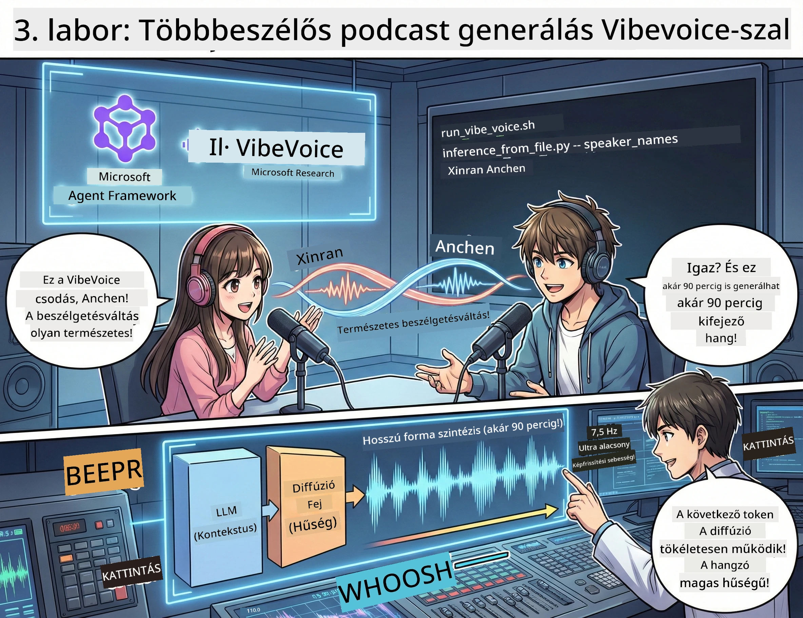

<!--
CO_OP_TRANSLATOR_METADATA:
{
  "original_hash": "d5c8bb53a007e77e7f8afe3067e64c55",
  "translation_date": "2026-01-05T16:10:14+00:00",
  "source_file": "WorkshopForAgentic/translation/zh-cn/03.Multi-SpeakerPodcastGenerationWithVibeVoice.md",
  "language_code": "hu"
}
-->
# Harmadik felvonás: Keltsd életre a podcasted 🎤



## A nagy finálé

Már kutattad a témát. Megírtad a szöveget. Most ráteszünk egy lapáttal: alakítsd át a szövegedet valódi podcast hanganyaggá élethű hangokkal!

Íme a **VibeVoice** — a Microsoft Research nyílt forráskódú TTS (szöveg-beszéd) varázslata, amely létrehoz:
- 🎭 természetes, gördülékeny párbeszédet
- 👥 több beszélőt (akár 4-et!)
- ⏱️ hosszú formátumú hanganyagot (akár 90 perc!)
- 🎵 kifejező előadást (nem robothang!)

Ez a technológia áll a szintetikus podcastok mögött. Készítsük el a tiédet!

## Mi az a VibeVoice? (menő cucc)

A VibeVoice a Microsoft Research ajándéka a világnak. Kifejezetten podcast-stílusú párbeszédek hanganyagára tervezték.

### Miért király 🔥

* **⏱️ Maratoni beszélgetés**: akár 90 perc folytonos beszéd generálása (ez már egy teljes podcast epizód!)
* **👥 Több beszélős varázslat**: akár 4 különböző hang, egységes személyiséggel
* **⚡ Szuperhatékony**: nagyon alacsony, 7,5 Hz-es képkockasebesség a számítási erőforrás megtakarításhoz
* **🧠 Intelligens hang**: LLM-mel (környezetértés) és diffúziós modellekkel (élethű hang létrehozás)
* **🎭 Természetes folyamatosság**: automatikusan kezeli a váltott beszédet, szüneteket és a dialógus ritmusát

**Átültetés**: A VibeVoice nem csak felolvassa a szöveged — *eljátssza* azt, mint egy igazi ember.

---

## Előkészületek 🚀

**Amire szükséged lesz**:

* 🐍 **Python 3.10+** (ez már nálad van az első és második felvonásból)
* 🚀 **uv** (egy gyors Python csomagkezelő – ezt telepíteni fogjuk)
* 📝 **a scripted**: a második felvonásból származó `podcast.txt` fájl (a `../03.Application/` mappában)

**Pro tipp**: Ehhez a lépéshez jó internetkapcsolat kell az előképzett modellek letöltéséhez. Kávézz le! ☕

---

## Vágjunk bele! Egyszerű mód 🎬

Megcsináltuk szuper egyszerűvé. Egy shell script mindent megtesz helyetted.

### Lépések

1. **Tedd futtathatóvá**:
```bash
chmod +x run_vibe_voice.sh
```

2. **Futtasd**:
```bash
./run_vibe_voice.sh
```

3. **Várd meg a varázslatot** (az első futtatás pár percet igényelhet)

### Mi történik a kulisszák mögött 🎭

A script lényegében az automatikus hangmérnököd:

1. **📥 Letölti a VibeVoice-ot**: klónozza a hivatalos GitHub repót
2. **📦 Telepíti a függőségeket**: `uv pip` segítségével villámgyorsan telepít csomagokat
3. **🎬 Generálja a hanganyagot**: lefuttatja az inference scriptet, használva:
   * `--model_path`: az előképzett VibeVoice-7B modellt
   * `--txt_path`: a te `podcast.txt` scriptedet
   * `--speaker_names`: hozzárendeli a hangokat (alapértelmezett: Xinran és Anchen)

**Eredmény**: a scriptedből valódi podcast epizód lesz! 🎉

---

## A te feladatod 🎯

Tegyük ezt izgalmassá:

### Feladat 1: Tartalom létrehozás
Szerkessz egy párbeszédet két ember között a `../03.Application/podcast.txt` fájlban. Legyen techről, hobbiról vagy bármiről! Csak legyen dialógus.

**Formátum mintapélda**:
```
说话人 1：嘿！你听说新的 AI 模型了吗？
说话人 2：不会吧！告诉我更多！
说话人 1：它叫...
```

### Feladat 2: Hanganyag generálás
Futtasd le a scriptet, és nézd meg a varázslatot. Az első futtatás hosszabb lesz (mert modelleket tölt le).

### Feladat 3: Hallgatás és elemzés
- Hallatszik természetesnek?
- Más hangjuk van a beszélőknek?
- Folytatódik gördülékenyen a váltott beszéd?
- Van robotikus pillanat?

### Feladat 4: Kísérletezés (a bátraknak)
Szerkeszd a `run_vibe_voice.sh` fájlt és változtasd meg a `--speaker_names` értéket, hogy más hangkombinációkat próbálj ki. A VibeVoice több előképzett hangot kínál!

**Extra kihívás**: próbálj ki egy hárombeszélős párbeszédet! 🎆

---

## További tudnivalók 📚

* **🏠 Projekt honlap**: [VibeVoice hivatalos oldal](https://microsoft.github.io/VibeVoice/)
* **🤗 Előképzett modellek**: [Hugging Face - VibeVoice-7B](https://huggingface.co/vibevoice/VibeVoice-7B)
* **📖 Tudományos publikáció**: Mélyebben a technológiáról (ha érdekel)

> **⚠️ Felelős AI értesítés**: A VibeVoice nagyon erős. Használd etikusan! Ne készíts mélyhamisítást vagy megtévesztő tartalmat. Készíts menő dolgokat, amik segítenek az embereknek. 🙏

---

## 🏆 Gratulálunk! Megcsináltad!

Most végezted el a teljes folyamatot:
1. ✅ **Első felvonás**: Egyedi eszközökkel AI ügynököt építettél
2. ✅ **Második felvonás**: Több ügynök munkafolyamatát szervezted
3. ✅ **Harmadik felvonás**: Valódi podcast hanganyagot generáltál

**Most már rendelkezel**:
- egy hasznos AI kutatási asszisztenssel
- egy teljes podcast készítési munkafolyamattal
- egy valós hangfájllal, amit megoszthatsz

### Mi a következő lépés? 🚀

**Indítsd el a podcasted!**
- Töltsd fel podcast platformokra
- Oszd meg a közösségi médiában
- Iterálj, fejlessz tovább

**Építs tovább!**
- Próbálj ki új témákat
- Kísérletezz több beszélővel
- Adj hozzá háttérzenét
- Készíts webes felületet
- Automatizáld az egész folyamatot

**Oszd meg a munkádat!**
Tegyél bejelölést nekünk! Mutasd meg a világnak, amit létrehoztál. Az AI podcast forradalma nálad kezdődik. 🎙️

---

**Kérdések? Ötletek? Sikertörténetek?** Írd meg a workshop csetjén!

**Üdv a tartalomkészítés jövőjében.** 🌟

---

<!-- CO-OP TRANSLATOR DISCLAIMER START -->
**Nyilatkozat**:  
Ezt a dokumentumot az AI fordító szolgáltatás, a [Co-op Translator](https://github.com/Azure/co-op-translator) segítségével fordítottuk. Bár igyekszünk a pontosságra, kérjük, vegye figyelembe, hogy az automatikus fordítások tartalmazhatnak hibákat vagy pontatlanságokat. Az eredeti dokumentum az adott nyelven tekintendő hiteles forrásnak. Fontos információk esetén professzionális emberi fordítást javaslunk. Nem vállalunk felelősséget a fordítás használatából eredő esetleges félreértésekért vagy téves értelmezésekért.
<!-- CO-OP TRANSLATOR DISCLAIMER END -->