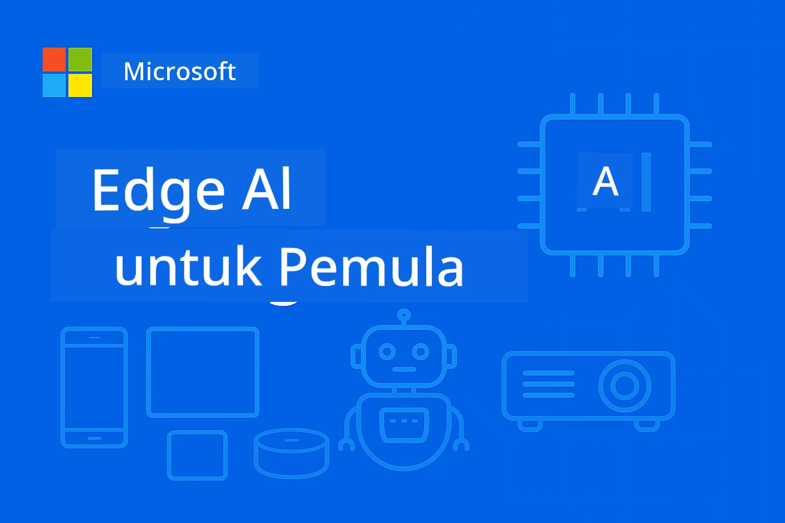

# EdgeAI untuk Pemula 




[](https://GitHub.com/microsoft/edgeai-for-beginners/graphs/contributors)
[](https://GitHub.com/microsoft/edgeai-for-beginners/issues)
[](https://GitHub.com/microsoft/edgeai-for-beginners/pulls)
[](http://makeapullrequest.com)

[](https://GitHub.com/microsoft/edgeai-for-beginners/watchers)
[](https://GitHub.com/microsoft/edgeai-for-beginners/fork)
[](https://GitHub.com/microsoft/edgeai-for-beginners/stargazers)


[](https://discord.gg/nTYy5BXMWG)

Ikuti langkah-langkah ini untuk memulai menggunakan sumber daya ini:

1. **Fork Repositori**: Klik [](https://GitHub.com/microsoft/edgeai-for-beginners/fork)
2. **Clone Repositori**:   `git clone https://github.com/microsoft/edgeai-for-beginners.git`
3. [**Bergabunglah dengan Azure AI Foundry Discord untuk bertemu para ahli dan pengembang lain**](https://discord.com/invite/ByRwuEEgH4)


### 🌐 Dukungan Multi-Bahasa

#### Didukung melalui GitHub Action (Otomatis & Selalu Terbaru)

<!-- CO-OP TRANSLATOR LANGUAGES TABLE START -->
[Arabic](../ar/README.md) | [Bengali](../bn/README.md) | [Bulgarian](../bg/README.md) | [Burmese (Myanmar)](../my/README.md) | [Chinese (Simplified)](../zh-CN/README.md) | [Chinese (Traditional, Hong Kong)](../zh-HK/README.md) | [Chinese (Traditional, Macau)](../zh-MO/README.md) | [Chinese (Traditional, Taiwan)](../zh-TW/README.md) | [Croatian](../hr/README.md) | [Czech](../cs/README.md) | [Danish](../da/README.md) | [Dutch](../nl/README.md) | [Estonian](../et/README.md) | [Finnish](../fi/README.md) | [French](../fr/README.md) | [German](../de/README.md) | [Greek](../el/README.md) | [Hebrew](../he/README.md) | [Hindi](../hi/README.md) | [Hungarian](../hu/README.md) | [Indonesian](./README.md) | [Italian](../it/README.md) | [Japanese](../ja/README.md) | [Kannada](../kn/README.md) | [Khmer](../km/README.md) | [Korean](../ko/README.md) | [Lithuanian](../lt/README.md) | [Malay](../ms/README.md) | [Malayalam](../ml/README.md) | [Marathi](../mr/README.md) | [Nepali](../ne/README.md) | [Nigerian Pidgin](../pcm/README.md) | [Norwegian](../no/README.md) | [Persian (Farsi)](../fa/README.md) | [Polish](../pl/README.md) | [Portuguese (Brazil)](../pt-BR/README.md) | [Portuguese (Portugal)](../pt-PT/README.md) | [Punjabi (Gurmukhi)](../pa/README.md) | [Romanian](../ro/README.md) | [Russian](../ru/README.md) | [Serbian (Cyrillic)](../sr/README.md) | [Slovak](../sk/README.md) | [Slovenian](../sl/README.md) | [Spanish](../es/README.md) | [Swahili](../sw/README.md) | [Swedish](../sv/README.md) | [Tagalog (Filipino)](../tl/README.md) | [Tamil](../ta/README.md) | [Telugu](../te/README.md) | [Thai](../th/README.md) | [Turkish](../tr/README.md) | [Ukrainian](../uk/README.md) | [Urdu](../ur/README.md) | [Vietnamese](../vi/README.md)

> **Lebih Suka Clone Secara Lokal?**
>
> Repositori ini mencakup lebih dari 50 terjemahan bahasa yang secara signifikan meningkatkan ukuran unduhan. Untuk mengkloning tanpa terjemahan, gunakan sparse checkout:
>
> **Bash / macOS / Linux:**
> ```bash
> git clone --filter=blob:none --sparse https://github.com/microsoft/edgeai-for-beginners.git
> cd edgeai-for-beginners
> git sparse-checkout set --no-cone '/*' '!translations' '!translated_images'
> ```
>
> **CMD (Windows):**
> ```cmd
> git clone --filter=blob:none --sparse https://github.com/microsoft/edgeai-for-beginners.git
> cd edgeai-for-beginners
> git sparse-checkout set --no-cone "/*" "!translations" "!translated_images"
> ```
>
> Ini memberikan semua yang Anda butuhkan untuk menyelesaikan kursus dengan unduhan yang jauh lebih cepat.
<!-- CO-OP TRANSLATOR LANGUAGES TABLE END -->

**Jika Anda ingin memiliki dukungan tambahan untuk bahasa terjemahan, daftar didukung tercantum [di sini](https://github.com/Azure/co-op-translator/blob/main/getting_started/supported-languages.md)**
## Pendahuluan

Selamat datang di **EdgeAI untuk Pemula** – perjalanan komprehensif Anda ke dunia transformasi Edge Artificial Intelligence. Kursus ini menjembatani kesenjangan antara kemampuan AI yang kuat dan penerapan praktis di dunia nyata pada perangkat edge, memberdayakan Anda untuk memanfaatkan potensi AI langsung di tempat data dihasilkan dan keputusan harus dibuat.

### Apa yang Akan Anda Kuasai

Kursus ini membawa Anda dari konsep dasar hingga implementasi siap produksi, meliputi:
- **Model Bahasa Kecil (SLMs)** yang dioptimalkan untuk penerapan edge
- **Optimasi yang peka terhadap perangkat keras** di berbagai platform
- **Inferensi waktu nyata** dengan kemampuan menjaga privasi
- **Strategi penerapan produksi** untuk aplikasi perusahaan

### Mengapa EdgeAI Penting

Edge AI mewakili pergeseran paradigma yang mengatasi tantangan modern penting:
- **Privasi & Keamanan**: Proses data sensitif secara lokal tanpa eksposur ke cloud
- **Performa Waktu Nyata**: Hilangkan latensi jaringan untuk aplikasi yang mendesak waktu
- **Efisiensi Biaya**: Kurangi biaya bandwidth dan komputasi cloud
- **Operasi Tangguh**: Pertahankan fungsi saat terjadi pemadaman jaringan
- **Kepatuhan Regulasi**: Penuhi persyaratan kedaulatan data

### Edge AI

Edge AI mengacu pada menjalankan algoritma AI dan model bahasa secara lokal pada perangkat keras, dekat dengan tempat data dihasilkan tanpa bergantung pada sumber daya cloud untuk inferensi. Ini mengurangi latensi, meningkatkan privasi, dan memungkinkan pengambilan keputusan waktu nyata.

### Prinsip Inti:
- **Inferensi di perangkat**: Model AI dijalankan pada perangkat edge (ponsel, router, mikrokontroler, PC industri)
- **Kemampuan offline**: Berfungsi tanpa konektivitas internet yang terus-menerus
- **Latensi rendah**: Respon langsung yang cocok untuk sistem waktu nyata
- **Kedaulatan data**: Menjaga data sensitif tetap lokal, meningkatkan keamanan dan kepatuhan

### Model Bahasa Kecil (SLMs)

SLM seperti Phi-4, Mistral-7B, dan Gemma adalah versi yang dioptimalkan dari LLM yang lebih besar—dilatih ulang atau didistilasi untuk:
- **Jejak memori yang lebih kecil**: Penggunaan memori efisien pada perangkat edge yang terbatas
- **Permintaan komputasi lebih rendah**: Dioptimalkan untuk performa CPU dan GPU edge
- **Waktu mulai cepat**: Inisialisasi cepat untuk aplikasi yang responsif

Mereka membuka kemampuan NLP yang kuat sambil memenuhi batasan:
- **Sistem tertanam**: Perangkat IoT dan pengontrol industri
- **Perangkat mobile**: Smartphone dan tablet dengan kemampuan offline
- **Perangkat IoT**: Sensor dan perangkat pintar dengan sumber daya terbatas
- **Server edge**: Unit pemrosesan lokal dengan sumber daya GPU terbatas
- **Komputer pribadi**: Skenario penerapan desktop dan laptop

## Modul Kursus & Navigasi

| Modul | Topik | Fokus Area | Konten Utama | Tingkat | Durasi |
|--------|-------|------------|-------------|--------|----------|
| [📖 00 ](./introduction.md) | [Pengantar EdgeAI](./introduction.md) | Dasar & Konteks | Ikhtisar EdgeAI • Aplikasi Industri • Pengenalan SLM • Tujuan Pembelajaran | Pemula | 1-2 jam |
| [📚 01](../../Module01) | [Dasar-Dasar EdgeAI](./Module01/README.md) | Perbandingan Cloud vs Edge AI | Dasar-Dasar EdgeAI • Studi Kasus Dunia Nyata • Panduan Implementasi • Penerapan Edge | Pemula | 3-4 jam |
| [🧠 02](../../Module02) | [Dasar Model SLM](./Module02/README.md) | Keluarga model & arsitektur | Keluarga Phi • Keluarga Qwen • Keluarga Gemma • BitNET • μModel • Phi-Silica | Pemula | 4-5 jam |
| [🚀 03](../../Module03) | [Praktik Penerapan SLM](./Module03/README.md) | Penerapan lokal & cloud | Pembelajaran Lanjutan • Lingkungan Lokal • Penerapan Cloud | Menengah | 4-5 jam |
| [⚙️ 04](../../Module04) | [Toolkit Optimasi Model](./Module04/README.md) | Optimasi lintas platform | Pengantar • Llama.cpp • Microsoft Olive • OpenVINO • Apple MLX • Sintesis Alur Kerja | Menengah | 5-6 jam |
| [🔧 05](../../Module05) | [Produksi SLMOps](./Module05/README.md) | Operasi produksi | Pengenalan SLMOps • Distilasi Model • Penyempurnaan • Penerapan Produksi | Lanjutan | 5-6 jam |
| [🤖 06](../../Module06) | [Agen AI & Pemanggilan Fungsi](./Module06/README.md) | Kerangka agen & MCP | Pengenalan Agen • Pemanggilan Fungsi • Protokol Konteks Model | Lanjutan | 4-5 jam |
| [💻 07](../../Module07) | [Implementasi Platform](./Module07/README.md) | Contoh lintas platform | Toolkit AI • Foundry Lokal • Pengembangan Windows | Lanjutan | 3-4 jam |
| [🏭 08](../../Module08) | [Toolkit Foundry Lokal](./Module08/README.md) | Contoh siap produksi | Aplikasi contoh (lihat detail di bawah) | Ahli | 8-10 jam |

### 🏭 **Modul 08: Aplikasi Contoh**

- [01: REST Chat Mulai Cepat](./Module08/samples/01/README.md)
- [02: Integrasi SDK OpenAI](./Module08/samples/02/README.md)
- [03: Penemuan Model & Benchmarking](./Module08/samples/03/README.md)
- [04: Aplikasi Chainlit RAG](./Module08/samples/04/README.md)
- [05: Orkestrasi Multi-Agen](./Module08/samples/05/README.md)
- [06: Router Models-as-Tools](./Module08/samples/06/README.md)
- [07: Klien API Langsung](./Module08/samples/07/README.md)
- [08: Aplikasi Chat Windows 11](./Module08/samples/08/README.md)
- [09: Sistem Multi-Agen Lanjutan](./Module08/samples/09/README.md)
- [10: Kerangka Alat Foundry](./Module08/samples/10/README.md)

### 🎓 **Workshop: Jalur Pembelajaran Praktis**

Materi workshop praktis komprehensif dengan implementasi siap produksi:

- **[Panduan Workshop](./Workshop/Readme.md)** - Tujuan pembelajaran lengkap, hasil, dan navigasi sumber daya
- **Contoh Python** (6 sesi) - Diperbarui dengan praktik terbaik, penanganan kesalahan, dan dokumentasi lengkap
- **Jupyter Notebooks** (8 interaktif) - Tutorial langkah demi langkah dengan tolok ukur dan pemantauan performa
- **Panduan Sesi** - Panduan markdown terperinci untuk setiap sesi workshop
- **Alat Validasi** - Skrip untuk memverifikasi kualitas kode dan menjalankan tes smoke

**Apa yang Akan Anda Bangun:**
- Aplikasi chat AI lokal dengan dukungan streaming
- Pipeline RAG dengan evaluasi kualitas (RAGAS)
- Alat benchmarking dan perbandingan multi-model
- Sistem orkestrasi multi-agen
- Routing model cerdas dengan pemilihan berbasis tugas

### 🎙️ **Workshop For Agentic: Hands-On - The AI Podcast Studio**
Bangun pipeline produksi podcast bertenaga AI dari awal! Workshop mendalam ini mengajarkan Anda cara membuat sistem multi-agen lengkap yang mengubah ide menjadi episode podcast profesional.

**[🎬 Mulai Workshop Studio Podcast AI](./WorkshopForAgentic/README.md)**

**Misi Anda**: Luncurkan "Future Bytes" — podcast teknologi yang sepenuhnya digerakkan oleh agen AI yang Anda bangun sendiri. Tanpa ketergantungan cloud, tanpa biaya API — semuanya berjalan secara lokal di mesin Anda.

**Yang Membuat Ini Unik:**
- **🤖 Orkestrasi Multi-Agen Nyata** - Bangun agen AI khusus yang melakukan riset, menulis, dan memproduksi audio
- **🎯 Pipeline Produksi Lengkap** - Dari pemilihan topik hingga keluaran audio podcast final
- **💻 Penerapan 100% Lokal** - Menggunakan Ollama dan model lokal (Qwen-3-8B) untuk privasi dan kendali penuh
- **🎤 Integrasi Text-to-Speech** - Mengubah naskah menjadi percakapan multi-pembicara yang terdengar alami
- **✋ Alur Kerja Human-in-the-Loop** - Gerbang persetujuan memastikan kualitas sambil mempertahankan otomatisasi

**Perjalanan Pembelajaran Tiga Babak:**

| Babak | Fokus | Keterampilan Utama | Durasi |
|-------|-------|--------------------|---------|
| **[Babak 1: Kenali Asisten AI Anda](./WorkshopForAgentic/md/01.BuildAIAgentWithSLM.md)** | Bangun agen AI pertama Anda | Integrasi alat • Pencarian web • Pemecahan masalah • Penalaran agentic | 2-3 jam |
| **[Babak 2: Rangkul Tim Produksi Anda](./WorkshopForAgentic/md/02.AIAgentOrchestrationAndWorkflows.md)** | Orkestrasi banyak agen | Koordinasi tim • Alur kerja persetujuan • Antarmuka DevUI • Pengawasan manusia | 3-4 jam |
| **[Babak 3: Hidupkan Podcast Anda](./WorkshopForAgentic/md/03.Multi-SpeakerPodcastGenerationWithVibeVoice.md)** | Hasilkan audio podcast | Text-to-speech • Sintesis multi-pembicara • Audio berdurasi panjang • Otomatisasi penuh | 2-3 jam |

**Teknologi yang Digunakan:**
- **Microsoft Agent Framework** - Orkestrasi dan koordinasi multi-agen
- **Ollama** - Runtime model AI lokal (tanpa cloud)
- **Qwen-3-8B** - Model bahasa open-source yang dioptimalkan untuk tugas agentic
- **API Text-to-Speech** - Sintesis suara alami untuk pembuatan podcast

**Dukungan Perangkat Keras:**
- ✅ **Mode CPU** - Bekerja di komputer modern manapun (disarankan RAM 8GB+)
- 🚀 **Akselerasi GPU** - Inferensi jauh lebih cepat dengan GPU NVIDIA/AMD
- ⚡ **Dukungan NPU** - Akselerasi unit pengolah neural generasi berikutnya

**Sangat Cocok Untuk:**
- Pengembang yang belajar sistem AI multi-agen
- Siapa saja yang tertarik dengan otomatisasi dan alur kerja AI
- Kreator konten yang mengeksplorasi produksi berbantuan AI
- Mahasiswa yang mempelajari pola orkestrasi AI praktis

**Mulai Membangun**: [🎙️ Workshop Studio Podcast AI →](./WorkshopForAgentic/README.md)

### 📊 **Ringkasan Jalur Pembelajaran**
- **Durasi Total**: 36-45 jam
- **Jalur Pemula**: Modul 01-02 (7-9 jam)  
- **Jalur Menengah**: Modul 03-04 (9-11 jam)
- **Jalur Lanjutan**: Modul 05-07 (12-15 jam)
- **Jalur Ahli**: Modul 08 (8-10 jam)

## Apa yang Akan Anda Bangun

### 🎯 Kompetensi Inti
- **Arsitektur Edge AI**: Rancang sistem AI lokal-pertama dengan integrasi cloud
- **Optimasi Model**: Kuantisasi dan kompres model untuk penyebaran edge (peningkatan kecepatan 85%, pengurangan ukuran 75%)
- **Penerapan Multi-Platform**: Windows, mobile, embedded, dan sistem hybrid cloud-edge
- **Operasi Produksi**: Pemantauan, skala, dan pemeliharaan edge AI dalam produksi

### 🏗️ Proyek Praktis
- **Aplikasi Chat Foundry Lokal**: Aplikasi native Windows 11 dengan perpindahan model
- **Sistem Multi-Agen**: Koordinator dengan agen spesialis untuk alur kerja kompleks  
- **Aplikasi RAG**: Pengolahan dokumen lokal dengan pencarian vektor
- **Router Model**: Pemilihan cerdas antar model berdasarkan analisis tugas
- **Kerangka API**: Klien siap produksi dengan streaming dan pemantauan kesehatan
- **Alat Lintas Platform**: Pola integrasi LangChain/Semantic Kernel

### 🏢 Aplikasi Industri
**Manufaktur** • **Kesehatan** • **Kendaraan Otonom** • **Kota Pintar** • **Aplikasi Mobile**

## Mulai Cepat

**Jalur Pembelajaran yang Direkomendasikan** (total 20-30 jam):

0. **📖 Pengantar** ([Introduction.md](./introduction.md)): Fondasi EdgeAI + konteks industri + kerangka pembelajaran  
1. **📚 Fondasi** (Modul 01-02): Konsep EdgeAI + keluarga model SLM  
2. **⚙️ Optimasi** (Modul 03-04): Penerapan + kerangka kuantisasi  
3. **🚀 Produksi** (Modul 05-06): SLMOps + agen AI + pemanggilan fungsi  
4. **💻 Implementasi** (Modul 07-08): Contoh platform + toolkit Foundry Local

Setiap modul mencakup teori, latihan praktik, dan contoh kode siap produksi.

## Dampak Karier

**Peran Teknis**: Arsitek Solusi EdgeAI • Insinyur ML (Edge) • Pengembang AI IoT • Pengembang AI Mobile

**Sektor Industri**: Manufaktur 4.0 • Teknologi Kesehatan • Sistem Otonom • FinTech • Elektronik Konsumen

**Proyek Portofolio**: Sistem multi-agen • Aplikasi RAG produksi • Penyebaran lintas platform • Optimasi performa

## Struktur Repositori

```
edgeai-for-beginners/
├── 📖 introduction.md  # Foundation: EdgeAI Overview & Learning Framework
├── 📚 Module01-04/     # Fundamentals → SLMs → Deployment → Optimization  
├── 🔧 Module05-06/     # SLMOps → AI Agents → Function Calling
├── 💻 Module07/        # Platform Samples (VS Code, Windows, Jetson, Mobile)
├── 🏭 Module08/        # Foundry Local Toolkit + 10 Comprehensive Samples
│   ├── samples/01-06/  # Foundation: REST, SDK, RAG, Agents, Routing
│   └── samples/07-10/  # Advanced: API Client, Windows App, Enterprise Agents, Tools
├── 🌐 translations/    # Multi-language support (8+ languages)
└── 📋 STUDY_GUIDE.md   # Structured learning paths & time allocation
```

## Sorotan Kursus

✅ **Pembelajaran Progresif**: Teori → Praktik → Penerapan produksi  
✅ **Studi Kasus Nyata**: Microsoft, Japan Airlines, implementasi perusahaan  
✅ **Contoh Praktik**: 50+ contoh, 10 demo lengkap Foundry Local  
✅ **Fokus Performa**: Peningkatan kecepatan 85%, pengurangan ukuran 75%  
✅ **Multi-Platform**: Windows, mobile, embedded, hybrid cloud-edge  
✅ **Siap Produksi**: Pemantauan, skala, keamanan, kerangka kepatuhan

📖 **[Panduan Studi Tersedia](STUDY_GUIDE.md)**: Jalur pembelajaran 20 jam terstruktur dengan panduan alokasi waktu dan alat evaluasi diri.

---

**EdgeAI mewakili masa depan penerapan AI**: lokal-pertama, menjaga privasi, dan efisien. Kuasai keterampilan ini untuk membangun aplikasi cerdas generasi berikutnya.

## Kursus Lainnya

Tim kami juga membuat kursus lain! Lihat:

<!-- CO-OP TRANSLATOR OTHER COURSES START -->
### LangChain
[](https://aka.ms/langchain4j-for-beginners)
[](https://aka.ms/langchainjs-for-beginners?WT.mc_id=m365-94501-dwahlin)
[](https://github.com/microsoft/langchain-for-beginners?WT.mc_id=m365-94501-dwahlin)
---

### Azure / Edge / MCP / Agen
[](https://github.com/microsoft/AZD-for-beginners?WT.mc_id=academic-105485-koreyst)
[](https://github.com/microsoft/edgeai-for-beginners?WT.mc_id=academic-105485-koreyst)
[](https://github.com/microsoft/mcp-for-beginners?WT.mc_id=academic-105485-koreyst)
[](https://github.com/microsoft/ai-agents-for-beginners?WT.mc_id=academic-105485-koreyst)

---

### Seri AI Generatif
[](https://github.com/microsoft/generative-ai-for-beginners?WT.mc_id=academic-105485-koreyst)
[-9333EA?style=for-the-badge&labelColor=E5E7EB&color=9333EA)](https://github.com/microsoft/Generative-AI-for-beginners-dotnet?WT.mc_id=academic-105485-koreyst)
[-C084FC?style=for-the-badge&labelColor=E5E7EB&color=C084FC)](https://github.com/microsoft/generative-ai-for-beginners-java?WT.mc_id=academic-105485-koreyst)
[-E879F9?style=for-the-badge&labelColor=E5E7EB&color=E879F9)](https://github.com/microsoft/generative-ai-with-javascript?WT.mc_id=academic-105485-koreyst)

---

### Pembelajaran Inti
[](https://aka.ms/ml-beginners?WT.mc_id=academic-105485-koreyst)
[](https://aka.ms/datascience-beginners?WT.mc_id=academic-105485-koreyst)
[](https://aka.ms/ai-beginners?WT.mc_id=academic-105485-koreyst)
[](https://github.com/microsoft/Security-101?WT.mc_id=academic-96948-sayoung)
[](https://aka.ms/webdev-beginners?WT.mc_id=academic-105485-koreyst)
[](https://aka.ms/iot-beginners?WT.mc_id=academic-105485-koreyst)
[](https://github.com/microsoft/xr-development-for-beginners?WT.mc_id=academic-105485-koreyst)

---

### Seri Copilot

[](https://aka.ms/GitHubCopilotAI?WT.mc_id=academic-105485-koreyst)
[](https://github.com/microsoft/mastering-github-copilot-for-dotnet-csharp-developers?WT.mc_id=academic-105485-koreyst)
[](https://github.com/microsoft/CopilotAdventures?WT.mc_id=academic-105485-koreyst)
<!-- CO-OP TRANSLATOR OTHER COURSES END -->

## Mendapatkan Bantuan

Jika Anda mengalami kebuntuan atau memiliki pertanyaan tentang membangun aplikasi AI, bergabunglah dengan:

[](https://discord.gg/nTYy5BXMWG)

Jika Anda memiliki umpan balik produk atau kesalahan saat membangun, kunjungi:

[](https://aka.ms/foundry/forum)

---

<!-- CO-OP TRANSLATOR DISCLAIMER START -->
**Penafian**:  
Dokumen ini telah diterjemahkan menggunakan layanan terjemahan AI [Co-op Translator](https://github.com/Azure/co-op-translator). Meskipun kami berupaya untuk akurasi, harap diketahui bahwa terjemahan otomatis mungkin mengandung kesalahan atau ketidakakuratan. Dokumen asli dalam bahasa aslinya harus dianggap sebagai sumber yang berwenang. Untuk informasi penting, disarankan menggunakan terjemahan manusia profesional. Kami tidak bertanggung jawab atas kesalahpahaman atau kesalahan penafsiran yang timbul dari penggunaan terjemahan ini.
<!-- CO-OP TRANSLATOR DISCLAIMER END -->