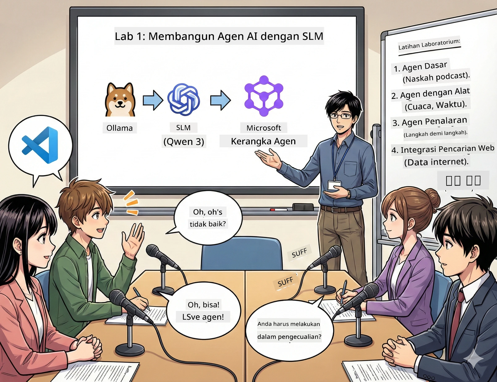

<!--
CO_OP_TRANSLATOR_METADATA:
{
  "original_hash": "21779ce57b388adecb26881a35d9cbcf",
  "translation_date": "2026-01-05T16:56:33+00:00",
  "source_file": "WorkshopForAgentic/translation/zh-cn/01.BuildAIAgentWithSLM.md",
  "language_code": "id"
}
-->
# Bab 1: Kenali Asisten Peneliti AI Kamu 🤖

## Tantangan

Kamu sedang meluncurkan "Byte Masa Depan", podcast teknologi barumu. Episode pertama tentang terobosan AI terbaru, tapi kamu hanya punya 24 jam untuk:
1. Meneliti topik
2. Menemukan sumber terpercaya
3. Menulis skrip yang menarik
4. Membuatnya terdengar alami

**Plot twist**: Kamu tidak harus melakukannya sendiri. Kamu akan membangun asisten AI pertamamu, yang dapat membantu menyelesaikan semuanya. Mari kita panggil dia Alex — rekan penelitian yang tidak pernah lelah, tak pernah perlu tidur.

## Mengapa Memilih Model Bahasa Kecil? (Spoiler: Mereka Hebat)

Bayangkan model bahasa kecil (SLM) sebagai AI pribadi yang berjalan di *komputermu*. Tidak ada cloud, tidak ada biaya bulanan, tidak ada berbagi data mencurigakan.

**Kenapa SLM sangat 🔥:**
- **🏠 Berjalan di mesinmu**: laptop, desktop, bahkan Raspberry Pi berdaya tinggi
- **💸 Bebas biaya berkelanjutan**: tidak ada biaya API yang memakan uang saku
- **🔒 Privasi prioritas**: datamu tidak pernah keluar dari perangkatmu
- **⚡ Cepat seperti kilat**: tanpa latensi jaringan, respons instan
- **🪦 Ringan**: 1-10 miliar parameter vs model besar dengan 100+ miliar+

**SLM populer**: Qwen 3, Phi-4, Gemma 3 (workshop ini menggunakan Qwen)

## Peralatan Kamu

### Ollama: Pengelola Model AI Kamu

[Ollama](https://ollama.com/) seperti Steam untuk model AI. Download, jalankan, dan kelola model dengan perintah sederhana.

**Yang keren tentang Ollama:**
- Download dan jalankan model apa saja dengan satu perintah
- Mendukung Mac, Windows, Linux
- Otomatis memanfaatkan GPU jika ada
- Sangat hemat memori

### Microsoft Agent Framework: Tempat Terjadinya Keajaiban

[Microsoft Agent Framework](https://github.com/microsoft/agent-framework) adalah taman bermain untuk membangun agen AI, yang bisa:

- 💬 Mengobrol dan mengingat apa yang kalian bicarakan
- 🛠️ Menggunakan alat khusus (seperti mencari di web atau cek cuaca)
- 🧠 Berpikir secara bertahap menyelesaikan masalah rumit
- 🤝 Bekerja sebagai tim dengan agen lain
- 🔌 Terhubung ke berbagai penyedia AI (OpenAI, Ollama, Azure)

**Modul pembangun:**
- **Agent (Agen)**: asisten AI dengan tugas spesifik
- **Tools (Alat)**: kemampuan khusus yang kamu berikan
- **Memory (Memori)**: agar mereka tidak lupa percakapan
- **Reasoning (Penalaran)**: mengajarkan mereka berpikir, bukan hanya merespons

## Montase Latihan Kamu: 4 Tugas

### Tugas 1: Buat Agen Pertamamu

📓 [Buka Notebook](../../code/01.BasicAgent/00.BasicAgent-agent.ipynb)

**Tugas**: Bangun Alex, AI penulis skrip podcast-mu. Alex perlu membuat dialog dua host membahas isu teknologi.

**Yang akan kamu pelajari:**
- Cara membangunkan agen AI (lebih mudah daripada bangun Senin pagi)
- Memberikan kepribadian dan instruksi
- Membuatnya menghasilkan skrip podcast yang autentik
- Memahami balasan yang diberikan

**Syarat kemenangan**: Alex membuat skrip untuk episode percobaan "Byte Masa Depan" tentang AI! 🎯

### Tugas 2: Beri Alex Superpower (Alat!)

📓 [Buka Notebook](../../code/01.BasicAgent/01.BasicAgent-tools.ipynb)

**Tugas**: Alex pintar, tapi tidak tahu cuaca hari ini atau jam berapa. Mari kita berikan alat untuk menyelesaikan ini!

**Yang akan kamu pelajari:**
- Membuat fungsi Python khusus sebagai "alat"
- Membuat Alex memilih *kapan* menggunakan alat mana
- Melihat bagaimana dia menyelesaikan masalah sendiri
- Menggabungkan beberapa alat untuk tugas kompleks

**Syarat kemenangan**: Tanyakan "Cuaca di Tokyo bagaimana?" dan Alex akan cari jawabannya sendiri! ☁️

### Tugas 3: Ajari Alex Berpikir

📓 [Buka Notebook](../../code/01.BasicAgent/02.BasicAgent-reasoning.ipynb)

**Tugas**: Tampilkan proses kerja Alex. Saat menyelesaikan masalah, kamu ingin melihat *bagaimana* cara dia berpikir, bukan cuma jawabannya.

**Yang akan kamu pelajari:**
- Mengaktifkan "mode penalaran" (seperti menunjukkan kerja matematikamu)
- Melihat tahap demi tahap proses pikir Alex
- Memahami prompt rantai pemikiran
- Debug saat Alex bingung

**Syarat kemenangan**: Tanyakan soal matematika sulit dan lihat Alex berpikir! 🧠

### Tugas 4: Sambungkan Alex ke Internet

📓 [Buka Notebook](../../code/01.BasicAgent/03.BasicAgent-websearch.ipynb)

**Tugas**: Pengetahuan Alex punya batas waktu. Mari sambungkan ke internet untuk info real-time!

**Yang akan kamu pelajari:**
- Membuat alat pencarian web kustom
- Integrasi API eksternal
- Menangani error jaringan dengan elegan
- Mendapatkan info di luar data pelatihan Alex

**Syarat kemenangan**: Tanyakan berita teknologi hari ini dan dapatkan hasil terbaru! 📰

## Sebelum Mulai 🚀

**Perlengkapan wajib**:
- Python 3.10+ terpasang
- Ollama sedang berjalan (cek dengan `ollama --version`)
- VS Code dengan ekstensi Python
- Minimal 8GB RAM (disarankan 16GB untuk pengalaman lancar)

## Urutan Tugas

Selesaikan notebook sesuai urutan untuk pengalaman lengkap:

1. [00.BasicAgent-agent.ipynb](../../code/01.BasicAgent/00.BasicAgent-agent.ipynb) — Kenali Alex (agen pertamamu)
2. [01.BasicAgent-tools.ipynb](../../code/01.BasicAgent/01.BasicAgent-tools.ipynb) — Waktunya upgrade!
3. [02.BasicAgent-reasoning.ipynb](../../code/01.BasicAgent/02.BasicAgent-reasoning.ipynb) — Ajari Alex berpikir
4. [03.BasicAgent-websearch.ipynb](../../code/01.BasicAgent/03.BasicAgent-websearch.ipynb) — Buka akses internet!

## Apa yang Akan Kamu Kuasai

Setelah Bab 1, kamu akan bisa:

- ✅ Menjalankan model AI di perangkatmu sendiri (tanpa cloud!)
- ✅ Membangun agen dengan kepribadian dan keahlian khusus
- ✅ Memberi agen alat untuk menyelesaikan masalah nyata
- ✅ Membuat agen menunjukkan proses penalaran mereka
- ✅ Menyambungkan agen ke sumber data eksternal
- ✅ Debug saat ada masalah

## Saat Ada Masalah (dan Cara Memperbaikinya) 🔧

### "Alex tidak bisa dimuat! Memori tidak cukup!"
**Solusi**: Komputermu kelebihan beban. Coba tutup aplikasi lain, atau beralih ke model yang lebih kecil. 8GB RAM adalah batas minimum.

### "Alex terlalu lambat"
**Solusi**: Aktifkan akselerasi GPU di pengaturan Ollama. Atau kurangi ukuran jendela konteks. Mode kecepatan tinggi aktif! 🏎️

### "Alat tidak bekerja!"
**Solusi**: Periksa tanda tangan fungsimu dengan teliti. Alex butuh petunjuk tipe yang benar untuk memahami fungsi alat. Anggap saja kamu memberikan instruksi yang jelas.

## Tautan Berguna 🔗

- [Dokumentasi Agent Framework](https://github.com/microsoft/agent-framework) — panduan resmi dan contoh
- [Perpustakaan Model Ollama](https://ollama.com/library) — jelajahi semua model tersedia
- [Model Qwen](https://ollama.com/library/qwen3) — kenali otak asisten AI-mu
- [Contoh Kode](https://github.com/microsoft/agent-framework/tree/main/python/samples) — curi inspirasi dari sini

## Langkah Selanjutnya: Bab 2 🎬

Kamu punya satu agen. Tapi bagaimana jika kamu punya *tim* agen yang bekerja bersama? Di Bab 2, kamu akan membangun tim produksi podcast lengkap:
- **Agen Riset**: menemukan sumber terbaik
- **Agen Penulis**: membuat skrip sempurna
- **Editor (kamu!)**: menyetujui atau meminta revisi

Mari ciptakan keajaiban AI! → [Bab 2: Membangun Tim Produksi Kamu](02.AIAgentOrchestrationAndWorkflows.md)

---

**Kehabisan ide?** Tanyakan selama workshop. Kita belajar bersama! 🙌

---

<!-- CO-OP TRANSLATOR DISCLAIMER START -->
**Penafian**:  
Dokumen ini telah diterjemahkan menggunakan layanan terjemahan AI [Co-op Translator](https://github.com/Azure/co-op-translator). Meskipun kami berusaha memberikan terjemahan yang akurat, harap diingat bahwa terjemahan otomatis mungkin mengandung kesalahan atau ketidakakuratan. Dokumen asli dalam bahasa aslinya harus dianggap sebagai sumber yang sah dan utama. Untuk informasi penting, disarankan menggunakan terjemahan profesional oleh penerjemah manusia. Kami tidak bertanggung jawab atas kesalahpahaman atau penafsiran yang salah yang timbul dari penggunaan terjemahan ini.
<!-- CO-OP TRANSLATOR DISCLAIMER END -->