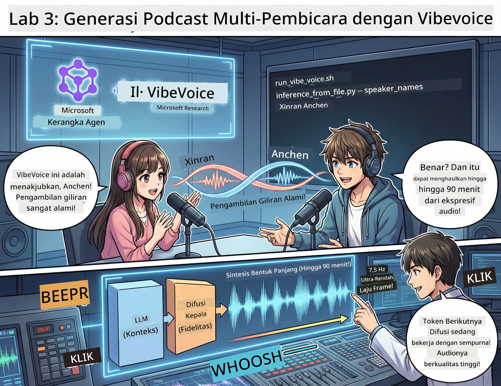

<!--
CO_OP_TRANSLATOR_METADATA:
{
  "original_hash": "d5c8bb53a007e77e7f8afe3067e64c55",
  "translation_date": "2026-01-05T16:07:18+00:00",
  "source_file": "WorkshopForAgentic/translation/zh-cn/03.Multi-SpeakerPodcastGenerationWithVibeVoice.md",
  "language_code": "id"
}
-->
# 幕 Ketiga: Hidupkan Podcast Anda 🎤



## Klimaks

Anda sudah meneliti topik. Anda sudah menulis skrip. Sekarang saatnya mempercantik: ubah teks Anda menjadi audio podcast asli dengan suara yang realistis!

Masuki **VibeVoice** —— sihir TTS (Text-to-Speech) open source dari Microsoft Research, yang membuat:
- 🎭 Percakapan alami dan mengalir
- 👥 Banyak pembicara (hingga 4 orang!)
- ⏱️ Audio format panjang (hingga 90 menit!)
- 🎵 Ekspresif dan penuh nuansa (bukan suara robot!)

Inilah teknologi di balik sintetisnya podcast. Mari kita buat milik Anda!

## Apa itu VibeVoice? (Hal Keren)

VibeVoice adalah hadiah dari Microsoft Research untuk dunia. Dirancang khusus untuk audio percakapan bergaya podcast.

### Mengapa ini keren 🔥

* **⏱️ Percakapan maraton**: hasilkan suara berkelanjutan hingga 90 menit (satu episode podcast penuh!)
* **👥 Sulap multi-pembicara**: hingga 4 suara berbeda dengan kepribadian yang konsisten
* **⚡ Super efisien**: menggunakan frame rate sangat rendah 7,5 Hz untuk menghemat komputasi
* **🧠 Audio pintar**: menggabungkan LLM (pemahaman konteks) dan model difusi (menghasilkan audio realistis)
* **🎭 Alami dan mengalir**: otomatis mengatur giliran bicara, jeda, dan ritme percakapan

**Intinya**: VibeVoice bukan hanya membacakan skrip Anda — ia *memerankan* seperti manusia berbicara.

---

## Sebelum Mulai 🚀

**Yang Anda butuhkan**:

* 🐍 **Python 3.10+** (Anda sudah punya dari Akta Pertama dan Kedua)
* 🚀 **uv** (manajer paket Python super cepat — akan kita pasang)
* 📝 **Skrip Anda**: file `podcast.txt` dari Akta Kedua (`../03.Application/`)

**Tip pro**: Langkah ini membutuhkan koneksi internet yang baik untuk mengunduh model pra-latih. Nikmati kopi! ☕

---

## Mari Mulai! Cara Mudah 🎬

Kita buat ini sangat sederhana. Satu skrip shell yang melakukan semuanya.

### Proses

1. **Beri izin eksekusi**:
```bash
chmod +x run_vibe_voice.sh
```

2. **Jalankan skrip**:
```bash
./run_vibe_voice.sh
```

3. **Tunggu keajaiban terjadi** (jalan pertama bisa beberapa menit)

### Apa yang terjadi di balik layar 🎭

Skrip ini pada dasarnya adalah insinyur audio otomatis Anda:

1. **📥 Unduh VibeVoice**: clone repo resmi dari GitHub
2. **📦 Pasang dependensi**: instal paket dengan `uv pip` dalam sekejap
3. **🎬 Hasilkan audio**: jalankan skrip inferensi dengan:
   * `--model_path`: model VibeVoice-7B pra-latih
   * `--txt_path`: skrip `podcast.txt` Anda
   * `--speaker_names`: tetapkan suara (default: Xinran dan Anchen)

**Hasilnya**: skrip Anda berubah menjadi episode podcast nyata! 🎉

---

## Tugas Anda 🎯

Mari buat ini menyenangkan:

### Tugas 1: Buat Konten
Edit `../03.Application/podcast.txt` menjadi percakapan antara dua orang. Tentang teknologi, hobi, apa saja! Pastikan itu berbentuk dialog.

**Contoh format**:
```
说话人 1：嘿！你听说新的 AI 模型了吗？
说话人 2：不会吧！告诉我更多！
说话人 1：它叫...
```

### Tugas 2: Hasilkan audio
Jalankan skrip dan lihat keajaiban. Kali pertama butuh waktu lebih lama (mengunduh model).

### Tugas 3: Dengarkan & Analisa
- Apakah terasa alami?
- Apakah suaranya berbeda tiap pembicara?
- Apakah giliran bicara mengalir lancar?
- Adakah bagian yang terdengar seperti robot?

### Tugas 4: Eksperimen (untuk yang berani)
Edit `run_vibe_voice.sh` dan ubah `--speaker_names` untuk mencoba kombinasi suara berbeda. VibeVoice punya banyak suara pra-latih!

**Tantangan bonus**: coba percakapan dengan 3 pembicara! 🎆

---

## Pelajari Lebih Lanjut 📚

* **🏠 Beranda proyek**: [Situs resmi VibeVoice](https://microsoft.github.io/VibeVoice/)
* **🤗 Model pra-latih**: [Hugging Face - VibeVoice-7B](https://huggingface.co/vibevoice/VibeVoice-7B)
* **📖 Makalah riset**: pelajari teknologi mendalam (jika berminat)

> **⚠️ Peringatan AI bertanggung jawab**: VibeVoice kuat sekali. Gunakan dengan etika! Jangan buat deepfake atau konten menyesatkan. Buat hal keren yang membantu orang. 🙏

---

## 🏆 Selamat! Anda berhasil!

Anda baru saja menyelesaikan keseluruhan proses:
1. ✅ **Akta Pertama**: membangun agen AI khusus
2. ✅ **Akta Kedua**: mengorkestrasi workflow multi-agen
3. ✅ **Akta Ketiga**: menghasilkan audio podcast yang nyata

**Anda kini memiliki**:
- Asisten riset AI yang efektif
- Workflow produksi podcast lengkap
- File audio nyata yang bisa Anda bagikan

### Langkah berikutnya? 🚀

**Rilis podcast Anda!**
- Unggah ke platform podcast
- Bagikan di media sosial
- Iterasi dan perbaiki

**Terus bangun!**
- Coba tema berbeda
- Eksperimen dengan lebih banyak pembicara
- Tambahkan musik latar
- Buat antarmuka web
- Otomatiskan seluruh proses

**Bagikan karya Anda!**
Tag kami! Tunjukkan ke dunia apa yang sudah Anda buat. Revolusi podcast AI dimulai dari Anda. 🎙️

---

**Ada pertanyaan? Ide? Cerita sukses?** Tulis di chat workshop!

**Selamat datang di masa depan pembuatan konten.** 🌟

---

<!-- CO-OP TRANSLATOR DISCLAIMER START -->
**Penafian**:  
Dokumen ini telah diterjemahkan menggunakan layanan terjemahan AI [Co-op Translator](https://github.com/Azure/co-op-translator). Meskipun kami berupaya untuk mendapatkan akurasi, harap diingat bahwa terjemahan otomatis mungkin mengandung kesalahan atau ketidakakuratan. Dokumen asli dalam bahasa aslinya harus dianggap sebagai sumber yang otoritatif. Untuk informasi penting, disarankan menggunakan terjemahan profesional oleh manusia. Kami tidak bertanggung jawab atas kesalahpahaman atau interpretasi yang timbul dari penggunaan terjemahan ini.
<!-- CO-OP TRANSLATOR DISCLAIMER END -->