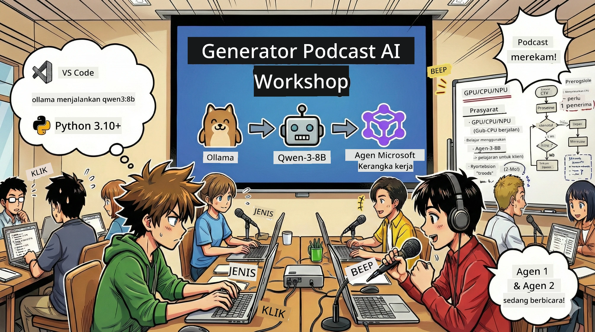

<!--
CO_OP_TRANSLATOR_METADATA:
{
  "original_hash": "aa775a734bda4590ecbe3a94a3b62197",
  "translation_date": "2026-01-05T17:49:16+00:00",
  "source_file": "WorkshopForAgentic/translation/zh-cn/README.md",
  "language_code": "id"
}
-->
# 🎙️ Workshop Studio Podcast AI



## Tugas Anda

Selamat datang di **Studio Podcast AI**! Anda akan meluncurkan podcast teknologi Anda sendiri, "Byte of the Future" — tapi ada twist: Anda akan membangun tim produksi yang digerakkan oleh AI untuk membantu Anda membuatnya. Tidak perlu lagi riset tanpa henti, penulisan naskah, dan pengeditan audio. Sebaliknya, Anda akan menjadi produser podcast dengan kekuatan super AI melalui pemrograman.

## Latar Cerita

Bayangkan ini: Anda dan teman ingin memulai podcast tentang tren teknologi paling keren, tetapi semua orang sibuk belajar, bekerja, atau menjalani hidup. Bagaimana jika Anda bisa membangun tim agen AI pintar yang mengerjakan pekerjaan berat? Satu agen bertugas meneliti topik, satu lagi menulis naskah menarik, yang ketiga mengubah teks menjadi dialog alami yang lancar. Kedengarannya seperti fiksi ilmiah? Mari kita wujudkan.

## Apa yang Akan Anda Pelajari

Di akhir workshop ini, Anda akan tahu cara:
- 🤖 Menyebarkan model AI lokal Anda sendiri (tanpa biaya API, tanpa ketergantungan cloud!)
- 🔧 Membangun agen AI profesional yang bekerja sama secara nyata
- 🎬 Membuat proses produksi podcast lengkap dari ide hingga audio

## Perjalanan Anda: Tiga Babak

Seperti cerita bagus lainnya, kita punya tiga babak. Setiap babak secara bertahap membangun Studio Podcast AI Anda:

| Babak | Tugas Anda | Apa yang Terjadi | Kemampuan yang Dibuka |
|---------|-----------|--------------|----------------|
| **Babak Pertama** | [Kenali Asisten AI Anda](01.BuildAIAgentWithSLM.md) | Anda akan menemukan cara membuat agen AI yang bisa mengobrol, mencari di web, bahkan memecahkan masalah. Bayangkan mereka sebagai magang riset yang tidak pernah tidur. | 🎯 Membangun agen pertama Anda<br>🛠️ Memberinya kekuatan super (alat!)<br>🧠 Mengajarinya berpikir<br>🌐 Menghubungkan ke internet |
| **Babak Kedua** | [Bangun Tim Produksi Anda](02.AIAgentOrchestrationAndWorkflows.md) | Sekarang jadi seru! Anda akan mengorkestrasi banyak agen AI bekerja sama seperti tim podcast sungguhan. Satu riset, satu menulis, Anda menyetujui — kerja tim mewujudkan mimpi. | 🎭 Koordinasi banyak agen<br>🔄 Membuat workflow persetujuan<br>🖥️ Menguji dengan antarmuka DevUI<br>✋ Mempertahankan kendali manusia |
| **Babak Ketiga** | [Hidupkan Podcast Anda](03.Multi-SpeakerPodcastGenerationWithVibeVoice.md) | Klimaks! Ubah naskah teks Anda menjadi audio podcast nyata dengan suara realistis dan dialog alami. Podcast "Byte of the Future" Anda siap dirilis! | 🎤 Sulap teks ke suara<br>👥 Suara banyak pembicara<br>⏱️ Audio berdurasi panjang<br>🚀 Otomatis sepenuhnya |

Setiap babak membuka kemampuan baru. Jika Anda berani, bisa loncat-loncat, tapi kami sarankan mengikuti urutannya!

## Persyaratan Lingkungan

Workshop ini mendukung berbagai jenis hardware:
- **CPU**: Cocok untuk testing dan penggunaan skala kecil
- **GPU**: Direkomendasikan untuk produksi, mempercepat inferensi dengan signifikan
- **NPU**: Mendukung akselerasi unit pemrosesan neural generasi berikutnya

## Apa yang Anda Butuhkan

### Daftar Perangkat Lunak ✅
- **Python 3.10+** (bahasa pemrograman Anda)
- **Ollama** (mesin menjalankan model AI lokal)
- **VS Code** (editor kode Anda)
- **Ekstensi Python** (membuat VS Code lebih pintar)
- **Git** (untuk mengambil kode)

### Pemeriksaan Hardware 💻
- **Bisakah saya menjalankannya?**: RAM 8GB, ruang kosong 10GB (bisa tapi agak lambat)
- **Konfigurasi ideal**: RAM 16GB+, GPU yang bagus (lancar jaya!)
- **Punya NPU?**: Lebih bagus lagi! Membuka performa generasi baru 🚀

## Membuat Studio Anda 🎬

### Langkah 1: Upgrade Python

Pastikan Anda memiliki Python 3.10 atau versi lebih baru:

```bash
python --version
# Harus menampilkan Python 3.10.x atau versi yang lebih tinggi
```

Belum punya Python? Dapatkan dari [python.org](https://python.org) — gratis!

### Langkah 2: Dapatkan Ollama (mesin model AI Anda)

Kunjungi [ollama.ai](https://ollama.ai) dan unduh Ollama untuk sistem operasi Anda. Bayangkan ini sebagai mesin menjalankan model AI secara lokal.

Cek apakah sudah siap:

```bash
ollama --version
```

### Langkah 3: Unduh Otak AI Anda 🧠

Saatnya mengambil model Qwen-3-8B (seperti mempekerjakan asisten AI pertama Anda):

```bash
ollama pull qwen3:8b
```

*Ini mungkin butuh beberapa menit. Waktu yang tepat untuk secangkir kopi! ☕*

### Langkah 4: Atur VS Code

Kalau belum punya, ambil [Visual Studio Code](https://code.visualstudio.com/). Ini editor kode terbaik (nolak debat 😄).

### Langkah 5: Ekstensi Python

Di VS Code:
1. Tekan `Ctrl+Shift+X` (Mac: `Cmd+Shift+X`)
2. Cari "Python"
3. Pasang ekstensi resmi dari Microsoft

### Langkah 6: Beres! 🎉

Serius, Anda sudah siap. Mari buat keajaiban AI!

### Langkah 7: Pasang Microsoft Agent Framework dan paket terkait 📦

Pasang semua dependensi workshop:

```bash
pip install -r ./Installations/requirements.txt -U
```

*Ini akan pasang Microsoft Agent Framework dan semua paket penting. Segelas kopi dulu — instalasi pertama kali bisa butuh waktu! ☕*

## Penjelasan Workshop

Struktur proyek yang rinci, langkah-langkah konfigurasi, dan cara menjalankan akan dijelaskan secara bertahap selama workshop.

## Pemecahan Masalah (Saat Ada Masalah) 🔧

### "Aduh, unduh modelnya lama banget!"
**Solusi**: Gunakan VPN atau konfigurasikan mirror Ollama. Kadang jaringan memang lemot.

### "Komputer saya hampir mati! RAM tidak cukup!"
**Solusi**: Ganti ke model yang lebih kecil atau atur `num_ctx` agar menggunakan RAM lebih sedikit. Anggap saja itu diet untuk AI Anda.

### "Bisakah saya memakai GPU supaya lebih cepat?"
**Solusi**: Ollama otomatis mendeteksi GPU! Pastikan driver GPU Anda terbaru. Peningkatan kecepatan gratis! 🏎️

## Sumber Daya Tambahan (Untuk Anda yang Penasaran) 📚

- [Dokumentasi Ollama](https://github.com/ollama/ollama) — Pelajari lebih dalam tentang model AI lokal
- [Microsoft Agent Framework](https://microsoft.github.io/autogen/) — Pelajari lebih lanjut tentang membangun tim agen
- [Info Model Qwen](https://qwenlm.github.io/) — Kenali otak asisten AI Anda

## Lisensi

Lisensi MIT — buat hal keren, bagikan, buat dunia lebih baik! 🌍

## Ingin Berkontribusi?

Menemukan bug? Punya ide? Kirim Issues atau PR! Kami suka semangat komunitas. ✨

---

<!-- CO-OP TRANSLATOR DISCLAIMER START -->
**Penafian**:
Dokumen ini telah diterjemahkan menggunakan layanan terjemahan AI [Co-op Translator](https://github.com/Azure/co-op-translator). Meskipun kami berusaha untuk memberikan terjemahan yang akurat, harap diingat bahwa terjemahan otomatis mungkin mengandung kesalahan atau ketidakakuratan. Dokumen asli dalam bahasa aslinya harus dianggap sebagai sumber yang sahih. Untuk informasi penting, disarankan menggunakan jasa penerjemah profesional manusia. Kami tidak bertanggung jawab atas kesalahpahaman atau salah tafsir yang timbul dari penggunaan terjemahan ini.
<!-- CO-OP TRANSLATOR DISCLAIMER END -->