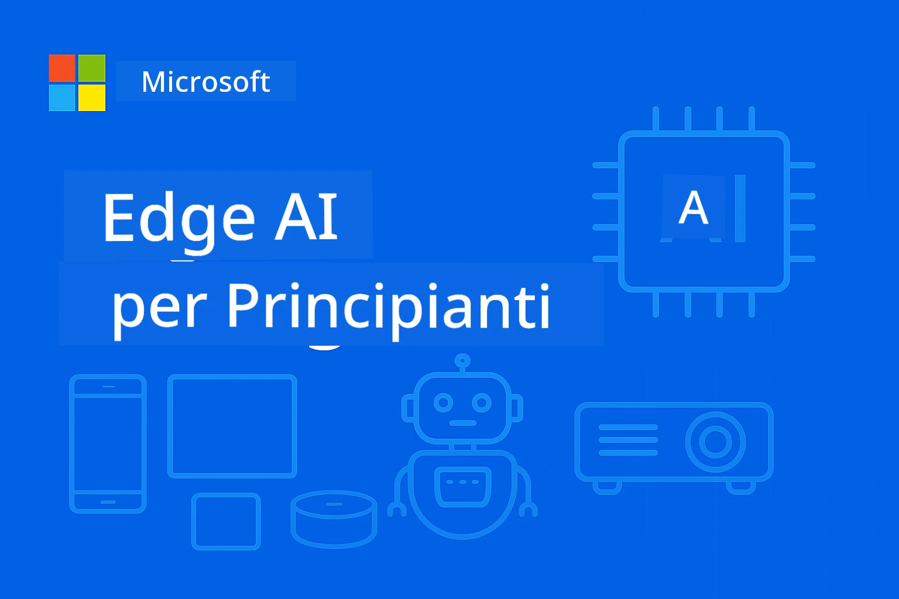

# EdgeAI per Principianti 




[](https://GitHub.com/microsoft/edgeai-for-beginners/graphs/contributors)
[](https://GitHub.com/microsoft/edgeai-for-beginners/issues)
[](https://GitHub.com/microsoft/edgeai-for-beginners/pulls)
[](http://makeapullrequest.com)

[](https://GitHub.com/microsoft/edgeai-for-beginners/watchers)
[](https://GitHub.com/microsoft/edgeai-for-beginners/fork)
[](https://GitHub.com/microsoft/edgeai-for-beginners/stargazers)


[](https://discord.gg/nTYy5BXMWG)

Segui questi passaggi per iniziare a utilizzare queste risorse:

1. **Forka il Repository**: Clicca [](https://GitHub.com/microsoft/edgeai-for-beginners/fork)
2. **Clona il Repository**:   `git clone https://github.com/microsoft/edgeai-for-beginners.git`
3. [**Unisciti al Discord Azure AI Foundry e incontra esperti e colleghi sviluppatori**](https://discord.com/invite/ByRwuEEgH4)


### 🌐 Supporto Multilingue

#### Supportato tramite GitHub Action (Automatizzato e Sempre Aggiornato)

<!-- CO-OP TRANSLATOR LANGUAGES TABLE START -->
[Arabo](../ar/README.md) | [Bengalese](../bn/README.md) | [Bulgaro](../bg/README.md) | [Birmano (Myanmar)](../my/README.md) | [Cinese (semplificato)](../zh-CN/README.md) | [Cinese (tradizionale, Hong Kong)](../zh-HK/README.md) | [Cinese (tradizionale, Macao)](../zh-MO/README.md) | [Cinese (tradizionale, Taiwan)](../zh-TW/README.md) | [Croato](../hr/README.md) | [Ceco](../cs/README.md) | [Danese](../da/README.md) | [Olandese](../nl/README.md) | [Estone](../et/README.md) | [Finlandese](../fi/README.md) | [Francese](../fr/README.md) | [Tedesco](../de/README.md) | [Greco](../el/README.md) | [Ebraico](../he/README.md) | [Hindi](../hi/README.md) | [Ungherese](../hu/README.md) | [Indonesiano](../id/README.md) | [Italiano](./README.md) | [Giapponese](../ja/README.md) | [Kannada](../kn/README.md) | [Coreano](../ko/README.md) | [Lituano](../lt/README.md) | [Malese](../ms/README.md) | [Malayalam](../ml/README.md) | [Marathi](../mr/README.md) | [Nepalese](../ne/README.md) | [Pidgin Nigeriano](../pcm/README.md) | [Norvegese](../no/README.md) | [Persiano (Farsi)](../fa/README.md) | [Polacco](../pl/README.md) | [Portoghese (Brasile)](../pt-BR/README.md) | [Portoghese (Portogallo)](../pt-PT/README.md) | [Punjabi (Gurmukhi)](../pa/README.md) | [Rumeno](../ro/README.md) | [Russo](../ru/README.md) | [Serbo (Cirillico)](../sr/README.md) | [Slovacco](../sk/README.md) | [Sloveno](../sl/README.md) | [Spagnolo](../es/README.md) | [Swahili](../sw/README.md) | [Svedese](../sv/README.md) | [Tagalog (Filippino)](../tl/README.md) | [Tamil](../ta/README.md) | [Telugu](../te/README.md) | [Thailandese](../th/README.md) | [Turco](../tr/README.md) | [Ucraino](../uk/README.md) | [Urdu](../ur/README.md) | [Vietnamita](../vi/README.md)

> **Preferisci Clonare Localmente?**

> Questo repository include più di 50 traduzioni di lingue che aumentano significativamente la dimensione del download. Per clonare senza traduzioni, usa lo sparse checkout:
> ```bash
> git clone --filter=blob:none --sparse https://github.com/microsoft/edgeai-for-beginners.git
> cd edgeai-for-beginners
> git sparse-checkout set --no-cone '/*' '!translations' '!translated_images'
> ```
> Questo ti offre tutto il necessario per completare il corso con un download molto più veloce.
<!-- CO-OP TRANSLATOR LANGUAGES TABLE END -->

**Se desideri aggiungere ulteriori lingue di traduzione, quelle supportate sono elencate [qui](https://github.com/Azure/co-op-translator/blob/main/getting_started/supported-languages.md)**
## Introduzione

Benvenuto a **EdgeAI per Principianti** – il tuo percorso completo nel mondo trasformativo dell’Intelligenza Artificiale ai margini (Edge). Questo corso colma il divario tra potenti capacità AI e il dispiegamento pratico e reale su dispositivi edge, permettendoti di sfruttare il potenziale dell’AI direttamente dove i dati sono generati e le decisioni devono essere prese.

### Cosa Imparerai

Questo corso ti guida dai concetti fondamentali fino a implementazioni pronte per la produzione, coprendo:
- **Piccoli Modelli Linguistici (SLM)** ottimizzati per il dispiegamento edge
- **Ottimizzazione hardware-aware** su diverse piattaforme
- **Inferenza in tempo reale** con capacità di preservazione della privacy
- **Strategie di dispiegamento in produzione** per applicazioni aziendali

### Perché EdgeAI è Importante

Edge AI rappresenta un cambiamento di paradigma che affronta sfide moderne critiche:
- **Privacy e Sicurezza**: elabora dati sensibili localmente senza esposizione al cloud
- **Performance in tempo reale**: elimina la latenza della rete per applicazioni critiche
- **Efficienza dei costi**: riduce larghezza di banda e spese di cloud computing
- **Operazioni resilienti**: mantiene la funzionalità durante interruzioni di rete
- **Conformità normativa**: soddisfa i requisiti di sovranità dei dati

### Edge AI

Edge AI significa eseguire algoritmi AI e modelli linguistici localmente sull’hardware, vicino al luogo in cui i dati vengono generati, senza fare affidamento su risorse cloud per l’inferenza. Riduce la latenza, migliora la privacy e consente decisioni in tempo reale.

### Principi Fondamentali:
- **Inferenza on-device**: i modelli AI girano su dispositivi edge (telefoni, router, microcontrollori, PC industriali)
- **Capacità offline**: funzioni senza connettività internet persistente
- **Bassa latenza**: risposte immediate adatte a sistemi in tempo reale
- **Sovranità dei dati**: mantiene i dati sensibili localmente, migliorando sicurezza e conformità

### Piccoli Modelli Linguistici (SLM)

SLM come Phi-4, Mistral-7B e Gemma sono versioni ottimizzate di grandi LLM—addestrate o distillate per:
- **Ridotto utilizzo di memoria**: uso efficiente della memoria limitata nei dispositivi edge
- **Minor richiesta di calcolo**: ottimizzato per CPU e GPU edge
- **Tempi di avvio più rapidi**: inizializzazione veloce per applicazioni reattive

Sbloccano potenti capacità NLP rispettando i vincoli di:
- **Sistemi embedded**: dispositivi IoT e controller industriali
- **Dispositivi mobili**: smartphone e tablet con capacità offline
- **Dispositivi IoT**: sensori e dispositivi smart con risorse limitate
- **Server edge**: unità di elaborazione locali con risorse GPU limitate
- **Personal Computer**: scenari di dispiegamento desktop e laptop

## Moduli del Corso & Navigazione

| Modulo | Argomento | Area di Focus | Contenuto Chiave | Livello | Durata |
|--------|-----------|---------------|------------------|---------|--------|
| [📖 00 ](./introduction.md) | [Introduzione a EdgeAI](./introduction.md) | Fondamenti & Contesto | Panoramica EdgeAI • Applicazioni industriali • Introduzione ai SLM • Obiettivi di apprendimento | Principiante | 1-2 ore |
| [📚 01](../../Module01) | [Fondamenti di EdgeAI](./Module01/README.md) | Confronto Cloud vs Edge AI | Fondamenti EdgeAI • Studi di casi reali • Guida all’implementazione • Dispiegamento Edge | Principiante | 3-4 ore |
| [🧠 02](../../Module02) | [Fondamenti di Modelli SLM](./Module02/README.md) | Famiglie di modelli & architettura | Famiglia Phi • Famiglia Qwen • Famiglia Gemma • BitNET • μModel • Phi-Silica | Principiante | 4-5 ore |
| [🚀 03](../../Module03) | [Pratica di Dispiegamento SLM](./Module03/README.md) | Dispiegamento locale & cloud | Apprendimento avanzato • Ambiente locale • Dispiegamento cloud | Intermedio | 4-5 ore |
| [⚙️ 04](../../Module04) | [Kit di Ottimizzazione del Modello](./Module04/README.md) | Ottimizzazione cross-platform | Introduzione • Llama.cpp • Microsoft Olive • OpenVINO • Apple MLX • Sintesi del workflow | Intermedio | 5-6 ore |
| [🔧 05](../../Module05) | [Produzione SLMOps](./Module05/README.md) | Operazioni in produzione | Introduzione a SLMOps • Distillazione modello • Fine-tuning • Dispiegamento in produzione | Avanzato | 5-6 ore |
| [🤖 06](../../Module06) | [Agenti AI & Chiamata Funzioni](./Module06/README.md) | Framework agenti & MCP | Introduzione agli agenti • Chiamata funzioni • Protocollo contesto modello | Avanzato | 4-5 ore |
| [💻 07](../../Module07) | [Implementazione Piattaforma](./Module07/README.md) | Esempi cross-platform | Toolkit AI • Foundry Local • Sviluppo Windows | Avanzato | 3-4 ore |
| [🏭 08](../../Module08) | [Toolkit Foundry Local](./Module08/README.md) | Esempi pronti per produzione | Applicazioni di esempio (vedi dettagli sotto) | Esperto | 8-10 ore |

### 🏭 **Modulo 08: Applicazioni di Esempio**

- [01: REST Chat Avvio Rapido](./Module08/samples/01/README.md)
- [02: Integrazione SDK OpenAI](./Module08/samples/02/README.md)
- [03: Scoperta Modelli & Benchmarking](./Module08/samples/03/README.md)
- [04: Applicazione Chainlit RAG](./Module08/samples/04/README.md)
- [05: Orchestrazione Multi-Agente](./Module08/samples/05/README.md)
- [06: Router Modelli-as-Tools](./Module08/samples/06/README.md)
- [07: Client API Diretto](./Module08/samples/07/README.md)
- [08: App Chat Windows 11](./Module08/samples/08/README.md)
- [09: Sistema Multi-Agente Avanzato](./Module08/samples/09/README.md)
- [10: Framework Foundry Tools](./Module08/samples/10/README.md)

### 🎓 **Workshop: Percorso di Apprendimento Pratico**

Materiali completi per workshop pratici con implementazioni pronte per la produzione:

- **[Guida al Workshop](./Workshop/Readme.md)** - Obiettivi di apprendimento completi, risultati e navigazione risorse
- **Esempi Python** (6 sessioni) - Aggiornati con best practice, gestione errori e documentazione completa
- **Jupyter Notebooks** (8 interattivi) - Tutorial passo-passo con benchmark e monitoraggio delle performance
- **Guide Sessioni** - Guide dettagliate in markdown per ogni sessione del workshop
- **Strumenti di Validazione** - Script per verificare la qualità del codice e fare test rapidi

**Cosa Costruirai:**
- Applicazioni di chat AI locali con supporto streaming
- Pipeline RAG con valutazione qualità (RAGAS)
- Strumenti di benchmarking e comparazione multi-modello
- Sistemi di orchestrazione multi-agente
- Routing intelligente modello con selezione basata su attività

### 🎙️ **Workshop For Agentic: Pratico - Lo Studio Podcast AI**

Costruisci una pipeline di produzione podcast alimentata da AI da zero! Questo workshop immersivo ti insegna a creare un sistema multi-agente completo che trasforma idee in episodi podcast professionali.
**[🎬 Inizia il Workshop AI Podcast Studio](./WorkshopForAgentic/README.md)**

**La tua missione**: Lancia "Future Bytes" — un podcast tecnologico interamente alimentato da agenti AI che costruirai tu stesso. Nessuna dipendenza dal cloud, nessun costo API — tutto funziona localmente sulla tua macchina.

**Cosa rende questo unico:**
- **🤖 Vera orchestrazione multi-agente** - Costruisci agenti AI specializzati che ricercano, scrivono e producono audio
- **🎯 Pipeline di produzione completa** - Dalla selezione del tema fino all'output audio finale del podcast
- **💻 Distribuzione 100% locale** - Usa Ollama e modelli locali (Qwen-3-8B) per privacy e controllo totale
- **🎤 Integrazione Text-to-Speech** - Trasforma gli script in conversazioni multi-speaker dal suono naturale
- **✋ Flussi di lavoro umani nel ciclo** - Gate di approvazione per garantire qualità mantenendo l’automazione

**Viaggio di apprendimento in tre atti:**

| Atto | Focus | Competenze chiave | Durata |
|-----|-------|------------|----------|
| **[Atto 1: Incontra i tuoi assistenti AI](./WorkshopForAgentic/md/01.BuildAIAgentWithSLM.md)** | Costruisci il tuo primo agente AI | Integrazione strumenti • Ricerca web • Problem-solving • Ragionamento agentico | 2-3 ore |
| **[Atto 2: Assembla il tuo team di produzione](./WorkshopForAgentic/md/02.AIAgentOrchestrationAndWorkflows.md)** | Orchestrare più agenti | Coordinamento team • Flussi di approvazione • Interfaccia DevUI • Supervisione umana | 3-4 ore |
| **[Atto 3: Dai vita al tuo podcast](./WorkshopForAgentic/md/03.Multi-SpeakerPodcastGenerationWithVibeVoice.md)** | Genera l’audio del podcast | Text-to-speech • Sintesi multi-speaker • Audio long-form • Automazione completa | 2-3 ore |

**Tecnologie usate:**
- **Microsoft Agent Framework** - Orchestrazione e coordinazione multi-agente
- **Ollama** - Runtime locale per modelli AI (nessun cloud richiesto)
- **Qwen-3-8B** - Modello linguistico open-source ottimizzato per task agentici
- **API Text-to-Speech** - Sintesi vocale naturale per la generazione del podcast

**Supporto hardware:**
- ✅ **Modalità CPU** - Funziona su qualsiasi computer moderno (consigliati 8GB+ di RAM)
- 🚀 **Accelerazione GPU** - Inferenza significativamente più veloce con GPU NVIDIA/AMD
- ⚡ **Supporto NPU** - Accelerazione tramite unità di elaborazione neurale di nuova generazione

**Perfetto per:**
- Sviluppatori che apprendono sistemi AI multi-agente
- Chiunque sia interessato all’automazione AI e ai flussi di lavoro
- Creatori di contenuti che esplorano la produzione assistita da AI
- Studenti che studiano schemi pratici di orchestrazione AI

**Inizia a costruire**: [🎙️ Il Workshop AI Podcast Studio →](./WorkshopForAgentic/README.md)

### 📊 **Sommario del percorso di apprendimento**
- **Durata totale**: 36-45 ore
- **Percorso principiante**: Moduli 01-02 (7-9 ore)  
- **Percorso intermedio**: Moduli 03-04 (9-11 ore)
- **Percorso avanzato**: Moduli 05-07 (12-15 ore)
- **Percorso esperto**: Modulo 08 (8-10 ore)

## Cosa costruirai

### 🎯 Competenze principali
- **Architettura Edge AI**: Progetta sistemi AI local-first con integrazione cloud
- **Ottimizzazione modelli**: Quantizza e comprimi modelli per distribuzione edge (incremento velocità 85%, riduzione dimensione 75%)
- **Distribuzione multipiattaforma**: Windows, mobile, embedded e sistemi ibridi cloud-edge
- **Operazioni di produzione**: Monitoraggio, scalabilità e manutenzione Edge AI in produzione

### 🏗️ Progetti pratici
- **Applicazioni chat locali Foundry**: Applicazione nativa Windows 11 con switching modelli
- **Sistemi multi-agente**: Coordinatore con agenti specialisti per flussi di lavoro complessi  
- **Applicazioni RAG**: Elaborazione locale documenti con ricerca vettoriale
- **Router modelli**: Selezione intelligente tra modelli basata su analisi task
- **Framework API**: Client di produzione con streaming e monitoraggio salute
- **Strumenti cross-platform**: Pattern integrazione LangChain/Semantic Kernel

### 🏢 Applicazioni industriali
**Manifatturiero** • **Sanità** • **Veicoli autonomi** • **Città intelligenti** • **App mobili**

## Avvio rapido

**Percorso di apprendimento raccomandato** (20-30 ore totali):

0. **📖 Introduzione** ([Introduction.md](./introduction.md)): Fondamenti EdgeAI + contesto industriale + schema di apprendimento
1. **📚 Fondamenti** (Moduli 01-02): Concetti EdgeAI + famiglie modelli SLM
2. **⚙️ Ottimizzazione** (Moduli 03-04): Deployment + framework di quantizzazione  
3. **🚀 Produzione** (Moduli 05-06): SLMOps + agenti AI + chiamata di funzioni
4. **💻 Implementazione** (Moduli 07-08): Esempi piattaforma + toolkit Foundry Local

Ogni modulo include teoria, esercizi pratici e esempi di codice pronti per la produzione.

## Impatto professionale

**Ruoli tecnici**: EdgeAI Solutions Architect • ML Engineer (Edge) • IoT AI Developer • Mobile AI Developer

**Settori industriali**: Manifattura 4.0 • Tecnologia sanitaria • Sistemi autonomi • FinTech • Elettronica di consumo

**Progetti di portafoglio**: Sistemi multi-agente • App RAG per produzione • Distribuzione cross-platform • Ottimizzazione prestazioni

## Struttura del repository

```
edgeai-for-beginners/
├── 📖 introduction.md  # Foundation: EdgeAI Overview & Learning Framework
├── 📚 Module01-04/     # Fundamentals → SLMs → Deployment → Optimization  
├── 🔧 Module05-06/     # SLMOps → AI Agents → Function Calling
├── 💻 Module07/        # Platform Samples (VS Code, Windows, Jetson, Mobile)
├── 🏭 Module08/        # Foundry Local Toolkit + 10 Comprehensive Samples
│   ├── samples/01-06/  # Foundation: REST, SDK, RAG, Agents, Routing
│   └── samples/07-10/  # Advanced: API Client, Windows App, Enterprise Agents, Tools
├── 🌐 translations/    # Multi-language support (8+ languages)
└── 📋 STUDY_GUIDE.md   # Structured learning paths & time allocation
```

## Punti salienti del corso

✅ **Apprendimento progressivo**: teoria → pratica → deployment in produzione  
✅ **Studi di casi reali**: Microsoft, Japan Airlines, implementazioni enterprise  
✅ **Esempi pratici**: oltre 50 esempi, 10 demo complete Foundry Local  
✅ **Focus prestazioni**: miglioramenti velocità dell’85%, riduzione dimensione del 75%  
✅ **Multipiattaforma**: Windows, mobile, embedded, ibrido cloud-edge  
✅ **Pronto per la produzione**: monitoraggio, scalabilità, sicurezza, framework di conformità

📖 **[Guida di studio disponibile](STUDY_GUIDE.md)**: percorso strutturato di 20 ore con indicazioni sui tempi e strumenti di autovalutazione.

---

**EdgeAI rappresenta il futuro del deployment AI**: local-first, rispettoso della privacy ed efficiente. Padroneggia queste competenze per costruire la prossima generazione di applicazioni intelligenti.

## Altri corsi

Il nostro team produce altri corsi! Dai un’occhiata:

<!-- CO-OP TRANSLATOR OTHER COURSES START -->
### LangChain
[](https://aka.ms/langchain4j-for-beginners)
[](https://aka.ms/langchainjs-for-beginners?WT.mc_id=m365-94501-dwahlin)

---

### Azure / Edge / MCP / Agenti
[](https://github.com/microsoft/AZD-for-beginners?WT.mc_id=academic-105485-koreyst)
[](https://github.com/microsoft/edgeai-for-beginners?WT.mc_id=academic-105485-koreyst)
[](https://github.com/microsoft/mcp-for-beginners?WT.mc_id=academic-105485-koreyst)
[](https://github.com/microsoft/ai-agents-for-beginners?WT.mc_id=academic-105485-koreyst)

---
 
### Serie Generative AI
[](https://github.com/microsoft/generative-ai-for-beginners?WT.mc_id=academic-105485-koreyst)
[-9333EA?style=for-the-badge&labelColor=E5E7EB&color=9333EA)](https://github.com/microsoft/Generative-AI-for-beginners-dotnet?WT.mc_id=academic-105485-koreyst)
[-C084FC?style=for-the-badge&labelColor=E5E7EB&color=C084FC)](https://github.com/microsoft/generative-ai-for-beginners-java?WT.mc_id=academic-105485-koreyst)
[-E879F9?style=for-the-badge&labelColor=E5E7EB&color=E879F9)](https://github.com/microsoft/generative-ai-with-javascript?WT.mc_id=academic-105485-koreyst)

---
 
### Apprendimento core
[](https://aka.ms/ml-beginners?WT.mc_id=academic-105485-koreyst)
[](https://aka.ms/datascience-beginners?WT.mc_id=academic-105485-koreyst)
[](https://aka.ms/ai-beginners?WT.mc_id=academic-105485-koreyst)
[](https://github.com/microsoft/Security-101?WT.mc_id=academic-96948-sayoung)
[](https://aka.ms/webdev-beginners?WT.mc_id=academic-105485-koreyst)
[](https://aka.ms/iot-beginners?WT.mc_id=academic-105485-koreyst)
[](https://github.com/microsoft/xr-development-for-beginners?WT.mc_id=academic-105485-koreyst)

---
 
### Serie Copilot
[](https://aka.ms/GitHubCopilotAI?WT.mc_id=academic-105485-koreyst)
[](https://github.com/microsoft/mastering-github-copilot-for-dotnet-csharp-developers?WT.mc_id=academic-105485-koreyst)
[](https://github.com/microsoft/CopilotAdventures?WT.mc_id=academic-105485-koreyst)
<!-- CO-OP TRANSLATOR OTHER COURSES END -->

## Ottenere Aiuto

Se rimani bloccato o hai domande sulla creazione di app AI, unisciti a:

[](https://discord.gg/nTYy5BXMWG)

Se hai feedback sul prodotto o errori durante la creazione visita:

[](https://aka.ms/foundry/forum)

---

<!-- CO-OP TRANSLATOR DISCLAIMER START -->
**Dichiarazione di non responsabilità**:
Questo documento è stato tradotto utilizzando il servizio di traduzione automatica [Co-op Translator](https://github.com/Azure/co-op-translator). Pur impegnandoci per l’accuratezza, si prega di notare che le traduzioni automatiche possono contenere errori o inesattezze. Il documento originale nella sua lingua nativa deve essere considerato la fonte autorevole. Per informazioni fondamentali, si raccomanda la traduzione professionale effettuata da un essere umano. Non siamo responsabili per eventuali malintesi o interpretazioni errate derivanti dall’uso di questa traduzione.
<!-- CO-OP TRANSLATOR DISCLAIMER END -->