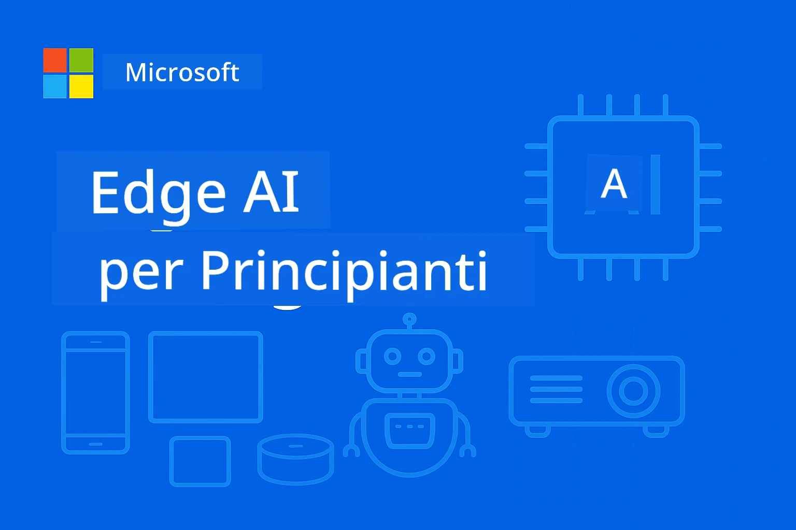

# EdgeAI per Principianti 




[](https://GitHub.com/microsoft/edgeai-for-beginners/graphs/contributors)
[](https://GitHub.com/microsoft/edgeai-for-beginners/issues)
[](https://GitHub.com/microsoft/edgeai-for-beginners/pulls)
[](http://makeapullrequest.com)

[](https://GitHub.com/microsoft/edgeai-for-beginners/watchers)
[](https://GitHub.com/microsoft/edgeai-for-beginners/fork)
[](https://GitHub.com/microsoft/edgeai-for-beginners/stargazers)


[](https://discord.gg/nTYy5BXMWG)

Segui questi passaggi per iniziare a utilizzare queste risorse:

1. **Forka il Repository**: Clicca [](https://GitHub.com/microsoft/edgeai-for-beginners/fork)
2. **Clona il Repository**:   `git clone https://github.com/microsoft/edgeai-for-beginners.git`
3. [**Unisciti al Discord Azure AI Foundry e incontra esperti e sviluppatori**](https://discord.com/invite/ByRwuEEgH4)


### 🌐 Supporto Multilingue

#### Supportato tramite GitHub Action (Automatizzato e Sempre Aggiornato)

<!-- CO-OP TRANSLATOR LANGUAGES TABLE START -->
[Arabic](../ar/README.md) | [Bengali](../bn/README.md) | [Bulgarian](../bg/README.md) | [Burmese (Myanmar)](../my/README.md) | [Chinese (Simplified)](../zh-CN/README.md) | [Chinese (Traditional, Hong Kong)](../zh-HK/README.md) | [Chinese (Traditional, Macau)](../zh-MO/README.md) | [Chinese (Traditional, Taiwan)](../zh-TW/README.md) | [Croatian](../hr/README.md) | [Czech](../cs/README.md) | [Danish](../da/README.md) | [Dutch](../nl/README.md) | [Estonian](../et/README.md) | [Finnish](../fi/README.md) | [French](../fr/README.md) | [German](../de/README.md) | [Greek](../el/README.md) | [Hebrew](../he/README.md) | [Hindi](../hi/README.md) | [Hungarian](../hu/README.md) | [Indonesian](../id/README.md) | [Italian](./README.md) | [Japanese](../ja/README.md) | [Kannada](../kn/README.md) | [Khmer](../km/README.md) | [Korean](../ko/README.md) | [Lithuanian](../lt/README.md) | [Malay](../ms/README.md) | [Malayalam](../ml/README.md) | [Marathi](../mr/README.md) | [Nepali](../ne/README.md) | [Nigerian Pidgin](../pcm/README.md) | [Norwegian](../no/README.md) | [Persian (Farsi)](../fa/README.md) | [Polish](../pl/README.md) | [Portuguese (Brazil)](../pt-BR/README.md) | [Portuguese (Portugal)](../pt-PT/README.md) | [Punjabi (Gurmukhi)](../pa/README.md) | [Romanian](../ro/README.md) | [Russian](../ru/README.md) | [Serbian (Cyrillic)](../sr/README.md) | [Slovak](../sk/README.md) | [Slovenian](../sl/README.md) | [Spanish](../es/README.md) | [Swahili](../sw/README.md) | [Swedish](../sv/README.md) | [Tagalog (Filipino)](../tl/README.md) | [Tamil](../ta/README.md) | [Telugu](../te/README.md) | [Thai](../th/README.md) | [Turkish](../tr/README.md) | [Ukrainian](../uk/README.md) | [Urdu](../ur/README.md) | [Vietnamese](../vi/README.md)

> **Preferisci clonare localmente?**
>
> Questo repository include traduzioni in oltre 50 lingue, il che aumenta significativamente la dimensione del download. Per clonare senza traduzioni, usa sparse checkout:
>
> **Bash / macOS / Linux:**
> ```bash
> git clone --filter=blob:none --sparse https://github.com/microsoft/edgeai-for-beginners.git
> cd edgeai-for-beginners
> git sparse-checkout set --no-cone '/*' '!translations' '!translated_images'
> ```
>
> **CMD (Windows):**
> ```cmd
> git clone --filter=blob:none --sparse https://github.com/microsoft/edgeai-for-beginners.git
> cd edgeai-for-beginners
> git sparse-checkout set --no-cone "/*" "!translations" "!translated_images"
> ```
>
> Questo ti dà tutto il necessario per completare il corso con un download molto più veloce.
<!-- CO-OP TRANSLATOR LANGUAGES TABLE END -->

**Se desideri avere ulteriori lingue di traduzione supportate sono elencate [qui](https://github.com/Azure/co-op-translator/blob/main/getting_started/supported-languages.md)**
## Introduzione

Benvenuto a **EdgeAI per Principianti** – il tuo percorso completo nel mondo trasformativo dell'Intelligenza Artificiale Edge. Questo corso colma il divario tra potenti capacità di AI e il deployment pratico e reale su dispositivi edge, permettendoti di sfruttare il potenziale dell'AI direttamente dove i dati vengono generati e le decisioni devono essere prese.

### Cosa Imparerai

Questo corso ti porta dai concetti fondamentali fino alle implementazioni pronte per la produzione, trattando:
- **Modelli di Linguaggio Piccoli (SLM)** ottimizzati per il deployment edge
- **Ottimizzazione consapevole dell'hardware** su piattaforme diverse
- **Inferenza in tempo reale** con capacità di preservazione della privacy
- **Strategie di deployment in produzione** per applicazioni aziendali

### Perché EdgeAI è Importante

Edge AI rappresenta un cambio di paradigma che risolve sfide moderne critiche:
- **Privacy & Sicurezza**: Elabora dati sensibili localmente senza esposizione al cloud
- **Prestazioni in Tempo Reale**: Elimina la latenza di rete per applicazioni critiche
- **Efficienza dei Costi**: Riduce l'uso di banda e le spese del cloud
- **Operazioni Resilienti**: Mantiene la funzionalità durante interruzioni di rete
- **Conformità Regolatoria**: Soddisfa i requisiti di sovranità dei dati

### Edge AI

Edge AI si riferisce all'esecuzione di algoritmi AI e modelli di linguaggio localmente sull'hardware, vicino al luogo dove i dati sono generati, senza affidarsi alle risorse cloud per l'inferenza. Riduce la latenza, aumenta la privacy e permette decisioni in tempo reale.

### Principi Fondamentali:
- **Inferenza sul dispositivo**: modelli AI eseguiti sui dispositivi edge (telefoni, router, microcontrollori, PC industriali)
- **Capacità offline**: funziona senza connessione internet persistente
- **Bassa latenza**: risposte immediate adatte a sistemi in tempo reale
- **Sovranità dei dati**: mantiene i dati sensibili localmente, migliorando sicurezza e conformità

### Modelli di Linguaggio Piccoli (SLM)

SLM come Phi-4, Mistral-7B e Gemma sono versioni ottimizzate di LLM più grandi—addestrati o distillati per:
- **Riduzione dell'uso della memoria**: uso efficiente della memoria limitata dei dispositivi edge
- **Minore richiesta computazionale**: ottimizzati per CPU e GPU edge
- **Tempi di avvio più rapidi**: inizializzazione veloce per applicazioni reattive

Sbloccano potenti capacità NLP rispettando i vincoli di:
- **Sistemi embedded**: dispositivi IoT e controllori industriali
- **Dispositivi mobili**: smartphone e tablet con funzionalità offline
- **Dispositivi IoT**: sensori e dispositivi smart con risorse limitate
- **Server edge**: unità di elaborazione locale con risorse GPU limitate
- **Personal Computer**: scenari di deployment desktop e laptop

## Moduli del Corso & Navigazione

| Modulo | Argomento | Area di interesse | Contenuti Chiave | Livello | Durata |
|--------|-------|------------|-------------|--------|----------|
| [📖 00 ](./introduction.md) | [Introduzione a EdgeAI](./introduction.md) | Fondamenti & Contesto | Panoramica EdgeAI • Applicazioni industriali • Introduzione SLM • Obiettivi di apprendimento | Principiante | 1-2 ore |
| [📚 01](../../Module01) | [Fondamenti di EdgeAI](./Module01/README.md) | Confronto Cloud vs Edge AI | Fondamenti EdgeAI • Casi di studio reali • Guida all'implementazione • Deployment edge | Principiante | 3-4 ore |
| [🧠 02](../../Module02) | [Fondamenti Modelli SLM](./Module02/README.md) | Famiglie e architetture di modelli | Famiglia Phi • Famiglia Qwen • Famiglia Gemma • BitNET • μModel • Phi-Silica | Principiante | 4-5 ore |
| [🚀 03](../../Module03) | [Pratica di Deployment SLM](./Module03/README.md) | Deployment locale e cloud | Apprendimento avanzato • Ambiente locale • Deployment su cloud | Intermedio | 4-5 ore |
| [⚙️ 04](../../Module04) | [Toolkit di Ottimizzazione Modelli](./Module04/README.md) | Ottimizzazione cross-platform | Introduzione • Llama.cpp • Microsoft Olive • OpenVINO • Apple MLX • Sintesi del flusso di lavoro | Intermedio | 5-6 ore |
| [🔧 05](../../Module05) | [Produzione SLMOps](./Module05/README.md) | Operazioni di produzione | Introduzione a SLMOps • Distillazione modelli • Fine-tuning • Deployment in produzione | Avanzato | 5-6 ore |
| [🤖 06](../../Module06) | [Agenti AI & Function Calling](./Module06/README.md) | Framework agenti & MCP | Introduzione agenti • Function Calling • Protocollo contesto modello | Avanzato | 4-5 ore |
| [💻 07](../../Module07) | [Implementazione Piattaforma](./Module07/README.md) | Esempi cross-platform | Toolkit AI • Foundry Local • Sviluppo Windows | Avanzato | 3-4 ore |
| [🏭 08](../../Module08) | [Toolkit Foundry Local](./Module08/README.md) | Esempi pronti per produzione | Applicazioni di esempio (vedi dettagli sotto) | Esperto | 8-10 ore |

### 🏭 **Modulo 08: Applicazioni di Esempio**

- [01: REST Chat Quickstart](./Module08/samples/01/README.md)
- [02: Integrazione OpenAI SDK](./Module08/samples/02/README.md)
- [03: Scoperta Modelli & Benchmarking](./Module08/samples/03/README.md)
- [04: Applicazione Chainlit RAG](./Module08/samples/04/README.md)
- [05: Orchestrazione Multi-Agente](./Module08/samples/05/README.md)
- [06: Router Modelli-come-Strumenti](./Module08/samples/06/README.md)
- [07: Client API Diretto](./Module08/samples/07/README.md)
- [08: App Chat Windows 11](./Module08/samples/08/README.md)
- [09: Sistema Multi-Agente Avanzato](./Module08/samples/09/README.md)
- [10: Framework Strumenti Foundry](./Module08/samples/10/README.md)

### 🎓 **Workshop: Percorso di Apprendimento Pratico**

Materiali completi per workshop pratici con implementazioni pronte per la produzione:

- **[Guida Workshop](./Workshop/Readme.md)** - Obiettivi di apprendimento completi, risultati e navigazione risorse
- **Esempi Python** (6 sessioni) - Aggiornati con migliori pratiche, gestione errori e documentazione completa
- **Jupyter Notebooks** (8 interattivi) - Tutorial passo-passo con benchmark e monitoraggio prestazioni
- **Guide Sessione** - Guide dettagliate in markdown per ogni sessione del workshop
- **Strumenti di Validazione** - Script per verificare la qualità del codice e eseguire test di base

**Cosa Costruirai:**
- Applicazioni AI chat locali con supporto streaming
- Pipeline RAG con valutazione della qualità (RAGAS)
- Strumenti di benchmarking e confronto multi-modello
- Sistemi di orchestrazione multi-agente
- Routing intelligente di modelli con selezione basata su task

### 🎙️ **Workshop per Agentic: Hands-On - Lo Studio Podcast AI**
Costruisci una pipeline di produzione podcast potenziata dall’intelligenza artificiale da zero! Questo workshop immersivo ti insegna a creare un sistema multi-agente completo che trasforma le idee in episodi di podcast professionali.

**[🎬 Inizia il Workshop AI Podcast Studio](./WorkshopForAgentic/README.md)**

**La Tua Missione**: Lancia "Future Bytes" — un podcast tecnologico interamente alimentato da agenti AI che costruirai tu stesso. Nessuna dipendenza dal cloud, nessun costo API — tutto gira localmente sulla tua macchina.

**Cosa Rende Questo Unico:**
- **🤖 Autentica Orchestrazione Multi-Agente** - Costruisci agenti AI specializzati che ricercano, scrivono e producono audio
- **🎯 Pipeline di Produzione Completa** - Dalla selezione del tema alla produzione finale dell’audio del podcast
- **💻 Distribuzione 100% Locale** - Usa Ollama e modelli locali (Qwen-3-8B) per privacy e controllo totali
- **🎤 Integrazione Text-to-Speech** - Trasforma i copioni in conversazioni naturali multi-speaker
- **✋ Flussi di Lavoro Human-in-the-Loop** - Passaggi di approvazione per garantire qualità mantenendo l’automazione

**Percorso di Apprendimento in Tre Atti:**

| Atto | Focus | Competenze Chiave | Durata |
|-----|-------|-------------------|----------|
| **[Atto 1: Incontra i Tuoi Assistenti AI](./WorkshopForAgentic/md/01.BuildAIAgentWithSLM.md)** | Costruisci il tuo primo agente AI | Integrazione strumenti • Ricerca web • Risoluzione problemi • Ragionamento agentico | 2-3 ore |
| **[Atto 2: Assembla il Tuo Team di Produzione](./WorkshopForAgentic/md/02.AIAgentOrchestrationAndWorkflows.md)** | Orchestra più agenti | Coordinamento team • Flussi di approvazione • Interfaccia DevUI • Supervisione umana | 3-4 ore |
| **[Atto 3: Porta il Tuo Podcast alla Vita](./WorkshopForAgentic/md/03.Multi-SpeakerPodcastGenerationWithVibeVoice.md)** | Genera audio podcast | Text-to-speech • Sintesi multi-speaker • Audio long-form • Automazione completa | 2-3 ore |

**Tecnologie Utilizzate:**
- **Microsoft Agent Framework** - Orchestrazione e coordinamento multi-agente
- **Ollama** - Runtime locale per modelli AI (senza cloud)
- **Qwen-3-8B** - Modello linguistico open-source ottimizzato per compiti agentici
- **API Text-to-Speech** - Sintesi vocale naturale per la generazione del podcast

**Supporto Hardware:**
- ✅ **Modalità CPU** - Funziona su qualsiasi computer moderno (RAM consigliata 8GB+)
- 🚀 **Accelerazione GPU** - Inferenza significativamente più veloce con GPU NVIDIA/AMD
- ⚡ **Supporto NPU** - Accelerazione con unità di elaborazione neurale di nuova generazione

**Perfetto Per:**
- Sviluppatori che imparano sistemi AI multi-agente
- Chiunque sia interessato all’automazione AI e ai flussi di lavoro
- Creatori di contenuti che esplorano la produzione assistita da AI
- Studenti che studiano modelli pratici di orchestrazione AI

**Inizia a Costruire**: [🎙️ Workshop AI Podcast Studio →](./WorkshopForAgentic/README.md)

### 📊 **Riassunto del Percorso di Apprendimento**
- **Durata Totale**: 36-45 ore
- **Percorso Principiante**: Moduli 01-02 (7-9 ore)  
- **Percorso Intermedio**: Moduli 03-04 (9-11 ore)
- **Percorso Avanzato**: Moduli 05-07 (12-15 ore)
- **Percorso Esperto**: Modulo 08 (8-10 ore)

## Cosa Costruirai

### 🎯 Competenze Chiave
- **Architettura AI Edge**: Progetta sistemi AI locali-first con integrazione cloud
- **Ottimizzazione dei Modelli**: Quantizza e comprimi modelli per il deployment edge (miglioramento velocità 85%, riduzione dimensioni 75%)
- **Distribuzione Multi-Piattaforma**: Windows, mobile, embedded e sistemi ibridi cloud-edge
- **Operazioni di Produzione**: Monitoraggio, scalabilità e manutenzione AI edge in produzione

### 🏗️ Progetti Pratici
- **App Locali Foundry Chat**: Applicazione nativa Windows 11 con cambio modello
- **Sistemi Multi-Agente**: Coordinatore con agenti specialisti per flussi di lavoro complessi  
- **Applicazioni RAG**: Elaborazione documenti locali con ricerca vettoriale
- **Router di Modello**: Selezione intelligente tra modelli basata su analisi del compito
- **Framework API**: Client pronti per la produzione con streaming e monitoraggio stato
- **Strumenti Cross-Platform**: Pattern di integrazione LangChain/Semantic Kernel

### 🏢 Applicazioni Industriali
**Manifatturiero** • **Sanità** • **Veicoli Autonomi** • **Smart Cities** • **App Mobile**

## Avvio Rapido

**Percorso di Apprendimento Consigliato** (20-30 ore totali):

0. **📖 Introduzione** ([Introduction.md](./introduction.md)): Fondamenti EdgeAI + contesto industriale + framework di apprendimento
1. **📚 Fondamenta** (Moduli 01-02): Concetti EdgeAI + famiglie modelli SLM
2. **⚙️ Ottimizzazione** (Moduli 03-04): Deployment + framework quantizzazione  
3. **🚀 Produzione** (Moduli 05-06): SLMOps + agenti AI + chiamate funzione
4. **💻 Implementazione** (Moduli 07-08): Esempi piattaforma + toolkit Foundry Local

Ogni modulo include teoria, esercizi pratici e esempi di codice pronti per la produzione.

## Impatto sulla Carriera

**Ruoli Tecnici**: Architetto Soluzioni EdgeAI • Ingegnere ML (Edge) • Sviluppatore AI IoT • Sviluppatore AI Mobile

**Settori Industriali**: Manifattura 4.0 • Tecnologia Sanitaria • Sistemi Autonomi • FinTech • Elettronica di Consumo

**Progetti Portfolio**: Sistemi multi-agente • App RAG di produzione • Deployment cross-platform • Ottimizzazione prestazioni

## Struttura del Repository

```
edgeai-for-beginners/
├── 📖 introduction.md  # Foundation: EdgeAI Overview & Learning Framework
├── 📚 Module01-04/     # Fundamentals → SLMs → Deployment → Optimization  
├── 🔧 Module05-06/     # SLMOps → AI Agents → Function Calling
├── 💻 Module07/        # Platform Samples (VS Code, Windows, Jetson, Mobile)
├── 🏭 Module08/        # Foundry Local Toolkit + 10 Comprehensive Samples
│   ├── samples/01-06/  # Foundation: REST, SDK, RAG, Agents, Routing
│   └── samples/07-10/  # Advanced: API Client, Windows App, Enterprise Agents, Tools
├── 🌐 translations/    # Multi-language support (8+ languages)
└── 📋 STUDY_GUIDE.md   # Structured learning paths & time allocation
```

## Punti Salienti del Corso

✅ **Apprendimento Progressivo**: Teoria → Pratica → Deployment in produzione  
✅ **Casi Studio Reali**: Microsoft, Japan Airlines, implementazioni enterprise  
✅ **Esempi Pratici**: 50+ esempi, 10 demo complete Foundry Local  
✅ **Focus su Performance**: Miglioramenti velocità 85%, riduzioni dimensioni 75%  
✅ **Multi-Piattaforma**: Windows, mobile, embedded, ibrido cloud-edge  
✅ **Pronto per la Produzione**: Monitoraggio, scalabilità, sicurezza, compliance

📖 **[Guida di Studio Disponibile](STUDY_GUIDE.md)**: Percorso di apprendimento strutturato di 20 ore con guida sulla distribuzione del tempo e strumenti di autovalutazione.

---

**EdgeAI rappresenta il futuro del deployment AI**: locale-first, rispettoso della privacy ed efficiente. Padroneggia queste competenze per costruire la prossima generazione di applicazioni intelligenti.

## Altri Corsi

Il nostro team produce altri corsi! Dai un’occhiata:

<!-- CO-OP TRANSLATOR OTHER COURSES START -->
### LangChain
[](https://aka.ms/langchain4j-for-beginners)
[](https://aka.ms/langchainjs-for-beginners?WT.mc_id=m365-94501-dwahlin)
[](https://github.com/microsoft/langchain-for-beginners?WT.mc_id=m365-94501-dwahlin)
---

### Azure / Edge / MCP / Agents
[](https://github.com/microsoft/AZD-for-beginners?WT.mc_id=academic-105485-koreyst)
[](https://github.com/microsoft/edgeai-for-beginners?WT.mc_id=academic-105485-koreyst)
[](https://github.com/microsoft/mcp-for-beginners?WT.mc_id=academic-105485-koreyst)
[](https://github.com/microsoft/ai-agents-for-beginners?WT.mc_id=academic-105485-koreyst)

---
 
### Serie Generative AI
[](https://github.com/microsoft/generative-ai-for-beginners?WT.mc_id=academic-105485-koreyst)
[-9333EA?style=for-the-badge&labelColor=E5E7EB&color=9333EA)](https://github.com/microsoft/Generative-AI-for-beginners-dotnet?WT.mc_id=academic-105485-koreyst)
[-C084FC?style=for-the-badge&labelColor=E5E7EB&color=C084FC)](https://github.com/microsoft/generative-ai-for-beginners-java?WT.mc_id=academic-105485-koreyst)
[-E879F9?style=for-the-badge&labelColor=E5E7EB&color=E879F9)](https://github.com/microsoft/generative-ai-with-javascript?WT.mc_id=academic-105485-koreyst)

---
 
### Apprendimento Base
[](https://aka.ms/ml-beginners?WT.mc_id=academic-105485-koreyst)
[](https://aka.ms/datascience-beginners?WT.mc_id=academic-105485-koreyst)
[](https://aka.ms/ai-beginners?WT.mc_id=academic-105485-koreyst)
[](https://github.com/microsoft/Security-101?WT.mc_id=academic-96948-sayoung)
[](https://aka.ms/webdev-beginners?WT.mc_id=academic-105485-koreyst)
[](https://aka.ms/iot-beginners?WT.mc_id=academic-105485-koreyst)
[](https://github.com/microsoft/xr-development-for-beginners?WT.mc_id=academic-105485-koreyst)

---
 
### Serie Copilot
[](https://aka.ms/GitHubCopilotAI?WT.mc_id=academic-105485-koreyst)
[](https://github.com/microsoft/mastering-github-copilot-for-dotnet-csharp-developers?WT.mc_id=academic-105485-koreyst)
[](https://github.com/microsoft/CopilotAdventures?WT.mc_id=academic-105485-koreyst)
<!-- CO-OP TRANSLATOR OTHER COURSES END -->

## Ottenere aiuto

Se ti blocchi o hai domande sulla creazione di app AI, unisciti a:

[](https://discord.gg/nTYy5BXMWG)

Se hai feedback sul prodotto o errori durante la creazione visita:

[](https://aka.ms/foundry/forum)

---

<!-- CO-OP TRANSLATOR DISCLAIMER START -->
**Disclaimer**:  
Questo documento è stato tradotto utilizzando il servizio di traduzione AI [Co-op Translator](https://github.com/Azure/co-op-translator). Pur impegnandoci per l’accuratezza, si prega di notare che le traduzioni automatiche possono contenere errori o inesattezze. Il documento originale nella sua lingua nativa deve essere considerato la fonte autorevole. Per informazioni critiche, si raccomanda una traduzione professionale umana. Non siamo responsabili per eventuali incomprensioni o interpretazioni errate derivanti dall’uso di questa traduzione.
<!-- CO-OP TRANSLATOR DISCLAIMER END -->