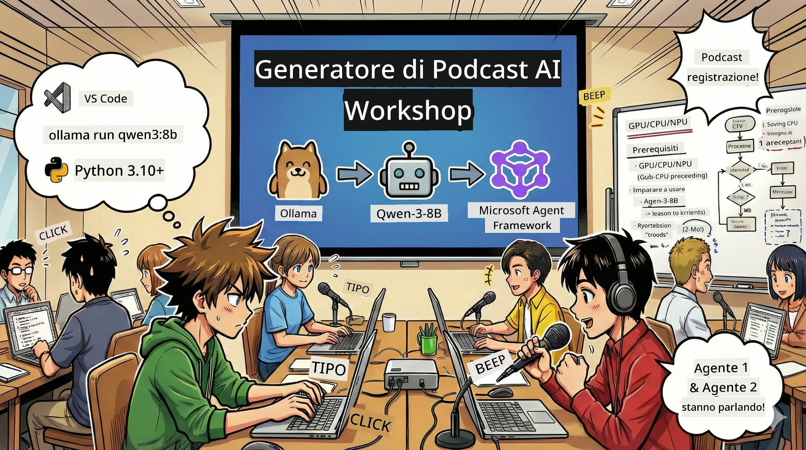
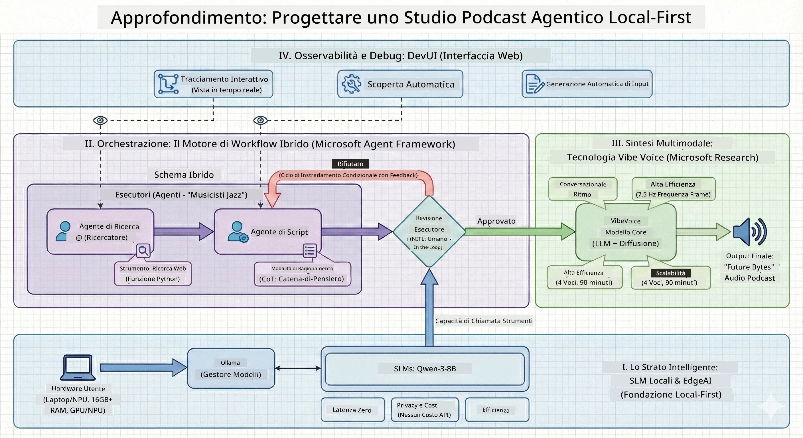

# 🎙️ Il Laboratorio di The AI Podcast Studio

> 🌏 [中文版 (Versione Cinese)](translation/zh-cn/README.md)



## La Tua Missione

Benvenuto a **The AI Podcast Studio**! Stai per lanciare il tuo podcast tech chiamato "Future Bytes" — ma c’è una svolta: costruirai un team di produzione con AI per aiutarti a crearlo. Niente più ore infinite di ricerca, scrittura di copioni e montaggio audio. Invece, scriverai codice per diventare un produttore di podcast con superpoteri AI.

## La Storia

Immagina questo: tu e i tuoi amici volete iniziare un podcast sulle tendenze tecnologiche più cool, ma ognuno è impegnato con scuola, lavoro o semplicemente la vita. E se potessi costruire un team di agenti AI per fare il lavoro pesante? Un agente ricerca gli argomenti, un altro scrive copioni coinvolgenti, e un terzo trasforma il testo in conversazioni naturali. Sembra fantascienza? Facciamolo diventare realtà.

## Cosa Imparerai

Alla fine di questo laboratorio, saprai come:
- 🤖 Distribuire un modello AI locale tuo (niente costi API, nessuna dipendenza dal cloud!)
- 🔧 Costruire agenti AI specializzati che collaborino davvero
- 🎬 Creare una pipeline di produzione podcast completa, dall’idea all’audio

## Il Tuo Viaggio: Tre Atti



Come in una bella storia, ci sono tre atti. Ognuno costruisce il tuo studio podcast AI pezzo dopo pezzo:

| Episodio | La Tua Missione | Cosa Succede | Abilità Sbloccate |
|---------|-----------|--------------|----------------|
| **Atto 1** | [Incontra i Tuoi Assistenti AI](md/01.BuildAIAgentWithSLM.md) | Scopri come creare agenti AI che possono chattare, cercare sul web e perfino risolvere problemi. Pensali come i tuoi tirocinanti di ricerca che non dormono mai. | 🎯 Costruisci il tuo primo agente<br>🛠️ Dagli superpoteri (strumenti!)<br>🧠 Insegnagli a pensare<br>🌐 Connettilo a internet |
| **Atto 2** | [Assembla il Tuo Team di Produzione](md/02.AIAgentOrchestrationAndWorkflows.md) | Ora si fa interessante! Regolerai più agenti AI per lavorare insieme come un vero team di podcast. Uno ricerca, uno scrive, tu approvi — il lavoro di squadra fa miracoli. | 🎭 Coordina più agenti<br>🔄 Costruisci flussi di approvazione<br>🖥️ Testa con interfaccia DevUI<br>✋ Mantieni il controllo umano |
| **Atto 3** | [Dai Vita al Tuo Podcast](md/03.Multi-SpeakerPodcastGenerationWithVibeVoice.md) | Il gran finale! Trasforma i tuoi copioni testuali in audio podcast reali con voci realistiche e conversazioni naturali. Il tuo podcast "Future Bytes" è pronto per partire! | 🎤 Magia text-to-speech<br>👥 Voci per più speaker<br>⏱️ Audio di lunga durata<br>🚀 Automazione completa |

Ogni atto sblocca nuove capacità. Saltalo se sei coraggioso, ma ti consigliamo di seguire la storia!

## Requisiti Ambientali

Questo workshop supporta vari ambienti hardware:
- **CPU**: Adatta per test e uso su piccola scala
- **GPU**: Consigliata per ambienti di produzione, migliora notevolmente la velocità di inferenza
- **NPU**: Supporta accelerazione tramite unità di elaborazione neurale di nuova generazione

## Cosa Ti Serve

### Checklist Software ✅
- **Python 3.10+** (il tuo linguaggio di programmazione)
- **Ollama** (esegue modelli AI sulla tua macchina)
- **VS Code** (il tuo editor di codice)
- **Estensione Python** (rende VS Code più smart)
- **Git** (per scaricare il codice)

### Lista Hardware 💻
- **Posso farlo girare?**: RAM 8GB, 10GB spazio libero (funziona, ma lento)
- **Setup ideale**: RAM 16GB+, una buona GPU (tutto fluido!)
- **Hai un NPU?**: Ancora meglio! Prestazioni next-gen sbloccate 🚀

## Prepara il Tuo Studio 🎬

### Passo 1: Potenziamento Python

Assicurati di avere Python 3.10 o superiore:

```bash
python --version
# Deve mostrare Python 3.10.x o superiore
```

Niente Python? Scaricalo da [python.org](https://python.org) — è gratis!

### Passo 2: Ottieni Ollama (esecutore dei modelli AI)

Vai su [ollama.ai](https://ollama.ai) e scarica Ollama per il tuo sistema operativo. Pensalo come il motore che esegue i tuoi modelli AI localmente.

Verifica che sia pronto:

```bash
ollama --version
```

### Passo 3: Scarica il Cervello AI 🧠

Ora prendi il modello Qwen-3-8B (è come assumere il tuo primo assistente AI):

```bash
ollama pull qwen3:8b
```

*Potrebbe impiegare qualche minuto. Il momento perfetto per una pausa caffè! ☕*

### Passo 4: Configura VS Code

Prendi [Visual Studio Code](https://code.visualstudio.com/) se non ce l’hai. È il miglior editor di codice in circolazione (sfidami 😄).

### Passo 5: Estensione Python

In VS Code:
1. Premi `Ctrl+Shift+X` (o `Cmd+Shift+X` su Mac)
2. Cerca "Python"
3. Installa l’estensione ufficiale di Microsoft per Python

### Passo 6: Sei Pronto! 🎉

Davvero, sei pronto per partire. Creiamo un po’ di magia AI!

### Passo 7: Installa Microsoft Agent Framework e Pacchetti Correlati 📦

Installa tutte le dipendenze necessarie per il laboratorio:

```bash
pip install -r ./Installations/requirements.txt -U
```

*Questo installerà Microsoft Agent Framework e tutti i pacchetti richiesti. Preparati un caffè — il setup iniziale può richiedere qualche minuto! ☕*

## Istruzioni del Laboratorio

La struttura del progetto, i passaggi di configurazione e i metodi di esecuzione saranno spiegati dettagliatamente durante il laboratorio.

## Risoluzione Problemi (Quando Le Cose Vanno Male) 🔧

### "Ugh, il download del modello sta durando un’eternità!"
**Soluzione**: Usa una VPN o configura Ollama con una fonte mirror. A volte internet ce l’ha proprio con noi.

### "Il computer sta morendo! Memoria esaurita!"
**Soluzione**: Passa a un modello più piccolo o modifica l’impostazione `num_ctx` per usare meno memoria. È come mettere l’AI a dieta.

### "Posso velocizzarlo con la mia GPU?"
**Soluzione**: Ollama rileva automaticamente le GPU! Assicurati solo che i driver della GPU siano aggiornati. Sprint gratuito! 🏎️

## Risorse Extra (Per i Curiosi) 📚

- [Documentazione Ollama](https://github.com/ollama/ollama) — Approfondimenti sui modelli AI locali
- [Microsoft Agent Framework](https://microsoft.github.io/autogen/) — Scopri di più su come costruire team di agenti
- [Info Modello Qwen](https://qwenlm.github.io/) — Conosci il cervello del tuo assistente AI

## Licenza

Licenza MIT — Crea cose fantastiche, condividile, rendi il mondo migliore! 🌍

## Vuoi Contribuire?

Hai trovato un bug? Hai un’idea? Apri un Issue o una PR! Amiamo la community. ✨

---

<!-- CO-OP TRANSLATOR DISCLAIMER START -->
**Disclaimer**:
Questo documento è stato tradotto utilizzando il servizio di traduzione automatica AI [Co-op Translator](https://github.com/Azure/co-op-translator). Pur facendo il possibile per garantire l’accuratezza, si prega di tenere presente che le traduzioni automatiche possono contenere errori o imprecisioni. Il documento originale nella sua lingua nativa deve essere considerato la fonte autorevole. Per informazioni critiche si raccomanda una traduzione professionale effettuata da un umano. Non ci assumiamo alcuna responsabilità per eventuali incomprensioni o interpretazioni errate derivanti dall’uso di questa traduzione.
<!-- CO-OP TRANSLATOR DISCLAIMER END -->