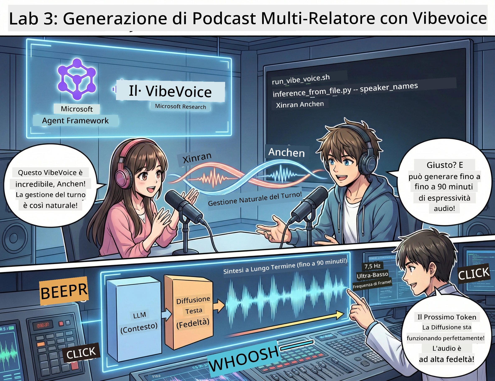

<!--
CO_OP_TRANSLATOR_METADATA:
{
  "original_hash": "bb2a3cf5ebd0ec8211af960a004fc23d",
  "translation_date": "2026-01-05T12:12:57+00:00",
  "source_file": "WorkshopForAgentic/md/03.Multi-SpeakerPodcastGenerationWithVibeVoice.md",
  "language_code": "it"
}
-->
# Atto 3: Dai vita al tuo podcast 🎤



## Il Gran Finale

Hai fatto ricerche sui temi. Hai scritto copioni. Ora la ciliegina sulla torta: trasformare il tuo testo in audio podcast reale con voci realistiche!

Entra in scena **VibeVoice** — la magia TTS (text-to-speech) open-source di Microsoft Research che crea:
- 🎭 Conversazioni dal suono naturale
- 👥 Più speaker (fino a 4!)
- ⏱️ Audio di lunga durata (fino a 90 minuti!)
- 🎵 Espressività nella voce (niente voci robotiche!)

Questa è la tecnologia dietro i podcast sintetici. Facciamo il tuo!

## Cos’è VibeVoice? (Le cose fighissime)

VibeVoice è il regalo di Microsoft Research al mondo. È progettato specificamente per audio conversazionale in stile podcast.

### Perché è fantastico 🔥

* **⏱️ Sessioni di Maratona**: Genera fino a 90 minuti di parlato continuo (è un episodio completo di podcast!)
* **👥 Magia Multi-Speaker**: Fino a 4 voci diverse con personalità coerenti
* **⚡ Super Efficiente**: Usa un frame rate ultra basso a 7.5 Hz per risparmiare potenza di calcolo
* **🧠 Audio Intelligente**: Combina un LLM (capisce il contesto) con un modello di diffusione (crea audio realistico)
* **🎭 Flusso Naturale**: Gestisce automaticamente i turni, le pause e il ritmo conversazionale

**Traduzione**: VibeVoice non si limita a leggere il tuo copione — lo *interpreta* come persone reali che parlano.

---

## Prima di cominciare 🚀

**Cosa ti serve**:

* 🐍 **Python 3.10+** (lo hai già dagli Atti 1 e 2)
* 🚀 **uv** (un gestore pacchetti Python veloce — lo installeremo)
* 📝 **Il tuo copione**: il file `podcast.txt` dall’Atto 2 (in `../03.Application/`)

**Consiglio da Pro**: Questo passaggio richiede una buona connessione internet per scaricare il modello pre-addestrato. Prendi un caffè! ☕

---

## Andiamo! Il modo facile 🎬

Abbiamo reso tutto incredibilmente semplice. Uno script shell fa tutto.

### Il processo

1. **Rendilo eseguibile**:
```bash
chmod +x run_vibe_voice.sh
```

2. **Eseguilo**:
```bash
./run_vibe_voice.sh
```

3. **Aspetta la magia** (potrebbe richiedere qualche minuto al primo avvio)

### Cosa succede dietro le quinte 🎭

Lo script è praticamente il tuo ingegnere del suono automatizzato:

1. **📥 Scarica VibeVoice**: Clona il repo ufficiale da GitHub
2. **📦 Installa le dipendenze**: Usa `uv pip` per installazioni rapidissime dei pacchetti
3. **🎬 Genera audio**: Esegue lo script di inferenza con:
   * `--model_path`: il modello VibeVoice-7B pre-addestrato
   * `--txt_path`: il tuo copione `podcast.txt`
   * `--speaker_names`: assegna le voci (Xinran e Anchen di default)

**Risultato**: Il tuo copione diventa un episodio podcast vero! 🎉

---

## La tua missione 🎯

Rendiamolo interessante:

### Compito 1: Crea contenuti
Modifica `../03.Application/podcast.txt` con una conversazione tra due persone. Fai un discorso su tecnologia, hobby, qualsiasi cosa! Solo conversazionale.

**Esempio di formato**:
```
Speaker 1: Hey! Did you hear about the new AI model?
Speaker 2: No way! Tell me more!
Speaker 1: It's called...
```

### Compito 2: Genera audio
Esegui lo script e guarda la magia accadere. La prima volta ci vorrà più tempo (scaricamento modello).

### Compito 3: Ascolta e analizza
- Suona naturale?
- Gli speaker hanno voci distinte?
- Il turno di parola è fluido?
- Ci sono momenti robotici?

### Compito 4: Sperimenta (per i coraggiosi)
Modifica `run_vibe_voice.sh` e cambia `--speaker_names` per provare combinazioni di voci diverse. VibeVoice ha molte voci pre-addestrate!

**Sfida bonus**: Prova una conversazione a 3 speaker! 🎆

---

## Per saperne di più 📚

* **🏠 Homepage progetto**: [Sito ufficiale VibeVoice](https://microsoft.github.io/VibeVoice/)
* **🤗 Modello pre-addestrato**: [Hugging Face - VibeVoice-7B](https://huggingface.co/vibevoice/VibeVoice-7B)
* **📖 Articolo di ricerca**: Approfondisci la tecnologia (se ti interessa)

> **⚠️ Promemoria AI responsabile**: VibeVoice è potente. Usalo eticamente! Non creare deepfake o contenuti fuorvianti. Crea cose fighe che aiutano le persone. 🙏

---

## 🏆 Congratulazioni! Ce l’hai fatta!

Hai appena completato tutta la pipeline:
1. ✅ **Atto 1**: Costruito agenti AI con strumenti personalizzati
2. ✅ **Atto 2**: Orchestrato un workflow multi-agente
3. ✅ **Atto 3**: Generato audio podcast reale

**Ora hai**:
- Un assistente di ricerca AI funzionante
- Un workflow completo per la produzione podcast
- Un file audio reale da condividere

### E adesso? 🚀

**Lancia il tuo podcast!**
- Caricalo sulle piattaforme podcast
- Condividilo sui social media
- Itera e migliora

**Continua a creare!**
- Prova argomenti diversi
- Sperimenta con più speaker
- Aggiungi musica di sottofondo
- Costruisci un’interfaccia web
- Automatizza tutto

**Condividi il tuo lavoro!**
Taggaci! Mostra al mondo cosa hai creato. La rivoluzione dei podcast AI inizia da te. 🎙️

---

**Domande? Idee? Storie di successo?** Scrivile nella chat del workshop!

**Benvenuto nel futuro della creazione di contenuti.** 🌟

---

<!-- CO-OP TRANSLATOR DISCLAIMER START -->
**Avvertenza**:  
Questo documento è stato tradotto utilizzando il servizio di traduzione AI [Co-op Translator](https://github.com/Azure/co-op-translator). Pur impegnandoci per l’accuratezza, si prega di notare che le traduzioni automatiche possono contenere errori o inesattezze. Il documento originale nella sua lingua nativa deve essere considerato la fonte autorevole. Per informazioni critiche si raccomanda una traduzione professionale effettuata da un umano. Non ci assumiamo alcuna responsabilità per malintesi o interpretazioni errate derivanti dall’uso di questa traduzione.
<!-- CO-OP TRANSLATOR DISCLAIMER END -->