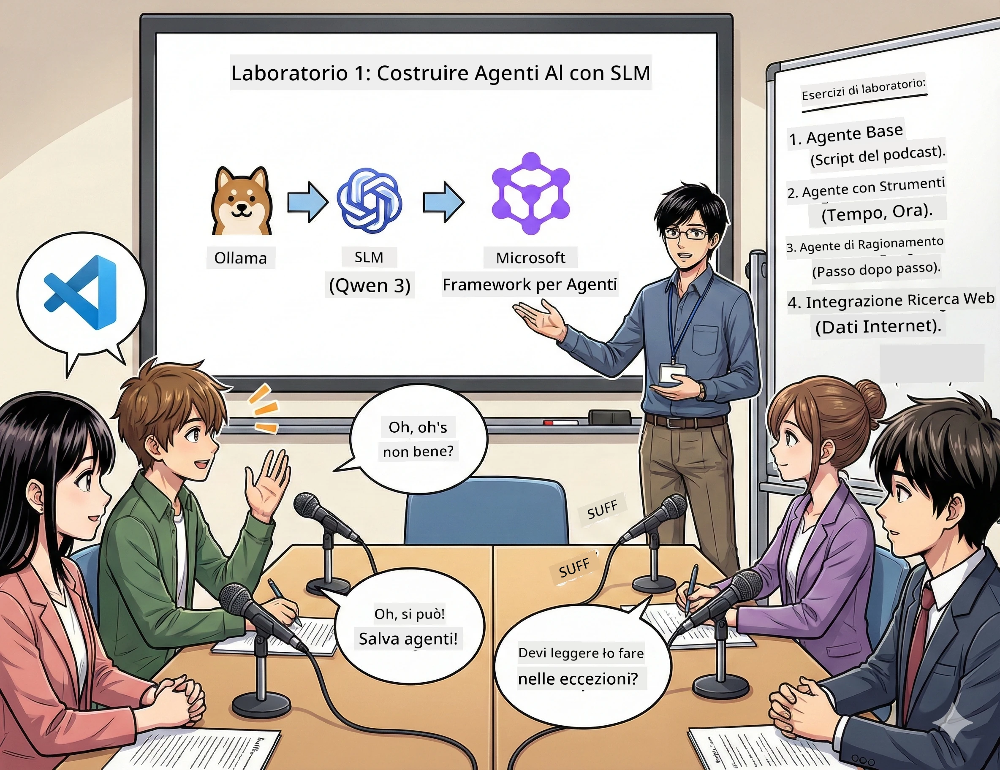

<!--
CO_OP_TRANSLATOR_METADATA:
{
  "original_hash": "21779ce57b388adecb26881a35d9cbcf",
  "translation_date": "2026-01-05T16:44:49+00:00",
  "source_file": "WorkshopForAgentic/translation/zh-cn/01.BuildAIAgentWithSLM.md",
  "language_code": "it"
}
-->
# Atto 1: Conosci il tuo assistente di ricerca AI 🤖

## Sfida

Stai lanciando "Future Bytes", il tuo nuovo podcast tecnologico. Il primo episodio riguarda le ultime scoperte nell'AI, ma hai solo 24 ore per:
1. Ricercare l'argomento
2. Trovare fonti affidabili
3. Scrivere uno script coinvolgente
4. Farlo suonare naturale

**Colpo di scena**: non devi farlo da solo. Stai per costruire il tuo primo assistente AI, che può aiutarti a fare tutto questo. Lo chiameremo Alex — il tuo compagno di ricerca instancabile, che non ha mai bisogno di dormire.

## Perché scegliere i modelli linguistici piccoli? (Spoiler: sono fantastici)

Immagina i modelli linguistici piccoli (SLM) come un AI personale che gira *sul tuo* computer. Niente cloud, niente costi mensili, nessuna condivisione sospetta di dati.

**Perché SLM è così 🔥:**
- **🏠 Funziona sul tuo dispositivo**: laptop, desktop, perfino un Raspberry Pi potente
- **💸 Costo zero continuativo**: niente spese API che prosciugano il tuo budget
- **🔒 Privacy prima di tutto**: i tuoi dati non lasciano mai il dispositivo
- **⚡ Velocità fulminea**: nessuna latenza di rete, risposte istantanee
- **🪦 Leggero**: 1-10 miliardi di parametri contro miliardi di più dei grandi modelli

**SLM popolari**: Qwen 3, Phi-4, Gemma 3 (in questo workshop usiamo Qwen)

## Il tuo kit di strumenti

### Ollama: il tuo gestore di modelli AI

[Ollama](https://ollama.com/) è come Steam per i modelli AI. Scarica, esegui e gestisci modelli con semplici comandi.

**Cosa lo rende così figo:**
- Un comando per scaricare ed eseguire qualsiasi modello
- Funziona su Mac, Windows, Linux
- Usa la GPU automaticamente se disponibile
- Estremamente parsimonioso in memoria

### Microsoft Agent Framework: dove avviene la magia

[Microsoft Agent Framework](https://github.com/microsoft/agent-framework) è il tuo parco giochi per costruire agenti AI, capaci di:

- 💬 Chatta e ricorda cosa avete detto
- 🛠️ Usa strumenti personalizzati (come cercare sul web o controllare il meteo)
- 🧠 Ragiona passo dopo passo su problemi complessi
- 🤝 Collabora in squadra con altri agenti
- 🔌 Connettersi a diversi provider AI (OpenAI, Ollama, Azure)

**Moduli costruttivi:**
- **Agenti (Agents)**: assistenti AI specifici per compiti
- **Strumenti (Tools)**: abilità speciali che assegni loro
- **Memoria (Memory)**: così non dimenticano la conversazione
- **Ragionamento (Reasoning)**: insegnagli a pensare, non solo a rispondere

## Il tuo montaggio di addestramento: 4 missioni

### Missione 1: Crea il tuo primo agente intelligente

📓 [Apri il Notebook](../../code/01.BasicAgent/00.BasicAgent-agent.ipynb)

**Obiettivo**: costruisci Alex, il tuo AI per la scrittura di script podcast. Alex deve generare un dialogo tra due conduttori che discutono di tecnologia.

**Imparerai a:**
- Risvegliare un agente AI (più facile che alzarsi il lunedì mattina)
- Dargli personalità e istruzioni
- Far generare script podcast realistici
- Comprendere le sue risposte

**Vittoria**: Alex crea lo script per il pilota di "Future Bytes" sull'AI! 🎯

### Missione 2: Dai a Alex superpoteri (gli strumenti!)

📓 [Apri il Notebook](../../code/01.BasicAgent/01.BasicAgent-tools.ipynb)

**Obiettivo**: Alex è intelligente, ma non sa che tempo fa oggi né che ore sono. Diamo degli strumenti per risolvere questo!

**Imparerai:**
- Come creare funzioni Python personalizzate come "strumenti"
- Lasciare che Alex decida *quando* usare quale strumento
- Osservare come risolve problemi autonomamente
- Combinare più strumenti per compiti complessi

**Vittoria**: chiedi "Che tempo fa a Tokyo?" e Alex trova la risposta da solo! ☁️

### Missione 3: Insegna ad Alex a pensare

📓 [Apri il Notebook](../../code/01.BasicAgent/02.BasicAgent-reasoning.ipynb)

**Obiettivo**: mostra ad Alex come lavora. Quando risolve problemi, vuoi vedere *come* pensa, non solo la risposta.

**Imparerai:**
- Attivare la "modalità ragionamento" (come mostrare i passaggi in matematica)
- Vedere il processo di pensiero graduale di Alex
- Capire i prompt a catena di pensiero
- Debuggare quando Alex è confuso

**Vittoria**: poni una domanda matematica difficile e guarda Alex ragionare! 🧠

### Missione 4: Connetti Alex a internet

📓 [Apri il Notebook](../../code/01.BasicAgent/03.BasicAgent-websearch.ipynb)

**Obiettivo**: la conoscenza di Alex ha una data di scadenza. Connettiamolo al web per informazioni in tempo reale!

**Imparerai:**
- Costruire uno strumento di ricerca web personalizzato
- Integrare API esterne
- Gestire con grazia errori di rete
- Ottenere informazioni oltre i dati di addestramento di Alex

**Vittoria**: chiedi le ultime notizie tech di oggi e ottieni risultati aggiornati! 📰

## Prima di iniziare 🚀

**Equipaggiamento necessario**:
- Python 3.10+ installato
- Ollama in esecuzione (controlla con `ollama --version`)
- VS Code con estensione Python
- Almeno 8GB di RAM (16GB per esperienza fluida)

## Ordine delle missioni

Completa i notebook in ordine per l'esperienza completa:

1. [00.BasicAgent-agent.ipynb](../../code/01.BasicAgent/00.BasicAgent-agent.ipynb) — conosci Alex (il tuo primo agente)
2. [01.BasicAgent-tools.ipynb](../../code/01.BasicAgent/01.BasicAgent-tools.ipynb) — è ora di potenziare!
3. [02.BasicAgent-reasoning.ipynb](../../code/01.BasicAgent/02.BasicAgent-reasoning.ipynb) — insegna ad Alex a ragionare
4. [03.BasicAgent-websearch.ipynb](../../code/01.BasicAgent/03.BasicAgent-websearch.ipynb) — sblocca l’accesso a internet!

## Cosa imparerai

Dopo il primo atto, sarai in grado di:

- ✅ Eseguire modelli AI sul tuo hardware (niente cloud!)
- ✅ Costruire agenti con personalità e abilità personalizzate
- ✅ Dare agli agenti strumenti per risolvere problemi reali
- ✅ Far mostrare agli agenti il loro processo di ragionamento
- ✅ Connettere gli agenti a fonti di dati esterne
- ✅ Debuggare quando qualcosa va storto

## Quando qualcosa va storto (e come sistemarlo) 🔧

### "Alex non si carica! Memoria insufficiente!"
**Soluzione**: il tuo computer fatica. Prova a chiudere altre app o passa a un modello più piccolo. 8GB è il minimo richiesto.

### "Alex è troppo lento"
**Soluzione**: attiva l’accelerazione GPU nelle impostazioni di Ollama. Oppure riduci la dimensione della finestra contestuale. Modalità velocità demone attivata! 🏎️

### "Gli strumenti non funzionano!"
**Soluzione**: controlla attentamente la firma delle tue funzioni. Alex ha bisogno di suggerimenti di tipo precisi per capire lo scopo dello strumento. Pensa a dare istruzioni chiare.

## Link utili 🔗

- [Documentazione Agent Framework](https://github.com/microsoft/agent-framework) — guide ufficiali ed esempi
- [Libreria modelli Ollama](https://ollama.com/library) — sfoglia tutti i modelli disponibili
- [Modello Qwen](https://ollama.com/library/qwen3) — il cervello del tuo assistente AI
- [Esempi di codice](https://github.com/microsoft/agent-framework/tree/main/python/samples) — prendi spunto da qui

## Prossimo episodio: Atto 2 🎬

Hai un agente. Ma se avessi *una squadra* di agenti che lavorano insieme? Nel secondo atto costruirai un team completo per la produzione del podcast:
- **Agente ricerca**: trova le migliori fonti
- **Agente scrittura**: crea lo script perfetto
- **Editing (tu!)**: approva o richiedi cambiamenti

Facciamo un po’ di magia AI! → [Atto 2: Metti insieme il tuo team di produzione](02.AIAgentOrchestrationAndWorkflows.md)

---

**Bloccato?** Fai domande durante il workshop. Impareremo insieme! 🙌

---

<!-- CO-OP TRANSLATOR DISCLAIMER START -->
**Avvertenza**:
Questo documento è stato tradotto utilizzando il servizio di traduzione automatica [Co-op Translator](https://github.com/Azure/co-op-translator). Sebbene ci impegniamo per garantire la precisione, si prega di tenere presente che le traduzioni automatiche possono contenere errori o inesattezze. Il documento originale nella sua lingua nativa deve essere considerato la fonte autorevole. Per informazioni critiche, si raccomanda una traduzione professionale effettuata da un essere umano. Non ci assumiamo alcuna responsabilità per incomprensioni o interpretazioni errate derivanti dall’uso di questa traduzione.
<!-- CO-OP TRANSLATOR DISCLAIMER END -->