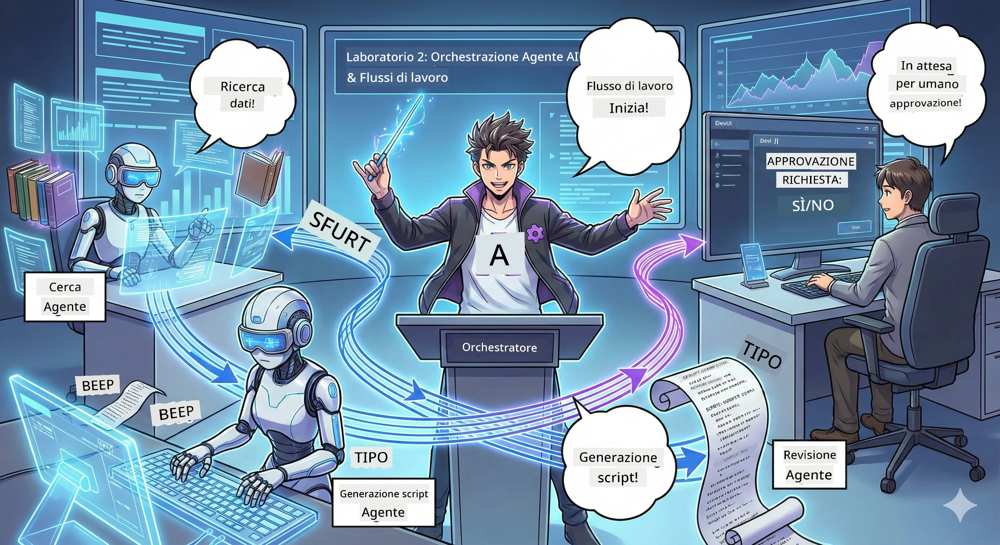

<!--
CO_OP_TRANSLATOR_METADATA:
{
  "original_hash": "2a2578dc4f813ca93ca7952d842a4b59",
  "translation_date": "2026-01-05T14:46:30+00:00",
  "source_file": "WorkshopForAgentic/translation/zh-cn/02.AIAgentOrchestrationAndWorkflows.md",
  "language_code": "it"
}
-->
# Atto Due: Costruisci il tuo team di produzione podcast 🎬



## La trama si intensifica

Alex (il tuo assistente AI dell'Atto Uno) è fantastico, ma un singolo agente non può gestire uno studio podcast da solo. Hai bisogno di un *team*:
- 🔍 **Agente di ricerca**: cerca sul web informazioni fresche
- ✍️ **Agente di script**: trasforma la ricerca in conversazioni coinvolgenti
- 👤 **Tu (editore)**: approva gli script o li rimanda per la riscrittura

Benvenuto in **Orchestrazione Agent AI** — tu diventi il regista del tuo team AI. Pensa agli Avengers, ma per la produzione di podcast.

## Cos'è l'orchestrazione agent? (versione semplice)

Immagina di gestire un ristorante. Non fai tutto da solo, giusto? Hai:
- 🍳 Cuochi che cucinano
- 👨‍🍳 Sous chef che preparano
- 👩‍🍳 Camerieri che servono

L'orchestrazione agent è la stessa idea, ma con l'AI. Ogni agente ha competenze specialistiche, e tu li coordini per raggiungere un obiettivo più grande. Nessun singolo agente è sovraccaricato, il lavoro si fa prima.

### Analogia della band 🎸

I tuoi agenti AI sono come una band:
- **Cantante principale**: l'agente principale che si occupa dei compiti rivolti al cliente
- **Batterista**: mantiene il ritmo, gestisce il backend
- **Bassista**: supporta tutti, raccolta dati
- **Tu (manager della band)**: coordini tutto!

Niente coordinamento? Solo rumore. Coordinamento? Musica splendida.

### Perché è importante

Un singolo agente AI che prova a fare tutto = burnout. Agenti specializzati che lavorano insieme = efficienza sbloccata! 🚀

**Parliamoci chiaro**: ricordi quando hai provato da solo a fare la ricerca, scrivere e editare il tuo podcast? Sì, è stato un disastro. Con l'orchestrazione, ogni agente fa ciò che sa fare meglio. Tu prendi solo la decisione finale.

**Esempio reale**: un chatbot di supporto clienti sa quando trattare fatturazione vs problemi tecnici vs quando chiamare un umano. Questa è orchestrazione!

## Agente vs Workflow: qual è la differenza?

Pensala così:

### 🤖 Agente AI = musicista jazz
- **Decisioni improvvisate** basate su ciò che sente
- **Creatività improvvisata** usando i suoi strumenti
- **Pensiero** con cervello LLM
- **Adattamento** a qualsiasi cosa gli lanci

### 🎵 Workflow = orchestra che suona musica classica
- **Segue uno spartito** (passi predefiniti)
- **Esecuzione prevedibile**
- **Coordina** vari agenti, persone e sistemi
- **Strutturato** come una ricetta

**La magia**: il workflow *orchestra* gli agenti! Costruisci un workflow che dice agli agenti quando entrare in scena. Il meglio dei due mondi. 🎭

## Modi per coordinare il tuo team AI

### 1. 🎯 Centralizzato (tu sei il capo)

Un agente principale dà ordini. Pensa a come gestisci un team — decidi chi fa cosa e quando.

**Vantaggi**:
- ✅ Leadership chiara (niente caos)
- ✅ Decisioni coerenti
- ✅ Facile da fare debug

**Buono per**:
- Routing assistenza clienti ("È fatturazione o supporto tecnico?")
- Workflow di approvazione contenuti ("Questo script è approvato?")
- Produzione podcast (proprio ciò che stiamo creando!)

### 2. 🤝 Decentralizzato (auto-organizzazione agenti)

Gli agenti si parlano direttamente e risolvono problemi come gruppo. Come una chat di gruppo dove tutti si coordinano.

**Vantaggi**:
- ✅ Scalabilità (aggiungi agenti quando vuoi)
- ✅ Nessun singolo punto di fallimento
- ✅ Collaborazione naturale fra agenti

**Buono per**:
- Team di ricerca (ogni agente esplora fonti diverse)
- Sessioni di brainstorming
- Risoluzione distribuita di problemi

### 3. 🔀 Ibrido (il meglio di entrambi)

Imposti la direzione generale, ma gli agenti hanno libertà di auto-organizzarsi su compiti. Come un CEO che si fida del team.

**Perfetto per**: progetti complessi che richiedono controllo e flessibilità.

## Microsoft Agent Framework: il tuo kit di orchestrazione 🧰

È ora di costruire! Ecco cosa userai:

### Blocchi costitutivi

#### 1. 🧱 Esecutori (i tuoi lavoratori)
- **Cosa sono**: unità di elaborazione singole — possono essere agenti o logiche personalizzate
- **Cosa fanno**: accettano input, fanno il lavoro, producono output
- **Pensali come**: stazioni nella catena di montaggio

#### 2. ➡️ Archi (connessioni)
- **Cosa sono**: percorsi tra esecutori
- **Cosa fanno**: controllano il flusso dei messaggi ("dopo A, vai a B")
- **Pensali come**: frecce in un diagramma di flusso

#### 3. 🗺️ Workflow (il piano generale)
- **Cosa sono**: il grafo completo di esecutori + archi
- **Cosa fanno**: definiscono il processo dall'inizio alla fine
- **Pensali come**: la tua mappa di produzione

### Funzionalità interessanti che amerai

**🛡️ Tipo sicuro**: i messaggi tra agenti sono soggetti a controllo di tipo. Niente "oops, tipo dati sbagliato".

**🔀 Routing flessibile**:
- Condizioni if-then ("se approvato, pubblica; altrimenti, riscrivi")
- Elaborazione parallela (più agenti lavorano insieme)
- Percorsi dinamici (il workflow si adatta ai risultati)

**🔌 Integrazione esterna**:
- Connessione a API
- Checkpoint umano (approvi prima della pubblicazione)
- Costruzione di flussi richiesta/risposta

**💾 Checkpoint**: salva i progressi! Se qualcosa crasha, riprendi da dove hai lasciato.

**🤝 Coordinazione multi-agente**:
- Esecuzione sequenziale (A → B → C)
- Esecuzione parallela (A + B + C insieme)
- Passaggio di consegne tra agenti
- Collaborazione sui compiti

## Best Practice 🎯

### 1. Mantieni la modularità
Ogni agente dovrebbe fare bene una cosa. Non creare un "super agente" che fa tutto — ti pentirai durante il debug.

### 2. Pianifica i fallimenti
Gli agenti sbagliano. La rete cade. Costruisci gestione errori e piani di riserva. Te stesso del futuro ti ringrazierà.

### 3. Monitora tutto
Tieni traccia di cosa fanno i tuoi agenti. Usa DevUI (di cui parleremo!) per vedere i workflow in esecuzione.

### 4. Ottimizza la dimensione dei messaggi
Non passare file giganti tra agenti. Mantieni i messaggi snelli per velocità.

### 5. Scegli il modello giusto
Vuoi controllo? Centralizzato. Vuoi scala? Decentralizzato. Non sai? Ibrido!

## DevUI: il tuo debugger di workflow 🔍

### Cos’è DevUI?

DevUI è come un parco giochi per testare i tuoi agenti e workflow. È un’interfaccia web dove puoi:
- 👀 vedere il tuo workflow in azione
- 💬 chattare direttamente con gli agenti
- 🔍 fare debug quando qualcosa va storto
- 📊 vedere tracciamenti e metriche di performance

> **Importante**: DevUI è solo per sviluppo! Non usarlo in produzione. Pensalo come un ambiente locale di testing.

### Le sue migliori caratteristiche

- **🖥️ UI web interattiva**: clicca, digita, testa — niente terminale
- **📁 Drag & drop pronto**: carica file, testa con input diversi
- **📂 Scoperta automatica**: punta a una cartella e trova tutti gli agenti
- **📋 Nessuna configurazione di modelli**: registra agenti nel codice, niente struttura cartelle necessaria
- **🔌 Compatibile OpenAI**: funziona con OpenAI SDK (viva la compatibilità!)
- **👁️ Tracciamento integrato**: vedi esattamente cosa fanno i tuoi agenti

### Come funziona l’input

DevUI è smart con gli input:

- **Test agente?** Ottieni campi di testo e pulsante upload file
- **Test workflow?** L’UI genera automaticamente campi input in base al workflow

È magia, ma è solo buon codice. ✨

## Il tuo incarico: costruisci uno studio podcast 🎬

### Compito 1: Crea un singolo agente usando DevUI

📂 [01.AgentDevUI](../../../../../WorkshopForAgentic/code/02.Workflow/01.AgentDevUI)

**Sfida**: prima di costruire il team completo, testiamo DevUI con un singolo agente: l’esperto di ricerca web.

**Cosa costruirai**:
Un agente che può cercare su internet argomenti per podcast. Userai l’interfaccia web di DevUI `http://localhost:8090` per testare.

**Cosa imparerai**:
- 🚀 avviare un agente in DevUI
- 🔍 testare risposte agenti in tempo reale
- 🛠️ costruire strumenti personalizzati (search web)
- 📊 abilitare tracciamenti per debug
- 🖥️ usare l'interfaccia web interattiva

**Codice**:
- `agent.py`: il tuo SearchAgent con super poteri di ricerca web
- connessione a Qwen tramite OllamaChatClient
- implementazione della funzione utente `web_search()`
- avvia con `serve()` — si apre DevUI automaticamente

**Obiettivo**: chiedi al tuo agente "Quali sono le tendenze nell’AI?" e guarda mentre ricerca online! 🎉

### Compito 2: Costruisci un workflow multi-agente

📂 [02.WorkflowDevUI](../../../../../WorkshopForAgentic/code/02.Workflow/02.WorkflowDevUI)

**Sfida**: ora inizia il vero divertimento! Costruisci un workflow di produzione podcast completo:
1. 🔍 **Agente ricerca** → studia l’argomento
2. ✍️ **Agente script** → scrive dialoghi tra due conduttori (in cinese!)
3. 👤 **Esecutore revisione** → ti chiede di approvare o rifiutare
4. 🔄 **Loop di riscrittura** → se rifiutato, riscrive basandosi sul tuo feedback

**Cosa imparerai**:
- 🧱 creare agenti specializzati per diversi compiti
- 🔗 connettere agenti con WorkflowBuilder
- 🔀 implementare loop di approvazione (human-in-the-loop!)
- 🚦 routing condizionale (approva vs rifiuta)
- 🔧 creare esecutori personalizzati per logica business

**Workflow**:
```
SearchAgent → ScriptAgent → ReviewExecutor
                             ↑          ↓ (如果被拒绝)
                             ←─────────
```

**Codice**:
- `search_agent/agent.py`: il tuo esperto di ricerca
- `generate_script_agent/agent.py`: il tuo scrittore di script (in cinese!)
- `workflow/workflow.py`: qui avviene la magia dell’orchestrazione
- `main.py`: avvia tutto in DevUI

**Obiettivo**: dai un argomento, rivedi lo script, rifiuta una volta per testare il loop, quindi approva! 🎉

### Compito 3: Costruisci un'app console

📂 [03.Application](../../../../../WorkshopForAgentic/code/02.Workflow/03.Application)

**Sfida**: trasforma il workflow da DevUI in un'app terminale elegante con output colorato, spinner di caricamento e salvataggio file. Questa è la roba pronta per la produzione!

**Cosa imparerai**:
- ⚡ eseguire workflow programmaticamente (senza DevUI)
- 📡 usare architettura event-driven con streaming
- 🎨 creare UI terminal con colori, spinner, barre di progresso
- 💾 salvare script finale su file
- 🔄 usare asyncio di Python per workflow asincroni

**Cosa fa**:
1. Chiede il tema del podcast
2. Mostra progresso in tempo reale ("Agente ricerca al lavoro...")
3. Mostra script generato a colori
4. Chiede la tua approvazione
5. Salva lo script approvato in `podcast.txt`

**Codice**:
- `podcast_app.py`: app principale con gestione eventi
- `workflow.py`: riutilizza il workflow del Compito 2
- Gestione eventi: `AgentRunUpdateEvent`, `RequestInfoEvent`, `WorkflowOutputEvent`
- Usa colori ANSI per lo stile del terminale

**Condizione di vittoria**: esegui l'app, crea uno script per il podcast e vedi che viene salvato! Hai costruito un vero strumento.🚀

## Cosa hai già imparato 🏆

Dopo il secondo atto, puoi:

- ✅ Orchestrare più agenti AI come un professionista
- ✅ Costruire workflow con logica sequenziale e condizionale
- ✅ Aggiungere punti di controllo con approvazione manuale
- ✅ Testare e fare debug dei workflow usando DevUI
- ✅ Creare applicazioni console pronte per la produzione
- ✅ Gestire elegantemente errori in sistemi complessi
- ✅ Scegliere il giusto modello di orchestrazione per qualsiasi progetto

## Quando qualcosa va storto 🔧

### "Il mio workflow è troppo complesso!"
**Soluzione**: suddividilo in sotto-workflow più piccoli. Ogni workflow dovrebbe fare una cosa bene. Collega quelli che servono.

### "Non riesco a capire cosa sta succedendo!"
**Soluzione**: usa checkpoint del workflow per salvare lo stato. Abilita il tracciamento in DevUI per vedere ogni passaggio.

### "Un errore di un agente fa crashare tutto!"
**Soluzione**: aggiungi boundary di errore. Ogni agente deve gestire i propri fallimenti e avere comportamenti di fallback.

### "È troppo lento"
**Soluzione**: ci sono agenti che si possono eseguire in parallelo? I workflow sequenziali sono semplici ma lenti. Cerca opportunità di parallelizzazione!

## Risorse utili 🔗

- [Documentazione sul workflow](https://learn.microsoft.com/en-us/agent-framework/user-guide/workflows/overview) —— Guida ufficiale Microsoft
- [Modelli di orchestrazione](https://www.ibm.com/think/topics/ai-agent-orchestration) —— La visione di IBM
- [Agent Framework GitHub](https://github.com/microsoft/agent-framework) —— Sfoglia il codice sorgente
- [Esempi di codice](https://github.com/microsoft/agent-framework/tree/main/python/samples) —— Prendi spunto qui

---

**Pronto per il gran finale?** Hai lo script. Ora trasformiamolo in audio reale!→ [Terzo atto: Dai vita al tuo podcast](03.Multi-SpeakerPodcastGenerationWithVibeVoice.md) 🎤

---

**Bloccato? Confuso? Eccitato?** Condividi nella chat del workshop! Impariamo insieme.🚀

---

<!-- CO-OP TRANSLATOR DISCLAIMER START -->
**Avvertenza**:  
Questo documento è stato tradotto utilizzando il servizio di traduzione automatica [Co-op Translator](https://github.com/Azure/co-op-translator). Pur impegnandoci per garantire accuratezza, si prega di notare che le traduzioni automatiche possono contenere errori o imprecisioni. Il documento originale nella sua lingua natale deve essere considerato la fonte autorevole. Per informazioni critiche, si consiglia la traduzione professionale effettuata da un essere umano. Non siamo responsabili per eventuali fraintendimenti o interpretazioni errate derivanti dall’uso di questa traduzione.
<!-- CO-OP TRANSLATOR DISCLAIMER END -->