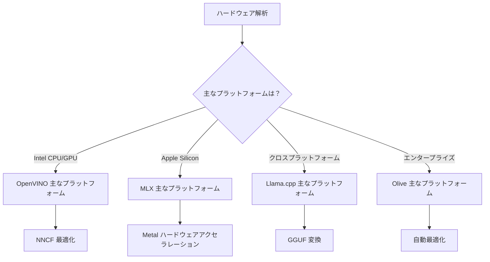
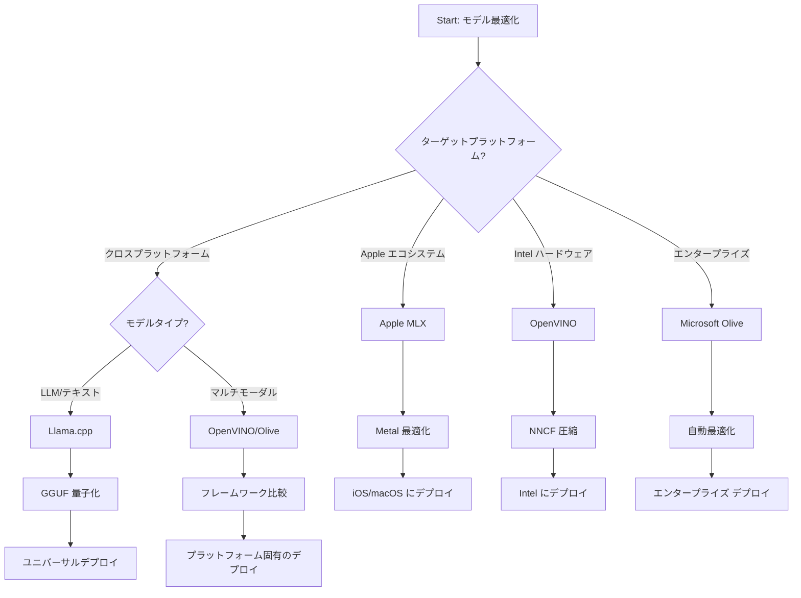
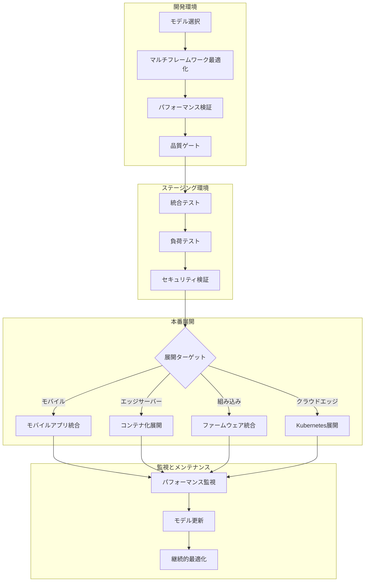

# セクション6：エッジAI開発ワークフローの総合

## 目次
1. [はじめに](#はじめに)
2. [学習目標](#学習目標)
3. [統合ワークフローの概要](#統合ワークフローの概要)
4. [フレームワーク選択マトリックス](#フレームワーク選択マトリックス)
5. [ベストプラクティスの総合](#ベストプラクティスの総合)
6. [デプロイメント戦略ガイド](#デプロイメント戦略ガイド)
7. [パフォーマンス最適化ワークフロー](#パフォーマンス最適化ワークフロー)
8. [本番準備チェックリスト](#本番準備チェックリスト)
9. [トラブルシューティングとモニタリング](#トラブルシューティングとモニタリング)
10. [エッジAIパイプラインの将来対策](#エッジaiパイプラインの将来対策)

## はじめに

エッジAI開発には、複数の最適化フレームワーク、デプロイ戦略、ハードウェアに関する高度な理解が求められます。この包括的な総合は、Llama.cpp、Microsoft Olive、OpenVINO、Apple MLXからの知見を統合し、効率を最大化し、品質を維持し、本番環境への展開を確実にする統一ワークフローを構築します。

本コースを通じて、個々の最適化フレームワークをそれぞれの強みや専門的なユースケースと共に探求してきましたが、実際のエッジAIプロジェクトでは、多様なフレームワークの技術を組み合わせたり、特定の制約や要件に最適なアプローチを戦略的に選択したりする必要があることが多いです。

本セクションでは、全フレームワークの集合知を行動可能なワークフロー、意思決定ツリー、ベストプラクティスにまとめ、モバイル機器、組み込みシステム、エッジサーバー向けに効率的かつ効果的に本番対応のエッジAIソリューションを構築できるようにします。このガイドは、開発ライフサイクル全体で情報に基づいた判断を下すための戦略的枠組みを提供します。

## 学習目標

このセクションを終了時に、以下が可能になります：

### 戦略的意思決定
- **プロジェクト要件、ハードウェア制約、デプロイシナリオに基づき** 最適な最適化フレームワークを評価・選択する
- <strong>複数の最適化技術を統合した包括的なワークフローを設計する</strong>
- 異なるフレームワーク間でモデル精度、推論速度、メモリ使用量、デプロイ複雑度の<strong>トレードオフを評価する</strong>

### ワークフロー統合
- <strong>複数の最適化フレームワークの強みを活用した統一開発パイプラインを実装する</strong>
- <strong>異なる環境間で一貫したモデル最適化と展開が可能な再現可能なワークフローを構築する</strong>
- <strong>最適化モデルが本番要件を満たすよう品質ゲートと検証プロセスを確立する</strong>

### パフォーマンス最適化
- **量子化、プルーニング、ハードウェア特化アクセラレーション技術を用いた体系的な最適化戦略を適用する**
- <strong>異なる最適化レベルとデプロイターゲットでのモデル性能を監視・ベンチマークする</strong>
- CPU、GPU、NPU、専門エッジアクセラレータ向けに<strong>特定ハードウェアプラットフォームに最適化する</strong>

### 本番展開
- 複数モデルフォーマットや推論エンジンに対応可能な<strong>スケーラブルなデプロイアーキテクチャを設計する</strong>
- 本番環境のエッジAIアプリケーションのために<strong>モニタリングと可観測性を実装する</strong>
- モデル更新、性能監視、システム最適化のための<strong>メンテナンスワークフローを確立する</strong>

### クロスプラットフォームの卓越性
- 最適化モデルを<strong>多様なハードウェアプラットフォームで展開し、性能の一貫性を維持する</strong>
- Windows、macOS、Linux、モバイル、組み込みシステムのための<strong>プラットフォーム特化最適化を扱う</strong>
- 異なるエッジ環境でのシームレスな展開を可能にする<strong>抽象層を作成する</strong>

## 統合ワークフローの概要

### フェーズ1：要件分析とフレームワーク選択

成功するエッジAIデプロイメントの基盤は、フレームワーク選択と最適化戦略を導く綿密な要件分析から始まります。

#### 1.1 ハードウェア評価


**主な考慮点：**
- **CPUアーキテクチャ**：x86、ARM、Apple Siliconの能力
- <strong>アクセラレータの有無</strong>：GPU、NPU、VPU、専用AIチップ
- <strong>メモリ制約</strong>：RAMの制限、ストレージ容量
- <strong>電源予算</strong>：バッテリー寿命、温度制約
- <strong>接続性</strong>：オフライン要件、帯域幅制限

#### 1.2 アプリケーション要件マトリックス

| 要件 | Llama.cpp | Microsoft Olive | OpenVINO | Apple MLX |
|-------------|-----------|-----------------|----------|-----------|
| クロスプラットフォーム | ✅ 非常に良い | ⚡ 良い | ⚡ 良い | ❌ Apple限定 |
| エンタープライズ統合 | ⚡ 基本 | ✅ 非常に良い | ✅ 非常に良い | ⚡ 限定的 |
| モバイル展開 | ✅ 非常に良い | ⚡ 良い | ⚡ 良い | ✅ iOSに非常に良い |
| リアルタイム推論 | ✅ 非常に良い | ✅ 非常に良い | ✅ 非常に良い | ✅ 非常に良い |
| モデル多様性 | ✅ LLMに特化 | ✅ 全モデル対応 | ✅ 全モデル対応 | ✅ LLMに特化 |
| 使いやすさ | ✅ シンプル | ✅ 自動化 | ⚡ 中程度 | ✅ シンプル |

### フェーズ2：モデル準備と最適化

#### 2.1 汎用モデル評価パイプライン

```python
# ユニバーサルモデル評価フレームワーク
class EdgeAIModelAssessment:
    def __init__(self, model_path, target_hardware):
        self.model_path = model_path
        self.target_hardware = target_hardware
        self.optimization_frameworks = []
        
    def assess_model_characteristics(self):
        """Analyze model size, architecture, and complexity"""
        return {
            'model_size': self.get_model_size(),
            'parameter_count': self.get_parameter_count(),
            'architecture_type': self.detect_architecture(),
            'quantization_compatibility': self.check_quantization_support()
        }
    
    def recommend_optimization_strategy(self):
        """Recommend optimal frameworks and techniques"""
        characteristics = self.assess_model_characteristics()
        
        if self.target_hardware.startswith('apple'):
            return self.mlx_optimization_strategy(characteristics)
        elif self.target_hardware.startswith('intel'):
            return self.openvino_optimization_strategy(characteristics)
        elif characteristics['model_size'] > 7_000_000_000:  # 7B+ パラメータ
            return self.enterprise_optimization_strategy(characteristics)
        else:
            return self.lightweight_optimization_strategy(characteristics)
```

#### 2.2 マルチフレームワーク最適化パイプライン

**段階的最適化アプローチ：**
1. <strong>初期変換</strong>：中間フォーマット（可能な場合はONNX）に変換
2. <strong>フレームワーク固有の最適化</strong>：専門的技術を適用
3. <strong>クロスバリデーション</strong>：ターゲットプラットフォームで性能検証
4. <strong>最終パッケージング</strong>：展開準備

```bash
# マルチフレームワーク最適化スクリプト
#!/bin/bash

MODEL_NAME="phi-3-mini"
BASE_MODEL="microsoft/Phi-3-mini-4k-instruct"

# フェーズ1: ONNX変換（ユニバーサル）
python convert_to_onnx.py --model $BASE_MODEL --output models/onnx/

# フェーズ2: プラットフォーム別最適化
if [[ "$TARGET_PLATFORM" == "intel" ]]; then
    # OpenVINO最適化
    python optimize_openvino.py --input models/onnx/ --output models/openvino/
elif [[ "$TARGET_PLATFORM" == "apple" ]]; then
    # MLX最適化
    python optimize_mlx.py --input $BASE_MODEL --output models/mlx/
elif [[ "$TARGET_PLATFORM" == "cross" ]]; then
    # Llama.cpp最適化
    python convert_to_gguf.py --input models/onnx/ --output models/gguf/
fi

# フェーズ3: 検証
python validate_optimization.py --original $BASE_MODEL --optimized models/$TARGET_PLATFORM/
```

### フェーズ3：性能検証とベンチマーク

#### 3.1 包括的ベンチマークフレームワーク

```python
class EdgeAIBenchmark:
    def __init__(self, optimized_models):
        self.models = optimized_models
        self.metrics = {
            'inference_time': [],
            'memory_usage': [],
            'accuracy_score': [],
            'throughput': [],
            'energy_consumption': []
        }
    
    def run_comprehensive_benchmark(self):
        """Execute standardized benchmarks across all optimized models"""
        test_inputs = self.generate_test_inputs()
        
        for model_framework, model_path in self.models.items():
            print(f"Benchmarking {model_framework}...")
            
            # レイテンシーテスト
            latency = self.measure_inference_latency(model_path, test_inputs)
            
            # メモリプロファイリング
            memory = self.profile_memory_usage(model_path)
            
            # 精度検証
            accuracy = self.validate_model_accuracy(model_path, test_inputs)
            
            # スループット解析
            throughput = self.measure_throughput(model_path)
            
            self.record_metrics(model_framework, latency, memory, accuracy, throughput)
    
    def generate_optimization_report(self):
        """Create comprehensive comparison report"""
        report = {
            'recommendations': self.analyze_performance_trade_offs(),
            'deployment_guidance': self.generate_deployment_recommendations(),
            'monitoring_requirements': self.define_monitoring_metrics()
        }
        return report
```

## フレームワーク選択マトリックス

### フレームワーク選択の意思決定ツリー



### 包括的選択基準

#### 1. 主なユースケース整合性

**大規模言語モデル（LLM）：**
- **Llama.cpp**：CPU中心でクロスプラットフォーム展開に最適
- **Apple MLX**：統合メモリのApple Siliconに最適
- **OpenVINO**：Intelハードウェア向けNNCF最適化に優れる
- **Microsoft Olive**：自動化を備えたエンタープライズ向けに理想的

**マルチモーダルモデル：**
- **OpenVINO**：視覚、音声、テキストの包括的サポート
- **Microsoft Olive**：複雑なパイプラインのエンタープライズグレード最適化
- **Llama.cpp**：テキストベースモデルに限定
- **Apple MLX**：マルチモーダルアプリケーション向けのサポート拡大中

#### 2. ハードウェアプラットフォームマトリックス

| プラットフォーム | 主要フレームワーク | 第二選択肢 | 専門機能 |
|----------|------------------|------------------|---------------------|
| Intel CPU/GPU | OpenVINO | Microsoft Olive | NNCF圧縮、Intel最適化 |
| NVIDIA GPU | Microsoft Olive | OpenVINO | CUDAアクセラレーション、エンタープライズ機能 |
| Apple Silicon | Apple MLX | Llama.cpp | Metalシェーダ、統合メモリ |
| ARMモバイル | Llama.cpp | OpenVINO | クロスプラットフォーム、最小依存性 |
| Edge TPU | OpenVINO | Microsoft Olive | 専用アクセラレータサポート |
| 組込みARM | Llama.cpp | OpenVINO | ミニマルフットプリント、効率的推論 |

#### 3. 開発ワークフロープリファレンス

**高速プロトタイピング：**
1. **Llama.cpp**：最速セットアップ、即結果
2. **Apple MLX**：シンプルなPython API、迅速な反復
3. **Microsoft Olive**：自動最適化、最小構成
4. **OpenVINO**：より複雑なセットアップ、包括的機能

**エンタープライズ本番環境：**
1. **Microsoft Olive**：エンタープライズ機能、Azure統合
2. **OpenVINO**：Intelエコシステム、包括的ツール
3. **Apple MLX**：Apple専用のエンタープライズアプリケーション
4. **Llama.cpp**：シンプル展開、限定的なエンタープライズ機能

## ベストプラクティスの総合

### 汎用最適化原則

#### 1. 進行的最適化戦略

```python
class ProgressiveOptimization:
    def __init__(self, base_model):
        self.base_model = base_model
        self.optimization_stages = [
            'baseline_measurement',
            'format_conversion',
            'quantization_optimization',
            'hardware_acceleration',
            'production_validation'
        ]
    
    def execute_progressive_optimization(self):
        """Apply optimization techniques incrementally"""
        
        # ステージ1: ベースライン測定
        baseline_metrics = self.measure_baseline_performance()
        
        # ステージ2: フォーマット変換
        converted_model = self.convert_to_optimal_format()
        conversion_metrics = self.measure_performance(converted_model)
        
        # ステージ3: 量子化
        quantized_model = self.apply_quantization(converted_model)
        quantization_metrics = self.measure_performance(quantized_model)
        
        # ステージ4: ハードウェアアクセラレーション
        accelerated_model = self.enable_hardware_acceleration(quantized_model)
        acceleration_metrics = self.measure_performance(accelerated_model)
        
        # ステージ5: 検証
        production_ready = self.validate_for_production(accelerated_model)
        
        return self.compile_optimization_report(
            baseline_metrics, conversion_metrics, 
            quantization_metrics, acceleration_metrics
        )
```

#### 2. 品質ゲートの実装

**精度維持ゲート：**
- 元のモデル精度の95％以上を維持
- 代表的なテストデータセットで検証
- 本番検証のためにA/Bテストを実施

**性能改善ゲート：**
- 最低2倍の速度向上を実現
- メモリフットプリントを少なくとも50％削減
- 推論時間の一貫性を検証

**本番準備ゲート：**
- 負荷下でのストレステストを合格
- 長期にわたる安定した性能を実証
- セキュリティおよびプライバシー要件を検証

### フレームワーク固有のベストプラクティス統合

#### 1. 量子化戦略の総合

```python
# 統一された量子化アプローチ
class UnifiedQuantizationStrategy:
    def __init__(self, model, target_platform):
        self.model = model
        self.platform = target_platform
        
    def select_optimal_quantization(self):
        """Choose best quantization based on platform and requirements"""
        
        if self.platform == 'apple_silicon':
            return self.mlx_quantization_strategy()
        elif self.platform == 'intel_hardware':
            return self.openvino_quantization_strategy()
        elif self.platform == 'cross_platform':
            return self.llamacpp_quantization_strategy()
        else:
            return self.olive_quantization_strategy()
    
    def mlx_quantization_strategy(self):
        """Apple MLX-specific quantization"""
        return {
            'method': 'mlx_quantize',
            'precision': 'int4',
            'group_size': 64,
            'optimization_target': 'unified_memory'
        }
    
    def openvino_quantization_strategy(self):
        """OpenVINO NNCF quantization"""
        return {
            'method': 'nncf_quantize',
            'precision': 'int8',
            'calibration_method': 'post_training',
            'optimization_target': 'intel_hardware'
        }
```

#### 2. ハードウェアアクセラレーション最適化

**CPU最適化の総合：**
- **SIMD命令**：フレームワーク全体で最適化されたカーネルを活用
- <strong>メモリ帯域</strong>：キャッシュ効率のためデータレイアウトを最適化
- <strong>スレッディング</strong>：リソース制約に応じて並列性を調整

**GPUアクセラレーションのベストプラクティス：**
- <strong>バッチ処理</strong>：適切なバッチサイズでスループットを最大化
- <strong>メモリ管理</strong>：GPUメモリの割り当てと転送を最適化
- <strong>精度</strong>：対応時はFP16を使用し性能向上

**NPU／専用アクセラレーター最適化：**
- <strong>モデルアーキテクチャ</strong>：アクセラレーターの能力と互換性を確保
- <strong>データフロー</strong>：アクセラレーター効率のため入出力パイプラインを最適化
- <strong>フォールバック戦略</strong>：サポート外操作にはCPUフォールバックを実装

## デプロイメント戦略ガイド

### 汎用デプロイアーキテクチャ



### プラットフォーム固有のデプロイパターン

#### 1. モバイルデプロイメント戦略

```yaml
# Mobile Deployment Configuration
mobile_deployment:
  ios:
    framework: apple_mlx
    optimization:
      quantization: int4
      memory_mapping: true
      background_execution: limited
    packaging:
      format: mlx
      bundle_size: <50MB
      
  android:
    framework: llama_cpp
    optimization:
      quantization: q4_k_m
      threading: android_optimized
      memory_management: conservative
    packaging:
      format: gguf
      apk_size: <100MB
      
  cross_platform:
    framework: onnx_runtime
    optimization:
      quantization: int8
      execution_provider: cpu
    packaging:
      format: onnx
      shared_libraries: minimal
```

#### 2. エッジサーバーデプロイメント

```yaml
# Edge Server Deployment Configuration
edge_server:
  intel_based:
    framework: openvino
    optimization:
      quantization: int8
      acceleration: cpu_gpu_auto
      batch_processing: dynamic
    deployment:
      container: openvino_runtime
      orchestration: kubernetes
      scaling: horizontal
      
  nvidia_based:
    framework: microsoft_olive
    optimization:
      quantization: int4
      acceleration: cuda
      tensor_parallelism: true
    deployment:
      container: nvidia_triton
      orchestration: kubernetes
      scaling: gpu_aware
```

### コンテナ化のベストプラクティス

```dockerfile
# Multi-Framework Edge AI Container
FROM ubuntu:22.04 as base

# Install common dependencies
RUN apt-get update && apt-get install -y \
    python3 \
    python3-pip \
    build-essential \
    cmake \
    && rm -rf /var/lib/apt/lists/*

# Framework-specific stages
FROM base as openvino
RUN pip install openvino nncf optimum[intel]

FROM base as llamacpp
RUN git clone https://github.com/ggerganov/llama.cpp.git \
    && cd llama.cpp && make LLAMA_OPENBLAS=1

FROM base as olive
RUN pip install olive-ai[auto-opt] onnxruntime-genai

# Production stage with selected framework
FROM openvino as production
COPY models/ /app/models/
COPY src/ /app/src/
WORKDIR /app

EXPOSE 8080
CMD ["python3", "src/inference_server.py"]
```

## パフォーマンス最適化ワークフロー

### 体系的パフォーマンスチューニング

#### 1. パフォーマンスプロファイリングパイプライン

```python
class EdgeAIPerformanceProfiler:
    def __init__(self, model_path, framework):
        self.model_path = model_path
        self.framework = framework
        self.profiling_results = {}
    
    def comprehensive_profiling(self):
        """Execute comprehensive performance analysis"""
        
        # CPU プロファイリング
        cpu_profile = self.profile_cpu_usage()
        
        # メモリープロファイリング
        memory_profile = self.profile_memory_usage()
        
        # 推論レイテンシ
        latency_profile = self.profile_inference_latency()
        
        # スループット分析
        throughput_profile = self.profile_throughput()
        
        # エネルギー消費（利用可能な場合）
        energy_profile = self.profile_energy_consumption()
        
        return self.compile_performance_report(
            cpu_profile, memory_profile, latency_profile,
            throughput_profile, energy_profile
        )
    
    def identify_bottlenecks(self):
        """Automatically identify performance bottlenecks"""
        bottlenecks = []
        
        if self.profiling_results['cpu_utilization'] > 80:
            bottlenecks.append('cpu_bound')
        
        if self.profiling_results['memory_usage'] > 90:
            bottlenecks.append('memory_bound')
        
        if self.profiling_results['inference_variance'] > 20:
            bottlenecks.append('inconsistent_performance')
        
        return self.generate_optimization_recommendations(bottlenecks)
```

#### 2. 自動最適化パイプライン

```python
class AutomatedOptimizationPipeline:
    def __init__(self, base_model, target_constraints):
        self.base_model = base_model
        self.constraints = target_constraints
        self.optimization_history = []
    
    def execute_optimization_search(self):
        """Systematically search optimization space"""
        
        optimization_candidates = [
            {'quantization': 'int8', 'pruning': 0.1},
            {'quantization': 'int4', 'pruning': 0.2},
            {'quantization': 'int8', 'acceleration': 'gpu'},
            {'quantization': 'int4', 'acceleration': 'npu'}
        ]
        
        best_configuration = None
        best_score = 0
        
        for config in optimization_candidates:
            optimized_model = self.apply_optimization(config)
            score = self.evaluate_optimization(optimized_model)
            
            if score > best_score and self.meets_constraints(optimized_model):
                best_score = score
                best_configuration = config
            
            self.optimization_history.append({
                'config': config,
                'score': score,
                'model': optimized_model
            })
        
        return best_configuration, self.optimization_history
```

### 多目的最適化

#### 1. エッジAIのパレート最適化

```python
class ParetoOptimization:
    def __init__(self, objectives=['speed', 'accuracy', 'memory']):
        self.objectives = objectives
        self.pareto_frontier = []
    
    def find_pareto_optimal_solutions(self, optimization_results):
        """Identify Pareto-optimal configurations"""
        
        for result in optimization_results:
            is_dominated = False
            
            for frontier_point in self.pareto_frontier:
                if self.dominates(frontier_point, result):
                    is_dominated = True
                    break
            
            if not is_dominated:
                # フロンティアから支配された点を削除する
                self.pareto_frontier = [
                    point for point in self.pareto_frontier 
                    if not self.dominates(result, point)
                ]
                
                self.pareto_frontier.append(result)
        
        return self.pareto_frontier
    
    def recommend_configuration(self, user_preferences):
        """Recommend configuration based on user preferences"""
        
        weighted_scores = []
        for config in self.pareto_frontier:
            score = sum(
                user_preferences[obj] * config['metrics'][obj] 
                for obj in self.objectives
            )
            weighted_scores.append((score, config))
        
        return max(weighted_scores, key=lambda x: x[0])[1]
```

## 本番準備チェックリスト

### 包括的本番検証

#### 1. モデル品質保証

```python
class ProductionReadinessValidator:
    def __init__(self, optimized_model, production_requirements):
        self.model = optimized_model
        self.requirements = production_requirements
        self.validation_results = {}
    
    def validate_model_quality(self):
        """Comprehensive model quality validation"""
        
        # 精度検証
        accuracy_result = self.validate_accuracy()
        
        # 性能検証
        performance_result = self.validate_performance()
        
        # ロバストネス試験
        robustness_result = self.validate_robustness()
        
        # セキュリティ評価
        security_result = self.validate_security()
        
        # コンプライアンス検証
        compliance_result = self.validate_compliance()
        
        return self.compile_validation_report(
            accuracy_result, performance_result, robustness_result,
            security_result, compliance_result
        )
    
    def generate_certification_report(self):
        """Generate production certification report"""
        return {
            'model_signature': self.generate_model_signature(),
            'validation_timestamp': datetime.now(),
            'validation_results': self.validation_results,
            'deployment_approval': self.check_deployment_approval(),
            'monitoring_requirements': self.define_monitoring_requirements()
        }
```

#### 2. 本番展開チェックリスト

**展開前検証：**
- [ ] モデル精度が最低要件（ベースラインの95％以上）を満たす
- [ ] 性能目標（レイテンシ、スループット、メモリ）を達成
- [ ] セキュリティ脆弱性の評価と軽減
- [ ] 予想される負荷下でのストレステスト完了
- [ ] 障害シナリオの試験と回復手順の検証
- [ ] 監視とアラートシステムの設定
- [ ] ロールバック手順の試験と文書化

**展開プロセス：**
- [ ] ブルーグリーンデプロイメント戦略実装
- [ ] トラフィックの段階的増加設定
- [ ] リアルタイム監視ダッシュボード稼働
- [ ] パフォーマンスベースライン確立
- [ ] エラー率閾値定義
- [ ] 自動ロールバックトリガー設定

**展開後モニタリング：**
- [ ] モデルドリフト検知稼働
- [ ] パフォーマンス低下アラート設定
- [ ] リソース使用率監視有効化
- [ ] ユーザー体験指標の追跡
- [ ] モデルバージョン管理および系統維持
- [ ] 定期的なモデル性能レビューの予定策定

### 継続的インテグレーション／継続的デプロイ（CI/CD）

```yaml
# Edge AI CI/CD Pipeline Configuration
edge_ai_pipeline:
  stages:
    - model_validation
    - optimization
    - testing
    - staging_deployment
    - production_deployment
    - monitoring
  
  model_validation:
    accuracy_threshold: 0.95
    performance_baseline: required
    security_scan: enabled
    
  optimization:
    frameworks:
      - llama_cpp
      - openvino
      - microsoft_olive
    validation:
      cross_validation: enabled
      performance_comparison: required
      
  testing:
    unit_tests: comprehensive
    integration_tests: full_pipeline
    load_tests: production_scale
    security_tests: comprehensive
    
  deployment:
    strategy: blue_green
    traffic_ramping: gradual
    rollback: automatic
    monitoring: real_time
```

## トラブルシューティングとモニタリング

### 汎用トラブルシューティングフレームワーク

#### 1. 一般的な問題と解決策

**パフォーマンス問題：**
```python
class PerformanceTroubleshooter:
    def __init__(self, model_metrics):
        self.metrics = model_metrics
        
    def diagnose_performance_issues(self):
        """Systematic performance issue diagnosis"""
        
        issues = []
        
        # 高遅延の診断
        if self.metrics['avg_latency'] > self.metrics['target_latency']:
            issues.append(self.diagnose_latency_issues())
        
        # メモリ使用量の診断
        if self.metrics['memory_usage'] > self.metrics['memory_limit']:
            issues.append(self.diagnose_memory_issues())
        
        # スループットの診断
        if self.metrics['throughput'] < self.metrics['target_throughput']:
            issues.append(self.diagnose_throughput_issues())
        
        return self.generate_resolution_plan(issues)
    
    def diagnose_latency_issues(self):
        """Specific latency troubleshooting"""
        potential_causes = []
        
        if self.metrics['cpu_utilization'] > 80:
            potential_causes.append('cpu_bottleneck')
        
        if self.metrics['memory_bandwidth'] > 90:
            potential_causes.append('memory_bandwidth_limit')
        
        if self.metrics['model_size'] > self.metrics['optimal_size']:
            potential_causes.append('model_too_large')
        
        return {
            'issue': 'high_latency',
            'causes': potential_causes,
            'solutions': self.generate_latency_solutions(potential_causes)
        }
```

**フレームワーク固有のトラブルシューティング：**

| 問題 | Llama.cpp | Microsoft Olive | OpenVINO | Apple MLX |
|-------|-----------|-----------------|----------|-----------|
| メモリ問題 | コンテキスト長を減らす | バッチサイズを減らす | キャッシュを有効化 | メモリマッピングを使用 |
| 推論遅延 | SIMDを有効化 | 量子化を確認 | スレッド最適化 | Metalを有効化 |
| 精度低下 | より高い量子化 | QATで再トレーニング | キャリブレーション増加 | 量子化後微調整 |
| 互換性 | モデルフォーマット確認 | フレームワークバージョン確認 | ドライバ更新 | macOSバージョン確認 |

#### 2. 本番モニタリング戦略

```python
class EdgeAIMonitoring:
    def __init__(self, deployment_config):
        self.config = deployment_config
        self.metrics_collectors = []
        self.alerting_rules = []
    
    def setup_comprehensive_monitoring(self):
        """Configure comprehensive monitoring for Edge AI deployment"""
        
        # モデルパフォーマンスの監視
        self.setup_model_performance_monitoring()
        
        # インフラストラクチャの監視
        self.setup_infrastructure_monitoring()
        
        # ビジネスメトリクスの監視
        self.setup_business_metrics_monitoring()
        
        # セキュリティ監視
        self.setup_security_monitoring()
    
    def setup_model_performance_monitoring(self):
        """Model-specific performance monitoring"""
        metrics = [
            'inference_latency_p50',
            'inference_latency_p95',
            'inference_latency_p99',
            'model_accuracy_drift',
            'prediction_confidence_distribution',
            'error_rate',
            'throughput_requests_per_second'
        ]
        
        for metric in metrics:
            self.add_metric_collector(metric)
            self.add_alerting_rule(metric)
    
    def detect_model_drift(self):
        """Automated model drift detection"""
        drift_indicators = [
            self.statistical_drift_detection(),
            self.performance_drift_detection(),
            self.data_distribution_shift_detection()
        ]
        
        return self.aggregate_drift_signals(drift_indicators)
```

### 自動化された問題解決

```python
class AutomatedIssueResolution:
    def __init__(self, monitoring_system):
        self.monitoring = monitoring_system
        self.resolution_strategies = {}
    
    def handle_performance_degradation(self, alert):
        """Automated performance issue resolution"""
        
        if alert['type'] == 'high_latency':
            return self.resolve_latency_issue(alert)
        elif alert['type'] == 'high_memory_usage':
            return self.resolve_memory_issue(alert)
        elif alert['type'] == 'accuracy_drift':
            return self.resolve_accuracy_issue(alert)
        
    def resolve_latency_issue(self, alert):
        """Automated latency issue resolution"""
        resolution_steps = [
            'increase_cpu_allocation',
            'enable_model_caching',
            'reduce_batch_size',
            'switch_to_quantized_model'
        ]
        
        for step in resolution_steps:
            if self.apply_resolution_step(step):
                return f"Resolved latency issue with: {step}"
        
        return "Escalating to human operator"
```

## エッジAIパイプラインの将来対策

### 新興技術の統合

#### 1. 次世代ハードウェア対応

```python
class FutureHardwareIntegration:
    def __init__(self):
        self.supported_accelerators = [
            'npu_next_gen',
            'quantum_processors',
            'neuromorphic_chips',
            'optical_processors'
        ]
    
    def design_adaptive_pipeline(self):
        """Create hardware-agnostic optimization pipeline"""
        
        pipeline = {
            'model_preparation': self.universal_model_preparation(),
            'hardware_detection': self.dynamic_hardware_detection(),
            'optimization_selection': self.adaptive_optimization_selection(),
            'performance_validation': self.hardware_agnostic_validation()
        }
        
        return pipeline
    
    def adaptive_optimization_selection(self):
        """Dynamically select optimization based on available hardware"""
        
        def optimize_for_hardware(model, available_hardware):
            if 'npu' in available_hardware:
                return self.npu_optimization(model)
            elif 'quantum' in available_hardware:
                return self.quantum_optimization(model)
            elif 'neuromorphic' in available_hardware:
                return self.neuromorphic_optimization(model)
            else:
                return self.fallback_optimization(model)
        
        return optimize_for_hardware
```

#### 2. モデルアーキテクチャの進化

**新興アーキテクチャへの対応：**
- **Mixture of Experts (MoE)**：効率化のためのスパースモデルアーキテクチャ
- **Retrieval-Augmented Generation**：ハイブリッドモデル＋知識ベースシステム
- <strong>マルチモーダルモデル</strong>：視覚＋言語＋音声の統合
- <strong>フェデレーテッドラーニング</strong>：分散型トレーニングと最適化

```python
class NextGenModelSupport:
    def __init__(self):
        self.architecture_handlers = {
            'moe': self.handle_mixture_of_experts,
            'rag': self.handle_retrieval_augmented,
            'multimodal': self.handle_multimodal,
            'federated': self.handle_federated_learning
        }
    
    def handle_mixture_of_experts(self, model):
        """Optimize Mixture of Experts models for edge deployment"""
        optimization_strategy = {
            'expert_pruning': True,
            'routing_optimization': True,
            'expert_quantization': 'per_expert',
            'load_balancing': 'dynamic'
        }
        return self.apply_moe_optimization(model, optimization_strategy)
```

### 継続学習と適応

#### 1. オンライン学習の統合

```python
class EdgeOnlineLearning:
    def __init__(self, base_model, learning_rate=0.001):
        self.base_model = base_model
        self.learning_rate = learning_rate
        self.adaptation_buffer = []
    
    def continuous_adaptation(self, new_data, feedback):
        """Continuously adapt model based on edge data"""
        
        # プライバシー保護のためのローカル適応
        local_updates = self.compute_local_gradients(new_data, feedback)
        
        # 制約を伴う更新の適用
        adapted_model = self.apply_constrained_updates(
            self.base_model, local_updates
        )
        
        # 適応の品質を検証する
        if self.validate_adaptation(adapted_model):
            self.base_model = adapted_model
            return True
        
        return False
    
    def federated_learning_participation(self):
        """Participate in federated learning while preserving privacy"""
        
        # ローカルモデルの更新を計算する
        local_updates = self.compute_private_updates()
        
        # 差分プライバシー保護
        private_updates = self.apply_differential_privacy(local_updates)
        
        # フェデレーテッドラーニングコーディネーターと共有する
        return self.share_updates(private_updates)
```

#### 2. サステナビリティとグリーンAI

```python
class GreenEdgeAI:
    def __init__(self, sustainability_targets):
        self.targets = sustainability_targets
        self.energy_monitor = EnergyMonitor()
    
    def optimize_for_sustainability(self, model):
        """Optimize model for minimal environmental impact"""
        
        optimization_objectives = [
            'minimize_energy_consumption',
            'maximize_hardware_utilization',
            'reduce_model_training_cost',
            'extend_device_lifetime'
        ]
        
        return self.multi_objective_green_optimization(
            model, optimization_objectives
        )
    
    def carbon_aware_deployment(self):
        """Deploy models considering carbon footprint"""
        
        deployment_strategy = {
            'prefer_renewable_energy_regions': True,
            'optimize_for_energy_efficiency': True,
            'minimize_data_transfer': True,
            'lifecycle_carbon_accounting': True
        }
        
        return deployment_strategy
```

## 結論

この包括的なワークフロー総合は、エッジAI最適化の知識の集大成であり、主要なすべての最適化フレームワークからのベストプラクティスを統一された本番対応アプローチにまとめたものです。これらのガイドラインに従うことで、以下を達成できます：

<strong>最適なパフォーマンスの実現</strong>：体系的なフレームワーク選択、進行的最適化、包括的検証により、エッジAIアプリケーションが最大効率を発揮します。

<strong>本番対応の確保</strong>：厳密なテスト、モニタリング、品質ゲートにより、現実世界環境での信頼できる展開と運用を保証します。

<strong>長期的成功の維持</strong>：継続的モニタリング、自動問題解決、適応戦略により、エッジAIソリューションのパフォーマンスと関連性を保ちます。

<strong>投資の将来対策</strong>：柔軟でハードウェア非依存のパイプラインを設計し、新技術や要件に対応できるようにします。

エッジAIの分野は急速に進化しており、新しいハードウェアプラットフォーム、最適化技術、デプロイ戦略が次々と登場しています。この総合は、この複雑さを乗り越え、安全で効率的、かつメンテナンスしやすいエッジAIソリューションを構築するための基盤を提供します。

最良の最適化戦略とは、特定の要件を満たしつつ、それらの要件の変化に柔軟に対応できるものです。このガイドを情報に基づく意思決定の枠組みとして利用しつつ、必ず実証的なテストと実際のデプロイ経験で選択を検証してください。

## ➡️ 次に進むこと


- [07: Qualcomm QNN フレームワーク詳細解析](./07.QualcommQNN.md)

---

<!-- CO-OP TRANSLATOR DISCLAIMER START -->
**免責事項**：
本書類は AI 翻訳サービス [Co-op Translator](https://github.com/Azure/co-op-translator) を使用して翻訳されています。正確性を期していますが、自動翻訳には誤りや不正確な部分が含まれる可能性があることをご承知おきください。原文の原語版が正式な情報源とみなされるべきです。重要な情報については、専門の人間による翻訳を推奨します。本翻訳の利用により生じたいかなる誤解や解釈違いについても、当方は責任を負いかねます。
<!-- CO-OP TRANSLATOR DISCLAIMER END -->