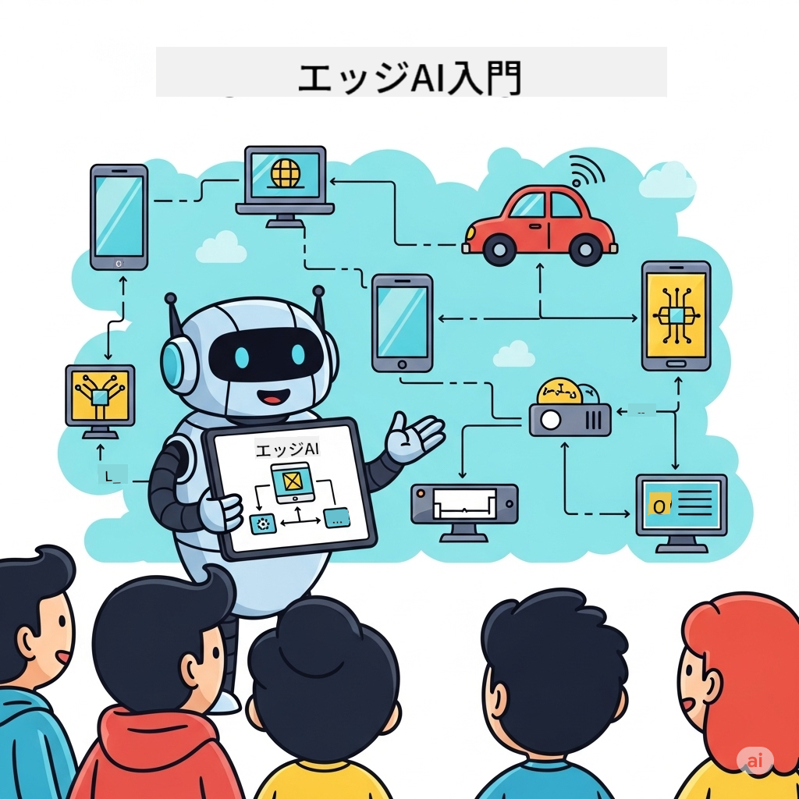

<!--
CO_OP_TRANSLATOR_METADATA:
{
  "original_hash": "d2366cf5031433b5a0bc78cd4a2bbe64",
  "translation_date": "2025-12-15T14:48:21+00:00",
  "source_file": "README.md",
  "language_code": "ja"
}
-->
# EdgeAI for Beginners 




[](https://GitHub.com/microsoft/edgeai-for-beginners/graphs/contributors)
[](https://GitHub.com/microsoft/edgeai-for-beginners/issues)
[](https://GitHub.com/microsoft/edgeai-for-beginners/pulls)
[](http://makeapullrequest.com)

[](https://GitHub.com/microsoft/edgeai-for-beginners/watchers)
[](https://GitHub.com/microsoft/edgeai-for-beginners/fork)
[](https://GitHub.com/microsoft/edgeai-for-beginners/stargazers)


[](https://discord.gg/nTYy5BXMWG)

これらのリソースを使い始めるには、以下の手順に従ってください：

1. **リポジトリをフォークする**: クリック [](https://GitHub.com/microsoft/edgeai-for-beginners/fork)
2. **リポジトリをクローンする**:   `git clone https://github.com/microsoft/edgeai-for-beginners.git`
3. [**Azure AI Foundry Discordに参加して、専門家や他の開発者と交流する**](https://discord.com/invite/ByRwuEEgH4)


### 🌐 多言語サポート

#### GitHub Actionによるサポート（自動化＆常に最新）

<!-- CO-OP TRANSLATOR LANGUAGES TABLE START -->
[Arabic](../ar/README.md) | [Bengali](../bn/README.md) | [Bulgarian](../bg/README.md) | [Burmese (Myanmar)](../my/README.md) | [Chinese (Simplified)](../zh/README.md) | [Chinese (Traditional, Hong Kong)](../hk/README.md) | [Chinese (Traditional, Macau)](../mo/README.md) | [Chinese (Traditional, Taiwan)](../tw/README.md) | [Croatian](../hr/README.md) | [Czech](../cs/README.md) | [Danish](../da/README.md) | [Dutch](../nl/README.md) | [Estonian](../et/README.md) | [Finnish](../fi/README.md) | [French](../fr/README.md) | [German](../de/README.md) | [Greek](../el/README.md) | [Hebrew](../he/README.md) | [Hindi](../hi/README.md) | [Hungarian](../hu/README.md) | [Indonesian](../id/README.md) | [Italian](../it/README.md) | [Japanese](./README.md) | [Kannada](../kn/README.md) | [Korean](../ko/README.md) | [Lithuanian](../lt/README.md) | [Malay](../ms/README.md) | [Malayalam](../ml/README.md) | [Marathi](../mr/README.md) | [Nepali](../ne/README.md) | [Nigerian Pidgin](../pcm/README.md) | [Norwegian](../no/README.md) | [Persian (Farsi)](../fa/README.md) | [Polish](../pl/README.md) | [Portuguese (Brazil)](../br/README.md) | [Portuguese (Portugal)](../pt/README.md) | [Punjabi (Gurmukhi)](../pa/README.md) | [Romanian](../ro/README.md) | [Russian](../ru/README.md) | [Serbian (Cyrillic)](../sr/README.md) | [Slovak](../sk/README.md) | [Slovenian](../sl/README.md) | [Spanish](../es/README.md) | [Swahili](../sw/README.md) | [Swedish](../sv/README.md) | [Tagalog (Filipino)](../tl/README.md) | [Tamil](../ta/README.md) | [Telugu](../te/README.md) | [Thai](../th/README.md) | [Turkish](../tr/README.md) | [Ukrainian](../uk/README.md) | [Urdu](../ur/README.md) | [Vietnamese](../vi/README.md)
<!-- CO-OP TRANSLATOR LANGUAGES TABLE END -->

**追加の翻訳言語をご希望の場合は、[こちら](https://github.com/Azure/co-op-translator/blob/main/getting_started/supported-languages.md)にリストされています。**
## はじめに

**EdgeAI for Beginners**へようこそ — エッジ人工知能の変革的な世界への包括的な旅路です。このコースは強力なAI機能とエッジデバイス上での実用的な実装のギャップを埋め、データが生成され意思決定が行われる場所で直接AIの可能性を活用できるようにします。

### 習得できること

このコースでは基本的な概念から本番環境対応の実装までをカバーします：
- **エッジ展開に最適化された小型言語モデル（SLM）**
- **多様なプラットフォームに対応したハードウェア認識最適化**
- **プライバシー保護機能を備えたリアルタイム推論**
- **企業向けの本番展開戦略**

### なぜEdgeAIが重要か

Edge AIは現代の重要な課題に対応するパラダイムシフトを表します：
- **プライバシーとセキュリティ**：クラウドにデータを送らずにローカルで機密データを処理
- **リアルタイム性能**：時間が重要なアプリケーションでネットワーク遅延を排除
- **コスト効率**：帯域幅とクラウドコンピューティングのコスト削減
- **堅牢な運用**：ネットワーク障害時も機能を維持
- **規制遵守**：データ主権要件を満たす

### Edge AIとは

Edge AIは、AIアルゴリズムや言語モデルをクラウドに依存せず、データが生成される近くのハードウェア上でローカルに実行することを指します。これにより遅延が減り、プライバシーが向上し、リアルタイムの意思決定が可能になります。

### コア原則：
- **オンデバイス推論**：AIモデルはエッジデバイス（スマホ、ルーター、マイクロコントローラー、産業用PC）上で動作
- **オフライン機能**：常時インターネット接続なしで動作可能
- **低遅延**：リアルタイムシステムに適した即時応答
- **データ主権**：機密データをローカルに保持し、セキュリティとコンプライアンスを向上

### 小型言語モデル（SLM）

Phi-4、Mistral-7B、GemmaなどのSLMは、大型LLMの最適化版であり、以下のために訓練または蒸留されています：
- **メモリフットプリントの削減**：限られたエッジデバイスのメモリを効率的に使用
- **計算負荷の低減**：CPUやエッジGPUの性能に最適化
- **高速起動時間**：応答性の高いアプリケーションのための迅速な初期化

これにより、以下の制約を満たしつつ強力なNLP機能を実現します：
- **組み込みシステム**：IoTデバイスや産業用コントローラー
- **モバイルデバイス**：オフライン機能を備えたスマートフォンやタブレット
- **IoTデバイス**：限られたリソースのセンサーやスマートデバイス
- **エッジサーバー**：限られたGPUリソースのローカル処理ユニット
- **パーソナルコンピューター**：デスクトップやノートパソコンでの展開シナリオ

## コースモジュールとナビゲーション

| モジュール | トピック | フォーカス領域 | 主要内容 | レベル | 所要時間 |
|--------|-------|------------|-------------|--------|----------|
| [📖 00 ](./introduction.md) | [EdgeAI入門](./introduction.md) | 基礎と背景 | EdgeAI概要・業界応用・SLM紹介・学習目標 | 初心者 | 1-2時間 |
| [📚 01](../../Module01) | [EdgeAI基礎](./Module01/README.md) | クラウドとエッジAIの比較 | EdgeAI基礎・実世界の事例・実装ガイド・エッジ展開 | 初心者 | 3-4時間 |
| [🧠 02](../../Module02) | [SLMモデル基礎](./Module02/README.md) | モデルファミリーとアーキテクチャ | Phiファミリー・Qwenファミリー・Gemmaファミリー・BitNET・μModel・Phi-Silica | 初心者 | 4-5時間 |
| [🚀 03](../../Module03) | [SLM展開実践](./Module03/README.md) | ローカル＆クラウド展開 | 応用学習・ローカル環境・クラウド展開 | 中級 | 4-5時間 |
| [⚙️ 04](../../Module04) | [モデル最適化ツールキット](./Module04/README.md) | クロスプラットフォーム最適化 | 入門・Llama.cpp・Microsoft Olive・OpenVINO・Apple MLX・ワークフロー合成 | 中級 | 5-6時間 |
| [🔧 05](../../Module05) | [SLMOps本番運用](./Module05/README.md) | 本番運用 | SLMOps入門・モデル蒸留・ファインチューニング・本番展開 | 上級 | 5-6時間 |
| [🤖 06](../../Module06) | [AIエージェント＆関数呼び出し](./Module06/README.md) | エージェントフレームワーク＆MCP | エージェント入門・関数呼び出し・モデルコンテキストプロトコル | 上級 | 4-5時間 |
| [💻 07](../../Module07) | [プラットフォーム実装](./Module07/README.md) | クロスプラットフォームサンプル | AIツールキット・Foundry Local・Windows開発 | 上級 | 3-4時間 |
| [🏭 08](../../Module08) | [Foundry Localツールキット](./Module08/README.md) | 本番対応サンプル | サンプルアプリケーション（詳細は下記参照） | エキスパート | 8-10時間 |

### 🏭 **モジュール08：サンプルアプリケーション**

- [01: RESTチャットクイックスタート](./Module08/samples/01/README.md)
- [02: OpenAI SDK統合](./Module08/samples/02/README.md)
- [03: モデル発見＆ベンチマーク](./Module08/samples/03/README.md)
- [04: Chainlit RAGアプリケーション](./Module08/samples/04/README.md)
- [05: マルチエージェントオーケストレーション](./Module08/samples/05/README.md)
- [06: モデルズ・アズ・ツールズルーター](./Module08/samples/06/README.md)
- [07: 直接APIクライアント](./Module08/samples/07/README.md)
- [08: Windows 11チャットアプリ](./Module08/samples/08/README.md)
- [09: 高度なマルチエージェントシステム](./Module08/samples/09/README.md)
- [10: Foundryツールフレームワーク](./Module08/samples/10/README.md)

### 🎓 **ワークショップ：ハンズオン学習パス**

本番対応の実装を含む包括的なハンズオンワークショップ資料：

- **[ワークショップガイド](./Workshop/Readme.md)** - 完全な学習目標、成果、リソースナビゲーション
- **Pythonサンプル**（6セッション） - ベストプラクティス、エラーハンドリング、詳細なドキュメントを更新
- **Jupyterノートブック**（8インタラクティブ） - ベンチマークとパフォーマンス監視付きのステップバイステップチュートリアル
- **セッションガイド** - 各ワークショップセッションの詳細なマークダウンガイド
- **検証ツール** - コード品質検証とスモークテスト用スクリプト

**作成するもの：**
- ストリーミング対応のローカルAIチャットアプリケーション
- 品質評価付きRAGパイプライン（RAGAS）
- マルチモデルベンチマーク＆比較ツール
- マルチエージェントオーケストレーションシステム
- タスクベース選択によるインテリジェントモデルルーティング

### 📊 **学習パス概要**
- **総所要時間**：36-45時間
- **初心者パス**：モジュール01-02（7-9時間）  
- **中級パス**：モジュール03-04（9-11時間）
- **上級パス**：モジュール05-07（12-15時間）
- **エキスパートパス**：モジュール08（8-10時間）

## 作成するもの

### 🎯 コアコンピテンシー
- **Edge AIアーキテクチャ**：クラウド統合を備えたローカルファーストAIシステムの設計
- **モデル最適化**: エッジ展開のためのモデルの量子化と圧縮（85%の速度向上、75%のサイズ削減）
- **マルチプラットフォーム展開**: Windows、モバイル、組み込み、クラウドエッジハイブリッドシステム
- **本番運用**: エッジAIの監視、スケーリング、保守

### 🏗️ 実践プロジェクト
- **Foundryローカルチャットアプリ**: モデル切り替え機能を備えたWindows 11ネイティブアプリケーション
- **マルチエージェントシステム**: 複雑なワークフローのためのコーディネーターと専門エージェント  
- **RAGアプリケーション**: ベクトル検索を用いたローカルドキュメント処理
- **モデルルーター**: タスク分析に基づくモデル間のインテリジェントな選択
- **APIフレームワーク**: ストリーミングとヘルスモニタリングを備えた本番対応クライアント
- **クロスプラットフォームツール**: LangChain/Semantic Kernel統合パターン

### 🏢 業界応用
**製造業** • **ヘルスケア** • **自動運転車** • **スマートシティ** • **モバイルアプリ**

## クイックスタート

**推奨学習パス**（合計20〜30時間）:

0. **📖 はじめに** ([Introduction.md](./introduction.md)): EdgeAIの基礎＋業界コンテキスト＋学習フレームワーク
1. **📚 基礎** (モジュール01-02): EdgeAIの概念＋SLMモデルファミリー
2. **⚙️ 最適化** (モジュール03-04): 展開＋量子化フレームワーク  
3. **🚀 本番運用** (モジュール05-06): SLMOps＋AIエージェント＋関数呼び出し
4. **💻 実装** (モジュール07-08): プラットフォームサンプル＋Foundry Localツールキット

各モジュールには理論、実践演習、本番対応コードサンプルが含まれます。

## キャリアへの影響

**技術職種**: EdgeAIソリューションアーキテクト • MLエンジニア（エッジ） • IoT AI開発者 • モバイルAI開発者

**業界分野**: 製造業4.0 • ヘルスケア技術 • 自律システム • フィンテック • 家電製品

**ポートフォリオプロジェクト**: マルチエージェントシステム • 本番RAGアプリ • クロスプラットフォーム展開 • パフォーマンス最適化

## リポジトリ構成

```
edgeai-for-beginners/
├── 📖 introduction.md  # Foundation: EdgeAI Overview & Learning Framework
├── 📚 Module01-04/     # Fundamentals → SLMs → Deployment → Optimization  
├── 🔧 Module05-06/     # SLMOps → AI Agents → Function Calling
├── 💻 Module07/        # Platform Samples (VS Code, Windows, Jetson, Mobile)
├── 🏭 Module08/        # Foundry Local Toolkit + 10 Comprehensive Samples
│   ├── samples/01-06/  # Foundation: REST, SDK, RAG, Agents, Routing
│   └── samples/07-10/  # Advanced: API Client, Windows App, Enterprise Agents, Tools
├── 🌐 translations/    # Multi-language support (8+ languages)
└── 📋 STUDY_GUIDE.md   # Structured learning paths & time allocation
```

## コースのハイライト

✅ **段階的学習**: 理論 → 実践 → 本番展開  
✅ **実際のケーススタディ**: Microsoft、日本航空、企業導入事例  
✅ **ハンズオンサンプル**: 50以上の例、10の包括的なFoundry Localデモ  
✅ **パフォーマンス重視**: 85%の速度向上、75%のサイズ削減  
✅ **マルチプラットフォーム**: Windows、モバイル、組み込み、クラウドエッジハイブリッド  
✅ **本番対応**: 監視、スケーリング、セキュリティ、コンプライアンスフレームワーク

📖 **[学習ガイドあり](STUDY_GUIDE.md)**: 時間配分ガイドと自己評価ツール付きの構造化された20時間学習パス。

---

**EdgeAIはAI展開の未来を表します**: ローカルファースト、プライバシー保護、効率的。これらのスキルを習得して次世代のインテリジェントアプリケーションを構築しましょう。

## その他のコース

私たちのチームは他のコースも制作しています！ぜひご覧ください：

<!-- CO-OP TRANSLATOR OTHER COURSES START -->
### Azure / Edge / MCP / エージェント
[](https://github.com/microsoft/AZD-for-beginners?WT.mc_id=academic-105485-koreyst)
[](https://github.com/microsoft/edgeai-for-beginners?WT.mc_id=academic-105485-koreyst)
[](https://github.com/microsoft/mcp-for-beginners?WT.mc_id=academic-105485-koreyst)
[](https://github.com/microsoft/ai-agents-for-beginners?WT.mc_id=academic-105485-koreyst)

---
 
### 生成AIシリーズ
[](https://github.com/microsoft/generative-ai-for-beginners?WT.mc_id=academic-105485-koreyst)
[-9333EA?style=for-the-badge&labelColor=E5E7EB&color=9333EA)](https://github.com/microsoft/Generative-AI-for-beginners-dotnet?WT.mc_id=academic-105485-koreyst)
[-C084FC?style=for-the-badge&labelColor=E5E7EB&color=C084FC)](https://github.com/microsoft/generative-ai-for-beginners-java?WT.mc_id=academic-105485-koreyst)
[-E879F9?style=for-the-badge&labelColor=E5E7EB&color=E879F9)](https://github.com/microsoft/generative-ai-with-javascript?WT.mc_id=academic-105485-koreyst)

---
 
### コア学習
[](https://aka.ms/ml-beginners?WT.mc_id=academic-105485-koreyst)
[](https://aka.ms/datascience-beginners?WT.mc_id=academic-105485-koreyst)
[](https://aka.ms/ai-beginners?WT.mc_id=academic-105485-koreyst)
[](https://github.com/microsoft/Security-101?WT.mc_id=academic-96948-sayoung)
[](https://aka.ms/webdev-beginners?WT.mc_id=academic-105485-koreyst)
[](https://aka.ms/iot-beginners?WT.mc_id=academic-105485-koreyst)
[](https://github.com/microsoft/xr-development-for-beginners?WT.mc_id=academic-105485-koreyst)

---
 
### Copilotシリーズ
[](https://aka.ms/GitHubCopilotAI?WT.mc_id=academic-105485-koreyst)
[](https://github.com/microsoft/mastering-github-copilot-for-dotnet-csharp-developers?WT.mc_id=academic-105485-koreyst)
[](https://github.com/microsoft/CopilotAdventures?WT.mc_id=academic-105485-koreyst)
<!-- CO-OP TRANSLATOR OTHER COURSES END -->

## ヘルプを得るには

AIアプリの構築で行き詰まったり質問がある場合は、以下に参加してください：

[](https://discord.gg/nTYy5BXMWG)

製品のフィードバックや構築中のエラーについては、以下をご利用ください：

[](https://aka.ms/foundry/forum)

---

<!-- CO-OP TRANSLATOR DISCLAIMER START -->
**免責事項**：  
本書類はAI翻訳サービス「Co-op Translator」（https://github.com/Azure/co-op-translator）を使用して翻訳されました。正確性の向上に努めておりますが、自動翻訳には誤りや不正確な部分が含まれる可能性があります。原文の言語による文書が正式な情報源とみなされるべきです。重要な情報については、専門の人間による翻訳を推奨します。本翻訳の利用により生じたいかなる誤解や誤訳についても、当方は責任を負いかねます。
<!-- CO-OP TRANSLATOR DISCLAIMER END -->