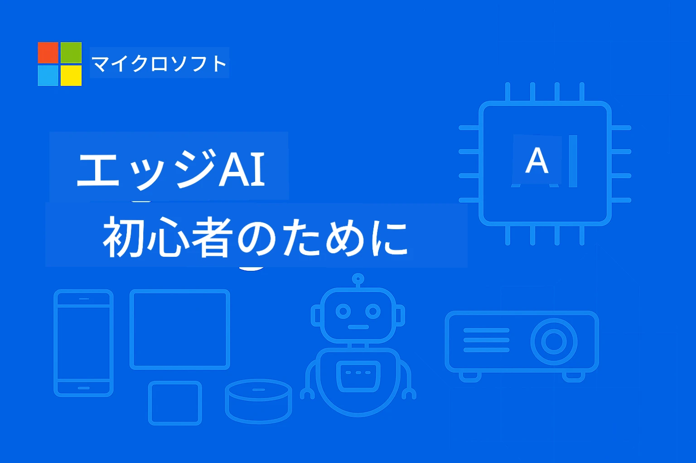

<!--
CO_OP_TRANSLATOR_METADATA:
{
  "original_hash": "ac31463ae3ed21a0ce83b0a351c23dd4",
  "translation_date": "2026-01-05T09:09:19+00:00",
  "source_file": "README.md",
  "language_code": "ja"
}
-->
# 初心者のためのEdgeAI




[](https://GitHub.com/microsoft/edgeai-for-beginners/graphs/contributors)
[](https://GitHub.com/microsoft/edgeai-for-beginners/issues)
[](https://GitHub.com/microsoft/edgeai-for-beginners/pulls)
[](http://makeapullrequest.com)

[](https://GitHub.com/microsoft/edgeai-for-beginners/watchers)
[](https://GitHub.com/microsoft/edgeai-for-beginners/fork)
[](https://GitHub.com/microsoft/edgeai-for-beginners/stargazers)


[](https://discord.gg/nTYy5BXMWG)

これらのリソースを使い始める手順は以下の通りです：

1. **リポジトリをフォーク**: クリック [](https://GitHub.com/microsoft/edgeai-for-beginners/fork)
2. **リポジトリをクローン**: `git clone https://github.com/microsoft/edgeai-for-beginners.git`
3. [**Azure AI Foundry Discord に参加して専門家や開発者仲間と出会う**](https://discord.com/invite/ByRwuEEgH4)


### 🌐 多言語対応

#### GitHub Actionを通じて対応（自動かつ常に最新）

<!-- CO-OP TRANSLATOR LANGUAGES TABLE START -->
[アラビア語](../ar/README.md) | [ベンガル語](../bn/README.md) | [ブルガリア語](../bg/README.md) | [ミャンマー語（ビルマ語）](../my/README.md) | [中国語（簡体字）](../zh/README.md) | [中国語（繁体字・香港）](../hk/README.md) | [中国語（繁体字・マカオ）](../mo/README.md) | [中国語（繁体字・台湾）](../tw/README.md) | [クロアチア語](../hr/README.md) | [チェコ語](../cs/README.md) | [デンマーク語](../da/README.md) | [オランダ語](../nl/README.md) | [エストニア語](../et/README.md) | [フィンランド語](../fi/README.md) | [フランス語](../fr/README.md) | [ドイツ語](../de/README.md) | [ギリシャ語](../el/README.md) | [ヘブライ語](../he/README.md) | [ヒンディー語](../hi/README.md) | [ハンガリー語](../hu/README.md) | [インドネシア語](../id/README.md) | [イタリア語](../it/README.md) | [日本語](./README.md) | [カンナダ語](../kn/README.md) | [韓国語](../ko/README.md) | [リトアニア語](../lt/README.md) | [マレー語](../ms/README.md) | [マラヤーラム語](../ml/README.md) | [マラーティー語](../mr/README.md) | [ネパール語](../ne/README.md) | [ナイジェリア・ピジン](../pcm/README.md) | [ノルウェー語](../no/README.md) | [ペルシア語（ファルシ）](../fa/README.md) | [ポーランド語](../pl/README.md) | [ポルトガル語（ブラジル）](../br/README.md) | [ポルトガル語（ポルトガル）](../pt/README.md) | [パンジャブ語（グルムキー）](../pa/README.md) | [ルーマニア語](../ro/README.md) | [ロシア語](../ru/README.md) | [セルビア語（キリル文字）](../sr/README.md) | [スロバキア語](../sk/README.md) | [スロベニア語](../sl/README.md) | [スペイン語](../es/README.md) | [スワヒリ語](../sw/README.md) | [スウェーデン語](../sv/README.md) | [タガログ語（フィリピン語）](../tl/README.md) | [タミル語](../ta/README.md) | [テルグ語](../te/README.md) | [タイ語](../th/README.md) | [トルコ語](../tr/README.md) | [ウクライナ語](../uk/README.md) | [ウルドゥー語](../ur/README.md) | [ベトナム語](../vi/README.md)

> **ローカルでクローンしたいですか？**

> このリポジトリには50以上の言語翻訳が含まれており、ダウンロードサイズが大幅に増加します。翻訳なしでクローンするには、スパースチェックアウトを使用してください：
> ```bash
> git clone --filter=blob:none --sparse https://github.com/microsoft/edgeai-for-beginners.git
> cd edgeai-for-beginners
> git sparse-checkout set --no-cone '/*' '!translations' '!translated_images'
> ```
> これにより、コース完了に必要なすべてがより高速なダウンロードで手に入ります。
<!-- CO-OP TRANSLATOR LANGUAGES TABLE END -->

**追加の翻訳言語を希望する場合は、[こちら](https://github.com/Azure/co-op-translator/blob/main/getting_started/supported-languages.md)にリストされています**
## はじめに

**初心者のためのEdgeAI**へようこそ。これは、Edge人工知能という変革的な世界への包括的な旅です。このコースは強力なAIの能力と、実際のエッジデバイスへの実用的な展開のギャップを埋め、データが生成され意思決定が必要な場所で直接AIの潜在能力を活用する方法を習得できます。

### 習得できる内容

このコースでは、基本概念から実運用までの実装をカバー：
- **エッジ展開に最適化された小規模言語モデル（SLM）**
- **多様なプラットフォームに対応したハードウェア認識最適化**
- **プライバシー保護機能付きリアルタイム推論**
- **企業向けの実運用展開戦略**

### なぜEdgeAIが重要なのか

エッジAIは、以下の現代的な重要課題に対処するパラダイムシフトです：
- **プライバシーとセキュリティ**：クラウドに送らずに機密データをローカルで処理
- **リアルタイム性能**：時間が重要なアプリでネットワーク遅延を排除
- **コスト効率**：帯域幅やクラウド計算費用の削減
- **耐障害性**：ネットワーク障害時も機能を維持
- **規制準拠**：データ主権要件を満たす

### エッジAIとは

エッジAIは、クラウドリソースに頼らずに、データが生成される場所近くのハードウェア上でAIアルゴリズムや言語モデルを動作させることを指します。遅延を削減し、プライバシーを強化し、リアルタイム意思決定を可能にします。

### 主要原則：
- **オンデバイス推論**：AIモデルがエッジデバイス（スマホ、ルーター、マイコン、産業用PC）上で動作
- **オフライン機能**：常時インターネット接続なしで動作可能
- **低遅延**：リアルタイムシステムに適した即時応答
- **データ主権**：機密データをローカルに保持しセキュリティとコンプライアンス向上

### 小規模言語モデル（SLM）

Phi-4、Mistral-7B、GemmaのようなSLMは、大規模言語モデル（LLM）の最適化版であり、以下を目的にトレーニングまたは蒸留されています：
- **メモリ使用量削減**：エッジデバイスの限られたメモリを効率的に活用
- **計算負荷の軽減**：CPUやエッジGPU性能に最適化
- **起動時間の短縮**：応答性の高いアプリのための高速初期化

これにより、以下の制約を満たしつつ強力なNLP機能を解放します：
- **組み込みシステム**：IoTデバイスや産業用コントローラー
- **モバイルデバイス**：オフライン対応のスマホやタブレット
- **IoTデバイス**：資源が限られたセンサーやスマート機器
- **エッジサーバー**：限られたGPUリソースのローカル処理ユニット
- **パーソナルコンピューター**：デスクトップやノートPCでの展開

## コースモジュールとナビゲーション

| モジュール | トピック | フォーカス領域 | 主要内容 | レベル | 期間 |
|--------|-------|------------|-------------|--------|----------|
| [📖 00 ](./introduction.md) | [EdgeAI入門](./introduction.md) | 基礎と背景 | EdgeAI概要・業界応用・SLM紹介・学習目標 | 初心者 | 1-2時間 |
| [📚 01](../../Module01) | [EdgeAI基礎](./Module01/README.md) | クラウドとエッジAI比較 | EdgeAI基礎・実ケーススタディ・実装ガイド・エッジ展開 | 初心者 | 3-4時間 |
| [🧠 02](../../Module02) | [SLMモデル基礎](./Module02/README.md) | モデルファミリーと構造 | Phiファミリー・Qwenファミリー・Gemmaファミリー・BitNET・μModel・Phi-Silica | 初心者 | 4-5時間 |
| [🚀 03](../../Module03) | [SLM展開実習](./Module03/README.md) | ローカル＆クラウド展開 | 高度な学習・ローカル環境・クラウド展開 | 中級者 | 4-5時間 |
| [⚙️ 04](../../Module04) | [モデル最適化ツールキット](./Module04/README.md) | クロスプラットフォーム最適化 | 入門・Llama.cpp・Microsoft Olive・OpenVINO・Apple MLX・ワークフロー統合 | 中級者 | 5-6時間 |
| [🔧 05](../../Module05) | [SLMOps実運用](./Module05/README.md) | 運用全般 | SLMOps入門・モデル蒸留・ファインチューニング・実運用展開 | 上級者 | 5-6時間 |
| [🤖 06](../../Module06) | [AIエージェント＆関数呼び出し](./Module06/README.md) | エージェントフレームワーク＆MCP | エージェント入門・関数呼び出し・モデルコンテキストプロトコル | 上級者 | 4-5時間 |
| [💻 07](../../Module07) | [プラットフォーム実装](./Module07/README.md) | クロスプラットフォームサンプル | AIツールキット・Foundry Local・Windows開発 | 上級者 | 3-4時間 |
| [🏭 08](../../Module08) | [Foundry Localツールキット](./Module08/README.md) | 実運用対応サンプル | サンプルアプリケーション（詳細は下記参照） | 専門家 | 8-10時間 |

### 🏭 **モジュール08：サンプルアプリケーション**

- [01: RESTチャットクイックスタート](./Module08/samples/01/README.md)
- [02: OpenAI SDK統合](./Module08/samples/02/README.md)
- [03: モデル探索＆ベンチマーク](./Module08/samples/03/README.md)
- [04: Chainlit RAGアプリケーション](./Module08/samples/04/README.md)
- [05: マルチエージェントオーケストレーション](./Module08/samples/05/README.md)
- [06: モデルズ・アズ・ツールズルーター](./Module08/samples/06/README.md)
- [07: 直接APIクライアント](./Module08/samples/07/README.md)
- [08: Windows 11チャットアプリ](./Module08/samples/08/README.md)
- [09: 高度なマルチエージェントシステム](./Module08/samples/09/README.md)
- [10: Foundryツールフレームワーク](./Module08/samples/10/README.md)

### 🎓 **ワークショップ：実践的学習パス**

実運用に即したハンズオンワークショップ教材：

- **[ワークショップガイド](./Workshop/Readme.md)** - 学習目標、成果物、リソースナビゲーション全体
- **Pythonサンプル**（6セッション） - ベストプラクティス、エラーハンドリング、詳細ドキュメントを更新
- **Jupyterノートブック**（8インタラクティブ） - ステップバイステップチュートリアル、ベンチマーク、パフォーマンス監視付き
- **セッションガイド** - 各ワークショップセッションの詳細なマークダウンガイド
- **検証ツール** - コード品質検証とスモークテスト実行用スクリプト

**構築するもの：**
- ストリーミング対応のローカルAIチャットアプリ
- 品質評価付きRAGパイプライン（RAGAS）
- マルチモデルベンチマーク＆比較ツール
- マルチエージェントオーケストレーションシステム
- タスクベース選択のインテリジェントモデルルーティング

### 🎙️ **Agenticワークショップ：実践 - AIポッドキャストスタジオ**

AI駆動のポッドキャスト制作パイプラインを一から構築！この没入型ワークショップでは、アイデアをプロフェッショナルなポッドキャストエピソードに変換する完全なマルチエージェントシステムの作り方を学びます。
**[🎬 AIポッドキャストスタジオワークショップを始めましょう](./WorkshopForAgentic/README.md)**

**あなたのミッション**：「Future Bytes」を立ち上げる — あなた自身が構築するAIエージェントによって完全に運営されるテックポッドキャスト。クラウド依存なし、API費用なし — すべてあなたのマシン上でローカルに動作します。

**これがユニークな理由:**
- **🤖 真のマルチエージェントオーケストレーション** - 調査、執筆、オーディオ制作を行う専門AIエージェントを構築
- **🎯 完全な制作パイプライン** - トピック選定から最終ポッドキャスト音声出力まで
- **💻 100％ローカル展開** - Ollamaとローカルモデル（Qwen-3-8B）を使用し、完全なプライバシーと制御を実現
- **🎤 テキスト音声変換統合** - スクリプトを自然な多人数会話に変換
- **✋ 人間の参加を含むワークフロー** - 承認ゲートで自動化を維持しながら品質を確保

**三幕学習の旅:**

| 幕 | フォーカス | 重要スキル | 期間 |
|-----|-------|------------|----------|
| **[第1幕: AIアシスタントと出会う](./WorkshopForAgentic/md/01.BuildAIAgentWithSLM.md)** | 最初のAIエージェントを構築 | ツール統合・ウェブ検索・問題解決・エージェント推論 | 2-3時間 |
| **[第2幕: 制作チームを編成する](./WorkshopForAgentic/md/02.AIAgentOrchestrationAndWorkflows.md)** | 複数エージェントのオーケストレーション | チーム調整・承認ワークフロー・DevUIインターフェース・人間の監視 | 3-4時間 |
| **[第3幕: ポッドキャストを具現化する](./WorkshopForAgentic/md/03.Multi-SpeakerPodcastGenerationWithVibeVoice.md)** | ポッドキャスト音声を生成 | テキスト音声変換・多人数合成・長尺オーディオ・フル自動化 | 2-3時間 |

**使用技術:**
- **Microsoft Agent Framework** - マルチエージェントのオーケストレーションと調整
- **Ollama** - ローカルAIモデルランタイム（クラウド不要）
- **Qwen-3-8B** - エージェントタスク最適化オープンソース言語モデル
- **テキスト音声API** - ポッドキャスト生成のための自然音声合成

**ハードウェアサポート:**
- ✅ **CPUモード** - 最新のパソコンなら動作（8GB以上のメモリ推奨）
- 🚀 **GPUアクセラレーション** - NVIDIA/AMD GPUで大幅高速推論
- ⚡ **NPU対応** - 次世代ニューラルプロセッシングユニットによる加速

**こんな方に最適:**
- マルチエージェントAIシステムを学ぶ開発者
- AI自動化とワークフローに興味がある方
- AI支援制作に取り組みたいコンテンツクリエイター
- 実践的なAIオーケストレーションを学ぶ学生

**構築を始める**: [🎙️ AIポッドキャストスタジオワークショップ →](./WorkshopForAgentic/README.md)

### 📊 **学習パスの概要**
- **合計期間**: 36-45時間
- **初心者パス**: モジュール01-02 (7-9時間)  
- **中級者パス**: モジュール03-04 (9-11時間)
- **上級者パス**: モジュール05-07 (12-15時間)
- **エキスパートパス**: モジュール08 (8-10時間)

## あなたが作るもの

### 🎯 コアコンピテンシー
- **エッジAIアーキテクチャ**：クラウド統合を伴うローカルファーストAIシステム設計
- **モデル最適化**：エッジ展開のための量子化および圧縮（85％の速度向上、75％のサイズ削減）
- **マルチプラットフォーム展開**：Windows、モバイル、組み込み、クラウドエッジハイブリッド
- **運用実務**：エッジAIの監視、スケーリング、メンテナンス

### 🏗️ 実践プロジェクト
- **Foundry Localチャットアプリ**：モデル切り替え対応のWindows 11ネイティブアプリケーション
- **マルチエージェントシステム**：複雑なワークフロー向けのチームコーディネーターと専門エージェント  
- **RAGアプリケーション**：ローカル文書処理とベクトル検索
- **モデルルーター**：タスク分析に基づくモデル選択
- **APIフレームワーク**：ストリーミングとヘルスモニタリング対応の本番対応クライアント
- **クロスプラットフォームツール**：LangChain／Semantic Kernel統合パターン

### 🏢 業界応用
**製造業** • **ヘルスケア** • **自動運転車** • **スマートシティ** • **モバイルアプリ**

## クイックスタート

**推奨学習パス**（合計20-30時間）:

0. **📖 入門** ([Introduction.md](./introduction.md))：EdgeAIの基礎＋業界コンテキスト＋学習フレームワーク
1. **📚 基礎**（モジュール01-02）：EdgeAI概念＋SLMモデルファミリー
2. **⚙️ 最適化**（モジュール03-04）：展開＋量子化フレームワーク  
3. **🚀 本番運用**（モジュール05-06）：SLMOps＋AIエージェント＋関数呼び出し
4. **💻 実装**（モジュール07-08）：プラットフォームサンプル＋Foundry Localツールキット

各モジュールに理論、実践演習、本番対応コードサンプルが含まれます。

## キャリアへの影響

**技術職種**：EdgeAIソリューションアーキテクト • MLエンジニア（エッジ） • IoT AI開発者 • モバイルAI開発者

**業界分野**：製造4.0 • ヘルステック • 自律システム • フィンテック • コンシューマーエレクトロニクス

**ポートフォリオプロジェクト**：マルチエージェントシステム • 本番RAGアプリ • クロスプラットフォーム展開 • パフォーマンス最適化

## リポジトリ構成

```
edgeai-for-beginners/
├── 📖 introduction.md  # Foundation: EdgeAI Overview & Learning Framework
├── 📚 Module01-04/     # Fundamentals → SLMs → Deployment → Optimization  
├── 🔧 Module05-06/     # SLMOps → AI Agents → Function Calling
├── 💻 Module07/        # Platform Samples (VS Code, Windows, Jetson, Mobile)
├── 🏭 Module08/        # Foundry Local Toolkit + 10 Comprehensive Samples
│   ├── samples/01-06/  # Foundation: REST, SDK, RAG, Agents, Routing
│   └── samples/07-10/  # Advanced: API Client, Windows App, Enterprise Agents, Tools
├── 🌐 translations/    # Multi-language support (8+ languages)
└── 📋 STUDY_GUIDE.md   # Structured learning paths & time allocation
```

## コースのハイライト

✅ **段階的学習**：理論 → 実践 → 本番展開  
✅ **実際の事例研究**：Microsoft、日本航空、企業導入事例  
✅ **ハンズオンサンプル**：50以上の例、10の包括的なFoundry Localデモ  
✅ **パフォーマンス重視**：85％の速度向上、75％のサイズ削減  
✅ **マルチプラットフォーム**：Windows、モバイル、組み込み、クラウドエッジハイブリッド  
✅ **本番対応**：監視、スケーリング、セキュリティ、コンプライアンスフレームワーク

📖 **[学習ガイドはこちら](STUDY_GUIDE.md)**：20時間の体系的な学習パス、時間配分ガイドと自己評価ツール付き。

---

**EdgeAIはAI展開の未来を象徴します**：ローカルファースト、プライバシー保持、効率的。これらのスキルを習得し次世代のインテリジェントアプリケーションを構築しましょう。

## 他のコース

当チームは他にもコースを制作しています！ぜひご覧ください:

<!-- CO-OP TRANSLATOR OTHER COURSES START -->
### LangChain
[](https://aka.ms/langchain4j-for-beginners)
[](https://aka.ms/langchainjs-for-beginners?WT.mc_id=m365-94501-dwahlin)

---

### Azure / Edge / MCP / エージェント
[](https://github.com/microsoft/AZD-for-beginners?WT.mc_id=academic-105485-koreyst)
[](https://github.com/microsoft/edgeai-for-beginners?WT.mc_id=academic-105485-koreyst)
[](https://github.com/microsoft/mcp-for-beginners?WT.mc_id=academic-105485-koreyst)
[](https://github.com/microsoft/ai-agents-for-beginners?WT.mc_id=academic-105485-koreyst)

---
 
### 生成AIシリーズ
[](https://github.com/microsoft/generative-ai-for-beginners?WT.mc_id=academic-105485-koreyst)
[-9333EA?style=for-the-badge&labelColor=E5E7EB&color=9333EA)](https://github.com/microsoft/Generative-AI-for-beginners-dotnet?WT.mc_id=academic-105485-koreyst)
[-C084FC?style=for-the-badge&labelColor=E5E7EB&color=C084FC)](https://github.com/microsoft/generative-ai-for-beginners-java?WT.mc_id=academic-105485-koreyst)
[-E879F9?style=for-the-badge&labelColor=E5E7EB&color=E879F9)](https://github.com/microsoft/generative-ai-with-javascript?WT.mc_id=academic-105485-koreyst)

---
 
### コア学習
[](https://aka.ms/ml-beginners?WT.mc_id=academic-105485-koreyst)
[](https://aka.ms/datascience-beginners?WT.mc_id=academic-105485-koreyst)
[](https://aka.ms/ai-beginners?WT.mc_id=academic-105485-koreyst)
[](https://github.com/microsoft/Security-101?WT.mc_id=academic-96948-sayoung)
[](https://aka.ms/webdev-beginners?WT.mc_id=academic-105485-koreyst)
[](https://aka.ms/iot-beginners?WT.mc_id=academic-105485-koreyst)
[](https://github.com/microsoft/xr-development-for-beginners?WT.mc_id=academic-105485-koreyst)

---
 
### Copilotシリーズ
[](https://aka.ms/GitHubCopilotAI?WT.mc_id=academic-105485-koreyst)
[](https://github.com/microsoft/mastering-github-copilot-for-dotnet-csharp-developers?WT.mc_id=academic-105485-koreyst)
[](https://github.com/microsoft/CopilotAdventures?WT.mc_id=academic-105485-koreyst)
<!-- CO-OP TRANSLATOR OTHER COURSES END -->

## ヘルプを得る

AIアプリの構築で行き詰まったり質問がある場合は、参加してください：

[](https://discord.gg/nTYy5BXMWG)

製品のフィードバックやエラーについては、構築中に以下を訪問してください：

[](https://aka.ms/foundry/forum)

---

<!-- CO-OP TRANSLATOR DISCLAIMER START -->
**免責事項**：  
本書類はAI翻訳サービス[Co-op Translator](https://github.com/Azure/co-op-translator)を使用して翻訳されました。正確性を期しておりますが、自動翻訳には誤りや不正確な箇所が含まれる可能性があります。原文の言語による文書が正式な情報源としてご確認ください。重要な情報については、専門の翻訳者による翻訳をおすすめします。本翻訳の使用に起因するいかなる誤解や誤訳についても責任を負いかねます。
<!-- CO-OP TRANSLATOR DISCLAIMER END -->