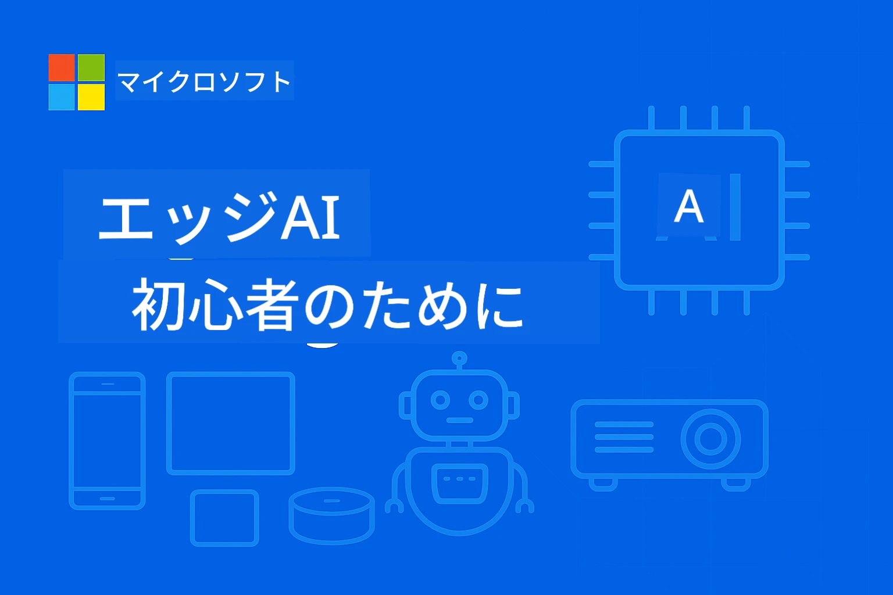

# EdgeAI for Beginners 




[](https://GitHub.com/microsoft/edgeai-for-beginners/graphs/contributors)
[](https://GitHub.com/microsoft/edgeai-for-beginners/issues)
[](https://GitHub.com/microsoft/edgeai-for-beginners/pulls)
[](http://makeapullrequest.com)

[](https://GitHub.com/microsoft/edgeai-for-beginners/watchers)
[](https://GitHub.com/microsoft/edgeai-for-beginners/fork)
[](https://GitHub.com/microsoft/edgeai-for-beginners/stargazers)


[](https://discord.gg/nTYy5BXMWG)

これらのリソースを使用開始するには、次の手順に従ってください：

1. <strong>リポジトリをフォーク</strong>: クリック [](https://GitHub.com/microsoft/edgeai-for-beginners/fork)
2. <strong>リポジトリをクローン</strong>:   `git clone https://github.com/microsoft/edgeai-for-beginners.git`
3. [**Azure AI Foundry Discordに参加し、専門家や他の開発者と交流する**](https://discord.com/invite/ByRwuEEgH4)


### 🌐 多言語対応

#### GitHub Actionを使用（自動かつ常に最新）

<!-- CO-OP TRANSLATOR LANGUAGES TABLE START -->
[Arabic](../ar/README.md) | [Bengali](../bn/README.md) | [Bulgarian](../bg/README.md) | [Burmese (Myanmar)](../my/README.md) | [Chinese (Simplified)](../zh-CN/README.md) | [Chinese (Traditional, Hong Kong)](../zh-HK/README.md) | [Chinese (Traditional, Macau)](../zh-MO/README.md) | [Chinese (Traditional, Taiwan)](../zh-TW/README.md) | [Croatian](../hr/README.md) | [Czech](../cs/README.md) | [Danish](../da/README.md) | [Dutch](../nl/README.md) | [Estonian](../et/README.md) | [Finnish](../fi/README.md) | [French](../fr/README.md) | [German](../de/README.md) | [Greek](../el/README.md) | [Hebrew](../he/README.md) | [Hindi](../hi/README.md) | [Hungarian](../hu/README.md) | [Indonesian](../id/README.md) | [Italian](../it/README.md) | [Japanese](./README.md) | [Kannada](../kn/README.md) | [Khmer](../km/README.md) | [Korean](../ko/README.md) | [Lithuanian](../lt/README.md) | [Malay](../ms/README.md) | [Malayalam](../ml/README.md) | [Marathi](../mr/README.md) | [Nepali](../ne/README.md) | [Nigerian Pidgin](../pcm/README.md) | [Norwegian](../no/README.md) | [Persian (Farsi)](../fa/README.md) | [Polish](../pl/README.md) | [Portuguese (Brazil)](../pt-BR/README.md) | [Portuguese (Portugal)](../pt-PT/README.md) | [Punjabi (Gurmukhi)](../pa/README.md) | [Romanian](../ro/README.md) | [Russian](../ru/README.md) | [Serbian (Cyrillic)](../sr/README.md) | [Slovak](../sk/README.md) | [Slovenian](../sl/README.md) | [Spanish](../es/README.md) | [Swahili](../sw/README.md) | [Swedish](../sv/README.md) | [Tagalog (Filipino)](../tl/README.md) | [Tamil](../ta/README.md) | [Telugu](../te/README.md) | [Thai](../th/README.md) | [Turkish](../tr/README.md) | [Ukrainian](../uk/README.md) | [Urdu](../ur/README.md) | [Vietnamese](../vi/README.md)

> **ローカルでクローンする方が良いですか？**
>
> このリポジトリには50以上の言語翻訳が含まれており、ダウンロードサイズが大幅に増加します。翻訳なしでクローンするにはスパースチェックアウトを使います：
>
> **Bash / macOS / Linux:**
> ```bash
> git clone --filter=blob:none --sparse https://github.com/microsoft/edgeai-for-beginners.git
> cd edgeai-for-beginners
> git sparse-checkout set --no-cone '/*' '!translations' '!translated_images'
> ```
>
> **CMD (Windows):**
> ```cmd
> git clone --filter=blob:none --sparse https://github.com/microsoft/edgeai-for-beginners.git
> cd edgeai-for-beginners
> git sparse-checkout set --no-cone "/*" "!translations" "!translated_images"
> ```
>
> これにより、より高速なダウンロードでコースの完遂に必要なすべてが得られます。
<!-- CO-OP TRANSLATOR LANGUAGES TABLE END -->

**追加の翻訳言語を希望する場合は、[こちら](https://github.com/Azure/co-op-translator/blob/main/getting_started/supported-languages.md)にリストがあります。**

## Introduction

<strong>EdgeAI for Beginners</strong>へようこそ—エッジ人工知能の変革的な世界への包括的な旅路です。このコースは、強力なAI機能とエッジデバイス上での実用的な実装の間のギャップを埋め、データが生成され意思決定が必要な場所で直接AIの可能性を活用できるようにします。

### 習得できること

このコースでは基礎概念から本番環境対応の実装まで取り扱い、以下をカバーします：
- エッジ展開に最適化された<strong>小型言語モデル（SLMs）</strong>
- 多様なプラットフォームでの<strong>ハードウェア対応最適化</strong>
- <strong>プライバシー保護機能付きのリアルタイム推論</strong>
- 企業向けの<strong>本番展開戦略</strong>

### なぜEdgeAIが重要なのか

Edge AIは現代の重要課題に取り組むパラダイムシフトを表します：
- <strong>プライバシーとセキュリティ</strong>：クラウドに依存せず敏感なデータをローカル処理
- <strong>リアルタイム性能</strong>：時間が重要なアプリケーションのためにネットワーク遅延を排除
- <strong>コスト効率</strong>：帯域幅やクラウドコンピューティング費用の削減
- <strong>堅牢な運用</strong>：ネットワーク障害時にも機能維持
- <strong>法令遵守</strong>：データ主権の要件を満たす

### Edge AIとは

Edge AIは、推論にクラウドリソースを使わず、データが生成される場所の近くでAIアルゴリズムや言語モデルをローカルハードウェア上で実行することを指します。遅延を減らし、プライバシーを強化し、リアルタイムの意思決定を可能にします。

### 基本原則：
- <strong>オンデバイス推論</strong>：AIモデルはエッジデバイス（スマホ、ルーター、マイコン、産業用PC）で実行
- <strong>オフライン対応</strong>：持続的なネット接続なしに動作
- <strong>低遅延</strong>：リアルタイムシステム向けの即時応答
- <strong>データ主権</strong>：重要なデータをローカルに保持し、セキュリティとコンプライアンスを向上

### 小型言語モデル(SLMs)

Phi-4、Mistral-7B、GemmaなどのSLMsは大規模言語モデル(LLMs)を最適化したもので、次の特徴を持ちます：
- <strong>メモリフットプリント削減</strong>：制限のあるエッジデバイスのメモリ効率向上
- <strong>計算負荷低減</strong>：CPUやエッジGPUに最適化
- <strong>高速起動</strong>：レスポンス良好なアプリケーション向けの素早い初期化

これにより以下の制約下で強力なNLP機能を解放します：
- <strong>組み込みシステム</strong>：IoTデバイスや産業コントローラー
- <strong>モバイルデバイス</strong>：オフライン対応のスマートフォンやタブレット
- **IoTデバイス**：リソース制限のあるセンサーやスマートデバイス
- <strong>エッジサーバー</strong>：制限あるGPUリソースのローカル処理ユニット
- <strong>パソコン</strong>：デスクトップやノートの展開シナリオ

## コースモジュールとナビゲーション

| モジュール | トピック | フォーカス領域 | キーコンテンツ | レベル | 所要時間 |
|--------|-------|------------|-------------|--------|----------|
| [📖 00 ](./introduction.md) | [EdgeAI紹介](./introduction.md) | 基礎＆背景 | EdgeAI概要・業界適用・SLM紹介・学習目標 | 初心者 | 1-2時間 |
| [📚 01](../../Module01) | [EdgeAI基礎](./Module01/README.md) | クラウド vs エッジAI比較 | EdgeAI基礎・実世界ケーススタディ・実装ガイド・エッジ展開 | 初心者 | 3-4時間 |
| [🧠 02](../../Module02) | [SLMモデル基礎](./Module02/README.md) | モデルファミリー＆アーキテクチャ | Phiファミリー・Qwenファミリー・Gemmaファミリー・BitNET・μModel・Phi-Silica | 初心者 | 4-5時間 |
| [🚀 03](../../Module03) | [SLM展開実践](./Module03/README.md) | ローカル＆クラウド展開 | 応用学習・ローカル環境・クラウド展開 | 中級 | 4-5時間 |
| [⚙️ 04](../../Module04) | [モデル最適化ツールキット](./Module04/README.md) | クロスプラットフォーム最適化 | 入門・Llama.cpp・Microsoft Olive・OpenVINO・Apple MLX・ワークフロー合成 | 中級 | 5-6時間 |
| [🔧 05](../../Module05) | [SLMOps本番運用](./Module05/README.md) | 本番運用 | SLMOps紹介・モデル蒸留・ファインチューニング・本番展開 | 上級 | 5-6時間 |
| [🤖 06](../../Module06) | [AIエージェント＆関数呼び出し](./Module06/README.md) | エージェントフレームワーク＆MCP | エージェント紹介・関数呼び出し・モデルコンテキストプロトコル | 上級 | 4-5時間 |
| [💻 07](../../Module07) | [プラットフォーム実装](./Module07/README.md) | クロスプラットフォームサンプル | AIツールキット・Foundry Local・Windows開発 | 上級 | 3-4時間 |
| [🏭 08](../../Module08) | [Foundry Localツールキット](./Module08/README.md) | 本番準備サンプル | サンプルアプリケーション（詳細は下記） | エキスパート | 8-10時間 |

### 🏭 **モジュール08: サンプルアプリケーション**

- [01: REST Chatクイックスタート](./Module08/samples/01/README.md)
- [02: OpenAI SDK統合](./Module08/samples/02/README.md)
- [03: モデル探索とベンチマーク](./Module08/samples/03/README.md)
- [04: Chainlit RAGアプリケーション](./Module08/samples/04/README.md)
- [05: マルチエージェントオーケストレーション](./Module08/samples/05/README.md)
- [06: Models-as-Toolsルーター](./Module08/samples/06/README.md)
- [07: 直接APIクライアント](./Module08/samples/07/README.md)
- [08: Windows 11チャットアプリ](./Module08/samples/08/README.md)
- [09: 高度なマルチエージェントシステム](./Module08/samples/09/README.md)
- [10: Foundryツールフレームワーク](./Module08/samples/10/README.md)

### 🎓 **ワークショップ: ハンズオン学習パス**

本番対応の実装を含む包括的なハンズオンワークショップ資料：

- **[ワークショップガイド](./Workshop/Readme.md)** - 完全な学習目標、成果、リソースナビ
- **Pythonサンプル**（6セッション） - ベストプラクティス、エラーハンドリング、詳細なドキュメント付きで更新
- **Jupyterノートブック**（8インタラクティブ） - ベンチマーク・パフォーマンス監視付きのステップバイステップチュートリアル
- <strong>セッションガイド</strong> - 各ワークショップセッションの詳細マークダウンガイド
- <strong>検証ツール</strong> - コード品質の検証およびスモークテスト用スクリプト

**構築するもの：**
- ストリーミング対応のローカルAIチャットアプリケーション
- 品質評価付きRAGパイプライン（RAGAS）
- マルチモデルベンチマークおよび比較ツール
- マルチエージェントオーケストレーションシステム
- タスクベース選択によるインテリジェントモデルルーティング

### 🎙️ **Agentic向けワークショップ：ハンズオン - AIポッドキャストスタジオ**
ゼロからAI搭載のポッドキャスト制作パイプラインを構築しよう！この没入型ワークショップでは、アイデアをプロフェッショナルなポッドキャストエピソードに変換する完全なマルチエージェントシステムの作り方を学べます。

**[🎬 AIポッドキャストスタジオワークショップを開始する](./WorkshopForAgentic/README.md)**

<strong>あなたのミッション</strong>：「Future Bytes」— 完全に自作のAIエージェントで運営されるテックポッドキャストを立ち上げよう。クラウド依存なし、APIコストなし、すべてローカルマシン上で動作します。

**これがユニークな理由：**
- **🤖 本物のマルチエージェントオーケストレーション** — リサーチ、執筆、音声制作を行う専門AIエージェントを構築
- **🎯 完全な制作パイプライン** — トピック選定から最終ポッドキャスト音声出力まで
- **💻 100％ローカル展開** — Ollamaとローカルモデル（Qwen-3-8B）を使用し完全なプライバシーと制御を実現
- **🎤 テキスト・トゥ・スピーチ統合** — スクリプトを自然なマルチスピーカー会話に変換
- **✋ ヒューマン・イン・ザ・ループワークフロー** — 承認ゲートで品質を担保しつつ自動化を維持

**三幕の学習ジャーニー：**

| 幕 | フォーカス | 主要スキル | 所要時間 |
|-----|-----------|------------|----------|
| **[第1幕：AIアシスタントと出会う](./WorkshopForAgentic/md/01.BuildAIAgentWithSLM.md)** | 最初のAIエージェントを構築 | ツール統合・ウェブ検索・課題解決・エージェンシック推論 | 2〜3時間 |
| **[第2幕：制作チームを編成](./WorkshopForAgentic/md/02.AIAgentOrchestrationAndWorkflows.md)** | 複数エージェントの連携管理 | チーム調整・承認ワークフロー・DevUIインターフェース・人間の監督 | 3〜4時間 |
| **[第3幕：ポッドキャストを完成させる](./WorkshopForAgentic/md/03.Multi-SpeakerPodcastGenerationWithVibeVoice.md)** | ポッドキャスト音声を生成 | テキスト・トゥ・スピーチ・マルチスピーカー合成・長尺音声・完全自動化 | 2〜3時間 |

**使用技術：**
- **Microsoft Agent Framework** — マルチエージェントのオーケストレーションと調整
- **Ollama** — ローカルAIモデルランタイム（クラウド不要）
- **Qwen-3-8B** — エージェントタスクに最適化されたオープンソース言語モデル
- **テキスト・トゥ・スピーチAPI** — ポッドキャスト生成のための自然な音声合成

**ハードウェア対応状況：**
- ✅ **CPUモード** — 最新のパソコンなら動作（8GB以上のRAM推奨）
- 🚀 **GPUアクセラレーション** — NVIDIA/AMD GPUで推論が大幅高速化
- ⚡ **NPUサポート** — 次世代ニューラルプロセッシングユニット対応

**こんな方に最適：**
- マルチエージェントAIシステムを学びたい開発者
- AI自動化やワークフローに興味がある方
- AI支援の制作を試したいコンテンツクリエイター
- 実践的なAIオーケストレーションを学ぶ学生

<strong>さあ始めよう</strong>：[🎙️ AIポッドキャストスタジオワークショップ →](./WorkshopForAgentic/README.md)

### 📊 <strong>学習パス概要</strong>
- <strong>合計所要時間</strong>：36〜45時間
- <strong>初心者パス</strong>：モジュール01-02（7〜9時間）  
- <strong>中級者パス</strong>：モジュール03-04（9〜11時間）
- <strong>上級者パス</strong>：モジュール05-07（12〜15時間）
- <strong>エキスパートパス</strong>：モジュール08（8〜10時間）

## あなたが作るもの

### 🎯 コアコンピテンシー
- **エッジAIアーキテクチャ**：ローカル優先のAIシステム設計とクラウド連携
- <strong>モデル最適化</strong>：エッジ展開のための量子化と圧縮（85％高速化、75％容量削減）
- <strong>マルチプラットフォーム展開</strong>：Windows、モバイル、組み込み、クラウドエッジのハイブリッド
- <strong>運用管理</strong>：エッジAIの監視、スケーリング、メンテナンス

### 🏗️ 実践プロジェクト
- **Foundry Localチャットアプリ**：Windows 11ネイティブアプリ、モデル切替対応
- <strong>マルチエージェントシステム</strong>：複雑なワークフローのコーディネーター＋専門エージェント
- **RAGアプリケーション**：ローカルドキュメント処理とベクトル検索
- <strong>モデルルーター</strong>：タスク解析によるモデル選択自動化
- **APIフレームワーク**：ストリーミング・ヘルスモニタリング対応の本格クライアント
- <strong>クロスプラットフォームツール</strong>：LangChain/Semantic Kernel統合パターン

### 🏢 業界応用例
<strong>製造業</strong>・<strong>ヘルスケア</strong>・<strong>自動運転</strong>・<strong>スマートシティ</strong>・<strong>モバイルアプリ</strong>

## クイックスタート

<strong>推奨学習パス</strong>（合計20〜30時間）：

0. **📖 はじめに** ([Introduction.md](./introduction.md))：EdgeAI基礎＋産業コンテキスト＋学習フレームワーク
1. **📚 ファンデーション**（モジュール01-02）：EdgeAIの概念＋SLMモデルファミリー
2. **⚙️ 最適化**（モジュール03-04）：展開＋量子化フレームワーク  
3. **🚀 運用**（モジュール05-06）：SLMOps＋AIエージェント＋関数呼び出し
4. **💻 実装**（モジュール07-08）：プラットフォームサンプル＋Foundry Localツールキット

各モジュールには理論、ハンズオン演習、本番コードサンプルを含みます。

## キャリアへの影響

<strong>技術職種</strong>：EdgeAIソリューションアーキテクト・MLエンジニア（エッジ）・IoT AI開発者・モバイルAI開発者

<strong>産業分野</strong>：製造業4.0・ヘルステック・自動システム・フィンテック・コンシューマーエレクトロニクス

<strong>ポートフォリオプロジェクト</strong>：マルチエージェントシステム・本番用RAGアプリ・クロスプラットフォーム展開・パフォーマンス最適化

## リポジトリ構成

```
edgeai-for-beginners/
├── 📖 introduction.md  # Foundation: EdgeAI Overview & Learning Framework
├── 📚 Module01-04/     # Fundamentals → SLMs → Deployment → Optimization  
├── 🔧 Module05-06/     # SLMOps → AI Agents → Function Calling
├── 💻 Module07/        # Platform Samples (VS Code, Windows, Jetson, Mobile)
├── 🏭 Module08/        # Foundry Local Toolkit + 10 Comprehensive Samples
│   ├── samples/01-06/  # Foundation: REST, SDK, RAG, Agents, Routing
│   └── samples/07-10/  # Advanced: API Client, Windows App, Enterprise Agents, Tools
├── 🌐 translations/    # Multi-language support (8+ languages)
└── 📋 STUDY_GUIDE.md   # Structured learning paths & time allocation
```

## コースの特徴

✅ <strong>段階的学習</strong>：理論 → 実践 → 本番展開  
✅ <strong>実際の事例</strong>：Microsoft、日本航空、企業展開事例  
✅ <strong>ハンズオンサンプル</strong>：50以上の例、10の包括的Foundry Localデモ  
✅ <strong>性能改善重視</strong>：85％高速化、75％サイズ削減  
✅ <strong>マルチプラットフォーム</strong>：Windows、モバイル、組み込み、クラウドエッジハイブリッド  
✅ <strong>本番対応</strong>：監視、スケール、セキュリティ、コンプライアンスフレームワーク

📖 **[学習ガイドあり](STUDY_GUIDE.md)**：20時間の構造化された学習パス、時間配分と自己評価ツール付き。

---

**EdgeAIはAI展開の未来を示します**：ローカル優先、プライバシー保護、高効率。このスキルを習得し、次世代のインテリジェントアプリを作りましょう。

## 他のコース

私たちのチームは他にもコースを制作しています！ぜひご覧ください：

<!-- CO-OP TRANSLATOR OTHER COURSES START -->
### LangChain
[](https://aka.ms/langchain4j-for-beginners)
[](https://aka.ms/langchainjs-for-beginners?WT.mc_id=m365-94501-dwahlin)
[](https://github.com/microsoft/langchain-for-beginners?WT.mc_id=m365-94501-dwahlin)
---

### Azure / Edge / MCP / Agents
[](https://github.com/microsoft/AZD-for-beginners?WT.mc_id=academic-105485-koreyst)
[](https://github.com/microsoft/edgeai-for-beginners?WT.mc_id=academic-105485-koreyst)
[](https://github.com/microsoft/mcp-for-beginners?WT.mc_id=academic-105485-koreyst)
[](https://github.com/microsoft/ai-agents-for-beginners?WT.mc_id=academic-105485-koreyst)

---
 
### ジェネレーティブAIシリーズ
[](https://github.com/microsoft/generative-ai-for-beginners?WT.mc_id=academic-105485-koreyst)
[-9333EA?style=for-the-badge&labelColor=E5E7EB&color=9333EA)](https://github.com/microsoft/Generative-AI-for-beginners-dotnet?WT.mc_id=academic-105485-koreyst)
[-C084FC?style=for-the-badge&labelColor=E5E7EB&color=C084FC)](https://github.com/microsoft/generative-ai-for-beginners-java?WT.mc_id=academic-105485-koreyst)
[-E879F9?style=for-the-badge&labelColor=E5E7EB&color=E879F9)](https://github.com/microsoft/generative-ai-with-javascript?WT.mc_id=academic-105485-koreyst)

---
 
### コアラーニング
[](https://aka.ms/ml-beginners?WT.mc_id=academic-105485-koreyst)
[](https://aka.ms/datascience-beginners?WT.mc_id=academic-105485-koreyst)
[](https://aka.ms/ai-beginners?WT.mc_id=academic-105485-koreyst)
[](https://github.com/microsoft/Security-101?WT.mc_id=academic-96948-sayoung)
[](https://aka.ms/webdev-beginners?WT.mc_id=academic-105485-koreyst)
[](https://aka.ms/iot-beginners?WT.mc_id=academic-105485-koreyst)
[](https://github.com/microsoft/xr-development-for-beginners?WT.mc_id=academic-105485-koreyst)

---
 
### Copilot シリーズ
[](https://aka.ms/GitHubCopilotAI?WT.mc_id=academic-105485-koreyst)
[](https://github.com/microsoft/mastering-github-copilot-for-dotnet-csharp-developers?WT.mc_id=academic-105485-koreyst)
[](https://github.com/microsoft/CopilotAdventures?WT.mc_id=academic-105485-koreyst)
<!-- CO-OP TRANSLATOR OTHER COURSES END -->

## サポートの取得

AIアプリの構築で詰まったり質問がある場合は、以下に参加してください：

[](https://discord.gg/nTYy5BXMWG)

製品のフィードバックやエラーがある場合は、次をご覧ください：

[](https://aka.ms/foundry/forum)

---

<!-- CO-OP TRANSLATOR DISCLAIMER START -->
**免責事項**:  
本書類はAI翻訳サービス [Co-op Translator](https://github.com/Azure/co-op-translator) を使用して翻訳されています。正確性の確保に努めていますが、自動翻訳には誤りや不正確な箇所が含まれる可能性があることをご理解ください。原文の母国語版が公式な情報源とみなされます。重要な情報については、専門の人間による翻訳を推奨します。本翻訳の利用により生じた誤解や誤訳についての責任は負いかねます。
<!-- CO-OP TRANSLATOR DISCLAIMER END -->